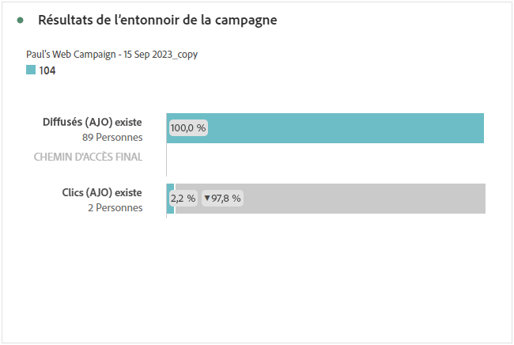
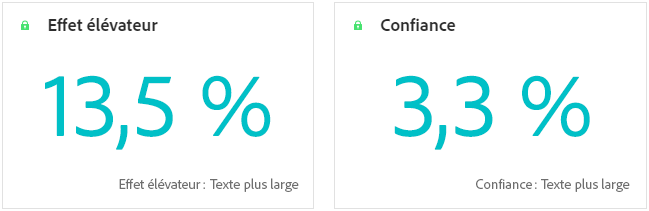
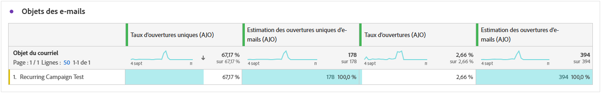
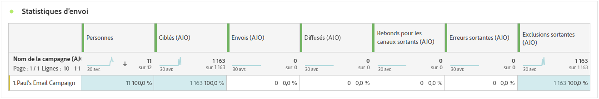
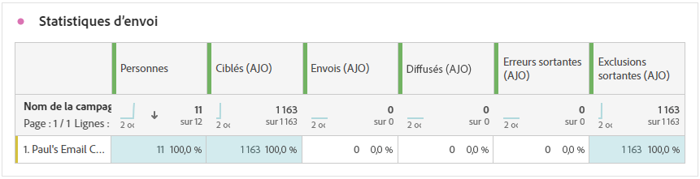
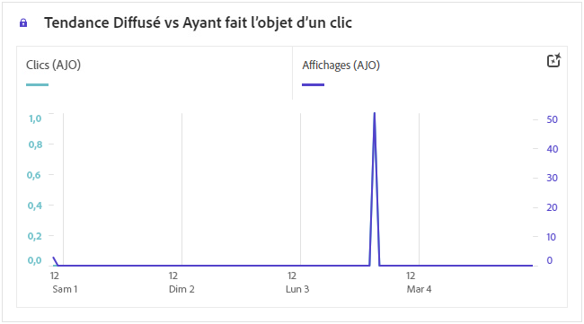
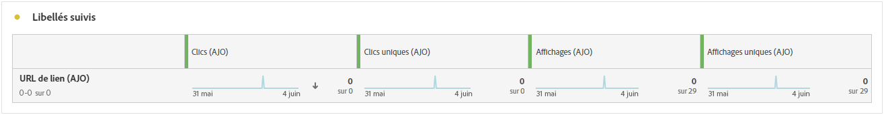

# Rapport de campagne {#campaign-global-report-cja}

La variable **Rapport de campagne** agit comme un tableau de bord complet qui fournit une analyse détaillée des mesures clés associées à votre campagne. Il comprend des données telles que le nombre de clics, les messages diffusés, les numéros de profil et les actions entreprises. En offrant un aperçu complet de l’efficacité et des niveaux d’engagement de votre campagne, le rapport vous permet d’avoir une compréhension complète des performances globales de votre campagne.

Les rapports de campagne sont accessibles directement depuis votre campagne à l’aide de la fonction **[!UICONTROL Rapports]** bouton .

La variable **Rapport de campagne** s’affiche avec les onglets suivants en fonction du canal choisi :

* [Campaign](#campaign-global)
* [Expérimentation](#experimentation)
* [E-mail](#email-global)
* [SMS](#sms)
* [Notification push](#push-notification)
* [Courrier](#direct-mail)
* [Web](#web)

Pour en savoir plus sur Customer Journey Analytics Workspace et sur le filtrage et l’analyse des données, reportez-vous à la section [cette page](https://experienceleague.adobe.com/en/docs/analytics-platform/using/cja-workspace/home).

## Campaign {#campaign-global}

### IPC de campagne {#campaign-kpis}

La variable **[!UICONTROL Campagne]** Les indicateurs de performance clés (KPI) fonctionnent comme un tableau de bord global, fournissant une analyse des mesures essentielles associées à votre campagne. Cela inclut des détails tels que le nombre de clics et le nombre de messages diffusés, ce qui vous permet d’avoir un aperçu complet de l’efficacité et du niveau d’engagement de votre campagne.

Les indicateurs de performance clés varient en fonction des canaux utilisés dans votre campagne.

+++ En savoir plus sur les mesures des KPI Campaign

* **[!UICONTROL Taux de clics publicitaires]**: pourcentage d&#39;utilisateurs ayant interagi avec le message.

* **[!UICONTROL Clics]**: nombre de clics sur un contenu dans votre message.

* **[!UICONTROL Diffusés]** : nombre d’e-mails envoyés avec succès, par rapport au nombre total de messages envoyés.

* **[!UICONTROL Affichages]**: nombre d’ouvertures du message.

+++

### Vue d’ensemble de la campagne {#delivery-global}

La variable **[!UICONTROL Présentation de Campaign]** table sert de tableau de bord complet, avec une ventilation détaillée des mesures clés liées à votre campagne. La section contient des informations essentielles telles que le nombre de profils et les actions diffusées, ce qui vous permet de bien comprendre les performances de votre campagne et l’engagement avec celle-ci.

Notez que les mesures varient en fonction des canaux utilisés dans votre campagne.

+++ En savoir plus sur les mesures de présentation de Campaign

* **[!UICONTROL Personnes]**: nombre de profils utilisateur qui remplissent les critères de ciblage pour vos messages.

* **[!UICONTROL Taux de clics publicitaires]**: pourcentage d&#39;utilisateurs ayant interagi avec le message.

* **[!UICONTROL Clics]**: nombre de clics sur un contenu dans votre message.

* **[!UICONTROL Clics uniques]**: nombre de profils ayant cliqué sur un contenu de votre message.

* **[!UICONTROL Diffusés]** : nombre d’e-mails envoyés avec succès, par rapport au nombre total de messages envoyés.

* **[!UICONTROL Rebonds pour les canaux sortants]**: Nombre total d&#39;erreurs cumulées lors du processus d&#39;envoi et du traitement automatique des retours par rapport au nombre total de messages envoyés.

* **[!UICONTROL Erreurs sortantes]**: nombre total d&#39;erreurs qui se sont produites pendant le processus d&#39;envoi et qui l&#39;ont empêché d&#39;être envoyé aux profils.

* **[!UICONTROL Exclusions sortantes]**: nombre de profils qui ont été exclus par Adobe Journey Optimizer.

* **[!UICONTROL Affichages]**: nombre d’ouvertures du message.

* **[!UICONTROL Affichages uniques]**: nombre d&#39;ouvertures du message, plusieurs interactions d&#39;un profil ne sont pas prises en compte.

+++

### Entonnoir de résultats de la campagne {#campaign-funnel}

La variable **[!UICONTROL Résultats de l’entonnoir de campagne]** Le graphique présente une analyse détaillée de l’engagement de vos profils avec vos messages, en fournissant des informations précieuses sur la manière dont différents profils ont interagi avec votre contenu.

+++ En savoir plus sur les mesures de résultats de l’entonnoir de Campaign

* **[!UICONTROL Diffusés]** : nombre d’e-mails envoyés avec succès, par rapport au nombre total de messages envoyés.

* **[!UICONTROL Clics]**: nombre de clics sur un contenu dans votre message.
+++

### Libellé du lien suivi {#campaign-track}

La variable **[!UICONTROL Libellé du lien suivi]** table offre des informations essentielles sur l’engagement de vos visiteurs avec les URL incluses dans vos messages, fournissant des informations précieuses sur les liens qui attirent le plus d’interactions.

+++ En savoir plus sur les mesures d’étiquette de lien suivi

* **[!UICONTROL Clics uniques]**: nombre de profils ayant cliqué sur un contenu de votre message.

* **[!UICONTROL Clics]**: nombre de clics sur un contenu dans votre message.

+++

## Expérimentation {#experimentation}

L’onglet **[!UICONTROL Expérimentation]** fournit des informations clés sur les performances de chaque variante et identifie la variante la plus réussie.

Notez que la définition du meilleur performant peut prendre un certain temps. Si votre expérience échoue, elle est définie sur **Non concluant**.

### IPC d’expérience {#experimentation-kpis}

La variable **[!UICONTROL Expérience]** Les indicateurs de performance clés (IPC) fonctionnent comme un tableau de bord global, fournissant une analyse des mesures essentielles associées à votre expérimentation.

+++ En savoir plus sur les mesures des IPC d’expérience

* **[!UICONTROL Effet élévateur]**: mesure de l’amélioration en pourcentage du taux de conversion d’un traitement donné par rapport à la ligne de base.

* **[!UICONTROL Confiance]** : preuves qu’un traitement donné est le même que le traitement de la ligne de base. [En savoir plus](../content-management/experiment-calculations.md#understand-confidence)

+++

### Variante par clics entrants {#variant-inbound}

La variable **[!UICONTROL Variante par clics entrants]** décrit les performances de chaque variante.
Pour un examen approfondi de ces résultats et de leur interprétation, reportez-vous à [cette page](../content-management/get-started-experiment.md#interpret-results).

+++ En savoir plus sur les mesures Variante par clics entrants

* **[!UICONTROL Personnes]**: nombre de profils utilisateur qui remplissent les critères de ciblage pour vos messages.

* **[!UICONTROL Clics entrants]**: nombre total de clics sur les canaux sortants.

* **[!UICONTROL Taux de conversion]**: valeur totale de la mesure de succès, précédemment sélectionnée lors de la création de vos expériences, divisée par le nombre de profils.

* **[!UICONTROL Effet élévateur]**: mesure de l’amélioration en pourcentage du taux de conversion d’un traitement donné par rapport à la ligne de base.

* **[!UICONTROL Confiance]** : preuves qu’un traitement donné est le même que le traitement de la ligne de base. [En savoir plus](../content-management/experiment-calculations.md#understand-confidence)

<!--
* **[!UICONTROL Confidence Upper bound]**:
* **[!UICONTROL Confidence Lower bound]**:
-->
+++

### Taux de conversion des clics entrants {#conversion-rate}

Le graphe **[!UICONTROL Intervalle de confiance]** mesure l’incertitude quant à l’amélioration. Il indique la différence de performance en pourcentage entre la ligne de base et le traitement le plus performant. [En savoir plus](../content-management/experiment-calculations.md#confidence-intervals).

## E-mail {#email-global}

### Tendance des envois et des clics {#delivered-click}

La variable **[!UICONTROL Tendance des envois et des clics]** Le graphique présente une analyse détaillée de l’engagement de vos profils avec vos emails, offrant des informations précieuses sur la manière dont les profils interagissent avec votre contenu.

+++ En savoir plus sur les mesures de tendance Diffusion / Clic

* **[!UICONTROL Diffusés]** : nombre d’e-mails envoyés avec succès, par rapport au nombre total d’e-mails envoyés.

* **[!UICONTROL Clics]** : nombre de clics sur un contenu dans vos e-mails.

+++

### Statut de la diffusion {#delivery-status}

La variable **[!UICONTROL Etat de la diffusion]** Le graphique fournit une vue complète des données relatives aux emails envoyés dans votre campagne, ce qui vous permet d’obtenir des informations sur les mesures clés, telles que les envois et les bounces. Cela permet une analyse détaillée du processus d’envoi des emails, fournissant des informations précieuses sur l’efficacité et les performances de vos campagnes.

+++ En savoir plus sur les mesures de statut des diffusions

* **[!UICONTROL Diffusés]** : nombre d’e-mails envoyés avec succès, par rapport au nombre total d’e-mails envoyés.

* **[!UICONTROL Rebonds pour les canaux sortants]**: Nombre total d&#39;erreurs cumulées lors du processus d&#39;envoi et du traitement automatique des retours par rapport au nombre total de messages envoyés.

* **[!UICONTROL Erreur sortante]**: nombre total d&#39;erreurs qui se sont produites au cours d&#39;un processus d&#39;envoi qui l&#39;a empêché d&#39;être envoyé aux profils.

* **[!UICONTROL Exclusions sortantes]**: nombre de profils qui ont été exclus par Adobe Journey Optimizer.

+++

### Statistiques d’envoi {#sending-statistics-email}

La variable **[!UICONTROL Statistiques d’envoi]** Le tableau fournit un résumé complet des données essentielles concernant les emails dans vos campagnes. Il détaille les mesures clés, telles que les interactions avec vos emails et le nombre d’emails envoyés avec succès, ce qui vous permet d’obtenir des informations précieuses sur l’efficacité et la portée de vos emails et campagnes.

+++ En savoir plus sur les mesures des statistiques d’envoi

* **[!UICONTROL Personnes]**: nombre de profils utilisateur qui remplissent les critères de ciblage pour vos messages.

* **[!UICONTROL Ciblés]** : nombre total d’e-mails traités lors de la procédure d’envoi.

* **[!UICONTROL Envois]**: nombre total d’envois pour votre email.

* **[!UICONTROL Diffusés]** : nombre d’e-mails envoyés avec succès, par rapport au nombre total de messages envoyés.

* **[!UICONTROL Rebonds pour les canaux sortants]**: Nombre total d&#39;erreurs cumulées lors du processus d&#39;envoi et du traitement automatique des retours par rapport au nombre total de messages envoyés.

* **[!UICONTROL Erreurs sortantes]**: nombre total d&#39;erreurs qui se sont produites pendant le processus d&#39;envoi et qui l&#39;ont empêché d&#39;être envoyé aux profils.

* **[!UICONTROL Exclusions sortantes]**: nombre de profils qui ont été exclus par Adobe Journey Optimizer.

+++

### Statistiques de suivi {#tracking-statistics-email}

La variable **[!UICONTROL Email - Statistiques de tracking]** propose un compte-rendu détaillé de l&#39;activité de profil associée aux emails inclus dans votre campagne. Cela inclut des mesures sur les ouvertures, les clics et d’autres indicateurs d’engagement pertinents, offrant une vue d’ensemble complète de la manière dont les profils interagissent avec le contenu de vos e-mails.

+++ En savoir plus sur les mesures de statistiques de suivi

* **[!UICONTROL Taux de clics (CTR)]**: pourcentage d&#39;utilisateurs ayant interagi avec l&#39;email.

* **[!UICONTROL Taux d’ouverture des clics (CTOR)]**: nombre d’ouvertures de l’email.

* **[!UICONTROL Clics]** : nombre de clics sur un contenu dans vos e-mails.

* **[!UICONTROL Clics uniques]** : nombre de profils qui ont cliqué sur un contenu dans un e-mail.

* **[!UICONTROL Ouvertures de courrier électronique]**: nombre d’ouvertures de vos emails dans une campagne.

* **[!UICONTROL Ouvertures de courriers électroniques uniques]**: pourcentage d&#39;emails ouverts.

* **[!UICONTROL Plaintes contre le spam]** : nombre de fois où un message a été déclaré comme spam ou courrier indésirable.

* **[!UICONTROL Désabonnements]** : nombre de clics sur le lien de désabonnement.

+++

### Domaines d’e-mails {#email-domains}

La variable **[!UICONTROL Domaines de courriel]** table propose une ventilation détaillée des emails classés par domaine, fournissant des informations détaillées sur les mesures de performances de vos campagnes par email. Cette analyse exhaustive vous permet de comprendre le comportement de différents domaines en réponse au contenu de vos emails.

+++ En savoir plus sur les mesures Domaines d’email

* **[!UICONTROL Envois]**: nombre total d’envois pour votre email.

* **[!UICONTROL Diffusés]** : nombre d’e-mails envoyés avec succès, par rapport au nombre total d’e-mails envoyés.

* **[!UICONTROL Ouvertures de courrier électronique]**: nombre d’ouvertures de vos emails dans une campagne.

* **[!UICONTROL Clics]** : nombre de clics sur un contenu dans vos e-mails.

* **[!UICONTROL Rebonds pour les canaux sortants]**: Nombre total d&#39;erreurs cumulées lors du processus d&#39;envoi et du traitement automatique des retours par rapport au nombre total d&#39;emails envoyés.

* **[!UICONTROL Erreurs sortantes]**: nombre total d&#39;erreurs qui se sont produites pendant le processus d&#39;envoi et qui l&#39;ont empêché d&#39;être envoyé aux profils.
+++

### Libellés des liens de suivi {#track-link-label}

La variable **[!UICONTROL Libellés des liens suivis]** offre un aperçu complet des libellés des liens dans vos emails, en mettant en évidence ceux qui génèrent le plus fort trafic de visiteurs. Cette fonctionnalité vous permet d’identifier et de prioriser les liens les plus populaires.

+++ En savoir plus sur les mesures des étiquettes de lien suivi

* **[!UICONTROL Clics uniques]** : nombre de profils qui ont cliqué sur un contenu dans un e-mail.

* **[!UICONTROL Clics]** : nombre de clics sur un contenu dans vos e-mails.

+++

### URL des liens de suivi {#track-link-url}

La variable **[!UICONTROL URL des liens trackés]** Ce tableau présente une vue d’ensemble complète des URL de votre email qui attirent le plus de visiteurs. Cela vous permet d’identifier et de hiérarchiser les liens les plus populaires, ce qui améliore votre compréhension de l’engagement des profils avec du contenu spécifique dans vos e-mails.

+++ En savoir plus sur les mesures des URL de lien trackées

* **[!UICONTROL Clics uniques]** : nombre de profils qui ont cliqué sur un contenu dans un e-mail.

* **[!UICONTROL Clics]** : nombre de clics sur un contenu dans vos e-mails.

* **[!UICONTROL Affichages]**: nombre d’ouvertures de l’email.

* **[!UICONTROL Affichages uniques]**: nombre de fois que l&#39;email a été ouvert, plusieurs interactions d&#39;un profil ne sont pas prises en compte.

+++

### Objets des e-mails {#email-subjects}

La variable **[!UICONTROL Objets d&#39;email]** Le tableau présente un aperçu complet des sujets des emails qui ont attiré le plus grand trafic de visiteurs. Cette ressource offre des informations précieuses sur la dynamique d’engagement des audiences.

+++ En savoir plus sur les mesures des sujets des emails

* **[!UICONTROL Personnes]**: nombre de profils utilisateur qui remplissent les critères de ciblage pour vos emails.

+++

### Causes d’exclusion {#excluded-reasons}

La variable **[!UICONTROL Exclure des motifs]** le tableau présente une vue d’ensemble complète des différents facteurs qui ont entraîné l’exclusion des profils utilisateur de l’audience ciblée, ce qui a pour conséquence que le message n’a pas été reçu.

Consultez [cette page](exclusion-list.md) pour obtenir la liste complète des causes d’exclusion.

### Raisons de rebond {#bounce-reasons-email}

La variable **[!UICONTROL Motifs de rebond]** tableau compile les données disponibles relatives aux messages rebonds, fournissant des informations détaillées sur les raisons spécifiques des rebonds d’email.

Pour plus d’informations sur les rebonds, consultez la page [Liste de suppression](../reports/suppression-list.md).

### Raisons des erreurs {#error-reasons-email}

La variable **[!UICONTROL Raisons de l’erreur]** table offre une visibilité sur les erreurs spécifiques survenues pendant le processus d’envoi, fournissant des informations précieuses sur la nature et l’occurrence des erreurs.

## SMS {#sms}

### Tendance des envois et des clics {#delivered-click-sms}

La variable **[!UICONTROL Tendance des envois et des clics]** Le graphique présente une analyse détaillée de l’engagement de vos profils avec vos emails, offrant des informations précieuses sur la manière dont les profils interagissent avec votre contenu.

+++ En savoir plus sur les mesures de tendance Diffusion / Clic

* **[!UICONTROL Délivrés]**: nombre de SMS envoyés avec succès, par rapport au nombre total de SMS.

* **[!UICONTROL Clics]** : nombre de fois où un contenu a fait l’objet d’un clic dans vos SMS.

+++

### Statut de la diffusion {#delivery-status-sms}

La variable **[!UICONTROL Etat de la diffusion]** propose un compte-rendu détaillé de l&#39;activité de profil associée à vos campagnes SMS. Cela inclut des mesures sur les indicateurs d’engagement diffusés, les clics et autres, offrant une vue d’ensemble exhaustive de la manière dont les profils interagissent avec votre contenu SMS.

+++ En savoir plus sur les mesures de statut des diffusions

* **[!UICONTROL Délivrés]**: nombre de SMS envoyés avec succès, par rapport au nombre total de SMS.

* **[!UICONTROL Rebonds pour les canaux sortants]**: Nombre total d&#39;erreurs cumulées lors du processus d&#39;envoi et du traitement automatique des retours par rapport au nombre total de SMS envoyés.

* **[!UICONTROL Erreur sortante]**: nombre total d’erreurs qui se sont produites pour empêcher son envoi aux profils.

* **[!UICONTROL Exclusions sortantes]**: nombre de profils qui ont été exclus par Adobe Journey Optimizer.

+++

### Libellés des liens de suivi {#track-link-label-sms}

La variable **[!UICONTROL Libellés des liens suivis]** offre un aperçu complet des libellés des liens dans vos SMS, en mettant en évidence ceux qui génèrent le plus fort trafic de visiteurs. Cette fonctionnalité vous permet d’identifier et de prioriser les liens les plus populaires.

+++ En savoir plus sur les mesures des étiquettes de lien suivi

* **[!UICONTROL Clics uniques]**: nombre de profils ayant cliqué sur un contenu de votre SMS.

* **[!UICONTROL Clics]** : nombre de fois où un contenu a fait l’objet d’un clic dans vos SMS.

+++

### URL des liens de suivi {#track-link-url-sms}

La variable **[!UICONTROL URL des liens trackés]** Ce tableau présente une vue d’ensemble complète des URL de vos SMS qui attirent le plus de visiteurs. Cela vous permet d’identifier et de classer par priorité les liens les plus populaires, ce qui améliore votre compréhension de l’engagement des profils avec du contenu spécifique dans vos SMS.

+++ En savoir plus sur les mesures des URL de lien trackées

* **[!UICONTROL Clics uniques]**: nombre de profils ayant cliqué sur un contenu de votre SMS.

* **[!UICONTROL Clics]** : nombre de fois où un contenu a fait l’objet d’un clic dans vos SMS.

* **[!UICONTROL Affichages]**: nombre d’ouvertures du message.

* **[!UICONTROL Affichages uniques]**: nombre d&#39;ouvertures du message, plusieurs interactions d&#39;un profil ne sont pas prises en compte.

+++

### Message SMS entrant {#sms-inbound}

La variable **[!UICONTROL SMS entrant]** Le tableau présente un aperçu détaillé des SMS qui ont attiré le plus grand trafic de visiteurs. Cette ressource offre des informations précieuses sur la dynamique d’engagement des audiences.

+++ En savoir plus sur les mesures des messages entrants de SMS

* **[!UICONTROL Personnes]**: nombre de profils utilisateur qui remplissent les critères de ciblage pour vos SMS.

+++

### Type de message SMS {#sms-message-type}

La variable **[!UICONTROL Type de message SMS]** Le tableau présente une vue d’ensemble détaillée des types de SMS qui ont attiré le plus de trafic de visiteurs. Cette ressource offre des informations précieuses sur la dynamique d’engagement des audiences.

+++ En savoir plus sur les mesures de type Message SMS

* **[!UICONTROL Personnes]**: nombre de profils utilisateur qui remplissent les critères de ciblage pour vos SMS.

+++

### Fournisseurs de SMS {#sms-providers}

La variable **[!UICONTROL Fournisseurs de SMS]** Le tableau présente un aperçu détaillé des fournisseurs de SMS qui ont attiré le plus grand trafic de visiteurs. Cette ressource offre des informations précieuses sur la dynamique d’engagement des audiences.

+++ En savoir plus sur les mesures des fournisseurs de SMS

* **[!UICONTROL Personnes]**: nombre de profils utilisateur qui remplissent les critères de ciblage pour vos SMS.

+++

### Raisons des rebonds {#bounce-reasons-sms}

La variable **[!UICONTROL Raisons des rebonds]** Le tableau fournit un aperçu complet des données relatives aux messages SMS rebonds, fournissant des informations précieuses sur les raisons spécifiques à l’origine des rebonds de messages SMS.

### Raisons des erreurs {#error-reasons-sms}

La variable **[!UICONTROL Raisons de l’erreur]** vous permet d&#39;identifier les erreurs spécifiques qui se sont produites pendant le processus d&#39;envoi de vos SMS, ce qui facilite une analyse approfondie de tous les problèmes rencontrés.

### Raisons des exclusions {#excluded-reasons-sms}

La variable **[!UICONTROL Exclure les raisons]** Le tableau illustre visuellement les différents facteurs qui ont conduit à l’exclusion des profils utilisateur de l’audience ciblée, ce qui les empêche de recevoir vos SMS.

Consultez [cette page](exclusion-list.md) pour la liste complète des causes d’exclusion.

## Notification push {#push-notification}

### Statistiques d’envoi {#sending-statistics-push}

La variable **[!UICONTROL Statistiques d’envoi]** Le tableau fournit un résumé complet des données essentielles concernant vos campagnes de notification push. Il détaille les mesures clés, telles que la taille de l’audience ciblée et le nombre de notifications push diffusées avec succès, ce qui vous permet d’obtenir des informations précieuses sur l’efficacité et la portée de votre notification push.

+++ En savoir plus sur les mesures des statistiques d’envoi

* **[!UICONTROL Personnes]**: nombre de profils utilisateur qui remplissent les critères de ciblage pour vos notifications push.

* **[!UICONTROL Ciblées]** : nombre total de notifications push traitées lors de l’analyse.

* **[!UICONTROL Envois]**: nombre total d&#39;envois pour la notification push.

* **[!UICONTROL Délivrées]** : nombre de notifications push envoyées avec succès, par rapport au nombre total de notifications push envoyées.

* **[!UICONTROL Rebonds pour les canaux sortants]**: Nombre total d&#39;erreurs cumulées lors du processus d&#39;envoi et du traitement automatique des retours par rapport au nombre total de notifications push.

* **[!UICONTROL Erreur sortante]**: nombre total d’erreurs qui se sont produites pour empêcher son envoi aux profils.

* **[!UICONTROL Exclusions sortantes]**: nombre de profils qui ont été exclus par Adobe Journey Optimizer.

+++

### Statistiques de suivi {#tracking-statistics-push}

La variable **[!UICONTROL Statistiques de tracking]** le tableau offre un instantané détaillé de l’activité de profil liée à vos notifications push, fournissant des informations essentielles sur l’engagement et l’efficacité des notifications push.

+++ En savoir plus sur les mesures de statistiques de suivi

* **[!UICONTROL Taux de clics (CTR)]**: pourcentage d’utilisateurs ayant interagi avec les notifications push.

* **[!UICONTROL Taux d’ouverture des clics (CTOR)]**: nombre d’ouvertures des notifications push.

* **[!UICONTROL Clics]** : nombre de clics sur un contenu dans vos notifications push.

* **[!UICONTROL Clics uniques]**: nombre de profils ayant cliqué sur un contenu dans vos notifications push.

<!--
* **[!UICONTROL Push custom actions]**: 
-->
+++

### Libellés des liens de suivi {#track-link-label-push}

La variable **[!UICONTROL Libellés des liens suivis]** le tableau offre un aperçu complet des libellés des liens dans vos notifications push, en mettant en évidence ceux qui génèrent le plus fort trafic de visiteurs. Cette fonctionnalité vous permet d’identifier et de prioriser les liens les plus populaires.

+++ En savoir plus sur les mesures des étiquettes de lien suivi

* **[!UICONTROL Clics uniques]**: nombre de profils ayant cliqué sur un contenu dans vos notifications push.

* **[!UICONTROL Clics]** : nombre de clics sur un contenu dans vos notifications push.

+++

### URL des liens de suivi {#track-link-url-push}

La variable **[!UICONTROL URL des liens trackés]** Ce tableau présente une vue d’ensemble complète des URL de vos notifications push qui attirent le plus de visiteurs. Cela vous permet d’identifier et de classer par priorité les liens les plus populaires, ce qui vous permet de mieux comprendre l’engagement des profils avec du contenu spécifique dans vos notifications push.

+++ En savoir plus sur les mesures des URL de lien trackées

* **[!UICONTROL Clics uniques]**: nombre de profils ayant cliqué sur un contenu dans vos notifications push.

* **[!UICONTROL Clics]** : nombre de clics sur un contenu dans vos notifications push.

+++

### Raisons des rebonds {#bounce-reasons-push}

La variable **[!UICONTROL Raisons des rebonds]** Le tableau fournit un aperçu complet des données relatives aux notifications push rebondies, fournissant des informations précieuses sur les raisons spécifiques à l’origine des bounces des notifications push.

### Raisons des erreurs {#error-reasons-push}

La variable **[!UICONTROL Raisons de l’erreur]** vous permet d’identifier les erreurs spécifiques qui se sont produites pendant le processus d’envoi de vos notifications push, ce qui facilite l’analyse approfondie de tous les problèmes rencontrés.

### Causes d’exclusion {#exclude-reasons-push}

La variable **[!UICONTROL Exclure les raisons]** Le tableau illustre visuellement les différents facteurs qui ont conduit à l’exclusion des profils utilisateur de l’audience ciblée, ce qui les empêche de recevoir vos notifications push.

Consultez [cette page](exclusion-list.md) pour la liste complète des causes d’exclusion.

## In-app {#in-app}

### Tendance des impressions et des clics {#impression-click-trend}

La variable **[!UICONTROL Tendance des impressions et des clics]** Le graphique présente une analyse détaillée de l’engagement de vos profils avec vos messages in-app, en fournissant des informations précieuses sur la manière dont les profils interagissent avec votre contenu.

+++ En savoir plus sur les mesures de tendance Impression et clic

* **[!UICONTROL Clics]**: nombre de clics sur un contenu dans vos messages In-App.

* **[!UICONTROL Affichages]**: nombre d’ouvertures du message.

+++

### Clics {#clicks-inapp}

La variable **[!UICONTROL Clics]** Le graphique affiche les mesures des clics In-App, qui illustrent à la fois le nombre total de clics sur le contenu et le nombre de profils uniques ayant cliqué sur le contenu.

+++ En savoir plus sur les mesures de clics

* **[!UICONTROL Clics uniques]**: nombre de profils ayant cliqué sur un contenu dans vos messages in-app

* **[!UICONTROL Clics]**: nombre de clics sur un contenu dans vos messages In-App.

+++

### Affichage {#display-inapp}

La variable **[!UICONTROL Affichages]** Le graphique vous permet de comprendre à la fois la portée globale du message et le nombre de profils uniques qui l’interagissent.

+++ En savoir plus sur les mesures d’affichage

* **[!UICONTROL Affichages]**: nombre d’ouvertures du message.

* **[!UICONTROL Affichages uniques]**: nombre d&#39;ouvertures du message, plusieurs interactions d&#39;un profil ne sont pas prises en compte.

+++

### Suivi des données {#tracking-data-inapp}

La variable **[!UICONTROL Tracking des données]** offre un instantané détaillé de l’activité de profil liée à vos messages in-app, fournissant des informations essentielles sur l’engagement et l’efficacité des messages in-app.

+++ En savoir plus sur les mesures de données de suivi

* **[!UICONTROL Personnes]**: nombre de profils utilisateur qui remplissent les critères requis pour cibler les messages in-app.

* **[!UICONTROL Taux de clics (CTR)]**: pourcentage d’utilisateurs ayant interagi avec les messages in-app.

* **[!UICONTROL Taux d’ouverture des clics (CTOR)]**: nombre d’ouvertures des messages In-App.

* **[!UICONTROL Clics]**: nombre de clics sur un contenu dans vos messages In-App.

* **[!UICONTROL Clics uniques]**: nombre de profils ayant cliqué sur un contenu dans vos messages in-app.

* **[!UICONTROL Affichages]**: nombre d’ouvertures du message.

* **[!UICONTROL Affichages uniques]**: nombre d&#39;ouvertures du message, plusieurs interactions d&#39;un profil ne sont pas prises en compte.

* **[!UICONTROL Envois]**: nombre total d’envois pour vos messages in-app.

<!--
* **[!UICONTROL Inbound triggered]**: 

* **[!UICONTROL Inbound dismisses]**: 
-->
+++

### Libellés des liens de suivi {#track-link-label-inapp}

La variable **[!UICONTROL Libellés des liens suivis]** offre un aperçu complet des libellés des liens dans vos messages in-app, en mettant en évidence ceux qui génèrent le plus fort trafic de visiteurs. Cette fonctionnalité vous permet d’identifier et de prioriser les liens les plus populaires.

+++ En savoir plus sur les mesures des étiquettes de lien suivi

* **[!UICONTROL Clics uniques]**: nombre de profils ayant cliqué sur un contenu dans vos messages in-app.

* **[!UICONTROL Clics]**: nombre de clics sur un contenu dans vos messages In-App.

* **[!UICONTROL Affichages]**: nombre d’ouvertures du message.

* **[!UICONTROL Affichages uniques]**: nombre d&#39;ouvertures du message, plusieurs interactions d&#39;un profil ne sont pas prises en compte.

+++

### URL des liens de suivi {#track-link-url-inapp}

La variable **[!UICONTROL URL des liens trackés]** Ce tableau présente une vue d’ensemble complète des URL de vos messages in-app qui attirent le plus de visiteurs. Cela vous permet d’identifier et de classer par priorité les liens les plus populaires, ce qui améliore votre compréhension de l’engagement des profils avec du contenu spécifique dans vos messages In-App.

+++ En savoir plus sur les mesures des URL de lien trackées

* **[!UICONTROL Clics uniques]**: nombre de profils ayant cliqué sur un contenu dans vos messages in-app.

* **[!UICONTROL Clics]**: nombre de clics sur un contenu dans vos messages In-App.

+++

## Courrier {#direct-mail}

### Statistiques d’envoi {#sending-statistics-directmail}

La variable **[!UICONTROL Statistiques d’envoi]** le tableau fournit un résumé complet des données essentielles concernant vos campagnes courrier. Il détaille les mesures clés, telles que la taille de l’audience ciblée et le nombre de courriers envoyés avec succès, ce qui vous permet d’obtenir des informations précieuses sur l’efficacité et la portée de vos courriers.

+++ En savoir plus sur les mesures des statistiques d’envoi

* **[!UICONTROL Personnes]**: nombre de profils utilisateur qui remplissent les critères de ciblage pour vos messages.

* **[!UICONTROL Ciblés]**: Nombre total de messages postaux traités lors du processus d&#39;envoi.

* **[!UICONTROL Envois]**: Nombre total d’envois pour vos messages postaux.

* **[!UICONTROL Délivrés]**: Nombre de messages postaux envoyés avec succès, par rapport au nombre total de messages envoyés.

* **[!UICONTROL Erreurs sortantes]**: nombre total d&#39;erreurs qui se sont produites pendant le processus d&#39;envoi et qui l&#39;ont empêché d&#39;être envoyé aux profils.

* **[!UICONTROL Exclusions sortantes]**: nombre de profils qui ont été exclus par Adobe Journey Optimizer.

+++

### Statut de la diffusion {#delivery-status-directmail}

La variable **[!UICONTROL Etat de la diffusion]** Le graphique fournit une vue complète des données relatives aux messages de courrier envoyés dans votre campagne, ce qui vous permet d’obtenir des informations sur les mesures clés telles que les messages diffusés et les erreurs. Cela permet une analyse détaillée du processus d&#39;envoi des courriers, fournissant des informations précieuses sur l&#39;efficacité et les performances de vos campagnes.

+++ En savoir plus sur les mesures de statut des diffusions

* **[!UICONTROL Délivrés]**: Nombre de messages postaux envoyés avec succès, par rapport au nombre total de messages postaux envoyés.

* **[!UICONTROL Erreur sortante]**: Nombre total d&#39;erreurs qui se sont produites au cours d&#39;un processus d&#39;envoi empêchant l&#39;envoi de vos messages par courrier aux profils.

* **[!UICONTROL Exclusions sortantes]**: nombre de profils qui ont été exclus par Adobe Journey Optimizer.

+++

### Raisons des erreurs {#error-reasons-directmail}

La variable **[!UICONTROL Raisons de l’erreur]** vous permet d’identifier les erreurs spécifiques qui se sont produites pendant le processus d’envoi de vos messages postaux, ce qui facilite l’analyse approfondie de tout problème rencontré.

### Causes d’exclusion {#exclude-reasons-directmail}

La variable **[!UICONTROL Exclure les raisons]** le tableau illustre visuellement les différents facteurs qui ont conduit à l’exclusion des profils utilisateur de l’audience ciblée, ce qui les empêche de recevoir vos courriers.

Consultez [cette page](exclusion-list.md) pour la liste complète des causes d’exclusion.

## Web {#web}

### Tendance des impressions et des clics {#impressions-web}

La variable **[!UICONTROL Tendance des impressions et des clics]** Le graphique présente une analyse détaillée de l’engagement de vos profils avec vos pages web, offrant des informations précieuses sur la manière dont les profils interagissent avec votre contenu.

+++ En savoir plus sur les mesures de tendance Impression et clic

* **[!UICONTROL Clics]**: nombre de clics sur un contenu dans vos pages Web.

* **[!UICONTROL Affichages]**: nombre d’ouvertures du message.

+++

### Clics {#clicks-web}

La variable **[!UICONTROL Clics]** Le graphique affiche les mesures de clics sur les pages Web, illustrant à la fois le nombre total de clics sur le contenu et le nombre de profils uniques ayant cliqué sur le contenu.

+++ En savoir plus sur les mesures de clics

* **[!UICONTROL Clics uniques]**: nombre de profils ayant cliqué sur un contenu dans vos pages web.

* **[!UICONTROL Clics]**: nombre de clics sur un contenu dans vos pages Web.

+++

### Affichages {#displays-web}

La variable **[!UICONTROL Affichages]** Le graphique vous permet de comprendre à la fois la portée globale du message et le nombre de profils uniques qui l’interagissent.

+++ En savoir plus sur les mesures d’affichage

* **[!UICONTROL Affichages]**: nombre d’ouvertures du message.

* **[!UICONTROL Affichages uniques]**: nombre d&#39;ouvertures du message, plusieurs interactions d&#39;un profil ne sont pas prises en compte.

+++

### Suivi des données {#track-data-web}

La variable **[!UICONTROL Tracking des données]** offre un aperçu détaillé de l’activité de profil liée à vos pages web, ce qui vous permet d’obtenir des informations essentielles sur l’engagement et l’efficacité des pages web.

+++ En savoir plus sur les mesures de données de suivi

* **[!UICONTROL Personnes]**: nombre de profils d’utilisateur qualifiés comme profils cibles pour vos pages web.

* **[!UICONTROL Taux de clics (CTR)]**: pourcentage d&#39;utilisateurs ayant interagi avec les pages web.

* **[!UICONTROL Clics]**: nombre de clics sur un contenu dans vos pages Web.

* **[!UICONTROL Clics uniques]**: nombre de profils ayant cliqué sur un contenu dans vos pages web.

* **[!UICONTROL Affichages]**: nombre d’ouvertures de la page Web.

* **[!UICONTROL Affichages uniques]**: nombre de fois où la page Web a été ouverte, plusieurs interactions d&#39;un profil ne sont pas prises en compte.

+++

### Libellés des liens de suivi {#track-link-web}

La variable **[!UICONTROL Libellés des liens suivis]** offre un aperçu complet des libellés des liens dans vos pages Web, en mettant en évidence ceux qui génèrent le plus fort trafic de visiteurs. Cette fonctionnalité vous permet d’identifier et de prioriser les liens les plus populaires.

+++ En savoir plus sur les mesures des étiquettes de lien suivi

* **[!UICONTROL Clics uniques]**: nombre de profils ayant cliqué sur un contenu dans vos pages web.

* **[!UICONTROL Clics]**: nombre de clics sur un contenu dans vos pages Web.

* **[!UICONTROL Affichages]**: nombre d’ouvertures du message.

* **[!UICONTROL Affichages uniques]**: nombre d&#39;ouvertures du message, plusieurs interactions d&#39;un profil ne sont pas prises en compte.

+++

### URL des liens de suivi {#track-url-web}

La variable **[!UICONTROL URL des liens trackés]** ce tableau présente un aperçu complet des URL de vos pages Web qui attirent le plus de visiteurs. Cela vous permet d’identifier et de classer par priorité les liens les plus populaires, ce qui vous permet de mieux comprendre l’engagement des profils avec du contenu spécifique dans vos pages web.

+++ En savoir plus sur les mesures des URL de lien trackées

* **[!UICONTROL Clics uniques]**: nombre de profils ayant cliqué sur un contenu dans vos pages web.

* **[!UICONTROL Clics]**: nombre de clics sur un contenu dans vos pages Web.

* **[!UICONTROL Affichages]**: nombre d’ouvertures du message.

* **[!UICONTROL Affichages uniques]**: nombre d&#39;ouvertures du message, plusieurs interactions d&#39;un profil ne sont pas prises en compte.

+++
