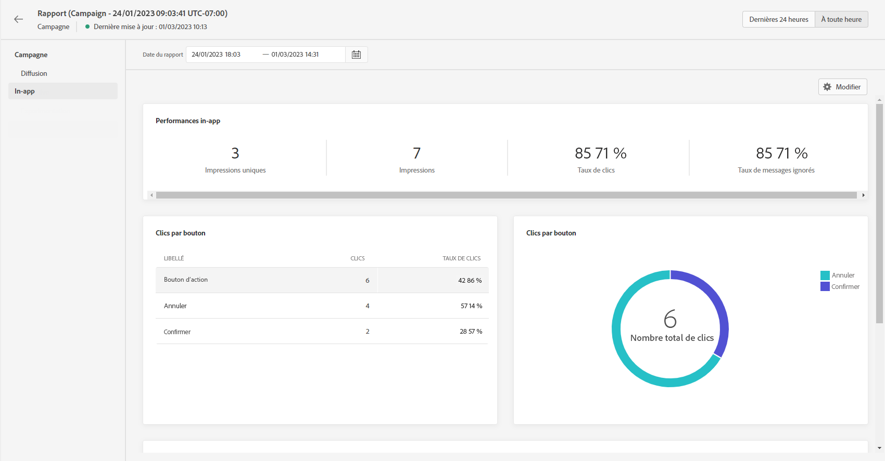
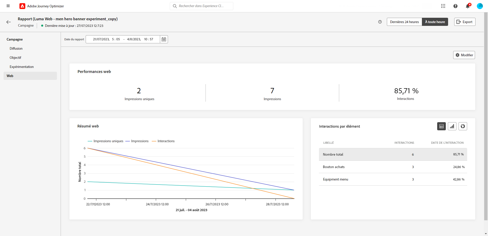

# Rapport global de campagne {#campaign-global-report}

>[!CONTEXTUALHELP]
>id="ajo_campaign_global_report"
>title="Rapport global de campagne"
>abstract="Le rapport global de campagne permet de mesurer l’efficacité de vos campagnes au cours d’une période donnée. Le rapport dyamique de campagne est composé de plusieurs widgets présentant le succès et les erreurs de votre campagne. Vous pouvez modifier chaque tableau de bord de reporting en redimensionnant ou en supprimant des widgets."

Rapports globaux, accessibles à partir de **Tout le temps** , affichez les événements qui se sont produits il y a au moins deux heures et couvrez les événements sur une période sélectionnée. En comparaison, les rapports dynamiques portent sur les événements qui se sont produits au cours des dernières 24 heures, avec un intervalle de temps minimal de deux minutes à compter de l’occurrence de l’événement.

Pour accéder directement au rapport global de campagne à partir de votre campagne, cliquez sur le bouton **[!UICONTROL Afficher le rapport]**.

La page **[!UICONTROL Rapport global]** de la campagne s&#39;affiche avec les onglets suivants :

* [Campagne](#campaign-global)
* [E-mail](#email-global)
* [In-app](#inapp-global)
* [Push](#push-global)
* [SMS](#sms-global)
* [Web](#web-tab)
* [Courrier](#direct-mail-global)

Le **[!UICONTROL Rapport global]** de campagne est divisé en différents widgets présentant le succès et les erreurs de votre campagne. Chaque widget peut être redimensionné et supprimé si nécessaire. Pour plus d&#39;informations à ce propos, consultez cette [section](../reports/global-report.md#modify-dashboard).

Pour obtenir la liste détaillée de chaque mesure disponible dans Adobe Journey Optimizer, reportez-vous à [cette page](global-report.md#list-of-components-global.md).

## Onglet Campagne {#campaign-global}

### Diffusion {#delivery-global}

>[!CONTEXTUALHELP]
>id="ajo_campaign_delivery_global"
>title="Statistiques de la campagne"
>abstract="Le widget Statistiques de la campagne présente les informations principales relatives à votre campagne, telles que les Profils d&#39;entrée et les Actions diffusées."

Le widget **[!UICONTROL Statistiques de la campagne]** présente les principales informations relatives à votre Campagne :

* **[!UICONTROL Profils entrés]** : nombre de profils ayant commencé le parcours.

* **[!UICONTROL Actions réalisées]** : nombre total de fois uniques où une action dans le parcours a été réalisée.

* **[!UICONTROL Échec des actions en %]** : nombre total de fois uniques où une action a échoué dans le parcours par rapport au nombre total de fois uniques où une action a été réalisée.

<!--
### Objectives report {#objectives-global}

The **[!UICONTROL Objectives]** tab allows you to better fine-tune your deliveries' reports by targeting one specific metric.

The **[!UICONTROL Objectives]** listed are linked to **[!UICONTROL Datasets]** that define a connection to a system in order to retrieve additional information. A list of built-in **[!UICONTROL Objectives]** is available but you can add your own by adding new **[!UICONTROL Dataset]**. For the detailed procedure, refer to this [section](../campaigns/reporting-configuration.md).

After selecting the Objectives you want to target on, the two **[!UICONTROL Performance overview]** and **[!UICONTROL Campaign objective]** widgets will provide a detailed summary of your delivery performance. 

With the **[!UICONTROL Campaign objective]** widget, you can also choose to compare your main objective with another metric.
-->

### Rapport d’expérience {#experimentation-global}

>[!CONTEXTUALHELP]
>id="ajo_campaigns_content_experiment_click"
>title="Mesure de succès"
>abstract="Valeur totale de la mesure de succès, précédemment sélectionnée lors de la création de vos expériences, divisée par le nombre de profils."

L’onglet **[!UICONTROL Expérimentation]** fournit des informations clés sur les performances de chaque variante et identifie la variante la plus réussie.

Notez que la définition de meilleure performance peut prendre un certain temps, elle sera représentée par cette icône .

+++En savoir plus sur les différents widgets et mesures disponibles pour le rapport d’expérience.

Le widget **[!UICONTROL Résultat de l’expérience]** décrit les performances de chaque variante. Vous pouvez modifier votre ligne de base en sélectionnant l’un des traitements du menu déroulant **[!UICONTROL Ligne de base]**. Le meilleur traitement sera signalé par une icône en forme d’étoile.

Le tableau présente les mesures suivantes :

* **[!UICONTROL Élévation de la ligne de base]** : mesure de l’amélioration en pourcentage du taux de conversion d’un traitement donné par rapport à la ligne de base.

* **[!UICONTROL Confiance]** : preuves qu’un traitement donné est le même que le traitement de la ligne de base. [En savoir plus](../campaigns/experiment-calculations.md#understand-confidence)

* **[!UICONTROL Clics sortants uniques]** : nombre total de clics sur les canaux sortants.

* **[!UICONTROL Profils]** : nombre de profils ciblés pour ce traitement.

* **[!UICONTROL Clips sortants uniques/profils]** : valeur totale de la mesure de succès, précédemment sélectionnée lors de la création de vos expériences, divisée par le nombre de profils.

Le graphe **[!UICONTROL Intervalle de confiance]** mesure l’incertitude quant à l’amélioration. Il indique la différence de performance en pourcentage entre la ligne de base et le traitement le plus performant. [En savoir plus](../campaigns/experiment-calculations.md#confidence-intervals).

Le dernier widget fournit des données relatives à la **[!UICONTROL Mesure de succès]** que vous avez précédemment sélectionné pour vos traitements. Vous avez la possibilité de sélectionner une autre mesure ciblée dans le menu déroulant **[!UICONTROL Mesure]** pour suivre des données alternatives.

>[!CAUTION]
>
>Lorsque vous utilisez des mesures filtrées pour l’expérimentation, notez que la modification de la sélection de mesure dans la liste déroulante de la page de comparaison pour l’expérimentation ne conserve pas la valeur du filtre. Par exemple, le passage de « Clics » à « Clics uniques » entraînera la perte du filtre appliqué, rendant la comparaison inexacte ou non valide.

+++

Pour un examen approfondi de ces résultats et de leur interprétation, reportez-vous à [cette page](../campaigns/get-started-experiment.md#interpret-results).

## Onglet E-mail {#email-global}

>[!CONTEXTUALHELP]
>id="ajo_campaign_global_email_sending_statistics"
>title="Email - Statistiques d&#39;envoi"
>abstract="Le tableau Email - Statistiques d’envoi résume les données essentielles relatives à votre email, telles que Ciblé ou Diffusé."

>[!CONTEXTUALHELP]
>id="ajo_campaign_global_email_tracking_statistics"
>title="Email - Statistiques de tracking"
>abstract="Le tableau Email - Statistiques de tracking fournit des données sur l’activité de profil de votre email."

>[!CONTEXTUALHELP]
>id="ajo_campaign_global_email_sending_performance"
>title="Email - Envoi des performances"
>abstract="Le graphique de performances Email - Envoi présente des données complètes sur les emails envoyés, en fournissant des informations sur les mesures clés telles que les diffusions et les bounces, ce qui permet d’effectuer une analyse détaillée du processus de remise des emails."

>[!CONTEXTUALHELP]
>id="ajo_campaign_global_email_bounce_categories"
>title="Email - Catégories de rebond"
>abstract="Le tableau et les graphiques des catégories Email - Bounce fournissent des données sur les erreurs temporaires et permanentes."

>[!CONTEXTUALHELP]
>id="ajo_campaign_global_email_bounce_reasons"
>title="Email - Raisons des rebonds"
>abstract="Les graphiques et tableaux Email - Raisons des bounces contiennent les données disponibles sur les messages rebonds."

>[!CONTEXTUALHELP]
>id="ajo_campaign_global_email_error_reasons"
>title="Email - Raisons de l’erreur"
>abstract="Le tableau Email - Raisons de l’erreur vous permet d’identifier les erreurs spécifiques qui se sont produites au cours du processus d’envoi."

>[!CONTEXTUALHELP]
>id="ajo_campaign_global_email_excluded_reasons"
>title="Email - Exclu"
>abstract="Les graphiques et tableaux Exclus des motifs illustrent les différents facteurs qui ont conduit à des profils d’utilisateurs, qui ont été exclus de l’audience ciblée et qui n’ont pas reçu le message."

>[!CONTEXTUALHELP]
>id="ajo_campaign_global_email_top_url"
>title="Email - Top URL"
>abstract="Le tableau et graphique Email - Top URL offre un aperçu complet des URL de votre email qui reçoivent le plus de trafic de visiteurs, ce qui vous permet d’identifier les liens les plus populaires."

>[!CONTEXTUALHELP]
>id="ajo_campaign_global_email_best_recipient"
>title="Email - Meilleur domaine de destinataire"
>abstract="Le tableau et graphique Email - Meilleur domaine de destinataire fournit une ventilation détaillée des domaines que les destinataires utilisent le plus souvent pour ouvrir l&#39;email, offrant des informations précieuses sur le comportement des destinataires."

Dans le **[!UICONTROL Rapport global]** de campagne, l&#39;onglet **[!UICONTROL E-mail]** détaille les principales informations relatives aux diffusions par e-mail envoyées dans votre campagne.

+++En savoir plus sur les différents widgets et mesures disponibles pour le rapport d’e-mail.

La variable **[!UICONTROL Statistiques d’envoi d’emails]** graph détaille le succès de votre email :

* **[!UICONTROL Ciblés]**: Nombre total de messages traités lors du processus d&#39;envoi.

* **[!UICONTROL Envoyé]**: nombre total d’envois pour votre email.

* **[!UICONTROL Délivrés]** : nombre de messages envoyés avec succès, par rapport au nombre total de messages envoyés.

* **[!UICONTROL Taux de diffusion]** : pourcentage de messages envoyés avec succès.

* **[!UICONTROL Rebonds]**: Nombre total d&#39;erreurs cumulées lors du processus d&#39;envoi et du traitement automatique des retours par rapport au nombre total de messages envoyés.

* **[!UICONTROL Taux de rebond]** : pourcentage d&#39;e-mails ayant rebondi par rapport aux e-mails envoyés.

* **[!UICONTROL Erreurs]**: nombre total d&#39;erreurs qui se sont produites pendant le processus d&#39;envoi et qui l&#39;ont empêché d&#39;être envoyé aux profils.

* **[!UICONTROL Taux d’erreur]**: pourcentage d&#39;erreurs qui se sont produites pendant le processus d&#39;envoi et qui l&#39;ont empêché d&#39;être envoyé par rapport au nombre d&#39;emails envoyés.

* **[!UICONTROL Reprises]** : nombre d’e-mails dans la file d’attente pour les reprises.

* **[!UICONTROL Exclus]** : nombre de profils qui ont été exclus par Adobe Journey Optimizer.

La variable **[!UICONTROL Email - Statistiques de tracking]** Le widget contient les données disponibles pour l’activité de profil de votre email :

* **[!UICONTROL Ouvertures]** : nombre de fois que l’e-mail a été ouvert.

* **[!UICONTROL Ouvertures uniques]** : pourcentage d’e-mails ouverts.

* **[!UICONTROL Taux d&#39;ouvertures]** : nombre total de messages ouverts par rapport au nombre de messages diffusés.

* **[!UICONTROL Clics]** : nombre de fois où un contenu a fait l&#39;objet d&#39;un clic dans un e-mail.

* **[!UICONTROL Clics uniques]**: nombre de profils ayant cliqué sur un contenu dans un email.

* **[!UICONTROL Taux de clics uniques]**: pourcentage d’utilisateurs qui ont interagi avec votre email.

* **[!UICONTROL Désabonnements]** : nombre de clics sur le lien de désabonnement.

* **[!UICONTROL Plaintes contre le spam]** : nombre de fois où un message a été déclaré comme spam ou courrier indésirable.

La variable **[!UICONTROL Performances d’envoi]** Le graphique contient les données disponibles pour les emails envoyés, telles que :

* **[!UICONTROL Délivrés]** : nombre de messages envoyés avec succès, par rapport au nombre total de messages envoyés.

* **[!UICONTROL Rebonds]**: Nombre total d&#39;erreurs cumulées lors du processus d&#39;envoi et du traitement automatique des retours par rapport au nombre total de messages envoyés.

* **[!UICONTROL Reprises]** : nombre d’e-mails dans la file d’attente pour les reprises.

* **[!UICONTROL Erreurs]**: nombre total d&#39;erreurs qui se sont produites pendant le processus d&#39;envoi et qui l&#39;ont empêché d&#39;être envoyé aux profils.

Les widgets **[!UICONTROL Raisons de rebond]** et **[!UICONTROL Catégories de rebond]** contiennent les données disponibles relatives aux messages de rebond, telles que :

* **[!UICONTROL Hard bounce]** : nombre total d’erreurs permanentes, telles qu’une adresse e-mail incorrecte. Un message d&#39;erreur indique explicitement que l&#39;adresse n&#39;est pas valide, comme Utilisateur inconnu.

* **[!UICONTROL Soft bounces]** : nombre total d&#39;erreurs temporaires, telles qu&#39;une boîte de réception pleine.

* **[!UICONTROL Ignorées]** : nombre total d&#39;erreurs temporaires (par exemple, Absent(e) du bureau) ou techniques (par exemple, si le type d&#39;expéditeur est administrateur).

Pour plus d&#39;informations sur les bounces, consultez la page [Liste de suppression](../reports/suppression-list.md).

La variable **[!UICONTROL Raisons de l’erreur]** le graphique et le tableau vous permettent de voir quelle erreur s’est produite pendant le processus d’envoi.

Le graphique et le tableau **[!UICONTROL Exclure des raisons]** affichent les différentes raisons qui ont empêché les profils utilisateur, à part les profils ciblés, de recevoir le message.

La variable **[!UICONTROL Email - Top Url]** détails du graphique et du tableau des URL de votre email les plus visitées.

La variable **[!UICONTROL Email - Domaine du destinataire principal]** le graphique et le tableau détaillent les domaines les plus utilisés par les profils pour ouvrir l’email.

>[!CAUTION]
>
> La variable **[!UICONTROL Email - Domaine du destinataire principal]** Le widget a un taux de précision de 99,95 %.

Le graphique **[!UICONTROL Optimisé ou non optimisé]** détaille les informations principales relatives à votre message, qu’elles soient optimisées ou non :

* **[!UICONTROL Envoyé]**: nombre total d’envois.

* **[!UICONTROL Ouvertures]** : nombre de fois que le message a été ouvert.

* **[!UICONTROL Clics]** : nombre de fois où un contenu a fait l&#39;objet d&#39;un clic dans un e-mail.

La variable **[!UICONTROL Optimisation de l’heure d’envoi]** détaille le succès de votre email selon la méthode d&#39;envoi : optimisé ou normal.

* **[!UICONTROL Délivrés]** : nombre de messages envoyés avec succès, par rapport au nombre total de messages envoyés.

* **[!UICONTROL Rebonds]**: Nombre total d&#39;erreurs cumulées lors du processus d&#39;envoi et du traitement automatique des retours par rapport au nombre total de messages envoyés.

>[!NOTE]
>
>La variable **[!UICONTROL Optimisé ou non optimisé]** et **[!UICONTROL Optimisation de l’heure d’envoi]**  Les widgets ne sont disponibles que si l’option Optimisation du temps d’envoi est activée pour votre email. Pour plus d’informations sur l’optimisation de l’heure d’envoi, consultez [cette page](../building-journeys/journeys-message.md#send-time-optimization).

+++

## Onglet In-app {#inapp-global}

>[!CONTEXTUALHELP]
>id="ajo_campaign_global_inapp_performance"
>title="Performances in-app"
>abstract="Les IPC de performances In-App fournissent des informations essentielles sur l’engagement des visiteurs avec les messages In-App."

>[!CONTEXTUALHELP]
>id="ajo_campaign_global_inapp_interactions"
>title="Interactions par type"
>abstract="Les graphes et le tableau Interactions par type détaillent la manière dont les personnes ont interagi avec votre message in-app en suivant les clics, les rejets ou les interactions."

>[!CONTEXTUALHELP]
>id="ajo_campaign_global_inapp_summary"
>title="Résumé in-app"
>abstract="Le graphique de synthèse In-App illustre la progression de vos impressions et interactions In-App au cours de la période spécifiée."

Dans le **[!UICONTROL Rapport global]** de campagne, l’onglet **[!UICONTROL In-app]** détaille les principales informations relatives aux diffusions in-app envoyées dans votre campagne.

+++En savoir plus sur les différents widgets et mesures disponibles pour le rapport in-app.

Les KPI **[!UICONTROL Performances in-app]** détaillent les informations principales relatives à l’engagement des visiteurs et visiteuses en lien avec vos messages in-app. Cela concerne notamment les éléments suivants :

* **[!UICONTROL Impressions uniques]** : nombre d’utilisateurs uniques auxquels le message in-app a été délivré.

* **[!UICONTROL Impressions]** : nombre total de messages in-app diffusés à tous les utilisateurs.

* **[!UICONTROL Taux d’interaction]** : pourcentage d’engagements en lien avec votre message in-app. Cela inclut toutes les actions entreprises par les personnes, telles que les clics, les rejets ou toute autre interaction.

Les graphes et le tableau **[!UICONTROL Interactions par type]** détaillent la manière dont les personnes ont interagi avec votre message in-app en suivant les clics, les rejets ou les interactions.

Le graphe **[!UICONTROL Résumé in-app]** présente l’évolution de vos impressions et interactions in-app pour la période concernée.
+++

## Onglet Notification push {#push-global}

>[!CONTEXTUALHELP]
>id="ajo_campaign_global_push_sending_statistics"
>title="Notification push - Statistiques d&#39;envoi"
>abstract="Le tableau Statistiques d’envoi de notifications push résume les données essentielles sur vos notifications push, telles que les messages ciblés ou délivrés."

>[!CONTEXTUALHELP]
>id="ajo_campaign_global_push_tracking_statistics"
>title="Notification push - Statistiques de tracking"
>abstract="Les statistiques de suivi des notifications push fournissent des données sur l’activité de profil pour votre notification push."

>[!CONTEXTUALHELP]
>id="ajo_campaign_global_push_sending_summary"
>title="Notification push - Synthèse des envois"
>abstract="Le graphique Résumé de l’envoi des notifications push affiche les données disponibles pour les notifications push envoyées."

>[!CONTEXTUALHELP]
>id="ajo_campaign_global_push_excluded_reasons"
>title="Notification push - Raisons exclues"
>abstract="Les graphiques et tableaux Exclus des motifs illustrent les différents facteurs qui ont conduit à des profils d’utilisateurs, qui ont été exclus de l’audience ciblée et qui n’ont pas reçu le message."

>[!CONTEXTUALHELP]
>id="ajo_campaign_global_push_error_reasons"
>title="Notification push - Raisons de l&#39;erreur"
>abstract="Les graphiques et tableaux Raisons d’erreur vous permettent d’identifier les erreurs spécifiques qui se sont produites au cours du processus d’envoi."

>[!CONTEXTUALHELP]
>id="ajo_campaign_global_push_breakdown_platform"
>title="Notification push - Répartition par plateforme"
>abstract="Le tableau et les graphiques Ventilation par plateforme fournissent une ventilation des performances de vos notifications push en fonction du système d’exploitation du profil."

Dans le **[!UICONTROL Rapport global]** de campagne, l’onglet **[!UICONTROL Notification push]** détaille les principales informations relatives aux diffusions push envoyées dans votre campagne.

Les indicateurs de performance clés (IPC) des performances in-app détaillent les informations principales relatives à l’engagement des visiteurs avec vos messages in-app.

+++En savoir plus sur les différents widgets et mesures disponibles pour le rapport push.

La variable **[!UICONTROL Notification push - Statistiques d&#39;envoi]** Le tableau détaille les informations principales relatives à vos notifications push

* **[!UICONTROL Ciblés]**: Nombre total de messages traités lors de l&#39;analyse.

* **[!UICONTROL Envoyé]**: nombre total d&#39;envois pour la notification push.

* **[!UICONTROL Délivrés]** : nombre de messages envoyés avec succès, par rapport au nombre total de messages envoyés.

* **[!UICONTROL Taux de diffusion]** : pourcentage de messages envoyés avec succès.

* **[!UICONTROL Rebonds]**: Nombre total d&#39;erreurs cumulées lors du processus d&#39;envoi et du traitement automatique des retours par rapport au nombre total de messages envoyés.

* **[!UICONTROL Taux de rebond]** : pourcentage de notifications push ayant rebondi par rapport aux notifications push envoyées.

* **[!UICONTROL Erreurs]**: nombre total d’erreurs qui se sont produites pour empêcher son envoi aux profils.

* **[!UICONTROL Taux d’erreur]**: pourcentage d’erreurs qui se sont produites pendant l’interdiction d’envoi par rapport au nombre de notifications push envoyées.

* **[!UICONTROL Exclus]** : nombre de profils qui ont été exclus par Adobe Journey Optimizer.

La variable **[!UICONTROL Push - Statistiques de suivi]** contient les données disponibles pour l&#39;activité de profil de votre notification push :

* **[!UICONTROL Ouvertures]**: nombre d’ouvertures de votre notification push.

* **[!UICONTROL Taux d&#39;ouverture]** : pourcentage de notifications push ouvertes.

* **[!UICONTROL Actions]** : nombre total d&#39;actions sur la notification push diffusée, par exemple clic sur un bouton ou rejet.

* **[!UICONTROL Engagements]** : nombre total d&#39;ouvertures et d&#39;actions pour cette notification push, c&#39;est-à-dire si le profil a ouvert la notification ou si un utilisateur a cliqué sur un bouton.

* **[!UICONTROL Taux d&#39;engagement]** : pourcentage d&#39;ouvertures et d&#39;actions pour cette notification push, c&#39;est-à-dire si le profil a ouvert la notification push ou si un utilisateur a cliqué sur un bouton.

Le graphique **[!UICONTROL Résumé des notifications push]** contient les données disponibles pour les notifications push envoyées, telles que :

* **[!UICONTROL Ouvertures]**: nombre d’ouvertures de votre notification push.

* **[!UICONTROL Actions]** : nombre total d&#39;actions sur la notification push diffusée, par exemple clic sur un bouton ou rejet.

* **[!UICONTROL Rebonds]**: Nombre total d&#39;erreurs cumulées et traitement automatique des retours par rapport au nombre total de messages envoyés.

* **[!UICONTROL Délivrés]** : nombre de messages envoyés avec succès, par rapport au nombre total de messages envoyés.

* **[!UICONTROL Erreurs]**: nombre total d’erreurs qui se sont produites pour empêcher son envoi aux profils.

>[!NOTE]
>
>La variable **[!UICONTROL Optimisé ou non optimisé]** et **[!UICONTROL Optimisation de l’heure d’envoi]**  Les widgets ne sont disponibles que si l’option Optimisation de l’heure d’envoi est activée pour votre notification push. Pour plus d’informations sur l’optimisation de l’heure d’envoi, consultez [cette page](../building-journeys/journeys-message.md#send-time-optimization).

Le graphique **[!UICONTROL Optimisé ou non optimisé]** détaille les informations principales relatives à votre message, qu’elles soient optimisées ou non :

* **[!UICONTROL Délivrés]** : nombre de messages envoyés avec succès, par rapport au nombre total de messages envoyés.

* **[!UICONTROL Ouvertures]**: nombre d’ouvertures de votre notification push.

* **[!UICONTROL Actions]** : nombre total d&#39;actions sur la notification push diffusée, par exemple clic sur un bouton ou rejet.

La variable **[!UICONTROL Optimisation de l’heure d’envoi]** détaille le succès de votre notification push selon la méthode d&#39;envoi : optimisée ou normale.

* **[!UICONTROL Délivrés]** : nombre de messages envoyés avec succès, par rapport au nombre total de messages envoyés.

* **[!UICONTROL Rebonds]**: Nombre total d&#39;erreurs cumulées lors du processus d&#39;envoi et du traitement automatique des retours par rapport au nombre total de messages envoyés.

La variable **[!UICONTROL Raisons de l’erreur]** les graphiques et les tableaux vous permettent de voir quelle erreur s’est produite.

La variable **[!UICONTROL Exclure des motifs]** les graphiques et les tableaux affichent les différentes raisons qui ont empêché les profils utilisateur, exclus des profils ciblés, de recevoir le message.

La variable **[!UICONTROL Ventilation par plateforme]** le graphique et le tableau détaillent le succès de votre notification push en fonction du système d’exploitation de votre profil.
+++

## Onglet SMS {#sms-global}

>[!CONTEXTUALHELP]
>id="ajo_campaign_global_sms_sending_statistics"
>title="SMS - Statistiques d&#39;envoi"
>abstract="Le tableau Statistiques d’envoi de SMS récapitule les données essentielles relatives à vos messages SMS, tels que les messages ciblés ou délivrés."

>[!CONTEXTUALHELP]
>id="ajo_campaign_global_sms_error_reasons"
>title="SMS - Raisons de l’erreur"
>abstract="Les graphiques et tableaux SMS - Raisons d’erreur vous permettent d’identifier les erreurs spécifiques qui se sont produites pendant le processus d’envoi."

>[!CONTEXTUALHELP]
>id="ajo_campaign_global_sms_performance"
>title="SMS : performance par date"
>abstract="Le widget Performances des SMS par date fournit des informations clés sur vos messages par le biais d’une représentation graphique."

>[!CONTEXTUALHELP]
>id="ajo_campaign_global_sms_excluded_reasons"
>title="SMS - Motifs exclus"
>abstract="Les graphiques et tableaux Exclus des motifs illustrent les différents facteurs qui ont conduit à des profils d’utilisateurs, qui ont été exclus de l’audience ciblée et qui n’ont pas reçu le message."

>[!CONTEXTUALHELP]
>id="ajo_campaign_global_sms_bounces_reasons"
>title="SMS - Raisons des rebonds"
>abstract="Les graphiques et les tableaux Rebonds contiennent les données disponibles relatives aux messages rebonds."

>[!CONTEXTUALHELP]
>id="ajo_campaign_global_sms_clicks_links"
>title="SMS : clics par liens"
>abstract="Le widget SMS - Clics par liens fournit des informations essentielles sur l’engagement des visiteurs avec les URL de vos messages."

Dans le **[!UICONTROL Rapport global]** de campagne, l’onglet **[!UICONTROL SMS]** détaille les principales informations relatives aux diffusions SMS envoyées dans votre campagne.

+++En savoir plus sur les différents widgets et mesures disponibles pour le rapport SMS.

La variable **[!UICONTROL SMS - Statistiques d&#39;envoi]** Le tableau décrit le succès de votre SMS :

* **[!UICONTROL Ciblés]**: nombre de profils utilisateur qualifiés comme profils cibles.

* **[!UICONTROL Exclus]** : nombre de profils utilisateur, exclus des profils ciblés, qui n’ont pas reçu le message.

* **[!UICONTROL Envoyé]**: nombre total d&#39;envois pour votre SMS.

* **[!UICONTROL Rebonds]**: Nombre total d&#39;erreurs cumulées lors du processus d&#39;envoi et du traitement automatique des retours par rapport au nombre total de messages envoyés.

* **[!UICONTROL Erreurs]**: nombre total d’erreurs qui se sont produites pour empêcher son envoi aux profils.

Le widget **[!UICONTROL Performances de SMS par date]** détaille les informations principales relatives à votre message sous forme de graphique :

* **[!UICONTROL Envoyé]**: nombre total d’envois pour vos SMS.

* **[!UICONTROL Rebonds]**: Nombre total d&#39;erreurs cumulées lors du processus d&#39;envoi et du traitement automatique des retours par rapport au nombre total de messages envoyés.

* **[!UICONTROL Erreurs]**: nombre total d’erreurs qui se sont produites pour empêcher son envoi aux profils.

La variable **[!UICONTROL Exclure les raisons]** et **[!UICONTROL Raisons des rebonds]** et **[!UICONTROL Raisons de l’erreur]** les graphiques et les tableaux vous permettent de voir quelles erreurs et exclusions se sont produites au cours du processus d’envoi.

La variable **[!UICONTROL SMS : clics par liens]** Les widgets détaillent les informations principales relatives à l’engagement des visiteurs avec vos URL.

+++

## Onglet Web {#web-tab}

>[!CONTEXTUALHELP]
>id="ajo_campaign_global_web_performance"
>title="Performances web"
>abstract="Les indicateurs de performance clés des performances web fournissent des informations complètes sur l’engagement de vos visiteurs avec vos expériences web."

>[!CONTEXTUALHELP]
>id="ajo_campaign_global_web_summary"
>title="Résumé web"
>abstract="Le graphique Résumé web illustre la progression de vos expériences web, y compris les impressions, les impressions uniques et les interactions, au cours de la période spécifiée."

>[!CONTEXTUALHELP]
>id="ajo_campaign_global_web_interactions"
>title="Interactions par élément"
>abstract="Le tableau Interactions par élément fournit des informations clés sur l’engagement des visiteurs avec différents éléments de vos pages web."

Depuis votre **[!UICONTROL rapport global]** de campagne, l’onglet **[!UICONTROL Web]** présente les informations principales relatives à vos pages web.

+++En savoir plus sur les différents widgets et mesures disponibles pour le rapport web.

Les KPI de **[!UICONTROL Performances web]** détaillent les informations principales relatives à l’engagement de vos visiteurs et visiteuses avec vos expériences web, telles que :

* **[!UICONTROL Impressions uniques]** : nombre d’utilisateurs uniques auxquels l’expérience web a été diffusée.

* **[!UICONTROL Impressions]** : nombre total d’expériences web diffusées à tous les utilisateurs.

* **[!UICONTROL Taux d’interaction]** : pourcentage d’engagements en lien avec votre page web. Cela inclut toutes les actions entreprises par les personnes, telles que les clics ou toute autre interaction.

Le graphe **[!UICONTROL Résumé web]** présente l’évolution de vos expériences web (impressions, impressions et interactions uniques) pour la période concernée.

Le tableau **[!UICONTROL Interactions par élément]** présente les informations principales relatives à l’engagement des visiteurs et visiteuses en lien avec les différents éléments de vos pages web.
+++

## Onglet Courrier {#direct-mail-global}

>[!CONTEXTUALHELP]
>id="ajo_campaign_global_direct_sending_statistics"
>title="Courrier - Statistiques d’envoi"
>abstract="Le tableau Statistiques d’envoi de courrier récapitule les données essentielles relatives à vos messages courrier, telles que les messages ciblés ou délivrés."

>[!CONTEXTUALHELP]
>id="ajo_campaign_global_direct_error_reasons"
>title="Courrier - Raisons de l’erreur"
>abstract="Les graphiques et tableaux Courrier - Raisons d’erreur vous permettent d’identifier les erreurs spécifiques qui se sont produites pendant le processus d’envoi."

>[!CONTEXTUALHELP]
>id="ajo_campaign_global_direct_excluded_reasons"
>title="Courrier - Motifs exclus"
>abstract="Le tableau et les graphiques des motifs d’exclusion du courrier illustrent les différents facteurs qui ont conduit à la création de profils d’utilisateurs, qui ont été exclus de l’audience ciblée, et qui n’ont pas reçu le message."

Depuis le **[!UICONTROL rapport global]** de votre campagne, l’onglet **[!UICONTROL Courrier]** présente les informations principales relatives à vos diffusions de courrier.

+++En savoir plus sur les différents widgets et mesures disponibles pour le rapport de courrier.

La variable **[!UICONTROL Courrier - Statistiques d’envoi]** le tableau détaille le succès de votre courrier :

* **[!UICONTROL Ciblés]**: nombre de profils d’utilisateurs qui remplissent les critères de ciblage pour ce courrier.

* **[!UICONTROL Envoyé]**: Nombre total d&#39;envois pour ce courrier.

* **[!UICONTROL Erreurs]**: nombre total d&#39;erreurs qui se sont produites pendant le processus d&#39;envoi et qui l&#39;ont empêché d&#39;être envoyé aux profils.

* **[!UICONTROL Exclu]**: nombre de profils utilisateur, exclus des profils ciblés, qui n’ont pas reçu votre courrier.

La variable **[!UICONTROL Courrier - Motifs exclus]** et **[!UICONTROL Courrier - Raisons de l’erreur]** les graphiques et les tableaux vous permettent de voir quelles erreurs et exclusions se sont produites au cours du processus d’envoi.
+++

## Ressources supplémentaires

* [Prise en main des campagnes](../campaigns/get-started-with-campaigns.md)
* [Création d’une campagne](../campaigns/create-campaign.md)
* [Créer des campagnes déclenchées par API](../campaigns/api-triggered-campaigns.md)
* [Modification ou arrêt d’une campagne](../campaigns/modify-stop-campaign.md)
* [Rapport dynamique de campagne](campaign-live-report.md)
