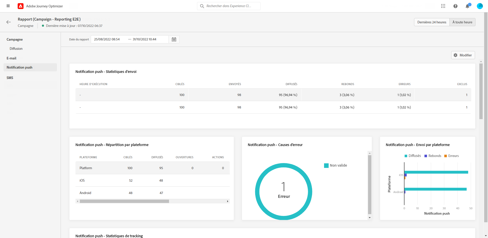
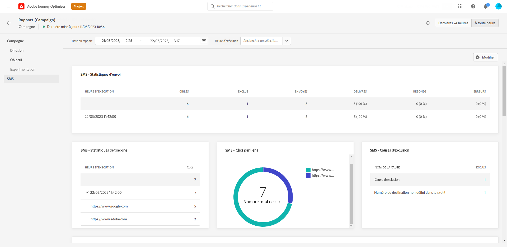

# Rapport global de campagne {#campaign-global-report}

Le rapport global de campagnes est accessible directement depuis votre campagne à l’aide de la variable **[!UICONTROL Tout le temps]** bouton .

La page **[!UICONTROL Rapport global]** de la campagne s&#39;affiche avec les onglets suivants :

* [Campagne](#campaign-global)
* [E-mail](#email-global)
* [Push](#push-global)
* [SMS](#sms-global)

Le **[!UICONTROL Rapport global]** de campagne est divisé en différents widgets présentant le succès et les erreurs de votre campagne. Chaque widget peut être redimensionné et supprimé si nécessaire. Pour plus d&#39;informations à ce propos, consultez cette [section](../reports/global-report.md#modify-dashboard).

Pour obtenir la liste détaillée de chaque mesure disponible dans Adobe Journey Optimizer, reportez-vous à la section [cette page](global-report.md#list-of-components-global.md)

## Onglet Campagne {#campaign-global}

### Diffusion {#delivery-global}

Le widget **[!UICONTROL Statistiques de la campagne]** présente les principales informations relatives à votre Campagne :

* **[!UICONTROL Profils entrés]** : nombre de profils ayant commencé le parcours.

* **[!UICONTROL Actions réalisées]** : nombre total de fois uniques où une action dans le parcours a été réalisée.

* **[!UICONTROL Échec des actions en %]** : nombre total de fois uniques où une action a échoué dans le parcours par rapport au nombre total de fois uniques où une action a été réalisée.

## Onglet E-mail {#email-global}

Dans le **[!UICONTROL Rapport global]** de campagne, l&#39;onglet **[!UICONTROL E-mail]** détaille les principales informations relatives aux diffusions par e-mail envoyées dans votre campagne.

+++En savoir plus sur les différents widgets et mesures disponibles pour le rapport Email.

Le graphique **[!UICONTROL Statistiques d&#39;envoi d’e-mail]** détaille la réussite de votre diffusion :

* **[!UICONTROL Ciblés]** : nombre total de messages traités lors de l’analyse de la diffusion.

* **[!UICONTROL Envoyés]** : nombre total d&#39;envois pour la diffusion.

* **[!UICONTROL Délivrés]** : nombre de messages envoyés avec succès, par rapport au nombre total de messages envoyés.

* **[!UICONTROL Taux de diffusion]** : pourcentage de messages envoyés avec succès.

* **[!UICONTROL Bounces]** : nombre total d&#39;erreurs cumulées lors des diffusions et du traitement automatique des retours par rapport au nombre total de messages envoyés.

* **[!UICONTROL Taux de rebond]** : pourcentage d&#39;e-mails ayant rebondi par rapport aux e-mails envoyés.

* **[!UICONTROL Erreurs]** : nombre total d&#39;erreurs survenues au cours d&#39;une diffusion, l&#39;empêchant d&#39;être envoyée à des profils.

* **[!UICONTROL Taux d&#39;erreurs]** : pourcentage d&#39;erreurs survenues au cours d&#39;une diffusion, l&#39;empêchant d&#39;être envoyée, par rapport aux e-mails envoyés.

* **[!UICONTROL Reprises]** : nombre d’e-mails dans la file d’attente pour les reprises.

* **[!UICONTROL Exclus]** : nombre de profils qui ont été exclus par Adobe Journey Optimizer.

Le widget **[!UICONTROL E-mail - Statistiques de suivi]** contient les données disponibles pour l’activité destinataire de votre diffusion :

* **[!UICONTROL Ouvertures]** :nombre de fois où la diffusion a été ouverte dans une diffusion.

* **[!UICONTROL Ouvertures uniques]** : pourcentage de diffusions ouvertes.

* **[!UICONTROL Taux d&#39;ouvertures]** : nombre total de messages ouverts par rapport au nombre de messages diffusés.

* **[!UICONTROL Clics]** : nombre de fois où un contenu a fait l&#39;objet d&#39;un clic dans un e-mail.

* **[!UICONTROL Clics uniques]** : nombre de destinataires qui ont cliqué sur un contenu dans un email.

* **[!UICONTROL Taux de clics uniques]** : pourcentage d’utilisateurs ayant interagi avec la diffusion.

* **[!UICONTROL Désabonnements]** : nombre de clics sur le lien de désabonnement.

* **[!UICONTROL Plaintes contre le spam]** : nombre de fois où un message a été déclaré comme spam ou courrier indésirable.

Le graphique **[!UICONTROL Statistiques d&#39;envoi]** contient les données disponibles pour les e-mails envoyés, telles que :

* **[!UICONTROL Délivrés]** : nombre de messages envoyés avec succès, par rapport au nombre total de messages envoyés.

* **[!UICONTROL Bounces]** : nombre total d&#39;erreurs cumulées lors des diffusions et du traitement automatique des retours par rapport au nombre total de messages envoyés.

* **[!UICONTROL Reprises]** : nombre d’e-mails dans la file d’attente pour les reprises.

* **[!UICONTROL Erreurs]** : nombre total d’erreurs survenues au cours d’une diffusion, l’empêchant d’être envoyée à des profils.

Les widgets **[!UICONTROL Raisons de rebond]** et **[!UICONTROL Catégories de rebond]** contiennent les données disponibles relatives aux messages de rebond, telles que :

* **[!UICONTROL Hard bounce]** : nombre total d&#39;erreurs permanentes, telles qu&#39;une adresse email incorrecte. Un message d&#39;erreur indique explicitement que l&#39;adresse n&#39;est pas valide, comme Utilisateur inconnu.

* **[!UICONTROL Soft bounces]** : nombre total d&#39;erreurs temporaires, telles qu&#39;une boîte de réception pleine.

* **[!UICONTROL Ignorées]** : nombre total d&#39;erreurs temporaires (par exemple, Absent(e) du bureau) ou techniques (par exemple, si le type d&#39;expéditeur est administrateur).

Pour plus d&#39;informations sur les bounces, consultez la page [Liste de suppression](../reports/suppression-list.md).

Le graphique et le tableau **[!UICONTROL Causes des erreurs]** vous permettent de voir quelle erreur s&#39;est produite au cours de votre diffusion.

Le graphique et le tableau **[!UICONTROL Exclure des raisons]** affichent les différentes raisons qui ont empêché les profils utilisateur, à part les profils ciblés, de recevoir le message.

Le graphique et le tableau **[!UICONTROL E-mail - Principales URL]** indiquent les URL de votre diffusion les plus visitées.

Le graphique et le tableau **[!UICONTROL E-mail - Meilleur domaine destinataire]** indiquent les domaines les plus utilisés par les destinataires pour ouvrir l&#39;e-mail.

>[!NOTE]
>
>Les widgets **[!UICONTROL Optimisé ou non optimisé]** et **[!UICONTROL Optimisation de l’heure d’envoi]** ne sont disponibles que si l’option Optimisation de l’heure d’envoi est activée pour votre diffusion. Pour plus d’informations sur l’optimisation de l’heure d’envoi, consultez [cette page](../messages/send-time-optimization.md).

Le graphique **[!UICONTROL Optimisé ou non optimisé]** détaille les informations principales relatives à votre message, qu’elles soient optimisées ou non :

* **[!UICONTROL Envoyés]** : nombre total d’envois pour la diffusion.
* **[!UICONTROL Ouvertures]** : nombre de fois où la diffusion a été ouverte dans une diffusion.
* **[!UICONTROL Clics]** : nombre de fois où un contenu a fait l’objet d’un clic dans un e-mail.

L’**[!UICONTROL Optimisation de l’heure d’envoi]** détaille le succès de votre diffusion selon la méthode d’envoi : optimisé ou normal.

* **[!UICONTROL Délivrés]** : nombre de messages envoyés avec succès, par rapport au nombre total de messages envoyés.
* **[!UICONTROL Bounces]** : nombre total d&#39;erreurs cumulées lors des diffusions et du traitement automatique des retours par rapport au nombre total de messages envoyés.
+++

## Onglet Notification push {#push-global}

Depuis votre campagne **[!UICONTROL Rapport global]**, la variable **[!UICONTROL Notification push]** Cet onglet présente les informations principales relatives aux diffusions push envoyées dans votre campagne.

+++En savoir plus sur les différents widgets et mesures disponibles pour le rapport push.

Le tableau **[!UICONTROL Notification push - Statistiques d&#39;envoi]** présente les principales informations relatives à vos notifications push avec un graphique et des KPI :

* **[!UICONTROL Ciblés]** : nombre total de messages traités lors de l’analyse de la diffusion.

* **[!UICONTROL Envoyés]** : nombre total d&#39;envois pour la diffusion.

* **[!UICONTROL Délivrés]** : nombre de messages envoyés avec succès, par rapport au nombre total de messages envoyés.

* **[!UICONTROL Taux de diffusion]** : pourcentage de messages envoyés avec succès.

* **[!UICONTROL Bounces]** : nombre total d&#39;erreurs cumulées lors des diffusions et du traitement automatique des retours par rapport au nombre total de messages envoyés.

* **[!UICONTROL Taux de rebond]** : pourcentage de notifications push ayant rebondi par rapport aux notifications push envoyées.

* **[!UICONTROL Erreurs]** : nombre total d’erreurs survenues au cours d’une diffusion, l’empêchant d’être envoyée à des profils.

* **[!UICONTROL Taux d&#39;erreurs]** : pourcentage d&#39;erreurs survenues pendant une diffusion qui l&#39;empêchent d&#39;être envoyée par rapport aux notifications push envoyées.

* **[!UICONTROL Exclus]** : nombre de profils qui ont été exclus par Adobe Journey Optimizer.

Les **[!UICONTROL Statistiques de suivi - push]** contiennent les données disponibles pour l&#39;activité destinataire de votre diffusion :

* **[!UICONTROL Ouvertures]** : nombre de fois qu&#39;un message a été ouvert dans une diffusion.

* **[!UICONTROL Taux d&#39;ouverture]** : pourcentage de notifications push ouvertes.

* **[!UICONTROL Actions]** : nombre total d&#39;actions sur la notification push diffusée, par exemple clic sur un bouton ou rejet.

* **[!UICONTROL Engagements]** : nombre total d&#39;ouvertures et d&#39;actions pour cette notification push, c&#39;est-à-dire si le profil a ouvert la notification ou si un utilisateur a cliqué sur un bouton.

* **[!UICONTROL Taux d&#39;engagement]** : pourcentage d&#39;ouvertures et d&#39;actions pour cette notification push, c&#39;est-à-dire si le profil a ouvert la notification push ou si un utilisateur a cliqué sur un bouton.

Le graphique **[!UICONTROL Résumé des notifications push]** contient les données disponibles pour les notifications push envoyées, telles que :

* **[!UICONTROL Ouvertures]** : nombre d’ouvertures d’un message dans une diffusion.

* **[!UICONTROL Actions]** : nombre total d’actions sur la notification push diffusée (par exemple, clic sur un bouton ou rejet).

* **[!UICONTROL Bounces]** : nombre total d&#39;erreurs cumulées lors des diffusions et du traitement automatique des retours par rapport au nombre total de messages envoyés.

* **[!UICONTROL Délivrés]** : nombre de messages envoyés avec succès, par rapport au nombre total de messages envoyés.

* **[!UICONTROL Erreurs]** : nombre total d’erreurs survenues au cours d’une diffusion, l’empêchant d’être envoyée à des profils.

>[!NOTE]
>
>Les widgets **[!UICONTROL Optimisé ou non optimisé]** et **[!UICONTROL Optimisation de l’heure d’envoi]** ne sont disponibles que si l’option Optimisation de l’heure d’envoi est activée pour votre diffusion. Pour plus d’informations sur l’optimisation de l’heure d’envoi, consultez [cette page](../messages/send-time-optimization.md).

Le graphique **[!UICONTROL Optimisé ou non optimisé]** détaille les informations principales relatives à votre message, qu’elles soient optimisées ou non :

* **[!UICONTROL Délivrés]** : nombre de messages envoyés avec succès, par rapport au nombre total de messages envoyés.
* **[!UICONTROL Ouvertures]** :nombre de fois où la diffusion a été ouverte dans une diffusion.
* **[!UICONTROL Actions]** : nombre total d’actions sur la notification push diffusée, par exemple clic sur un bouton ou rejet.

L’**[!UICONTROL Optimisation de l’heure d’envoi]** détaille le succès de votre diffusion selon la méthode d’envoi : optimisé ou normal.

* **[!UICONTROL Délivrés]** : nombre de messages envoyés avec succès, par rapport au nombre total de messages envoyés.
* **[!UICONTROL Bounces]** : nombre total d&#39;erreurs cumulées lors des diffusions et du traitement automatique des retours par rapport au nombre total de messages envoyés.

Le graphique et le tableau **[!UICONTROL Causes des erreurs]** vous permettent de voir quelle erreur s&#39;est produite au cours de votre diffusion.

Le graphique et le tableau **[!UICONTROL Exclure des raisons]** affichent les différentes raisons qui ont empêché les profils utilisateur, à part les profils ciblés, de recevoir le message.

Les graphiques et tableaux **[!UICONTROL Suivi par plateforme]**, **[!UICONTROL Envoi par plateforme]** et **[!UICONTROL Répartition par plateforme]** décrivent le succès de votre notification push en fonction du système d&#39;exploitation de votre destinataire.
+++

## Onglet SMS {#sms-global}

Depuis votre campagne **[!UICONTROL Rapport global]**, la variable **[!UICONTROL SMS]** Cet onglet présente les informations principales relatives aux diffusions SMS envoyées dans votre campagne.

+++En savoir plus sur les différentes mesures et widgets disponibles pour le rapport SMS.

Le tableau **[!UICONTROL SMS - Statistiques d’envoi]** détaille la réussite de votre diffusion :

* **[!UICONTROL Ciblés]** : nombre de profils utilisateur qui sont qualifiés en tant que profils cibles pour cette diffusion.

* **[!UICONTROL Exclus]** : nombre de profils utilisateur, exclus des profils ciblés, qui n’ont pas reçu le message.

* **[!UICONTROL Envoyés]** : nombre total d&#39;envois pour la diffusion.

* **[!UICONTROL Délivrés]** : nombre de messages envoyés avec succès, par rapport au nombre total de messages envoyés.

* **[!UICONTROL Bounces]** : nombre total d&#39;erreurs cumulées lors des diffusions et du traitement automatique des retours par rapport au nombre total de messages envoyés.

* **[!UICONTROL Erreurs]** : nombre total d’erreurs survenues au cours d&#39;une diffusion, l’empêchant d&#39;être envoyée à des profils.

Le **[!UICONTROL Performances des SMS par date]** avec un graphique, vous trouverez les informations principales relatives à votre message :

* **[!UICONTROL Envoyés]** : nombre total d&#39;envois pour la diffusion.

* **[!UICONTROL Délivrés]** : nombre de messages envoyés avec succès, par rapport au nombre total de messages envoyés.

* **[!UICONTROL Bounces]** : nombre total d&#39;erreurs cumulées lors des diffusions et du traitement automatique des retours par rapport au nombre total de messages envoyés.

* **[!UICONTROL Erreurs]** : nombre total d’erreurs survenues au cours d&#39;une diffusion, l’empêchant d&#39;être envoyée à des profils.

Le **[!UICONTROL Exclure les raisons]**, **[!UICONTROL Raisons des rebonds]** et **[!UICONTROL Raisons de l’erreur]** les graphiques et les tableaux vous permettent de voir quelles erreurs et exclusions ont eu lieu au cours de votre diffusion.
+++

## Ressources supplémentaires

* [Prise en main des campagnes](../campaigns/get-started-with-campaigns.md)
* [Créer une campagne](../campaigns/create-campaign.md)
* [Créer des campagnes déclenchées par API](../campaigns/api-triggered-campaigns.md)
* [Modifier ou arrêter une campagne](../campaigns/modify-stop-campaign.md)
* [Rapport dynamique de campagne](campaign-live-report.md)
