# Rapport global de campagne {#campaign-global-report}

>[!CONTEXTUALHELP]
>id="ajo_campaign_global_report"
>title="Rapport global de campagne"
>abstract="Le rapport global de campagne permet de mesurer l’efficacité de vos campagnes au cours d’une période donnée. Le rapport dyamique de campagne est composé de plusieurs widgets présentant le succès et les erreurs de votre campagne. Vous pouvez modifier chaque tableau de bord de reporting en redimensionnant ou en supprimant des widgets."

Les rapports globaux, accessibles à partir de l’onglet **À toute heure**, affichent les événements qui se sont produits il y a au moins deux heures et couvrent les événements sur une période sélectionnée. En comparaison, les rapports dynamiques portent sur les événements qui se sont produits au cours des dernières 24 heures, avec un intervalle de temps minimal de deux minutes à compter de l’occurrence de l’événement.

Pour accéder directement au rapport global de campagne à partir de votre campagne, cliquez sur le bouton **[!UICONTROL Afficher le rapport]**.

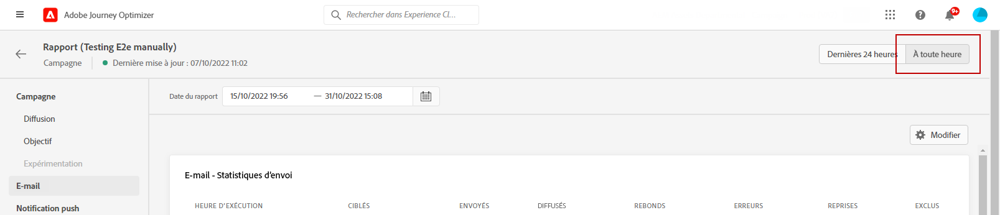

La page **[!UICONTROL Rapport global]** de la campagne s&#39;affiche avec les onglets suivants :

* [Campagne](#campaign-global)
* [E-mail](#email-global)
* [In-app](#inapp-global)
* [Notification push](#push-global)
* [SMS](#sms-global)
* [Web](#web-tab)
* [Courrier](#direct-mail-global)

Le **[!UICONTROL Rapport global]** de campagne est divisé en différents widgets présentant le succès et les erreurs de votre campagne. Chaque widget peut être redimensionné et supprimé si nécessaire. Pour plus d&#39;informations à ce propos, consultez cette [section](../reports/global-report.md#modify-dashboard).

Pour obtenir la liste détaillée de chaque mesure disponible dans Adobe Journey Optimizer, reportez-vous à [cette page](global-report.md#list-of-components-global.md).

## Onglet Campagne {#campaign-global}

### Diffusion {#delivery-global}

>[!CONTEXTUALHELP]
>id="ajo_campaign_delivery_global"
>title="Statistiques de la campagne"
>abstract="Le widget Statistiques de la campagne présente les informations principales relatives à votre campagne, telles que les profils saisis et les actions diffusées."

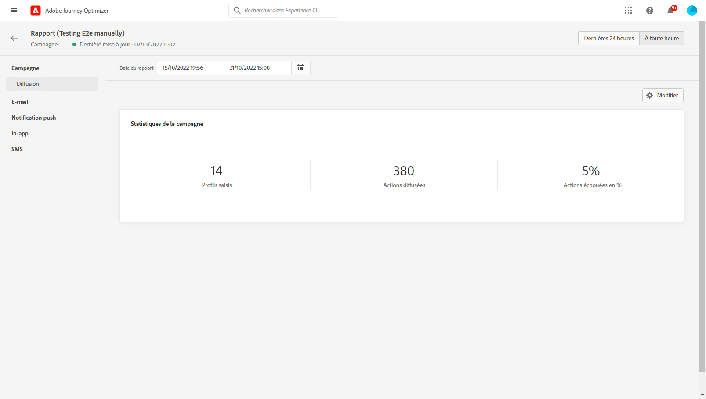

Les KPI **[!UICONTROL Statistiques de la campagne]** constituent un tableau de bord complet, qui propose une répartition détaillée des mesures clés liées à votre campagne. La section contient des informations essentielles telles que le nombre de profils et les actions diffusées, ce qui vous permet de bien comprendre les performances de votre campagne et l’engagement avec celle-ci.

+++ En savoir plus sur les mesures Statistiques de la campagne

* **[!UICONTROL Audience]** : nombre de profils ciblés.

* **[!UICONTROL Actions diffusées]** : nombre total de diffusions uniques d’une action.

* **[!UICONTROL Actions échouées en %]** : pourcentage d’échecs uniques d’une action par rapport au nombre total de diffusions uniques d’une action.

+++

<!--
### Objectives report {#objectives-global}

The **[!UICONTROL Objectives]** tab allows you to better fine-tune your deliveries' reports by targeting one specific metric.

The **[!UICONTROL Objectives]** listed are linked to **[!UICONTROL Datasets]** that define a connection to a system in order to retrieve additional information. A list of built-in **[!UICONTROL Objectives]** is available but you can add your own by adding new **[!UICONTROL Dataset]**. For the detailed procedure, refer to this [section](../campaigns/reporting-configuration.md).

After selecting the Objectives you want to target on, the two **[!UICONTROL Performance overview]** and **[!UICONTROL Campaign objective]** widgets will provide a detailed summary of your delivery performance. 

With the **[!UICONTROL Campaign objective]** widget, you can also choose to compare your main objective with another metric.
-->

### Rapport d’expérience {#experimentation-global}

>[!CONTEXTUALHELP]
>id="ajo_campaigns_content_experiment_click"
>title="Mesure de succès"
>abstract="Valeur totale de la mesure de succès, précédemment sélectionnée lors de la création de vos expériences, divisée par le nombre de profils."

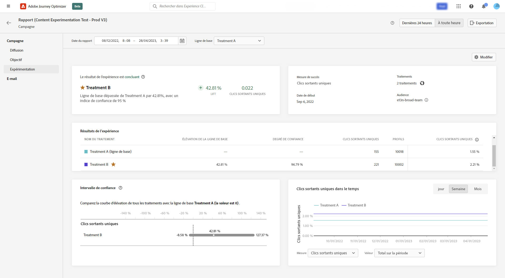

L’onglet **[!UICONTROL Expérimentation]** fournit des informations clés sur les performances de chaque variante et identifie la variante la plus réussie.

Notez que la définition de meilleure performance peut prendre un certain temps, elle sera représentée par cette icône .

+++En savoir plus sur les différents widgets et mesures disponibles pour le rapport d’expérience.

Le widget **[!UICONTROL Résultat de l’expérience]** décrit les performances de chaque variante. Vous pouvez modifier votre ligne de base en sélectionnant l’un des traitements du menu déroulant **[!UICONTROL Ligne de base]**. Le meilleur traitement sera signalé par une icône en forme d’étoile.

Pour un examen approfondi de ces résultats et de leur interprétation, reportez-vous à [cette page](../campaigns/get-started-experiment.md#interpret-results).

Le tableau présente les mesures suivantes :

* **[!UICONTROL Élévation de la ligne de base]** : mesure de l’amélioration en pourcentage du taux de conversion d’un traitement donné par rapport à la ligne de base.

* **[!UICONTROL Confiance]** : preuves qu’un traitement donné est le même que le traitement de la ligne de base. [En savoir plus](../campaigns/experiment-calculations.md#understand-confidence)

* **[!UICONTROL Clics sortants uniques]** : nombre total de clics sur les canaux sortants.

* **[!UICONTROL Profils]** : nombre de profils ciblés pour ce traitement.

* **[!UICONTROL Clips sortants uniques/profils]** : valeur totale de la mesure de succès, précédemment sélectionnée lors de la création de vos expériences, divisée par le nombre de profils.

Le graphe **[!UICONTROL Intervalle de confiance]** mesure l’incertitude quant à l’amélioration. Il indique la différence de performance en pourcentage entre la ligne de base et le traitement le plus performant. [En savoir plus](../campaigns/experiment-calculations.md#confidence-intervals).

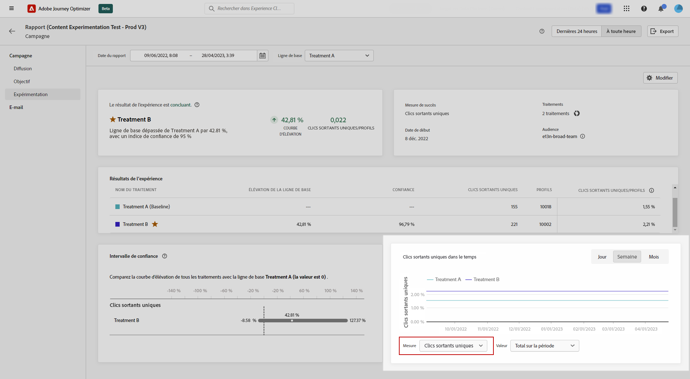

Le dernier widget fournit des données relatives à la **[!UICONTROL Mesure de succès]** que vous avez précédemment sélectionné pour vos traitements. Vous avez la possibilité de sélectionner une autre mesure ciblée dans le menu déroulant **[!UICONTROL Mesure]** pour suivre des données alternatives.

>[!CAUTION]
>
>Lorsque vous utilisez des mesures filtrées pour l’expérimentation, notez que la modification de la sélection de mesure dans la liste déroulante de la page de comparaison pour l’expérimentation ne conserve pas la valeur du filtre. Par exemple, le passage de « Clics » à « Clics uniques » entraînera la perte du filtre appliqué, rendant la comparaison inexacte ou non valide.

+++

## Onglet E-mail {#email-global}

### E-mail – Statistiques d’envoi {#sending-statistics-email}

>[!CONTEXTUALHELP]
>id="ajo_campaign_global_email_sending_statistics"
>title="E-mail - Statistiques d’envoi"
>abstract="Le tableau E-mail - Statistiques d’envoi résume les données essentielles relatives à vos e-mails, tels que ceux Ciblés ou Diffusés."

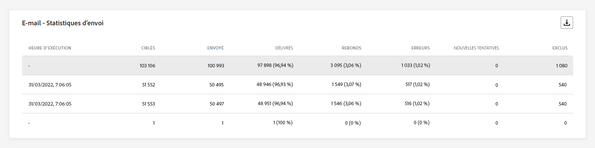

Le tableau **[!UICONTROL E-mail – Statistiques d’envoi]** fournit un résumé complet des données essentielles concernant vos campagnes par e-mail. Il détaille les mesures clés, telles que la taille de l’audience ciblée et le nombre d’e-mails diffusés avec succès, ce qui vous permet d’obtenir des informations précieuses sur l’efficacité et la portée de vos e-mails.

+++ En savoir plus sur les mesures Statistiques d’envoi d’e-mails

* **[!UICONTROL Ciblés]** : nombre total d’e-mails traités lors de la procédure d’envoi.

* **[!UICONTROL Envoyés]** : nombre total d’e-mails envoyés.

* **[!UICONTROL Diffusés]** : nombre d’e-mails envoyés avec succès, par rapport au nombre total de messages envoyés.

* **[!UICONTROL Taux de diffusion]** : pourcentage d’e-mails envoyés avec succès.

* **[!UICONTROL Rebonds]** : nombre total d’erreurs cumulées lors de la procédure d’envoi et du traitement automatique des retours par rapport au nombre total de messages envoyés.

* **[!UICONTROL Taux de rebond]** : pourcentage d’e-mails ayant rebondi par rapport aux e-mails envoyés.

* **[!UICONTROL Erreurs]** : nombre total d’erreurs survenues au cours de la procédure d’envoi, empêchant le message d’être envoyé à des profils.

* **[!UICONTROL Taux d’erreurs]** : pourcentage d’erreurs survenues au cours de la procédure d’envoi, empêchant le message d’être envoyé, par rapport aux e-mails envoyés.

* **[!UICONTROL Reprises]** : nombre d’e-mails dans la file d’attente pour les reprises.

* **[!UICONTROL Exclus]** : nombre de profils qui ont été exclus par Adobe Journey Optimizer.

+++

### E-mail – Statistiques de tracking {#tracking-statistics-email}

>[!CONTEXTUALHELP]
>id="ajo_campaign_global_email_tracking_statistics"
>title="E-mail – Statistiques de tracking"
>abstract="Le tableau E-mail - Statistiques de tracking fournit les données sur l’activité de profil pour votre e-mail :"

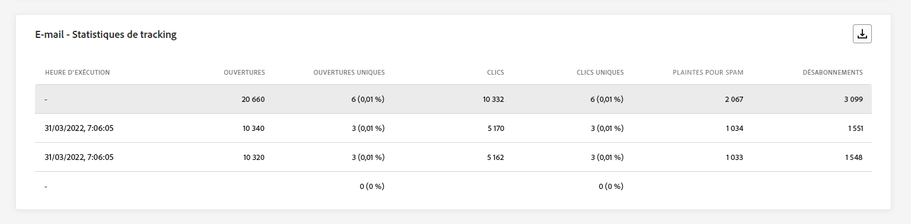

Le tableau **[!UICONTROL E-mail – Statistiques de tracking]** offre un compte-rendu détaillé de l’activité du profil associée à vos campagnes par e-mail. Cela inclut des mesures sur les ouvertures, les clics et d’autres indicateurs d’engagement pertinents, offrant une vue d’ensemble complète de la manière dont les profils interagissent avec le contenu de vos e-mails.

+++ En savoir plus sur les mesures E-mail – Statistiques de tracking

* **[!UICONTROL Ouvertures]** : nombre de fois que l’e-mail a été ouvert.

* **[!UICONTROL Ouvertures uniques]** : pourcentage d’e-mails ouverts.

* **[!UICONTROL Taux d’ouvertures]** : nombre total de messages ouverts par rapport au nombre de messages diffusés.

* **[!UICONTROL Clics]** : nombre de clics sur un contenu dans vos e-mails.

* **[!UICONTROL Clics uniques]** : nombre de profils qui ont cliqué sur un contenu dans un e-mail.

* **[!UICONTROL Taux de clics uniques]** : pourcentage de personnes ayant interagi avec vos e-mails.

* **[!UICONTROL Désabonnements]** : nombre de clics sur le lien de désabonnement.

* **[!UICONTROL Plaintes contre le spam]** : nombre de fois où un message a été déclaré comme spam ou courrier indésirable.

+++

### E-mail – Performances d’envoi {#sending-performance-email}

>[!CONTEXTUALHELP]
>id="ajo_campaign_global_email_sending_performance"
>title="E-mail – Performances d’envoi"
>abstract="Le graphe E-mail – Performances d’envoi présente des données complètes sur les e-mails envoyés, en fournissant des informations sur les mesures clés telles que les diffusions et les rebonds, ce qui permet d’effectuer une analyse détaillée du processus de diffusion des e-mails."

Le graphe **[!UICONTROL E-mail – Performances d’envoi]** fournit une vue complète des données relatives aux e-mails envoyés, en fournissant des informations sur les mesures clés telles que les diffusions et les rebonds. Il propose une analyse détaillée du processus d’envoi des e-mails, en fournissant des informations précieuses sur l’efficacité et les performances de vos campagnes par e-mail.

+++ En savoir plus sur les mesures E-mail – Performances d’envoi

* **[!UICONTROL Diffusés]** : nombre d’e-mails envoyés avec succès, par rapport au nombre total d’e-mails envoyés.

* **[!UICONTROL Rebonds]** : nombre total d’erreurs cumulées lors du processus d’envoi et du traitement automatique des retours par rapport au nombre total d’e-mails envoyés.

* **[!UICONTROL Reprises]** : nombre d’e-mails dans la file d’attente pour les reprises.

* **[!UICONTROL Erreurs]** : nombre total d’erreurs survenues au cours de la procédure d’envoi, empêchant le message d’être envoyé à des profils.

+++

### E-mail – Causes et catégories des rebonds {#bounces-email}

>[!CONTEXTUALHELP]
>id="ajo_campaign_global_email_bounce_categories"
>title="E-mail - Catégories de rebond"
>abstract="Le tableau et les graphiques E-mail - Catégories de rebond fournissent des données sur les erreurs temporaires et permanentes."

>[!CONTEXTUALHELP]
>id="ajo_campaign_global_email_bounce_reasons"
>title="E-mail - Causes des rebonds"
>abstract="Les graphiques et le tableau E-mail - Causes des rebonds contiennent les données disponibles sur les messages ayant fait l’objet d’un rebond."

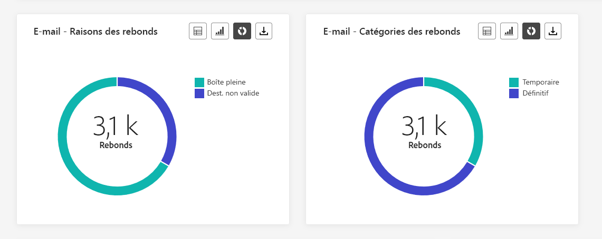

Les widgets **[!UICONTROL E-mail – Causes des rebonds]** et **[!UICONTROL E-mail – Catégories de rebond]** compilent les données disponibles relatives aux rebonds de messages, en fournissant des informations détaillées sur les raisons et catégories spécifiques à l’origine des rebonds d’e-mails.

Pour plus d’informations sur les rebonds, consultez la page [Liste de suppression](../reports/suppression-list.md).

+++ En savoir plus sur les mesures E-mail – Catégories de rebonds

* **[!UICONTROL Rebond définitif]** : nombre total d’erreurs permanentes, telles qu’une adresse e-mail incorrecte. Un message d&#39;erreur indique explicitement que l&#39;adresse n&#39;est pas valide, comme Utilisateur inconnu.

* **[!UICONTROL Rebond temporaire]** : nombre total d’erreurs temporaires, telles qu’une boîte de réception pleine.

* **[!UICONTROL Ignorées]** : nombre total d&#39;erreurs temporaires (par exemple, Absent(e) du bureau) ou techniques (par exemple, si le type d&#39;expéditeur est administrateur).

+++

### E-mail – Causes d’erreur {#errors-email}

>[!CONTEXTUALHELP]
>id="ajo_campaign_global_email_error_reasons"
>title="E-mail – Causes d’erreur"
>abstract="Les graphiques et le tableau E-mail - Causes d’erreur vous permettent d’identifier les erreurs spécifiques qui se sont produites au cours du processus d’envoi."

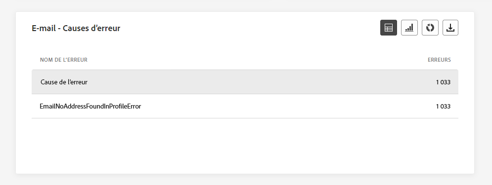

Les graphes et le tableau **[!UICONTROL Causes d’erreur]** offrent une visibilité des erreurs spécifiques survenues pendant le processus d’envoi, en fournissant des informations précieuses sur la nature et l’occurrence des erreurs.

Vous pouvez choisir de basculer depuis un tableau, un graphique à barres ou en anneau.

### E-mail – Causes d’exclusion {#excluded-email}

>[!CONTEXTUALHELP]
>id="ajo_campaign_global_email_excluded_reasons"
>title="E-mail – Causes d’exclusion"
>abstract="Les graphiques et le tableau Causes d’exclusion illustrent les différents facteurs qui ont conduit à ce que des profils de personnes, exclus de l’audience ciblée, ne reçoivent pas le message."

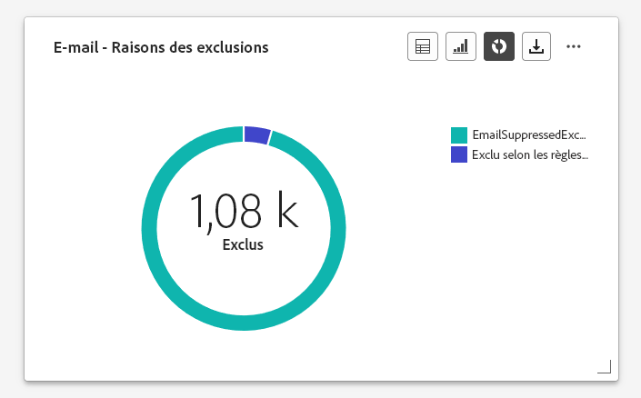

Les graphes et le tableau **[!UICONTROL Causes d’exclusion]** présentent une vue d’ensemble complète des différents facteurs qui ont abouti à l’exclusion des profils de personnes de l’audience ciblée, ayant pour effet que le message n’a pas été reçu.

Consultez [cette page](exclusion-list.md) pour la liste complète des causes d’exclusion.

### Envoyés et diffusés par domaines {#sent-domains}

>[!CONTEXTUALHELP]
>id="ajo_campaign_global_email_sent_domains"
>title="Envoyés et diffusés par domaines"
>abstract="Le tableau et le graphe Envoyés et diffusés par domaines fournissent une ventilation des e-mails classés par domaines, ce qui présente des informations détaillées sur les performances globales de vos communications par e-mail."

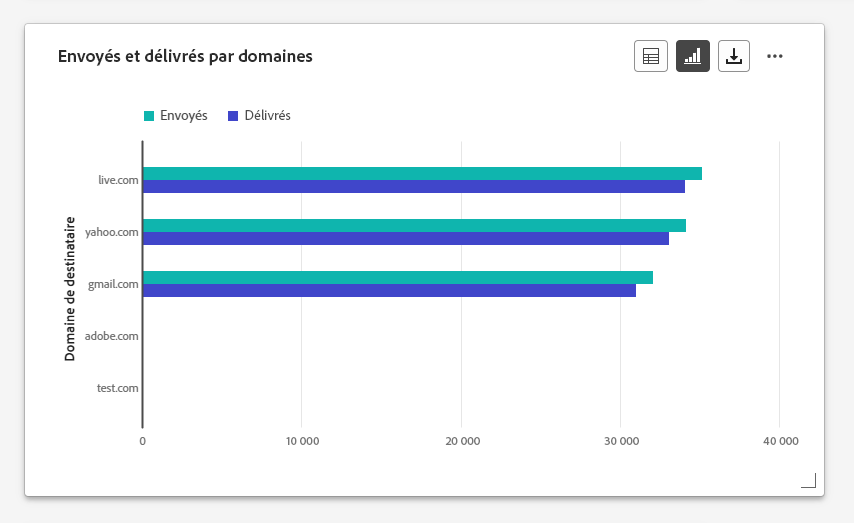

Le tableau et le graphe **[!UICONTROL Envoyés et diffusés par domaines]** fournissent une répartition détaillée des e-mails au niveau du domaine, ce qui vous permet d’obtenir des informations complètes sur les performances de vos e-mails.

+++ En savoir plus sur les mesures Envoyés et diffusés par domaines

* **[!UICONTROL Envoyés]** : nombre total d’e-mails envoyés.

* **[!UICONTROL Diffusés]** : nombre d’e-mails envoyés avec succès, par rapport au nombre total d’e-mails envoyés.

+++

### Rebonds et erreurs par domaine {#bounces-domains}

>[!CONTEXTUALHELP]
>id="ajo_campaign_global_email_bounces_domains"
>title="Rebonds et erreurs par domaine"
>abstract="Le tableau et le graphe Rebonds et erreurs par domaines fournissent une répartition détaillée au niveau du domaine, offrant ainsi des informations sur les erreurs spécifiques rencontrées lors du processus d’envoi des e-mails."

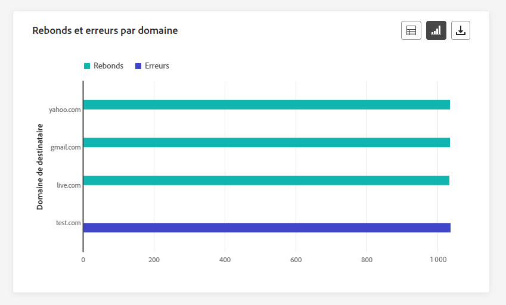

Le graphe et le tableau **[!UICONTROL Rebonds et erreurs par domaine]** fournissent une répartition au niveau du domaine des erreurs spécifiques rencontrées lors du processus d’envoi, fournissant ainsi une analyse détaillée des problèmes qui se sont produits.

+++ En savoir plus sur les mesures Rebonds et erreurs par domaine

* **[!UICONTROL Rebonds]** : nombre total d’erreurs cumulées lors de la procédure d’envoi et du traitement automatique des retours par rapport au nombre total d’e-mails envoyés.

* **[!UICONTROL Erreurs]** : nombre total d’erreurs survenues au cours du processus d’envoi, empêchant l’envoi de votre e-mail à des profils.

+++

### Ouvertures et clics par domaines {#opens-domains}

>[!CONTEXTUALHELP]
>id="ajo_campaign_global_email_open_domains"
>title="Ouvertures et clics par domaines"
>abstract="Le graphe et le tableau Ouvertures et clics par domaines offre une ventilation détaillée au niveau du domaine, présentant une vue complète de l’interaction de votre audience avec vos e-mails."

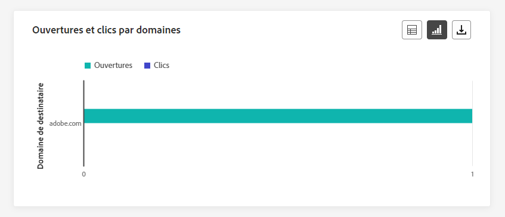

Le graphe et le tableau **[!UICONTROL Ouvertures et clics par domaines]** présentent une répartition au niveau du domaine de l’engagement de vos profils avec votre e-mail, fournissant des informations précieuses sur la manière dont les différents domaines interagissent avec votre contenu.

+++ En savoir plus sur la mesure Ouverture et clics par domaines

* **[!UICONTROL Ouvertures]** : nombre de fois où l’e-mail a été ouvert.

* **[!UICONTROL Clics]** : nombre de fois où un contenu a fait l’objet d’un clic dans un e-mail.

+++

### Raisons de rebond par domaine {#bounce-reasons-domains}

>[!CONTEXTUALHELP]
>id="ajo_campaign_global_email_bounces_reasons_domains"
>title="Raisons de rebond par domaine"
>abstract="Le tableau et graphe Raisons des rebonds par domaine fournissent une répartition au niveau du domaine, offrant ainsi des informations exhaustives sur les erreurs temporaires et permanentes. Cette analyse détaillée vous fournit des informations précieuses sur les raisons spécifiques des rebonds."

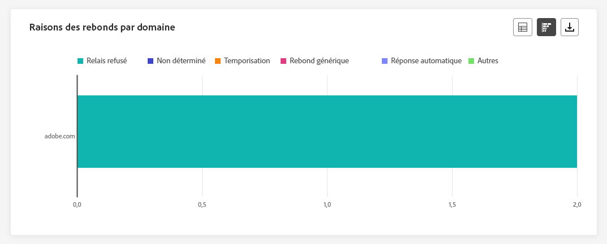

Le graphe et le tableau **[!UICONTROL Raisons de rebond par domaine]** fournissent une répartition au niveau du domaine des données concernant les erreurs temporaires et permanentes, fournissant ainsi des informations détaillées sur les raisons des messages ayant fait l’objet d’un rebond.

+++ En savoir plus sur la mesure Raisons de rebond par domaine

* **[!UICONTROL Ouvertures]** : nombre de fois où l’e-mail a été ouvert.

* **[!UICONTROL Clics]** : nombre de fois où un contenu a fait l’objet d’un clic dans un e-mail.

+++

### E-mail – Principale URL {#top-url-email}

>[!CONTEXTUALHELP]
>id="ajo_campaign_global_email_top_url"
>title="E-mail – Principale URL"
>abstract="Le tableau et le graphique E-mail - Principale URL offrent une vue d’ensemble complète des URL de votre e-mail qui reçoivent le plus de trafic, ce qui vous permet d’identifier les liens les plus populaires."

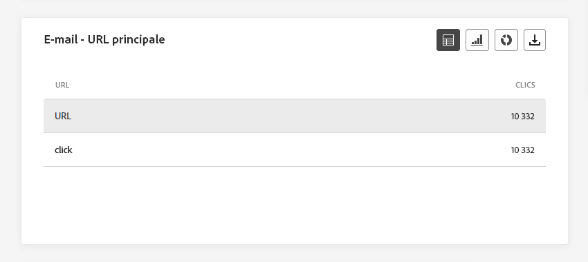

Le graphe et le tableau **[!UICONTROL E-mail – Principale URL]** fournissent un aperçu complet des URL de votre e-mail qui attirent le plus de visiteurs et visiteuses. Cela vous permet d’identifier et de hiérarchiser les liens les plus populaires, ce qui améliore votre compréhension de l’engagement des profils avec du contenu spécifique dans vos e-mails.

### E-mail – Meilleur domaine de la personne destinataire {#top-recipient-email}

>[!CONTEXTUALHELP]
>id="ajo_campaign_global_email_best_recipient"
>title="E-mail – Meilleur domaine de la personne destinataire"
>abstract="Le tableau et le graphique E-mail - Meilleur domaine de destinataire fournissent une ventilation détaillée des domaines que les personnes destinataires utilisent le plus souvent pour ouvrir l’e-mail, offrant des informations précieuses sur le comportement des personnes destinataires."

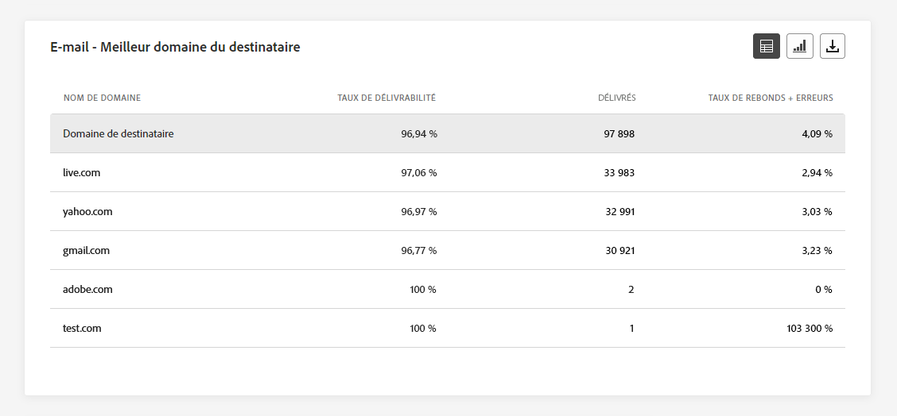

>[!CAUTION]
>
> Le widget **[!UICONTROL E-mail – Meilleur domaine de la personne destinataire]** a un taux de précision de 99,95 %.

Le graphe et le tableau **[!UICONTROL E-mail – Meilleur domaine de la personne destinataire]** présentent une répartition détaillée des domaines que les profils utilisent le plus souvent pour ouvrir vos e-mails. Vous obtenez ainsi des informations précieuses sur le comportement des profils, ce qui vous permet de connaître les plateformes préférées.

+++ En savoir plus sur les mesures E-mail – Meilleur domaine de la personne destinataire

* **[!UICONTROL Diffusés]** : nombre d’e-mails envoyés avec succès, par rapport au nombre total d’e-mails envoyés.

* **[!UICONTROL Taux de diffusion]** : pourcentage d’e-mails envoyés avec succès.

* **[!UICONTROL Taux de rebonds + erreurs]** : pourcentage d’e-mails ayant fait l’objet d’un rebond par rapport aux e-mails envoyés.

+++

### E-mail – Optimisation {#optimized-email}

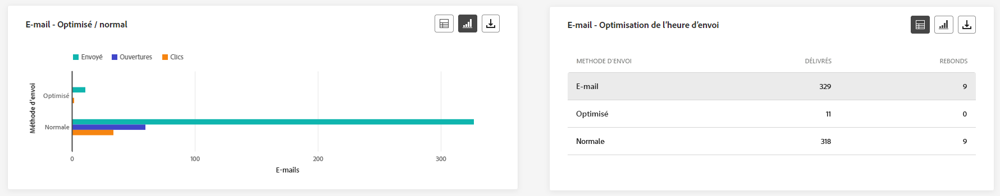

>[!NOTE]
>
>Les widgets **[!UICONTROL Optimisé ou non optimisé]** et **[!UICONTROL Optimisation de l’heure d’envoi]** ne sont disponibles que si l’option Optimisation de l’heure d’envoi est activée pour votre e-mail. Pour plus d’informations sur l’optimisation de l’heure d’envoi, consultez [cette page](../building-journeys/journeys-message.md#send-time-optimization).

Les widgets **[!UICONTROL Optimisé ou non optimisé]** et **[!UICONTROL Optimisation de l’heure d’envoi]** détaillent les principales informations relatives à votre message, qu’elles soient optimisées ou non.

+++ En savoir plus sur la mesure Optimisation de l’heure d’envoi

* **[!UICONTROL Envoyés]** : nombre total d’e-mails envoyés.

* **[!UICONTROL Ouvertures]** : nombre de fois que le message a été ouvert.

* **[!UICONTROL Clics]** : nombre de fois où un contenu a fait l’objet d’un clic dans un e-mail.

* **[!UICONTROL Délivrés]** : nombre de messages envoyés avec succès, par rapport au nombre total de messages envoyés.

* **[!UICONTROL Rebonds]** : nombre total d’erreurs cumulées lors de la procédure d’envoi et du traitement automatique des retours par rapport au nombre total de messages envoyés.

+++

### E-mail – Offres {#email-offers}

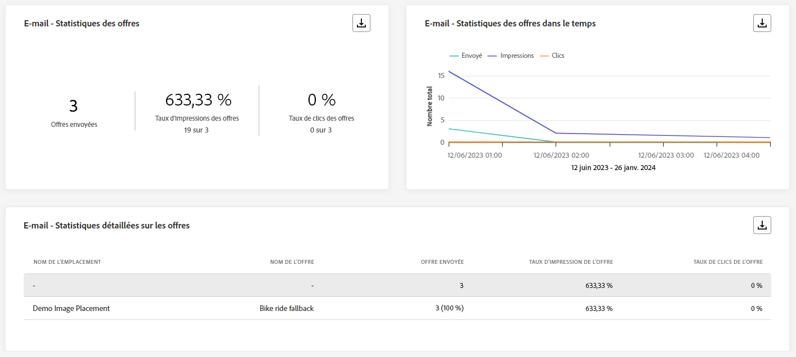

Les widgets **[!UICONTROL Statistiques des offres]**, **[!UICONTROL Statistiques des offres dans le temps]** et **[!UICONTROL Statistiques détaillées sur les offres]** mesurent le succès et l’impact de votre offre sur votre audience ciblée.

+++ En savoir plus sur les mesures E-mail – Offres

* **[!UICONTROL Offre envoyée]** : nombre total d’envois pour l’offre.

* **[!UICONTROL Impression de l’offre]** : nombre d’ouvertures de l’offre dans vos e-mails.

* **[!UICONTROL Clics sur l’offre]** : nombre de clics sur une offre dans vos e-mails.

* **[!UICONTROL Nom de l’emplacement]** : nom de l’emplacement utilisé pour afficher votre offre. Pour plus d’informations sur les emplacements, consultez cette [page](../offers/offer-library/creating-placements.md).

* **[!UICONTROL Nom de l’offre]** : nom de l’offre ajoutée dans la diffusion. Pour plus d’informations sur les emplacements, consultez cette [page](../offers/offer-library/creating-personalized-offers.md).

* **[!UICONTROL Offre envoyée]** : nombre total d’envois pour l’offre.

* **[!UICONTROL Taux d’impression de l’offre]** : pourcentage d’offres ouvertes par rapport au nombre d’offres envoyées.

+++

## Onglet In-app {#inapp-global}

Dans le **[!UICONTROL Rapport global]** de votre campagne, l’onglet **[!UICONTROL In-app]** détaille les principales informations relatives aux messages In-app envoyés dans votre campagne.

### Performances in-app {#in-app-performance}

>[!CONTEXTUALHELP]
>id="ajo_campaign_global_inapp_performance"
>title="Performances in-app"
>abstract="Les KPI de performances in-app fournissent des informations essentielles sur l’engagement de vos visiteurs et visiteuses avec les messages in-app."

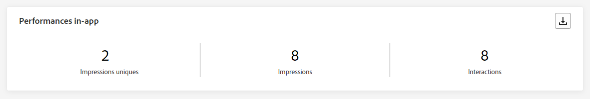

Les KPI **[!UICONTROL Performances in-app]** fournissent des informations essentielles sur l’engagement des visiteurs et visiteuses avec les messages in-app, en fournissant des mesures centrales pour évaluer l’efficacité et l’impact de vos campagnes in-app.

+++ En savoir plus sur les mesures Performances in-app

* **[!UICONTROL Impressions uniques]** : nombre d’utilisateurs uniques auxquels le message in-app a été délivré.

* **[!UICONTROL Impressions]** : nombre total de messages in-app diffusés à tous les utilisateurs et utilisatrices.

* **[!UICONTROL Interactions]** : nombre total d’engagements en lien avec votre message in-app. Cela inclut toutes les actions entreprises par les personnes, telles que les clics, les abandons ou toute autre interaction.

+++

### Interactions par type {#interactions-type}

>[!CONTEXTUALHELP]
>id="ajo_campaign_global_inapp_interactions"
>title="Interactions par type"
>abstract="Les graphiques et le tableau Interactions par type détaillent la manière dont les personnes ont interagi avec votre message in-app en suivant les clics, les rejets ou les interactions."

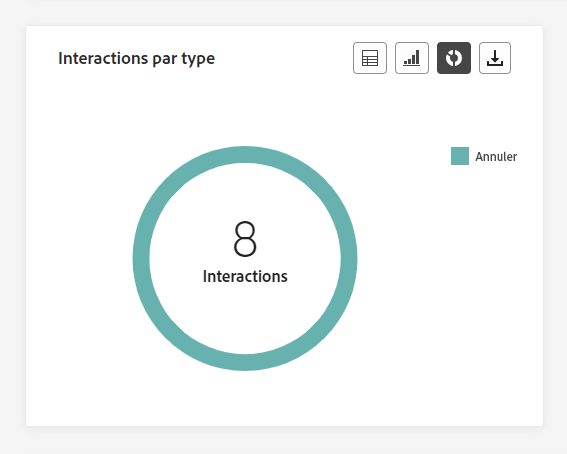

Les graphes et le tableau **[!UICONTROL Interactions par type]** fournissent un compte-rendu détaillé de la manière dont les profils ont interagi avec votre message in-app, en suivant des actions telles que les clics, les rejets ou toute autre forme d’engagement.

### Synthèse in-app {#in-app-summary}

>[!CONTEXTUALHELP]
>id="ajo_campaign_global_inapp_summary"
>title="Synthèse in-app"
>abstract="Le graphique Résumé in-app présente l’évolution de vos impressions et interactions in-app pour la période concernée."

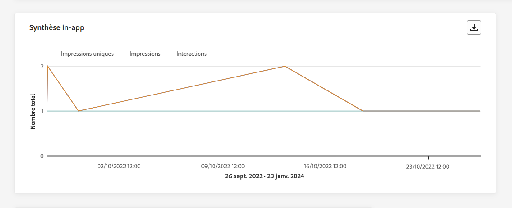

Le graphe **[!UICONTROL Résumé in-app]** illustre la progression de vos impressions et interactions in-app au cours de la période spécifiée, en fournissant une vue d’ensemble complète des performances de vos messages in-app.

+++ En savoir plus sur les mesures Synthèse in-app

* **[!UICONTROL Impressions uniques]** : nombre d’utilisateurs uniques auxquels le message in-app a été délivré.

* **[!UICONTROL Impressions]** : nombre total de messages in-app diffusés à tous les utilisateurs et utilisatrices.

* **[!UICONTROL Interactions]** : nombre total d’engagements en lien avec votre message in-app. Cela inclut toutes les actions entreprises par les personnes, telles que les clics, les abandons ou toute autre interaction.

+++

## Onglet Notification push {#push-global}

Dans le **[!UICONTROL Rapport global]** de votre campagne, l’onglet **[!UICONTROL Notification push]** détaille les principales informations relatives aux notifications push envoyées dans votre campagne.

### Notification push – Statistiques d’envoi {#push-sending-statistics}

>[!CONTEXTUALHELP]
>id="ajo_campaign_global_push_sending_statistics"
>title="Notification push – Statistiques d’envoi"
>abstract="Le tableau Notification push - Statistiques d’envoi résume les données essentielles sur vos notifications push, telles que les messages ciblés ou diffusés."

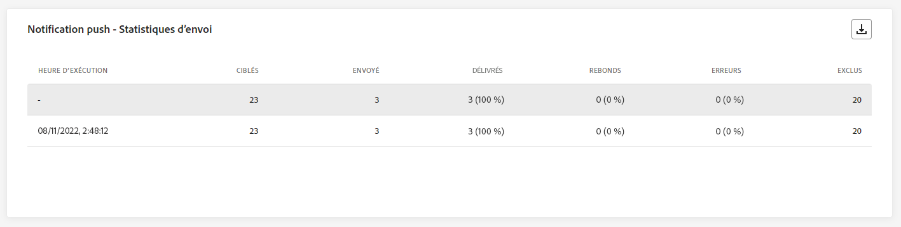

Le tableau **[!UICONTROL Notification push – Statistiques d’envoi]** fournit un résumé concis des données essentielles liées à vos notifications push, y compris les mesures clés telles que le nombre de messages ciblés et le nombre de messages diffusés avec succès.

+++ En savoir plus sur les mesures Notification push – Statistiques d’envoi

* **[!UICONTROL Heure d’exécution]** : heure de début de chaque exécution de votre notification push récurrente. Pour ne cibler qu’une ou plusieurs notifications push récurrentes, sélectionnez-les dans le menu déroulant **[!UICONTROL Heure d’exécution]**.

* **[!UICONTROL Ciblées]** : nombre total de notifications push traitées lors de l’analyse.

* **[!UICONTROL Envoyées]** : nombre total d’envois pour la notification push.

* **[!UICONTROL Délivrées]** : nombre de notifications push envoyées avec succès, par rapport au nombre total de notifications push envoyées.

* **[!UICONTROL Taux de diffusion]** : pourcentage de notifications push envoyées avec succès.

* **[!UICONTROL Rebonds]** : nombre total d’erreurs cumulées lors du processus d’envoi et du traitement automatique des retours par rapport au nombre total de notifications push envoyées.

* **[!UICONTROL Taux de rebond]** : pourcentage de notifications push ayant rebondi par rapport aux notifications push envoyées.

* **[!UICONTROL Erreurs]** : nombre total d’erreurs survenues empêchant l’e-mail d’être envoyé à des profils.

* **[!UICONTROL Taux d’erreurs]** : pourcentage d’erreurs survenues empêchant l’envoi de l’e-mail, par rapport aux notifications push envoyées.

* **[!UICONTROL Exclus]** : nombre de profils qui ont été exclus par Adobe Journey Optimizer.

+++

### Notification push – Statistiques de tracking {#push-tracking-statistics}

>[!CONTEXTUALHELP]
>id="ajo_campaign_global_push_tracking_statistics"
>title="Notification push – Statistiques de tracking"
>abstract="Les statistiques de tracking des notifications push fournissent des données sur l’activité de profil pour votre notification push."

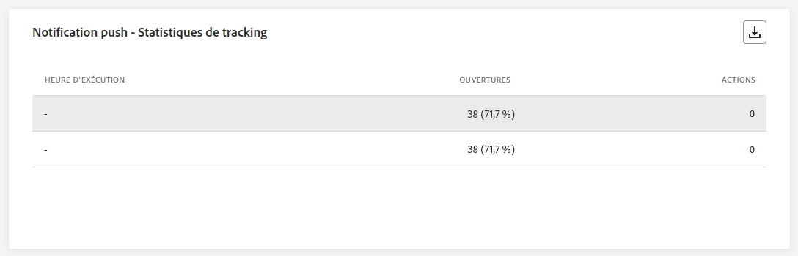

Le widget **[!UICONTROL Notification push – Statistiques de tracking]** offre un instantané détaillé de l’activité de profil liée à vos notifications push, en fournissant des informations essentielles sur l’engagement et l’efficacité des notifications push.

+++ En savoir plus sur les mesures Notification push – Statistiques de tracking

* **[!UICONTROL Heure d’exécution]** : heure de début de chaque exécution de votre notification push récurrente. Pour ne cibler qu’une ou plusieurs notifications push récurrentes, sélectionnez-les dans le menu déroulant **[!UICONTROL Heure d’exécution]**.

* **[!UICONTROL Ouvertures]** : nombre de fois que votre notification push a été ouverte.

* **[!UICONTROL Actions]** : nombre total d’actions sur la notification push diffusée, par exemple clic sur un bouton ou rejet.

+++

### Notification push – Synthèse des envois {#push-summary}

>[!CONTEXTUALHELP]
>id="ajo_campaign_global_push_sending_summary"
>title="Notification push – Synthèse des envois"
>abstract="Le graphique Notification push - Synthèse des envois affiche les données disponibles pour les notifications push envoyées."

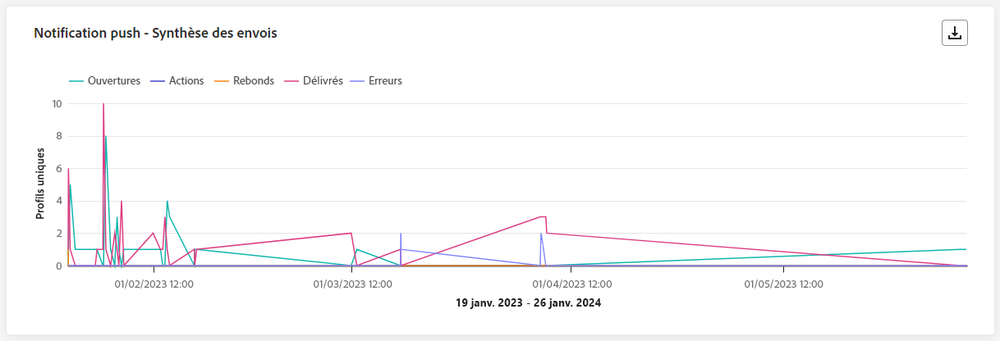

Le graphe **[!UICONTROL Notification push – Synthèse des envois]** offre une représentation dynamique, en affichant une analyse de votre activité de notifications push. Cette représentation graphique montre une répartition complète des notifications push envoyées.

+++ En savoir plus sur les mesures Notification push – Synthèse des envois

* **[!UICONTROL Ouvertures]** : nombre de fois que votre notification push a été ouverte.

* **[!UICONTROL Actions]** : nombre total d’actions sur la notification push diffusée, par exemple clic sur un bouton ou rejet.

* **[!UICONTROL Rebonds]** : nombre total d’erreurs cumulées et de traitements automatiques des retours par rapport au nombre total de notifications push envoyées.

* **[!UICONTROL Délivrées]** : nombre de notifications push envoyées avec succès, par rapport au nombre total de notifications push envoyées.

* **[!UICONTROL Erreurs]** : nombre total d’erreurs survenues empêchant la notification push d’être envoyée à des profils.

+++

### Notification push – Optimisation {#push-optimized}

>[!NOTE]
>
>Les widgets **[!UICONTROL Optimisé ou non optimisé]** et **[!UICONTROL Optimisation de l’heure d’envoi]** ne sont disponibles que si l’option Optimisation de l’heure d’envoi est activée pour vos notifications push. Pour plus d’informations sur l’optimisation de l’heure d’envoi, consultez [cette page](../building-journeys/journeys-message.md#send-time-optimization).

Les widgets **[!UICONTROL Optimisé ou non optimisé]** et **[!UICONTROL Optimisation de l’heure d’envoi]** détaillent les informations principales relatives à votre message, qu’elles soient optimisées ou non.

+++ En savoir plus sur les mesures Notification push – Optimisation de l’heure d’envoi

* **[!UICONTROL Délivrées]** : nombre de notifications push envoyées avec succès, par rapport au nombre total de notifications push envoyées.

* **[!UICONTROL Ouvertures]** : nombre de fois que votre notification push a été ouverte.

* **[!UICONTROL Actions]** : nombre total d’actions sur la notification push diffusée, par exemple clic sur un bouton ou rejet.

* **[!UICONTROL Rebonds]** : nombre total d’erreurs cumulées lors du processus d’envoi et du traitement automatique des retours par rapport au nombre total de notifications push envoyées.

+++

### Notification push – Causes d’erreur {#error-reasons-push}

>[!CONTEXTUALHELP]
>id="ajo_campaign_global_push_error_reasons"
>title="Notification push – Causes d’erreur"
>abstract="Les graphiques et le tableau Causes d’erreur vous permettent d’identifier les erreurs spécifiques qui se sont produites au cours du processus d’envoi."

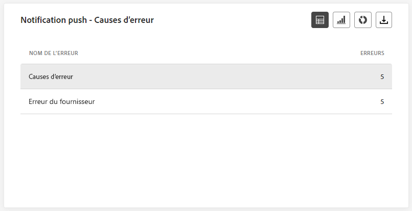

Le tableau et les graphes **[!UICONTROL Causes d’erreur]** vous permettent d’identifier les erreurs spécifiques qui se sont produites au cours du processus d’envoi de vos notifications push, en fournissant des informations détaillées sur les problèmes rencontrés en cours de route.

### Notification push – Causes d’exclusion {#excluded-push}

>[!CONTEXTUALHELP]
>id="ajo_campaign_global_push_excluded_reasons"
>title="Notification push – Causes d’exclusion"
>abstract="Les graphiques et le tableau Causes d’exclusion illustrent les différents facteurs qui ont conduit à ce que des profils de personnes, exclus de l’audience ciblée, ne reçoivent pas le message."

Les graphes et le tableau **[!UICONTROL Causes d’exclusion]** affichent les différentes causes qui ont empêché les profils de personnes, exclus des profils ciblés, de recevoir vos notifications push.

Consultez [cette page](exclusion-list.md) pour la liste complète des causes d’exclusion.

### Notification push – Répartition par plateforme {#breakdown-platform-push}

>[!CONTEXTUALHELP]
>id="ajo_campaign_global_push_breakdown_platform"
>title="Notification push – Répartition par plateforme"
>abstract="Le tableau et les graphes Notifications Push - Répartition par plateforme fournissent une répartition de la réussite de vos notifications push en fonction du système d’exploitation du profil."

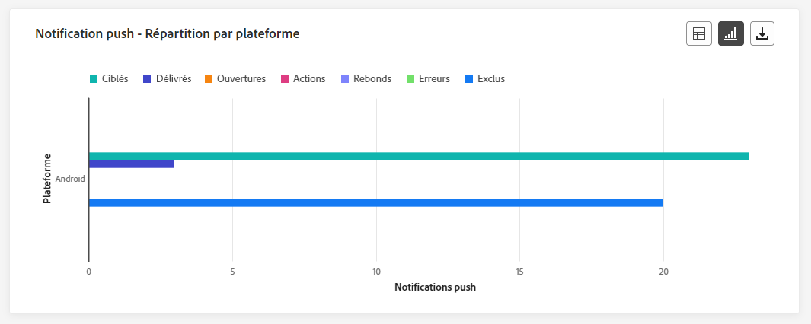

Le graphe et le tableau **[!UICONTROL Notification push – Répartition par plateforme]** fournissent une analyse détaillée du succès de vos notifications push, en vous présentant des informations en fonction du système d’exploitation de votre profil. Cette répartition vous permet de mieux comprendre les performances de vos notifications push sur différentes plateformes.

+++ En savoir plus sur les mesures Notification push – Répartition par plateforme

* **[!UICONTROL Ciblées]** : nombre total de notifications push traitées lors de l’analyse.

* **[!UICONTROL Délivrées]** : nombre de notifications push envoyées avec succès, par rapport au nombre total de notifications push envoyées.

* **[!UICONTROL Ouvertures]** : nombre de fois que votre notification push a été ouverte.

* **[!UICONTROL Actions]** : nombre total d’actions sur la notification push diffusée, par exemple clic sur un bouton ou rejet.

* **[!UICONTROL Rebonds]** : nombre total d’erreurs cumulées lors du traitement automatique des retours par rapport au nombre total de notifications push envoyées.

* **[!UICONTROL Erreurs]** : nombre total d’erreurs survenues empêchant la notification push d’être envoyée à des profils.

* **[!UICONTROL Exclus]** : nombre de profils qui ont été exclus par Adobe Journey Optimizer.

+++

## Onglet SMS {#sms-global}

Dans le **[!UICONTROL Rapport global]** de votre campagne, l’onglet **[!UICONTROL SMS]** détaille les principales informations relatives aux SMS envoyés dans votre campagne.

### SMS – Statistiques dʼenvoi {#sms-sending-statistics}

>[!CONTEXTUALHELP]
>id="ajo_campaign_global_sms_sending_statistics"
>title="SMS – Statistiques dʼenvoi"
>abstract="Le tableau SMS - Statistiques d’envoi résume les données essentielles relatives à vos SMS, telles que les messages ciblés ou distribués."

Le tableau **[!UICONTROL SMS – Statistiques d’envoi]** fournit un résumé concis des données essentielles liées à vos SMS, y compris les mesures clés telles que le nombre de messages ciblés et le nombre de messages livrés avec succès.

+++ En savoir plus sur les mesures SMS – Statistiques d’envoi

* **[!UICONTROL Heure d’exécution]** : heure de début de chaque exécution de votre SMS récurrent. Pour ne cibler qu’un ou plusieurs SMS récurrents, sélectionnez-les dans le menu déroulant **[!UICONTROL Heure d’exécution]**.

* **[!UICONTROL Ciblés]** : nombre de profils de personnes qui sont qualifiés en tant que profils cibles.

* **[!UICONTROL Exclus]** : nombre de profils utilisateurs, exclus des profils ciblés, qui n’ont pas reçu le message.

* **[!UICONTROL Envoyés]** : nombre total de SMS envoyés.

* **[!UICONTROL Rebonds]** : nombre total d’erreurs cumulées lors de la procédure d’envoi et du traitement automatique des retours par rapport au nombre total de SMS envoyés.

* **[!UICONTROL Erreurs]** : nombre total d’erreurs survenues empêchant l’e-mail d’être envoyé à des profils.

+++

### SMS – Statistiques de tracking {#sms-tracking-statistics}

>[!CONTEXTUALHELP]
>id="ajo_campaign_sms_tracking_statistics"
>title="SMS – Statistiques de tracking"
>abstract="Le widget SMS - Statistiques de suivi offre un aperçu exhaustif des informations essentielles relatives à l’interaction des visiteurs et visiteuses avec votre URL."

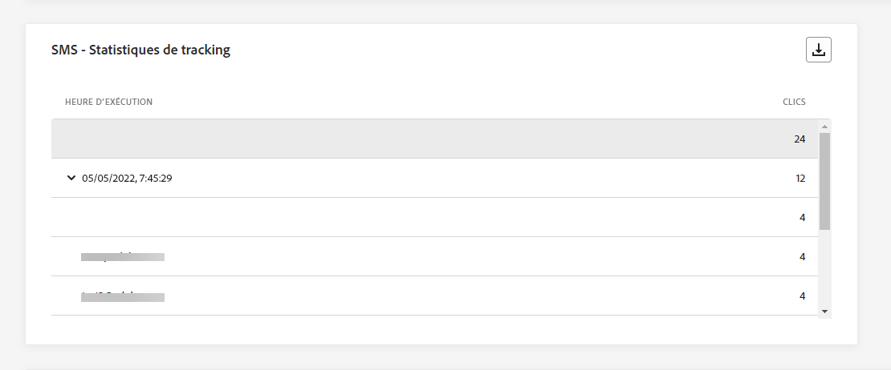

Le widget **[!UICONTROL SMS – Statistiques de tracking]** fournit une vue d’ensemble détaillée des informations clés relatives à l’engagement de vos visiteurs et de vos visiteuses avec vos URL, offrant des informations sur l’efficacité de vos SMS.

+++ En savoir plus sur les mesures SMS – Statistiques de tracking

* **[!UICONTROL Heure d’exécution]** : heure de début de chaque exécution de vos SMS récurrents. Pour ne cibler qu’un ou plusieurs SMS récurrents, sélectionnez-les dans le menu déroulant **[!UICONTROL Heure d’exécution]**.

* **[!UICONTROL Clics]** : nombre de clics sur un contenu dans un SMS.

+++

### SMS – Performances par date {#sms-perfomance-date}

>[!CONTEXTUALHELP]
>id="ajo_campaign_global_sms_performance"
>title="SMS – Performances par date"
>abstract="Le widget SMS - Performances par date fournit des informations essentielles sur vos messages via une représentation graphique."

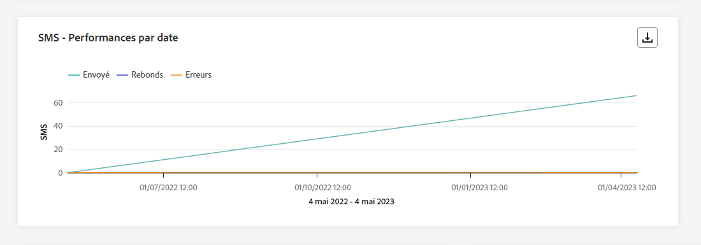

Le widget **[!UICONTROL Performances des SMS par date]** offre une vue d’ensemble détaillée des informations clés relatives à vos messages, présentée sous la forme d’un graphe, fournissant des informations sur les tendances de performances au cours de périodes spécifiques.

+++ En savoir plus sur les mesures SMS – Performances par date

* **[!UICONTROL Envoyés]** : nombre total de SMS envoyés.

* **[!UICONTROL Rebonds]** : nombre total d’erreurs cumulées lors de la procédure d’envoi et du traitement automatique des retours par rapport au nombre total de SMS envoyés.

* **[!UICONTROL Erreurs]** : nombre total d’erreurs survenues empêchant le SMS d’être envoyé à des profils.

+++

### SMS – Causes d’erreur {#sms-error}

>[!CONTEXTUALHELP]
>id="ajo_campaign_global_sms_error_reasons"
>title="SMS – Causes d’erreur"
>abstract="Les graphiques et le tableau SMS - Causes d’erreur vous permettent d’identifier les erreurs spécifiques qui se sont produites au cours du processus d’envoi."

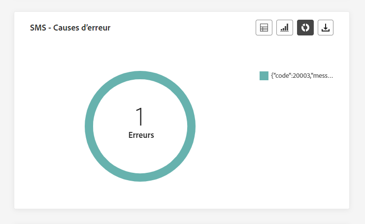

Les graphes et le tableau **[!UICONTROL Causes d’erreur]** vous permettent d’identifier les erreurs spécifiques qui se sont produites au cours du processus d’envoi de vos messages SMS, en fournissant une analyse minutieuse de tout problème rencontré.

### SMS – Causes d’exclusion {#sms-excluded-reasons}

>[!CONTEXTUALHELP]
>id="ajo_campaign_global_sms_excluded_reasons"
>title="SMS – Causes d’exclusion"
>abstract="Les graphiques et le tableau Causes d’exclusion illustrent les différents facteurs qui ont conduit à ce que des profils de personnes, exclus de l’audience ciblée, ne reçoivent pas le message."

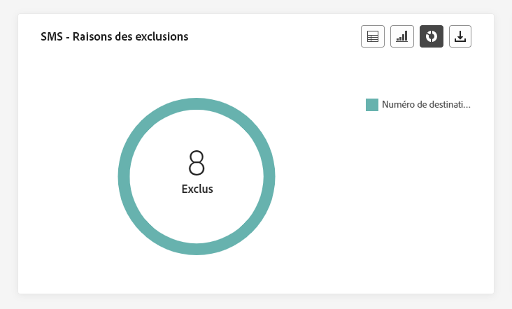

Les graphes et le tableau **[!UICONTROL Causes d’exclusion]** décrivent visuellement les différents facteurs qui ont conduit à l’exclusion des profils d’utilisateurs et d’utilisatrices de l’audience ciblée, ce qui les empêche de recevoir vos SMS.

Consultez [cette page](exclusion-list.md) pour obtenir la liste complète des causes d’exclusion.

### SMS – Causes de rebonds {#sms-bounces-reasons}

>[!CONTEXTUALHELP]
>id="ajo_campaign_global_sms_bounces_reasons"
>title="SMS – Causes de rebonds"
>abstract="Les graphiques et le tableau Causes de rebonds contiennent les données disponibles sur les messages ayant fait l’objet d’un rebond."

Les graphes et le tableau **[!UICONTROL Causes de rebonds]** fournissent une vue d’ensemble complète des données relatives aux rebonds de messages SMS, en fournissant des informations précieuses sur les raisons spécifiques à l’origine des rebonds de messages SMS.

### SMS – Clics par liens {#sms-clicks-links}

>[!CONTEXTUALHELP]
>id="ajo_campaign_global_sms_clicks_links"
>title="SMS – Clics par liens"
>abstract="Le widget SMS - Clics par liens fournit des informations essentielles sur l’engagement de vos visiteurs et visiteuses avec les URL dans vos messages."

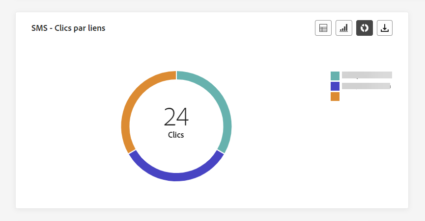

Le widget **[!UICONTROL SMS – Clics par liens]** offre des informations essentielles sur l’engagement de vos visiteurs et visiteuses avec les URL incluses dans vos messages, en fournissant des informations précieuses sur les liens qui attirent le plus d’interactions.

## Onglet web {#web-tab}

Depuis votre **[!UICONTROL rapport global]** de campagne, l’onglet **[!UICONTROL Web]** présente les informations principales relatives à vos pages web.

### Performances web {#web-performance}

>[!CONTEXTUALHELP]
>id="ajo_campaign_global_web_performance"
>title="Performances web"
>abstract="Les KPI de Performances web fournissent des informations complètes sur l’engagement de vos visiteurs et visiteuses avec vos expériences web."

Les KPI **[!UICONTROL Performances web]** fournissent des informations complètes sur l’engagement de vos visiteurs et visiteuses avec vos pages web, y compris des mesures clés telles que les impressions et les interactions.

+++ En savoir plus sur les mesures Performances web

* **[!UICONTROL Impressions uniques]** : nombre d’utilisateurs uniques auxquels l’expérience web a été diffusée.

* **[!UICONTROL Impressions]** : nombre total d’expériences web diffusées à tous les utilisateurs.

* **[!UICONTROL Taux d’interaction]** : pourcentage d’engagements en lien avec votre page web. Il s’agit de toutes les actions entreprises par les personnes, telles que les clics ou toute autre interaction.

+++

### Résumé web {#web-summary}

>[!CONTEXTUALHELP]
>id="ajo_campaign_global_web_summary"
>title="Résumé web"
>abstract="Le graphique Résumé web illustre la progression de vos expériences web, y compris les impressions, les impressions uniques et les interactions, au cours de la période indiquée."

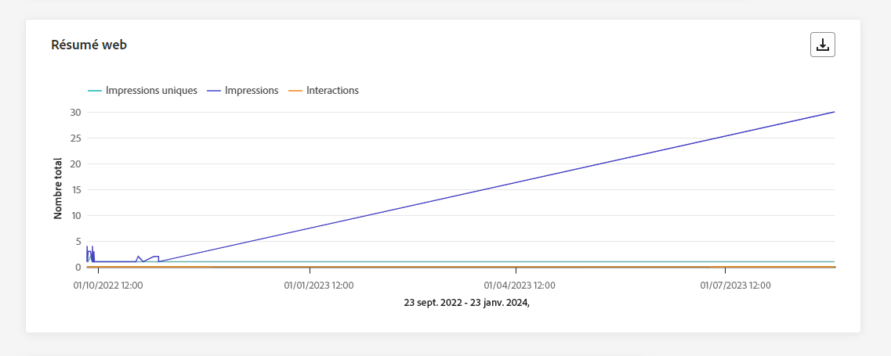

Le graphe **[!UICONTROL Résumé web]** présente l’évolution de vos expériences web (impressions, impressions uniques et interactions) pour la période concernée.

+++ En savoir plus sur les mesures Résumé web

* **[!UICONTROL Impressions uniques]** : nombre d’utilisateurs uniques auxquels l’expérience web a été diffusée.

* **[!UICONTROL Impressions]** : nombre total d’expériences web diffusées à tous les utilisateurs.

* **[!UICONTROL Interactions]** : nombre total d’engagements en lien avec votre page web. Il s’agit de toutes les actions entreprises par les personnes, telles que les clics ou toute autre interaction.

+++

### Interactions par élément {#web-interactions}

>[!CONTEXTUALHELP]
>id="ajo_campaign_global_web_interactions"
>title="Interactions par élément"
>abstract="Le tableau Interactions par élément fournit des informations clés sur l’engagement des visiteurs et visiteuses avec différents éléments de vos pages web."

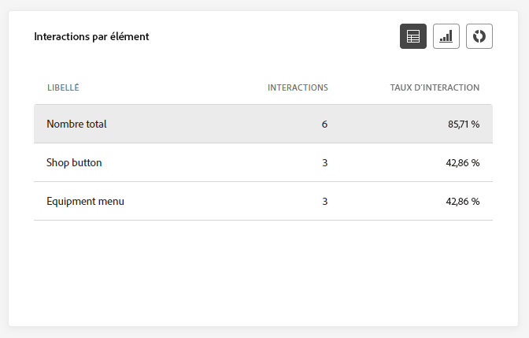

Le tableau **[!UICONTROL Interactions par élément]** présente des informations complètes sur l’engagement de vos visiteurs et visiteuses avec les différents éléments de vos pages web, ce qui vous offre des informations précieuses sur les interactions et les préférences des utilisateurs et utilisatrices.

+++ En savoir plus sur les mesures Interactions par élément

* **[!UICONTROL Interactions]** : nombre total d’engagements en lien avec votre page web. Il s’agit de toutes les actions entreprises par les personnes, telles que les clics ou toute autre interaction.

* **[!UICONTROL Taux d’interaction]** : pourcentage d’engagements en lien avec votre page web. Il s’agit de toutes les actions entreprises par les personnes, telles que les clics ou toute autre interaction.

+++

## Onglet Courrier {#direct-mail-global}

Dans le **[!UICONTROL rapport global]** de votre campagne, l’onglet **[!UICONTROL Courrier]** présente les principales informations relatives à vos messages de courrier.

### Courrier – Statistiques d’envoi {#direct-mail-sending-statistics}

>[!CONTEXTUALHELP]
>id="ajo_campaign_global_direct_sending_statistics"
>title="Courrier – Statistiques d’envoi"
>abstract="Le tableau Courrier - Statistiques d’envoi résume les données essentielles relatives à votre courrier, telles que les messages ciblés ou diffusés."

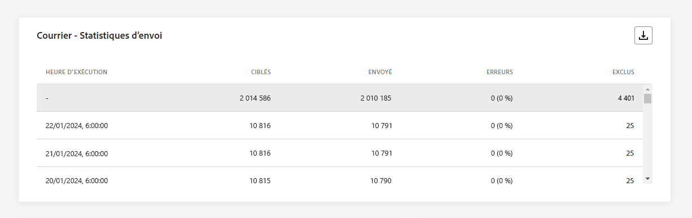

Le tableau **[!UICONTROL Courrier – Statistiques d’envoi]** fournit un résumé concis des données essentielles liées à vos messages de courrier, englobant des mesures clés telles que le nombre de messages ciblés et le nombre de messages diffusés avec succès.

+++ En savoir plus sur les mesures Courrier – Statistiques d’envoi

* **[!UICONTROL Heure d’exécution]** : heure de début de chaque exécution de votre publipostage direct récurrent. Pour ne cibler qu’un ou plusieurs publipostages directs récurrents, sélectionnez-les dans le menu déroulant **[!UICONTROL Heure d’exécution]**.

* **[!UICONTROL Ciblés]** : nombre de profils de personnes qui sont qualifiés en tant que profils cibles pour les messages de courrier.

* **[!UICONTROL Envoyés]** : nombre total de messages de courrier envoyés.

* **[!UICONTROL Erreurs]** : nombre total d’erreurs survenues au cours de la procédure d’envoi, empêchant le message d’être envoyé à des profils.

* **[!UICONTROL Exclus]** : nombre de profils de personnes, exclus des profils ciblés, qui n’ont pas reçu vos messages de courrier.

+++

### Courrier – Causes d’erreur {#direct-mail-error}

>[!CONTEXTUALHELP]
>id="ajo_campaign_global_direct_error_reasons"
>title="Courrier – Causes d’erreur"
>abstract="Les graphiques et le tableau Courrier - Causes d’erreur vous permettent d’identifier les erreurs spécifiques qui se sont produites au cours du processus d’envoi."

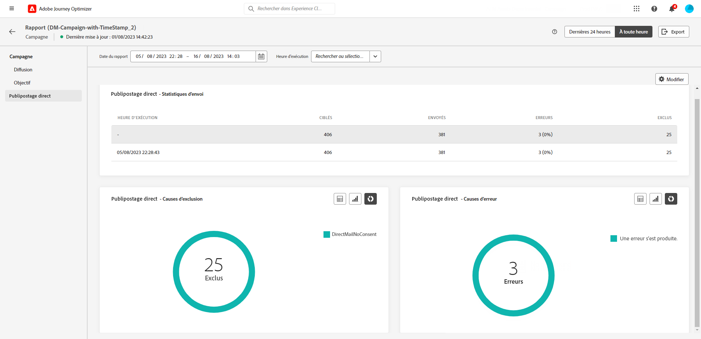

Les graphes et le tableau **[!UICONTROL Courrier – Causes d’erreur]** permettent d’identifier les erreurs spécifiques qui se sont produites pendant le processus d’envoi de vos messages de courrier, ce qui permet d’analyser en détail les éventuels problèmes rencontrés.

### Courrier – Causes d’exclusion {#direct-mail-excluded}

>[!CONTEXTUALHELP]
>id="ajo_campaign_global_direct_excluded_reasons"
>title="Courrier – Causes d’exclusion"
>abstract="Les graphiques et le tableau Courrier - Causes d’exclusion illustrent les différents facteurs qui ont conduit à ce que des profils de personnes, exclus de l’audience ciblée, ne reçoivent pas le message."

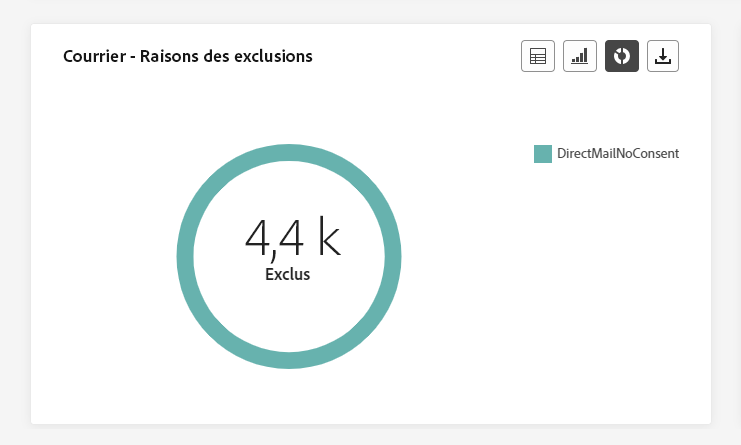

Les graphes et le tableau **[!UICONTROL Courrier – Causes d’exclusion]** illustrent visuellement les différents facteurs qui ont abouti à l’exclusion des profils de personnes de l’audience ciblée, ce qui les empêche de recevoir vos messages de courrier.

Consultez [cette page](exclusion-list.md) pour la liste complète des causes d’exclusion.

## Ressources supplémentaires

* [Commencer avec les campagnes](../campaigns/get-started-with-campaigns.md)
* [Création d’une campagne](../campaigns/create-campaign.md)
* [Créer des campagnes déclenchées par API](../campaigns/api-triggered-campaigns.md)
* [Modification ou arrêt d’une campagne](../campaigns/modify-stop-campaign.md)
* [Rapport dynamique de campagne](campaign-live-report.md)
