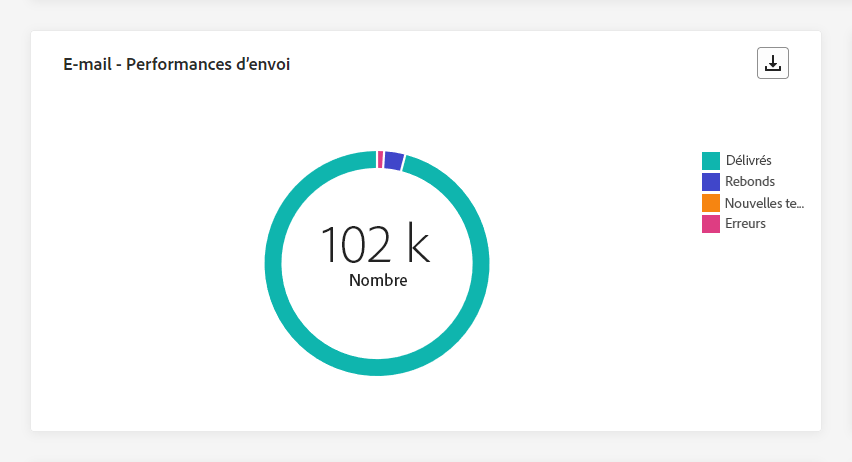

# Rapport global de campagne {#campaign-global-report}

>[!CONTEXTUALHELP]
>id="ajo_campaign_global_report"
>title="Rapport global de campagne"
>abstract="Le rapport global de campagne permet de mesurer l’efficacité de vos campagnes au cours d’une période donnée. Le rapport dyamique de campagne est composé de plusieurs widgets présentant le succès et les erreurs de votre campagne. Vous pouvez modifier chaque tableau de bord de reporting en redimensionnant ou en supprimant des widgets."

Les rapports globaux, accessibles à partir de l’onglet **À toute heure**, affichent les événements qui se sont produits il y a au moins deux heures et couvrent les événements sur une période sélectionnée. En comparaison, les rapports dynamiques portent sur les événements qui se sont produits au cours des dernières 24 heures, avec un intervalle de temps minimal de deux minutes à compter de l’occurrence de l’événement.

Pour accéder directement au rapport global de campagne à partir de votre campagne, cliquez sur le bouton **[!UICONTROL Afficher le rapport]**.

La page **[!UICONTROL Rapport global]** de la campagne s&#39;affiche avec les onglets suivants :

* [Campagne](#campaign-global)
* [E-mail](#email-global)
* [In-app](#inapp-global)
* [Notification push](#push-global)
* [SMS](#sms-global)
* [Web](#web-tab)
* [Publipostage direct](#direct-mail-global)

Le **[!UICONTROL Rapport global]** de campagne est divisé en différents widgets présentant le succès et les erreurs de votre campagne. Chaque widget peut être redimensionné et supprimé si nécessaire. Pour plus d&#39;informations à ce propos, consultez cette [section](../reports/global-report.md#modify-dashboard).

Pour obtenir la liste détaillée de chaque mesure disponible dans Adobe Journey Optimizer, reportez-vous à [cette page](global-report.md#list-of-components-global.md).

## Onglet Campagne {#campaign-global}

### Diffusion {#delivery-global}

>[!CONTEXTUALHELP]
>id="ajo_campaign_delivery_global"
>title="Statistiques de la campagne"
>abstract="Le widget Statistiques de la campagne présente les informations principales relatives à votre campagne, telles que les profils saisis et les actions diffusées."

La variable **[!UICONTROL Statistiques de la campagne]** Les indicateurs de performance clés constituent un tableau de bord complet, qui propose une ventilation détaillée des mesures clés liées à votre campagne. Cela inclut des informations essentielles telles que le nombre de profils et les actions diffusées, ce qui vous permet de bien comprendre les performances et l’engagement de votre campagne.

+++ En savoir plus sur les mesures de statistiques de Campaign

* **[!UICONTROL Audience]**: nombre de profils ciblés.

* **[!UICONTROL Actions réalisées]**: nombre total de fois où une action a été diffusée.

* **[!UICONTROL Les actions ont échoué en %]**: pourcentage de fois uniques où une action a échoué par rapport au nombre total de fois uniques où une action a été diffusée.

+++

<!--
### Objectives report {#objectives-global}

The **[!UICONTROL Objectives]** tab allows you to better fine-tune your deliveries' reports by targeting one specific metric.

The **[!UICONTROL Objectives]** listed are linked to **[!UICONTROL Datasets]** that define a connection to a system in order to retrieve additional information. A list of built-in **[!UICONTROL Objectives]** is available but you can add your own by adding new **[!UICONTROL Dataset]**. For the detailed procedure, refer to this [section](../campaigns/reporting-configuration.md).

After selecting the Objectives you want to target on, the two **[!UICONTROL Performance overview]** and **[!UICONTROL Campaign objective]** widgets will provide a detailed summary of your delivery performance. 

With the **[!UICONTROL Campaign objective]** widget, you can also choose to compare your main objective with another metric.
-->

### Rapport d’expérience {#experimentation-global}

>[!CONTEXTUALHELP]
>id="ajo_campaigns_content_experiment_click"
>title="Mesure de succès"
>abstract="Valeur totale de la mesure de succès, précédemment sélectionnée lors de la création de vos expériences, divisée par le nombre de profils."

L’onglet **[!UICONTROL Expérimentation]** fournit des informations clés sur les performances de chaque variante et identifie la variante la plus réussie.

Notez que la définition de meilleure performance peut prendre un certain temps, elle sera représentée par cette icône .

+++En savoir plus sur les différents widgets et mesures disponibles pour le rapport d’expérience.

Le widget **[!UICONTROL Résultat de l’expérience]** décrit les performances de chaque variante. Vous pouvez modifier votre ligne de base en sélectionnant l’un des traitements du menu déroulant **[!UICONTROL Ligne de base]**. Le meilleur traitement sera signalé par une icône en forme d’étoile.

Pour un examen approfondi de ces résultats et de leur interprétation, reportez-vous à [cette page](../campaigns/get-started-experiment.md#interpret-results).

Le tableau présente les mesures suivantes :

* **[!UICONTROL Élévation de la ligne de base]** : mesure de l’amélioration en pourcentage du taux de conversion d’un traitement donné par rapport à la ligne de base.

* **[!UICONTROL Confiance]** : preuves qu’un traitement donné est le même que le traitement de la ligne de base. [En savoir plus](../campaigns/experiment-calculations.md#understand-confidence)

* **[!UICONTROL Clics sortants uniques]** : nombre total de clics sur les canaux sortants.

* **[!UICONTROL Profils]** : nombre de profils ciblés pour ce traitement.

* **[!UICONTROL Clips sortants uniques/profils]** : valeur totale de la mesure de succès, précédemment sélectionnée lors de la création de vos expériences, divisée par le nombre de profils.

Le graphe **[!UICONTROL Intervalle de confiance]** mesure l’incertitude quant à l’amélioration. Il indique la différence de performance en pourcentage entre la ligne de base et le traitement le plus performant. [En savoir plus](../campaigns/experiment-calculations.md#confidence-intervals).

Le dernier widget fournit des données relatives à la **[!UICONTROL Mesure de succès]** que vous avez précédemment sélectionné pour vos traitements. Vous avez la possibilité de sélectionner une autre mesure ciblée dans le menu déroulant **[!UICONTROL Mesure]** pour suivre des données alternatives.

>[!CAUTION]
>
>Lorsque vous utilisez des mesures filtrées pour l’expérimentation, notez que la modification de la sélection de mesure dans la liste déroulante de la page de comparaison pour l’expérimentation ne conserve pas la valeur du filtre. Par exemple, le passage de « Clics » à « Clics uniques » entraînera la perte du filtre appliqué, rendant la comparaison inexacte ou non valide.

+++

## Onglet E-mail {#email-global}

### Email - Statistiques d’envoi {#sending-statistics-email}

>[!CONTEXTUALHELP]
>id="ajo_campaign_global_email_sending_statistics"
>title="E-mail - Statistiques d’envoi"
>abstract="Le tableau E-mail - Statistiques d’envoi résume les données essentielles relatives à votre e-mail, telles que Ciblé ou Diffusé."

La variable **[!UICONTROL Statistiques d’envoi d’emails]** Le tableau fournit un résumé complet des données essentielles concernant vos campagnes par e-mail. Il détaille les mesures clés, telles que la taille de l’audience ciblée et le nombre d’emails envoyés avec succès, ce qui vous permet d’obtenir des informations précieuses sur l’efficacité et la portée de vos emails.

+++ En savoir plus sur les mesures Statistiques d’envoi d’emails

* **[!UICONTROL Ciblés]**: nombre total d&#39;emails traités lors du processus d&#39;envoi.

* **[!UICONTROL Envoyés]** : nombre total d’e-mails envoyés.

* **[!UICONTROL Diffusés]** : nombre d’e-mails envoyés avec succès, par rapport au nombre total de messages envoyés.

* **[!UICONTROL Taux de diffusion]** : pourcentage d’e-mails envoyés avec succès.

* **[!UICONTROL Rebonds]** : nombre total d’erreurs cumulées lors de la procédure d’envoi et du traitement automatique des retours par rapport au nombre total de messages envoyés.

* **[!UICONTROL Taux de rebond]** : pourcentage d’e-mails ayant rebondi par rapport aux e-mails envoyés.

* **[!UICONTROL Erreurs]** : nombre total d’erreurs survenues au cours de la procédure d’envoi, empêchant le message d’être envoyé à des profils.

* **[!UICONTROL Taux d’erreurs]** : pourcentage d’erreurs survenues au cours de la procédure d’envoi, empêchant le message d’être envoyé, par rapport aux e-mails envoyés.

* **[!UICONTROL Reprises]** : nombre d’e-mails dans la file d’attente pour les reprises.

* **[!UICONTROL Exclus]** : nombre de profils qui ont été exclus par Adobe Journey Optimizer.

+++

### E-mail - Statistiques de tracking {#tracking-statistics-email}

>[!CONTEXTUALHELP]
>id="ajo_campaign_global_email_tracking_statistics"
>title="E-mail - Statistiques de tracking"
>abstract="Le tableau E-mail - Statistiques de tracking fournit les données sur l’activité de profil pour votre e-mail :"

La variable **[!UICONTROL Email - Statistiques de tracking]** offre un compte-rendu détaillé de l’activité de profil associée à vos campagnes par e-mail. Cela inclut des mesures sur les ouvertures, les clics et d’autres indicateurs d’engagement pertinents, offrant une vue d’ensemble complète de la manière dont les profils interagissent avec votre contenu d’email.

+++ En savoir plus sur les mesures de statistiques de suivi des emails

* **[!UICONTROL Ouvertures]** : nombre de fois que l’e-mail a été ouvert.

* **[!UICONTROL Ouvertures uniques]** : pourcentage d’e-mails ouverts.

* **[!UICONTROL Taux d’ouvertures]** : nombre total de messages ouverts par rapport au nombre de messages diffusés.

* **[!UICONTROL Clics]**: nombre de clics sur un contenu dans vos emails.

* **[!UICONTROL Clics uniques]**: nombre de profils ayant cliqué sur un contenu dans un email.

* **[!UICONTROL Taux de clics uniques]**: pourcentage d’utilisateurs qui ont interagi avec vos emails.

* **[!UICONTROL Désabonnements]** : nombre de clics sur le lien de désabonnement.

* **[!UICONTROL Plaintes contre le spam]** : nombre de fois où un message a été déclaré comme spam ou courrier indésirable.

+++

### Email - Envoi des performances {#sending-performance-email}

>[!CONTEXTUALHELP]
>id="ajo_campaign_global_email_sending_performance"
>title="E-mail - Performance d’envoi"
>abstract="Le graphique de performances Email - Envoi présente des données complètes sur les emails envoyés, en fournissant des informations sur les mesures clés telles que les envois et les retours, ce qui permet d’effectuer une analyse détaillée du processus de remise des emails."

La variable **[!UICONTROL Email - Envoi des performances]** Le graphique fournit une vue complète des données relatives aux emails envoyés, fournissant des informations sur les mesures clés telles que les envois et les bounces. Cela permet une analyse détaillée du processus d’envoi des emails, fournissant des informations précieuses sur l’efficacité et les performances de vos campagnes email.

+++ En savoir plus sur les e-mails - Envoi de mesures de performances

* **[!UICONTROL Diffusés]** : nombre d’e-mails envoyés avec succès, par rapport au nombre total d’e-mails envoyés.

* **[!UICONTROL Rebonds]**: Nombre total d&#39;erreurs cumulées lors du processus d&#39;envoi et du traitement automatique des retours par rapport au nombre total d&#39;emails envoyés.

* **[!UICONTROL Reprises]** : nombre d’e-mails dans la file d’attente pour les reprises.

* **[!UICONTROL Erreurs]** : nombre total d’erreurs survenues au cours de la procédure d’envoi, empêchant le message d’être envoyé à des profils.

+++

### Email - Raisons et catégories de bounce {#bounces-email}

>[!CONTEXTUALHELP]
>id="ajo_campaign_global_email_bounce_categories"
>title="E-mail - Catégories de rebond"
>abstract="Le tableau et les graphiques E-mail - Catégories de rebond fournissent des données sur les erreurs temporaires et permanentes."

>[!CONTEXTUALHELP]
>id="ajo_campaign_global_email_bounce_reasons"
>title="E-mail - Causes des rebonds"
>abstract="Les graphiques et le tableau E-mail - Causes des rebonds contiennent les données disponibles sur les messages ayant fait l’objet d’un rebond."

La variable **[!UICONTROL Email - Raisons de rebond]** et **[!UICONTROL Email - Catégories de rebond]** Les widgets compilent les données disponibles relatives aux messages rebonds, en fournissant des informations détaillées sur les raisons et catégories spécifiques des rebonds aux emails.

Pour plus d’informations sur les rebonds, consultez la page [Liste de suppression](../reports/suppression-list.md).

+++ En savoir plus sur les mesures Email - Catégories de rebond

* **[!UICONTROL Rebond définitif]** : nombre total d’erreurs permanentes, telles qu’une adresse e-mail incorrecte. Un message d&#39;erreur indique explicitement que l&#39;adresse n&#39;est pas valide, comme Utilisateur inconnu.

* **[!UICONTROL Rebond temporaire]** : nombre total d’erreurs temporaires, telles qu’une boîte de réception pleine.

* **[!UICONTROL Ignorées]** : nombre total d&#39;erreurs temporaires (par exemple, Absent(e) du bureau) ou techniques (par exemple, si le type d&#39;expéditeur est administrateur).

+++

### E-mail - Causes d’erreur {#errors-email}

>[!CONTEXTUALHELP]
>id="ajo_campaign_global_email_error_reasons"
>title="E-mail - Causes d’erreur"
>abstract="Les graphiques et le tableau E-mail - Causes d’erreur vous permettent d’identifier les erreurs spécifiques qui se sont produites au cours du processus d’envoi."

La variable **[!UICONTROL Raisons de l’erreur]** les graphiques et les tableaux offrent une visibilité des erreurs spécifiques survenues pendant le processus d’envoi, fournissant des informations précieuses sur la nature et l’occurrence des erreurs.

Vous pouvez choisir de basculer d’un tableau, d’un graphique à barres ou d’un anneau à l’autre.

### E-mail - Causes d’exclusion {#excluded-email}

>[!CONTEXTUALHELP]
>id="ajo_campaign_global_email_excluded_reasons"
>title="E-mail - Causes d’exclusion"
>abstract="Les graphiques et le tableau Causes d’exclusion illustrent les différents facteurs qui ont conduit à ce que des profils de personnes, exclus de l’audience ciblée, ne reçoivent pas le message."

La variable **[!UICONTROL Exclure des motifs]** les graphiques et les tableaux présentent une vue d’ensemble complète des différents facteurs qui ont abouti à l’exclusion des profils utilisateur de l’audience ciblée, ce qui a pour effet que le message n’a pas été reçu.

Voir [cette page](exclusion-list.md) pour la liste complète des motifs d&#39;exclusion.

### Envoyés et diffusés par domaines {#sent-domains}

La variable  **[!UICONTROL Envoyé et diffusé par domaines]** les tableaux et les graphiques fournissent une ventilation détaillée des emails au niveau du domaine, ce qui vous permet d’obtenir des informations complètes sur les performances de vos emails.

+++ En savoir plus sur les mesures Envoyés et distribués par domaines

* **[!UICONTROL Envoyés]** : nombre total d’e-mails envoyés.

* **[!UICONTROL Diffusés]** : nombre d’e-mails envoyés avec succès, par rapport au nombre total d’e-mails envoyés.

+++

### Rebonds et erreurs par domaine {#bounces-domains}

La variable  **[!UICONTROL Rebonds et erreurs par domaine]** Le graphique et le tableau offrent une ventilation au niveau du domaine des erreurs spécifiques rencontrées lors du processus d’envoi, fournissant une analyse détaillée des problèmes qui se sont produits.

+++ En savoir plus sur les mesures Rebonds et erreurs par domaine

* **[!UICONTROL Rebonds]**: Nombre total d&#39;erreurs cumulées lors du processus d&#39;envoi et du traitement automatique des retours par rapport au nombre total d&#39;emails envoyés.

* **[!UICONTROL Erreurs]**: nombre total d&#39;erreurs qui se sont produites au cours du processus d&#39;envoi empêchant l&#39;envoi de votre email aux profils.

+++

### Ouvertures et clics par domaines {#opens-domains}

La variable  **[!UICONTROL Ouverture et clics par domaine]** Le graphique et le tableau présentent une ventilation au niveau du domaine de l’engagement de vos profils avec votre email, fournissant des informations précieuses sur la manière dont différents domaines interagissent avec votre contenu.

+++ En savoir plus sur les mesures Ouverture et clics par domaine

* **[!UICONTROL Ouvertures]** : nombre de fois que l’e-mail a été ouvert.

* **[!UICONTROL Clics]**: nombre de clics sur un contenu dans un email.

+++

### Raisons de rebond par domaine {#bounce-reasons-domains}

La variable  **[!UICONTROL Raisons des bounces par domaine]** le graphique et le tableau offrent une ventilation au niveau du domaine des données concernant les erreurs temporaires et permanentes, fournissant des informations détaillées sur les raisons des messages rebonds.

+++ En savoir plus sur les raisons des rebonds par mesures de domaine

* **[!UICONTROL Ouvertures]** : nombre de fois que l’e-mail a été ouvert.

* **[!UICONTROL Clics]**: nombre de clics sur un contenu dans un email.

+++

### E-mail - Principale URL {#top-url-email}

>[!CONTEXTUALHELP]
>id="ajo_campaign_global_email_top_url"
>title="E-mail - Principale URL"
>abstract="Le tableau et le graphique E-mail - Principale URL offrent une vue d’ensemble complète des URL de votre e-mail qui reçoivent le plus de trafic, ce qui vous permet d’identifier les liens les plus populaires."

La variable **[!UICONTROL Email - Top Url]** Les graphiques et les tableaux fournissent un aperçu complet des URL de votre email qui attirent le plus de visiteurs. Cela vous permet d’identifier et de classer par priorité les liens les plus populaires, ce qui améliore votre compréhension de l’engagement des profils avec du contenu spécifique dans vos emails.

### E-mail - Meilleur domaine de destinataire {#top-recipient-email}

>[!CONTEXTUALHELP]
>id="ajo_campaign_global_email_best_recipient"
>title="E-mail - Meilleur domaine de destinataire"
>abstract="Le tableau et le graphique E-mail - Meilleur domaine de destinataire fournissent une ventilation détaillée des domaines que les personnes destinataires utilisent le plus souvent pour ouvrir l’e-mail, offrant des informations précieuses sur le comportement des personnes destinataires."

>[!CAUTION]
>
> La variable **[!UICONTROL Email - Meilleur domaine de destinataire]** Le widget a un taux de précision de 99,95 %.

La variable **[!UICONTROL Email - Meilleur domaine de destinataire]** Le graphique et le tableau présentent une ventilation détaillée des domaines que les profils utilisent le plus souvent pour ouvrir vos emails. Vous obtenez ainsi des informations précieuses sur le comportement des profils, ce qui vous permet de comprendre les plateformes préférées.

+++ En savoir plus sur Email - Meilleures mesures de domaine de destinataire

* **[!UICONTROL Diffusés]** : nombre d’e-mails envoyés avec succès, par rapport au nombre total d’e-mails envoyés.

* **[!UICONTROL Taux de diffusion]** : pourcentage d’e-mails envoyés avec succès.

* **[!UICONTROL Taux Bounces + Erreurs]**: pourcentage d&#39;emails qui ont fait l&#39;objet d&#39;un bounce par rapport aux emails envoyés.

+++

### Email - Optimisation {#optimized-email}

>[!NOTE]
>
>Les widgets **[!UICONTROL Optimisé ou non optimisé]** et **[!UICONTROL Optimisation de l’heure d’envoi]** ne sont disponibles que si l’option Optimisation de l’heure d’envoi est activée pour votre e-mail. Pour plus d’informations sur l’optimisation de l’heure d’envoi, consultez [cette page](../building-journeys/journeys-message.md#send-time-optimization).

La variable **[!UICONTROL Optimisé ou non optimisé]** et **[!UICONTROL Optimisation de l’heure d’envoi]** Les widgets détaillent les informations principales relatives à votre message, qu’elles soient optimisées ou non.

+++ En savoir plus sur les mesures d’optimisation du temps d’envoi

* **[!UICONTROL Envoyés]** : nombre total d’e-mails envoyés.

* **[!UICONTROL Ouvertures]** : nombre de fois que le message a été ouvert.

* **[!UICONTROL Clics]** : nombre de fois où un contenu a fait l’objet d’un clic dans un e-mail.

* **[!UICONTROL Délivrés]** : nombre de messages envoyés avec succès, par rapport au nombre total de messages envoyés.

* **[!UICONTROL Rebonds]** : nombre total d’erreurs cumulées lors de la procédure d’envoi et du traitement automatique des retours par rapport au nombre total de messages envoyés.

+++

### Email - Offres {#email-offers}

La variable **[!UICONTROL Statistiques des offres]**, **[!UICONTROL Statistiques des offres au fil du temps]** et **[!UICONTROL Statistiques détaillées des offres]** Les widgets mesurent le succès et l’impact de votre offre sur votre audience ciblée.

+++ En savoir plus sur les mesures Email - Offres

* **[!UICONTROL Offre envoyée]** : nombre total d’envois pour l’offre.

* **[!UICONTROL Impression de l&#39;offre]**: nombre de fois où l’offre a été ouverte dans vos courriers électroniques.

* **[!UICONTROL Clics sur les offres]**: nombre de clics sur une offre dans vos emails.

* **[!UICONTROL Nom de l’emplacement]** : nom de l’emplacement utilisé pour afficher votre offre. Pour plus d’informations sur les emplacements, consultez cette [page](../offers/offer-library/creating-placements.md).

* **[!UICONTROL Nom de l’offre]** : nom de l’offre ajoutée dans la diffusion. Pour plus d’informations sur les emplacements, consultez cette [page](../offers/offer-library/creating-personalized-offers.md).

* **[!UICONTROL Offre envoyée]** : nombre total d’envois pour l’offre.

* **[!UICONTROL Taux d’impression de l’offre]** : pourcentage d’offres ouvertes par rapport au nombre d’offres envoyées.

+++

## Onglet In-app {#inapp-global}

Depuis votre campagne **[!UICONTROL Rapport global]**, la variable **[!UICONTROL In-app]** Cet onglet présente les informations principales relatives aux messages In-App envoyés dans votre campagne.

### Performances in-app {#in-app-performance}

>[!CONTEXTUALHELP]
>id="ajo_campaign_global_inapp_performance"
>title="Performances in-app"
>abstract="Les KPI de performances in-app fournissent des informations essentielles sur l’engagement de vos visiteurs et visiteuses avec les messages in-app."

La variable **[!UICONTROL Performances in-app]** Les indicateurs de performance clés fournissent des informations essentielles sur l’engagement des visiteurs avec les messages in-app, en fournissant des mesures essentielles pour évaluer l’efficacité et l’impact de vos campagnes in-app.

+++ En savoir plus sur les mesures de performances In-App

* **[!UICONTROL Impressions uniques]** : nombre d’utilisateurs uniques auxquels le message in-app a été délivré.

* **[!UICONTROL Impressions]** : nombre total de messages in-app diffusés à tous les utilisateurs.

* **[!UICONTROL Interactions]**: nombre total d’engagements avec votre message in-app. Cela inclut toutes les actions entreprises par les personnes, telles que les clics, les rejets ou toute autre interaction.

+++

### Interactions par type {#interactions-type}

>[!CONTEXTUALHELP]
>id="ajo_campaign_global_inapp_interactions"
>title="Interactions par type"
>abstract="Les graphiques et le tableau Interactions par type détaillent la manière dont les personnes ont interagi avec votre message in-app en suivant les clics, les rejets ou les interactions."

La variable **[!UICONTROL Interactions par type]** Les graphiques et les tableaux fournissent un compte détaillé de la manière dont les profils ont interagi avec votre message in-app, avec les actions de suivi telles que les clics, les rejets ou toute autre forme d’engagement.

### Résumé in-app {#in-app-summary}

>[!CONTEXTUALHELP]
>id="ajo_campaign_global_inapp_summary"
>title="Résumé in-app"
>abstract="Le graphique Résumé in-app présente l’évolution de vos impressions et interactions in-app pour la période concernée."

La variable **[!UICONTROL Résumé in-app]** Le graphique illustre la progression de vos impressions et interactions In-App au cours de la période spécifiée, fournissant un aperçu complet des performances de vos messages In-App.

+++ En savoir plus sur les mesures de résumé in-app

* **[!UICONTROL Impressions uniques]** : nombre d’utilisateurs uniques auxquels le message in-app a été délivré.

* **[!UICONTROL Impressions]** : nombre total de messages in-app diffusés à tous les utilisateurs.

* **[!UICONTROL Interactions]**: nombre total d’engagements avec votre message in-app. Cela inclut toutes les actions entreprises par les personnes, telles que les clics, les rejets ou toute autre interaction.

+++

## Onglet Notification push {#push-global}

Depuis votre campagne **[!UICONTROL Rapport global]**, la variable **[!UICONTROL Notification push]** Cet onglet présente les informations principales relatives aux notifications push envoyées dans votre campagne.

### Notification push - Statistiques d’envoi {#push-sending-statistics}

>[!CONTEXTUALHELP]
>id="ajo_campaign_global_push_sending_statistics"
>title="Notification push - Statistiques d’envoi"
>abstract="Le tableau Notification push - Statistiques d’envoi résume les données essentielles sur vos notifications push, telles que les messages ciblés ou diffusés."

La variable **[!UICONTROL Notification push - Statistiques d&#39;envoi]** Le tableau fournit un résumé concis des données essentielles liées à vos notifications push, y compris les mesures clés telles que le nombre de messages ciblés et le nombre de messages délivrés avec succès.

+++ En savoir plus sur les notifications push - Mesures de statistiques d&#39;envoi

* **[!UICONTROL Heure d’exécution]** : heure de début de chaque exécution de votre notification push récurrente. Pour ne cibler qu’une ou plusieurs notifications push récurrentes, sélectionnez-les dans le menu déroulant **[!UICONTROL Heure d’exécution]**.

* **[!UICONTROL Ciblés]**: nombre total de notifications push traitées lors de l’analyse.

* **[!UICONTROL Envoyés]** : nombre total d’envois pour la notification push.

* **[!UICONTROL Délivrées]** : nombre de notifications push envoyées avec succès, par rapport au nombre total de notifications push envoyées.

* **[!UICONTROL Taux de diffusion]** : pourcentage de notifications push envoyées avec succès.

* **[!UICONTROL Rebonds]**: Nombre total d&#39;erreurs cumulées lors du processus d&#39;envoi et du traitement automatique des retours par rapport au nombre total de notifications push.

* **[!UICONTROL Taux de rebond]** : pourcentage de notifications push ayant rebondi par rapport aux notifications push envoyées.

* **[!UICONTROL Erreurs]** : nombre total d’erreurs survenues empêchant l’e-mail d’être envoyé à des profils.

* **[!UICONTROL Taux d’erreurs]** : pourcentage d’erreurs survenues empêchant l’envoi de l’e-mail, par rapport aux notifications push envoyées.

* **[!UICONTROL Exclus]** : nombre de profils qui ont été exclus par Adobe Journey Optimizer.

+++

### Notification push - Statistiques de tracking {#push-tracking-statistics}

>[!CONTEXTUALHELP]
>id="ajo_campaign_global_push_tracking_statistics"
>title="Notification push - Statistiques de tracking"
>abstract="Les statistiques de tracking des notifications push fournissent des données sur l’activité de profil pour votre notification push."

La variable **[!UICONTROL Notification push - Statistiques de tracking]** widget offre un instantané détaillé de l’activité de profil liée à vos notifications push, fournissant des informations essentielles sur l’engagement et l’efficacité des notifications push.

+++ En savoir plus sur les notifications push - Mesures de statistiques de suivi

* **[!UICONTROL Heure d’exécution]** : heure de début de chaque exécution de votre notification push récurrente. Pour ne cibler qu’une ou plusieurs notifications push récurrentes, sélectionnez-les dans le menu déroulant **[!UICONTROL Heure d’exécution]**.

* **[!UICONTROL Ouvertures]** : nombre de fois que votre notification push a été ouverte.

* **[!UICONTROL Actions]** : nombre total d’actions sur la notification push diffusée, par exemple clic sur un bouton ou rejet.

+++

### Notification push - Synthèse des envois {#push-summary}

>[!CONTEXTUALHELP]
>id="ajo_campaign_global_push_sending_summary"
>title="Notification push - Synthèse des envois"
>abstract="Le graphique Notification push - Synthèse des envois affiche les données disponibles pour les notifications push envoyées."

La variable **[!UICONTROL Notification push - Synthèse des envois]** le graphique offre une représentation dynamique, affichant une analyse de votre activité de notifications push. Cette représentation graphique fournit une ventilation complète des notifications push envoyées.

+++ En savoir plus sur les notifications push - Envoi de mesures récapitulatives

* **[!UICONTROL Ouvertures]** : nombre de fois que votre notification push a été ouverte.

* **[!UICONTROL Actions]** : nombre total d’actions sur la notification push diffusée, par exemple clic sur un bouton ou rejet.

* **[!UICONTROL Rebonds]**: nombre total d&#39;erreurs cumulées et traitement automatique des retours par rapport au nombre total de notifications push envoyées.

* **[!UICONTROL Délivrées]** : nombre de notifications push envoyées avec succès, par rapport au nombre total de notifications push envoyées.

* **[!UICONTROL Erreurs]** : nombre total d’erreurs survenues empêchant l’e-mail d’être envoyé à des profils.

+++

### Notification push - Optimisation {#push-optimized}

>[!NOTE]
>
>Les widgets **[!UICONTROL Optimisé ou non optimisé]** et **[!UICONTROL Optimisation de l’heure d’envoi]** ne sont disponibles que si l’option Optimisation de l’heure d’envoi est activée pour votre notification push. Pour plus d’informations sur l’optimisation de l’heure d’envoi, consultez [cette page](../building-journeys/journeys-message.md#send-time-optimization).

La variable **[!UICONTROL Optimisé ou non optimisé]** et **[!UICONTROL Optimisation de l’heure d’envoi]** Les widgets détaillent les informations principales relatives à votre message, qu’elles soient optimisées ou non.

+++ En savoir plus sur les notifications push - Mesures d’optimisation de l’heure d’envoi

* **[!UICONTROL Délivrées]** : nombre de notifications push envoyées avec succès, par rapport au nombre total de notifications push envoyées.

* **[!UICONTROL Ouvertures]** : nombre de fois que votre notification push a été ouverte.

* **[!UICONTROL Actions]** : nombre total d’actions sur la notification push diffusée, par exemple clic sur un bouton ou rejet.

* **[!UICONTROL Rebonds]**: Nombre total d&#39;erreurs cumulées lors du processus d&#39;envoi et du traitement automatique des retours par rapport au nombre total de notifications push envoyées.

+++

### Notification push - Causes d’erreur {#error-reasons-push}

>[!CONTEXTUALHELP]
>id="ajo_campaign_global_push_error_reasons"
>title="Notification push - Causes d’erreur"
>abstract="Les graphiques et le tableau Causes d’erreur vous permettent d’identifier les erreurs spécifiques qui se sont produites au cours du processus d’envoi."

La variable **[!UICONTROL Raisons de l’erreur]** Les tableaux et les graphiques vous permettent d’identifier les erreurs spécifiques qui se sont produites au cours du processus d’envoi de vos notifications push, en fournissant des informations détaillées sur les problèmes rencontrés en cours de route.

### Notification push - Causes d’exclusion {#excluded-push}

>[!CONTEXTUALHELP]
>id="ajo_campaign_global_push_excluded_reasons"
>title="Notification push - Causes d’exclusion"
>abstract="Les graphiques et le tableau Causes d’exclusion illustrent les différents facteurs qui ont conduit à ce que des profils de personnes, exclus de l’audience ciblée, ne reçoivent pas le message."

La variable **[!UICONTROL Exclure des motifs]** les graphiques et les tableaux affichent les différentes raisons qui ont empêché les profils utilisateur, exclus des profils ciblés, de recevoir vos notifications push.

Voir [cette page](exclusion-list.md) pour la liste complète des motifs d&#39;exclusion.

### Notification push - Répartition par plateforme {#breakdown-platform-push}

>[!CONTEXTUALHELP]
>id="ajo_campaign_global_push_breakdown_platform"
>title="Notification push - Répartition par plateforme"
>abstract="Le tableau et les graphiques Répartition par plateforme fournissent une répartition de la réussite de vos notifications push en fonction du système d’exploitation du profil."

La variable **[!UICONTROL Notification push - Répartition par plateforme]** Le graphique et le tableau fournissent une analyse détaillée du succès de vos notifications push, offrant des informations basées sur le système d’exploitation de votre profil. Cette ventilation vous permet de mieux comprendre les performances de vos notifications push sur différentes plateformes.

+++ En savoir plus sur les notifications push - Ventilation par mesures de plateforme

* **[!UICONTROL Ciblés]**: nombre total de notifications push traitées lors de l’analyse.

* **[!UICONTROL Délivrées]** : nombre de notifications push envoyées avec succès, par rapport au nombre total de notifications push envoyées.

* **[!UICONTROL Ouvertures]** : nombre de fois que votre notification push a été ouverte.

* **[!UICONTROL Actions]** : nombre total d’actions sur la notification push diffusée, par exemple clic sur un bouton ou rejet.

* **[!UICONTROL Rebonds]**: nombre total d&#39;erreurs cumulées et traitement automatique des retours par rapport au nombre total de notifications push envoyées.

* **[!UICONTROL Erreurs]** : nombre total d’erreurs survenues empêchant l’e-mail d’être envoyé à des profils.

* **[!UICONTROL Exclus]** : nombre de profils qui ont été exclus par Adobe Journey Optimizer.

+++

## Onglet SMS {#sms-global}

Depuis votre campagne **[!UICONTROL Rapport global]**, la variable **[!UICONTROL SMS]** Cet onglet présente les informations principales relatives aux SMS envoyés dans votre campagne.

### SMS - Statistiques dʼenvoi {#sms-sending-statistics}

>[!CONTEXTUALHELP]
>id="ajo_campaign_global_sms_sending_statistics"
>title="SMS - Statistiques dʼenvoi"
>abstract="Le tableau SMS - Statistiques d’envoi résume les données essentielles relatives à vos SMS, telles que messages ciblés ou diffusés."

La variable **[!UICONTROL SMS - Statistiques d&#39;envoi]** Le tableau fournit un résumé concis des données essentielles liées à vos messages SMS, y compris les mesures clés telles que le nombre de messages ciblés et le nombre de messages délivrés avec succès.

+++ En savoir plus sur les SMS - Mesures de statistiques d’envoi

* **[!UICONTROL Heure d’exécution]** : heure de début de chaque exécution de votre SMS récurrent. Pour ne cibler qu’un ou plusieurs SMS récurrents, sélectionnez-les dans le menu déroulant **[!UICONTROL Heure d’exécution]**.

* **[!UICONTROL Ciblés]** : nombre de profils de personnes qui sont qualifiés en tant que profils cibles.

* **[!UICONTROL Exclus]** : nombre de profils utilisateurs, exclus des profils ciblés, qui n’ont pas reçu le message.

* **[!UICONTROL Envoyés]** : nombre total de SMS envoyés.

* **[!UICONTROL Rebonds]**: Nombre total d&#39;erreurs cumulées lors du processus d&#39;envoi et du traitement automatique des retours par rapport au nombre total de SMS envoyés.

* **[!UICONTROL Erreurs]** : nombre total d’erreurs survenues empêchant l’e-mail d’être envoyé à des profils.

+++

### SMS - Statistiques de tracking {#sms-tracking-statistics}

La variable **[!UICONTROL SMS - Statistiques de tracking]** Ce widget fournit une vue d’ensemble détaillée des informations clés relatives à l’engagement de vos visiteurs avec vos URL, et offre des informations sur l’efficacité de vos SMS.

+++ En savoir plus sur les SMS - Mesures de statistiques de suivi

* **[!UICONTROL Heure d’exécution]**: heure de début de chaque exécution de votre SMS récurrent. Pour ne cibler qu’un ou plusieurs SMS récurrents, sélectionnez-les dans la **[!UICONTROL Heure d’exécution]** menu déroulant.

* **[!UICONTROL Clics]**: nombre de clics sur un contenu dans un SMS.

+++

### SMS - Performances par date {#sms-perfomance-date}

>[!CONTEXTUALHELP]
>id="ajo_campaign_global_sms_performance"
>title="SMS - Performances par date"
>abstract="Le widget de date Performances des SMS fournit des informations clés sur vos messages par le biais d’une représentation graphique."

La variable **[!UICONTROL Performances des SMS par date]** widget offre un aperçu détaillé des informations clés relatives à vos messages, présenté sous la forme d’un graphique, fournissant des informations sur les tendances de performances au cours de périodes spécifiques.

+++ En savoir plus sur les SMS - Performances par date

* **[!UICONTROL Envoyés]** : nombre total de SMS envoyés.

* **[!UICONTROL Rebonds]**: Nombre total d&#39;erreurs cumulées lors du processus d&#39;envoi et du traitement automatique des retours par rapport au nombre total de SMS envoyés.

* **[!UICONTROL Erreurs]** : nombre total d’erreurs survenues empêchant l’e-mail d’être envoyé à des profils.

+++

### SMS - Causes d’erreur {#sms-error}

>[!CONTEXTUALHELP]
>id="ajo_campaign_global_sms_error_reasons"
>title="SMS - Causes d’erreur"
>abstract="Les graphiques et le tableau SMS - Causes d’erreur vous permettent d’identifier les erreurs spécifiques qui se sont produites au cours du processus d’envoi."

La variable **[!UICONTROL Raisons de l’erreur]** les graphiques et les tableaux permettent d&#39;identifier les erreurs spécifiques qui se sont produites pendant le processus d&#39;envoi de vos SMS, ce qui facilite l&#39;analyse approfondie de tous les problèmes rencontrés.

### SMS - Causes d’exclusion {#sms-excluded-reasons}

>[!CONTEXTUALHELP]
>id="ajo_campaign_global_sms_excluded_reasons"
>title="SMS - Causes d’exclusion"
>abstract="Les graphiques et le tableau Causes d’exclusion illustrent les différents facteurs qui ont conduit à ce que des profils de personnes, exclus de l’audience ciblée, ne reçoivent pas le message."

La variable **[!UICONTROL Exclut les motifs]** les graphiques et les tableaux décrivent visuellement les différents facteurs qui ont conduit à l’exclusion des profils d’utilisateur de l’audience ciblée, ce qui les empêche de recevoir vos SMS.

Voir [cette page](exclusion-list.md) pour la liste complète des motifs d&#39;exclusion.

### SMS - Causes de rebonds {#sms-bounces-reasons}

>[!CONTEXTUALHELP]
>id="ajo_campaign_global_sms_bounces_reasons"
>title="SMS - Causes de rebonds"
>abstract="Les graphiques et le tableau Causes de rebonds contiennent les données disponibles sur les messages ayant fait l’objet d’un rebond."

La variable **[!UICONTROL Raisons des rebonds]** Les graphiques et les tableaux fournissent un aperçu complet des données relatives aux messages SMS rebonds, fournissant des informations précieuses sur les raisons spécifiques à l’origine des bounces de messages SMS.

### SMS - Clics par liens {#sms-clicks-links}

>[!CONTEXTUALHELP]
>id="ajo_campaign_global_sms_clicks_links"
>title="SMS - Clics par liens"
>abstract="Le widget SMS - Clics par liens fournit des informations essentielles sur l’engagement de vos visiteurs et visiteuses avec les URL dans vos messages."

La variable **[!UICONTROL SMS : clics par liens]** widget offre des informations essentielles sur l’engagement de vos visiteurs avec les URL incluses dans vos messages, en fournissant des informations précieuses sur les liens qui attirent le plus d’interactions.

## Onglet Web {#web-tab}

Depuis votre **[!UICONTROL rapport global]** de campagne, l’onglet **[!UICONTROL Web]** présente les informations principales relatives à vos pages web.

### Performances web {#web-performance}

>[!CONTEXTUALHELP]
>id="ajo_campaign_global_web_performance"
>title="Performances web"
>abstract="Les KPI de Performances web fournissent des informations complètes sur l’engagement de vos visiteurs et visiteuses avec vos expériences web."

La variable **[!UICONTROL Performances web]** Les indicateurs de performance clés offrent des informations complètes sur l’engagement des visiteurs de vos pages web, notamment des mesures clés telles que les impressions et les interactions.

+++ En savoir plus sur les mesures de performances web

* **[!UICONTROL Impressions uniques]** : nombre d’utilisateurs uniques auxquels l’expérience web a été diffusée.

* **[!UICONTROL Impressions]** : nombre total d’expériences web diffusées à tous les utilisateurs.

* **[!UICONTROL Taux d’interaction]** : pourcentage d’engagements en lien avec votre page web. Cela inclut toutes les actions entreprises par les personnes, telles que les clics ou toute autre interaction.

+++

### Résumé web {#web-summary}

>[!CONTEXTUALHELP]
>id="ajo_campaign_global_web_summary"
>title="Résumé web"
>abstract="Le graphique Résumé web illustre la progression de vos expériences web, y compris les impressions, les impressions uniques et les interactions, au cours de la période indiquée."

Le graphe **[!UICONTROL Résumé web]** présente l’évolution de vos expériences web (impressions, impressions et interactions uniques) pour la période concernée.

+++ En savoir plus sur les mesures de synthèse web

* **[!UICONTROL Impressions uniques]** : nombre d’utilisateurs uniques auxquels l’expérience web a été diffusée.

* **[!UICONTROL Impressions]** : nombre total d’expériences web diffusées à tous les utilisateurs.

* **[!UICONTROL Interaction]**: nombre total d’engagements pour votre page Web. Cela inclut toutes les actions entreprises par les personnes, telles que les clics ou toute autre interaction.

+++

### Interactions par élément {#web-interactions}

>[!CONTEXTUALHELP]
>id="ajo_campaign_global_web_interactions"
>title="Interactions par élément"
>abstract="Le tableau Interactions par élément fournit des informations clés sur l’engagement des visiteurs et visiteuses avec différents éléments de vos pages web."

La variable **[!UICONTROL Interactions par élément]** le tableau présente des informations complètes sur l’engagement de vos visiteurs avec les différents éléments de vos pages web, ce qui vous permet d’obtenir des informations précieuses sur les interactions et les préférences des utilisateurs.

+++ En savoir plus sur les interactions par mesures d’élément

* **[!UICONTROL Interaction]**: nombre total d’engagements pour votre page Web. Cela inclut toutes les actions entreprises par les personnes, telles que les clics ou toute autre interaction.

* **[!UICONTROL Taux d’interaction]** : pourcentage d’engagements en lien avec votre page web. Cela inclut toutes les actions entreprises par les personnes, telles que les clics ou toute autre interaction.

+++

## Onglet Publipostage direct {#direct-mail-global}

Depuis votre campagne **[!UICONTROL Rapport global]**, la variable **[!UICONTROL Canal Courrier]** Cet onglet présente les informations principales relatives à vos messages Courrier.

### Courrier - Statistiques d’envoi {#direct-mail-sending-statistics}

>[!CONTEXTUALHELP]
>id="ajo_campaign_global_direct_sending_statistics"
>title="Courrier - Statistiques d’envoi"
>abstract="Le tableau Courrier - Statistiques d’envoi résume les données essentielles relatives à votre courrier, telles que les messages ciblés ou diffusés."

La variable **[!UICONTROL Courrier - Statistiques d’envoi]** Le tableau fournit un résumé concis des données essentielles liées à vos messages Direct Mail, englobant des mesures clés telles que le nombre de messages ciblés et le nombre de messages délivrés avec succès.

+++ En savoir plus sur les mesures de statistiques d’envoi

* **[!UICONTROL Heure d’exécution]** : heure de début de chaque exécution de votre publipostage direct récurrent. Pour ne cibler qu’un ou plusieurs publipostages directs récurrents, sélectionnez-les dans le menu déroulant **[!UICONTROL Heure d’exécution]**.

* **[!UICONTROL Ciblés]**: nombre de profils utilisateur qui remplissent les critères de ciblage pour vos messages postaux.

* **[!UICONTROL Envoyé]**: Nombre total d’envois pour vos messages postaux.

* **[!UICONTROL Erreurs]** : nombre total d’erreurs survenues au cours de la procédure d’envoi, empêchant le message d’être envoyé à des profils.

* **[!UICONTROL Exclu]**: nombre de profils d’utilisateurs, exclus des profils ciblés, qui n’ont pas reçu vos courriers.

+++

### Courrier - Causes d’erreur {#direct-mail-error}

>[!CONTEXTUALHELP]
>id="ajo_campaign_global_direct_error_reasons"
>title="Courrier - Causes d’erreur"
>abstract="Les graphiques et le tableau Courrier - Causes d’erreur vous permettent d’identifier les erreurs spécifiques qui se sont produites au cours du processus d’envoi."

La variable **[!UICONTROL Courrier - Raisons de l’erreur]** les graphiques et les tableaux permettent d’identifier les erreurs spécifiques qui se sont produites pendant le processus d’envoi de vos messages postaux, ce qui permet d’analyser en détail les éventuels problèmes rencontrés.

### Courrier - Causes d’exclusion {#direct-mail-excluded}

>[!CONTEXTUALHELP]
>id="ajo_campaign_global_direct_excluded_reasons"
>title="Courrier - Causes d’exclusion"
>abstract="Les graphiques et le tableau Courrier - Causes d’exclusion illustrent les différents facteurs qui ont conduit à ce que des profils de personnes, exclus de l’audience ciblée, ne reçoivent pas le message."

La variable **[!UICONTROL Courrier - Motifs exclus]** les graphiques et les tableaux illustrent visuellement les différents facteurs qui ont abouti à l’exclusion des profils utilisateur de l’audience ciblée, ce qui les empêche de recevoir vos courriers.

Voir [cette page](exclusion-list.md) pour la liste complète des motifs d&#39;exclusion.

## Ressources supplémentaires

* [Commencer avec les campagnes](../campaigns/get-started-with-campaigns.md)
* [Création d’une campagne](../campaigns/create-campaign.md)
* [Créer des campagnes déclenchées par API](../campaigns/api-triggered-campaigns.md)
* [Modification ou arrêt d’une campagne](../campaigns/modify-stop-campaign.md)
* [Rapport dynamique de campagne](campaign-live-report.md)
