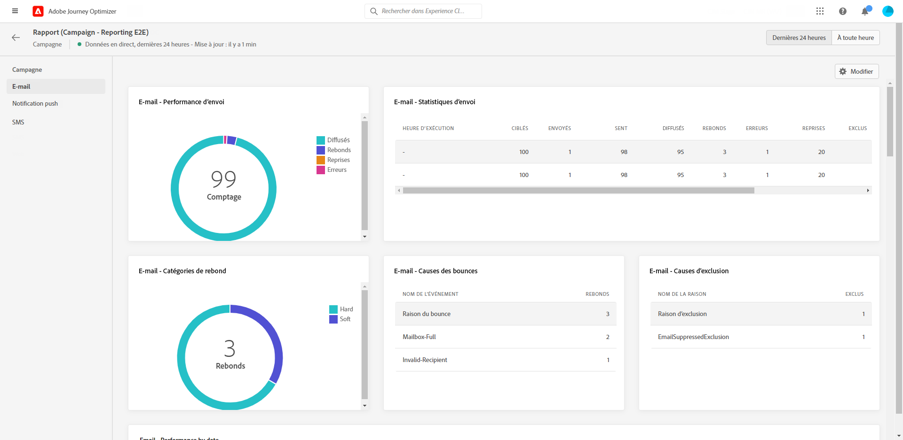
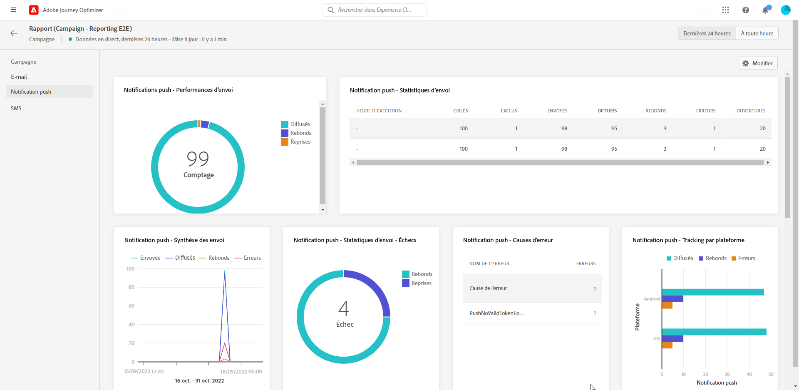
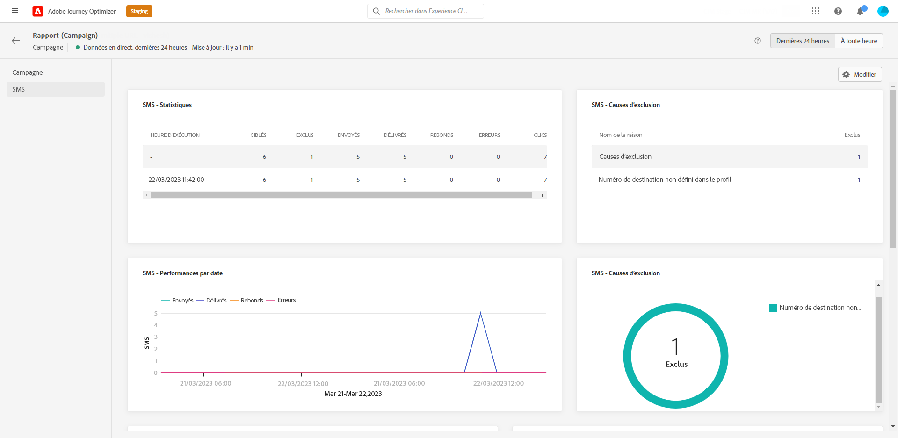

# Rapport dynamique de campagne {#campaign-live-report}

Vous pouvez accéder directement au rapport dynamique de campagne à partir de votre campagne à l’aide du bouton **[!UICONTROL Vue dynamique]**.

La page **[!UICONTROL Rapport dynamique]** de la campagne s&#39;affiche avec les onglets suivants :

* [Campagne](#campaign-live)
* [E-mail](#email-live)
* [Push](#push-live)
* [SMS](#sms-live)

Le **[!UICONTROL rapport dyamique]** de campagne est divisé en différents widgets présentant le succès et les erreurs de votre campagne. Chaque widget peut être redimensionné et supprimé si nécessaire. Pour plus d&#39;informations à ce propos, consultez cette [section](../reports/live-report.md#modify-dashboard).

Pour obtenir la liste détaillée de chaque mesure disponible dans Adobe Journey Optimizer, reportez-vous à [cette page](live-report.md#list-of-components-live).

## Onglet Campagne {#campaign-global}

### Diffusion {#delivery-global}

Le widget **[!UICONTROL Statistiques de la campagne]** présente les principales informations relatives à votre campagne :

* **[!UICONTROL Profils entrés]** : nombre de profils ayant commencé le parcours.

<!--
### Experimentation tab (#experimentation-live)

From your Campaign **[!UICONTROL Live report]**, the **[!UICONTROL Experimentation]** tab details the main information relative to how each variant is performing and if there is was winner during the test.
-->

## Onglet E-mail {#email-live}

Dans le **[!UICONTROL rapport dynamique]** de campagne, l&#39;onglet **[!UICONTROL E-mail]** détaille les principales informations relatives aux diffusions par e-mail envoyées dans votre campagne.

+++En savoir plus sur les différents widgets et mesures disponibles pour le rapport d’e-mail.

Le widget **[!UICONTROL Statistiques d’envoi des e-mails]** présente les principales informations relatives à votre message :

* **[!UICONTROL Livrés]** : nombre de messages envoyés avec succès.

* **[!UICONTROL Bounces]** : nombre total des erreurs comptabilisées lors de la diffusion et du traitement automatique des retours.

* **[!UICONTROL Erreurs]** : nombre total d’erreurs survenues au cours d’une diffusion, l’empêchant d’être envoyée à des profils.

Le tableau **[!UICONTROL Envoi de mesures par e-mail]** et le graphique **[!UICONTROL Résumé des e-mails]** détaillent le succès de votre diffusion :

* **[!UICONTROL Envoyés]** : nombre total d&#39;envois pour la diffusion.

* **[!UICONTROL Livrés]** : nombre de messages envoyés avec succès.

* **[!UICONTROL Bounces]** : nombre total des erreurs comptabilisées lors de la diffusion et du traitement automatique des retours.

* **[!UICONTROL Erreurs]** : nombre total d’erreurs survenues au cours d’une diffusion, l’empêchant d’être envoyée à des profils.

* **[!UICONTROL Ouvertures]** : nombre d’ouvertures d’un message dans une diffusion.

* **[!UICONTROL Clics]** : nombre de clics sur un contenu dans une diffusion.

* **[!UICONTROL Désabonnements]** : nombre de clics sur le lien de désabonnement.

* **[!UICONTROL Plaintes contre le spal]** : nombre de fois où un message a été déclaré comme spam ou courrier indésirable.

Les widgets **[!UICONTROL Causes des bounces]**, **[!UICONTROL Catégories des bounces]** et **[!UICONTROL Hard bounce et bounce - par e-mail]** contiennent les données disponibles relatives aux messages ayant fait l&#39;objet d&#39;un rebond, notamment :

* **[!UICONTROL Hard bounce]** : nombre total d&#39;erreurs permanentes, telles qu&#39;une adresse email incorrecte. Un message d&#39;erreur indique explicitement que l&#39;adresse n&#39;est pas valide, comme Utilisateur inconnu.

* **[!UICONTROL Soft bounces]** : nombre total d&#39;erreurs temporaires, telles qu&#39;une boîte de réception pleine.

* **[!UICONTROL Ignorées]** : nombre total d&#39;erreurs temporaires (par exemple, Absent(e) du bureau) ou techniques (par exemple, si le type d&#39;expéditeur est administrateur).

Les graphiques et tableaux **[!UICONTROL Raisons de l&#39;erreur]** et **[!UICONTROL Exclure des raisons]** vous permettent de voir quelles erreurs et exclusions ont eu lieu au cours de votre diffusion.

Le graphique et le tableau **[!UICONTROL E-mail - Meilleur domaine destinataire]** indiquent les domaines les plus utilisés par les destinataires pour ouvrir l&#39;e-mail.
+++

## Onglet Notification push {#push-live}

Dans le **[!UICONTROL Rapport dynamique]** de campagne, l’onglet **[!UICONTROL Notification push]** détaille les principales informations relatives aux diffusions push envoyées dans votre campagne.

+++En savoir plus sur les différents widgets et mesures disponibles pour le rapport push.

Les widgets **[!UICONTROL Performances d’envoi des notifications push]**, **[!UICONTROL Résumé des notifications push]** et **[!UICONTROL Mesures d’envoi par notification push]** présentent les informations principales relatives à votre message :

* **[!UICONTROL Envoyés]** : nombre total d&#39;envois pour la diffusion.

* **[!UICONTROL Livrés]** : nombre de messages envoyés avec succès.

* **[!UICONTROL Bounces]** : nombre total des erreurs comptabilisées lors de la diffusion et du traitement automatique des retours.

* **[!UICONTROL Erreurs]** : nombre total d’erreurs survenues au cours d’une diffusion, l’empêchant d’être envoyée à des profils.

* **[!UICONTROL Ouvertures]** : nombre d’ouvertures d’un message dans une diffusion.

* **[!UICONTROL Actions]** : nombre total d’actions sur la notification push diffusée (par exemple, clic sur un bouton ou rejet).

* **[!UICONTROL Engagements]** : nombre total d&#39;ouvertures et d&#39;actions pour cette notification push, c&#39;est-à-dire si le profil a ouvert la notification ou si un utilisateur a cliqué sur un bouton.

Les graphiques et tableaux **[!UICONTROL Raisons de l&#39;erreur]** et **[!UICONTROL Exclure des raisons]** vous permettent de voir quelles erreurs et exclusions ont eu lieu au cours de votre diffusion.

Le widget **[!UICONTROL Statistiques d’envoi - Échec]** vous permet de voir combien d’erreurs et de bounces se sont produits.

Les graphiques et tableaux **[!UICONTROL Suivi par plateforme]**, **[!UICONTROL Envoi par plateforme]** et **[!UICONTROL Ventilation par plateforme]** décrivent le succès de votre notification push en fonction du système opérationnel.
+++

## Onglet SMS {#sms-live}

Dans le **[!UICONTROL Rapport dynamique]** de campagne, l’onglet **[!UICONTROL SMS]** détaille les principales informations relatives aux diffusions SMS envoyées dans votre campagne.

+++En savoir plus sur les différents widgets et mesures disponibles pour le rapport SMS.

Le tableau **[!UICONTROL SMS - Statistiques d’envoi]** détaille la réussite de votre diffusion :

* **[!UICONTROL Ciblés]** : nombre de profils utilisateur qui sont qualifiés en tant que profils cibles pour cette diffusion.

* **[!UICONTROL Exclus]** : nombre de profils utilisateur, exclus des profils ciblés, qui n’ont pas reçu le message.

* **[!UICONTROL Envoyés]** : nombre total d&#39;envois pour la diffusion.

* **[!UICONTROL Livrés]** : nombre de messages envoyés avec succès.

* **[!UICONTROL Bounces]** : nombre total des erreurs comptabilisées lors de la diffusion et du traitement automatique des retours.

* **[!UICONTROL Erreurs]** : nombre total d’erreurs survenues au cours d’une diffusion, l’empêchant d’être envoyée à des profils.

Le widget **[!UICONTROL Performances de SMS par date]** détaille les informations principales relatives à votre message sous forme de graphique :

* **[!UICONTROL Envoyés]** : nombre total d&#39;envois pour la diffusion.

* **[!UICONTROL Livrés]** : nombre de messages envoyés avec succès.

* **[!UICONTROL Bounces]** : nombre total des erreurs comptabilisées lors de la diffusion et du traitement automatique des retours.

* **[!UICONTROL Erreurs]** : nombre total d’erreurs survenues au cours d’une diffusion, l’empêchant d’être envoyée à des profils.

Les graphiques et tableaux **[!UICONTROL Motifs d’exclusion]**, **[!UICONTROL Causes des bounces]** et **[!UICONTROL Raisons des erreurs]** vous permettent de voir quelles erreurs et exclusions ont eu lieu au cours de votre diffusion.
+++

## Ressources supplémentaires

* [Prise en main des campagnes](../campaigns/get-started-with-campaigns.md)
* [Créer une campagne](../campaigns/create-campaign.md)
* [Créer des campagnes déclenchées par API](../campaigns/api-triggered-campaigns.md)
* [Modifier ou arrêter une campagne](../campaigns/modify-stop-campaign.md)
* [Rapport global de campagne](campaign-global-report.md)
