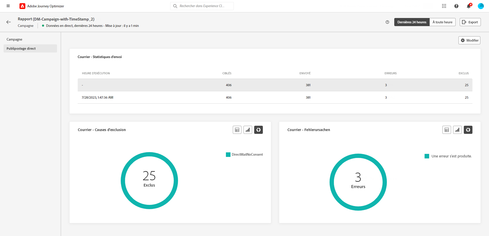

# Rapport dynamique de campagne {#campaign-live-report}

>[!CONTEXTUALHELP]
>id="ajo_campaign_live_report"
>title="Rapport dynamique de campagne"
>abstract="Le rapport dynamique de campagne vous permet de mesurer et de visualiser en temps réel l’efficacité et les performances de vos campagnes (limité aux dernières 24 heures). Le rapport dyamique de campagne est composé de plusieurs widgets présentant le succès et les erreurs de votre campagne. Vous pouvez modifier chaque tableau de bord de reporting en redimensionnant ou en supprimant des widgets."

Les rapports dynamiques, accessibles à partir de l’onglet Dernières 24 heures, affichent les événements qui se sont produits au cours des dernières 24 heures, avec un intervalle de temps minimal de deux minutes à compter de l’occurrence de l’événement. En comparaison, les rapports globaux portent sur les événements qui se sont produits il y a au moins deux heures et couvrent les événements sur une période sélectionnée.

Vous pouvez accéder directement au rapport dynamique de campagne à partir de votre campagne à l’aide du bouton **[!UICONTROL Vue dynamique]**.

La page **[!UICONTROL Rapport dynamique]** de la campagne s&#39;affiche avec les onglets suivants :

* [Campagne](#campaign-live)
* [E-mail](#email-live)
* [In-app](#inapp-live)
* [Push](#push-live)
* [SMS](#sms-live)
* [Web](#web-tab)
* [Publipostage direct](#direct-mail-tab)

Le **[!UICONTROL rapport dyamique]** de campagne est divisé en différents widgets présentant le succès et les erreurs de votre campagne. Chaque widget peut être redimensionné et supprimé si nécessaire. Pour plus d&#39;informations à ce propos, consultez cette [section](../reports/live-report.md#modify-dashboard).

Pour obtenir la liste détaillée de chaque mesure disponible dans Adobe Journey Optimizer, reportez-vous à [cette page](live-report.md#list-of-components-live).

## Onglet Campagne {#campaign-live}

### Diffusion {#delivery-live}

Le widget **[!UICONTROL Statistiques de la campagne]** présente les principales informations relatives à votre campagne :

* **[!UICONTROL Profils entrés]** : nombre de profils ayant commencé le parcours.

<!--
### Experimentation tab (#experimentation-live)

From your Campaign **[!UICONTROL Live report]**, the **[!UICONTROL Experimentation]** tab details the main information relative to how each variant is performing and if there is was winner during the test.
-->

## Onglet E-mail {#email-live}

>[!CONTEXTUALHELP]
>id="ajo_campaign_live_email_sending_statistics"
>title="E-mail - Statistiques d’envoi"
>abstract="Le graphique E-mail - Statistiques d’envoi résume les données essentielles relatives à votre e-mail, telles que Ciblés ou Diffusés, depuis les dernières 24 heures."

>[!CONTEXTUALHELP]
>id="ajo_campaign_live_email_statistics"
>title="E-mail - Statistiques"
>abstract="Le tableau E-mail - Statistiques fournit les données sur l’activité de profil pour votre e-mail, depuis les dernières 24 heures."

>[!CONTEXTUALHELP]
>id="ajo_campaign_live_email_bounce_categories"
>title="E-mail - Catégories de rebond"
>abstract="Le tableau et les graphiques E-mail - Catégories de rebond fournissent des données sur les erreurs temporaires et permanentes des dernières 24 heures."

>[!CONTEXTUALHELP]
>id="ajo_campaign_live_email_performance_bydate"
>title="E-mail - Performances par date"
>abstract="Le graphique E-mail - Performances par date présente des données complètes des dernières 24 heures sur les e-mails envoyés, en fournissant des informations sur les mesures clés telles que les diffusions et les rebonds, ce qui permet d’effectuer une analyse détaillée du processus de diffusion des e-mails."

>[!CONTEXTUALHELP]
>id="ajo_campaign_live_email_bounce_reasons"
>title="E-mail - Causes des rebonds"
>abstract="Les graphiques et le tableau E-mail - Causes des rebonds contiennent les données disponibles relatives aux messages ayant fait l’objet d’un rebond, depuis les dernières 24 heures."

>[!CONTEXTUALHELP]
>id="ajo_campaign_live_email_error_reasons"
>title="E-mail - Causes d’erreur"
>abstract="Le tableau et les graphiques E-mail - Causes d’erreur vous permet d’identifier les erreurs spécifiques qui se sont produites pendant le processus d’envoi au cours des dernières 24 heures."

>[!CONTEXTUALHELP]
>id="ajo_campaign_live_email_excluded_reasons"
>title="E-mail - Causes d’exclusion"
>abstract="Les graphiques et le tableau Causes d’exclusion illustrent les différents facteurs qui ont conduit à ce que des profils de personnes, exclus de l’audience ciblée, ne reçoivent pas le message, depuis les dernières 24 heures."

>[!CONTEXTUALHELP]
>id="ajo_campaign_live_email_best_recipient"
>title="E-mail - Meilleur domaine de destinataire"
>abstract="Le tableau et le graphique E-mail - Meilleur domaine de destinataire fournissent une ventilation détaillée des domaines que les personnes destinataires utilisent le plus souvent pour ouvrir l’e-mail, offrant des informations précieuses sur le comportement des personnes destinataires, depuis les dernières 24 heures."

Dans le **[!UICONTROL Rapport dynamique]** de campagne, l’onglet **[!UICONTROL E-mail]** détaille les principales informations relatives à l’e-mail envoyé dans votre campagne.

+++En savoir plus sur les différents widgets et mesures disponibles pour le rapport d’e-mail.

Le widget **[!UICONTROL Statistiques d’envoi des e-mails]** présente les principales informations relatives à votre message :

* **[!UICONTROL Livrés]** : nombre de messages envoyés avec succès.

* **[!UICONTROL Rebonds]** : nombre total des erreurs comptabilisées lors de la procédure d’envoi et du traitement automatique des retours.

* **[!UICONTROL Erreurs]** : nombre total d’erreurs survenues au cours de la procédure d’envoi, empêchant le message d’être envoyé à des profils.

Le tableau **[!UICONTROL Mesures d’envoi par e-mail]** et le graphique **[!UICONTROL Résumé des e-mails]** détaillent le succès de votre e-mail :

* **[!UICONTROL Envoyés]** : nombre total d’e-mails envoyés.

* **[!UICONTROL Livrés]** : nombre de messages envoyés avec succès.

* **[!UICONTROL Rebonds]** : nombre total des erreurs comptabilisées lors de la procédure d’envoi et du traitement automatique des retours.

* **[!UICONTROL Erreurs]** : nombre total d’erreurs survenues au cours de la procédure d’envoi, empêchant le message d’être envoyé à des profils.

* **[!UICONTROL Ouvertures]** : nombre d’ouvertures d’un message.

* **[!UICONTROL Clics]** : nombre de clics sur un contenu.

* **[!UICONTROL Désabonnements]** : nombre de clics sur le lien de désabonnement.

* **[!UICONTROL Plaintes contre le spal]** : nombre de fois où un message a été déclaré comme spam ou courrier indésirable.

Les widgets **[!UICONTROL Raisons de rebond]** et **[!UICONTROL Catégories de rebond]** contiennent les données disponibles relatives aux messages de rebond, telles que :

* **[!UICONTROL Hard bounce]** : nombre total d’erreurs permanentes, telles qu’une adresse e-mail incorrecte. Un message d&#39;erreur indique explicitement que l&#39;adresse n&#39;est pas valide, comme Utilisateur inconnu.

* **[!UICONTROL Soft bounces]** : nombre total d&#39;erreurs temporaires, telles qu&#39;une boîte de réception pleine.

* **[!UICONTROL Ignorées]** : nombre total d&#39;erreurs temporaires (par exemple, Absent(e) du bureau) ou techniques (par exemple, si le type d&#39;expéditeur est administrateur).

Les graphiques et tableaux **[!UICONTROL Causes d’erreur]** et **[!UICONTROL Motifs d’exclusion]** vous permettent de voir quelles erreurs et exclusions ont eu lieu au cours de la procédure d’envoi.

Le graphique et le tableau **[!UICONTROL E-mail - Meilleur domaine du destinataire]** indiquent les domaines les plus utilisés par les personnes destinataires pour ouvrir l’e-mail.
+++

## Onglet In-app {#inapp-live}

>[!CONTEXTUALHELP]
>id="ajo_campaign_live_inapp_performance"
>title="Performances in-app"
>abstract="Les KPI de performances in-app fournissent des informations essentielles sur l’engagement de vos visiteurs et visiteuses avec les messages in-app, depuis les dernières 24 heures."

>[!CONTEXTUALHELP]
>id="ajo_campaign_live_inapp_interactions"
>title="Interactions par type"
>abstract="Les graphiques et le tableau Interactions par type détaillent la manière dont les personnes ont interagi avec votre message in-app en suivant les clics, les rejets ou les interactions, depuis les dernières 24 heures."

>[!CONTEXTUALHELP]
>id="ajo_campaign_live_inapp_summary"
>title="Résumé in-app"
>abstract="Le graphique Synthèse in-app illustre la progression de vos impressions et interactions in-app au cours des dernières 24 heures."

Dans le **[!UICONTROL Rapport dynamique]** de votre campagne, l’onglet **[!UICONTROL In-app]** détaille les principales informations relatives aux messages in-app envoyées dans votre campagne.

+++En savoir plus sur les différents widgets et mesures disponibles pour le rapport in-app.

Les KPI **[!UICONTROL Performances in-app]** détaillent les informations principales relatives à l’engagement des visiteurs et visiteuses en lien avec vos messages in-app. Cela concerne notamment les éléments suivants :

* **[!UICONTROL Impressions]** : nombre total de messages in-app envoyés à toutes les personnes.

* **[!UICONTROL Interactions]** : nombre total d’engagements en lien avec votre message in-app. Cela inclut toutes les actions entreprises par les personnes, telles que les clics, les rejets ou toute autre interaction.

Le graphe **[!UICONTROL Résumé in-app]** présente l’évolution de vos impressions et interactions in-app pour la période concernée.

Les graphes et le tableau **[!UICONTROL Interactions par type]** détaillent la manière dont les personnes ont interagi avec votre message in-app en suivant les clics, les rejets ou les interactions.

+++

## Onglet Notification push {#push-live}

>[!CONTEXTUALHELP]
>id="ajo_campaign_live_push_sending_performance"
>title="Notifications push - Performances d’envoi"
>abstract="Le graphique Notifications push - Performances d’envoi résume les données essentielles sur votre notification push, telles que les erreurs ou les messages ciblés ou diffusés des dernières 24 heures."

>[!CONTEXTUALHELP]
>id="ajo_campaign_live_push_statistics"
>title="Notification push - Statistiques"
>abstract="Le tableau Notification push - Statistiques fournit des données sur l’activité des personnes destinataires pour votre notification push, depuis les dernières 24 heures."

>[!CONTEXTUALHELP]
>id="ajo_campaign_live_push_sending_summary"
>title="Notification push - Synthèse des envois"
>abstract="Le graphique Notifications push - Synthèse des envois affiche les données disponibles pour les notifications push envoyées, depuis les dernières 24 heures."

>[!CONTEXTUALHELP]
>id="ajo_campaign_live_push_excluded_reasons"
>title="Notification push - Causes d’exclusion"
>abstract="Les graphiques et le tableau Causes d’exclusion illustrent les différents facteurs qui ont conduit à ce que des profils de personnes, exclus de l’audience ciblée, ne reçoivent pas le message, depuis les dernières 24 heures."

>[!CONTEXTUALHELP]
>id="ajo_campaign_live_push_error_reasons"
>title="Notification push - Causes d’erreur"
>abstract="Les graphiques et le tableau Raisons d’erreur vous permettent d’identifier les erreurs spécifiques qui se sont produites au cours des dernières 24 heures pendant le processus d’envoi."

>[!CONTEXTUALHELP]
>id="ajo_campaign_live_push_breakdown_platform"
>title="Notification push - Répartition par plateforme"
>abstract="Le tableau et les graphiques Répartition par plateforme fournissent une répartition du succès de vos notifications push au cours des dernières 24 heures en fonction du système d’exploitation des personnes destinataires."

Dans le **[!UICONTROL Rapport dynamique]** de campagne, l’onglet **[!UICONTROL Notification push]** détaille les principales informations relatives à la notification push envoyée dans votre campagne.

+++En savoir plus sur les différents widgets et mesures disponibles pour le rapport de notification push.

Les widgets **[!UICONTROL Notification push - Performances d’envoi]**, **[!UICONTROL Notification push - Synthèse]** et **[!UICONTROL Notification push - Statistiques]** présentent les informations principales relatives à votre message :

* **[!UICONTROL Envoyés]** : nombre total d’e-mails envoyés.

* **[!UICONTROL Livrés]** : nombre de messages envoyés avec succès.

* **[!UICONTROL Rebonds]** : nombre total des erreurs comptabilisées lors de la procédure d’envoi et du traitement automatique des retours.

* **[!UICONTROL Erreurs]** : nombre total d’erreurs survenues au cours de la procédure d’envoi, empêchant le message d’être envoyé à des profils.

* **[!UICONTROL Ouvertures]** : nombre d’ouvertures d’un message.

* **[!UICONTROL Actions]** : nombre total d&#39;actions sur la notification push diffusée, par exemple clic sur un bouton ou rejet.

* **[!UICONTROL Engagements]** : nombre total d&#39;ouvertures et d&#39;actions pour cette notification push, c&#39;est-à-dire si le profil a ouvert la notification ou si un utilisateur a cliqué sur un bouton.

Les graphiques et tableaux **[!UICONTROL Causes d’erreur]** et **[!UICONTROL Motifs d’exclusion]** vous permettent de voir quelles erreurs et exclusions ont eu lieu au cours de la procédure d’envoi.

Le widget **[!UICONTROL Statistiques d’envoi - Échec]** vous permet de voir combien d’erreurs et de bounces se sont produits.

Les graphiques et tableaux **[!UICONTROL Suivi par plateforme]**, **[!UICONTROL Envoi par plateforme]** et **[!UICONTROL Répartition par plateforme]** décrivent le succès de votre notification push en fonction du système opérationnel.
+++

## Onglet SMS {#sms-live}

>[!CONTEXTUALHELP]
>id="ajo_campaign_live_sms_statistics"
>title="SMS - Statistiques"
>abstract="Le tableau SMS - Statistiques d’envoi récapitule les données essentielles relatives à vos SMS, telles que les messages ciblés ou délivrés, depuis les dernières 24 heures."

>[!CONTEXTUALHELP]
>id="ajo_campaign_live_sms_performance"
>title="SMS - Performances par date"
>abstract="Le widget SMS - Performances par date fournit des informations clés des dernières 24 heures sur vos messages par le biais d’une représentation graphique."

>[!CONTEXTUALHELP]
>id="ajo_campaign_live_sms_error_reasons"
>title="SMS - Causes d’erreur"
>abstract="Les graphiques et le tableau SMS - Raisons d’erreur vous permettent d’identifier les erreurs spécifiques qui se sont produites au cours des dernières 24 heures pendant le processus d’envoi."

>[!CONTEXTUALHELP]
>id="ajo_campaign_live_sms_excluded_reasons"
>title="SMS - Causes d’exclusion"
>abstract="Les graphiques et le tableau Causes d’exclusion illustrent les différents facteurs qui ont conduit à ce que des profils de personnes, exclus de l’audience ciblée, ne reçoivent pas le message, depuis les dernières 24 heures."

>[!CONTEXTUALHELP]
>id="ajo_campaign_live_sms_bounces_reasons"
>title="SMS - Causes de rebonds"
>abstract="Les graphiques et le tableau Causes de rebond contiennent les données disponibles sur les messages ayant fait l’objet d’un rebond, depuis les dernières 24 heures."

Dans le **[!UICONTROL Rapport dynamique]** de campagne, l’onglet **[!UICONTROL SMS]** détaille les principales informations relatives aux SMS envoyés dans votre campagne.

+++En savoir plus sur les différents widgets et mesures disponibles pour le rapport SMS.

Le tableau **[!UICONTROL SMS - Statistiques]** détaille le succès de votre SMS :

* **[!UICONTROL Ciblés]** : nombre de profils de personnes qui sont qualifiés en tant que profils cibles.

* **[!UICONTROL Exclus]** : nombre de profils utilisateurs, exclus des profils ciblés, qui n’ont pas reçu le message.

* **[!UICONTROL Envoyés]** : nombre total d’e-mails envoyés.

* **[!UICONTROL Rebonds]** : nombre total des erreurs comptabilisées lors de la procédure d’envoi et du traitement automatique des retours.

* **[!UICONTROL Erreurs]** : nombre total d’erreurs survenues au cours de la procédure d’envoi, empêchant le message d’être envoyé à des profils.

* **[!UICONTROL Clics]** : nombre total de visites d’URL.

Le widget **[!UICONTROL SMS Performances par date]** détaille les informations principales relatives à votre message sous forme de graphique :

* **[!UICONTROL Envoyés]** : nombre total d’e-mails envoyés.

* **[!UICONTROL Rebonds]** : nombre total des erreurs comptabilisées lors de la procédure d’envoi et du traitement automatique des retours.

* **[!UICONTROL Erreurs]** : nombre total d’erreurs survenues au cours de la procédure d’envoi, empêchant le message d’être envoyé à des profils.

Les graphiques et tableaux **[!UICONTROL Motifs d’exclusion]**, **[!UICONTROL Causes de rebond]** et **[!UICONTROL Causes d’erreur]** vous permettent de voir quelles erreurs et exclusions ont eu lieu au cours de la procédure d’envoi.
+++

## Onglet Web {#web-tab}

>[!CONTEXTUALHELP]
>id="ajo_campaign_live_web_performance"
>title="Performances web"
>abstract="Les KPI de Performances web fournissent des informations complètes sur l’engagement de vos visiteurs et visiteuses avec vos expériences web au cours des dernières 24 heures."

>[!CONTEXTUALHELP]
>id="ajo_campaign_live_web_summary"
>title="Résumé web"
>abstract="Le graphique Résumé web présente la progression de vos expériences web, y compris les impressions, les impressions uniques et les interactions, pour les dernières 24 heures."

>[!CONTEXTUALHELP]
>id="ajo_campaign_live_web_interactions"
>title="Interactions par élément"
>abstract="Le tableau Interactions par élément fournit des informations clés sur l’engagement des visiteurs et visiteuses avec différents éléments de vos pages web, depuis les dernières 24 heures."

Dans votre **[!UICONTROL rapport dynamique]** Campaign, l’onglet **[!UICONTROL Web]** présente les informations principales relatives à vos pages web.

+++En savoir plus sur les différents widgets et mesures disponibles pour le rapport web.

Les KPI de **[!UICONTROL Performances web]** détaillent les informations principales relatives à l’engagement de vos visiteurs et visiteuses avec vos expériences web, telles que :

* **[!UICONTROL Impressions]** : nombre total d’expériences web diffusées à tous les utilisateurs et utilisatrices.

* **[!UICONTROL Interactions]** : nombre total d’engagements en lien avec votre page web. Cela inclut toutes les actions entreprises par les personnes, telles que les clics ou toute autre interaction.

Le graphe **[!UICONTROL Résumé web]** présente l’évolution de vos expériences web (impressions, impressions et interactions uniques) pour les dernières 24 heures.

Le tableau **[!UICONTROL Interactions par élément]** présente les informations principales relatives à l’engagement des visiteurs et visiteuses en lien avec les différents éléments de vos pages web.
+++

## Onglet Publipostage direct {#direct-mail-tab}

>[!CONTEXTUALHELP]
>id="ajo_campaign_live_direct_sending_statistics"
>title="Courrier - Statistiques d’envoi"
>abstract="Le tableau Courrier - Statistiques d’envoi résume les données essentielles des dernières 24 heures relatives à votre courrier, telles que les messages ciblés ou diffusés."

>[!CONTEXTUALHELP]
>id="ajo_campaign_live_direct_error_reasons"
>title="Courrier - Causes d’erreur"
>abstract="Les graphiques et le tableau Courrier - Causes d’erreur vous permettent d’identifier les erreurs spécifiques qui se sont produites au cours des dernières 24 heures."

>[!CONTEXTUALHELP]
>id="ajo_campaign_live_direct_excluded_reasons"
>title="Courrier - Causes d’exclusion"
>abstract="Les graphiques et le tableau Causes d’exclusion de courrier illustrent les différents facteurs qui ont conduit à ce que des profils de personnes, exclus de l’audience ciblée, ne reçoivent pas le message, depuis les dernières 24 heures."

Depuis le **[!UICONTROL Rapport dynamique]** de votre campagne, l’onglet **[!UICONTROL Courrier]** présente les informations principales relatives à votre courrier.

+++En savoir plus sur les différents widgets et mesures disponibles pour le rapport Publipostage direct.

Le tableau **[!UICONTROL Courrier – Statistiques d’envoi]** détaille le succès de votre courrier :

* **[!UICONTROL Ciblés]** : nombre de profils de personnes qui sont qualifiés en tant que profils cibles.

* **[!UICONTROL Envoyés]** : nombre total d’e-mails envoyés.

* **[!UICONTROL Erreurs]** : nombre total d’erreurs survenues au cours de la procédure d’envoi, empêchant le message d’être envoyé à des profils.

* **[!UICONTROL Exclus]** : nombre de profils de personnes, exclus des profils ciblés, qui n’ont pas reçu votre courrier.

Les graphiques et tableaux **[!UICONTROL Courrier - Causes d’exclusion]** et **[!UICONTROL Courrier - Causes d’erreur]** vous permettent de voir quelles erreurs et exclusions ont eu lieu au cours de la procédure d’envoi.
+++

## Ressources supplémentaires

* [Commencer avec les campagnes](../campaigns/get-started-with-campaigns.md)
* [Création d’une campagne](../campaigns/create-campaign.md)
* [Créer des campagnes déclenchées par API](../campaigns/api-triggered-campaigns.md)
* [Modification ou arrêt d’une campagne](../campaigns/modify-stop-campaign.md)
* [Rapport global de campagne](campaign-global-report.md)
