# Rapport dynamique de campagne {#campaign-live-report}

>[!CONTEXTUALHELP]
>id="ajo_campaign_live_report"
>title="Rapport dynamique de campagne"
>abstract="Le rapport dynamique de campagne vous permet de mesurer et de visualiser en temps réel l’efficacité et les performances de vos campagnes (limité aux dernières 24 heures). Le rapport dyamique de campagne est composé de plusieurs widgets présentant le succès et les erreurs de votre campagne. Vous pouvez modifier chaque tableau de bord de reporting en redimensionnant ou en supprimant des widgets."

Les rapports dynamiques, accessibles à partir de l’onglet Dernières 24 heures, affichent les événements qui se sont produits au cours des dernières 24 heures, avec un intervalle de temps minimal de deux minutes à compter de l’occurrence de l’événement. En comparaison, les rapports Customer Journey Analytics portent sur les événements qui se sont produits il y a au moins deux heures et couvrent les événements sur une période sélectionnée.

Vous pouvez accéder directement au rapport dynamique de campagne à partir de votre campagne en cliquant sur le bouton **[!UICONTROL Rapports]**, puis en sélectionnant **[!UICONTROL Afficher le rapport des dernières 24 heures]**.

La page **[!UICONTROL Rapport dynamique]** de la campagne s&#39;affiche avec les onglets suivants :

* [Campagne](#campaign-live)
* [E-mail](#email-live)
* [In-app](#inapp-live)
* [Notification push](#push-live)
* [SMS](#sms-live)
* [Web](#web-tab)
* [Courrier](#direct-mail-tab)

>[!AVAILABILITY]
>Les campagnes orchestrées ne prennent en charge que les canaux SMS, E-mail et Notification push. Les autres canaux (In-app, Web, Courrier, etc.) ne sont pas disponibles dans les campagnes orchestrées et n’apparaissent pas dans les rapports.

Le **[!UICONTROL rapport dyamique]** de campagne est divisé en différents widgets présentant le succès et les erreurs de votre campagne. Chaque widget peut être redimensionné et supprimé si nécessaire. Pour plus d&#39;informations à ce propos, consultez cette [section](../reports/live-report.md#modify-dashboard).

Pour obtenir la liste détaillée de chaque mesure disponible dans Adobe Journey Optimizer, reportez-vous à [cette page](live-report.md#live-report).

## Onglet Campagne {#campaign-live}

### Diffusion {#delivery-live}

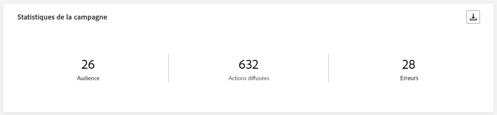

Les KPI **[!UICONTROL Statistiques de la campagne]** constituent un tableau de bord complet, qui propose une répartition détaillée des mesures clés des dernières 24 heures liées à votre campagne. La section contient des informations essentielles telles que le nombre de profils et les actions diffusées, ce qui vous permet de bien comprendre les performances de votre campagne et l’engagement avec celle-ci.

+++ En savoir plus sur les mesures de statistiques de la campagne

* **[!UICONTROL Audience]** : nombre de profils ciblés.

* **[!UICONTROL Actions réalisées]** : nombre total de fois uniques où une action a été réalisée.

* **[!UICONTROL Erreurs]** : nombre total d’erreurs survenues au cours de la procédure d’envoi, empêchant le message d’être envoyé à des profils.

+++

<!--
### Experimentation tab (#experimentation-live)

From your Campaign **[!UICONTROL Live report]**, the **[!UICONTROL Experimentation]** tab details the main information relative to how each variant is performing and if there is was winner during the test.
-->

## Onglet E-mail {#email-live}

Dans le **[!UICONTROL Rapport dynamique]** de campagne, l’onglet **[!UICONTROL E-mail]** détaille les principales informations relatives à l’e-mail envoyé dans votre campagne.

### E-mail – Performances d’envoi {#email-sending-performance}

>[!CONTEXTUALHELP]
>id="ajo_campaign_live_email_sending_statistics"
>title="E-mail - Statistiques d’envoi"
>abstract="Le graphe E-mail - Statistiques d’envoi résume les données essentielles relatives à votre e-mail, telles que Ciblés ou Diffusés, au cours des dernières 24 heures."

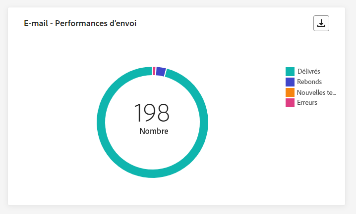

Le graphe **[!UICONTROL E-mail – Performances d’envoi]** offre une vue d’ensemble complète des données relatives aux e-mails envoyés au cours des dernières 24 heures. Il fournit des informations sur les mesures essentielles telles que les envois et les rebonds, ce qui permet d’examiner en détail le processus d’envoi des e-mails.

+++ En savoir plus sur les mesures de performances d’envoi des e-mails

* **[!UICONTROL Diffusés]** : nombre d’e-mails envoyés avec succès.

* **[!UICONTROL Rebonds]** : nombre total des erreurs comptabilisées lors de la procédure d’envoi et du traitement automatique des retours.

* **[!UICONTROL Reprises]** : nombre d’e-mails dans la file d’attente pour les reprises.

* **[!UICONTROL Erreurs]** : nombre total d’erreurs survenues au cours de la procédure d’envoi, empêchant le message d’être envoyé à des profils.
+++

### E-mail – Statistiques

>[!CONTEXTUALHELP]
>id="ajo_campaign_live_email_statistics"
>title="E-mail – Statistiques"
>abstract="Le tableau E-mail - Statistiques fournit les données sur l’activité de profil pour votre e-mail, depuis les dernières 24 heures."

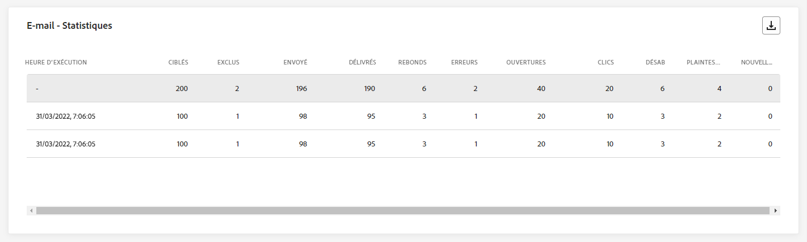

Le tableau **[!UICONTROL Mesures d’envoi par e-mail]** offre un résumé complet des données des dernières 24 heures. Il présente les mesures essentielles, notamment la taille de l’audience ciblée et le nombre d’e-mails diffusés avec succès. Vous obtenez ainsi des informations précieuses sur l’efficacité et la portée de vos campagnes par e-mail.

+++ En savoir plus sur les mesures E-mail – Statistiques

* **[!UICONTROL Heure d’exécution]** : heure de début de chaque exécution de votre e-mail récurrent. Pour ne cibler qu’un ou plusieurs e-mails récurrents, sélectionnez-les dans le menu déroulant **[!UICONTROL Heure d’exécution]**.

* **[!UICONTROL Ciblés]** : nombre de profils qui remplissent les critères de l’audience avant l’application des exclusions, des suppressions ou des suppressions de consentement.

* **[!UICONTROL Exclus]** : nombre de profils utilisateurs, exclus des profils ciblés, qui n’ont pas reçu le message.

* **[!UICONTROL Envoyés]** : nombre total d’e-mails envoyés.

* **[!UICONTROL Diffusés]** : nombre de messages envoyés avec succès.

* **[!UICONTROL Rebonds]** : nombre total des erreurs comptabilisées lors de la procédure d’envoi et du traitement automatique des retours.

* **[!UICONTROL Erreurs]** : nombre total d’erreurs survenues au cours de la procédure d’envoi, empêchant le message d’être envoyé à des profils.

* **[!UICONTROL Ouvertures]** : nombre d’ouvertures d’un message.

* **[!UICONTROL Clics]** : nombre de clics sur un contenu.

* **[!UICONTROL Désabonnements]** : nombre de clics sur le lien de désabonnement.

* **[!UICONTROL Plaintes contre le spal]** : nombre de fois où un message a été déclaré comme spam ou courrier indésirable.

* **[!UICONTROL Reprises]** : nombre d’e-mails dans la file d’attente pour les reprises.
+++

### E-mail – Catégories et raisons de rebond {#bounce-categories}

>[!CONTEXTUALHELP]
>id="ajo_campaign_live_email_bounce_categories"
>title="E-mail - Catégories de rebond"
>abstract="Le tableau et les graphiques E-mail - Catégories de rebond fournissent des données sur les erreurs temporaires et permanentes des dernières 24 heures."

>[!CONTEXTUALHELP]
>id="ajo_campaign_live_email_bounce_reasons"
>title="E-mail - Causes des rebonds"
>abstract="Les graphiques et le tableau E-mail - Causes des rebonds contiennent les données disponibles relatives aux messages ayant fait l’objet d’un rebond, depuis les dernières 24 heures."

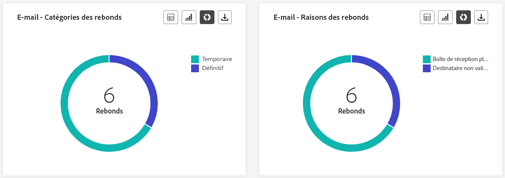

Les widgets **[!UICONTROL Causes des rebonds]** et **[!UICONTROL Catégories de rebond]** compilent les données disponibles des dernières 24 heures relatives aux rebonds de messages, en fournissant des informations détaillées sur les raisons et les catégories spécifiques à l’origine des rebonds des e-mails.

Pour plus d’informations sur les rebonds, consultez la page [Liste de suppression](../reports/suppression-list.md).

+++ En savoir plus sur les mesures E-mail – Catégories et raisons de rebonds

* **[!UICONTROL Rebond définitif]** : nombre total d’erreurs permanentes, telles qu’une adresse e-mail incorrecte. Un message d&#39;erreur indique explicitement que l&#39;adresse n&#39;est pas valide, comme Utilisateur inconnu.

* **[!UICONTROL Rebond temporaire]** : nombre total d’erreurs temporaires, telles qu’une boîte de réception pleine.

* **[!UICONTROL Ignorées]** : nombre total d&#39;erreurs temporaires (par exemple, Absent(e) du bureau) ou techniques (par exemple, si le type d&#39;expéditeur est administrateur).

+++

### E-mail – Performances par date {#email-performance-date}

>[!CONTEXTUALHELP]
>id="ajo_campaign_live_email_performance_bydate"
>title="E-mail – Performances par date"
>abstract="Le graphe E-mail – Performances par date présente des données complètes des dernières 24 heures sur les e-mails envoyés, en fournissant des informations sur les mesures clés telles que les diffusions et les rebonds, ce qui permet d’effectuer une analyse détaillée du processus d’envoi des e-mails."

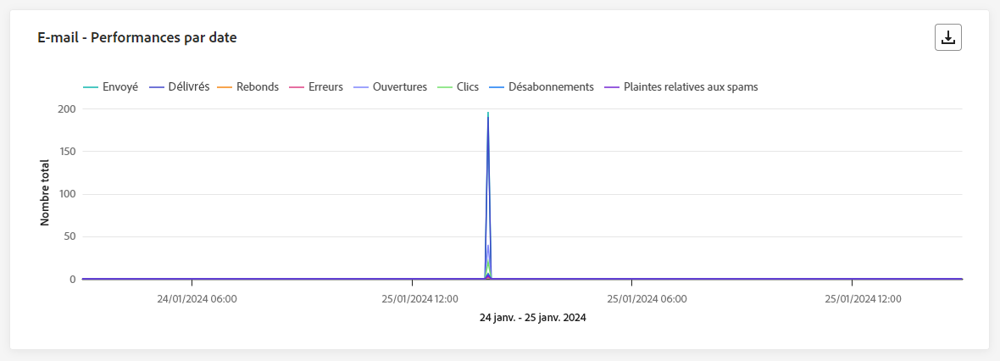

Le widget **[!UICONTROL E-mail – Performances par date]** offre une vue d’ensemble détaillée des informations clés relatives à vos messages, présentée sous la forme d’un graphe, en fournissant des informations sur les tendances de performances au cours des dernières 24 heures.

+++ En savoir plus sur les mesures E-mail – Performances par date et causes

* **[!UICONTROL Envoyés]** : nombre total d’e-mails envoyés.

* **[!UICONTROL Diffusés]** : nombre de messages envoyés avec succès.

* **[!UICONTROL Rebonds]** : nombre total des erreurs comptabilisées lors de la procédure d’envoi et du traitement automatique des retours.

* **[!UICONTROL Erreurs]** : nombre total d’erreurs survenues au cours de la procédure d’envoi, empêchant le message d’être envoyé à des profils.

* **[!UICONTROL Ouvertures]** : nombre d’ouvertures d’un message.

* **[!UICONTROL Clics]** : nombre de clics sur un contenu.

* **[!UICONTROL Désabonnements]** : nombre de clics sur le lien de désabonnement.

* **[!UICONTROL Plaintes contre le spam]** : nombre de fois où un message a été déclaré comme spam ou courrier indésirable.

+++

### Causes d’erreur {#email-error-reasons}

>[!CONTEXTUALHELP]
>id="ajo_campaign_live_email_error_reasons"
>title="E-mail – Causes d’erreur"
>abstract="Le tableau et les graphiques E-mail - Causes d’erreur vous permet d’identifier les erreurs spécifiques qui se sont produites pendant le processus d’envoi au cours des dernières 24 heures."

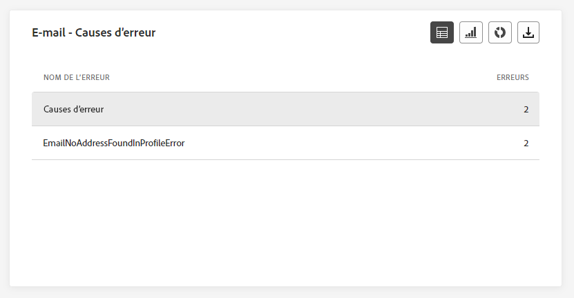

Les graphes et les tableaux **[!UICONTROL Causes d’erreur]** vous permettent d’identifier les erreurs spécifiques qui se sont produites au cours des dernières 24 heures pendant le processus d’envoi. Ces informations sont utiles pour comprendre la nature et la fréquence des erreurs.

### Causes d’exclusion {#email-exclude-reasons}

>[!CONTEXTUALHELP]
>id="ajo_campaign_live_email_excluded_reasons"
>title="E-mail – Causes d’exclusion"
>abstract="Les graphiques et le tableau Causes d’exclusion illustrent les différents facteurs qui ont conduit à ce que des profils de personnes, exclus de l’audience ciblée, ne reçoivent pas le message, depuis les dernières 24 heures."

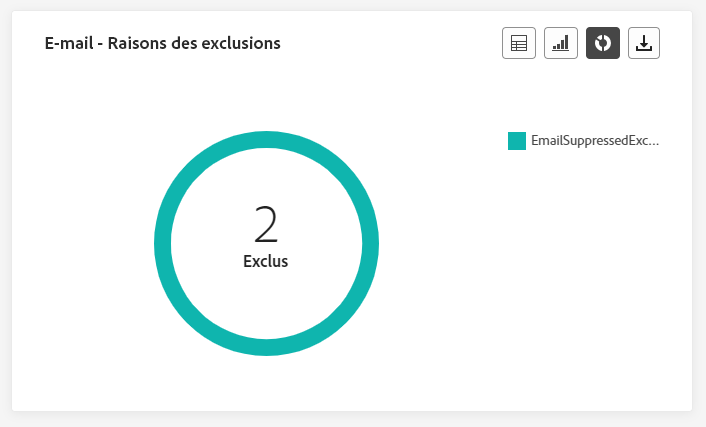

Les graphes et le tableau **[!UICONTROL Causes d’exclusion]** offrent une perspective complète sur les différents facteurs qui ont conduit à l’exclusion des profils d’utilisateurs et d’utilisatrices de l’audience ciblée au cours des dernières 24 heures.

Consultez [cette page](exclusion-list.md) pour obtenir la liste complète des causes d’exclusion.

### E-mail – Meilleur domaine de la personne destinataire {#email-best-recipient}

>[!CONTEXTUALHELP]
>id="ajo_campaign_live_email_best_recipient"
>title="E-mail – Meilleur domaine de la personne destinataire"
>abstract="Le tableau et le graphique E-mail - Meilleur domaine de destinataire fournissent une répartition détaillée des domaines que les personnes destinataires utilisent le plus souvent pour ouvrir l’e-mail, offrant des informations précieuses sur le comportement des personnes destinataires, depuis les dernières 24 heures."

Le graphe et le tableau **[!UICONTROL E-mail – Meilleur domaine de la personne destinataire]** fournissent une répartition complète des domaines les plus fréquemment utilisés par les profils pour ouvrir vos e-mails au cours des dernières 24 heures. Vous obtenez ainsi des informations précieuses sur le comportement des profils, ce qui vous permet de connaître les plateformes préférées.

### E-mail – Offres {#email-offers}

>[!NOTE]
>
>Les widgets et mesures Offres ne sont disponibles que si une décision a été insérée dans un e-mail. Pour plus d’informations sur la gestion des décisions, consultez cette [page](../offers/get-started/starting-offer-decisioning.md).

Les widgets **[!UICONTROL Statistiques des offres]** et **[!UICONTROL Statistiques des offres dans le temps]** mesurent le succès et l’impact de votre offre sur votre audience ciblée. Ils détaillent les informations principales relatives à votre message avec les KPI.

+++ En savoir plus sur les mesures E-mail – Offres

* **[!UICONTROL Offre envoyée]** : nombre total d’envois pour l’offre.

* **[!UICONTROL Impression de l’offre]** : nombre d’ouvertures de l’offre dans vos e-mails.

* **[!UICONTROL Clics de l’offre]** : nombre de fois où une offre a fait l’objet d’un clic dans vos e-mails.

+++

## Onglet In-app {#inapp-live}

Dans le **[!UICONTROL Rapport dynamique]** de votre campagne, l’onglet **[!UICONTROL In-app]** détaille les principales informations relatives aux messages in-app envoyées dans votre campagne.

### Performances in-app {#inapp-performance}

>[!CONTEXTUALHELP]
>id="ajo_campaign_live_inapp_performance"
>title="Performances in-app"
>abstract="Les KPI de performances in-app fournissent des informations essentielles sur l’engagement de vos visiteurs et visiteuses avec les messages in-app, depuis les dernières 24 heures."

Les KPI **[!UICONTROL Performances in-app]** fournissent des informations essentielles sur l’engagement de vos profils avec les messages in-app au cours des dernières 24 heures, en fournissant des mesures essentielles pour évaluer l’efficacité et l’impact de vos campagnes in-app.

+++ En savoir plus sur les mesures de performances in-app

* **[!UICONTROL Impressions]** : nombre total de messages in-app envoyés à toutes les personnes.

* **[!UICONTROL Interactions]** : nombre total d’engagements en lien avec votre message in-app. Cela inclut toutes les actions entreprises par les personnes, telles que les clics, les abandons ou toute autre interaction.

+++

### Synthèse in-app {#inapp-summary}

>[!CONTEXTUALHELP]
>id="ajo_campaign_live_inapp_summary"
>title="Synthèse in-app"
>abstract="Le graphique Synthèse in-app illustre la progression de vos impressions et interactions in-app au cours des dernières 24 heures."

Le graphe **[!UICONTROL Synthèse in-app]** illustre la progression de vos impressions et interactions in-app au cours des dernières 24 heures, fournissant une vue d’ensemble complète des performances de vos messages in-app.

+++ En savoir plus sur les mesures Synthèse in-app

* **[!UICONTROL Impressions]** : nombre total de messages in-app diffusés à tous les utilisateurs et utilisatrices.

* **[!UICONTROL Interactions]** : nombre total d’engagements en lien avec votre message in-app. Cela inclut toutes les actions entreprises par les personnes, telles que les clics, les abandons ou toute autre interaction.

+++

### Interactions par type {#inapp-interactions}

>[!CONTEXTUALHELP]
>id="ajo_campaign_live_inapp_interactions"
>title="Interactions par type"
>abstract="Les graphiques et le tableau Interactions par type détaillent la manière dont les personnes ont interagi avec votre message in-app en suivant les clics, les rejets ou les interactions, depuis les dernières 24 heures."

Les graphes et le tableau **[!UICONTROL Interactions par type]** fournissent un compte rendu détaillé de la manière dont les profils ont interagi avec votre message in-app au cours des dernières 24 heures, en suivant des actions telles que les clics, les abandons ou toute autre forme d’engagement.

## Onglet Notification push {#push-live}

Dans le **[!UICONTROL Rapport dynamique]** de votre campagne, l’onglet **[!UICONTROL Notification push]** détaille les principales informations relatives à la notification push envoyée dans votre campagne.

### Notification push – Performances d’envoi {#push-sending-performance}

>[!CONTEXTUALHELP]
>id="ajo_campaign_live_push_sending_performance"
>title="Notification push – Performances d’envoi"
>abstract="Le graphique Notifications push - Performances d’envoi résume les données essentielles sur votre notification push, telles que les erreurs ou les messages ciblés ou diffusés des dernières 24 heures."

Le graphe **[!UICONTROL Performances d’envoi des notifications push]** offre une vue d’ensemble complète des données relatives aux notifications push envoyées au cours des dernières 24 heures. Il fournit des informations sur les mesures essentielles, telles que les diffusions et les rebonds, ce qui permet un examen détaillé du processus d’envoi des notifications push.

+++ En savoir plus sur les mesures Notification push – Performances d’envoi

* **[!UICONTROL Diffusés]** : nombre de messages envoyés avec succès.

* **[!UICONTROL Rebonds]** : nombre total des erreurs comptabilisées lors de la procédure d’envoi et du traitement automatique des retours.

* **[!UICONTROL Erreurs]** : nombre total d’erreurs survenues au cours du processus d’envoi, empêchant l’envoi du message à des profils.

+++

### Notification push – Statistiques {#push-statistics}

>[!CONTEXTUALHELP]
>id="ajo_campaign_live_push_statistics"
>title="Notification push – Statistiques"
>abstract="Le tableau Notification push - Statistiques fournit des données sur l’activité des personnes destinataires pour votre notification push, depuis les dernières 24 heures."

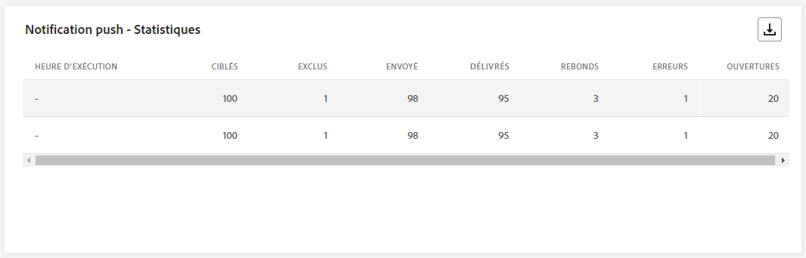

Le tableau **[!UICONTROL Notification push – Statistiques]** fournit un résumé concis des données essentielles relatives à vos notifications push au cours des dernières 24 heures, y compris les mesures clés telles que le nombre de messages ciblés et le nombre de messages livrés.

+++ En savoir plus sur les mesures Notification push – Statistiques

* **[!UICONTROL Heure d’exécution]** : heure de début de chaque exécution de votre notification push récurrente. Pour ne cibler qu’une ou plusieurs notifications push récurrentes, sélectionnez-les dans le menu déroulant **[!UICONTROL Heure d’exécution]**.

* **[!UICONTROL Ciblés]** : nombre de profils qui remplissent les critères de l’audience avant l’application des exclusions, des suppressions ou des suppressions de consentement.

* **[!UICONTROL Exclus]** : nombre de profils utilisateurs, exclus des profils ciblés, qui n’ont pas reçu le message.

* **[!UICONTROL Envoyés]** : nombre total d’e-mails envoyés.

* **[!UICONTROL Diffusés]** : nombre de messages envoyés avec succès.

* **[!UICONTROL Rebonds]** : nombre total des erreurs comptabilisées lors de la procédure d’envoi et du traitement automatique des retours.

* **[!UICONTROL Erreurs]** : nombre total d’erreurs survenues au cours de la procédure d’envoi, empêchant le message d’être envoyé à des profils.

* **[!UICONTROL Ouvertures]** : nombre d’ouvertures d’un message.

+++

### Notification push – Synthèse des envois {#push-sending-summary}

>[!CONTEXTUALHELP]
>id="ajo_campaign_live_push_sending_summary"
>title="Notification push – Synthèse des envois"
>abstract="Le graphique Notifications push - Synthèse des envois affiche les données disponibles pour les notifications push envoyées, depuis les dernières 24 heures."

Le graphe **[!UICONTROL Notification push – Statistiques]** offre une représentation dynamique, en affichant une analyse de votre activité de notifications push au cours des dernières 24 heures. Cette représentation graphique montre une répartition complète des notifications push envoyées.

+++ En savoir plus sur les mesures Notification push – Synthèse des envois

* **[!UICONTROL Ouvertures]** : nombre de fois que votre notification push a été ouverte.

* **[!UICONTROL Actions]** : nombre total d’actions sur la notification push diffusée, par exemple clic sur un bouton ou rejet.

* **[!UICONTROL Rebonds]** : nombre total d’erreurs cumulées lors du traitement automatique des retours par rapport au nombre total de messages envoyés.

* **[!UICONTROL Délivrés]** : nombre de messages envoyés avec succès, par rapport au nombre total de messages envoyés.

* **[!UICONTROL Erreurs]** : nombre total d’erreurs survenues empêchant l’e-mail d’être envoyé à des profils.

+++

### Notification push – Causes d’exclusion {#push-excluded}

>[!CONTEXTUALHELP]
>id="ajo_campaign_live_push_excluded_reasons"
>title="Notification push – Causes d’exclusion"
>abstract="Les graphiques et le tableau Causes d’exclusion illustrent les différents facteurs qui ont conduit à ce que des profils de personnes, exclus de l’audience ciblée, ne reçoivent pas le message, depuis les dernières 24 heures."

Les graphes et le tableau **[!UICONTROL Causes d’exclusion]** affichent les différentes raisons qui ont empêché les profils de personnes, exclus des profils ciblés, de recevoir vos notifications push au cours des dernières 24 heures.

Consultez [cette page](exclusion-list.md) pour obtenir la liste complète des raisons d’exclusion.

### Notification push – Causes d’erreur {#push-error}

>[!CONTEXTUALHELP]
>id="ajo_campaign_live_push_error_reasons"
>title="Notification push – Causes d’erreur"
>abstract="Les graphiques et le tableau Raisons d’erreur vous permettent d’identifier les erreurs spécifiques qui se sont produites au cours des dernières 24 heures pendant le processus d’envoi."

Le tableau et les graphiques **[!UICONTROL Causes d’erreur]** vous permettent d’identifier les erreurs spécifiques qui se sont produites au cours du processus d’envoi de vos notifications push au cours des dernières 24 heures, en fournissant des informations détaillées sur tout problème rencontré en cours de route.

### Notification push – Répartition par plateforme {#push-breakdown-platform}

>[!CONTEXTUALHELP]
>id="ajo_campaign_live_push_breakdown_platform"
>title="Notification push – Répartition par plateforme"
>abstract="Le tableau et les graphiques Répartition par plateforme fournissent une répartition du succès de vos notifications push au cours des dernières 24 heures en fonction du système d’exploitation des personnes destinataires."

Le graphe et le tableau **[!UICONTROL Notification push – Répartition par plateforme]** fournissent une analyse détaillée du succès de vos notifications push au cours des dernières 24 heures, en fonction du système d’exploitation de votre profil. Cette répartition vous permet de mieux comprendre les performances de vos notifications push sur différentes plateformes.

+++ En savoir plus sur les mesures Notification push – Répartition par plateforme

* **[!UICONTROL Ciblés]** : nombre de profils qui remplissent les critères de l’audience avant l’application des exclusions, des suppressions ou des suppressions de consentement.

* **[!UICONTROL Diffusés]** : nombre de messages envoyés avec succès, par rapport au nombre total de messages envoyés.

* **[!UICONTROL Ouvertures]** : nombre de fois que votre notification push a été ouverte.

* **[!UICONTROL Actions]** : nombre total d’actions sur la notification push diffusée, par exemple clic sur un bouton ou rejet.

* **[!UICONTROL Rebonds]** : nombre total d’erreurs cumulées lors du traitement automatique des retours par rapport au nombre total de messages envoyés.

* **[!UICONTROL Erreurs]** : nombre total d’erreurs survenues empêchant la notification push d’être envoyée à des profils.

* **[!UICONTROL Exclus]** : nombre de profils qui ont été exclus par Adobe Journey Optimizer.

+++

## Onglet SMS {#sms-live}

Dans le **[!UICONTROL Rapport dynamique]** de votre campagne, l’onglet **[!UICONTROL SMS]** détaille les principales informations relatives aux SMS envoyés dans votre campagne.

### SMS – Statistiques {#sms-statistics}

>[!CONTEXTUALHELP]
>id="ajo_campaign_live_sms_statistics"
>title="SMS – Statistiques"
>abstract="Le tableau SMS - Statistiques d’envoi récapitule les données essentielles relatives à vos SMS, telles que les messages ciblés ou délivrés, depuis les dernières 24 heures."

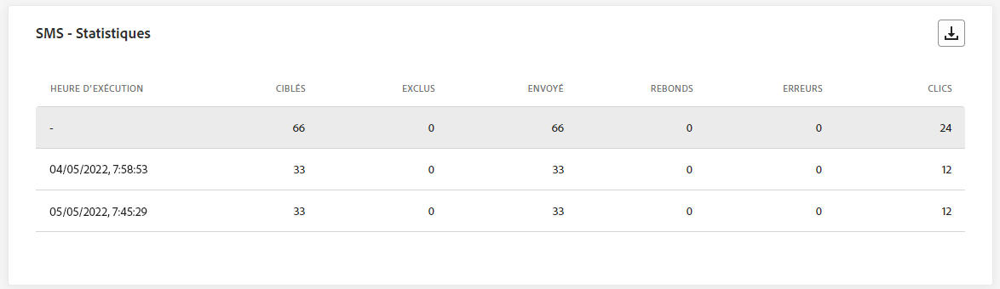

Le tableau **[!UICONTROL SMS – Statistiques]** fournit un résumé concis des données essentielles relatives à vos messages SMS au cours des dernières 24 heures, y compris les mesures clés telles que le nombre de messages ciblés et le nombre de messages diffusés avec succès.

+++ En savoir plus sur les mesures SMS – Statistiques

* **[!UICONTROL Heure d’exécution]** : heure de début de chaque exécution de votre SMS récurrent. Pour ne cibler qu’un ou plusieurs SMS récurrents, sélectionnez-les dans le menu déroulant **[!UICONTROL Heure d’exécution]**.

* **[!UICONTROL Ciblés]** : nombre de profils de personnes qui sont qualifiés en tant que profils cibles.

* **[!UICONTROL Exclus]** : nombre de profils utilisateurs, exclus des profils ciblés, qui n’ont pas reçu le message.

* **[!UICONTROL Envoyés]** : nombre total d’e-mails envoyés.

* **[!UICONTROL Rebonds]** : nombre total des erreurs comptabilisées lors de la procédure d’envoi et du traitement automatique des retours.

* **[!UICONTROL Erreurs]** : nombre total d’erreurs survenues au cours de la procédure d’envoi, empêchant le message d’être envoyé à des profils.

* **[!UICONTROL Clics]** : nombre total de visites d’URL.

+++

### SMS – Performances par date {#sms-perfomance-date}

>[!CONTEXTUALHELP]
>id="ajo_campaign_live_sms_performance"
>title="SMS – Performances par date"
>abstract="Le widget SMS - Performances par date fournit des informations clés des dernières 24 heures sur vos messages par le biais d’une représentation graphique."

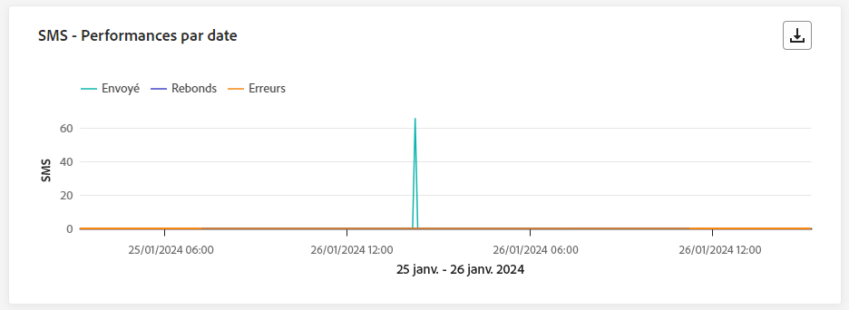

Le widget **[!UICONTROL Performances des SMS par date]** offre une vue d’ensemble détaillée des informations clés relatives à vos messages, présentée sous la forme d’un graphe, en fournissant des informations sur les tendances de performances au cours des dernières 24 heures.

+++ En savoir plus sur les mesures SMS – Performances par date

* **[!UICONTROL Envoyés]** : nombre total d’e-mails envoyés.

* **[!UICONTROL Rebonds]** : nombre total des erreurs comptabilisées lors de la procédure d’envoi et du traitement automatique des retours.

* **[!UICONTROL Erreurs]** : nombre total d’erreurs survenues au cours de la procédure d’envoi, empêchant le message d’être envoyé à des profils.

+++

### SMS – Causes d’erreur {#sms-error-reasons}

>[!CONTEXTUALHELP]
>id="ajo_campaign_live_sms_error_reasons"
>title="SMS – Causes d’erreur"
>abstract="Les graphiques et le tableau SMS - Raisons d’erreur vous permettent d’identifier les erreurs spécifiques qui se sont produites au cours des dernières 24 heures pendant le processus d’envoi."

Les graphes et le tableau **[!UICONTROL Causes d’exclusion]** permettent d’identifier les erreurs spécifiques qui se sont produites au cours du processus d’envoi de vos SMS au cours des dernières 24 heures, ce qui facilite l’analyse approfondie de tous les problèmes rencontrés.

### SMS – Causes d’exclusion {#sms-excluded-reasons}

>[!CONTEXTUALHELP]
>id="ajo_campaign_live_sms_excluded_reasons"
>title="SMS – Causes d’exclusion"
>abstract="Les graphiques et le tableau Causes d’exclusion illustrent les différents facteurs qui ont conduit à ce que des profils de personnes, exclus de l’audience ciblée, ne reçoivent pas le message, depuis les dernières 24 heures."

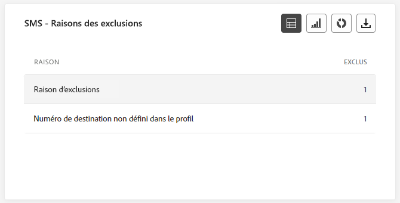

Les graphes et le tableau **[!UICONTROL Causes d’exclusion]** décrivent visuellement les différents facteurs qui ont conduit à l’exclusion des profils d’utilisateurs et d’utilisatrices de l’audience ciblée, les ayant empêché de recevoir vos SMS au cours des dernières 24 heures.

Consultez [cette page](exclusion-list.md) pour obtenir la liste complète des causes d’exclusion.

### SMS – Causes de rebonds {#sms-bounces-reasons}

>[!CONTEXTUALHELP]
>id="ajo_campaign_live_sms_bounces_reasons"
>title="SMS – Causes de rebonds"
>abstract="Les graphiques et le tableau Causes de rebond contiennent les données disponibles sur les messages ayant fait l’objet d’un rebond, depuis les dernières 24 heures."

Les graphes et le tableau **[!UICONTROL Causes de rebonds]** fournissent une vue d’ensemble complète des données relatives aux rebonds de messages SMS, en fournissant des informations précieuses sur les raisons spécifiques à l’origine des instances de rebonds de messages SMS au cours des dernières 24 heures.

## Onglet web {#web-tab}

Dans votre **[!UICONTROL rapport dynamique]** Campaign, l’onglet **[!UICONTROL Web]** présente les informations principales relatives à vos pages web.

### Performances web {#web-performance}

>[!CONTEXTUALHELP]
>id="ajo_campaign_live_web_performance"
>title="Performances web"
>abstract="Les KPI de Performances web fournissent des informations complètes sur l’engagement de vos visiteurs et visiteuses avec vos expériences web au cours des dernières 24 heures."

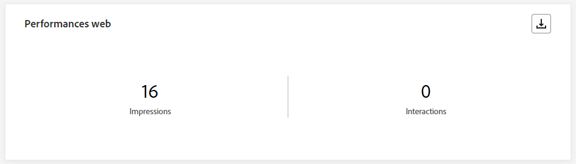

Les KPI **[!UICONTROL Performances web]** offrent des informations complètes sur l’engagement des visiteurs et visiteuses de vos pages web au cours des dernières 24 heures, notamment sur les mesures clés telles que les impressions et les interactions.

+++ En savoir plus sur les mesures de performances web

* **[!UICONTROL Impressions]** : nombre total d’expériences web diffusées à tous les utilisateurs et utilisatrices.

* **[!UICONTROL Interactions]** : nombre total d’engagements en lien avec votre page web. Il s’agit de toutes les actions entreprises par les personnes, telles que les clics ou toute autre interaction.

+++ 

### Résumé web {#web-summary}

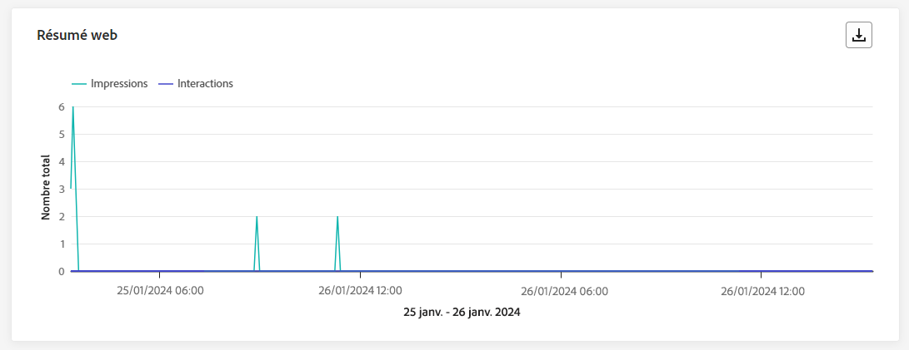

>[!CONTEXTUALHELP]
>id="ajo_campaign_live_web_summary"
>title="Résumé web"
>abstract="Le graphique Résumé web présente la progression de vos expériences web, y compris les impressions, les impressions uniques et les interactions, pour les dernières 24 heures."

Le graphe **[!UICONTROL Résumé web]** présente l’évolution de vos expériences web (impressions, impressions unique et interactions) au cours des dernières 24 heures.

+++ En savoir plus sur les mesures de résumé web

* **[!UICONTROL Impressions]** : nombre total d’expériences web diffusées à tous les utilisateurs et utilisatrices.

* **[!UICONTROL Interactions]** : nombre total d’engagements en lien avec votre page web. Il s’agit de toutes les actions entreprises par les personnes, telles que les clics ou toute autre interaction.

+++ 

### Interactions par élément {#web-interactions}

>[!CONTEXTUALHELP]
>id="ajo_campaign_live_web_interactions"
>title="Interactions par élément"
>abstract="Le tableau Interactions par élément fournit des informations clés sur l’engagement des visiteurs et visiteuses avec différents éléments de vos pages web, depuis les dernières 24 heures."

Le tableau **[!UICONTROL Interactions par élément]** présente des informations complètes sur l’engagement de vos visiteurs et visiteuses avec les différents éléments de vos pages web au cours des dernières 24 heures, ce qui vous donne des informations précieuses sur les interactions et les préférences des utilisateurs et des utilisatrices.

## Onglet Courrier {#direct-mail-tab}

Depuis le **[!UICONTROL Rapport dynamique]** de votre campagne, l’onglet **[!UICONTROL Courrier]** présente les informations principales relatives à votre courrier.

### Courrier – Statistiques d’envoi {#direct-mail-sending}

>[!CONTEXTUALHELP]
>id="ajo_campaign_live_direct_sending_statistics"
>title="Courrier – Statistiques d’envoi"
>abstract="Le tableau Courrier - Statistiques d’envoi résume les données essentielles des dernières 24 heures relatives à votre courrier, telles que les messages ciblés ou diffusés."

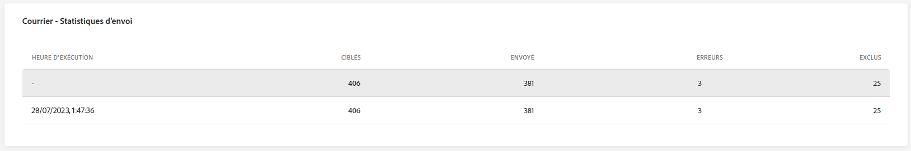

Le tableau **[!UICONTROL Courrier – Statistiques d’envoi]** fournit un résumé concis des données essentielles liées à votre courrier, englobant des mesures clés telles que le nombre de messages ciblés et le nombre de messages diffusés avec succès au cours des dernières 24 heures.

+++ En savoir plus sur les mesures Courrier – Statistiques d’envoi

* **[!UICONTROL Ciblés]** : nombre de profils de personnes qui sont qualifiés en tant que profils cibles.

* **[!UICONTROL Envoyés]** : nombre total d’e-mails envoyés.

* **[!UICONTROL Erreurs]** : nombre total d’erreurs survenues au cours de la procédure d’envoi, empêchant le message d’être envoyé à des profils.

* **[!UICONTROL Exclus]** : nombre de profils de personnes, exclus des profils ciblés, qui n’ont pas reçu votre courrier.

+++

### Courrier – Causes d’erreur {#direct-mail-error-reasons}

>[!CONTEXTUALHELP]
>id="ajo_campaign_live_direct_error_reasons"
>title="Courrier – Causes d’erreur"
>abstract="Les graphiques et le tableau Courrier - Causes d’erreur vous permettent d’identifier les erreurs spécifiques qui se sont produites au cours des dernières 24 heures."

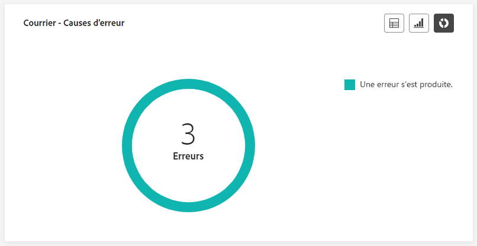

Les graphes et le tableau **[!UICONTROL Courrier – Causes d’erreur]** permettent d’identifier les erreurs spécifiques qui se sont produites pendant le processus d’envoi de votre courrier, ce qui permet d’analyser en détail les éventuels problèmes rencontrés au cours des dernières 24 heures.

### Courrier – Causes d’exclusion {#direct-mail-excluded-reasons}

>[!CONTEXTUALHELP]
>id="ajo_campaign_live_direct_excluded_reasons"
>title="Courrier – Causes d’exclusion"
>abstract="Les graphiques et le tableau Causes d’exclusion de courrier illustrent les différents facteurs qui ont conduit à ce que des profils de personnes, exclus de l’audience ciblée, ne reçoivent pas le message, depuis les dernières 24 heures."

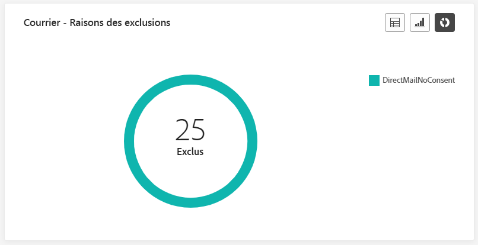

Les graphes et le tableau **[!UICONTROL Courrier – Causes d’exclusion]** illustrent visuellement les différents facteurs qui ont abouti à l’exclusion des profils de personnes de l’audience ciblée, ce qui les empêche de recevoir vos courriers au cours des dernières 24 heures.

Consultez [cette page](exclusion-list.md) pour la liste complète des causes d’exclusion.

## Ressources supplémentaires

* [Commencer avec les campagnes](../campaigns/get-started-with-campaigns.md)
* [Créer une campagne](../campaigns/create-campaign.md)
* [Créer des campagnes déclenchées par API](../campaigns/api-triggered-campaigns.md)
* [Modification ou arrêt d’une campagne](../campaigns/manage-campaigns.md)
* [Rapport de campagne](campaign-global-report-cja.md)
