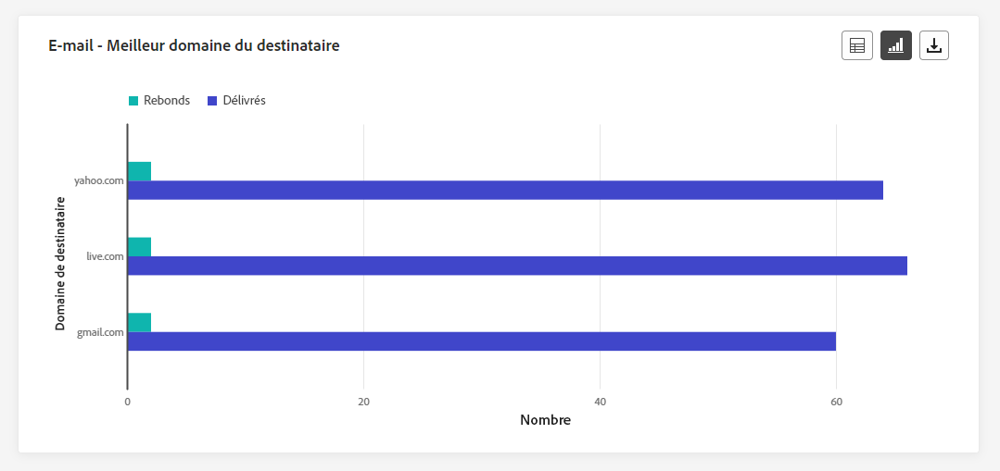

# Rapport dynamique de campagne {#campaign-live-report}

>[!CONTEXTUALHELP]
>id="ajo_campaign_live_report"
>title="Rapport dynamique de campagne"
>abstract="Le rapport dynamique de campagne vous permet de mesurer et de visualiser en temps réel l’efficacité et les performances de vos campagnes (limité aux dernières 24 heures). Le rapport dyamique de campagne est composé de plusieurs widgets présentant le succès et les erreurs de votre campagne. Vous pouvez modifier chaque tableau de bord de reporting en redimensionnant ou en supprimant des widgets."

Les rapports dynamiques, accessibles à partir de l’onglet Dernières 24 heures, affichent les événements qui se sont produits au cours des dernières 24 heures, avec un intervalle de temps minimal de deux minutes à compter de l’occurrence de l’événement. En comparaison, les rapports globaux portent sur les événements qui se sont produits il y a au moins deux heures et couvrent les événements sur une période sélectionnée.

Vous pouvez accéder directement au rapport dynamique de campagne à partir de votre campagne à l’aide du bouton **[!UICONTROL Vue dynamique]**.

La page **[!UICONTROL Rapport dynamique]** de la campagne s&#39;affiche avec les onglets suivants :

* [Campagne](#campaign-live)
* [E-mail](#email-live)
* [In-app](#inapp-live)
* [Notification push](#push-live)
* [SMS](#sms-live)
* [Web](#web-tab)
* [Publipostage direct](#direct-mail-tab)

Le **[!UICONTROL rapport dyamique]** de campagne est divisé en différents widgets présentant le succès et les erreurs de votre campagne. Chaque widget peut être redimensionné et supprimé si nécessaire. Pour plus d&#39;informations à ce propos, consultez cette [section](../reports/live-report.md#modify-dashboard).

Pour obtenir la liste détaillée de chaque mesure disponible dans Adobe Journey Optimizer, reportez-vous à [cette page](live-report.md#list-of-components-live).

## Onglet Campagne {#campaign-live}

### Diffusion {#delivery-live}

La variable **[!UICONTROL Statistiques de la campagne]** Les indicateurs de performance clés constituent un tableau de bord complet, qui propose une ventilation détaillée des mesures clés des dernières 24 heures liées à votre campagne. Cela inclut des informations essentielles telles que le nombre de profils et les actions diffusées, ce qui vous permet de bien comprendre les performances et l’engagement de votre campagne.

+++ En savoir plus sur les mesures de statistiques de Campaign

* **[!UICONTROL Audience]**: nombre de profils ciblés.

* **[!UICONTROL Actions réalisées]**: nombre total de fois où une action a été diffusée.

* **[!UICONTROL Erreurs]** : nombre total d’erreurs survenues au cours de la procédure d’envoi, empêchant le message d’être envoyé à des profils.

+++

<!--
### Experimentation tab (#experimentation-live)

From your Campaign **[!UICONTROL Live report]**, the **[!UICONTROL Experimentation]** tab details the main information relative to how each variant is performing and if there is was winner during the test.
-->

## Onglet E-mail {#email-live}

Dans le **[!UICONTROL Rapport dynamique]** de campagne, l’onglet **[!UICONTROL E-mail]** détaille les principales informations relatives à l’e-mail envoyé dans votre campagne.

### E-mail - Performance d’envoi {#email-sending-performance}

>[!CONTEXTUALHELP]
>id="ajo_campaign_live_email_sending_statistics"
>title="E-mail - Statistiques d’envoi"
>abstract="Le graphique E-mail - Statistiques d’envoi résume les données essentielles relatives à votre e-mail, telles que Ciblés ou Diffusés, depuis les dernières 24 heures."

La variable **[!UICONTROL Email - Envoi des performances]** offre un aperçu complet des données relatives aux emails envoyés au cours des dernières 24 heures. Il fournit des informations sur les mesures essentielles telles que les envois et les rebonds, ce qui permet d’examiner en détail le processus d’envoi des emails.

+++ En savoir plus sur les mesures de performances d’envoi d’emails

* **[!UICONTROL Délivrés]**: nombre d’emails envoyés avec succès.

* **[!UICONTROL Rebonds]** : nombre total des erreurs comptabilisées lors de la procédure d’envoi et du traitement automatique des retours.

* **[!UICONTROL Reprises]** : nombre d’e-mails dans la file d’attente pour les reprises.

* **[!UICONTROL Erreurs]** : nombre total d’erreurs survenues au cours de la procédure d’envoi, empêchant le message d’être envoyé à des profils.
+++

### E-mail - Statistiques

>[!CONTEXTUALHELP]
>id="ajo_campaign_live_email_statistics"
>title="E-mail - Statistiques"
>abstract="Le tableau E-mail - Statistiques fournit les données sur l’activité de profil pour votre e-mail, depuis les dernières 24 heures."

La variable **[!UICONTROL Envoi de mesures par courrier électronique]** offre un résumé complet des données des dernières 24 heures. Il présente les mesures essentielles, notamment la taille de l’audience ciblée et le nombre d’emails délivrés avec succès. Vous obtenez ainsi des informations précieuses sur l’efficacité et la portée de vos campagnes par e-mail.

+++ En savoir plus sur les e-mails - mesures de statistiques

* **[!UICONTROL Heure d’exécution]** : heure de début de chaque exécution de votre e-mail récurrent. Pour ne cibler qu’un ou plusieurs e-mails récurrents, sélectionnez-les dans le menu déroulant **[!UICONTROL Heure d’exécution]**.

* **[!UICONTROL Ciblés]** : nombre total de messages traités lors de la procédure d’envoi.

* **[!UICONTROL Exclus]** : nombre de profils utilisateurs, exclus des profils ciblés, qui n’ont pas reçu le message.

* **[!UICONTROL Envoyés]** : nombre total d’e-mails envoyés.

* **[!UICONTROL Livrés]** : nombre de messages envoyés avec succès.

* **[!UICONTROL Rebonds]** : nombre total des erreurs comptabilisées lors de la procédure d’envoi et du traitement automatique des retours.

* **[!UICONTROL Erreurs]** : nombre total d’erreurs survenues au cours de la procédure d’envoi, empêchant le message d’être envoyé à des profils.

* **[!UICONTROL Ouvertures]** : nombre d’ouvertures d’un message.

* **[!UICONTROL Clics]** : nombre de clics sur un contenu.

* **[!UICONTROL Désabonnements]** : nombre de clics sur le lien de désabonnement.

* **[!UICONTROL Plaintes contre le spal]** : nombre de fois où un message a été déclaré comme spam ou courrier indésirable.

* **[!UICONTROL Reprises]** : nombre d’e-mails dans la file d’attente pour les reprises.
+++

### Email - Catégories et motifs de rebond {#bounce-categories}

>[!CONTEXTUALHELP]
>id="ajo_campaign_live_email_bounce_categories"
>title="E-mail - Catégories de rebond"
>abstract="Le tableau et les graphiques E-mail - Catégories de rebond fournissent des données sur les erreurs temporaires et permanentes des dernières 24 heures."

>[!CONTEXTUALHELP]
>id="ajo_campaign_live_email_bounce_reasons"
>title="E-mail - Causes des rebonds"
>abstract="Les graphiques et le tableau E-mail - Causes des rebonds contiennent les données disponibles relatives aux messages ayant fait l’objet d’un rebond, depuis les dernières 24 heures."

La variable **[!UICONTROL Raisons de rebond]** et **[!UICONTROL Catégories rebonds]** Les widgets compilent les données disponibles des dernières 24 heures relatives aux messages rebonds, en fournissant des informations détaillées sur les raisons et les catégories spécifiques derrière les bounces des emails.

Pour plus d’informations sur les rebonds, consultez la page [Liste de suppression](../reports/suppression-list.md).

+++ En savoir plus sur les mesures Email - Catégories de rebond et Raisons

* **[!UICONTROL Rebond définitif]** : nombre total d’erreurs permanentes, telles qu’une adresse e-mail incorrecte. Un message d&#39;erreur indique explicitement que l&#39;adresse n&#39;est pas valide, comme Utilisateur inconnu.

* **[!UICONTROL Rebond temporaire]** : nombre total d’erreurs temporaires, telles qu’une boîte de réception pleine.

* **[!UICONTROL Ignorées]** : nombre total d&#39;erreurs temporaires (par exemple, Absent(e) du bureau) ou techniques (par exemple, si le type d&#39;expéditeur est administrateur).

+++

### E-mail - Performances par date {#email-performance-date}

>[!CONTEXTUALHELP]
>id="ajo_campaign_live_email_performance_bydate"
>title="E-mail - Performances par date"
>abstract="Le graphique Email - Performances par date présente des données complètes sur les dernières 24 heures concernant les emails envoyés, en fournissant des informations sur les mesures clés telles que les envois et les bounces, ce qui permet d’effectuer une analyse détaillée du processus d’envoi des emails."

La variable **[!UICONTROL Email - Performance par date]** widget offre un aperçu détaillé des informations clés relatives à vos messages, présenté sous la forme d’un graphique, fournissant des informations sur les tendances de performances au cours des dernières 24 heures.

+++ En savoir plus sur les mesures Email - Performance par date et par raison

* **[!UICONTROL Envoyés]** : nombre total d’e-mails envoyés.

* **[!UICONTROL Livrés]** : nombre de messages envoyés avec succès.

* **[!UICONTROL Rebonds]** : nombre total des erreurs comptabilisées lors de la procédure d’envoi et du traitement automatique des retours.

* **[!UICONTROL Erreurs]** : nombre total d’erreurs survenues au cours de la procédure d’envoi, empêchant le message d’être envoyé à des profils.

* **[!UICONTROL Ouvertures]** : nombre d’ouvertures d’un message.

* **[!UICONTROL Clics]** : nombre de clics sur un contenu.

* **[!UICONTROL Désabonnements]** : nombre de clics sur le lien de désabonnement.

* **[!UICONTROL Plaintes contre le spam]** : nombre de fois où un message a été déclaré comme spam ou courrier indésirable.

+++

### Raisons de l’erreur {#email-error-reasons}

>[!CONTEXTUALHELP]
>id="ajo_campaign_live_email_error_reasons"
>title="E-mail - Causes d’erreur"
>abstract="Le tableau et les graphiques E-mail - Causes d’erreur vous permet d’identifier les erreurs spécifiques qui se sont produites pendant le processus d’envoi au cours des dernières 24 heures."

La variable **[!UICONTROL Raisons de l’erreur]** les graphiques et les tableaux fournissent des informations sur les erreurs spécifiques survenues au cours du processus d’envoi au cours des dernières 24 heures. Ces informations sont utiles pour comprendre la nature et la fréquence des erreurs.

### Motifs exclus {#email-exclude-reasons}

>[!CONTEXTUALHELP]
>id="ajo_campaign_live_email_excluded_reasons"
>title="E-mail - Causes d’exclusion"
>abstract="Les graphiques et le tableau Causes d’exclusion illustrent les différents facteurs qui ont conduit à ce que des profils de personnes, exclus de l’audience ciblée, ne reçoivent pas le message, depuis les dernières 24 heures."

La variable **[!UICONTROL Motifs exclus]** les graphiques et les tableaux offrent une vue d’ensemble complète des différents facteurs qui ont conduit à l’exclusion des profils utilisateur de l’audience ciblée au cours des dernières 24 heures.

Voir [cette page](exclusion-list.md) pour la liste complète des motifs d&#39;exclusion.

### E-mail - Meilleur domaine de destinataire {#email-best-recipient}

>[!CONTEXTUALHELP]
>id="ajo_campaign_live_email_best_recipient"
>title="E-mail - Meilleur domaine de destinataire"
>abstract="Le tableau et le graphique E-mail - Meilleur domaine de destinataire fournissent une ventilation détaillée des domaines que les personnes destinataires utilisent le plus souvent pour ouvrir l’e-mail, offrant des informations précieuses sur le comportement des personnes destinataires, depuis les dernières 24 heures."

La variable **[!UICONTROL Email - Meilleur domaine de destinataire]** Le graphique et le tableau fournissent une ventilation complète des domaines les plus fréquemment utilisés par les profils pour ouvrir vos emails au cours des dernières 24 heures. Vous obtenez ainsi des informations précieuses sur le comportement des profils, ce qui vous permet de comprendre les plateformes préférées.

### Email- Offres {#email-offers}

>[!NOTE]
>
>Les widgets et mesures Offres ne sont disponibles que si une décision a été insérée dans un e-mail. Pour plus d’informations sur la gestion des décisions, consultez cette [page](../offers/get-started/starting-offer-decisioning.md).

La variable **[!UICONTROL Statistiques des offres]** et **[!UICONTROL Statistiques des offres au fil du temps]** Les widgets mesurent le succès et l’impact de votre offre sur votre audience ciblée. Il détaille les informations principales relatives à votre message avec les KPI.

+++ En savoir plus sur les mesures Email - Offres

* **[!UICONTROL Offre envoyée]** : nombre total d’envois pour l’offre.

* **[!UICONTROL Impression de l&#39;offre]**: nombre de fois où l’offre a été ouverte dans vos courriers électroniques.

* **[!UICONTROL Clics sur les offres]**: nombre de clics sur une offre dans vos emails.

+++

## Onglet In-app {#inapp-live}

Dans le **[!UICONTROL Rapport dynamique]** de votre campagne, l’onglet **[!UICONTROL In-app]** détaille les principales informations relatives aux messages in-app envoyées dans votre campagne.

### Performances in-app {#inapp-performance}

>[!CONTEXTUALHELP]
>id="ajo_campaign_live_inapp_performance"
>title="Performances in-app"
>abstract="Les KPI de performances in-app fournissent des informations essentielles sur l’engagement de vos visiteurs et visiteuses avec les messages in-app, depuis les dernières 24 heures."

La variable **[!UICONTROL Performances in-app]** Les indicateurs de performance clés fournissent des informations essentielles sur l’engagement de vos profils avec les messages In-App au cours des dernières 24 heures, en fournissant des mesures essentielles pour évaluer l’efficacité et l’impact de vos campagnes In-App.

+++ En savoir plus sur les mesures de performances In-App

* **[!UICONTROL Impressions]** : nombre total de messages in-app envoyés à toutes les personnes.

* **[!UICONTROL Interactions]**: nombre total d’engagements avec votre message in-app. Cela inclut toutes les actions entreprises par les personnes, telles que les clics, les rejets ou toute autre interaction.

+++

### Résumé in-app {#inapp-summary}

>[!CONTEXTUALHELP]
>id="ajo_campaign_live_inapp_summary"
>title="Résumé in-app"
>abstract="Le graphique Synthèse in-app illustre la progression de vos impressions et interactions in-app au cours des dernières 24 heures."

La variable **[!UICONTROL Résumé in-app]** Le graphique illustre la progression de vos impressions et interactions in-app au cours des dernières 24 heures, fournissant un aperçu complet des performances de vos messages in-app.

+++ En savoir plus sur les mesures de résumé in-app

* **[!UICONTROL Impressions]** : nombre total de messages in-app diffusés à tous les utilisateurs et utilisatrices.

* **[!UICONTROL Interactions]**: nombre total d’engagements avec votre message in-app. Cela inclut toutes les actions entreprises par les personnes, telles que les clics, les rejets ou toute autre interaction.

+++

### Interactions par type {#inapp-interactions}

>[!CONTEXTUALHELP]
>id="ajo_campaign_live_inapp_interactions"
>title="Interactions par type"
>abstract="Les graphiques et le tableau Interactions par type détaillent la manière dont les personnes ont interagi avec votre message in-app en suivant les clics, les rejets ou les interactions, depuis les dernières 24 heures."

La variable **[!UICONTROL Interactions par type]** Les graphiques et les tableaux fournissent un compte rendu détaillé de la manière dont les profils ont interagi avec votre message in-app au cours des dernières 24 heures, ainsi que des actions de suivi telles que les clics, les retraits ou toute autre forme d’engagement.

## Onglet Notification push {#push-live}

Dans le **[!UICONTROL Rapport dynamique]** de campagne, l’onglet **[!UICONTROL Notification push]** détaille les principales informations relatives à la notification push envoyée dans votre campagne.

### Notifications push - Performances d’envoi {#push-sending-performance}

>[!CONTEXTUALHELP]
>id="ajo_campaign_live_push_sending_performance"
>title="Notifications push - Performances d’envoi"
>abstract="Le graphique Notifications push - Performances d’envoi résume les données essentielles sur votre notification push, telles que les erreurs ou les messages ciblés ou diffusés des dernières 24 heures."

La variable **[!UICONTROL Performances d&#39;envoi des notifications push]** graph offre un aperçu complet des données relatives aux notifications push envoyées au cours des dernières 24 heures. Il fournit des informations sur les mesures essentielles telles que les diffusions et les bounces, ce qui permet un examen détaillé du processus d’envoi des notifications push.

+++ En savoir plus sur les notifications push - Envoi de mesures de performances

* **[!UICONTROL Livrés]** : nombre de messages envoyés avec succès.

* **[!UICONTROL Rebonds]** : nombre total des erreurs comptabilisées lors de la procédure d’envoi et du traitement automatique des retours.

* **[!UICONTROL Erreurs]** : nombre total d’erreurs survenues au cours de la procédure d’envoi, empêchant le message d’être envoyé à des profils.

+++

### Notification push - Statistiques {#push-statistics}

>[!CONTEXTUALHELP]
>id="ajo_campaign_live_push_statistics"
>title="Notification push - Statistiques"
>abstract="Le tableau Notification push - Statistiques fournit des données sur l’activité des personnes destinataires pour votre notification push, depuis les dernières 24 heures."

La variable **[!UICONTROL Notification push - Statistiques]** Le tableau fournit un résumé concis des données essentielles relatives à vos notifications push au cours des dernières 24 heures, y compris les mesures clés telles que le nombre de messages ciblés et le nombre de messages correctement diffusés.

+++ En savoir plus sur les notifications push - Mesures de statistiques

* **[!UICONTROL Heure d’exécution]** : heure de début de chaque exécution de votre notification push récurrente. Pour ne cibler qu’une ou plusieurs notifications push récurrentes, sélectionnez-les dans le menu déroulant **[!UICONTROL Heure d’exécution]**.

* **[!UICONTROL Ciblés]** : nombre total de messages traités lors de la procédure d’envoi.

* **[!UICONTROL Exclus]** : nombre de profils utilisateurs, exclus des profils ciblés, qui n’ont pas reçu le message.

* **[!UICONTROL Envoyés]** : nombre total d’e-mails envoyés.

* **[!UICONTROL Livrés]** : nombre de messages envoyés avec succès.

* **[!UICONTROL Rebonds]** : nombre total des erreurs comptabilisées lors de la procédure d’envoi et du traitement automatique des retours.

* **[!UICONTROL Erreurs]** : nombre total d’erreurs survenues au cours de la procédure d’envoi, empêchant le message d’être envoyé à des profils.

* **[!UICONTROL Ouvertures]** : nombre d’ouvertures d’un message.

+++

### Notification push - Synthèse des envois {#push-sending-summary}

>[!CONTEXTUALHELP]
>id="ajo_campaign_live_push_sending_summary"
>title="Notification push - Synthèse des envois"
>abstract="Le graphique Notifications push - Synthèse des envois affiche les données disponibles pour les notifications push envoyées, depuis les dernières 24 heures."

La variable **[!UICONTROL Notification push - Statistiques]** le graphique offre une représentation dynamique, affichant une analyse de votre activité de notifications push au cours des dernières 24 heures. Cette représentation graphique fournit une ventilation complète des notifications push envoyées.

+++ En savoir plus sur les notifications push - Envoi de mesures récapitulatives

* **[!UICONTROL Ouvertures]** : nombre de fois que votre notification push a été ouverte.

* **[!UICONTROL Actions]** : nombre total d’actions sur la notification push diffusée, par exemple clic sur un bouton ou rejet.

* **[!UICONTROL Rebonds]** : nombre total d’erreurs cumulées lors du traitement automatique des retours par rapport au nombre total de messages envoyés.

* **[!UICONTROL Délivrés]** : nombre de messages envoyés avec succès, par rapport au nombre total de messages envoyés.

* **[!UICONTROL Erreurs]** : nombre total d’erreurs survenues empêchant l’e-mail d’être envoyé à des profils.

+++

### Notification push - Causes d’exclusion {#push-excluded}

>[!CONTEXTUALHELP]
>id="ajo_campaign_live_push_excluded_reasons"
>title="Notification push - Causes d’exclusion"
>abstract="Les graphiques et le tableau Causes d’exclusion illustrent les différents facteurs qui ont conduit à ce que des profils de personnes, exclus de l’audience ciblée, ne reçoivent pas le message, depuis les dernières 24 heures."

La variable **[!UICONTROL Motifs exclus]** les graphiques et les tableaux affichent les différentes raisons qui ont empêché les profils utilisateur, exclus des profils ciblés, de recevoir vos notifications push au cours des dernières 24 heures.

Voir [cette page](exclusion-list.md) pour la liste complète des motifs d&#39;exclusion.

### Notification push - Causes d’erreur {#push-error}

>[!CONTEXTUALHELP]
>id="ajo_campaign_live_push_error_reasons"
>title="Notification push - Causes d’erreur"
>abstract="Les graphiques et le tableau Raisons d’erreur vous permettent d’identifier les erreurs spécifiques qui se sont produites au cours des dernières 24 heures pendant le processus d’envoi."

La variable **[!UICONTROL Raisons de l’erreur]** Les tableaux et les graphiques vous permettent d’identifier les erreurs spécifiques qui se sont produites au cours du processus d’envoi de vos notifications push au cours des dernières 24 heures, en fournissant des informations détaillées sur les problèmes rencontrés en cours de route.

### Notification push - Répartition par plateforme {#push-breakdown-platform}

>[!CONTEXTUALHELP]
>id="ajo_campaign_live_push_breakdown_platform"
>title="Notification push - Répartition par plateforme"
>abstract="Le tableau et les graphiques Répartition par plateforme fournissent une répartition du succès de vos notifications push au cours des dernières 24 heures en fonction du système d’exploitation des personnes destinataires."

La variable **[!UICONTROL Notification push - Répartition par plateforme]** Le graphique et le tableau fournissent une analyse détaillée du succès de vos notifications push au cours des 24 dernières heures, offrant des informations basées sur le système d’exploitation de votre profil. Cette ventilation vous permet de mieux comprendre les performances de vos notifications push sur différentes plateformes.

+++ En savoir plus sur les notifications push - Ventilation par mesures de plateforme

* **[!UICONTROL Ciblés]** : nombre total de messages traités lors de l’analyse.

* **[!UICONTROL Délivrés]** : nombre de messages envoyés avec succès, par rapport au nombre total de messages envoyés.

* **[!UICONTROL Ouvertures]** : nombre de fois que votre notification push a été ouverte.

* **[!UICONTROL Actions]** : nombre total d’actions sur la notification push diffusée, par exemple clic sur un bouton ou rejet.

* **[!UICONTROL Rebonds]** : nombre total d’erreurs cumulées lors du traitement automatique des retours par rapport au nombre total de messages envoyés.

* **[!UICONTROL Erreurs]** : nombre total d’erreurs survenues empêchant l’e-mail d’être envoyé à des profils.

* **[!UICONTROL Exclus]** : nombre de profils qui ont été exclus par Adobe Journey Optimizer.

+++

## Onglet SMS {#sms-live}

Dans le **[!UICONTROL Rapport dynamique]** de campagne, l’onglet **[!UICONTROL SMS]** détaille les principales informations relatives aux SMS envoyés dans votre campagne.

### SMS - Statistiques {#sms-statistics}

>[!CONTEXTUALHELP]
>id="ajo_campaign_live_sms_statistics"
>title="SMS - Statistiques"
>abstract="Le tableau SMS - Statistiques d’envoi récapitule les données essentielles relatives à vos SMS, telles que les messages ciblés ou délivrés, depuis les dernières 24 heures."

La variable **[!UICONTROL SMS - Statistiques]** Le tableau fournit un résumé concis des données essentielles relatives à vos messages SMS au cours des dernières 24 heures, y compris les mesures clés telles que le nombre de messages ciblés et le nombre de messages délivrés avec succès.

+++ En savoir plus sur les SMS - Mesures de statistiques

* **[!UICONTROL Heure d’exécution]** : heure de début de chaque exécution de votre SMS récurrent. Pour ne cibler qu’un ou plusieurs SMS récurrents, sélectionnez-les dans le menu déroulant **[!UICONTROL Heure d’exécution]**.

* **[!UICONTROL Ciblés]** : nombre de profils de personnes qui sont qualifiés en tant que profils cibles.

* **[!UICONTROL Exclus]** : nombre de profils utilisateurs, exclus des profils ciblés, qui n’ont pas reçu le message.

* **[!UICONTROL Envoyés]** : nombre total d’e-mails envoyés.

* **[!UICONTROL Rebonds]** : nombre total des erreurs comptabilisées lors de la procédure d’envoi et du traitement automatique des retours.

* **[!UICONTROL Erreurs]** : nombre total d’erreurs survenues au cours de la procédure d’envoi, empêchant le message d’être envoyé à des profils.

* **[!UICONTROL Clics]** : nombre total de visites d’URL.

+++

### SMS - Performances par date {#sms-perfomance-date}

>[!CONTEXTUALHELP]
>id="ajo_campaign_live_sms_performance"
>title="SMS - Performances par date"
>abstract="Le widget SMS - Performances par date fournit des informations clés des dernières 24 heures sur vos messages par le biais d’une représentation graphique."

La variable **[!UICONTROL Performances des SMS par date]** widget offre un aperçu détaillé des informations clés relatives à vos messages, présenté sous la forme d’un graphique, fournissant des informations sur les tendances de performances au cours des dernières 24 heures.

+++ En savoir plus sur les SMS - Performances par date

* **[!UICONTROL Envoyés]** : nombre total d’e-mails envoyés.

* **[!UICONTROL Rebonds]** : nombre total des erreurs comptabilisées lors de la procédure d’envoi et du traitement automatique des retours.

* **[!UICONTROL Erreurs]** : nombre total d’erreurs survenues au cours de la procédure d’envoi, empêchant le message d’être envoyé à des profils.

+++

### SMS - Raisons de l’erreur {#sms-error-reasons}

>[!CONTEXTUALHELP]
>id="ajo_campaign_live_sms_error_reasons"
>title="SMS - Causes d’erreur"
>abstract="Les graphiques et le tableau SMS - Raisons d’erreur vous permettent d’identifier les erreurs spécifiques qui se sont produites au cours des dernières 24 heures pendant le processus d’envoi."

La variable **[!UICONTROL Motifs exclus]** les graphiques et les tableaux permettent d&#39;identifier les erreurs spécifiques qui se sont produites au cours du processus d&#39;envoi de vos SMS au cours des dernières 24 heures, ce qui facilite l&#39;analyse approfondie de tous les problèmes rencontrés.

### SMS - Motifs exclus {#sms-excluded-reasons}

>[!CONTEXTUALHELP]
>id="ajo_campaign_live_sms_excluded_reasons"
>title="SMS - Causes d’exclusion"
>abstract="Les graphiques et le tableau Causes d’exclusion illustrent les différents facteurs qui ont conduit à ce que des profils de personnes, exclus de l’audience ciblée, ne reçoivent pas le message, depuis les dernières 24 heures."

La variable **[!UICONTROL Motifs exclus]** les graphiques et les tableaux décrivent visuellement les différents facteurs qui ont conduit à l’exclusion des profils utilisateur de l’audience ciblée, ce qui les empêche de recevoir vos SMS au cours des dernières 24 heures.

Voir [cette page](exclusion-list.md) pour la liste complète des motifs d&#39;exclusion.

### SMS - Causes de rebonds {#sms-bounces-reasons}

>[!CONTEXTUALHELP]
>id="ajo_campaign_live_sms_bounces_reasons"
>title="SMS - Causes de rebonds"
>abstract="Les graphiques et le tableau Causes de rebond contiennent les données disponibles sur les messages ayant fait l’objet d’un rebond, depuis les dernières 24 heures."

La variable **[!UICONTROL Raisons des rebonds]** Les graphiques et les tableaux fournissent un aperçu complet des données relatives aux messages SMS rebonds, fournissant des informations précieuses sur les raisons spécifiques aux instances de rebonds de messages SMS au cours des dernières 24 heures.

## Onglet Web {#web-tab}

Dans votre **[!UICONTROL rapport dynamique]** Campaign, l’onglet **[!UICONTROL Web]** présente les informations principales relatives à vos pages web.

### Performances web {#web-performance}

>[!CONTEXTUALHELP]
>id="ajo_campaign_live_web_performance"
>title="Performances web"
>abstract="Les KPI de Performances web fournissent des informations complètes sur l’engagement de vos visiteurs et visiteuses avec vos expériences web au cours des dernières 24 heures."

La variable **[!UICONTROL Performances web]** Les indicateurs de performance clés offrent des informations complètes sur l’engagement des visiteurs de vos pages web au cours des dernières 24 heures, notamment sur les mesures clés telles que les impressions et les interactions.

+++ En savoir plus sur les mesures de performances web

* **[!UICONTROL Impressions]** : nombre total d’expériences web diffusées à tous les utilisateurs et utilisatrices.

* **[!UICONTROL Interactions]**: nombre total d’engagements pour votre page Web. Cela inclut toutes les actions entreprises par les personnes, telles que les clics ou toute autre interaction.

+++

### Résumé web {#web-summary}

>[!CONTEXTUALHELP]
>id="ajo_campaign_live_web_summary"
>title="Résumé web"
>abstract="Le graphique Résumé web présente la progression de vos expériences web, y compris les impressions, les impressions uniques et les interactions, pour les dernières 24 heures."

La variable **[!UICONTROL Résumé web]** Le graphique montre l’évolution de vos expériences web (impressions, impressions et interactions uniques) au cours des dernières 24 heures.

+++ En savoir plus sur les mesures de synthèse web

* **[!UICONTROL Impressions]** : nombre total d’expériences web diffusées à tous les utilisateurs et utilisatrices.

* **[!UICONTROL Interactions]**: nombre total d’engagements pour votre page Web. Cela inclut toutes les actions entreprises par les personnes, telles que les clics ou toute autre interaction.

+++

### Interactions par élément {#web-interactions}

>[!CONTEXTUALHELP]
>id="ajo_campaign_live_web_interactions"
>title="Interactions par élément"
>abstract="Le tableau Interactions par élément fournit des informations clés sur l’engagement des visiteurs et visiteuses avec différents éléments de vos pages web, depuis les dernières 24 heures."

La variable **[!UICONTROL Interactions par élément]** le tableau présente des informations complètes sur l’engagement de vos visiteurs avec les différents éléments de vos pages web au cours des dernières 24 heures, ce qui vous donne des informations précieuses sur les interactions et les préférences des utilisateurs.

## Onglet Publipostage direct {#direct-mail-tab}

Depuis le **[!UICONTROL Rapport dynamique]** de votre campagne, l’onglet **[!UICONTROL Courrier]** présente les informations principales relatives à votre courrier.

### Courrier - Statistiques d’envoi {#direct-mail-sending}

>[!CONTEXTUALHELP]
>id="ajo_campaign_live_direct_sending_statistics"
>title="Courrier - Statistiques d’envoi"
>abstract="Le tableau Courrier - Statistiques d’envoi résume les données essentielles des dernières 24 heures relatives à votre courrier, telles que les messages ciblés ou diffusés."

La variable **[!UICONTROL Courrier - Statistiques d’envoi]** Le tableau fournit un résumé concis des données essentielles liées à vos messages Direct Mail, englobant des mesures clés telles que le nombre de messages ciblés et le nombre de messages délivrés avec succès au cours des dernières 24 heures.

+++ En savoir plus sur les mesures de statistiques d’envoi

* **[!UICONTROL Ciblés]** : nombre de profils de personnes qui sont qualifiés en tant que profils cibles.

* **[!UICONTROL Envoyés]** : nombre total d’e-mails envoyés.

* **[!UICONTROL Erreurs]** : nombre total d’erreurs survenues au cours de la procédure d’envoi, empêchant le message d’être envoyé à des profils.

* **[!UICONTROL Exclus]** : nombre de profils de personnes, exclus des profils ciblés, qui n’ont pas reçu votre courrier.

+++

### Courrier - Causes d’erreur {#direct-mail-error-reasons}

>[!CONTEXTUALHELP]
>id="ajo_campaign_live_direct_error_reasons"
>title="Courrier - Causes d’erreur"
>abstract="Les graphiques et le tableau Courrier - Causes d’erreur vous permettent d’identifier les erreurs spécifiques qui se sont produites au cours des dernières 24 heures."

La variable **[!UICONTROL Courrier - Raisons de l’erreur]** les graphiques et les tableaux permettent d’identifier les erreurs spécifiques qui se sont produites pendant le processus d’envoi de vos messages postaux, ce qui permet d’analyser en détail les éventuels problèmes rencontrés au cours des dernières 24 heures.

### Courrier - Causes d’exclusion {#direct-mail-excluded-reasons}

>[!CONTEXTUALHELP]
>id="ajo_campaign_live_direct_excluded_reasons"
>title="Courrier - Causes d’exclusion"
>abstract="Les graphiques et le tableau Causes d’exclusion de courrier illustrent les différents facteurs qui ont conduit à ce que des profils de personnes, exclus de l’audience ciblée, ne reçoivent pas le message, depuis les dernières 24 heures."

La variable **[!UICONTROL Courrier - Motifs exclus]** les graphiques et les tableaux illustrent visuellement les différents facteurs qui ont abouti à l’exclusion des profils utilisateur de l’audience ciblée, ce qui les empêche de recevoir vos courriers au cours des dernières 24 heures.

Voir [cette page](exclusion-list.md) pour la liste complète des motifs d&#39;exclusion.

## Ressources supplémentaires

* [Commencer avec les campagnes](../campaigns/get-started-with-campaigns.md)
* [Création d’une campagne](../campaigns/create-campaign.md)
* [Créer des campagnes déclenchées par API](../campaigns/api-triggered-campaigns.md)
* [Modification ou arrêt d’une campagne](../campaigns/modify-stop-campaign.md)
* [Rapport global de campagne](campaign-global-report.md)
