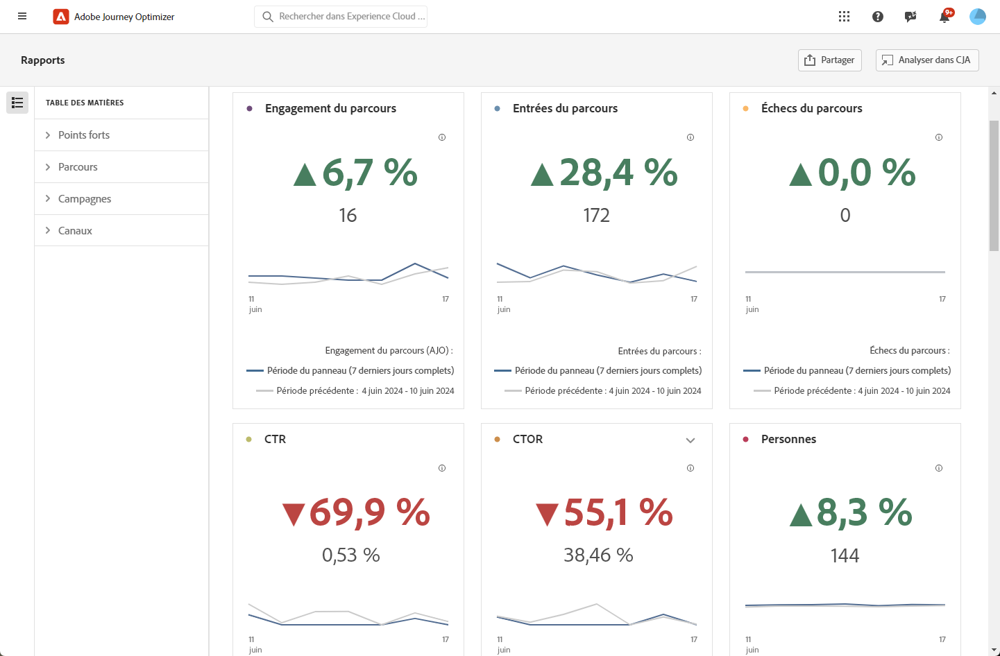

# Rapport Aperçu {#channel-report-cja}

Le rapport Aperçu offre aux utilisateurs un résumé complet des mesures de trafic et d’engagement pour toutes les campagnes et tous les parcours de votre environnement. Ces mesures sont combinées pour présenter des valeurs unifiées pour les actions provenant de différents canaux, englobant diverses campagnes et différents parcours.

Vous pouvez accéder au rapport Aperçu en accédant à la **Rapports** dans le **Gestion des parcours** .

La page Rapport s’affiche avec les onglets suivants :

* [Parcours](#journey)
* [Campagnes](#campaign)
* [Canaux](#channel)

Pour en savoir plus sur Customer Journey Analytics Workspace et sur le filtrage et l’analyse des données, reportez-vous à la section [cette page](https://experienceleague.adobe.com/en/docs/analytics-platform/using/cja-workspace/home).

## Tons clairs {#highlights}

La variable **[!UICONTROL Tons clairs]** Les indicateurs de performance clés constituent un tableau de bord complet, qui propose une ventilation détaillée des mesures clés de toutes les campagnes et tous les parcours de votre environnement, ce qui vous permet d’évaluer rapidement les performances et d’identifier les domaines à améliorer.

+++ En savoir plus sur les mesures de surbrillance

* **[!UICONTROL Engagement parcours]**: nombre total d’individus ayant interagi avec les messages envoyés depuis le parcours.

* **[!UICONTROL Parcours]**: nombre total d’individus ayant atteint l’événement d’entrée du parcours.

* **[!UICONTROL Échecs du parcours]**: nombre total de parcours individuels n’ayant pas été exécutés avec succès.

* **[!UICONTROL Taux de clics publicitaires]**: pourcentage de clics dans vos messages.

* **[!UICONTROL Taux d’ouverture des clics publicitaires (CTOR)]**: nombre d’ouvertures du message.

* **[!UICONTROL Personnes]**: nombre de profils utilisateur qui remplissent les critères de ciblage pour vos messages.

* **[!UICONTROL Clics]**: nombre de clics sur un contenu dans vos messages.

* **[!UICONTROL Plaintes contre le spam]** : nombre de fois où un message a été déclaré comme spam ou courrier indésirable.

* **[!UICONTROL Désabonnements]** : nombre de clics sur le lien de désabonnement.

+++

## Parcours {#journey}

La variable **[!UICONTROL Parcours]** Le tableau de bord constitue un tableau de bord complet qui fournit une analyse des mesures clés liées à votre parcours. Il comprend des détails tels que le nombre de profils entrés et les cas de parcours individuels ayant échoué, ce qui vous permet de comprendre de manière approfondie l’efficacité et les niveaux d’engagement de votre parcours.

En cliquant sur le nom d’un parcours répertorié dans ce tableau, vous pouvez facilement explorer chaque parcours individuellement, en accédant immédiatement à son rapport complet dans un nouvel onglet.

+++ En savoir plus sur les mesures de Parcours

* **[!UICONTROL Parcours]**: nombre total d’individus ayant atteint l’événement d’entrée du parcours.

* **[!UICONTROL Sorties de parcours]**: nombre total d’individus ayant quitté le parcours.

* **[!UICONTROL Échecs du parcours]**: nombre total de parcours individuels n’ayant pas été exécutés avec succès.

+++

## Campagnes {#campaign}

La variable **[!UICONTROL Campagne]** le tableau fonctionne comme un tableau de bord global, qui présente un aperçu détaillé des mesures essentielles de votre campagne. Il contient des données essentielles telles que le nombre de profils et d’envois, ce qui vous donne un aperçu complet des performances et des niveaux d’engagement de votre campagne.

En cliquant sur le nom d&#39;une opération répertoriée dans ce tableau, vous pouvez facilement explorer chaque opération individuellement, en accédant immédiatement à son rapport complet dans un nouvel onglet.

+++ En savoir plus sur les mesures de Campaign

* **[!UICONTROL Personnes]**: nombre de profils utilisateur qui remplissent les critères de ciblage pour vos messages.

* **[!UICONTROL Envois]**: Nombre total d&#39;envois pour chaque campagne.

* **[!UICONTROL Affichages]**: nombre d’ouvertures du message.

* **[!UICONTROL Clics]**: nombre de clics sur un contenu dans vos messages.

+++

## Canaux {#channel}

### Canaux

La variable **[!UICONTROL Canaux]** Le tableau fournit une ventilation détaillée de l’engagement de vos profils avec vos messages au niveau du canal. Cela vous permet d’obtenir des informations plus approfondies sur les performances de différents canaux.

+++ En savoir plus sur les mesures Canaux

* **[!UICONTROL Personnes]**: nombre de profils utilisateur qui remplissent les critères de ciblage pour vos messages.

* **[!UICONTROL Taux de clics publicitaires]**: pourcentage de clics dans vos messages.

* **[!UICONTROL Envois]**: Nombre total d&#39;envois pour chaque campagne.

* **[!UICONTROL Affichages]**: nombre d’ouvertures du message.

* **[!UICONTROL Clics]**: nombre de clics sur un contenu dans vos messages.

+++

### Erreur sortante

La variable **[!UICONTROL Erreur sortante]** vous permet de repérer précisément les erreurs qui se sont produites tout au long du processus d’envoi, ce qui vous permet de comprendre facilement les problèmes rencontrés.

### Exclusions sortantes

La variable **[!UICONTROL Exclusions sortantes]** tableau présentant une vue d’ensemble des différents facteurs qui ont entraîné l’exclusion des profils utilisateur de l’audience ciblée, ce qui a pour conséquence que le message n’a pas été reçu.
