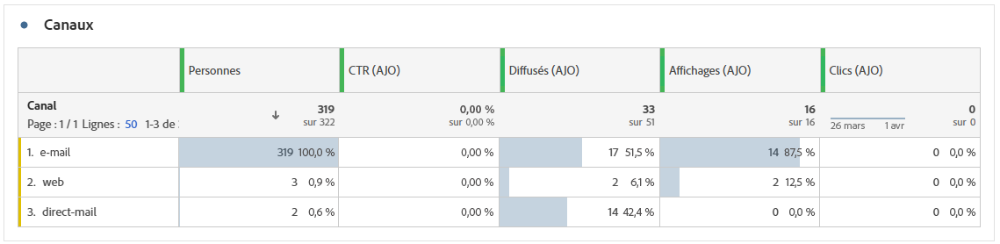

# Rapport d’aperçu {#channel-report-cja}

Les utilisateurs et les utilisatrices peuvent consulter un résumé exhaustif des mesures de trafic et d’engagement pour l’ensemble des campagnes et des parcours de votre environnement grâce au rapport de vue d’ensemble. Les actions provenant de différents canaux sont combinées dans ces mesures pour présenter des valeurs unifiées, englobant diverses campagnes et différents parcours.

Vous pouvez accéder au rapport de vue d’ensemble en accédant au menu **Rapports** dans la section **Gestion des parcours**.

La page Rapport s’affiche avec les onglets suivants :

* [Parcours](#journey)
* [Campagnes](#campaign)
* [Canaux](#channel)
* [Jeux de règles](#rule-sets)

Pour en savoir plus sur Customer Journey Analytics Workspace, sur le filtrage et l’analyse des données, consultez [cette page](https://experienceleague.adobe.com/fr/docs/analytics-platform/using/cja-workspace/home).

## Faits saillants {#highlights}

Les indicateurs clés de performance **[!UICONTROL Faits saillants]** constituent un tableau de bord complet, qui propose une répartition détaillée des mesures clés de toutes les campagnes et de tous les parcours de votre environnement, ce qui vous permet d’évaluer rapidement les performances et d’identifier les domaines à améliorer.

+++ En savoir plus sur les mesures de faits saillants

* **[!UICONTROL Engagement du parcours]** : nombre total de personnes uniques ayant reçu des messages envoyés depuis le parcours et représentant des profils distincts ayant atteint un point d’action désigné dans le parcours.

* **[!UICONTROL Entrées du parcours]** : nombre total de personnes ayant atteint l’événement d’entrée du parcours.

* **[!UICONTROL Échecs de parcours]** : nombre total de parcours individuels qui n’ont pas été exécutés avec succès.

* **[!UICONTROL Taux de clics]** : pourcentage de clics dans vos messages.

* **[!UICONTROL Taux d’ouverture par clic (CTOR)]** : nombre de fois où le message a été ouvert.

* **[!UICONTROL Personnes]** : nombre de profils d’utilisateurs et d’utilisatrices qui sont qualifiés en tant que profils cibles pour vos messages.

* **[!UICONTROL Clics]** : nombre de clics sur un contenu de vos messages.

* **[!UICONTROL Plaintes relatives aux spams]** : nombre de fois où un message a été déclaré comme spam ou courrier indésirable.

* **[!UICONTROL Désabonnements]** : nombre de clics sur le lien de désabonnement.

+++

## Parcours {#journey}

Le tableau **[!UICONTROL Parcours]** constitue un tableau de bord complet qui fournit une analyse des mesures clés liées à votre parcours. Il contient des informations telles que le nombre de profils enregistrés et les cas de parcours individuels en échec, ce qui vous permet de mieux comprendre l’efficacité et les niveaux d’engagement de votre parcours.

En cliquant sur le nom d’un parcours répertorié dans ce tableau, vous pouvez facilement explorer chaque parcours individuellement et accéder immédiatement à son rapport complet dans un nouvel onglet.

+++ En savoir plus sur les mesures de parcours

* **[!UICONTROL Entrées du parcours]** : nombre total de personnes ayant atteint l’événement d’entrée du parcours.

* **[!UICONTROL Sorties du parcours]** : nombre total de personnes ayant quitté le parcours.

* **[!UICONTROL Échecs de parcours]** : nombre total de parcours individuels qui n’ont pas été exécutés avec succès.

+++

## Campagnes {#campaign}

Le tableau **[!UICONTROL Campagne]** fonctionne comme un tableau de bord complet, présentant une vue d’ensemble détaillée des mesures critiques de votre campagne. Il contient des données essentielles telles que le nombre de profils et d’envois, ce qui vous donne des indications très précises sur les performances et les niveaux d’engagement de votre campagne.

En cliquant sur le nom d’une campagne dans ce tableau, vous pouvez examiner chaque opération de manière individuelle et ouvrir instantanément son rapport complet dans un nouvel onglet.

+++ En savoir plus sur les mesures de campagne

* **[!UICONTROL Personnes]** : nombre de profils d’utilisateurs et d’utilisatrices qui sont qualifiés en tant que profils cibles pour vos messages.

* **[!UICONTROL Taux de clics (CTR)]** : pourcentage de clics dans vos messages.

* **[!UICONTROL Envois]** : nombre total d’envois pour chaque campagne.

* **[!UICONTROL Diffusés]** : nombre de messages envoyés avec succès.

* **[!UICONTROL Affichages]** : nombre d’ouvertures du message.

* **[!UICONTROL Clics]** : nombre de clics sur un contenu de vos messages.

+++

## Canaux {#channel}

### Canaux

Le tableau **[!UICONTROL Canaux]** fournit une répartition détaillée de l’engagement de vos profils avec vos messages au niveau du canal. Cela vous permet d’obtenir des informations plus approfondies sur les performances de différents canaux.

+++ En savoir plus sur les mesures de canaux

* **[!UICONTROL Personnes]** : nombre de profils d’utilisateurs et d’utilisatrices qui sont qualifiés en tant que profils cibles pour vos messages.

* **[!UICONTROL Taux de clics (CTR)]** : pourcentage de clics dans vos messages.

* **[!UICONTROL Diffusés]** : nombre de messages envoyés avec succès.

* **[!UICONTROL Affichages]** : nombre d’ouvertures du message.

* **[!UICONTROL Clics]** : nombre de clics sur un contenu dans vos messages.

+++

### Erreurs sortantes

Le tableau **[!UICONTROL Erreurs sortantes]** vous permet d’identifier précisément les erreurs survenues durant le processus d’envoi, ce qui vous aide à comprendre facilement les problèmes rencontrés.

### Exclusions sortantes

Le tableau **[!UICONTROL Exclusions sortantes]** présente une vue d’ensemble complète des différents facteurs qui ont abouti à l’exclusion des profils d’utilisateurs et d’utilisatrices de l’audience ciblée, entraînant la non-réception du message.

## Limitation du parcours et conflits {#rule-sets}

Le tableau **[!UICONTROL Limitation et conflits de Parcours]** fournit des informations sur les performances des jeux de règles d&#39;arbitrage de parcours, affichant les entrées et exclusions de parcours en fonction des règles de limitation et des scores de priorité appliqués à vos parcours.

+++ En savoir plus sur les mesures des ensembles de règles

La colonne **[!UICONTROL Entrées de Parcours par jeu de règles]** indique le nombre de profils entrés dans le parcours. Il existe trois types d&#39;entrées :

* ****[!UICONTROL Aucun conflit]**** : le profil est entré dans le parcours sans conflit d’ensemble de règles. Aucun jeu de règles actif n&#39;a empêché cette saisie, et la saisie de parcours s&#39;est produite indépendamment des règles d&#39;arbitrage.

* **Priorité plus élevée** : le profil est entré sur le parcours en raison de sa priorité plus élevée que les autres parcours concurrents. Malgré un conflit (le profil était qualifié pour plusieurs parcours), ce parcours a été sélectionné en raison de son score de priorité plus élevé.

* **Non appliqué** : le profil est entré dans le parcours, mais l’ensemble de règles n’était pas actif ou n’était pas appliqué à cette entrée de parcours au moment de l’entrée.

La colonne **[!UICONTROL Exclusions]** indique le nombre de profils qui ont été exclus de l’entrée dans le parcours. Les profils peuvent être exclus pour deux raisons :

* **Limitation atteinte** : le profil a atteint le nombre maximal d’entrées de parcours ou de parcours simultanés autorisé par la règle de limitation.

* **Priorité inférieure** : le plafond n’a pas été atteint, mais d’autres parcours de priorité supérieure respectent les contraintes. Le profil a été exclu de ce parcours et est entré dans un parcours de priorité supérieure à la place.

+++

➡️ [En savoir plus sur la limitation et l’arbitrage des parcours ](../conflict-prioritization/journey-capping.md)