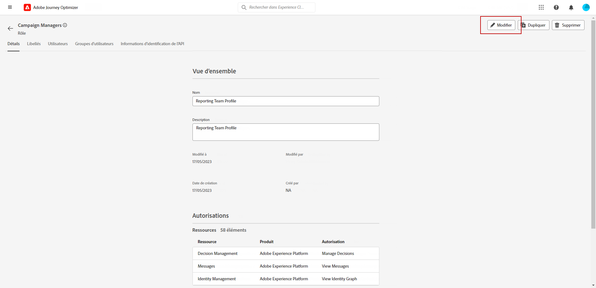
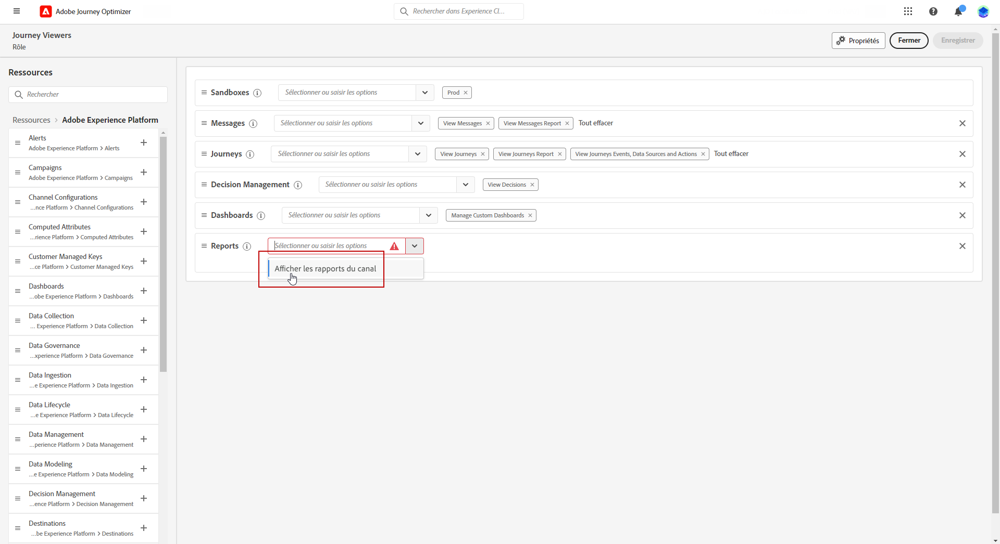

# Prise en main des rapports sur les canaux {#channel-report-gs}

>[!AVAILABILITY]
>
>L’expérience actuelle de création de rapports sera abandonnée à compter de janvier 2025. À partir de cette date, la nouvelle expérience de création de rapports deviendra la norme. Nous vous recommandons de vous familiariser avec les nouvelles fonctionnalités pour garantir une transition fluide. [Commencez avec la nouvelle interface de création de rapports de Journey Optimizer.](report-gs-cja.md)

Les rapports sur les canaux constituent un puissant outil qui propose un aperçu complet des mesures de trafic et d’engagement dans un rapport unifié pour chaque canal, englobant toutes les actions de tous les parcours et toutes les campagnes. Ils sont divisés en différents widgets, chacun d’eux fournissant une vue spécifique des performances de votre campagne ou de votre parcours.

Les rapports sur les canaux sont entièrement personnalisables. Vous pouvez donc redimensionner ou supprimer des widgets pour créer un tableau de bord qui réponde à vos besoins spécifiques. Vous pouvez également exporter les données du rapport au format PDF ou CSV pour une analyse plus approfondie.

En savoir plus sur les différents widgets et les différentes mesures disponibles pour les rapports sur les canaux sur <!--[this page](channel-report.md)-->.

## Avant de commencer {#manage-reports-prereq}

Avant de commencer, vérifiez que vous avez accès au menu **[!UICONTROL Rapports]**.

Si vous ne voyez pas le menu **[!UICONTROL Rapports]**, vos droits d’accès doivent être étendus pour inclure l’autorisation **[!UICONTROL Afficher les rapports sur les canaux]**. Vous pouvez étendre vos propres autorisations si vous avez accès aux [autorisations](https://experienceleague.adobe.com/docs/experience-platform/access-control/home.html?lang=fr){target="_blank"} Adobe Experience Platform pour votre organisation. Si ce n’est pas le cas, contactez votre administrateur ou administratrice Adobe Journey Optimizer.

+++Découvrez comment attribuer une autorisation de rapport.

Notez que cette autorisation est incluse dans les **[!UICONTROL Rôles]** intégrés suivants : gestionnaire de campagnes, approbateur et approbatrice de campagnes, observateur et observatrice de campagnes et administrateur et administratrice de campagnes.

Pour attribuer l’autorisation correspondante à votre **[!UICONTROL rôle]** :

1. Dans le produit [!DNL Permissions], accédez au menu **[!UICONTROL Rôles]** et sélectionnez le rôle que vous souhaitez mettre à jour avec la nouvelle autorisation **[!UICONTROL Afficher les rapports sur les canaux]**.

1. À partir du tableau de bord **[!UICONTROL Rôle]**, cliquez sur **[!UICONTROL Modifier]**.

   

1. Faites glisser et déposez la ressource **[!UICONTROL Rapports]** pour attribuer une autorisation.

   Dans le menu déroulant des ressources du **[!UICONTROL Rapport]**, sélectionnez l’autorisation **[!UICONTROL Afficher les rapports sur les canaux]**.

   

1. Cliquez sur **[!UICONTROL Enregistrer]**.

Les utilisateurs et utilisatrices affectés à ce **[!UICONTROL rôle]** peuvent désormais accéder au menu **[!UICONTROL Rapports]**.

+++

## Gérer le tableau de bord de votre rapport {#manage-reports}

Pour accéder aux rapports sur les canaux et les gérer, procédez comme suit :

1. Accédez au menu **[!UICONTROL Rapports]** dans la section **[!UICONTROL Gestion des parcours]**.

   

1. Dans votre tableau de bord, sélectionnez une heure de **début** et une heure de **[!UICONTROL fin]** pour cibler des données spécifiques.

1. Dans le menu déroulant **[!UICONTROL Action de]**, choisissez si vous souhaitez cibler des campagnes, des parcours ou les deux.

   

1. Cliquez sur **[!UICONTROL Modifier]** pour redimensionner ou supprimer des widgets afin de créer un tableau de bord qui réponde à vos besoins spécifiques.

   

1. Une fois satisfait de l&#39;ordre d&#39;affichage et de la taille de vos widgets, cliquez sur **[!UICONTROL Enregistrer]**.

1. Selon le widget, vous pouvez choisir de basculer d’un tableau, d’un graphique en barres ou d’un anneau à l’autre.

1. Cliquez sur l’icône de pourcentage pour afficher vos données sous forme de taux.

   

## Exporter vos rapports {#export-reports}

Vous pouvez facilement exporter vos différents rapports au format PDF ou CSV, ce qui vous permet de les partager, de les manipuler ou de les imprimer. Les onglets suivants décrivent les étapes détaillées pour exporter les rapports sur les canaux :

>[!BEGINTABS]

>[!TAB Exporter votre rapport au format PDF]

1. Dans votre rapport, cliquez sur **[!UICONTROL Exporter]** et sélectionnez **[!UICONTROL Fichier PDF]**.

1. Dans la fenêtre Imprimer, configurez votre document selon vos besoins. Notez que les options peuvent varier en fonction de votre navigateur.

1. Choisissez d’imprimer ou d’enregistrer votre rapport en tant que PDF.

1. Localisez le dossier dans lequel vous souhaitez enregistrer votre fichier, renommez-le si nécessaire, puis cliquez sur Enregistrer.

Votre rapport peut maintenant être affiché ou partagé dans un fichier PDF.

>[!TAB Exporter votre rapport sous la forme d’un fichier CSV]

1. Dans votre rapport, cliquez sur **[!UICONTROL Exporter]** et sélectionnez **[!UICONTROL Fichier CSV]** pour générer un fichier CSV au niveau du rapport global.

1. Vous pouvez également choisir d’exporter des données à partir d’un widget spécifique. Cliquez sur **[!UICONTROL Exporter des données de widget au format CSV]** en regard du widget sélectionné.

1. Votre fichier est automatiquement téléchargé et peut se trouver dans vos fichiers locaux.

   Si vous avez généré le fichier au niveau du rapport, il contient des informations détaillées pour chaque widget, notamment son titre et ses données.

   Si vous avez généré le fichier au niveau du widget, il fournit spécifiquement des données pour le widget sélectionné.

>[!ENDTABS]
