# Rapports sur les canaux {#channel-report}

>[!CONTEXTUALHELP]
>id="ajo_channel_level_report"
>title="Rapport au niveau des canaux"
>abstract="Les rapports au niveau des canaux offrent une vue d’ensemble complète des mesures de trafic et d’engagement sur tous les canaux. Vos rapports sont composés de plusieurs widgets présentant le succès et les erreurs de votre campagne et de vos parcours. Vous pouvez modifier chaque tableau de bord de reporting en redimensionnant ou en supprimant des widgets."

>[!AVAILABILITY]
>
>L’expérience actuelle de création de rapports sera abandonnée à compter de la version d’octobre. À partir de cette date, la nouvelle expérience de création de rapports deviendra la norme. Nous vous recommandons de vous familiariser avec les nouvelles fonctionnalités pour garantir une transition fluide. [Commencez avec la nouvelle interface de création de rapports de Journey Optimizer.](report-gs-cja.md)

>[!IMPORTANT]
>
> Pour accéder au menu **Rapport**, vous devez disposer de l’autorisation **[!UICONTROL Afficher les rapports du canal]**. [En savoir plus](channel-report-gs.md#before-starting-manage-reports-prereq)

Les rapports au niveau des canaux offrent aux utilisateurs et aux utilisatrices une vue d’ensemble complète des mesures de trafic et d’engagement au niveau des canaux. Les mesures sont agrégées afin de présenter des valeurs consolidées pour les actions provenant du canal choisi, couvrant plusieurs campagnes et parcours.

Vous pouvez accéder aux rapports au niveau des canaux en accédant au menu **Rapports** dans la section **Gestion des parcours**. Il est entièrement personnalisable. Vous pouvez filtrer vos données en fonction de la date du rapport ou de l’action. [En savoir plus](channel-report-gs.md)

La page Rapport s’affiche avec les onglets suivants :

* [E-mail](#email)
* [Notifications push](#push)
* [SMS](#sms)
* [In-app](#inapp)
* [Web](#web)
* [Courrier](#direct-mail)

➡️ [Découvrez cette fonctionnalité en vidéo](#channel-report-video)

## E-mail {#email}

Dans les rapports au niveau des canaux, le menu E-mail présente les informations principales relatives aux e-mails envoyés dans vos campagnes et parcours. Les mesures sont détaillées ci-dessous.

### E-mail – Statistiques totales d’envoi {#email-total-sending}

>[!CONTEXTUALHELP]
>id="ajo_channel_email_sending_statistics"
>title="E-mail – Statistiques totales d’envoi"
>abstract="Les KPI E-mail – Statistiques totales d’envoi résument les données essentielles relatives à vos e-mails, telles que les messages ciblés ou livrés."

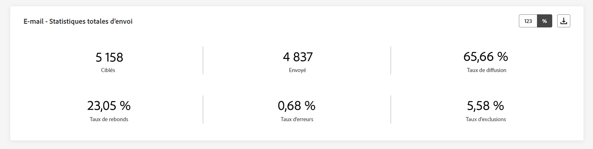

Le widget **[!UICONTROL Statistiques totales d’envoi des e-mails]** offre une vue d’ensemble complète des performances de vos e-mails, avec des indicateurs clés de performance (KPI) qui résument les données essentielles sur vos e-mails.

+++ En savoir plus sur les mesures Statistiques totales d’envoi des e-mails

* **[!UICONTROL Ciblés]** : nombre total d’e-mails traités.

* **[!UICONTROL Envoyés]** : nombre total d’e-mails envoyés.

* **[!UICONTROL Diffusés]** : nombre d’e-mails envoyés avec succès, par rapport au nombre total de messages envoyés.

* **[!UICONTROL Taux de diffusion]** : pourcentage d’e-mails envoyés avec succès.

* **[!UICONTROL Rebonds]** : nombre total d’erreurs cumulées lors du traitement automatique des retours par rapport au nombre total de messages envoyés.

* **[!UICONTROL Taux de rebond]** : pourcentage d’e-mails ayant rebondi par rapport aux e-mails envoyés.

* **[!UICONTROL Erreurs]** : nombre total d’erreurs survenues empêchant le SMS d’être envoyé à des profils.

* **[!UICONTROL Taux d’erreurs]** : pourcentage d’erreurs survenues empêchant l’envoi des e-mails, par rapport aux e-mails envoyés.

* **[!UICONTROL Exclus]** : nombre de profils qui ont été exclus par Adobe Journey Optimizer.

* **[!UICONTROL Exclus]** : pourcentage de profils qui ont été exclus par Adobe Journey Optimizer.

+++

### E-mail – Statistiques totales de tracking {#email-total-tracking}

>[!CONTEXTUALHELP]
>id="ajo_channel_email_tracking_statistics"
>title="E-mail – Statistiques totales de tracking"
>abstract="Les KPI E-mail - Statistiques totales de tracking fournissent des données sur l’activité de profil pour vos e-mails."

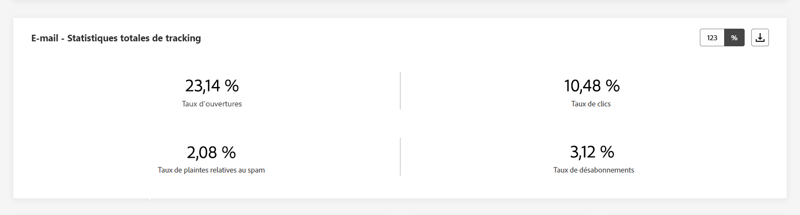

Le widget **[!UICONTROL Statistiques totales de tracking des e-mails]** offre un instantané détaillé de l’activité de profil liée à vos e-mails, fournissant des informations essentielles sur l’engagement et l’efficacité des e-mails.

+++ En savoir plus sur les mesures Statistiques totales de tracking des e-mails

* **[!UICONTROL Ouvertures]** : nombre de fois que le message a été ouvert.

* **[!UICONTROL Taux d’ouvertures]** : nombre total de messages ouverts par rapport au nombre de messages diffusés.

* **[!UICONTROL Clics]** : nombre de clics sur un contenu dans un message.

* **[!UICONTROL Taux de clics]** : pourcentage d’utilisateurs et d’utilisatrices ayant interagi avec l’e-mail.

* **[!UICONTROL Plaintes contre le spam]** : nombre de fois où un message a été déclaré comme spam ou courrier indésirable.

* **[!UICONTROL Taux de plaintes relatives aux spam]** : pourcentage de messages déclarés comme spam ou courrier indésirable par rapport au nombre d’e-mails envoyés.

* **[!UICONTROL Désabonnements]** : nombre de clics sur le lien de désabonnement.

* **[!UICONTROL Taux de désabonnement]** : pourcentage de désinscription par rapport au nombre d’e-mails envoyés.

+++

### E-mail – Statistiques d’envoi dans le temps {#email-sending-statistics-overtime}

>[!CONTEXTUALHELP]
>id="ajo_channel_email_sending_statistics_overtime"
>title="E-mail – Statistiques d’envoi dans le temps"
>abstract="Le graphique E-mail - Statistiques d’envoi dans le temps présente des données concernant les e-mails envoyés, ventilées par heure, jour, semaine ou mois."

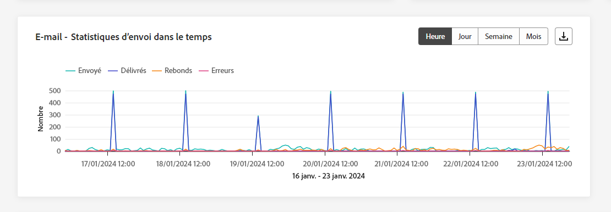

Le graphe **[!UICONTROL E-mail – Statistiques d’envoi dans le temps]** offre une représentation dynamique, affichant une analyse de l’activité de vos e-mails. Cette représentation graphique fournit une ventilation complète des e-mails envoyés, ce qui vous permet d’observer les tendances et les comportements à l’échelle horaire, quotidienne, hebdomadaire ou mensuelle.

+++ En savoir plus sur les mesures E-mails – Statistiques d’envoi dans le temps

* **[!UICONTROL Envoyés]** : nombre total d’e-mails envoyés.

* **[!UICONTROL Diffusés]** : nombre d’e-mails envoyés avec succès, par rapport au nombre total d’e-mails envoyés.

* **[!UICONTROL Rebonds]** : nombre total d&#39;erreurs cumulées lors du traitement automatique des retours par rapport au nombre total d’e-mails envoyés.

* **[!UICONTROL Erreurs]** : nombre total d’erreurs survenues empêchant l’e-mail d’être envoyé à des profils.

+++

### E-mail – Statistiques de tracking dans le temps {#email-tracking-statistics-overtime}

>[!CONTEXTUALHELP]
>id="ajo_channel_email_tracking_statistics_overtime"
>title="E-mail – Statistiques de tracking dans le temps"
>abstract="Le graphique E-mail - Statistiques de tracking dans le temps fournit des données sur l’activité de profil de vos e-mails, ventilées par heure, jour, semaine ou mois."

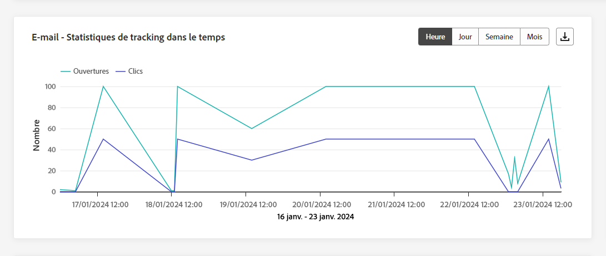

Le graphe **[!UICONTROL E-mail – Statistiques de tracking dans le temps]** présente une vue d’ensemble détaillée de l’activité de profil liée à vos e-mails. Cette représentation graphique ventile les données sur une base horaire, quotidienne, hebdomadaire ou mensuelle, offrant de précieuses informations sur l’évolution de l’engagement des personnes destinataires à différents intervalles de temps.

+++ En savoir plus sur les mesures E-mail – Statistiques de tracking dans le temps

* **[!UICONTROL Ouvertures]** : nombre d’ouvertures du message.

* **[!UICONTROL Clics]** : nombre de clics sur un contenu dans un message.

+++

### E-mail – Catégories et raisons de rebond {#bounce-categories}

>[!CONTEXTUALHELP]
>id="ajo_channel_email_bounce_categories"
>title="Catégories de rebond"
>abstract="Le tableau et les graphiques Catégories de rebond fournissent des données sur les erreurs temporaires et permanentes."

>[!CONTEXTUALHELP]
>id="ajo_channel_email_bounce_reasons"
>title="Raisons de rebond"
>abstract="Les graphiques et le tableau Causes de rebonds contiennent les données disponibles sur les messages ayant fait l’objet d’un rebond."

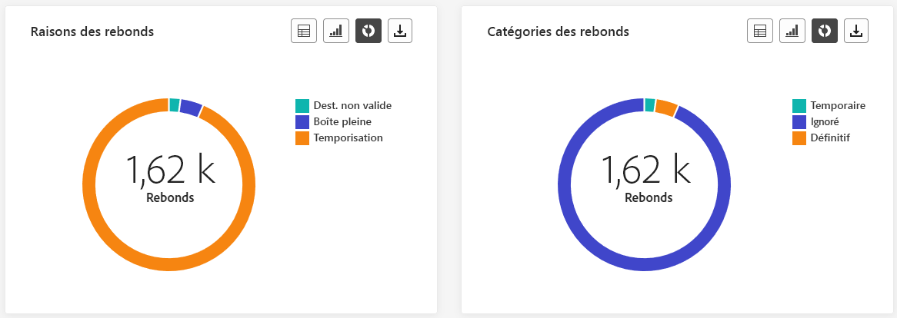

Les widgets **[!UICONTROL Catégories de rebond]** et **[!UICONTROL Raisons de rebond]** encapsulent les données associées aux messages ayant fait l’objet d’un rebond, fournissant une vue d’ensemble complète des différentes catégories et des causes spécifiques sous-jacentes aux messages ayant fait l’objet d’un rebond.

Pour plus d’informations sur les rebonds, consultez la page [Liste de suppression](../reports/suppression-list.md).

+++ En savoir plus sur les mesures Catégories de rebond

* **[!UICONTROL Rebond définitif]** : nombre total d’erreurs permanentes, telles qu’une adresse e-mail incorrecte. Un message d&#39;erreur indique explicitement que l&#39;adresse n&#39;est pas valide, comme Utilisateur inconnu.

* **[!UICONTROL Rebond temporaire]** : nombre total d’erreurs temporaires, telles qu’une boîte de réception pleine.

* **[!UICONTROL Ignorées]** : nombre total d&#39;erreurs temporaires (par exemple, Absent(e) du bureau) ou techniques (par exemple, si le type d&#39;expéditeur est administrateur).

+++

### Causes d’erreur {#error-reasons}

>[!CONTEXTUALHELP]
>id="ajo_channel_email_error_reasons"
>title="Causes d’erreur"
>abstract="Les graphiques et le tableau Causes d’erreur vous permettent d’identifier les erreurs spécifiques qui se sont produites au cours du processus d’envoi."

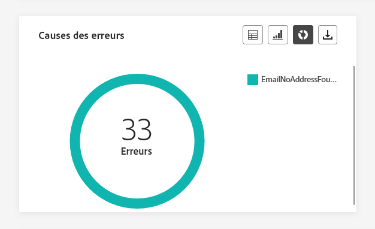

Les graphes et le tableau **[!UICONTROL Causes d’erreur]** vous permettent d’identifier précisément les erreurs qui se sont produites tout au long du processus d’envoi, ce qui vous permet de comprendre facilement les problèmes rencontrés.

### Causes d’exclusion {#excluded-reasons}

>[!CONTEXTUALHELP]
>id="ajo_channel_email_excluded_reasons"
>title="Causes d’exclusion"
>abstract="Les graphiques et le tableau Causes d’exclusion illustrent les différents facteurs qui ont conduit à ce que des profils de personnes, exclus de l’audience ciblée, ne reçoivent pas le message."

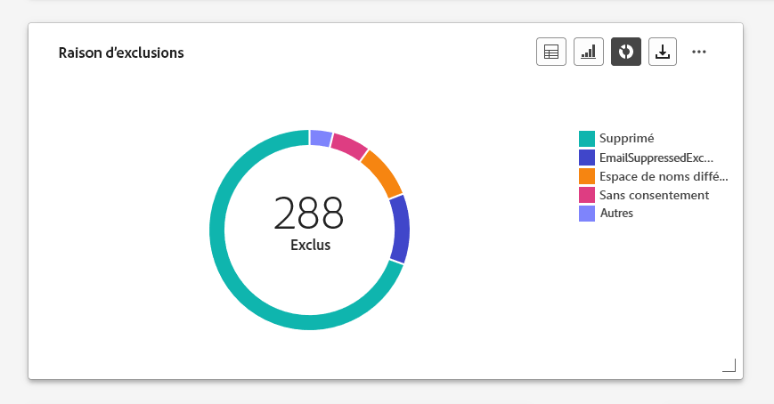

Les graphes et le tableau **[!UICONTROL Causes d’exclusion]** présentent une vue d’ensemble complète des différents facteurs qui ont abouti à l’exclusion des profils de personnes de l’audience ciblée, ayant pour effet que le message n’a pas été reçu.

Consultez [cette page](exclusion-list.md) pour la liste complète des causes d’exclusion.

### Envoyés et diffusés par domaines {#sent-delivered-domains}

>[!CONTEXTUALHELP]
>id="ajo_channel_email_sending_delivered_domains"
>title="Envoyés et diffusés par domaines"
>abstract="Le tableau et le graphique Envoyés et diffusés par domaines représentent la répartition au niveau du domaine de toutes les données importantes relatives à l’envoi d’e-mails."

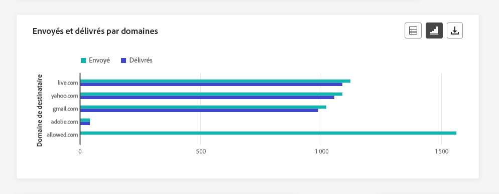

Le tableau et le graphe **[!UICONTROL Envoyés et diffusés par domaines]** fournissent une ventilation détaillée des diffusions d’e-mails au niveau du domaine, offrant des informations complètes sur les performances de vos e-mails.

+++ En savoir plus sur les mesures Envoyés et diffusés par domaines

* **[!UICONTROL Envoyés]** : nombre total d’e-mails envoyés.

* **[!UICONTROL Diffusés]** : nombre de messages envoyés avec succès, par rapport au nombre total de messages envoyés.

+++

### Rebonds et erreurs par domaine {#bounces-errors-domains}

>[!CONTEXTUALHELP]
>id="ajo_channel_email_bounces_errors_domains"
>title="Rebonds et erreurs par domaine"
>abstract="Le graphique et le tableau Rebonds et erreurs par domaines représentent la répartition au niveau du domaine des erreurs spécifiques survenues au cours du processus d’envoi."

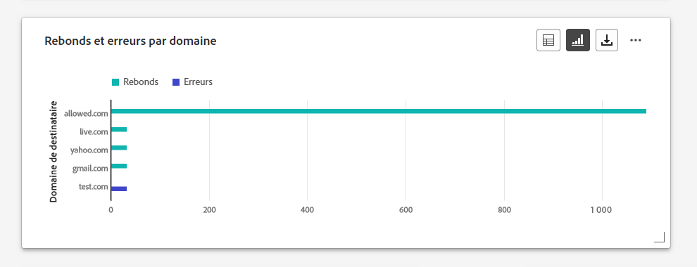

Le graphe et le tableau **[!UICONTROL Rebonds et erreurs par domaine]** fournissent une répartition au niveau du domaine des erreurs spécifiques rencontrées lors du processus d’envoi, offrant une analyse détaillée des problèmes qui se sont produits.

+++ En savoir plus sur les mesures Rebonds et erreurs par domaine

* **[!UICONTROL Rebonds]** : nombre total d’erreurs cumulées lors de la procédure d’envoi et du traitement automatique des retours par rapport au nombre total de messages envoyés.

* **[!UICONTROL Erreurs]** : nombre total d’erreurs survenues au cours de la procédure d’envoi, empêchant le message d’être envoyé à des profils.

+++

### Ouvertures et clics par domaines {#open-clicks-domains}

>[!CONTEXTUALHELP]
>id="ajo_channel_email_open_clicks_domains"
>title="Ouvertures et clics par domaines"
>abstract="Le tableau et le graphique Ouvertures et clics par domaines représentent la répartition au niveau du domaine de l’engagement de vos visiteurs et visiteuses avec votre e-mail."

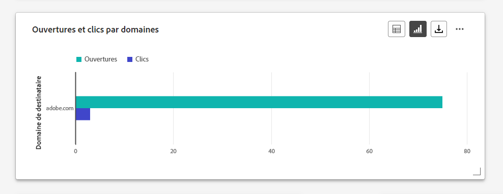

Le graphe et le tableau **[!UICONTROL Ouvertures et clics par domaines]** présentent une répartition au niveau du domaine de l’engagement de vos visiteurs et visiteuses avec votre e-mail, fournissant des informations précieuses sur la manière dont les différents domaines interagissent avec votre contenu.

+++ En savoir plus sur la mesure Ouverture et clics par domaines

* **[!UICONTROL Ouvertures]** : nombre de fois où l’e-mail a été ouvert.

* **[!UICONTROL Clics]** : nombre de fois où un contenu a fait l’objet d’un clic dans un e-mail.

+++

### Raisons de rebond par domaine {#bounce-reasons-domains}

>[!CONTEXTUALHELP]
>id="ajo_channel_email_bounce_reasons_domains"
>title="Raisons de rebond par domaine"
>abstract="Le graphique et le tableau Raisons de rebond par domaine représentent la répartition au niveau du domaine des données sur les erreurs temporaires et permanentes."

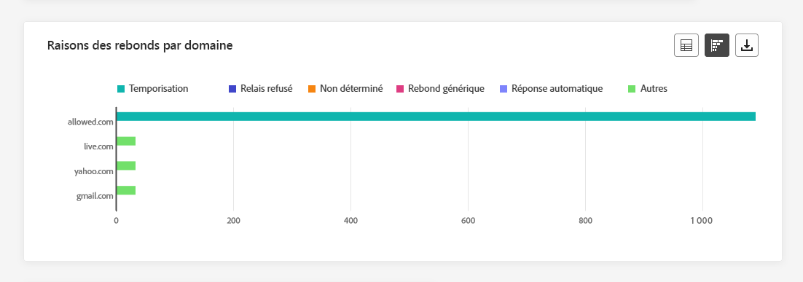

Le graphe et le tableau **[!UICONTROL Raisons de rebond par domaine]** fournissent une répartition au niveau du domaine des données concernant les erreurs temporaires et permanentes, offrant des informations détaillées sur les raisons des messages ayant fait l’objet d’un rebond.

Pour plus d’informations sur les rebonds, consultez la page [Liste de suppression](../reports/suppression-list.md).

## Notification push {#push}

Dans les rapports sur les canaux, le menu **Notification push** présente les informations principales relatives aux notifications push envoyées dans vos campagnes et parcours. Les mesures sont présentées ci-dessous.

### Notifications push – Statistiques d’envoi totales {#push-total-sending}

>[!CONTEXTUALHELP]
>id="ajo_channel_push_sending_statistics"
>title="Notifications push – Statistiques d’envoi totales"
>abstract="Les KPI Notifications push - Statistiques totales d’envoi résument les données essentielles sur vos notifications push, telles que Ciblés ou Diffusés."

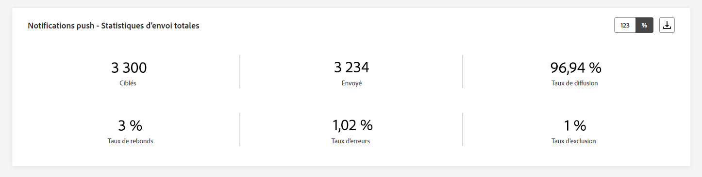

Les KPI **[!UICONTROL Notifications push – Statistiques d’envoi totales]** constituent un résumé complet qui contient les données essentielles liées à vos notifications push. Ces mesures comprennent des informations détaillées sur l’audience ciblée et le statut réel de la diffusion, ce qui vous permet d’avoir une vue exhaustive de l’efficacité et de la portée de vos notifications push.

+++ En savoir plus sur les mesures Notifications push – Statistiques d’envoi totales

* **[!UICONTROL Ciblées]** : nombre total de notifications push traitées.

* **[!UICONTROL Envoyées]** : nombre total de notifications push envoyées.

* **[!UICONTROL Délivrées]** : nombre de notifications push envoyées avec succès, par rapport au nombre total de notifications push envoyées.

* **[!UICONTROL Taux de diffusion]** : pourcentage de notifications push envoyées avec succès.

* **[!UICONTROL Rebonds]** : nombre total d&#39;erreurs cumulées lors du traitement automatique des retours par rapport au nombre total de messages envoyés.

* **[!UICONTROL Taux de rebond]** : pourcentage de notifications push ayant rebondi par rapport aux notifications push envoyées.

* **[!UICONTROL Erreurs]** : nombre total d’erreurs survenues empêchant l’e-mail d’être envoyé à des profils.

* **[!UICONTROL Taux d’erreurs]** : pourcentage d’erreurs survenues empêchant l’envoi, par rapport aux notifications push envoyées.

* **[!UICONTROL Exclus]** : nombre de profils qui ont été exclus par Adobe Journey Optimizer.

* **[!UICONTROL Exclus]** : pourcentage de profils qui ont été exclus par Adobe Journey Optimizer.

+++

### Notifications push – Statistiques totales de tracking {#push-total-tracking}

>[!CONTEXTUALHELP]
>id="ajo_channel_push_tracking_statistics"
>title="Notifications push – Statistiques totales de tracking"
>abstract="Les Notification push - Statistiques totales de tracking fournissent des données sur l’activité de profil pour vos notifications push."

Le widget **[!UICONTROL Notifications push – Statistiques totales de tracking]** offre un instantané détaillé de l’activité de profil liée à vos notifications push, fournissant des informations essentielles sur l’engagement et l’efficacité des notifications push.

+++ En savoir plus sur les mesures Notifications push – Statistiques totales de tracking

* **[!UICONTROL Ouvertures]** : nombre de fois qu’une notification push a été ouverte.

* **[!UICONTROL Taux d&#39;ouverture]** : pourcentage de notifications push ouvertes.

* **[!UICONTROL Actions]** : nombre total d&#39;actions sur la notification push diffusée, par exemple clic sur un bouton ou rejet.

* **[!UICONTROL Taux d&#39;action]** : pourcentage d’actions sur la notification push diffusée par rapport aux notifications push envoyées.

+++

### Notifications push – Statistiques d’envoi dans le temps {#push-sending-overtime}

>[!CONTEXTUALHELP]
>id="ajo_channel_push_sending_statistics_overtime"
>title="Notifications push – Statistiques d’envoi dans le temps"
>abstract="Le graphique Notification push - Statistiques d’envoi dans le temps présente des données concernant les notifications push envoyées, ventilées par heure, jour, semaine ou mois."

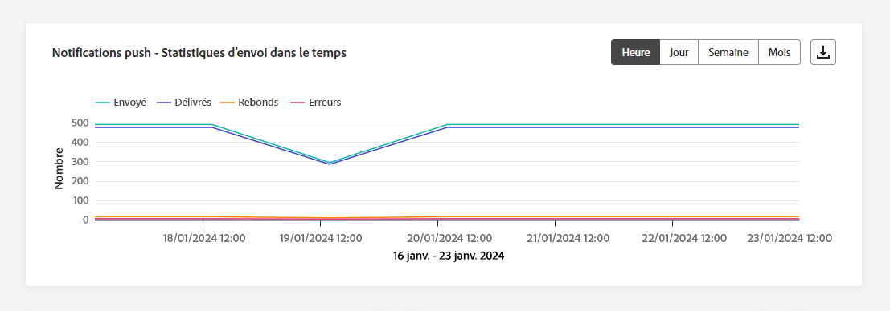

Le graphe **[!UICONTROL Notifications push – Statistiques d’envoi dans le temps]** offre une représentation dynamique, affichant une analyse de l’activité de vos notifications push. Cette représentation graphique fournit une ventilation complète des notifications push envoyées, ce qui vous permet d’observer les tendances et les comportements à l’échelle horaire, quotidienne, hebdomadaire ou mensuelle.

+++ En savoir plus sur les mesures Notifications push – Statistiques d’envoi dans le temps

* **[!UICONTROL Envoyées]** : nombre total de notifications push envoyées.

* **[!UICONTROL Délivrées]** : nombre de notifications push envoyées avec succès, par rapport au nombre total de notifications push envoyées.

* **[!UICONTROL Rebonds]** : nombre total d&#39;erreurs cumulées lors du traitement automatique des retours par rapport au nombre total de messages envoyés.

* **[!UICONTROL Erreurs]** : nombre total d’erreurs survenues empêchant l’e-mail d’être envoyé à des profils.

+++

### Notifications push – Statistiques de tracking dans le temps {#push-tracking-overtime}

>[!CONTEXTUALHELP]
>id="ajo_channel_push_tracking_statistics_overtime"
>title="Notifications push – Statistiques de tracking dans le temps"
>abstract="Le graphe Notifications push - Statistiques de tracking dans le temps fournit des données sur l’activité de profil de vos notifications push, ventilées par heure, jour, semaine ou mois."

Le graphe **[!UICONTROL Notifications push – Statistiques de tracking dans le temps]** fournit une vue d’ensemble détaillée de l’activité de profil liée à vos notifications push. Cette représentation graphique ventile les données sur une base horaire, quotidienne, hebdomadaire ou mensuelle, offrant de précieuses informations sur l’évolution de l’engagement des personnes destinataires à différents intervalles de temps.

+++ En savoir plus sur les mesures Notifications push – Statistiques de tracking dans le temps

* **[!UICONTROL Ouvertures]** : nombre de fois que votre notification push a été ouverte.

* **[!UICONTROL Actions]** : nombre total d’actions sur la notification push diffusée, par exemple clic sur un bouton ou rejet.

+++

### Notifications push – Causes d’exclusion {#push-excluded-reasons}

>[!CONTEXTUALHELP]
>id="ajo_channel_push_excluded_reasons"
>title="Causes d’exclusion"
>abstract="Les graphiques et le tableau Causes d’exclusion illustrent les différents facteurs qui ont conduit à ce que des profils de personnes, exclus de l’audience ciblée, ne reçoivent pas le message."

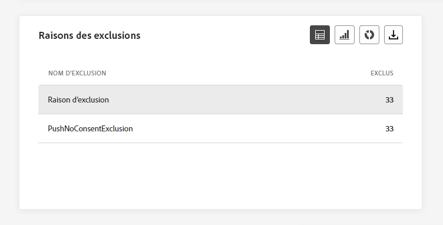

Le graphe et le tableau **[!UICONTROL Causes d’exclusion]** affichent les différentes causes qui ont empêché les profils de personnes, qui ont été exclus des profils ciblés, de recevoir vos notifications push.

Consultez [cette page](exclusion-list.md) pour la liste complète des causes d’exclusion.

### Notifications push – Causes d’erreur {#push-error-reasons}

>[!CONTEXTUALHELP]
>id="ajo_channel_push_error_reasons"
>title="Causes d’erreur"
>abstract="Les graphiques et le tableau Causes d’erreur vous permettent d’identifier les erreurs spécifiques qui se sont produites au cours du processus d’envoi."

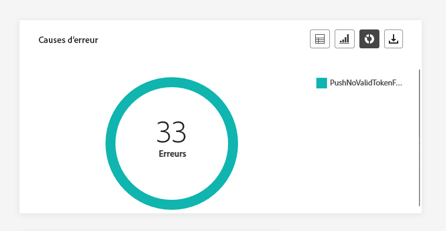

Les graphes et le tableau **[!UICONTROL Causes d’erreur]** vous permettent d’identifier les erreurs spécifiques qui se sont produites pendant le processus d’envoi de vos notifications push, en fournissant des informations détaillées sur les problèmes rencontrés en cours de route.

### Notifications push – Tracking par plateforme {#push-tracking-platform}

>[!CONTEXTUALHELP]
>id="ajo_channel_push_tracking_statistics_platform"
>title="Statistiques de tracking par plateforme"
>abstract="Le tableau et le graphique Statistiques de tracking par plateforme fournissent des données sur l’activité de profil pour vos notifications push en fonction du système opérationnel de votre profil."

Les graphes et les tableaux **[!UICONTROL Notifications push – Tracking par plateforme]** détaillent l’activité des personnes destinataires pour votre notification push en fonction du système d’exploitation de votre profil.

### Notifications push – Envoi par plateforme {#push-sending-platform}

>[!CONTEXTUALHELP]
>id="ajo_channel_push_sending_statistics_platform"
>title="Statistiques d’envoi par plateforme"
>abstract="Le tableau et le graphique Statistiques d’envoi par plateforme présente les données concernant les notifications push envoyées."

Le graphe et les tableaux **[!UICONTROL Notifications push – Envoi par plateforme]** fournissent une ventilation complète détaillant le succès de vos notifications push par rapport aux systèmes opérationnels de vos profils. Cette analyse approfondie offre des informations précieuses sur l’efficacité de vos notifications push sur différentes plateformes.

## SMS {#sms}

Dans les rapports sur les **canaux**, le menu SMS présente les informations principales relatives aux SMS envoyés dans vos campagnes et parcours. Les mesures sont détaillées ci-dessous.

### SMS – Statistiques totales d’envoi {#sms-sending-statistics}

>[!CONTEXTUALHELP]
>id="ajo_channel_sms_sending_statistics"
>title="SMS – Statistiques totales d’envoi"
>abstract="Les KPI SMS - Statistiques totales d’envoi résument les données essentielles relatives à vos SMS, telles que Ciblés ou Diffusés."

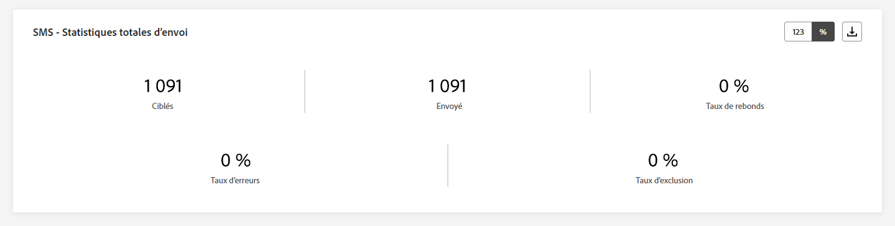

Les KPI **[!UICONTROL SMS – Statistiques totales d’envoi]** constituent un résumé complet qui encapsule les données essentielles liées à vos SMS. Ces mesures comprennent des informations détaillées sur l’audience ciblée et le statut réel de la diffusion, ce qui vous permet d’avoir une vue exhaustive de l’efficacité et de la portée de vos SMS.

+++ En savoir plus sur les mesures Notifications push – Statistiques d’envoi totales

* **[!UICONTROL Ciblés]** : nombre de profils utilisateur qui sont qualifiés en tant que profils cibles pour le canal SMS.

* **[!UICONTROL Envoyés]** : nombre total de SMS envoyés.

* **[!UICONTROL Délivrés]** : nombre de messages SMS envoyés avec succès, par rapport au nombre total de SMS envoyés.

* **[!UICONTROL Taux de diffusion]** : pourcentage de SMS envoyés avec succès.

* **[!UICONTROL Rebonds]** : nombre total d’erreurs cumulées lors du traitement automatique des retours par rapport au nombre total de SMS envoyés.

* **[!UICONTROL Taux de rebond]** : pourcentage de SMS qui ont fait l’objet d’un rebond par rapport au nombre de SMS envoyés.

* **[!UICONTROL Erreurs]** : nombre total d’erreurs survenues, l’empêchant d’être envoyé à des profils.

* **[!UICONTROL Taux d’erreurs]** : pourcentage d’erreurs survenues empêchant l’envoi, par rapport aux SMS envoyés.

* **[!UICONTROL Exclus]** : nombre de profils utilisateur, exclus des profils ciblés, qui n’ont pas reçu le message.

* **[!UICONTROL Taux d’exclusion]** : pourcentage de profils qui ont été exclus par Adobe Journey Optimizer.

+++

### SMS – Statistiques de tracking total {#sms-tracking-statistics}

>[!CONTEXTUALHELP]
>id="ajo_channel_sms_tracking_statistics"
>title="SMS – Statistiques de tracking total"
>abstract="Les statistiques totales de tracking des SMS fournissent des données sur l’activité de profil pour vos SMS."

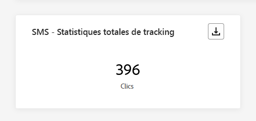

Le widget **[!UICONTROL SMS – Statistiques de tracking total]** fournit une vue d’ensemble détaillée des informations clés relatives à l’engagement de vos visiteurs et visiteuses vis-à-vis de vos URL, en vous offrant des informations sur l’efficacité de vos SMS :

* **[!UICONTROL Clics]** : nombre de clics sur un contenu dans un SMS.

### SMS – Statistiques d’envoi dans le temps {#sms-sending-statistics-overtime}

>[!CONTEXTUALHELP]
>id="ajo_channel_sms_sending_statistics_overtime"
>title="SMS – Statistiques d’envoi dans le temps"
>abstract="Le graphique SMS - Statistiques d’envoi dans le temps présente des données concernant les SMS envoyés, ventilées par heure, jour, semaine ou mois."

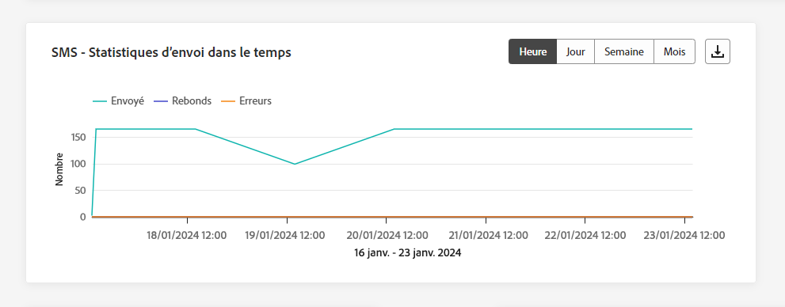

Le graphe **[!UICONTROL SMS – Statistiques d’envoi dans le temps]** présente une vue complète des SMS envoyés, dont les informations sont ventilées par heure, jour, semaine ou mois. Cette représentation graphique vous permet de suivre et d’analyser les tendances de votre activité de messagerie SMS sur différents intervalles de temps.

+++ En savoir plus sur les mesures SMS – Statistiques d’envoi dans le temps

* **[!UICONTROL Envoyés]** : nombre total de SMS envoyés.

* **[!UICONTROL Rebonds]** : nombre total d’erreurs cumulées lors du traitement automatique des retours par rapport au nombre total de SMS envoyés.

* **[!UICONTROL Erreurs]** : nombre total d’erreurs survenues, l’empêchant d’être envoyé à des profils.

+++

### SMS – Statistiques de tracking dans le temps {#sms-tracking-statistics-overtime}

>[!CONTEXTUALHELP]
>id="ajo_channel_sms_tracking_statistics_overtime"
>title="SMS – Statistiques de tracking dans le temps"
>abstract="Le graphique SMS - Statistiques de tracking dans le temps fournit des données sur l’activité de profil de vos SMS, ventilées par heure, jour, semaine ou mois."

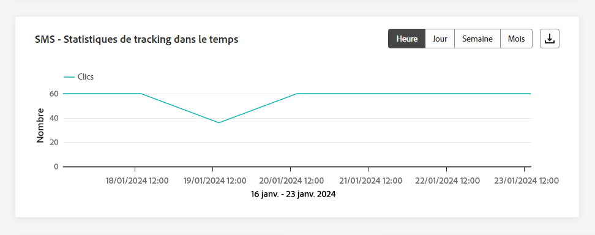

Le graphe **[!UICONTROL SMS – Statistiques de tracking dans le temps]** fournit des données sur l’activité de profil de vos SMS, avec une répartition détaillée par heure, jour, semaine ou mois. Cette représentation graphique vous permet d’analyser et de comprendre les schémas de l’interaction des clientes et clients selon différents intervalles de temps.

* **[!UICONTROL Clics]** : nombre de clics sur un contenu dans un SMS.

### Causes d’exclusion {#sms-excluded-reasons}

>[!CONTEXTUALHELP]
>id="ajo_channel_sms_excluded_reasons"
>title="Causes d’exclusion"
>abstract="Les graphiques et le tableau Causes d’exclusion illustrent les différents facteurs qui ont conduit à ce que des profils de personnes, exclus de l’audience ciblée, ne reçoivent pas le message."

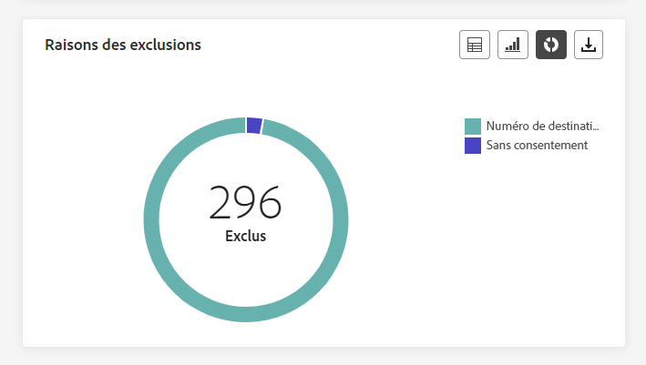

Les graphes et le tableau **[!UICONTROL Causes d’exclusion]** décrivent visuellement les différents facteurs qui ont conduit à l’exclusion des profils d’utilisateurs et d’utilisatrices de l’audience ciblée, ce qui les empêche de recevoir vos SMS.

Consultez [cette page](exclusion-list.md) pour obtenir la liste complète des causes d’exclusion.

### Raisons de rebond {#sms-bounce-reasons}

>[!CONTEXTUALHELP]
>id="ajo_channel_sms_bounce_reasons"
>title="Raisons de rebond"
>abstract="Les graphiques et le tableau Causes de rebonds contiennent les données disponibles sur les messages ayant fait l’objet d’un rebond."

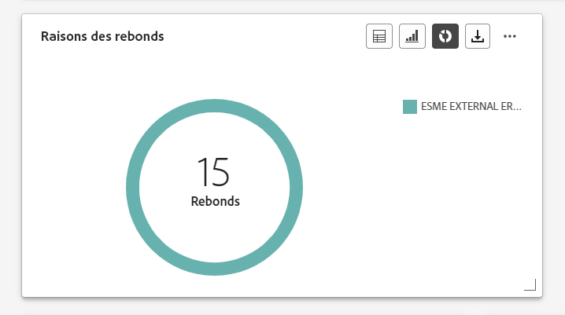

Les graphes et le tableau **[!UICONTROL Raisons de rebond]** fournissent une vue d’ensemble complète des données relatives aux SMS rebonds, fournissant des informations précieuses sur les raisons spécifiques à l’origine des rebonds des SMS.

### Causes d’erreur {#sms-error-reasons}

>[!CONTEXTUALHELP]
>id="ajo_channel_sms_error_reasons"
>title="Causes d’erreur"
>abstract="Les graphiques et le tableau Causes d’erreur vous permettent d’identifier les erreurs spécifiques qui se sont produites au cours du processus d’envoi."

Les graphes et le tableau **[!UICONTROL Causes d’erreur]** permettent d’identifier les erreurs spécifiques qui se sont produites pendant le processus d’envoi de vos SMS, ce qui facilite l’analyse approfondie d’éventuels problèmes rencontrés.

## Courrier {#direct-mail}

Dans les rapports au niveau des **canaux**, le menu **Courrier** présente les informations principales relatives aux messages de courrier envoyés dans vos **campagnes** et **parcours**. Les mesures sont détaillées ci-dessous.

### Courrier – Statistiques totales d’envoi {#direct-mail-total-sending}

>[!CONTEXTUALHELP]
>id="ajo_channel_direct_sending_statistics"
>title="Courrier – Statistiques totales d’envoi"
>abstract="Les KPI Courrier - Statistiques totales d’envoi résument les données essentielles relatives à votre courrier, telles que Ciblés ou Diffusés."

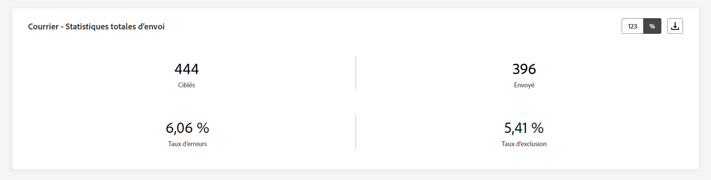

Le widget **[!UICONTROL Courrier – Statistiques totales d’envoi]** offre une vue d’ensemble complète des performances de vos messages de courrier, avec des indicateurs clés de performances (KPI) qui résument les données essentielles relatives à vos courriers.

+++ En savoir plus sur les mesures Courrier – Statistiques totales d’envoi

* **[!UICONTROL Ciblés]** : nombre de profils utilisateur qui sont qualifiés en tant que profils cibles pour les messages de courrier.

* **[!UICONTROL Envoyés]** : nombre total d’envois.

* **[!UICONTROL Erreurs]** : nombre total d’erreurs survenues empêchant l’e-mail d’être envoyé à des profils.

* **[!UICONTROL Taux d’erreurs]** : pourcentage d’erreurs survenues empêchant l’envoi de l’e-mail, par rapport aux notifications push envoyées.

* **[!UICONTROL Exclus]** : nombre de profils utilisateur, exclus des profils ciblés, qui n’ont pas reçu le message.

* **[!UICONTROL Taux d’exclusion]** : pourcentage de profils qui ont été exclus par Adobe Journey Optimizer.

+++

### Causes d’exclusion {#direct-mail-excluded-reasons}

>[!CONTEXTUALHELP]
>id="ajo_channel_direct_excluded_reasons"
>title="Causes d’exclusion"
>abstract="Les graphiques et le tableau Causes d’exclusion illustrent les différents facteurs qui ont conduit à ce que des profils de personnes, exclus de l’audience ciblée, ne reçoivent pas le message."

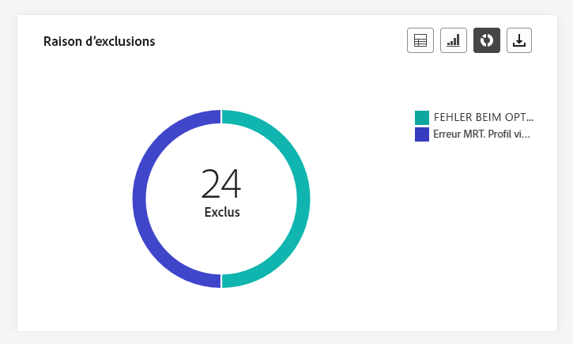

Les graphes et le tableau **[!UICONTROL Courrier – Causes d’exclusion]** illustrent visuellement les différents facteurs qui ont abouti à l’exclusion des profils de personnes de l’audience ciblée, ce qui les empêche de recevoir vos messages de courrier.

Consultez [cette page](exclusion-list.md) pour la liste complète des causes d’exclusion.

### Causes d’erreur {#direct-mail-error-reasons}

>[!CONTEXTUALHELP]
>id="ajo_channel_direct_error_reasons"
>title="Causes d’erreur"
>abstract="Les graphiques et le tableau Causes d’erreur vous permettent d’identifier les erreurs spécifiques qui se sont produites au cours du processus d’envoi."

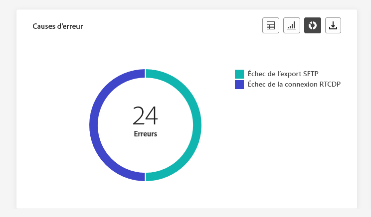

Les graphes et tableaux **[!UICONTROL Courrier – Causes d’erreur]** fournissent les moyens d’identifier les erreurs spécifiques qui se sont produites pendant le processus d’envoi de vos messages de courrier, afin de permettre une analyse détaillée de tous les problèmes rencontrés.

## In-app {#in-app}

Dans les rapports au niveau des canaux, le menu In-app présente les informations principales relatives aux messages in-app envoyés dans vos campagnes et parcours. Les mesures sont détaillées ci-dessous.

### Engagement total in-app {#inapp-total-engagement}

>[!CONTEXTUALHELP]
>id="ajo_channel_inapp_engagement"
>title="In-app - Engagement total"
>abstract="Les KPI In-app - Engagement total fournissent des informations complètes sur l’engagement de vos visiteurs et visiteuses avec vos messages in-app, y compris des mesures telles que les impressions et les interactions."

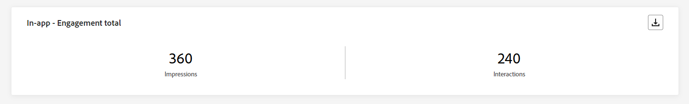

Les KPI **[!UICONTROL Engagement total in-app]** fournissent des informations complètes sur l’engagement de vos visiteurs et visiteuses avec vos messages in-app, y compris des mesures clés telles que les **impressions** et les **interactions**.

+++ En savoir plus sur les mesures Engagement total in-app

* **[!UICONTROL Impressions]** : nombre total de messages in-app diffusés à tous les utilisateurs et utilisatrices.

* **[!UICONTROL Interactions]** : nombre total d’engagements en lien avec votre message in-app. Cela inclut toutes les actions entreprises par les personnes, telles que les clics, les abandons ou toute autre interaction.

+++

### Engagement in-app dans le temps {#inapp-engagement-overtime}

>[!CONTEXTUALHELP]
>id="ajo_channel_inapp_engagement_overtime"
>title="In-app - Engagement dans le temps"
>abstract="Le graphique In-app - Engagement dans le temps effectue le suivi des impressions et interactions in-app, fournissant des ventilations par heure, jour, semaine et mois."

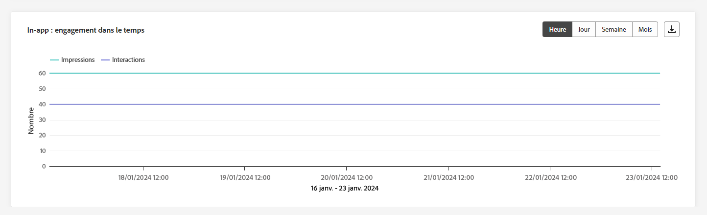

Le graphe **[!UICONTROL Engagement in-app dans le temps]** montre l’évolution de vos impressions et interactions in-app pour la période concernée en suivant chaque impression, abandon ou interaction.

+++ En savoir plus sur les mesures Engagement in-app dans le temps

* **[!UICONTROL Impressions]** : nombre total de messages in-app diffusés à tous les utilisateurs et utilisatrices.

* **[!UICONTROL Interactions]** : nombre total d’engagements en lien avec votre message in-app. Cela inclut toutes les actions entreprises par les personnes, telles que les clics, les abandons ou toute autre interaction.

+++

## Web {#web}

Dans les rapports au niveau des **canaux**, le menu Web présente les informations principales relatives aux pages web incluses dans vos **campagnes** et **parcours**. Les mesures sont détaillées ci-dessous.

### Web – Engagement total {#web-engagement-total}

>[!CONTEXTUALHELP]
>id="ajo_channel_web_engagement"
>title="Web – Engagement total"
>abstract="Les KPI Web - Engagement total fournissent des informations complètes sur l’engagement de vos visiteurs et visiteuses avec vos pages web, y compris des mesures telles que les impressions et les interactions."

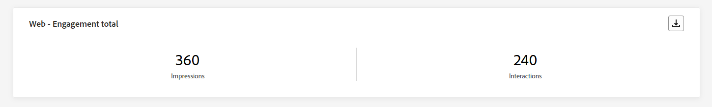

Les KPI **[!UICONTROL Web – Engagement total]** fournissent des informations complètes sur l’engagement de vos visiteurs et visiteuses avec vos pages web, y compris des mesures clés telles que les impressions et les interactions.

+++ En savoir plus sur les mesures Engagement web total

* **[!UICONTROL Impressions]** : nombre total d’expériences web diffusées à tous les utilisateurs et utilisatrices.

* **[!UICONTROL Interactions]** : nombre total d’engagements en lien avec votre page web. Il s’agit de toutes les actions entreprises par les personnes, telles que les clics ou toute autre interaction.

+++

### Web – Engagement total dans le temps {#web-engagement-total-overtime}

>[!CONTEXTUALHELP]
>id="ajo_channel_web_engagement_overtime"
>title="Web – Engagement total dans le temps"
>abstract="Le graphique Web - Engagement dans le temps effectue le suivi des impressions et interactions de vos pages web, fournissant des ventilations par heure, jour, semaine et mois."

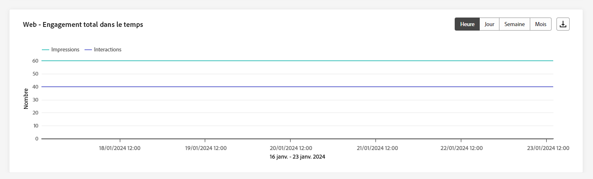

Le graphe **[!UICONTROL Engagement web dans le temps]** surveille les **impressions** et les **interactions** de vos pages web, avec des ventilations détaillées sur une base horaire, quotidienne, hebdomadaire et mensuelle.

+++ En savoir plus sur les mesures Engagement web dans le temps

* **[!UICONTROL Impressions]** : nombre total d’expériences web diffusées à tous les utilisateurs et utilisatrices.

* **[!UICONTROL Interactions]** : nombre total d’engagements en lien avec votre page web. Il s’agit de toutes les actions entreprises par les personnes, telles que les clics ou toute autre interaction.

+++

## Rapport au niveau des canaux (vidéo) {#channel-report-video}

Découvrez comment accéder aux rapports, les parcourir et les exporter au niveau des canaux sur cette vidéo.

>[!VIDEO](https://video.tv.adobe.com/v/3424537?quality=12)
