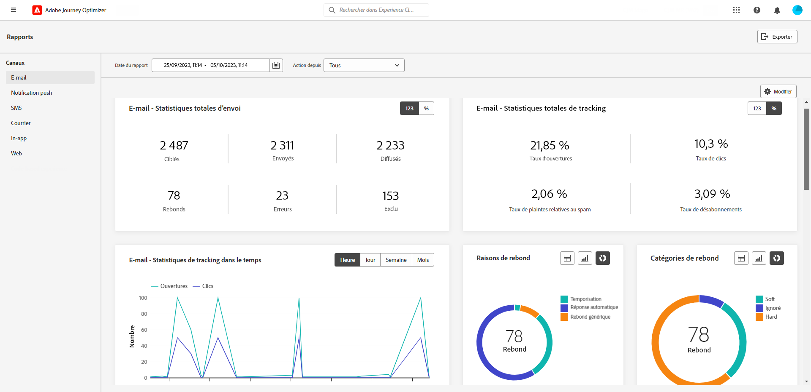
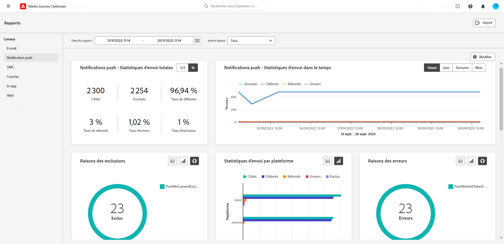
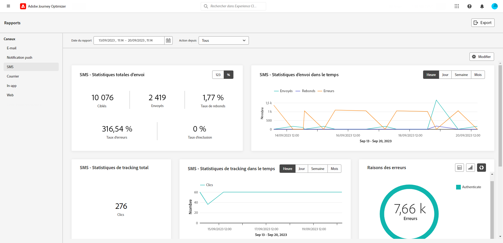
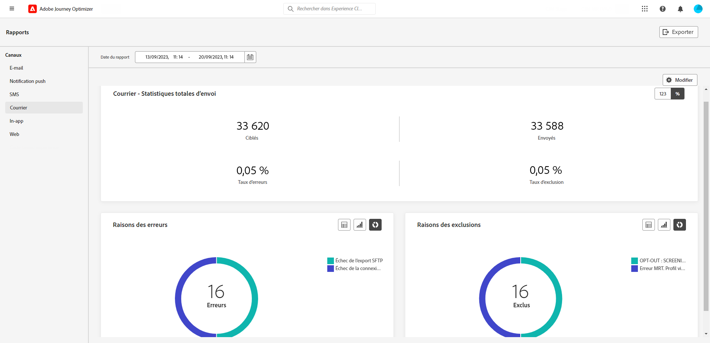
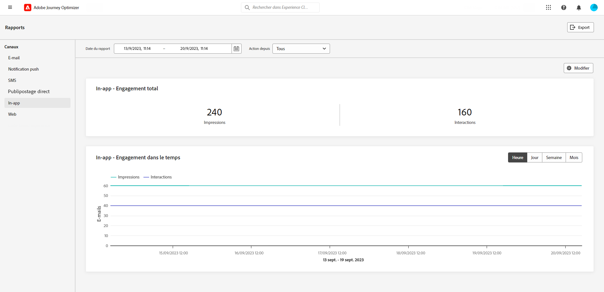
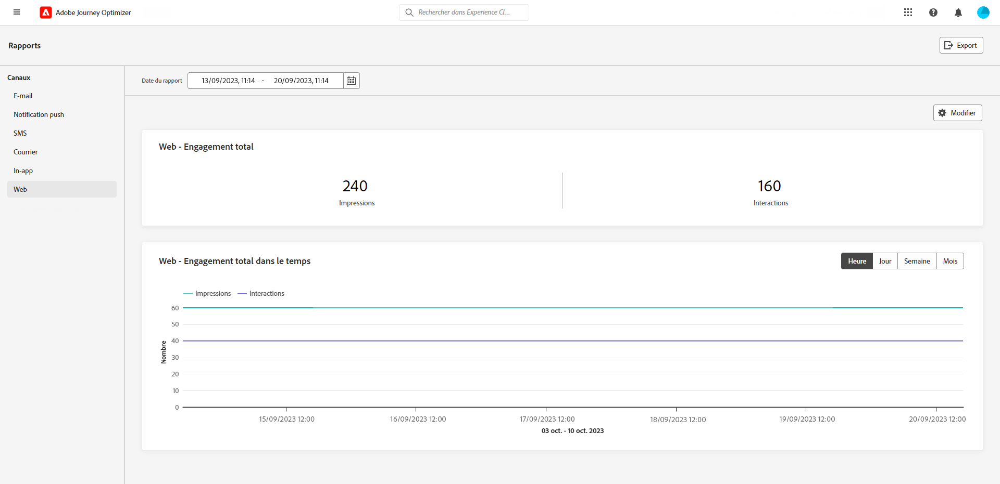

# Rapports sur les canaux {#channel-report}

>[!CONTEXTUALHELP]
>id="ajo_channel_level_report"
>title="Rapport au niveau des canaux"
>abstract="Les rapports au niveau des canaux offrent une vue d’ensemble complète des mesures de trafic et d’engagement sur tous les canaux. Vos rapports sont composés de plusieurs widgets présentant le succès et les erreurs de votre campagne et de vos parcours. Vous pouvez modifier chaque tableau de bord de reporting en redimensionnant ou en supprimant des widgets."

>[!IMPORTANT]
>
> Pour accéder au menu **Rapport**, vous devez disposer de l’autorisation **[!UICONTROL Afficher les rapports du canal]**. [En savoir plus](channel-report-gs.md#before-starting-manage-reports-prereq)

Les rapports au niveau des canaux offrent aux utilisateurs et aux utilisatrices une vue d’ensemble complète des mesures de trafic et d’engagement au niveau des canaux. Les mesures sont agrégées afin de présenter des valeurs consolidées pour les actions provenant du canal choisi, couvrant plusieurs campagnes et parcours.

Vous pouvez accéder aux rapports au niveau des canaux en accédant au menu **Rapports** dans la section **Gestion des parcours**. Il est entièrement personnalisable. Vous pouvez filtrer vos données en fonction de la date du rapport ou de l’action. [En savoir plus](channel-report-gs.md)

La page Rapport s’affiche avec les onglets suivants :

* [E-mail](#email)
* [Push Notifications](#push)
* [SMS](#sms)
* [In-app](#inapp)
* [Web](#web)
* [Courrier](#direct-mail)

➡️ [Découvrez cette fonctionnalité en vidéo](#channel-report-video)

## E-mail {#email}

>[!CONTEXTUALHELP]
>id="ajo_channel_email_sending_statistics"
>title="Email - Nombre total de statistiques d&#39;envoi"
>abstract="Les indicateurs de performance clés des statistiques d’envoi totales résument les données essentielles relatives à vos notifications push, telles que les messages ciblés ou délivrés."

>[!CONTEXTUALHELP]
>id="ajo_channel_email_tracking_statistics"
>title="Email - Statistiques de tracking totales"
>abstract="Les indicateurs de performance clés Email - Statistiques de tracking totales fournissent des données sur l’activité de profil pour vos emails."

>[!CONTEXTUALHELP]
>id="ajo_channel_email_sending_statistics_overtime"
>title="Email - Envoi de statistiques dans le temps"
>abstract="Le graphique Email - Statistiques d’envoi dans le temps présente des données concernant les emails envoyés, ventilées par heure, jour, semaine ou mois."

>[!CONTEXTUALHELP]
>id="ajo_channel_email_tracking_statistics_overtime"
>title="Email - Statistiques de tracking dans le temps"
>abstract="Le graphique Email - Statistiques de suivi dans le temps fournit des données sur l’activité de profil de vos emails, ventilées par heure, jour, semaine ou mois."

>[!CONTEXTUALHELP]
>id="ajo_channel_email_bounce_categories"
>title="Catégories rebonds"
>abstract="Les graphiques et les tableaux des catégories de rebonds fournissent des données sur les erreurs temporaires et permanentes."

>[!CONTEXTUALHELP]
>id="ajo_channel_email_bounce_reasons"
>title="Raisons de rebond"
>abstract="Les graphiques et les tableaux Rebonds contiennent les données disponibles relatives aux messages rebonds."

>[!CONTEXTUALHELP]
>id="ajo_channel_email_error_reasons"
>title="Raisons de l’erreur"
>abstract="Les graphiques et tableaux Raisons d’erreur vous permettent d’identifier les erreurs spécifiques qui se sont produites au cours du processus d’envoi."

>[!CONTEXTUALHELP]
>id="ajo_channel_email_excluded_reasons"
>title="Exclure des motifs"
>abstract="Les graphiques et tableaux Exclus des motifs illustrent les différents facteurs qui ont conduit à des profils d’utilisateurs, qui ont été exclus de l’audience ciblée et qui n’ont pas reçu le message."

>[!CONTEXTUALHELP]
>id="ajo_channel_email_sending_delivered_domains"
>title="Envoyé et diffusé par domaines"
>abstract="Le tableau et graphique Envoyés et délivrés par domaines représentent la ventilation au niveau du domaine de chaque donnée importante d’envoi d’emails."

>[!CONTEXTUALHELP]
>id="ajo_channel_email_bounces_errors_domains"
>title="Rebonds et erreurs par domaine"
>abstract="Le graphique et le tableau Rebonds et erreurs par domaine représentent la ventilation au niveau du domaine des erreurs spécifiques survenues pendant le processus d’envoi."

>[!CONTEXTUALHELP]
>id="ajo_channel_email_open_clicks_domains"
>title="Ouverture et clics par domaine"
>abstract="Le tableau et graphique Open &amp; clicks by domains représentent la ventilation au niveau du domaine de l’engagement des visiteurs de votre email."

>[!CONTEXTUALHELP]
>id="ajo_channel_email_bounce_reasons_domains"
>title="Raisons des bounces par domaine"
>abstract="Le graphique et le tableau des raisons de rebond par domaine représentent la ventilation des données au niveau du domaine sur les erreurs temporaires et permanentes."

Dans les rapports au niveau des canaux, le menu E-mail présente les informations principales relatives aux e-mails envoyés dans vos campagnes et parcours. Les mesures sont détaillées ci-dessous.

+++ En savoir plus sur les différents widgets et mesures disponibles pour le rapport d’e-mail.

Le graphique **[!UICONTROL Statistiques d’envoi d’e-mail total]** détaille la réussite de diffusion de vos e-mails :

* **[!UICONTROL Ciblés]** : nombre total d’e-mails traités.

* **[!UICONTROL Envoyés]** : nombre total d’e-mails envoyés.

* **[!UICONTROL Diffusés]** : nombre d’e-mails envoyés avec succès, par rapport au nombre total de messages envoyés.

* **[!UICONTROL Taux de diffusion]** : pourcentage d’e-mails envoyés avec succès.

* **[!UICONTROL Rebonds]** : nombre total d’erreurs cumulées lors du traitement automatique des retours par rapport au nombre total de messages envoyés.

* **[!UICONTROL Taux de rebond]** : pourcentage d’e-mails ayant rebondi par rapport aux e-mails envoyés.

* **[!UICONTROL Erreurs]** : nombre total d’erreurs survenues, l’empêchant d’être envoyé à des profils.

* **[!UICONTROL Taux d’erreurs]** : pourcentage d’erreurs survenues empêchant l’envoi des e-mails, par rapport aux e-mails envoyés.

* **[!UICONTROL Exclus]** : nombre de profils qui ont été exclus par Adobe Journey Optimizer.

* **[!UICONTROL Exclus]** : pourcentage de profils qui ont été exclus par Adobe Journey Optimizer.

La variable **[!UICONTROL Statistiques de tracking total des emails]** Le widget contient les données disponibles pour l’activité de profil de vos emails :

* **[!UICONTROL Ouvertures]** : nombre de fois que le message a été ouvert.

* **[!UICONTROL Taux d’ouvertures]** : nombre total de messages ouverts par rapport au nombre de messages diffusés.

* **[!UICONTROL Clics]** : nombre de clics sur un contenu dans un message.

* **[!UICONTROL Taux de clics]** : pourcentage d’utilisateurs et d’utilisatrices ayant interagi avec l’e-mail.

* **[!UICONTROL Plaintes contre le spam]** : nombre de fois où un message a été déclaré comme spam ou courrier indésirable.

* **[!UICONTROL Taux de plaintes relatives aux spam]** : pourcentage de messages déclarés comme spam ou courrier indésirable par rapport au nombre d’e-mails envoyés.

* **[!UICONTROL Désabonnements]** : nombre de clics sur le lien de désabonnement.

* **[!UICONTROL Taux de désabonnement]** : pourcentage de désinscription par rapport au nombre d’e-mails envoyés.

Le graphique **[!UICONTROL Statistiques d’envoi dans le temps]** contient les données disponibles pour les e-mails envoyés, telles que :

* **[!UICONTROL Envoyés]** : nombre total d’e-mails envoyés.

* **[!UICONTROL Diffusés]** : nombre d’e-mails envoyés avec succès, par rapport au nombre total d’e-mails envoyés.

* **[!UICONTROL Rebonds]** : nombre total d&#39;erreurs cumulées lors du traitement automatique des retours par rapport au nombre total d’e-mails envoyés.

* **[!UICONTROL Erreurs]** : nombre total d’erreurs survenues empêchant l’e-mail d’être envoyé à des profils.

Le graphique **[!UICONTROL Statistiques de suivi des e-mails dans le temps]** contient les données disponibles pour les ouvertures et les clics.

Les widgets **[!UICONTROL Raisons de rebond]** et **[!UICONTROL Catégories de rebond]** contiennent les données disponibles relatives aux messages de rebond, telles que :

* **[!UICONTROL Hard bounce]** : nombre total d’erreurs permanentes, telles qu’une adresse e-mail incorrecte. Un message d&#39;erreur indique explicitement que l&#39;adresse n&#39;est pas valide, comme Utilisateur inconnu.

* **[!UICONTROL Soft bounces]** : nombre total d&#39;erreurs temporaires, telles qu&#39;une boîte de réception pleine.

* **[!UICONTROL Ignorées]** : nombre total d&#39;erreurs temporaires (par exemple, Absent(e) du bureau) ou techniques (par exemple, si le type d&#39;expéditeur est administrateur).

Pour plus d&#39;informations sur les bounces, consultez la page [Liste de suppression](../reports/suppression-list.md).

Le graphique et le tableau **[!UICONTROL Causes des erreurs]** vous permettent de voir quelle erreur s’est produite.

Le graphique et le tableau **[!UICONTROL Raisons de l’exclusion]** affichent les différentes raisons qui ont empêché les profils utilisateur, exclus des profils ciblés, de recevoir le message.

Les tableaux et graphiques **[!UICONTROL Raisons de rebond par domaine]**, **[!UICONTROL Envoyés et diffusés par domaines]**, **[!UICONTROL Ouvertures et clics par domaine]** et **[!UICONTROL Rebonds et erreurs par domaine]** représentent la répartition de chaque diffusion d’e-mail important et des données de suivi par domaine.
+++

## Notification push {#push}

>[!CONTEXTUALHELP]
>id="ajo_channel_push_sending_statistics"
>title="Notifications push - Statistiques totales d&#39;envoi"
>abstract="Les indicateurs de performance clés des statistiques d’envoi totales résument les données essentielles relatives à vos notifications push, telles que Ciblées ou Diffusées."

>[!CONTEXTUALHELP]
>id="ajo_channel_push_tracking_statistics"
>title="Notification push - Statistiques totales de tracking"
>abstract="Les statistiques de tracking totales des notifications push fournissent des données sur l’activité de profil pour vos notifications push."

>[!CONTEXTUALHELP]
>id="ajo_channel_push_sending_statistics_overtime"
>title="Notifications push - Envoi de statistiques au fil du temps"
>abstract="Le graphique des statistiques d’envoi de notifications push au fil du temps présente les données concernant les notifications push envoyées, ventilées par heure, jour, semaine ou mois."

>[!CONTEXTUALHELP]
>id="ajo_channel_push_tracking_statistics_overtime"
>title="Notifications push - Statistiques de suivi dans le temps"
>abstract="Le graphique Notifications push - Statistiques de suivi dans le temps fournit des données sur l’activité de profil pour vos notifications push, ventilées par heure, jour, semaine ou mois."

>[!CONTEXTUALHELP]
>id="ajo_channel_push_excluded_reasons"
>title="Exclure des motifs"
>abstract="Les graphiques et tableaux Exclus des motifs illustrent les différents facteurs qui ont conduit à des profils d’utilisateurs, qui ont été exclus de l’audience ciblée et qui n’ont pas reçu le message."

>[!CONTEXTUALHELP]
>id="ajo_channel_push_error_reasons"
>title="Raisons de l’erreur"
>abstract="Les graphiques et tableaux Raisons d’erreur vous permettent d’identifier les erreurs spécifiques qui se sont produites au cours du processus d’envoi."

>[!CONTEXTUALHELP]
>id="ajo_channel_push_tracking_statistics_platform"
>title="Statistiques de tracking par plateforme"
>abstract="Le tableau et graphique Statistiques de tracking par plateforme fournit des données sur l’activité des profils pour vos notifications push en fonction du système opérationnel de votre profil."

>[!CONTEXTUALHELP]
>id="ajo_channel_push_sending_statistics_platform"
>title="Envoi de statistiques par plateforme"
>abstract="Le tableau et graphique Statistiques d’envoi par plateforme présente les données concernant les notifications push envoyées."

Dans les rapports sur les canaux, le menu Notification push présente les informations principales relatives aux notifications push envoyées dans vos campagnes et parcours. Les mesures sont présentées ci-dessous.

+++  En savoir plus sur les différents widgets et mesures disponibles pour le rapport push.

Le tableau **[!UICONTROL Notification push - Statistiques d’envoi totales]** présente les principales informations relatives à vos notifications push avec un graphique et des KPI :

* **[!UICONTROL Ciblées]** : nombre total de notifications push traitées.

* **[!UICONTROL Envoyées]** : nombre total de notifications push envoyées.

* **[!UICONTROL Délivrées]** : nombre de notifications push envoyées avec succès, par rapport au nombre total de notifications push envoyées.

* **[!UICONTROL Taux de diffusion]** : pourcentage de notifications push envoyées avec succès.

* **[!UICONTROL Rebonds]** : nombre total d&#39;erreurs cumulées lors du traitement automatique des retours par rapport au nombre total de messages envoyés.

* **[!UICONTROL Taux de rebond]** : pourcentage de notifications push ayant rebondi par rapport aux notifications push envoyées.

* **[!UICONTROL Erreurs]** : nombre total d’erreurs survenues, l’empêchant d’être envoyée à des profils.

* **[!UICONTROL Taux d’erreurs]** : pourcentage d’erreurs survenues empêchant l’envoi, par rapport aux notifications push envoyées.

* **[!UICONTROL Exclus]** : nombre de profils qui ont été exclus par Adobe Journey Optimizer.

* **[!UICONTROL Exclus]** : pourcentage de profils qui ont été exclus par Adobe Journey Optimizer.

La variable **[!UICONTROL Notification push - Statistiques totales de tracking]** contient les données disponibles pour l’activité de profil pour vos notifications push :

* **[!UICONTROL Ouvertures]** : nombre de fois qu’une notification push a été ouverte.

* **[!UICONTROL Taux d&#39;ouverture]** : pourcentage de notifications push ouvertes.

* **[!UICONTROL Actions]** : nombre total d&#39;actions sur la notification push diffusée, par exemple clic sur un bouton ou rejet.

* **[!UICONTROL Taux d&#39;action]** : pourcentage d’actions sur la notification push diffusée par rapport aux notifications push envoyées.

* **[!UICONTROL Taux d&#39;engagement]** : pourcentage d&#39;ouvertures et d&#39;actions pour cette notification push, c&#39;est-à-dire si le profil a ouvert la notification push ou si un bouton a fait l’objet d’un clic.

Le graphique **[!UICONTROL Notifications push - Statistiques d’envoi dans le temps]** contient les données disponibles pour les notifications push envoyées, telles que :

* **[!UICONTROL Envoyées]** : nombre total de notifications push envoyées.

* **[!UICONTROL Délivrées]** : nombre de notifications push envoyées avec succès, par rapport au nombre total de notifications push envoyées.

* **[!UICONTROL Rebonds]** : nombre total d&#39;erreurs cumulées lors du traitement automatique des retours par rapport au nombre total de messages envoyés.

* **[!UICONTROL Erreurs]** : nombre total d’erreurs survenues, l’empêchant d’être envoyée à des profils.

Le graphique et le tableau **[!UICONTROL Raisons de l’exclusion]** affichent les différentes raisons qui ont empêché les profils utilisateur, à part les profils ciblés, de recevoir le message.

Le graphique et le tableau **[!UICONTROL Causes des erreurs]** vous permettent de voir quelle erreur s’est produite.

La variable **[!UICONTROL Tracking par plateforme]** et **[!UICONTROL Envoi par plateforme]** les graphiques et les tableaux détaillent le succès de votre notification push en fonction du système opérationnel de votre profil.
+++

## SMS {#sms}

>[!CONTEXTUALHELP]
>id="ajo_channel_sms_sending_statistics"
>title="SMS - Statistiques totales d’envoi"
>abstract="Les indicateurs de performance clés des statistiques d’envoi totales résument les données essentielles relatives à vos messages SMS tels que Ciblés ou Délivrés."

>[!CONTEXTUALHELP]
>id="ajo_channel_sms_tracking_statistics"
>title="SMS - Statistiques totales de tracking"
>abstract="Les statistiques de suivi SMS - Total fournissent des données sur l’activité de profil pour vos SMS."

>[!CONTEXTUALHELP]
>id="ajo_channel_sms_sending_statistics_overtime"
>title="SMS - Envoi de statistiques dans le temps"
>abstract="Le graphique SMS - Envoi de statistiques dans le temps présente les données concernant les SMS envoyés, ventilées par heure, jour, semaine ou mois."

>[!CONTEXTUALHELP]
>id="ajo_channel_sms_tracking_statistics_overtime"
>title="SMS : statistiques de suivi dans le temps"
>abstract="Le graphique SMS - Statistiques de suivi dans le temps fournit des données sur l’activité de profil de vos SMS, ventilées par heure, jour, semaine ou mois."

>[!CONTEXTUALHELP]
>id="ajo_channel_sms_excluded_reasons"
>title="Exclure des motifs"
>abstract="Les graphiques et tableaux Exclus des motifs illustrent les différents facteurs qui ont conduit à des profils d’utilisateurs, qui ont été exclus de l’audience ciblée et qui n’ont pas reçu le message."

>[!CONTEXTUALHELP]
>id="ajo_channel_sms_bounce_reasons"
>title="Raisons de rebond"
>abstract="Les graphiques et les tableaux Rebonds contiennent les données disponibles relatives aux messages rebonds."

>[!CONTEXTUALHELP]
>id="ajo_channel_sms_error_reasons"
>title="Raisons de l’erreur"
>abstract="Les graphiques et tableaux Raisons d’erreur vous permettent d’identifier les erreurs spécifiques qui se sont produites au cours du processus d’envoi."

Dans les rapports sur les canaux, le menu SMS présente les informations principales relatives aux SMS envoyés dans vos campagnes et parcours. Les mesures sont détaillées ci-dessous.

+++ En savoir plus sur les différents widgets et mesures disponibles pour le rapport SMS.

Le tableau **[!UICONTROL SMS - Statistiques d’envoi totales]** présente le succès de vos SMS :

* **[!UICONTROL Ciblés]** : nombre de profils utilisateur qui sont qualifiés en tant que profils cibles pour le canal SMS.

* **[!UICONTROL Envoyés]** : nombre total de SMS envoyés.

* **[!UICONTROL Délivrés]** : nombre de messages SMS envoyés avec succès, par rapport au nombre total de SMS envoyés.

* **[!UICONTROL Taux de diffusion]** : pourcentage de SMS envoyés avec succès.

* **[!UICONTROL Rebonds]** : nombre total d’erreurs cumulées lors du traitement automatique des retours par rapport au nombre total de SMS envoyés.

* **[!UICONTROL Taux de rebond]** : pourcentage de SMS qui ont fait l’objet d’un rebond par rapport au nombre de SMS envoyés.

* **[!UICONTROL Erreurs]** : nombre total d’erreurs survenues, l’empêchant d’être envoyé à des profils.

* **[!UICONTROL Taux d’erreurs]** : pourcentage d’erreurs survenues empêchant l’envoi, par rapport aux SMS envoyés.

* **[!UICONTROL Exclus]** : nombre de profils utilisateur, exclus des profils ciblés, qui n’ont pas reçu le message.

* **[!UICONTROL Taux d’exclusion]** : pourcentage de profils qui ont été exclus par Adobe Journey Optimizer.

Le widget **[!UICONTROL SMS - Statistiques de suivi totales]** détaille les informations principales relatives à l’engagement des visiteurs et visiteuses avec vos URL :

* **[!UICONTROL Clics]** : nombre de clics sur un contenu dans un SMS.

* **[!UICONTROL Taux de clics]** : pourcentage d’utilisateurs ou d’utilisatrices ayant interagi avec le SMS.

Le widget **[!UICONTROL SMS - Statistiques d’envoi totales dans le temps]** détaille les informations principales relatives à votre message sous forme de graphique :

* **[!UICONTROL Envoyés]** : nombre total de SMS envoyés.

* **[!UICONTROL Délivrés]** : nombre de messages SMS envoyés avec succès, par rapport au nombre total de SMS envoyés.

* **[!UICONTROL Rebonds]** : nombre total d’erreurs cumulées lors du traitement automatique des retours par rapport au nombre total de SMS envoyés.

* **[!UICONTROL Erreurs]** : nombre total d’erreurs survenues, l’empêchant d’être envoyé à des profils.

Les graphiques et tableaux **[!UICONTROL Raisons de l’exclusion]**, **[!UICONTROL Causes des bounces]** et **[!UICONTROL Causes des erreurs]** vous permettent de voir quelles erreurs et exclusions ont eu lieu.

+++

## Courrier {#direct-mail}

>[!CONTEXTUALHELP]
>id="ajo_channel_direct_sending_statistics"
>title="Courrier - Statistiques totales d’envoi"
>abstract="Les indicateurs de performance clés des statistiques d’envoi des courriers résument les données essentielles relatives à vos courriers, tels que Ciblés ou Délivrés."

>[!CONTEXTUALHELP]
>id="ajo_channel_direct_excluded_reasons"
>title="Exclure des motifs"
>abstract="Les graphiques et tableaux Exclus des motifs illustrent les différents facteurs qui ont conduit à des profils d’utilisateurs, qui ont été exclus de l’audience ciblée et qui n’ont pas reçu le message."

>[!CONTEXTUALHELP]
>id="ajo_channel_direct_error_reasons"
>title="Raisons de l’erreur"
>abstract="Les graphiques et tableaux Raisons d’erreur vous permettent d’identifier les erreurs spécifiques qui se sont produites au cours du processus d’envoi."

Dans les rapports au niveau des canaux, le menu Courrier présente les informations principales relatives aux messages de courrier envoyés dans vos campagnes et parcours. Les mesures sont détaillées ci-dessous.

+++ En savoir plus sur les différents widgets et mesures disponibles pour le rapport Courrier.

Le tableau **[!UICONTROL Courrier – Statistiques totales d’envoi]** détaille le succès de vos messages :

* **[!UICONTROL Ciblés]** : nombre de profils utilisateur qui sont qualifiés en tant que profils cibles pour les messages de courrier.

* **[!UICONTROL Envoyés]** : nombre total d’envois.

* **[!UICONTROL Erreurs]** : nombre total d’erreurs survenues empêchant l’e-mail d’être envoyé à des profils.

* **[!UICONTROL Taux d’erreurs]** : pourcentage d’erreurs survenues empêchant l’envoi de l’e-mail, par rapport aux notifications push envoyées.

* **[!UICONTROL Exclus]** : nombre de profils utilisateur, exclus des profils ciblés, qui n’ont pas reçu le message.

* **[!UICONTROL Exclus]** : pourcentage de profils qui ont été exclus par Adobe Journey Optimizer.

Les graphiques et tableaux **[!UICONTROL Raisons de l’exclusion]** et **[!UICONTROL Causes des erreurs]** vous permettent de voir quelles erreurs et exclusions ont eu lieu.
+++

## In-app {#in-app}

>[!CONTEXTUALHELP]
>id="ajo_channel_inapp_engagement"
>title="In-app - Engagement total"
>abstract="Les indicateurs de performance clés d’engagement total dans l’application fournissent des informations complètes sur l’engagement de vos visiteurs avec vos messages in-app, y compris des mesures telles que les impressions et les interactions."

>[!CONTEXTUALHELP]
>id="ajo_channel_inapp_engagement_overtime"
>title="In-App - Engagement au fil du temps"
>abstract="Le graphique In-App - Engagement au fil du temps effectue le suivi des impressions et interactions in-app, fournissant des ventilations horaires, quotidiennes, hebdomadaires et mensuelles."

Dans les rapports au niveau des canaux, le menu In-app présente les informations principales relatives aux messages in-app envoyés dans vos campagnes et parcours. Les mesures sont détaillées ci-dessous.

+++  En savoir plus sur les différents widgets et mesures disponibles pour le rapport in-app.

Les KPI **[!UICONTROL Engagement total in-app]** détaillent les informations principales relatives à l’engagement des visiteurs et visiteuses en lien avec vos messages in-app. Cela concerne notamment les éléments suivants :

* **[!UICONTROL Impressions]** : nombre total de messages in-app diffusés à tous les utilisateurs et utilisatrices.

* **[!UICONTROL Interactions]** : nombre total d’engagements en lien avec votre message in-app. Cela inclut toutes les actions entreprises par les personnes, telles que les clics, les rejets ou toute autre interaction.

* **[!UICONTROL Ignorations]**: nombre total de messages In-App ignorés par les profils en cliquant sur le bouton de fermeture ou en l’ignorant automatiquement.

* **[!UICONTROL Taux d&#39;abandon]**: pourcentage de messages In-App ignorés par les profils.

Le graphique **[!UICONTROL Engagement in-app dans le temps]** montre l’évolution de vos impressions et interactions in-app pour la période concernée en suivant toute impression, abandon ou interaction.

+++

## Web {#web}

>[!CONTEXTUALHELP]
>id="ajo_channel_web_engagement"
>title="Web - Engagement total"
>abstract="Les indicateurs de performance clés (IPC) d’engagement total fournissent des informations complètes sur l’engagement des visiteurs de vos pages Web, y compris des mesures telles que Impressions et Interactions."

>[!CONTEXTUALHELP]
>id="ajo_channel_web_engagement_overtime"
>title="Web - Nombre total d’engagements au fil du temps"
>abstract="Le graphique Web : engagement au fil du temps effectue le suivi des impressions et interactions de vos pages Web, ce qui fournit des ventilations horaires, quotidiennes, hebdomadaires et mensuelles."

Dans les rapports au niveau des canaux, le menu Web présente les informations principales relatives aux pages web incluses dans vos campagnes et parcours. Les mesures sont détaillées ci-dessous.

+++ En savoir plus sur les différents widgets et mesures disponibles pour le rapport web.

Les KPI **[!UICONTROL Engagement web total]** détaillent les informations principales relatives à l’engagement de vos visiteurs et visiteuses envers vos expériences web, telles que :

* **[!UICONTROL Impressions]** : nombre total d’expériences web diffusées à tous les utilisateurs et utilisatrices.

* **[!UICONTROL Interactions]** : nombre total d’engagements en lien avec votre page web. Cela inclut toutes les actions entreprises par les personnes, telles que les clics ou toute autre interaction.

* **[!UICONTROL Ignorations]**: nombre total de pages Web ignorées par les profils.

* **[!UICONTROL Taux d&#39;abandon]**: pourcentage de pages web ignorées par les profils.

Le graphique **[!UICONTROL Engagement web dans le temps]** présente les informations principales relatives à l’engagement des visiteurs et des visiteuses envers vos pages web.

+++

## Rapport au niveau des canaux (vidéo) {#channel-report-video}

Découvrez comment accéder aux rapports, les parcourir et les exporter au niveau des canaux sur cette vidéo.

>[!VIDEO](https://video.tv.adobe.com/v/3424537?quality=12)
