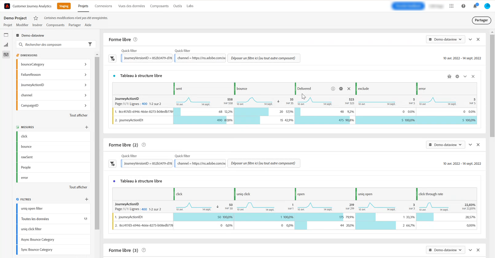

# Configuration manuelle de [!DNL Customer Journey Analytics] {#cja-ajo}

L’intégration de [!DNL Journey Optimizer] à [!DNL Customer Journey Analytics] offre une vue holistique de tous vos parcours avec une distribution de rapports automatisée et des visualisations personnalisées des données.

La section suivante explique comment utiliser manuellement les données générées par Journey Optimizer pour une analyse approfondie dans Customer Journey Analytics. Notez que cette intégration peut être configurée automatiquement. [En savoir plus](report-gs-cja.md)

Une fois que vous avez créé votre parcours dans [!DNL Journey Optimizer], vous pouvez commencer à importer vos données clients dans [!DNL Customer Journey Analytics] afin de lancer des rapports et de comprendre l’impact de chaque interaction avec vos parcours.

➡️[Découvrez Customer Journey Analytics.](https://experienceleague.adobe.com/fr/docs/analytics-platform/using/integrations/ajo#manually-configure-a-data-view-to-be-used-with-journey-optimizer){target="_blank"}

>[!NOTE]
>
>Outre cette intégration, vous pouvez également exporter le contenu des jeux de données Adobe Journey Optimizer vers des emplacements de stockage dans le cloud et utiliser ces informations à des fins de création de rapports ou d’analyse. [Découvrez comment exporter des jeux de données vers des emplacements de stockage dans le cloud.](../data/export-datasets.md)
>

Avant d’utiliser [!DNL Customer Journey Analytics] pour vos parcours, vous devez d’abord configurer cette intégration :

1. [Créez une connexion](https://experienceleague.adobe.com/docs/analytics-platform/using/cja-connections/create-connection.html?lang=fr){target="_blank"} dans [!DNL Customer Journey Analytics] avec le **[!UICONTROL jeu de données]** que vous souhaitez envoyer à Adobe Experience Platform.

   [!DNL Journey Optimizer] peuvent être configurés :
   * [Événement d’étape de parcours](../data/datasets-query-examples.md#journey-step-event) : permet d’afficher qui entre dans vos parcours et jusqu’où ils vont.
   * [Jeux de données de retour/tracking de message](../data/datasets-query-examples.md#message-feedback-event-dataset) : permet d’afficher les informations de diffusion sur vos messages envoyés par le biais de [!DNL Journey Optimizer].
   * [Jeux de données d’entité et de parcours](../data/datasets-query-examples.md#entity-dataset) : permet de rechercher des noms conviviaux et de les utiliser dans vos rapports.

1. [Créez une vue de données](https://experienceleague.adobe.com/docs/analytics-platform/using/cja-dataviews/create-dataview.html?lang=fr){target="_blank"} pour configurer les dimensions et mesures à utiliser dans votre rapport.

   Vous pouvez créer des mesures spécifiques dans Journey Optimizer pour mieux refléter les données de vos parcours. [En savoir plus](https://experienceleague.adobe.com/docs/analytics-platform/using/integrations/ajo.html?lang=fr#configure-the-data-view-to-accommodate-journey-optimizer-dimensions-and-metrics){target="_blank"}

>[!NOTE]
>
>S’il existe plusieurs connexions pour votre sandbox, vérifiez que la [vue de données](https://experienceleague.adobe.com/docs/analytics-platform/using/cja-dataviews/create-dataview.html?lang=fr){target="_blank"} référence la [connexion](https://experienceleague.adobe.com/en/docs/analytics-platform/using/cja-connections/manage-connections){target="_blank"} marquée **[!UICONTROL Utiliser dans CJA]**. Sinon, le bouton [**Analyser dans CJA** &#x200B;](report-cja-manage.md#analyze) peut être désactivé dans [!DNL Journey Optimizer].

L’utilisation de [!DNL Journey Optimizer] avec [!DNL Customer Journey Analytics] peut entraîner des incohérences dans les données de rapport, qui sont dues aux problèmes suivants :

* **[!DNL Journey Optimizer] et [!DNL Customer Journey Analytics] synchronisent les données à partir du connecteur Azure Data Lake Storage (ADLS) pour la création de rapports.**

  Le temps de traitement des données entrantes peut différer légèrement d’un produit à l’autre. En conséquence, les données peuvent ne pas correspondre lors de l’affichage des rapports allant d’une date donnée jusqu’à la date actuelle. Pour réduire les incohérences, utilisez des périodes qui excluent le jour en cours.

* **Dans les rapports [!DNL Journey Optimizer], la mesure Envoyé comprend également la mesure Reprise.**

  **[!UICONTROL Les Reprises]** ne seront pas incluses dans la mesure **[!UICONTROL Envoyé]** dans [!DNL Customer Journey Analytics]. Par conséquent, les mesures **[!UICONTROL Envoyé]** de [!DNL Customer Journey Analytics] afficheront des valeurs inférieures à [!DNL Journey Optimizer]. Toutefois, les données de reprise convergent vers la mesure **[!UICONTROL Messages envoyés avec succès]** ou **[!UICONTROL Rebonds.]**
Pour réduire les incohérences, utilisez des périodes qui datent d’une semaine ou même d’avant.

* **Les rapports sont alimentés à partir d’une autre source de données.**

  Cela peut entraîner de incohérences de 1 à 2 % des données entre les produits. 
