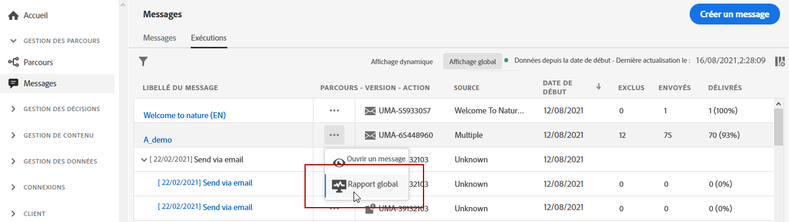
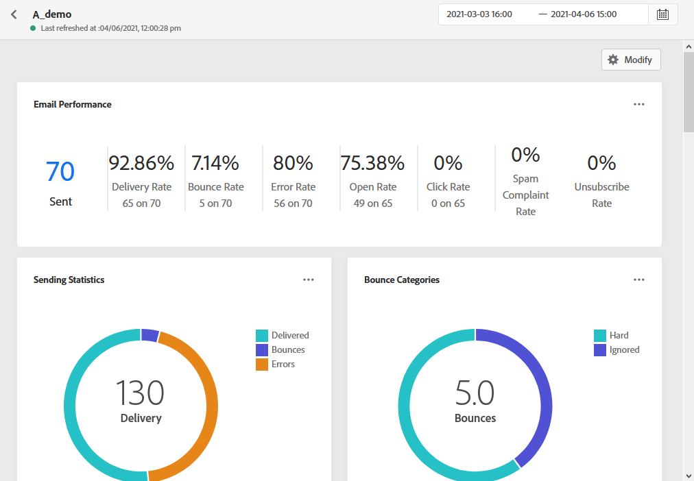
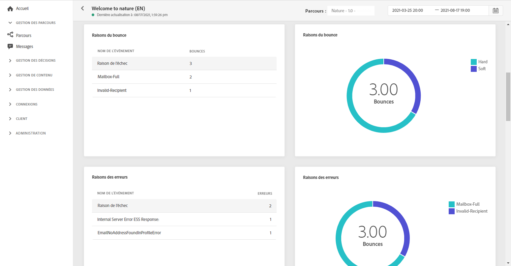
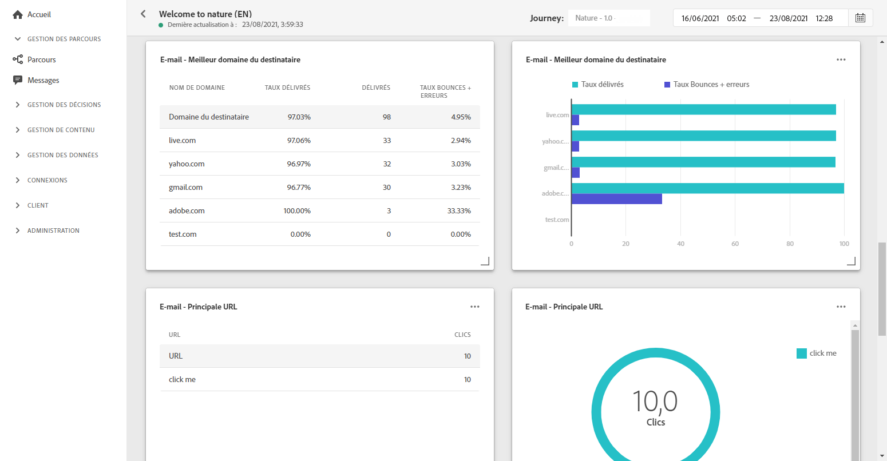

# Rapport global d’e-mail {#email-global-report}

Le **[!UICONTROL rapport global d&#39;email]** ne cible qu&#39;une diffusion par email spécifique.

À partir de l&#39;onglet **[!UICONTROL Exécutions]** du menu **[!UICONTROL Messages]**, sélectionnez **[!UICONTROL Vue globale]**, puis, dans le menu avancé de la diffusion sélectionnée, sélectionnez **[!UICONTROL Rapport global]**.

Le **[!UICONTROL rapport global]** d&#39;email est divisé en différents widgets détaillant la réussite et les erreurs de votre diffusion. Chaque widget peut être redimensionné et supprimé si nécessaire. Pour plus d&#39;informations à ce propos consultez cette [section](global-report.md#modify-dashboard).

**[!UICONTROL Performances des emails]** présente les principales informations relatives à votre message avec les KPI :

* **[!UICONTROL Envoyés]** : nombre total d&#39;envois pour la diffusion.

* **[!UICONTROL Taux de diffusion]** : pourcentage de messages envoyés avec succès.

* **[!UICONTROL Taux de bounce]** : pourcentage d&#39;emails ayant fait l&#39;objet d&#39;un bounce par rapport aux emails envoyés.

* **[!UICONTROL Taux d&#39;erreurs]** : pourcentage d&#39;erreurs survenues au cours d&#39;une diffusion, l&#39;empêchant d&#39;être envoyée, par rapport aux emails envoyés.

* **[!UICONTROL Taux d&#39;ouvertures]** : pourcentage de messages ouverts.

* **[!UICONTROL Taux de clics]** : pourcentage de clics dans une diffusion.

* **[!UICONTROL Taux de plaintes de courrier indésirable]** : pourcentage d&#39;emails marqués comme étant indésirables par les destinataires par rapport aux messages envoyés. Pour plus d’informations sur les plaintes, consultez le [Guide des bonnes pratiques en matière de délivrabilité](https://experienceleague.adobe.com/docs/deliverability-learn/deliverability-best-practice-guide/metrics-for-deliverability/complaints.html?lang=fr#metrics-for-deliverability){target=&quot;_blank&quot;}.

* **[!UICONTROL Taux de désabonnement]** : pourcentage de désabonnements uniques par rapport au nombre de messages diffusés. Cet indicateur ne dépend pas du nombre de clics effectués sur le lien de désabonnement, mais du nombre de désabonnements effectués par les destinataires. Pour en savoir plus sur les désabonnements, consultez cette [page](../consent.md).

**[!UICONTROL E-mail - Statistiques de suivi]** contient les données disponibles pour l&#39;activité destinataire de votre diffusion :

* **[!UICONTROL Ouvertures]** :nombre de fois où la diffusion a été ouverte dans une diffusion.

* **[!UICONTROL Ouvertures uniques]** : pourcentage de diffusions ouvertes.

* **[!UICONTROL Taux d&#39;ouvertures]** : nombre total de messages ouverts par rapport au nombre de messages diffusés.

* **[!UICONTROL Clics]** : nombre de fois où un contenu a fait l&#39;objet d&#39;un clic dans un e-mail.

* **[!UICONTROL Clics uniques]** : nombre de destinataires qui ont cliqué sur un contenu dans un e-mail.

* **[!UICONTROL Taux de clics]** : pourcentage d&#39;utilisateurs ayant interagi avec le parcours.

Le graphique **[!UICONTROL Statistiques d’envoi]** présente le succès de votre diffusion :

* **[!UICONTROL Délivrés]** : nombre de messages envoyés avec succès, par rapport au nombre total de messages envoyés.

* **[!UICONTROL Bounces]** : nombre total d&#39;erreurs cumulées lors des diffusions et du traitement automatique des retours par rapport au nombre total de messages envoyés.

* **[!UICONTROL Erreurs]** : nombre total d&#39;erreurs survenues au cours d&#39;une diffusion, l&#39;empêchant d&#39;être envoyée à des profils.

Les widgets **[!UICONTROL Raisons de rebond]** et **[!UICONTROL Catégories de rebond]** contiennent les données disponibles relatives aux messages de rebond, telles que :

* **[!UICONTROL Hard bounce]** : nombre total d&#39;erreurs permanentes, telles qu&#39;une adresse email incorrecte. Un message d&#39;erreur indique explicitement que l&#39;adresse n&#39;est pas valide, comme Utilisateur inconnu.

* **[!UICONTROL Soft bounce]** : nombre total d&#39;erreurs temporaires, par exemple une boîte de réception pleine.

* **[!UICONTROL Ignorés]** : nombre total d&#39;erreurs temporaires, telles que Absence du bureau, ou une erreur technique, par exemple si le type d&#39;expéditeur est Postmaster.

Pour plus d&#39;informations sur les bounces, consultez la page [Liste de suppression](../suppression-list.md).

Le graphique et le tableau **[!UICONTROL Causes des erreurs]** vous permettent de voir quelle erreur s’est produite au cours de votre diffusion.

Le graphique et le tableau **[!UICONTROL E-mail - Meilleur domaine destinataire]** indiquent les domaines les plus utilisés par les destinataires pour ouvrir l&#39;e-mail.

Le graphique et le tableau **[!UICONTROL Email - Principales URL]** indiquent les URL de votre diffusion les plus visitées.

Le rapport **[!UICONTROL Ouvertures vs. clics]** identifie l&#39;interaction de vos destinataires avec la diffusion :

* **[!UICONTROL Clics uniques]** : nombre de destinataires qui ont cliqué sur un contenu dans un email.

* **[!UICONTROL Ouvertures uniques]** : nombre de destinataires ayant ouvert la diffusion.

