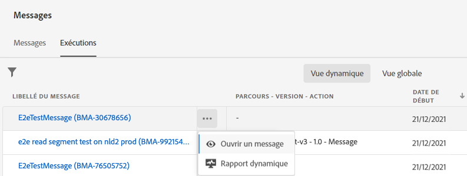
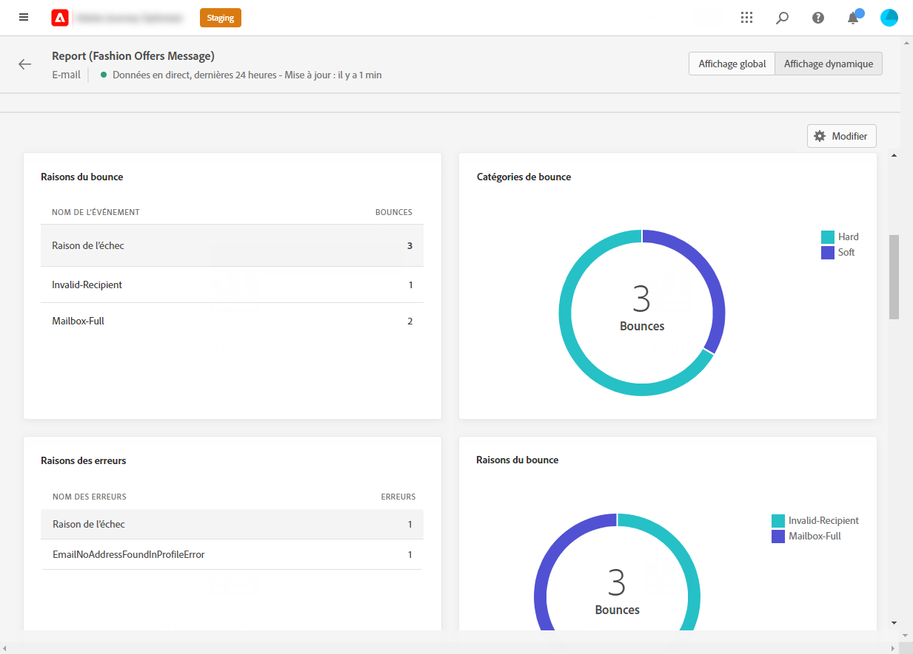
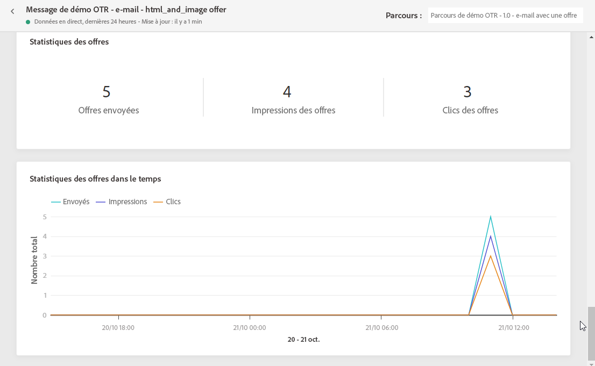

# Rapport dynamique sur les e-mails {#email-live-report}

Le **[!UICONTROL Rapport dynamique]** sur les e-mails ne cible qu’une diffusion email spécifique.

Dans l’onglet **[!UICONTROL Exécutions]** du menu **[!UICONTROL Messages]**, sélectionnez **[!UICONTROL Affichage dynamique]**, puis, dans le menu avancé de la diffusion sélectionnée, sélectionnez **[!UICONTROL Rapport dynamique]**.

Le **[!UICONTROL Rapport dynamique]** sur les e-mails est divisé en différents widgets indiquant le succès et les erreurs de votre diffusion. Chaque widget peut être redimensionné et supprimé en cas de besoin. Pour plus d’informations à ce sujet, consultez cette [section](live-report.md#modify-dashboard).

Les widgets **[!UICONTROL Performances des emails]** et **[!UICONTROL Résumé des emails]** présentent les principales informations relatives à votre message avec un graphique et des KPI :

* **[!UICONTROL Ciblés]** : nombre de profils utilisateur qui sont qualifiés en tant que profils cibles pour cette diffusion.

* **[!UICONTROL Envoyés]** : nombre total d&#39;envois pour la diffusion.

* **[!UICONTROL Délivrés]** : nombre de messages envoyés avec succès, par rapport au nombre total de messages envoyés.

* **[!UICONTROL Ouvertures]** : nombre d’ouvertures d’un message dans une diffusion.

* **[!UICONTROL Clics]** : nombre de clics sur un contenu dans une diffusion.

* **[!UICONTROL Bounces]** : nombre total d&#39;erreurs cumulées lors des diffusions et du traitement automatique des retours par rapport au nombre total de messages envoyés.

* **[!UICONTROL Erreurs]** : nombre total d&#39;erreurs survenues au cours d&#39;une diffusion, l&#39;empêchant d&#39;être envoyée à des profils.

* **[!UICONTROL Réclamations relatives aux spams]** : nombre de messages classés comme spam.

* **[!UICONTROL Désabonnements]** : nombre de clics sur le lien de désabonnement.

* **[!UICONTROL Exclus]** : nombre de profils utilisateur, exclus des profils ciblés, qui n’ont pas reçu le message.

Le widget **[!UICONTROL Statistiques d’envoi]** détaille le succès de votre diffusion :

* **[!UICONTROL Délivrés]** : nombre de messages envoyés avec succès, par rapport au nombre total de messages envoyés.

* **[!UICONTROL Bounces]** : nombre total d&#39;erreurs cumulées lors des diffusions et du traitement automatique des retours par rapport au nombre total de messages envoyés.

* **[!UICONTROL Erreurs]** : nombre total d’erreurs survenues au cours d’une diffusion, empêchant l’erreur d’être envoyée aux profils.

Le graphique et le tableau **[!UICONTROL Causes des erreurs]** vous permettent de voir quelle erreur s’est produite au cours de votre diffusion.

Les widgets **[!UICONTROL Causes des bounces]** et **[!UICONTROL Catégories de bounces]** contiennent les données disponibles relatives aux messages ayant fait l’objet d’un rebond, notamment :

* **[!UICONTROL Hard bounce]** : nombre total d&#39;erreurs permanentes, telles qu&#39;une adresse email incorrecte. Un message d&#39;erreur indique explicitement que l&#39;adresse n&#39;est pas valide, comme Utilisateur inconnu.

* **[!UICONTROL Soft bounces]** : nombre total d&#39;erreurs temporaires, telles qu&#39;une boîte de réception pleine.

* **[!UICONTROL Ignorées]** : nombre total d&#39;erreurs temporaires (par exemple, Absent(e) du bureau) ou techniques (par exemple, si le type d&#39;expéditeur est administrateur).

<!--

>[!NOTE]
>
>The Offers widgets and metrics are only available if a decision was inserted in an email. For more information on Decision Management, refer to this [page](../offers/get-started/starting-offer-decisioning.md).

The **[!UICONTROL Offers statistic]** and **[!UICONTROL Offers statistics]** over time widgets measure your offer's success and impact on your targeted audience. It detail the main information relative to your message with KPIs:

* **[!UICONTROL Offer sent]**: Total number of sends for the offer.

* **[!UICONTROL Offer impression]**: Number of times the offer was opened in a delivery.

* **[!UICONTROL Offer clicks]**: Number of times an offer was clicked on in a delivery.
-->
>[!NOTE]
>
>Les profils avec le statut **[!UICONTROL Supprimé]** ou **[!UICONTROL Non autorisé]** sont exclus pendant le processus d’envoi du message. Par conséquent, bien que les **rapports de parcours** indiquent que ces profils ont traversé le parcours ([Lecture de segment](../building-journeys/read-segment.md) et [Message](../building-journeys/journeys-message.md)), les **Rapports par e-mail** ne les incluront pas dans les mesures **[!UICONTROL Envoyés]** étant donné qu’ils sont filtrés avant l’envoi de l’e-mail.
>
>Pour en savoir plus, consultez [Liste de suppression](../reports/suppression-list.md) et [Liste autorisée](allow-list.md). Pour connaître la raison de tous les cas d’exclusion, vous pouvez utiliser le [service de requête d‘Adobe Experience Platform](https://experienceleague.adobe.com/docs/experience-platform/query/api/getting-started.html?lang=fr){target=&quot;_blank&quot;}.
