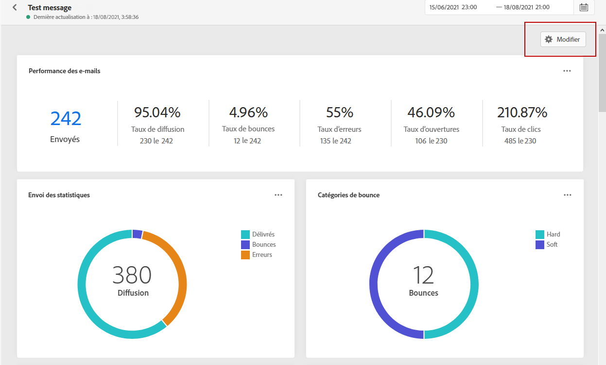
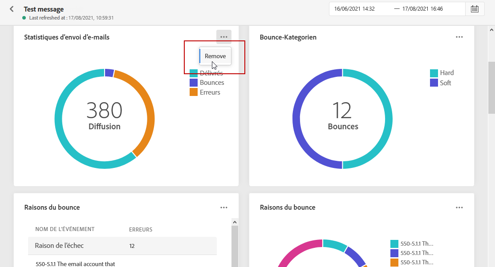

# Rapport global {#global-report}

>[!NOTE]
>
> Si des requêtes personnalisées sont effectuées par le biais d&#39;API lors de l&#39;utilisation du service Query, attendez-vous à une certaine attente pour vos rapports.

Le **[!UICONTROL rapport global]** vous permet de mesurer l&#39;impact de vos parcours et diffusions sur une période sélectionnée.

* Si vous souhaitez cibler un parcours ou des diffusions dans le contexte d&#39;un parcours, dans le menu **[!UICONTROL Parcours]**, accédez à votre parcours et cliquez sur l&#39;icône **[!UICONTROL Rapport global]**. Vous trouverez ensuite le **[!UICONTROL rapport global]** Parcours, Email et push.

* Si vous souhaitez cibler une diffusion spécifique, dans la **[!UICONTROL vue globale]** de l&#39;onglet **[!UICONTROL Exécutions]** de vos messages, sélectionnez **[!UICONTROL Rapport global]** dans le menu avancé de votre diffusion sélectionnée.

## Personnalisation du tableau de bord {#modify-dashboard}

Chaque tableau de bord de rapports peut être modifié en redimensionnant ou en supprimant des widgets ou en modifiant la période ciblée. La modification des widgets n&#39;a un impact que sur le tableau de bord de l&#39;utilisateur actuel. Les autres utilisateurs voient leurs propres tableaux de bord ou ceux définis par défaut.

1. Dans votre tableau de bord **[!UICONTROL Rapport global]**, cliquez sur le bouton du planificateur.

1. Sélectionnez les dates de début et de fin. Vous pouvez affiner davantage vos rapports en sélectionnant une **[!UICONTROL Heure de début]** et une **[!UICONTROL Heure de fin]**.

   

1. Cliquez sur **[!UICONTROL Modifier]**.

   

1. Ajustez la taille des widgets en faisant glisser leur coin inférieur droit.

   

1. Cliquez sur **[!UICONTROL Supprimer]** pour supprimer d&#39;autres widgets dont vous n&#39;avez pas besoin pour suivre les bounces.

   

1. Une fois satisfait de l&#39;ordre d&#39;affichage et de la taille de vos widgets, cliquez sur **[!UICONTROL Enregistrer]**.

Votre tableau de bord est maintenant enregistré. Vos différentes modifications seront réappliquées pour une utilisation ultérieure de vos rapports globaux. Si nécessaire, utilisez l&#39;option **[!UICONTROL Réinitialiser]** pour restaurer les widgets par défaut et l&#39;ordre des widgets.
