# Prise en main du rapport global {#global-report}

>[!AVAILABILITY]
>
>L’expérience actuelle de création de rapports sera abandonnée à compter de la version d’octobre. À partir de cette date, la nouvelle expérience de création de rapports deviendra la norme. Nous vous recommandons de vous familiariser avec les nouvelles fonctionnalités pour garantir une transition fluide. [Commencez avec la nouvelle interface de création de rapports de Journey Optimizer.](report-gs-cja.md)

>[!NOTE]
>
> Si des requêtes personnalisées sont effectuées par le biais d&#39;API lors de l&#39;utilisation du service Query, attendez-vous à une certaine attente pour vos rapports.

Le **[!UICONTROL rapport global]** vous permet de mesurer l&#39;impact de vos parcours et diffusions sur une période sélectionnée.

* Si vous souhaitez cibler un parcours ou des diffusions dans le contexte d’un parcours, dans le menu **[!UICONTROL Parcours]**, accédez à votre parcours et cliquez sur le bouton **[!UICONTROL Afficher le rapport]**. Vous trouverez ensuite les rapports globaux Parcours, E-mail, SMS et Push.

  

* Si vous souhaitez cibler une campagne, dans le menu **[!UICONTROL Campagnes]**, accédez à votre campagne et cliquez sur le bouton **[!UICONTROL Rapports]**.

  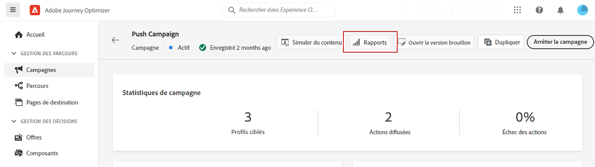

* Si vous souhaitez basculer du **[!UICONTROL Rapport dynamique]** au **[!UICONTROL Rapport global]** pour votre diffusion, cliquez sur **[!UICONTROL À toute heure]** dans le sélecteur d’onglets.

  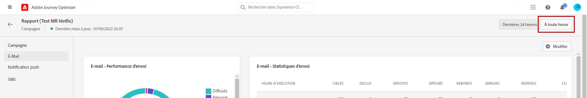

Pour obtenir la liste détaillée de chaque mesure disponible dans Adobe Journey Optimizer, reportez-vous à [cette page](#list-of-components-global).

## Personnalisation du tableau de bord {#modify-dashboard}

Chaque tableau de bord de reporting peut être modifié en modifiant la période et en redimensionnant ou en supprimant des widgets. La modification des widgets n&#39;a un impact que sur le tableau de bord de l&#39;utilisateur actuel. Les autres utilisateurs voient leurs propres tableaux de bord ou ceux définis par défaut.

1. Dans votre rapport global, sélectionnez une heure de début et une heure de fin pour cibler des données spécifiques.

   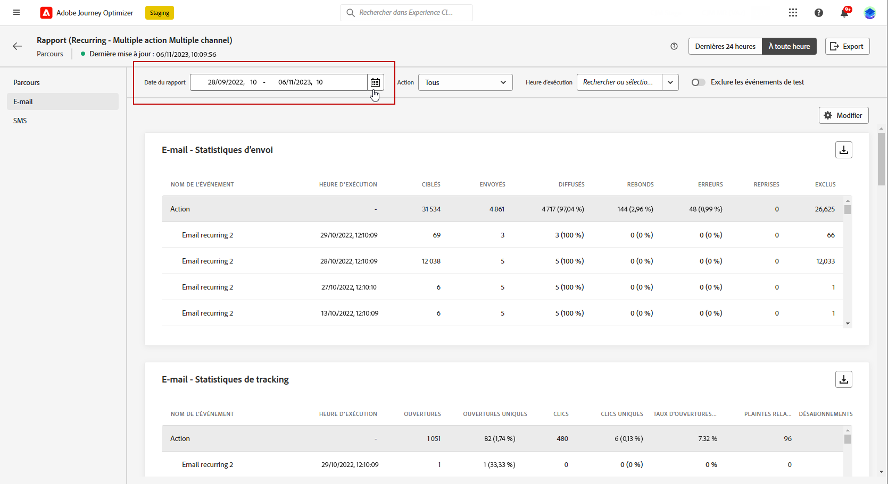

1. Pour les rapports de parcours qui impliquent plusieurs **[!UICONTROL Actions]**, sélectionnez une **[!UICONTROL Action]** dans le menu déroulant.

1. Si vous souhaitez ne cibler qu’un ou plusieurs messages récurrents, sélectionnez-les dans le menu déroulant **[!UICONTROL Heure d’exécution]**.

   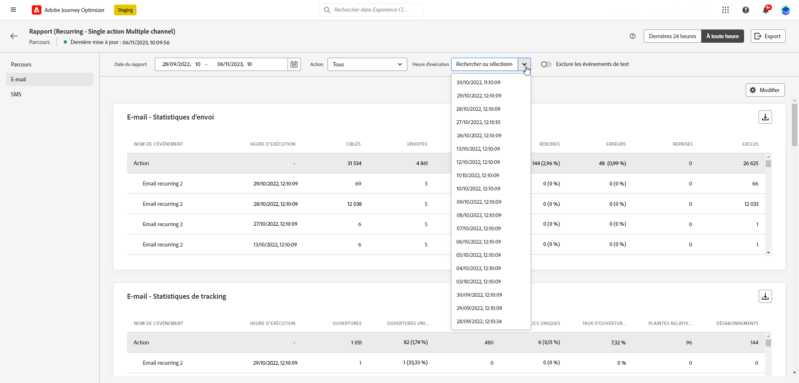

1. Choisissez si vous souhaitez exclure les événements de test de vos rapports avec la barre de bascule. Pour plus d’informations sur les événements de test, consultez [cette page](../building-journeys/testing-the-journey.md).

   Notez que l&#39;option **[!UICONTROL Exclure les événements de test]** n&#39;est disponible que pour les rapports de parcours.

   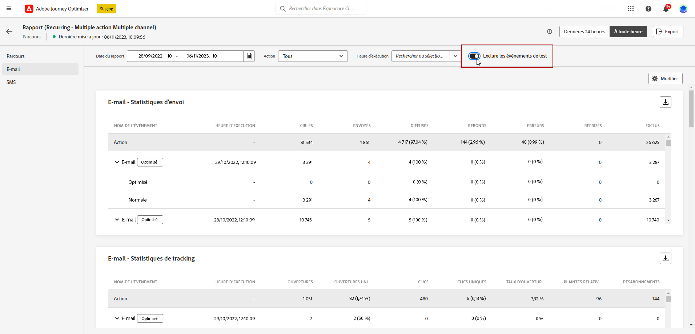

1. Cliquez sur **[!UICONTROL Modifier]** pour commencer à personnaliser votre tableau de bord.

   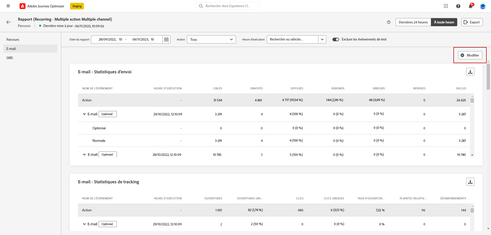

1. Ajustez la taille des widgets en faisant glisser leur coin inférieur droit.

   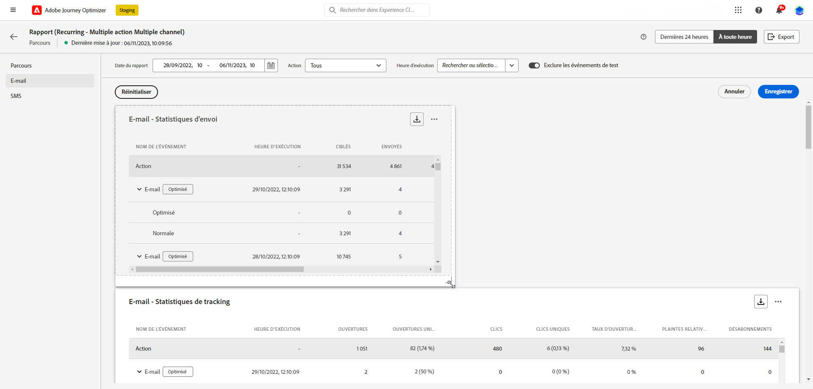

1. Cliquez sur **[!UICONTROL Supprimer]** pour supprimer tout widget dont vous n’avez pas besoin.

   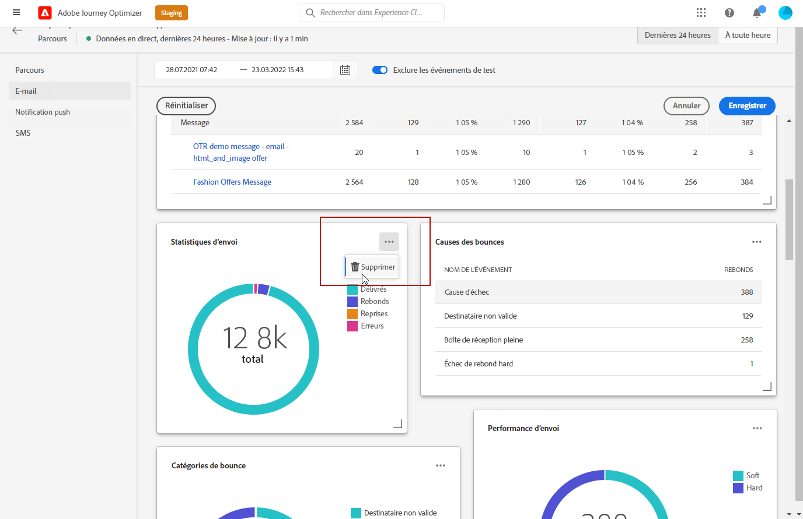

1. Une fois satisfait de l&#39;ordre d&#39;affichage et de la taille de vos widgets, cliquez sur **[!UICONTROL Enregistrer]**.

1. Pour personnaliser l’affichage de vos données, basculez entre les différentes options de visualisation disponibles, telles que les graphiques, les tableaux et les graphiques en anneau.

   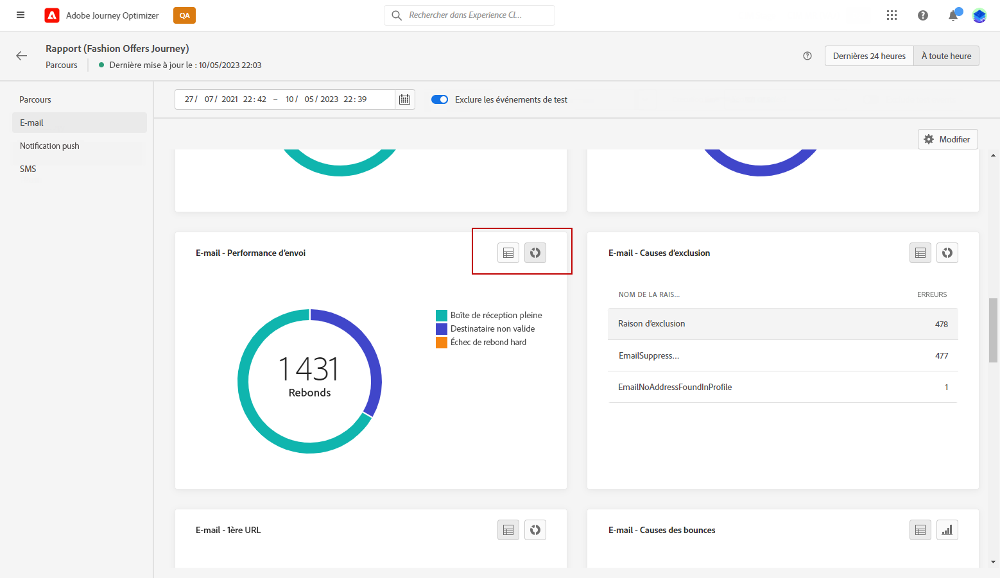

Votre tableau de bord est maintenant enregistré. Vos différentes modifications seront réappliquées pour une utilisation ultérieure de vos rapports dynamiques. Si nécessaire, utilisez l’option **[!UICONTROL Réinitialiser]** pour restaurer les widgets par défaut et leur ordre.

## Exporter vos rapports {#export-reports}

Vous pouvez facilement exporter vos différents rapports au format PDF ou CSV, ce qui vous permet de les partager ou de les imprimer. Les étapes d’export des rapports sont présentées dans les onglets ci-dessous.

➡️ [Découvrez cette fonctionnalité en vidéo](#video-csv)

>[!BEGINTABS]

>[!TAB Exporter votre rapport au format CSV]

1. Dans votre rapport, cliquez sur **[!UICONTROL Exporter]** et sélectionnez **[!UICONTROL Fichier CSV]** pour générer un fichier CSV au niveau du rapport global.

   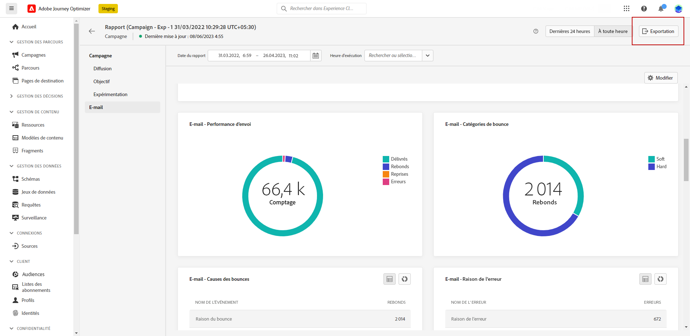

1. Vous pouvez également choisir d’exporter des données à partir d’un widget spécifique. Cliquez sur **[!UICONTROL Exporter des données de widget au format CSV]** en regard du widget sélectionné.

   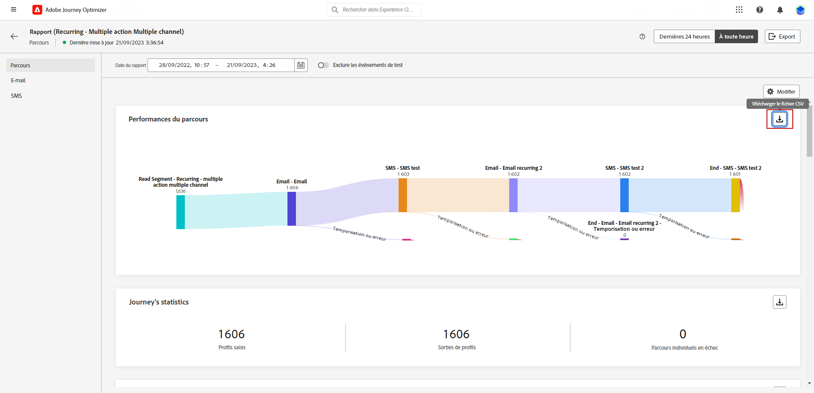

1. Votre fichier est automatiquement téléchargé et peut se trouver dans vos fichiers locaux.

   Si vous avez généré le fichier au niveau du rapport, il contient des informations détaillées pour chaque widget, notamment son titre et ses données.

   Si vous avez généré le fichier au niveau du widget, il fournit spécifiquement des données pour le widget sélectionné.

>[!TAB Exporter votre rapport au format PDF]

1. Dans votre rapport, cliquez sur **[!UICONTROL Exporter]** et sélectionnez **[!UICONTROL Fichier PDF]**.

   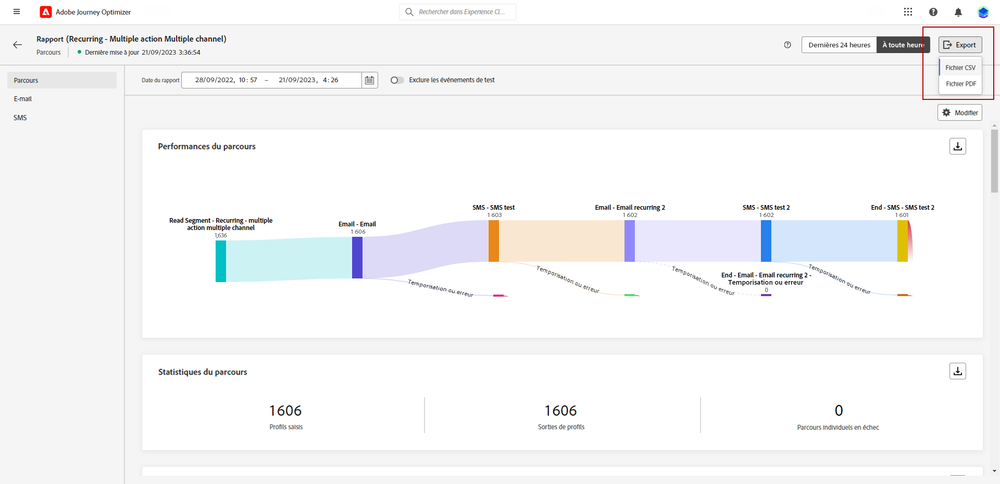

1. Dans la fenêtre Imprimer, configurez votre document selon vos besoins. Notez que les options peuvent varier en fonction de votre navigateur.

1. Choisissez d’imprimer ou d’enregistrer votre rapport en tant que PDF.

1. Localisez le dossier dans lequel vous souhaitez enregistrer votre fichier, renommez-le si nécessaire, puis cliquez sur Enregistrer.

Votre rapport peut maintenant être affiché ou partagé dans un fichier PDF.

>[!ENDTABS]

### Exporter des rapports (vidéo) {#video-csv}

Découvrez comment télécharger un rapport CSV pour un rapport et un widget unique dans la vidéo pratique suivante.

>[!VIDEO](https://video.tv.adobe.com/v/3424603?quality=12)

>[!CONTEXTUALHELP]
>id="ajo_report_campaign_ctr"
>title="CTR (taux de clics)"
>abstract="Widget CTR (taux de clics)"

>[!CONTEXTUALHELP]
>id="ajo_report_campaign_clicks"
>title="Clics"
>abstract="Widget Clics"

>[!CONTEXTUALHELP]
>id="ajo_report_campaign_delivered"
>title="Diffusés"
>abstract="Widget Diffusés"

>[!CONTEXTUALHELP]
>id="ajo_report_campaign_overview"
>title="Vue d’ensemble de la campagne"
>abstract="Widget Vue d’ensemble de la campagne"

>[!CONTEXTUALHELP]
>id="ajo_report_campaign_funnel"
>title="Entonnoir de résultats de la campagne"
>abstract="Widget Entonnoir de résultats de la campagne"

>[!CONTEXTUALHELP]
>id="ajo_report_campaign_tracking_link"
>title="Libellés des liens de suivi"
>abstract="Widget Libellés des liens de suivi"

>[!CONTEXTUALHELP]
>id="ajo_report_campaign_displays"
>title="Affichages"
>abstract="Widget Affichages"

<!--campaign email-->

>[!CONTEXTUALHELP]
>id="ajo_report_campaign_email_delivered_click"
>title="Tendances diffusés et clics"
>abstract="Widget Tendances diffusés et clics"

>[!CONTEXTUALHELP]
>id="ajo_report_campaign_email_delivery_status"
>title="Statut de la diffusion"
>abstract="Widget Statut de la diffusion"

>[!CONTEXTUALHELP]
>id="ajo_report_campaign_email_sending_statistics"
>title="Statistiques d’envoi"
>abstract="Widget Statistiques d’envoi"

>[!CONTEXTUALHELP]
>id="ajo_report_campaign_email_tracking_statistics"
>title="Statistiques de suivi"
>abstract="Widget Statistiques de suivi"

>[!CONTEXTUALHELP]
>id="ajo_report_campaign_email_domains"
>title="Domaines d’e-mails"
>abstract="Widget Domaines d’e-mails"

>[!CONTEXTUALHELP]
>id="ajo_report_campaign_email_tracked_link"
>title="Libellés des liens de suivi"
>abstract="Widget Libellés des liens de suivi"

>[!CONTEXTUALHELP]
>id="ajo_report_campaign_email_tracked_link_urls"
>title="URL des liens de suivi"
>abstract="Widget URL des liens de suivi"

>[!CONTEXTUALHELP]
>id="ajo_report_campaign_email_subjects"
>title="Objets des e-mails"
>abstract="Widget Objets des e-mails"

>[!CONTEXTUALHELP]
>id="ajo_report_campaign_email_bounce_reasons"
>title="Raisons des rebonds"
>abstract="Widget Raisons des rebonds"

>[!CONTEXTUALHELP]
>id="ajo_report_campaign_email_exclude"
>title="Raisons des exclusions"
>abstract="Widget Raisons des exclusions"

>[!CONTEXTUALHELP]
>id="ajo_report_campaign_email_error"
>title="Raisons des erreurs"
>abstract="Widget Raisons des erreurs"

<!--campaign push-->

>[!CONTEXTUALHELP]
>id="ajo_report_campaign_push_sending_statistics"
>title="Statistiques d’envoi"
>abstract="Widget Statistiques d’envoi"

>[!CONTEXTUALHELP]
>id="ajo_report_campaign_push_tracking_statistics"
>title="Statistiques de suivi"
>abstract="Widget Statistiques de suivi"

>[!CONTEXTUALHELP]
>id="ajo_report_campaign_push_tracked_link"
>title="Libellés des liens de suivi"
>abstract="Widget Libellés des liens de suivi"

>[!CONTEXTUALHELP]
>id="ajo_report_campaign_push_tracked_link_urls"
>title="URL des liens de suivi"
>abstract="Widget URL des liens de suivi"

>[!CONTEXTUALHELP]
>id="ajo_report_campaign_push_bounce_reasons"
>title="Raisons des rebonds"
>abstract="Widget Raisons des rebonds"

>[!CONTEXTUALHELP]
>id="ajo_report_campaign_push_exclude"
>title="Causes d’exclusion"
>abstract="Widget Causes d’exclusion"

>[!CONTEXTUALHELP]
>id="ajo_report_campaign_push_email_error"
>title="Raisons des erreurs"
>abstract="Widget Raisons des erreurs"

<!--campaign inapp-->

>[!CONTEXTUALHELP]
>id="ajo_report_campaign_inapp_impression"
>title="Tendances impressions et clics"
>abstract="Widget Tendances impressions et clics"

>[!CONTEXTUALHELP]
>id="ajo_report_campaign_inapp_clicks"
>title="Clics"
>abstract="Widget Clics"

>[!CONTEXTUALHELP]
>id="ajo_report_campaign_inapp_displays"
>title="Affichages"
>abstract="Widget Affichages"

>[!CONTEXTUALHELP]
>id="ajo_report_campaign_inapp_tracking_data"
>title="Suivi des données"
>abstract="Widget Suivi des données"

>[!CONTEXTUALHELP]
>id="ajo_report_campaign_inapp_tracked_link"
>title="Libellés des liens de suivi"
>abstract="Widget Libellés des liens de suivi"

>[!CONTEXTUALHELP]
>id="ajo_report_campaign_inapp_tracked_link_urls"
>title="URL des liens de suivi"
>abstract="Widget URL des liens de suivi"

<!--campaign sms-->

>[!CONTEXTUALHELP]
>id="ajo_report_campaign_sms_delivered_click"
>title="Tendances diffusés et clics"
>abstract="Widget Tendances diffusés et clics"

>[!CONTEXTUALHELP]
>id="ajo_report_campaign_sms_delivery_status"
>title="Statut de la diffusion"
>abstract="Widget Statut de la diffusion"

>[!CONTEXTUALHELP]
>id="ajo_report_campaign_sms_tracked_link"
>title="Libellés des liens de suivi"
>abstract="Widget Libellés des liens de suivi"

>[!CONTEXTUALHELP]
>id="ajo_report_campaign_sms_tracked_link_urls"
>title="URL des liens de suivi"
>abstract="Widget URL des liens de suivi"

>[!CONTEXTUALHELP]
>id="ajo_report_campaign_sms_inbound"
>title="Message SMS entrant"
>abstract="Widget Message SMS entrant"

>[!CONTEXTUALHELP]
>id="ajo_report_campaign_sms_message_type"
>title="Type de message SMS"
>abstract="Widget Type de message SMS"

>[!CONTEXTUALHELP]
>id="ajo_report_campaign_sms_providers"
>title="Fournisseurs de SMS"
>abstract="Widget Fournisseurs de SMS"

>[!CONTEXTUALHELP]
>id="ajo_report_campaign_sms_bounce"
>title="Raisons des rebonds"
>abstract="Widget Raisons des rebonds"

>[!CONTEXTUALHELP]
>id="ajo_report_campaign_sms_exclude"
>title="Raisons des exclusions"
>abstract="Widget Raisons des exclusions"

>[!CONTEXTUALHELP]
>id="ajo_report_campaign_sms_error"
>title="Raisons des erreurs"
>abstract="Widget Raisons des erreurs"
