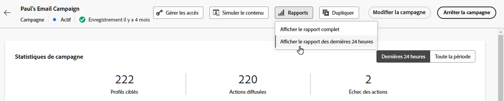

# Prise en main du rapport global {#global-report}

>[!NOTE]
>
> Si des requêtes personnalisées sont effectuées par le biais d’API lors de l’utilisation du service Query, attendez-vous à un certain délai pour vos rapports.

Utilisez la variable **[!UICONTROL Global report]** pour mesurer l’impact de vos parcours et diffusions sur une période sélectionnée.

* Si vous souhaitez cibler un ou plusieurs parcours dans le cadre d’un parcours, à partir de la variable **[!UICONTROL Journeys]** , accédez à votre parcours, puis cliquez sur **[!UICONTROL View report]** bouton . Vous trouverez ensuite les rapports globaux Parcours, Email, SMS et Push .

   

* Si vous souhaitez cibler une campagne, dans la variable **[!UICONTROL Campaigns]** , accédez à votre campagne et cliquez sur le bouton **[!UICONTROL Reports]** bouton .

   

* Si vous souhaitez basculer entre le **[!UICONTROL Live report]** au **[!UICONTROL Global report]** pour votre diffusion, cliquez sur **[!UICONTROL All time]** dans le sélecteur d’onglets.

   

Pour obtenir la liste détaillée de chaque mesure disponible dans Adobe Journey Optimizer, reportez-vous à la section [cette page](#list-of-components-global)

## Personnalisation du tableau de bord {#modify-dashboard}

Chaque tableau de bord de rapports peut être modifié en modifiant la période et en redimensionnant ou en supprimant des widgets. La modification des widgets n’a un impact que sur le tableau de bord de l’utilisateur actuel. Les autres utilisateurs verront leurs propres tableaux de bord ou ceux définis par défaut.

1. Dans votre rapport Global , sélectionnez une heure de début et une heure de fin pour cibler des données spécifiques.

   

1. Choisissez si vous souhaitez exclure les événements de test de vos rapports avec la barre de bascule. Pour plus d’informations sur les événements de test, reportez-vous à la section [cette page](../building-journeys/testing-the-journey.md).

   Notez que la variable **[!UICONTROL Exclude test events]** n’est disponible que pour les rapports Parcours.

   

1. Cliquez sur **[!UICONTROL Modify]** pour commencer à personnaliser votre tableau de bord.

   

1. Ajustez la taille des widgets en faisant glisser son coin inférieur droit.

   

1. Cliquez sur **[!UICONTROL Remove]** pour supprimer tout widget dont vous n’avez pas besoin.

   

1. Une fois que vous êtes satisfait de l’ordre d’affichage et de la taille de vos widgets, cliquez sur **[!UICONTROL Save]**.

Votre tableau de bord est maintenant enregistré. Vos différentes modifications seront réappliquées pour une utilisation ultérieure de vos rapports actifs. Si nécessaire, utilisez la méthode **[!UICONTROL Reset]** pour restaurer l’ordre des widgets et des widgets par défaut.

## Liste des composants {#list-of-components-global}

Les tableaux ci-dessous contiennent la liste des mesures utilisées dans les rapports et leurs définitions en fonction du type de diffusion.

### Mesures de parcours {#journey-metrics}

<table> 
 <thead> 
  <tr> 
   <th> Mesure  </th> 
   <th> Définition  </th> 
</tr>
 </thead> 
 <tbody> 
  <tr> 
   <td>Actions exécutées  </td> 
   <td> Nombre total d’actions exécutées avec succès pour un parcours.  </td> 
</tr> 
  <tr> 
   <td> Profils entrés  </td> 
   <td> Nombre total d’individus ayant atteint l’événement d’entrée du parcours.  </td> 
</tr>
  <tr> 
   <td> Erreur lors de l’action  </td> 
   <td>Nombre total d’erreurs qui se sont produites pour les actions.  </td> 
</tr> 
  <tr> 
   <td> Profils sortis  </td> 
   <td> Nombre total d’individus ayant quitté le parcours.  </td> 
</tr> 
  <tr> 
   <td> Échec du parcours individuel  </td> 
   <td> Nombre total de parcours individuels qui n’ont pas été exécutés avec succès.  </td> 
</tr> 
 </tbody> 
</table>

### Mesures Email et SMS {#email-and-sms-metrics}

<table> 
 <thead> 
  <tr> 
   <th> Mesure  </th> 
   <th> Définition  </th> 
</tr>
 </thead> 
 <tbody>
  <tr> 
   <td> Rebonds  </td> 
   <td> Nombre total d'erreurs cumulées lors des diffusions et du traitement automatique des retours par rapport au nombre total de messages envoyés.  </td> 
</tr> 
  <tr> 
   <td> Taux de rebond  </td> 
   <td> Pourcentage d'emails qui ont fait l'objet d'un bounce par rapport au nombre d'emails envoyés.  </td> 
</tr>
  <tr> 
   <td> Clics  </td> 
   <td> Nombre de clics sur un contenu dans un email.  </td> 
</tr> 
  <tr> 
   <td> Délivrés   </td> 
   <td> Nombre de messages envoyés avec succès, par rapport au nombre total de messages envoyés. </td> 
</tr> 
  <tr> 
   <td> Taux de diffusion  </td> 
   <td> Pourcentage de messages envoyés avec succès.  </td> 
</tr>
  <tr> 
   <td> Erreurs  </td> 
   <td> Nombre total d'erreurs qui se sont produites au cours d'une diffusion et qui l'ont empêché d'être envoyée aux profils.  </td> 
</tr> 
  <tr> 
   <td> Taux d’erreur  </td> 
   <td> Pourcentage d'erreurs qui se sont produites pendant une diffusion empêchant son envoi par rapport au nombre d'emails envoyés.  </td> 
</tr>
  <tr> 
   <td> Exclu  </td> 
   <td> Nombre de profils qui ont été exclus par Adobe Journey Optimizer.  </td> 
</tr>
  <tr> 
   <td> Hard bounce  </td> 
   <td> Nombre total d’erreurs permanentes, telles qu’une adresse email incorrecte. Il s’agit d’un message d’erreur indiquant explicitement que l’adresse n’est pas valide, tel qu’Utilisateur inconnu.  </td>
</tr>
  <tr> 
   <td> Ignoré  </td> 
   <td> Nombre total de messages temporaires, tels que Absence du bureau, ou une erreur technique, par exemple si le type d’expéditeur est Postmaster.  </td> 
</tr>
   <tr> 
   <td>Taux de clics des offres  </td> 
   <td>Pourcentage d'utilisateurs ayant interagi avec l'offre.  </td> 
</tr>
   <tr> 
   <td>Taux d'impression des offres  </td> 
   <td>Pourcentage d'offres ouvertes par rapport au nombre d'offres envoyées.  </td> 
</tr>
   <tr> 
   <td>Nom de l’offre  </td> 
   <td> Nom de l'offre ajoutée dans la diffusion. Pour plus d’informations sur l’emplacement, reportez-vous à cette section <a href="../offers/offer-library/creating-personalized-offers.md">page</a>.  </td> 
</tr>
   <tr> 
   <td>Offre envoyée  </td> 
   <td>Nombre total d'envois pour l'offre.  </td> 
</tr> 
  <tr>
   <td>Ouvertures  </td> 
   <td> Nombre d’ouvertures du message.  </td> 
</tr> 
  <tr> 
   <td> Taux d’ouverture  </td> 
   <td> Nombre total d'emails ouverts par rapport au nombre d'emails délivrés.  </td> 
</tr>
  <tr> 
   <td>Nom de l’emplacement  </td> 
   <td> Nom de l’emplacement utilisé pour afficher votre offre. Pour plus d’informations sur l’emplacement, reportez-vous à cette section <a href="../offers/offer-library/creating-placements.md">page</a>. </td> 
</tr> 
  <tr> 
   <td> Reprises  </td> 
   <td> Nombre de courriers électroniques dans la file d’attente pour les reprises.  </td> 
</tr> 
  <tr> 
   <td> Envoyé  </td> 
   <td> Nombre total d'envois pour la diffusion.  </td> 
</tr>
  <tr> 
   <td> Soft bounce  </td> 
   <td> Nombre total d’erreurs temporaires, telles qu’une boîte de réception pleine.  </td> 
</tr>
  <tr> 
   <td> Demandes de spam  </td> 
   <td> Nombre de fois où un message a été déclaré comme spam ou courrier indésirable.  </td> 
</tr>
  <tr> 
   <td> Ciblés  </td> 
   <td> Nombre total de messages traités lors de l'analyse de la diffusion.  </td> 
</tr> 
  <tr> 
   <td> Clics uniques  </td> 
   <td> Nombre de destinataires ayant cliqué sur un contenu dans un email.  </td> 
</tr> 
  <tr> 
   <td>Taux de clics uniques  </td> 
   <td> Pourcentage d'utilisateurs ayant interagi avec la diffusion.  </td> 
</tr>
  <tr> 
   <td> Ouvertures uniques  </td> 
   <td>Nombre de destinataires ayant ouvert la diffusion.  </td> 
</tr> 
  <tr> 
   <td> Désabonnements  </td> 
   <td> Nombre de clics sur le lien de désinscription.  </td> 
</tr> 
 </tbody> 
</table>

<!--
### Experimentation metrics {#experimentation-metrics}
<table> 
 <thead> 
  <tr> 
   <th> Metric  </th> 
   <th> Definition  </th> 
</tr>
 </thead> 
 <tbody>
  <tr> 
   <td>App installs  </td> 
   <td>  </td> 
</tr>
  <tr> 
   <td>App launches  </td> 
   <td>  </td> 
</tr>
 <tr> 
   <td>Average lift  </td> 
   <td> Percentage improvement in conversion rate of a given treatment over the baseline.<a href="../campaigns/experiment-calculations.md#understand-lift">Learn more</a>.  </td> 
  </tr>
  <tr> 
   <td>Confidence  </td> 
   <td>Evidence that a given treatment is the same as the baseline treatment. <a href="../campaigns/experiment-calculations.md#understand-confidence">Learn more</a>.  </td> 
</tr>
  <tr> 
   <td>Confidence interval  </td> 
   <td>Percentage difference in performance between the baseline and the best performing treatment. <a href="../campaigns/experiment-calculations.md#understand-intervals">Learn more</a>.  </td> 
</tr> 
  <tr> 
   <td>Count per profile  </td> 
   <td>Total value of the Experiment objective metric divided by the number of profiles.  </td> 
</tr>
  <tr> 
   <td>Email Opens  </td> 
   <td>.  </td> 
</tr>
  <tr> 
   <td>Email Unsubscribes  </td> 
   <td>  </td> 
</tr>
  <tr> 
   <td>First app launches  </td> 
   <td>  </td> 
</tr>
  <tr> 
   <td>Outbound Clicks  </td> 
   <td>  </td> 
</tr>
  <tr> 
   <td>Profiles  </td> 
   <td>Number of profiles targeted for this treatment.  </td> 
</tr>
  <tr> 
   <td>Unique email opens  </td> 
   <td>  </td>
<tr>
  <tr> 
   <td>Unique email unsubscribes  </td> 
   <td>  </td>
</tr>
  <tr> 
   <td>Unique installs  </td> 
   <td>  </td> 
</tr>
  <tr> 
   <td>Unique launches  </td> 
   <td>  </td> 
</tr> 
  <tr> 
   <td>Unique outbound clicks  </td> 
   <td>  </td> 
</tr>
  <tr> 
   <td>Unique upgrades  </td> 
   <td>  </td> 
</tr>
   <td>Upgrades  </td> 
   <td>  </td> 
</tr> 
</tbody> 
</table>
-->

### Mesures des notifications push

<table> 
 <thead> 
  <tr> 
   <th> Mesure  </th> 
   <th> Définition  </th> 
</tr>
 </thead> 
 <tbody>
 <tr> 
   <td>Actions  </td> 
   <td> Nombre total d'actions sur la notification push diffusée, par exemple clic sur un bouton ou rejet.  </td> 
</tr>
  <tr> 
   <td>Rebonds  </td> 
   <td> Nombre total d'erreurs cumulées lors des diffusions et du traitement automatique des retours par rapport au nombre total de messages envoyés.  </td> 
</tr> 
  <tr> 
   <td> Taux de rebond  </td> 
   <td> Pourcentage de notifications push qui ont fait l'objet d'un bounce par rapport au nombre de notifications push envoyées.  </td>
</tr>
  <tr> 
   <td> Délivrés  </td> 
   <td> Nombre de messages envoyés avec succès, par rapport au nombre total de messages envoyés.  </td> 
</tr> 
  <tr> 
   <td> Taux de diffusion  </td> 
   <td> Pourcentage de notifications push envoyées avec succès.  </td> 
</tr>
  <tr> 
   <td>Engagements  </td> 
   <td> Nombre total d'ouvertures et d'actions pour cette notification push, c'est-à-dire si le profil a ouvert la notification push ou si un utilisateur a cliqué sur un bouton.  </td> 
</tr> 
  <tr> 
   <td> Taux d’engagement  </td> 
   <td> Pourcentage d'ouvertures et d'actions pour cette notification push, c'est-à-dire si le profil a ouvert la notification push ou si un utilisateur a cliqué sur un bouton.  </td> 
</tr>
  <tr> 
   <td> Erreurs  </td> 
   <td> Nombre total d'erreurs qui se sont produites au cours d'une diffusion et qui l'ont empêché d'être envoyée aux profils.  </td> 
</tr>
  <tr> 
   <td> Taux d’erreur  </td> 
   <td> Pourcentage d'erreurs qui se sont produites pendant une diffusion empêchant son envoi par rapport au nombre de notifications push envoyées.  </td> 
</tr> 
  <tr> 
   <td> Exclu  </td> 
   <td> Nombre de profils qui ont été exclus par Adobe Journey Optimizer.  </td> 
</tr>
  <tr> 
   <td> Ouvertures  </td> 
   <td> Nombre total de notifications push diffusées sur l’appareil et ayant fait l’objet d’un clic par les utilisateurs ouvrant ainsi l’application. Cette mesure est similaire au Clic push, sauf qu’une Ouverture push ne sera pas déclenchée si la notification a été ignorée.  </td> 
</tr> 
  <tr> 
   <td> Taux d'ouverture  </td> 
   <td> Pourcentage de notifications push ouvertes.  </td> 
</tr> 
  <tr> 
   <td> Envoyé  </td> 
   <td> Nombre total d'envois pour la diffusion.  </td> 
</tr> 
  <tr> 
   <td> Ciblés  </td> 
   <td> Nombre total de messages push traités lors de l'analyse de la diffusion.  </td> 
</tr>  
 </tbody> 
</table>

### Mesures de landing page {#landing-page-metrics}

<table> 
 <thead> 
  <tr> 
   <th> Mesure  </th> 
   <th> Définition  </th> 
</tr>
 </thead> 
 <tbody>
 <tr> 
  <td>Rebonds  </td> 
   <td>Nombre de personnes qui n’ont pas interagi avec la landing page et n’ont pas effectué l’action d’inscription.  </td> 
</tr>
 <tr> 
   <td>Taux de rebond  </td> 
   <td>Nombre de personnes qui n'ont pas interagi avec la landing page et n'ont pas effectué l'action d'inscription, par rapport au nombre total de visites.  </td> 
</tr>
 <tr>
  <tr> 
   <td>Clics  </td> 
   <td>Nombre de clics sur un contenu dans la landing page.  </td> 
</tr>
 <tr> 
   <td>Taux de clics  </td> 
   <td>Pourcentage de clics dans la landing page.  </td>
</tr>
<tr>
<td>Conversion  </td> 
   <td>Nombre de personnes ayant interagi avec la landing page, par exemple inscrites à un formulaire.  </td> 
</tr>
<tr>
   <td>Taux de conversion  </td> 
   <td>Nombre de personnes ayant interagi avec la landing page, par exemple inscrites à un formulaire, par rapport au nombre total de visites.  </td> 
</tr>
 <tr> 
   <td>Parcours  </td> 
   <td>Nombre de visites de votre page d’entrée provenant d’un parcours.  </td> 
</tr>
 <tr> 
   <td>Autres sources  </td> 
   <td>Nombre de visites de votre page d’entrée provenant d’une source externe plutôt que d’un parcours.  </td> 
</tr>
 <tr> 
   <td>Nombre total de visites  </td> 
   <td> Nombre total de visites de votre landing page provenant de parcours et de sources externes, y compris plusieurs visites d’un seul destinataire.  </td> 
</tr>
 <tr> 
   <td>Visiteurs uniques  </td> 
   <td>Nombre de personnes ayant consulté votre landing page, plusieurs visites d'un même destinataire ne sont pas prises en compte.  </td> 
</tr>
 <tr> 
   <td>Visites  </td> 
   <td>Nombre de visites sur votre landing page, y compris plusieurs visites d’un seul destinataire.  </td> 
</tr>
 </tbody> 
</table>

### Mesures des notifications push

<table> 
 <thead> 
  <tr> 
   <th> Mesure  </th> 
   <th> Définition  </th> 
</tr>
 </thead> 
 <tbody>
 <tr> 
   <td>Actions  </td> 
   <td> Nombre total d'actions sur la notification push diffusée, par exemple clic sur un bouton ou rejet.  </td> 
</tr>
  <tr> 
   <td>Rebonds  </td> 
   <td> Nombre total d'erreurs cumulées lors des diffusions et du traitement automatique des retours par rapport au nombre total de messages envoyés.  </td> 
</tr> 
  <tr> 
   <td> Taux de rebond  </td> 
   <td> Pourcentage de notifications push qui ont fait l'objet d'un bounce par rapport au nombre de notifications push envoyées.  </td>
</tr>
  <tr> 
   <td> Délivrés  </td> 
   <td> Nombre de messages envoyés avec succès, par rapport au nombre total de messages envoyés.  </td> 
</tr> 
  <tr> 
   <td> Taux de diffusion  </td> 
   <td> Pourcentage de notifications push envoyées avec succès.  </td> 
</tr>
  <tr> 
   <td>Engagements  </td> 
   <td> Nombre total d'ouvertures et d'actions pour cette notification push, c'est-à-dire si le profil a ouvert la notification push ou si un utilisateur a cliqué sur un bouton.  </td> 
</tr> 
  <tr> 
   <td> Taux d’engagement  </td> 
   <td> Pourcentage d'ouvertures et d'actions pour cette notification push, c'est-à-dire si le profil a ouvert la notification push ou si un utilisateur a cliqué sur un bouton.  </td> 
</tr>
  <tr> 
   <td> Erreurs  </td> 
   <td> Nombre total d'erreurs qui se sont produites au cours d'une diffusion et qui l'ont empêché d'être envoyée aux profils.  </td> 
</tr>
  <tr> 
   <td> Taux d’erreur  </td> 
   <td> Pourcentage d'erreurs qui se sont produites pendant une diffusion empêchant son envoi par rapport au nombre de notifications push envoyées.  </td> 
</tr> 
  <tr> 
   <td> Exclu  </td> 
   <td> Nombre de profils qui ont été exclus par Adobe Journey Optimizer.  </td> 
</tr>
  <tr> 
   <td> Ouvertures  </td> 
   <td> Nombre total de notifications push diffusées sur l’appareil et ayant fait l’objet d’un clic par les utilisateurs ouvrant ainsi l’application. Cette mesure est similaire au Clic push, sauf qu’une Ouverture push ne sera pas déclenchée si la notification a été ignorée.  </td> 
</tr> 
  <tr> 
   <td> Taux d'ouverture  </td> 
   <td> Pourcentage de notifications push ouvertes.  </td> 
</tr> 
  <tr> 
   <td> Envoyé  </td> 
   <td> Nombre total d'envois pour la diffusion.  </td> 
</tr> 
  <tr> 
   <td> Ciblés  </td> 
   <td> Nombre total de messages push traités lors de l'analyse de la diffusion.  </td> 
</tr>  
 </tbody> 
</table>

<!--
### In-app metrics {#inapp-metrics}
<table> 
 <thead> 
  <tr> 
   <th> Metric  </th> 
   <th> Definition  </th> 
</tr>
 </thead> 
 <tbody>
 <tr> 
   <td>Clicks  </td> 
   <td>Total number of recipients who interacted with the buttons included in the In-app message.  </td> 
</tr>
  <tr> 
   <td>Click rate  </td> 
   <td>Percentage of users who interacted with the buttons included in the In-app message compared to users who saw the message.  </td> 
</tr> 
  <tr> 
   <td>Dismiss rate  </td> 
   <td> Percentage of In-app messages that recipients dismissed.  </td> 
</tr> 
  <tr> 
   <td>Impressions  </td> 
   <td> Total number of In-app messages delivered to all users.  </td>
</tr>
  <tr> 
   <td>Unique impressions  </td> 
   <td>Number of unique users to whom the In-app message was delivered.  </td>
</tr>
 </tbody> 
</table>
-->
