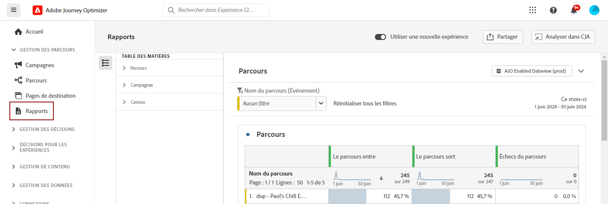

# Commencer avec les fonctionnalités de création de rapports {#get-started-report}

Adobe Journey Optimizer vous fournit des informations exploitables grâce à ses puissantes fonctionnalités de création de rapports. Les rapports sont disponibles pour les campagnes, les parcours, les pages de destination, les listes d’abonnements, etc. Les rapports disponibles sont répertoriés ci-dessous.

Pour optimiser la délivrabilité de vos expériences [!DNL Journey Optimizer], nous vous recommandons d’observer les bonnes pratiques répertoriées dans [cette section](deliverability.md).

## Types de rapports {#reporting-types}

* **Rapports en temps réel sur les dernières 24 heures** - Utilisez le **[!UICONTROL rapport en temps réel]** pour mesurer et visualiser en temps réel l’impact et les performances de vos parcours et de vos messages dans un tableau de bord intégré. Les données sont disponibles dans le **[!UICONTROL rapport en temps réel]** dès que votre diffusion est envoyée ou que votre parcours est exécuté à partir de l’onglet **[!UICONTROL Dernières 24 heures]**. En savoir plus sur les rapports en temps réel dans [cette section](live-report.md).

  

* **Rapports sur la durée entière avec Customer Journey Analytics** - La création de rapports Journey Optimizer est entièrement intégrée aux fonctionnalités de Customer Journey Analytics, permettant ainsi de normaliser la création de rapports sur les deux plateformes et d’améliorer la cohérence et la fiabilité des données. L’intégration transparente entre Journey Optimizer et Customer Journey Analytics fournit une meilleure visibilité des mesures de performance, ce qui aide les utilisateurs et les utilisatrices à prendre des décisions plus éclairées. En savoir plus sur les rapports sur la durée entière dans [cette section](report-gs-cja.md).

  

  Si vous possédez une licence Adobe Customer Journey Analytics, vous pouvez analyser vos rapports Journey Optimizer dans Customer Journey Analytics. Cette puissante option vous redirige de manière transparente vers votre environnement Customer Journey Analytics, ce qui vous permet de personnaliser vos rapports en détails. Intégrez des mesures avancées de Customer Journey Analytics dans vos widgets pour enrichir vos informations et les rendre encore plus pertinentes. [En savoir plus](report-cja-manage.md)

## Explorons plus en détail

Maintenant que vous avez une compréhension des concepts liés aux types de rapports dans **[!DNL Journey Optimizer]**, il est temps d’explorer plus en détail les sections de documentation suivantes pour découvrir comment accéder aux fonctionnalités de création de rapports et comprendre leurs principes.

<table style="table-layout:fixed"><tr style="border: 0;">
<td>

<strong>RAPPORTS DE PARCOURS</strong>

<a href="journey-live-report.md"><strong>Rapport en temps réel</strong></a>

<a href="journey-global-report-cja.md"><strong>Rapport sur la durée entière</strong></a>

<a href="sharing-overview.md"><strong>Créer des rapports de parcours</strong></a>

</td>
<td>

<strong>RAPPORTS DE CAMPAGNE</strong>

<a href="campaign-live-report.md"><strong>Rapport en temps réel</strong></a>

<a href="campaign-global-report-cja.md"><strong>Rapport sur la durée entière</strong></a>

</td>
<td>

<strong>RAPPORTS DE PAGES DE DESTINATION</strong>

<a href="lp-report-live.md"><strong>Rapport en temps réel</strong></a>

<a href="lp-report-global-cja.md"><strong>Rapport sur la durée entière</strong></a>

</td>
<td>

<strong>RAPPORTS SUR LES LISTES D’ABONNEMENTS</strong>

<a href="subscription-report-live.md"><strong>Rapport en temps réel</strong></a>

<a href="subscription-report-global-cja.md"><strong>Rapport sur la durée entière</strong></a>

</td>
</tr></table>

Les rapports globaux sur la durée entière sont disponibles pour tous vos canaux. Sélectionnez le rapport du canal dont vous avez besoin afin d’obtenir plus de détails.

### Rapports pour les canaux sortants

Sélectionnez un canal sortant pour découvrir les **rapports globaux sur la durée entière** associés.

<table style="table-layout:fixed"><tr style="border: 0;">
<td>

<strong>Canal e-mail</strong>

<a href="campaign-global-report-cja-email.md"><strong>Rapport de campagne</strong></a>

<a href="journey-global-report-cja-email.md"><strong>Rapport de parcours</strong></a>

</td>
<td>

<strong>Canal SMS</strong>

<a href="campaign-global-report-cja-sms.md"><strong>Rapport de campagne</strong></a>

<a href="journey-global-report-cja-sms.md"><strong>Rapport de parcours</strong></a>

</td>
<td>

<strong>Canal de notification push</strong>

<a href="campaign-global-report-cja-push.md"><strong>Rapport de campagne</strong></a>

<a href="journey-global-report-cja-push.md"><strong>Rapport de parcours</strong></a>

</td>
<td>

<strong>Canal courrier</strong>

<a href="campaign-global-report-cja-direct.md"><strong>Rapport de campagne</strong></a>

<a href="journey-global-report-cja-direct.md"><strong>Rapport de parcours</strong></a>

</td>
</tr></table>

### Rapports pour les expériences entrantes

Sélectionnez une expérience entrante pour découvrir les **rapports globaux sur la durée entière** associés.

<table style="table-layout:fixed"><tr style="border: 0;">
<td>

<strong>Canal in-app</strong>

<a href="campaign-global-report-cja-inapp.md"><strong>Rapport de campagne</strong></a>

<a href="journey-global-report-cja-inapp.md"><strong>Rapport de parcours</strong></a>

</td>
<td>

<strong>Canal web</strong>

<a href="campaign-global-report-cja-web.md"><strong>Rapport de campagne</strong></a>

<a href="journey-global-report-cja-web.md"><strong>Rapport de parcours</strong></a>

</td>
<td>

<strong>Expériences basées sur du code</strong>

<a href="campaign-global-report-cja-code.md"><strong>Rapport de campagne</strong></a>

<a href="campaign-global-report-cja-code.md"><strong>Rapport de parcours</strong></a>

</td>
<td>

<strong>Cartes de contenu</strong>

<a href="campaign-global-report-cja-content.md"><strong>Rapport de campagne</strong></a>

<a href="journey-global-report-cja-content.md"><strong>Rapport de parcours</strong></a>

</td>
</tr></table>

### Vidéo pratique {#video}

Découvrez comment utiliser efficacement le rapport complet dans Adobe Journey Optimizer.

+++Regarder la vidéo

>[!VIDEO](https://video.tv.adobe.com/v/3422694?captions=fre_fr&learn=on)

+++

Découvrez d’autres tutoriels vidéo sur la création e rapports et l’analyse dans les [tutoriels sur la création de rapports](https://experienceleague.adobe.com/fr/docs/journey-optimizer-learn/tutorials/report-and-monitor/report-and-monitor){target="_blank"}.
