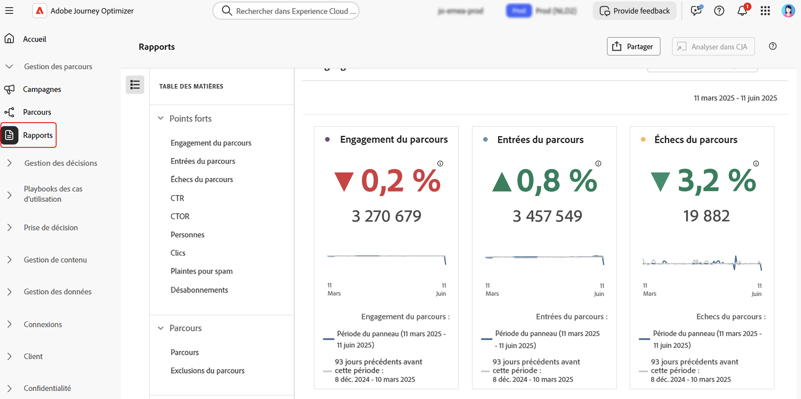

# Prise en main des fonctionnalités de reporting et de surveillance {#get-started-report}

Adobe Journey Optimizer vous offre des informations exploitables grâce à ses puissantes fonctionnalités de création de rapports. Les rapports sont disponibles pour les campagnes, les parcours, les pages de destination, les listes d’abonnements, etc. Les rapports disponibles sont répertoriés ci-dessous.

En outre, pour optimiser la délivrabilité de vos expériences [!DNL Journey Optimizer], nous vous recommandons d’observer les bonnes pratiques répertoriées [dans cette section](deliverability.md).

## Types de rapports {#reporting-types}

* **Derniers rapports dynamiques sur 24 heures** - Utilisez le **[!UICONTROL rapport dynamique]** pour mesurer et visualiser en temps réel l’impact et les performances de vos parcours et de vos messages dans un tableau de bord intégré. Les données sont disponibles dans le **[!UICONTROL Rapport dynamique]** dès que votre diffusion est envoyée ou que votre parcours est exécuté dans l’onglet **[!UICONTROL Dernières 24 heures]**. En savoir plus sur les rapports dynamiques [dans cette section](live-report.md).

  

* **Rapports à tout moment avec Customer Journey Analytics** - La création de rapports Journey Optimizer est entièrement intégrée aux fonctionnalités de Customer Journey Analytics, ce qui permet de normaliser les rapports sur les deux plateformes et d’améliorer la cohérence et la fiabilité des données. Cette intégration transparente entre Journey Optimizer et Customer Journey Analytics offre une vue plus claire des mesures de performances, ce qui permet aux utilisateurs et aux utilisatrices de prendre des décisions plus éclairées. En savoir plus sur les rapports à tout moment [dans cette section](report-gs-cja.md).

  

  Si vous possédez une licence Adobe Customer Journey Analytics, vous pouvez analyser vos rapports Journey Optimizer dans Customer Journey Analytics. Cette puissante option vous redirige en toute transparence vers votre environnement Customer Journey Analytics, ce qui vous permet de personnaliser considérablement vos rapports. Vous pouvez enrichir vos widgets avec des mesures Customer Journey Analytics spécialisées, ce qui vous permet de donner un tout autre niveau à vos informations. [En savoir plus](report-cja-manage.md)

## Explorons plus en détail

Maintenant que vous connaissez les types de rapports disponibles dans **[!DNL Journey Optimizer]**, il est temps d’examiner plus en détail ces sections de documentation pour découvrir comment accéder aux fonctionnalités de création de rapports et les comprendre.

<table style="table-layout:fixed"><tr style="border: 0;">
<td>

<strong>RAPPORTS DE PARCOURS</strong>

<a href="journey-live-report.md"><strong> Rapport dynamique </strong></a>

<a href="journey-global-report-cja.md"><strong> Rapport à tout moment </strong></a>

<a href="sharing-overview.md"><strong>Création de rapports de parcours </strong></a>

</td>
<td>

<strong>RAPPORTS DE CAMPAGNE</strong>

<a href="campaign-live-report.md"><strong> Rapport dynamique </strong></a>

<a href="campaign-global-report-cja.md"><strong> Rapport à tout moment </strong></a>

</td>
<td>

<strong>RAPPORTS SUR LES PAGES DE DESTINATION</strong>

<a href="lp-report-live.md"><strong> Rapport dynamique </strong></a>

<a href="lp-report-global-cja.md"><strong> Rapport à tout moment </strong></a>

</td>
<td>

<strong>RAPPORTS DE LISTE D’ABONNEMENTS</strong>

<a href="subscription-report-live.md"><strong> Rapport dynamique </strong></a>

<a href="subscription-report-global-cja.md"><strong> Rapport à tout moment </strong></a>

</td>
</tr></table>

## Rapports à toute heure par canal

Sélectionnez un canal sortant pour découvrir les rapports globaux associés.

<table style="table-layout:fixed"><tr style="border: 0;">
<td>

<a href="campaign-global-report-cja-email.md"><strong>E-mail</strong></a>
</td>
<td>

<a href="campaign-global-report-cja-sms.md"><strong>SMS</strong></a>
</td>
<td>

<a href="campaign-global-report-cja-push.md"><strong>Notification push</strong></a>
</td>
<td>

<a href="campaign-global-report-cja-direct.md"><strong>Courrier</strong></a>
</td>
</tr></table>

Sélectionnez une expérience entrante pour découvrir les rapports globaux associés.

<table style="table-layout:fixed"><tr style="border: 0;">
<td>

<strong>Canal in-app</strong>

<a href="campaign-global-report-cja-inapp.md"><strong>Rapport de campagne</strong></a>

<a href="journey-global-report-cja-inapp.md"><strong>Rapport de parcours</strong></a>

</td>
<td>

<strong>Canal web</strong>

<a href="campaign-global-report-cja-web.md"><strong>Rapport de campagne</strong></a>

<a href="journey-global-report-cja-web.md"><strong>Rapport de parcours</strong></a>

</td>
<td>

<strong>Expériences basées sur du code</strong>

<a href="campaign-global-report-cja-code.md"><strong>Rapport de campagne</strong></a>

<a href="campaign-global-report-cja-code.md"><strong>Rapport de parcours</strong></a>

</td>
<td>

<strong>Cartes de contenu</strong>

<a href="campaign-global-report-cja-content.md"><strong>Rapport de campagne</strong></a>

<a href="journey-global-report-cja-content.md"><strong>Rapport de parcours</strong></a>

</td>
</tr></table>
