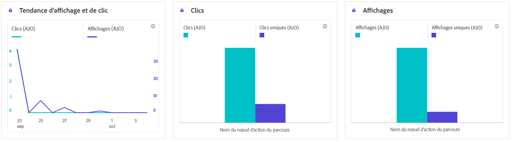
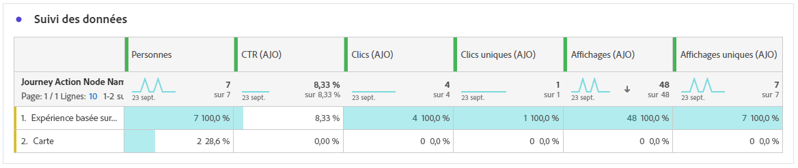

# Rapport de parcours basé sur du code {#journey-global-report}

>[!INFO]
>
> Votre rapport de parcours peut afficher simultanément des informations provenant de plusieurs parcours, car les utilisateurs et utilisatrices peuvent être impliqués dans plusieurs parcours à la fois. Par conséquent, les communications entrantes (in-app, web et basées sur le code) peuvent apparaître dans plusieurs parcours si elles ont été déclenchées pour une personne participant à des parcours actifs simultanés, ce qui peut entraîner un chevauchement des données.

>[!BEGINSHADEBOX]

Vous pouvez accéder à votre rapport de parcours basé sur du code en cliquant sur le bouton **[!UICONTROL Afficher le rapport]** dans votre parcours. [En savoir plus](report-gs-cja.md)

>[!ENDSHADEBOX]

>[!NOTE]
>
>Les expériences basées sur du code fonctionnent comme des interactions entrantes dans lesquelles les utilisateurs s’inscrivent en accédant à votre site ou à votre application. Par conséquent, les mesures **Ciblées** ou **Audience**, qui effectuent le suivi des profils choisis pour la diffusion des messages sortants, ne sont pas incrémentées pour les campagnes basées sur le code.

## Affichages et clics {#impressions-code}

Les graphiques **[!UICONTROL Affichages et clics]** présentent une analyse détaillée de l’engagement de vos profils avec vos expériences basées sur du code, offrant des informations précieuses sur la manière dont les profils interagissent avec votre contenu.

+++ En savoir plus sur les mesures des impressions et des clics

* **[!UICONTROL Clics uniques]** : nombre de profils qui ont cliqué sur un contenu dans vos expériences.

* **[!UICONTROL Clics]** : nombre de clics sur un contenu dans vos expériences.

* **[!UICONTROL Affichages]** : nombre dʼouvertures de l’expérience.

* **[!UICONTROL Affichages uniques]** : nombre dʼouvertures de l’expérience, les multiples interactions dʼun même profil ne sont pas prises en compte.

+++

## Données de suivi {#track-data-code}

Le tableau **[!UICONTROL Données de suivi]** offre un instantané détaillé de l’activité de profil liée à vos expériences basées sur du code, fournissant des informations essentielles sur l’engagement et l’efficacité des expériences.

+++ En savoir plus sur les mesures de données de tracking

* **[!UICONTROL Personnes]** : nombre de profils d’utilisateurs et d’utilisatrices qui sont qualifiés en tant que profils cibles pour vos expériences.

* **[!UICONTROL Taux de clics (CTR)]** : pourcentage d’utilisateurs et d’utilisatrices ayant interagi avec vos expériences.

* **[!UICONTROL Clics]** : nombre de clics sur un contenu dans vos expériences.

* **[!UICONTROL Clics uniques]** : nombre de profils qui ont cliqué sur un contenu dans vos expériences.

* **[!UICONTROL Affichages]** : nombre dʼouvertures de votre expérience.

* **[!UICONTROL Affichages uniques]** : nombre dʼouvertures de votre expérience, les multiples interactions dʼun même profil ne sont pas prises en compte.

+++

## Libellés des liens de suivi {#track-link-code}

Le tableau **[!UICONTROL Libellés des liens de suivi]** fournit une vue d’ensemble complète des libellés des liens dans vos expériences basées sur du code qui génèrent le plus de trafic de visiteurs et de visiteuses. Cette fonctionnalité vous permet d’identifier et de hiérarchiser les liens les plus populaires.

+++ En savoir plus sur les mesures des libellés des liens de suivi

* **[!UICONTROL Clics uniques]** : nombre de profils qui ont cliqué sur un contenu dans vos expériences basées sur du code.

* **[!UICONTROL Clics]** : nombre de clics sur un contenu dans vos expériences basées sur du code.

* **[!UICONTROL Affichages]** : nombre dʼouvertures de l’expérience.

* **[!UICONTROL Affichages uniques]** : nombre dʼouvertures de l’expérience, les multiples interactions dʼun même profil ne sont pas prises en compte.

+++
