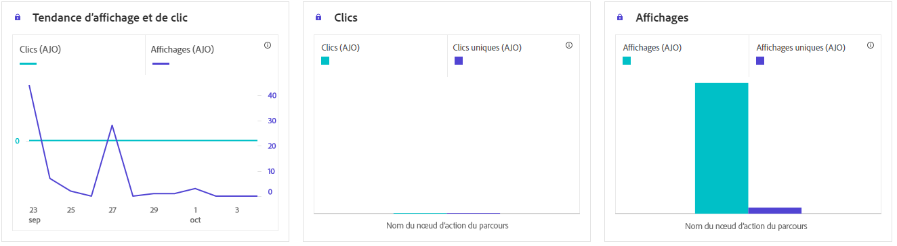

# Rapport de parcours de carte de contenu {#journey-global-report}

>[!BEGINSHADEBOX]

Vous pouvez accéder à votre rapport parcours de carte de contenu en cliquant sur le bouton **[!UICONTROL Afficher le rapport]** au sein de votre parcours. [En savoir plus](report-gs-cja.md)

>[!ENDSHADEBOX]

## Affichages et clics {#displays-content-card}

Les graphiques **[!UICONTROL Affichages et clics]** présentent une analyse détaillée de l’engagement de vos profils avec vos cartes de contenu, offrant des informations précieuses sur la manière dont les profils interagissent avec votre contenu.

+++ En savoir plus sur les mesures sur les affichages et les clics

* **[!UICONTROL Clics uniques]** : nombre de profils qui ont cliqué sur un contenu dans vos cartes de contenu.

* **[!UICONTROL Clics]** : nombre de fois où un contenu a fait l’objet d’un clic dans vos cartes de contenu.

* **[!UICONTROL Affichages]** : nombre dʼouvertures de votre carte de contenu.

* **[!UICONTROL Affichages uniques]** : nombre dʼouvertures de la carte de contenu, les multiples interactions dʼun même profil ne sont pas prises en compte.

+++

## Données de suivi {#track-data-content}

Le tableau **[!UICONTROL Données de suivi]** offre un instantané détaillé de l’activité de profil liée à vos cartes de contenu, fournissant des informations essentielles sur l’engagement et l’efficacité des expériences.

+++ En savoir plus sur les mesures de données de suivi

* **[!UICONTROL Personnes]** : nombre de profils d’utilisateurs et d’utilisatrices qui sont qualifiés en tant que profils cibles pour vos cartes de contenu.

* **[!UICONTROL Taux de clics (CTR)]** : pourcentage d’utilisateurs et d’utilisatrices ayant interagi avec vos cartes de contenu.

* **[!UICONTROL Clics]** : nombre de fois où un contenu a fait l’objet d’un clic dans vos cartes de contenu.

* **[!UICONTROL Clics uniques]** : nombre de profils qui ont cliqué sur un contenu dans vos cartes de contenu.

* **[!UICONTROL Affichages]** : nombre dʼouvertures de votre carte de contenu.

* **[!UICONTROL Affichages uniques]** : nombre dʼouvertures de votre carte de contenu, les multiples interactions dʼun même profil ne sont pas prises en compte.

+++

## Libellés des liens de suivi {#track-link-content}

Le tableau **[!UICONTROL Libellés des liens de suivi]** offre une vue d’ensemble complète des libellés des liens dans vos cartes de contenu, mettant en évidence ceux qui génèrent le plus de trafic de visiteurs et visiteuses. Cette fonctionnalité vous permet d’identifier et de hiérarchiser les liens les plus populaires.

+++ En savoir plus sur les mesures des libellés des liens de suivi

* **[!UICONTROL Clics uniques]** : nombre de profils qui ont cliqué sur un contenu dans vos cartes de contenu.

* **[!UICONTROL Clics]** : nombre de fois où un contenu a fait l’objet d’un clic dans vos cartes de contenu.

* **[!UICONTROL Affichages]** : nombre dʼouvertures de la carte de contenu.

* **[!UICONTROL Affichages uniques]** : nombre dʼouvertures de la carte de contenu, les multiples interactions dʼun même profil ne sont pas prises en compte.

+++
