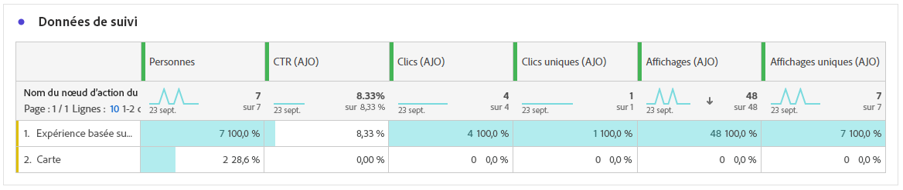

# Rapport parcours de carte de contenu {#journey-global-report}

## Afficher et cliquer {#displays-content-card}

Les graphiques **[!UICONTROL Display &amp; Click]** présentent une analyse détaillée de l’engagement de vos profils avec vos cartes de contenu, offrant des informations précieuses sur la manière dont les profils interagissent avec votre contenu.

+++ En savoir plus sur les mesures Affichages et Clics

* **[!UICONTROL Clics uniques]** : nombre de profils ayant cliqué sur un contenu dans vos cartes de contenu.

* **[!UICONTROL Clics]** : nombre de clics sur un contenu dans vos cartes de contenu.

* **[!UICONTROL Affichages]** : nombre de fois où votre carte de contenu a été ouverte.

* **[!UICONTROL Affichages uniques]** : nombre de fois où la carte Contenu a été ouverte, plusieurs interactions d’un profil ne sont pas prises en compte.

+++

## Données de suivi {#track-data-content}

La table **[!UICONTROL Données de suivi]** offre un instantané détaillé de l’activité de profil liée à vos cartes de contenu, fournissant des informations essentielles sur l’engagement et l’efficacité des expériences.

+++ En savoir plus sur les mesures de données de suivi

* **[!UICONTROL Personnes]** : nombre de profils utilisateur qualifiés comme profils cibles pour vos cartes de contenu.

* **[!UICONTROL Taux de clics (CTR)]** : pourcentage d’utilisateurs ayant interagi avec vos cartes de contenu.

* **[!UICONTROL Clics]** : nombre de clics sur un contenu dans vos cartes de contenu.

* **[!UICONTROL Clics uniques]** : nombre de profils ayant cliqué sur un contenu dans vos cartes de contenu.

* **[!UICONTROL Affichages]** : nombre de fois où votre carte de contenu a été ouverte.

* **[!UICONTROL Affichages uniques]** : nombre de fois où votre carte de contenu a été ouverte, plusieurs interactions d’un profil ne sont pas prises en compte.

+++

## Libellés des liens de suivi {#track-link-content}

La table **[!UICONTROL Libellés de liens trackés]** offre un aperçu complet des libellés de liens dans vos cartes Contenu, en mettant en évidence ceux qui génèrent le plus fort trafic de visiteurs. Cette fonctionnalité vous permet d’identifier et de hiérarchiser les liens les plus populaires.

+++ En savoir plus sur les mesures des libellés des liens de suivi

* **[!UICONTROL Clics uniques]** : nombre de profils ayant cliqué sur un contenu dans vos cartes de contenu.

* **[!UICONTROL Clics]** : nombre de clics sur un contenu dans vos cartes de contenu.

* **[!UICONTROL Affichages]** : nombre de fois où la carte Contenu a été ouverte.

* **[!UICONTROL Affichages uniques]** : nombre de fois où la carte Contenu a été ouverte, plusieurs interactions d’un profil ne sont pas prises en compte.

+++
