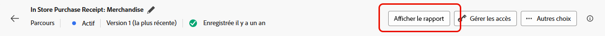

# Rapport de parcours d’e-mail {#journey-global-report}

>[!INFO]
>
>Depuis qu’Apple a introduit de nouvelles fonctionnalités de protection de la confidentialité pour son application Mail native, notamment la protection de la confidentialité dans Mail, les expéditeurs et expéditrices ne sont plus en mesure d’utiliser les pixels de suivi pour collecter des données sur les profils qui ont activé la protection de la confidentialité dans l’application Mail d’Apple. Par conséquent, la capacité d’Adobe Journey Optimizer à suivre les ouvertures d’e-mail à l’aide de pixels de suivi peut être affectée.
> [En savoir plus](https://experienceleaguecommunities.adobe.com/t5/adobe-campaign-classic-blogs/the-impact-of-apple-ios-privacy-changes-on-email-marketing-and/ba-p/699780?profile.language=fr) sur l’impact des modifications apportées à la confidentialité d’Apple iOS sur le marketing par e-mail.
> 
> Nous vous recommandons de vous concentrer sur les clics et les mesures de conversion plutôt que sur les taux d’ouverture pour obtenir des informations plus précises.

>[!BEGINSHADEBOX]

Vous pouvez accéder à votre rapport de parcours par e-mail en cliquant sur le bouton **[!UICONTROL Afficher le rapport]** dans votre parcours. [En savoir plus](report-gs-cja.md)

>[!ENDSHADEBOX]

## Tendance diffusés et clics {#delivered-click}

Le graphe **[!UICONTROL Tendances diffusés et clics]** présente une analyse détaillée de l’engagement de vos profils vis-à-vis de vos e-mails, offrant des informations précieuses sur l’intéraction de différents domaines avec votre contenu.

+++ En savoir plus sur les mesures de tendance Diffusés et clics

* **[!UICONTROL Diffusés]** : nombre d’e-mails envoyés avec succès, par rapport au nombre total d’e-mails envoyés.

* **[!UICONTROL Clics]** : nombre de clics sur un contenu dans vos e-mails.

+++

## Statut de la diffusion {#delivery-status}

Le graphe **[!UICONTROL Statut de diffusion]** vous permet de visualiser les performances de vos e-mails en un coup d’œil. Effectuez le suivi des mesures clés telles que les diffusions et les rebonds, afin de comprendre rapidement l’efficacité du parcours de vos e-mails.

+++ En savoir plus sur les mesures de statut de la diffusion

* **[!UICONTROL Diffusés]** : nombre d’e-mails envoyés avec succès, par rapport au nombre total d’e-mails envoyés.

* **[!UICONTROL Rebonds pour les canaux sortants]** : nombre total d’erreurs cumulées lors de la procédure d’envoi et du traitement automatique des retours par rapport au nombre total de messages envoyés.

* **[!UICONTROL Erreurs sortantes]** : nombre total d’erreurs survenues au cours de la procédure d’envoi, empêchant l’envoi à des profils.

* **[!UICONTROL Exclus]** : nombre de profils qui ont été exclus par Adobe Journey Optimizer.

+++

## Statistiques d’envoi {#email-sending-statistics}

Le tableau **[!UICONTROL Statistiques d’envoi]** vous aide à comprendre les performances de vos e-mails dans vos parcours. Il suit des mesures clés telles que les taux de diffusion et les interactions, ce qui vous donne des informations précieuses pour optimiser votre stratégie d’envoi d’e-mails afin d’améliorer la portée et l’engagement.

+++ En savoir plus sur les mesures de statistiques d’envoi

* **[!UICONTROL Ciblés]** : nombre de profils qui remplissent les critères de l’audience avant l’application des exclusions, des suppressions ou des suppressions de consentement. Dans les parcours dont la rentrée est activée, un profil peut être ciblé plusieurs fois.

* **[!UICONTROL Envois]** : nombre total d’e-mails envoyés.

* **[!UICONTROL Diffusés]** : nombre d’e-mails envoyés avec succès, par rapport au nombre total de messages envoyés.

* **[!UICONTROL Diffusés uniques]** : nombre de profils ayant reçu au moins un e-mail.

* **[!UICONTROL Rebonds pour les canaux sortants]** : nombre total d’erreurs cumulées lors de la procédure d’envoi et du traitement automatique des retours par rapport au nombre total de messages envoyés.

* **[!UICONTROL Erreurs sortantes]** : nombre total d’erreurs survenues au cours de la procédure d’envoi, empêchant le message d’être envoyé à des profils.

* **[!UICONTROL Exclusions sortantes]** : nombre de profils qui ont été exclus par Adobe Journey Optimizer.

+++

## E-mail - Statistiques de tracking {#email-tracking}

Le tableau **[!UICONTROL E-mail – Statistiques de tracking]** offre un compte rendu détaillé de l’activité de profil associée aux e-mails inclus dans votre parcours. Cela inclut des mesures sur les ouvertures, les clics et d’autres indicateurs d’engagement pertinents, offrant une vue d’ensemble complète de la manière dont les profils interagissent avec le contenu de vos e-mails.

+++ En savoir plus sur la mesure Statistiques de tracking

* **[!UICONTROL Taux de clics (CTR)]** : pourcentage d’utilisateurs et d’utilisatrices ayant interagi avec l’e-mail.

* **[!UICONTROL Taux d’ouverture par clic (CTOR)]** : nombre de fois où l’e-mail a été ouvert.

* **[!UICONTROL Clics]** : nombre de clics sur un contenu dans vos e-mails.

* **[!UICONTROL Clics uniques]** : nombre de profils qui ont cliqué sur un contenu dans un e-mail.

* **[!UICONTROL Ouvertures d’e-mail]** : nombre d’ouvertures de vos e-mails dans une campagne.

* **[!UICONTROL Ouvertures uniques d’e-mails]** : nombre de profils ayant ouvert des e-mails.

* **[!UICONTROL Plaintes relatives aux spams]** : nombre de fois où un message a été déclaré comme spam ou courrier indésirable.

* **[!UICONTROL Désabonnements]** : nombre de clics sur le lien de désabonnement.

* **[!UICONTROL Désabonnements uniques des e-mails]** : nombre de profils qui se sont désabonnés de vos e-mails.
+++

## Domaines d’e-mails {#email-domains}

Le tableau **[!UICONTROL Domaines des e-mails]** offre une répartition très détaillée des e-mails classés par domaine, ce qui permet d’obtenir des informations précises sur les mesures de performance des parcours de vos e-mails. Cette analyse exhaustive vous permet de comprendre le comportement de différents domaines en réponse au contenu de vos e-mails.

+++ En savoir plus sur les mesures des domaines d’e-mails

* **[!UICONTROL Envois]** : nombre total d’e-mails envoyés.

* **[!UICONTROL Diffusés]** : nombre d’e-mails envoyés avec succès, par rapport au nombre total d’e-mails envoyés.

* **[!UICONTROL Ouvertures d’e-mails]**: nombre d’ouvertures de vos e-mails dans un parcours.

* **[!UICONTROL Clics]** : nombre de clics sur un contenu dans vos e-mails.

* **[!UICONTROL Rebonds pour les canaux sortants]** : nombre total d’erreurs cumulées lors de la procédure d’envoi et du traitement automatique des retours par rapport au nombre total d’e-mails envoyés.

* **[!UICONTROL Erreurs sortantes]** : nombre total d’erreurs survenues au cours de la procédure d’envoi, empêchant l’envoi à des profils.

* **[!UICONTROL Exclusions sortantes]** : nombre de profils qui ont été exclus par Adobe Journey Optimizer.

+++

## Libellés des liens de suivi {#track-link-label}

Le tableau **[!UICONTROL Libellés des liens de suivi]** fournit une vue d’ensemble complète des libellés des liens dans vos e-mails qui attirent le plus de visiteurs et de visiteuses. Cette fonctionnalité vous permet d’identifier et de hiérarchiser les liens les plus populaires.

+++ En savoir plus sur les mesures des libellés des liens de suivi

* **[!UICONTROL Clics uniques]** : nombre de profils qui ont cliqué sur un contenu dans un e-mail.

* **[!UICONTROL Clics]** : nombre de clics sur un contenu dans vos e-mails.

+++

## URL des liens de suivi {#track-link-url}

Le tableau **[!UICONTROL URL des liens de suivi]** fournit une vue d’ensemble complète des URL de votre e-mail qui attirent le plus de visiteurs et de visiteuses. Cela vous permet d’identifier et de hiérarchiser les liens les plus populaires, ce qui améliore votre compréhension de l’engagement des profils avec du contenu spécifique dans vos e-mails.

+++ En savoir plus sur les mesures des URL des liens de suivi

* **[!UICONTROL Clics uniques]** : nombre de profils qui ont cliqué sur un contenu dans un e-mail.

* **[!UICONTROL Clics]** : nombre de clics sur un contenu dans vos e-mails.

+++

## Objets des e-mails {#email-subject}

Le tableau **[!UICONTROL Objets des e-mails]** fournit une vue d’ensemble complète des objets des e-mails qui attirent le plus de visiteurs et de visiteuses. Cette ressource offre des informations précieuses sur la dynamique d’engagement des audiences.

+++ En savoir plus sur les mesures des objets des e-mails

* **[!UICONTROL Diffusés]** : nombre d’e-mails envoyés avec succès, par rapport au nombre total d’e-mails envoyés.

* **[!UICONTROL Diffusés uniques]** : nombre de profils différents ayant reçu au moins un e-mail, en veillant à ce que les doublons ne soient pas comptés.
+++

## Raisons de rebond {#email-bounce-reasons}

Le tableau **[!UICONTROL Raisons de rebond]** compile les données disponibles relatives aux rebonds de messages, fournissant des informations détaillées sur les raisons spécifiques des rebonds d’e-mails.

Pour plus d’informations sur les rebonds, consultez la page [Liste de suppression](../reports/suppression-list.md).

## Causes d’exclusion {#email-excluded}

Le tableau **[!UICONTROL Causes d’exclusion]** présente une vue d’ensemble complète des différents facteurs qui ont abouti à l’exclusion des profils d’utilisateurs et d’utilisatrices de l’audience ciblée, entraînant la non-réception du message.

Consultez [cette page](exclusion-list.md) pour la liste complète des causes d’exclusion.

## Raisons des erreurs {#email-errors}

Le tableau **[!UICONTROL Causes d’erreur]** offre une visibilité des erreurs spécifiques survenues pendant le processus d’envoi, fournissant des informations précieuses sur la nature et l’occurrence des erreurs.
