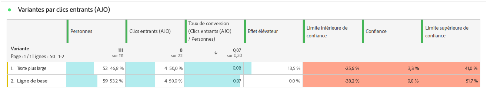

# Rapport parcours d’expérimentation {#campaign-global-report-cja-experimentation}

Votre rapport de Parcours vous donne une vue complète des performances de votre expérience, ainsi que les mesures clés dont vous avez besoin pour comprendre son impact.

Dans Journey Optimizer, l’expérimentation de parcours est divisée en deux types :

* [Expériences de contenu](../content-management/content-experiment.md)
* [Expériences de chemin](../building-journeys/optimize.md)

## Expérience de chemin {#experimentation}

>[!NOTE]
>
> Les tableaux et les KPI détaillés pour votre expérience de contenu sont les mêmes que ceux pour une expérience de chemin d’accès. Reportez-vous à la documentation ci-dessous si vous avez configuré une expérience de contenu.

### KPI d’expérimentation {#experimentation-kpis}

Le **résumé de l’expérience** fournit des informations clés sur les performances de votre expérience et identifie la plus réussie. Notez que la définition de la meilleure performance peut prendre un certain temps. Si votre expérience échoue, elle est définie sur **Non concluant**.

Les **indicateurs clés de performance d’expérimentation (KPI)** fonctionnent comme un tableau de bord global, fournissant une analyse des mesures essentielles associées à votre expérimentation.

+++ En savoir plus sur les mesures des KPI d’expérimentation

* **[!UICONTROL Effet élévateur]** : mesure de l’amélioration en pourcentage du taux de conversion d’un traitement donné par rapport à la ligne de base.

* **[!UICONTROL Confiance]** : preuves qu’un traitement donné est le même que le traitement de la ligne de base. [En savoir plus](../content-management/experiment-calculations.md#understand-confidence)

+++

### Variante par mesures de succès {#variant-inbound}

Le tableau **Variante par mesures de succès** indique les performances de chaque variante en fonction de la mesure de succès sélectionnée lors de la configuration de l’expérience.
Pour un examen approfondi de ces résultats et de leur interprétation, reportez-vous à [cette page](../content-management/get-started-experiment.md#interpret-results).

+++ En savoir plus sur la mesure Variante par succès .

* **[!UICONTROL Personnes]** : nombre de profils d’utilisateurs et d’utilisatrices qui sont qualifiés en tant que profils cibles pour vos messages.

* **[!UICONTROL Clics entrants]** : valeur totale de la mesure de succès, précédemment sélectionnée lors de la création de vos expériences.

* **[!UICONTROL Taux de conversion]** : valeur totale de la mesure de succès, précédemment sélectionnée lors de la création de vos expériences, divisée par le nombre de profils.

* **[!UICONTROL Effet élévateur]** : mesure de l’amélioration en pourcentage du taux de conversion d’un traitement donné par rapport à la ligne de base.

* **[!UICONTROL Limite inférieure de confiance]** : valeur estimée la plus basse de la différence de taux de conversion entre le traitement et la ligne de base, dans l’intervalle de confiance choisi.

* **[!UICONTROL Confiance]** : preuves qu’un traitement donné est le même que le traitement de la ligne de base. [En savoir plus](../content-management/experiment-calculations.md#understand-confidence)

* **[!UICONTROL Limite supérieure de confiance]** : valeur estimée la plus élevée de la différence de taux de conversion entre le traitement et la ligne de base, dans l’intervalle de confiance choisi.

+++

### Taux de conversion de la mesure de succès {#conversion-rate}

Le graphique **[!UICONTROL Intervalle de confiance]** indique la plage d’améliorations possibles, en comparant la ligne de base avec le traitement le plus performant pour la mesure de succès choisie. [En savoir plus](../content-management/experiment-calculations.md#confidence-intervals).
