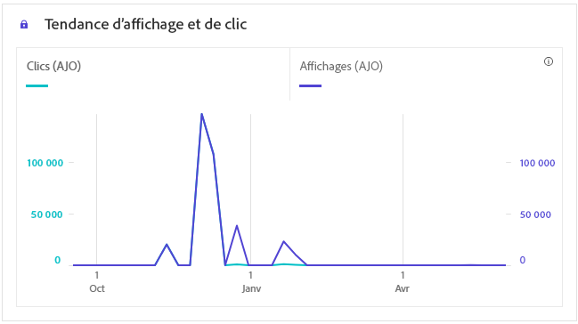

# Rapport de parcours in-app {#journey-global-report}

>[!INFO]
>
>Votre rapport de parcours peut afficher simultanément des informations provenant de plusieurs parcours, car les utilisateurs et utilisatrices peuvent être impliqués dans plusieurs parcours à la fois. Par conséquent, les communications entrantes (in-app, web et basées sur le code) peuvent apparaître dans plusieurs parcours si elles ont été déclenchées pour une personne participant à des parcours actifs simultanés, ce qui peut entraîner un chevauchement des données.

>[!BEGINSHADEBOX]

Vous pouvez accéder à votre rapport de parcours in-app en cliquant sur le bouton **[!UICONTROL Rapports]** dans votre parcours. [En savoir plus](report-gs-cja.md)

>[!ENDSHADEBOX]

## Tendance des affichages et des clics {#display-click-trend}

Le graphique **[!UICONTROL Tendance d’affichage et de clic]** présente une analyse détaillée de l’engagement de vos profils avec vos messages in-app, offrant des informations précieuses sur la manière dont les profils interagissent avec votre contenu.

+++ En savoir plus sur les mesures de tendance Afficher et cliquer .

* **[!UICONTROL Clics]** : nombre de fois où un contenu a fait l’objet d’un clic dans vos messages in-app.

* **[!UICONTROL Affichages]** : nombre d’ouvertures du message.

+++

## Clics {#clicks-inapp}

Le graphe **[!UICONTROL Clics]** affiche les mesures des clics in-app, qui illustrent à la fois le nombre total de clics sur le contenu et le nombre de profils uniques ayant cliqué sur le contenu.

+++ En savoir plus sur les mesures de clics

* **[!UICONTROL Clics uniques]** : nombre de profils qui ont cliqué sur un contenu dans vos messages in-app.

* **[!UICONTROL Clics]** : nombre de fois où un contenu a fait l’objet d’un clic dans vos messages in-app.

+++

## Affichage {#display-inapp}

Le graphique **[!UICONTROL Affichages]** vous permet de comprendre à la fois la portée globale du message et le nombre de profils uniques qui interagissent avec lui.

+++ En savoir plus sur les mesures d’affichage

* **[!UICONTROL Affichages]** : nombre d’ouvertures du message.

* **[!UICONTROL Affichages uniques]** : nombre dʼouvertures du message, les multiples interactions dʼun même profil ne sont pas prises en compte.

+++

## Données de suivi {#tracking-data-inapp}

Le tableau **[!UICONTROL Données de suivi]** offre un instantané détaillé de l’activité de profil liée à vos messages in-app, fournissant des informations essentielles sur l’engagement et l’efficacité des messages in-app.

+++ En savoir plus sur les mesures de données de suivi

* **[!UICONTROL Personnes]** : nombre de profils d’utilisateurs et d’utilisatrices qui sont qualifiés en tant que profils cibles pour vos messages in-app.

* **[!UICONTROL Taux de clics (CTR)]** : pourcentage d’utilisateurs et d’utilisatrices ayant interagi avec les messages in-app.

* **[!UICONTROL Taux d’ouverture des clics (CTOR)]** : nombre d’ouvertures des messages in-app.

* **[!UICONTROL Clics]** : nombre de fois où un contenu a fait l’objet d’un clic dans vos messages in-app.

* **[!UICONTROL Clics uniques]** : nombre de profils qui ont cliqué sur un contenu dans vos messages in-app.

* **[!UICONTROL Affichages]** : nombre d’ouvertures du message.

* **[!UICONTROL Affichages uniques]** : nombre dʼouvertures du message, les multiples interactions dʼun même profil ne sont pas prises en compte.

* **[!UICONTROL Envois]** : nombre total de messages in-app envoyés.

* **[!UICONTROL Entrant déclenché]** : nombre de fois qu’un message in-app a été déclenché par une interaction utilisateur ou un événement prédéfini.

* **[!UICONTROL Rejets entrants]** : nombre de fois où les utilisateurs et utilisatrices ont ignoré le message in-app sans interagir avec celui-ci.

+++

## Libellés des liens de suivi {#track-link-label-inapp}

Le tableau **[!UICONTROL Libellés des liens de suivi]** fournit une vue d’ensemble complète des libellés des liens dans vos messages in-app qui attirent le plus de visiteurs et de visiteuses. Cette fonctionnalité vous permet d’identifier et de hiérarchiser les liens les plus populaires.

+++ En savoir plus sur les mesures des libellés des liens de suivi

* **[!UICONTROL Clics uniques]** : nombre de profils qui ont cliqué sur un contenu dans vos messages in-app.

* **[!UICONTROL Clics]** : nombre de fois qu’un contenu a fait l’objet d’un clic dans vos messages in-app.

* **[!UICONTROL Affichages]** : nombre dʼouvertures du message.

* **[!UICONTROL Affichages uniques]** : nombre dʼouvertures du message, les multiples interactions dʼun même profil ne sont pas prises en compte.

+++

## URL des liens de suivi {#track-link-url-inapp}

Le tableau **[!UICONTROL URL des liens de suivi]** fournit une vue d’ensemble complète des URL de vos messages in-app qui attirent le plus de visiteurs et de visiteuses. Cela vous aide à détecter les liens les plus populaires et à les hiérarchiser, améliorant ainsi votre compréhension de l’engagement des profils avec un contenu spécifique dans vos messages in-app.

+++ En savoir plus sur les mesures des URL des liens de suivi

* **[!UICONTROL Clics uniques]** : nombre de profils qui ont cliqué sur un contenu dans vos messages in-app.

* **[!UICONTROL Clics]** : nombre de fois où un contenu a fait l’objet d’un clic dans vos messages in-app.

+++
