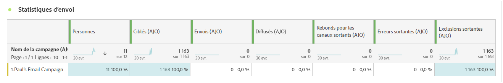
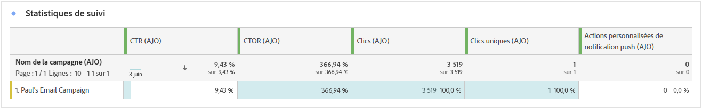
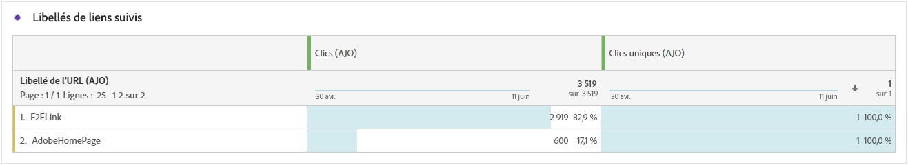
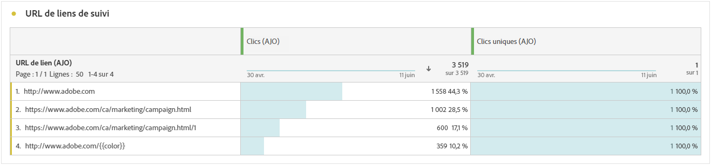
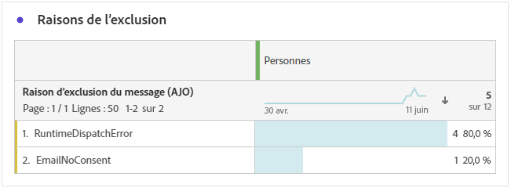

# Rapport de parcours des notifications push {#journey-global-report}

>[!BEGINSHADEBOX]

Vous pouvez accéder à votre rapport de parcours par notification push en cliquant sur le bouton **[!UICONTROL Afficher le rapport]** de votre parcours. [En savoir plus](report-gs-cja.md)

>[!ENDSHADEBOX]

## Statistiques d’envoi {#sending-statistics-push}

Le tableau **[!UICONTROL Statistiques d’envoi]** vous aide à comprendre les performances de vos notifications push. Il comprend des mesures clés telles que le taux de diffusion et la taille de l’audience, ce qui vous donne des informations précieuses sur l’efficacité et la portée de vos parcours.

+++ En savoir plus sur les mesures de statistiques d’envoi

* **[!UICONTROL Personnes]** : nombre de profils d’utilisateurs et d’utilisatrices qui sont qualifiés en tant que profils cibles pour vos SMS.

* **[!UICONTROL Ciblés]** : nombre de profils qui remplissent les critères de l’audience avant l’application des exclusions, des suppressions ou des suppressions de consentement. Dans les parcours dont la rentrée est activée, un profil peut être ciblé plusieurs fois.

* **[!UICONTROL Envois]** : nombre total d’envois pour la notification push.

* **[!UICONTROL Diffusées]** : nombre de notifications push envoyées avec succès, par rapport au nombre total de notifications push envoyées.

* **[!UICONTROL Rebonds pour les canaux sortants]** : nombre total d’erreurs cumulées lors du processus d’envoi et du traitement automatique des retours par rapport au nombre total de notifications push envoyées.

* **[!UICONTROL Erreurs sortantes]** : nombre total d’erreurs survenues empêchant l’envoi à des profils.

* **[!UICONTROL Exclusions sortantes]** : nombre de profils qui ont été exclus par Adobe Journey Optimizer.

+++

## Statistiques de tracking {#tracking-statistics-push}

Le tableau **[!UICONTROL Statistiques de suivi]** offre un instantané détaillé de l’activité de profil liée à vos notifications push, fournissant des informations essentielles sur l’engagement et l’efficacité des notifications push.

+++ En savoir plus sur les mesures de statistiques de tracking

* **[!UICONTROL Taux de clics (CTR)]** : pourcentage d’utilisateurs et d’utilisatrices ayant interagi avec la notification push.

* **[!UICONTROL Taux d’ouvertures par clic (CTOR)]**: nombre de fois où votre notification push a été ouverte.

* **[!UICONTROL Clics]** : nombre de clics sur un contenu dans vos notifications push.

* **[!UICONTROL Clics uniques]** : nombre de profils qui ont cliqué sur un contenu dans vos notifications push.

* **[!UICONTROL Actions personnalisées de notification push]** : nombre d’actions personnalisées entreprises par les profils en réponse aux notifications push.
+++

## Libellés des liens de suivi {#track-link-label-push}

Le tableau **[!UICONTROL Libellés des liens de suivi]** fournit une vue d’ensemble complète des libellés des liens dans vos notifications push, mettant en évidence celles qui attirent le plus de visiteurs et de visiteuses. Cette fonctionnalité vous permet d’identifier et de hiérarchiser les liens les plus populaires.

+++ En savoir plus sur les mesures des libellés des liens de suivi

* **[!UICONTROL Clics uniques]** : nombre de profils qui ont cliqué sur un contenu dans vos notifications push.

* **[!UICONTROL Clics]** : nombre de clics sur un contenu dans vos notifications push.

+++

## URL des liens de suivi {#track-link-url-push}

Le tableau **[!UICONTROL URL des liens de suivi]** fournit une vue d’ensemble complète des URL de vos notifications push qui attirent le plus de visiteurs et de visiteuses. Cela vous permet d’identifier et de hiérarchiser les liens les plus populaires, ce qui améliore votre compréhension de l’engagement des profils avec du contenu spécifique dans vos notifications push.

+++ En savoir plus sur les mesures des URL des liens de suivi

* **[!UICONTROL Clics uniques]** : nombre de profils qui ont cliqué sur un contenu dans vos notifications push.

* **[!UICONTROL Clics]** : nombre de clics sur un contenu dans vos notifications push.

+++

## Raisons de rebond {#bounce-reasons-push}

Le tableau **[!UICONTROL Causes des rebonds]** fournit une vue d’ensemble complète des données relatives aux rebonds de notifications push, fournissant des informations précieuses sur les causes précises des rebonds des notifications push.

## Raisons des erreurs {#error-reasons-push}

Le tableau **[!UICONTROL Raisons des erreurs]** vous permet d’identifier les erreurs spécifiques qui se sont produites au cours du processus d’envoi de vos notifications push, fournissant une analyse minutieuse de tout problème rencontré.

## Causes d’exclusion {#exclude-reasons-push}

Le tableau **[!UICONTROL Causes d’exclusion]** décrit visuellement les différents facteurs qui ont conduit à l’exclusion des profils d’utilisateurs et d’utilisatrices de l’audience ciblée, ce qui les empêche de recevoir vos notifications push.

Consultez [cette page](exclusion-list.md) pour la liste complète des causes d’exclusion.
