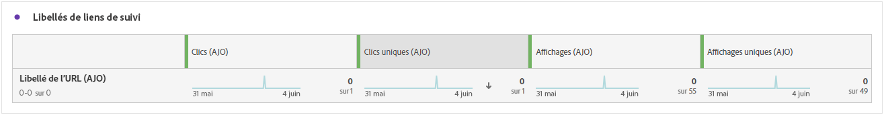

# Rapport de parcours web {#journey-global-report}

>[!INFO]
>
>Votre rapport de parcours peut afficher simultanément des informations provenant de plusieurs parcours, car les utilisateurs et utilisatrices peuvent être impliqués dans plusieurs parcours à la fois. Par conséquent, les communications entrantes (in-app, web et basées sur le code) peuvent apparaître dans plusieurs parcours si elles ont été déclenchées pour une personne participant à des parcours actifs simultanés, ce qui peut entraîner un chevauchement des données.

>[!BEGINSHADEBOX]

Vous pouvez accéder à votre rapport de parcours web en cliquant sur le bouton **[!UICONTROL Afficher le rapport]** dans votre parcours. [En savoir plus](report-gs-cja.md)

>[!ENDSHADEBOX]

## Tendance impressions et clics {#impressions-web}

Le graphique **[!UICONTROL Tendance impressions et clics]** présente une analyse détaillée de l’engagement de vos profils avec vos pages web, offrant des informations précieuses sur la manière dont les profils interagissent avec votre contenu.

+++ En savoir plus sur les mesures de tendance des impressions et des clics

* **[!UICONTROL Clics]** : nombre de fois où un contenu a fait l’objet d’un clic dans vos pages web.

* **[!UICONTROL Affichages]** : nombre d’ouvertures du message.

+++

## Clics {#clicks-web}

Le graphe **[!UICONTROL Clics]** affiche les mesures de clics sur les pages web, illustrant à la fois le nombre total de clics sur le contenu et le nombre de profils uniques ayant cliqué sur le contenu.

+++ En savoir plus sur les mesures de clics

* **[!UICONTROL Clics uniques]** : nombre de profils qui ont cliqué sur un contenu dans vos pages web.

* **[!UICONTROL Clics]** : nombre de fois où un contenu a fait l’objet d’un clic dans vos pages web.

+++

## Affichages {#displays-web}

Le graphique **[!UICONTROL Affichages]** vous permet de comprendre la portée globale de l’expérience basée sur du code, grâce au nombre d’ouvertures et au nombre d’interactions avec des profils uniques.

+++ En savoir plus sur les mesures d’affichage

* **[!UICONTROL Affichages]** : nombre dʼouvertures de l’expérience basée sur du code.

* **[!UICONTROL Affichages uniques]** : nombre dʼouvertures de l’expérience basée sur du code, les multiples interactions dʼun même profil ne sont pas prises en compte.

+++

## Données de suivi {#track-data-web}

Le tableau **[!UICONTROL Données de suivi]** offre un instantané détaillé de l’activité des profils liés à vos pages web, fournissant des informations essentielles sur l’engagement et l’efficacité des pages web.

+++ En savoir plus sur les mesures de données de tracking

* **[!UICONTROL Personnes]** : nombre de profils d’utilisateurs et d’utilisatrices qui se qualifient en tant que profils cibles pour vos pages web.

* **[!UICONTROL Taux de clics (CTR)]** : pourcentage d’utilisateurs et d’utilisatrices ayant interagi avec les pages web.

* **[!UICONTROL Clics]** : nombre de fois où un contenu a fait l’objet d’un clic dans vos pages web.

* **[!UICONTROL Clics uniques]** : nombre de profils qui ont cliqué sur un contenu dans vos pages web.

* **[!UICONTROL Affichages]** : nombre d’ouvertures de la page web.

* **[!UICONTROL Affichages uniques]** : nombre dʼouvertures de la page web, les multiples interactions dʼun même profil ne sont pas prises en compte.

+++

## Libellés des liens de suivi {#track-link-web}

Le tableau **[!UICONTROL Libellés des liens de suivi]** fournit une vue d’ensemble complète des libellés des liens dans vos pages web qui attirent le plus de visiteurs et de visiteuses. Cette fonctionnalité vous permet d’identifier et de hiérarchiser les liens les plus populaires.

+++ En savoir plus sur les mesures des libellés des liens de suivi

* **[!UICONTROL Clics uniques]** : nombre de profils qui ont cliqué sur un contenu dans vos pages web.

* **[!UICONTROL Clics]** : nombre de fois où un contenu a fait l’objet d’un clic dans vos pages web.

* **[!UICONTROL Affichages]** : nombre d’ouvertures du message.

* **[!UICONTROL Affichages uniques]** : nombre dʼouvertures du message, les multiples interactions dʼun même profil ne sont pas prises en compte.

+++

## URL des liens de suivi {#track-url-web}

Le tableau **[!UICONTROL URL des liens suivis]** fournit une vue d’ensemble complète des URL de vos pages web qui attirent le plus de visiteurs et de visiteuses. Cela vous permet d’identifier et de hiérarchiser les liens les plus populaires, ce qui améliore votre compréhension de l’engagement des profils avec du contenu spécifique dans vos pages web.

+++ En savoir plus sur les mesures des URL des liens de suivi

* **[!UICONTROL Clics uniques]** : nombre de profils qui ont cliqué sur un contenu dans vos pages web.

* **[!UICONTROL Clics]** : nombre de fois où un contenu a fait l’objet d’un clic dans vos pages web.

* **[!UICONTROL Affichages]** : nombre d’ouvertures du message.

* **[!UICONTROL Affichages uniques]** : nombre d’ouvertures du message, les interactions multiples d’un même profil ne sont pas prises en compte.

+++
