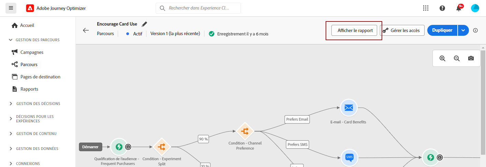
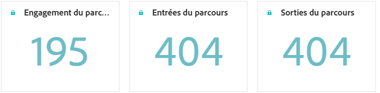
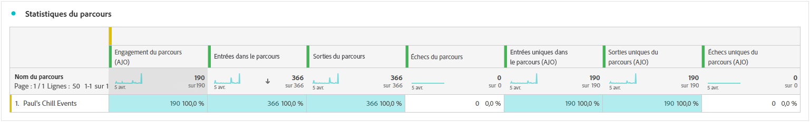
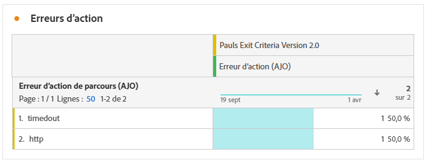
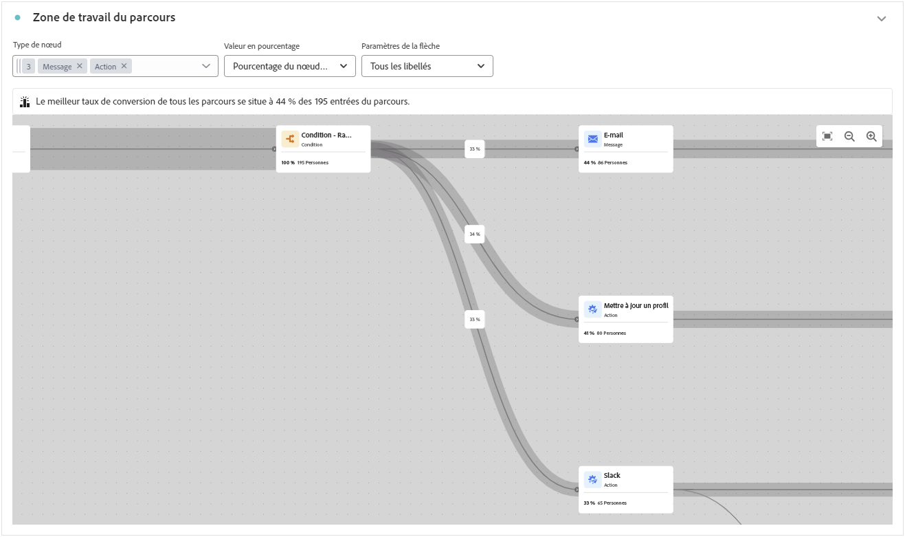
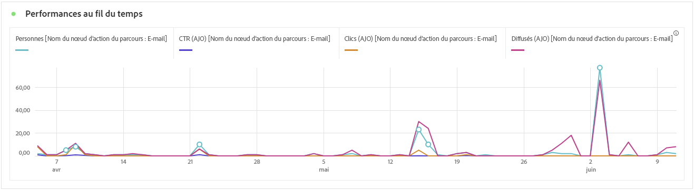
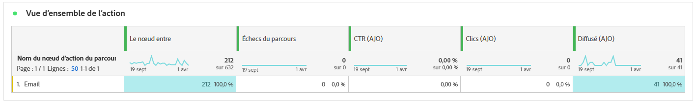
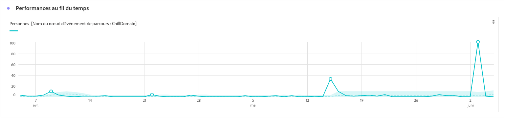
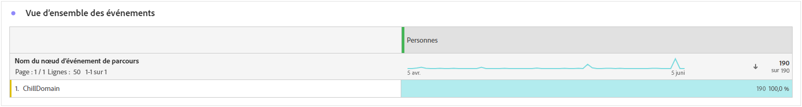
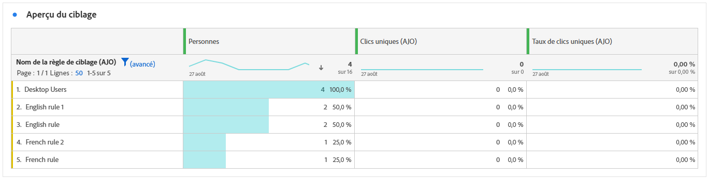

# Rapport de parcours {#journey-global-report}

Le **rapport de parcours** fonctionne comme un tableau de bord global, fournissant une analyse des mesures essentielles associées à votre parcours. Cela inclut des détails tels que le nombre de profils entrés et les instances de parcours individuels ayant échoué, ce qui vous permet d’avoir un aperçu complet de l’efficacité et du niveau d’engagement de votre parcours.

Vous pouvez accéder directement au **rapport de parcours** à partir de votre parcours à l’aide du bouton **[!UICONTROL Afficher le rapport]**.

Pour en savoir plus sur Customer Journey Analytics Workspace, sur le filtrage et l’analyse des données, consultez [cette page](https://experienceleague.adobe.com/fr/docs/analytics-platform/using/cja-workspace/home).

## Vue d’ensemble du parcours {#journey-global}

Le rapport **[!UICONTROL Parcours]** vous donne une vue claire des données de suivi les plus importantes concernant votre parcours.

### Indicateurs clés de performances du parcours {#journey-perfomance}

Les indicateurs clés de performances (KPI) du **[!UICONTROL parcours]** fonctionnent comme un tableau de bord global, fournissant une analyse des mesures essentielles associées à votre parcours. Cela inclut des détails tels que le nombre de profils entrés et les instances de parcours individuels ayant échoué, ce qui vous offre des informations complètes sur l’efficacité et le niveau d’engagement de votre parcours.

+++ En savoir plus sur les mesures des KPI de parcours

* **[!UICONTROL Engagement du parcours]** : nombre total de personnes uniques ayant reçu des messages envoyés depuis le parcours et représentant des profils distincts ayant atteint un point d’action désigné dans le parcours.

* **[!UICONTROL Entrées du parcours]** : nombre total de personnes ayant atteint l’événement d’entrée du parcours.

* **[!UICONTROL Sorties du parcours]** : nombre total de personnes ayant quitté le parcours.

+++

### Statistiques du parcours {#journey-stats}

Le tableau **[!UICONTROL Statistiques du parcours]** offre un résumé détaillé des données essentielles relatives à vos parcours. Il comprend des mesures clés telles que le nombre d’échecs et d’entrées réussies, fournissant des informations précieuses sur les performances et la portée de vos e-mails et parcours.

+++ En savoir plus sur les mesures de statistiques du parcours

* **[!UICONTROL Exclusion de parcours]** : nombre total de personnes qui ont été exclues du parcours en raison de critères prédéfinis ou de règles de suppression.

* **[!UICONTROL Engagement du parcours]** : nombre total de personnes uniques ayant reçu des messages envoyés depuis le parcours et représentant des profils distincts ayant atteint un point d’action désigné dans le parcours.

* **[!UICONTROL Entrées du parcours]** : nombre total de personnes ayant atteint l’événement d’entrée du parcours.

* **[!UICONTROL Sorties du parcours]** : nombre total de personnes ayant quitté le parcours.

* **[!UICONTROL Échecs de parcours]** : nombre total de parcours individuels qui n’ont pas été exécutés avec succès.

* **[!UICONTROL Entrées de parcours uniques]** : nombre total de personnes ayant atteint l’événement d’entrée du parcours, les multiples interactions dʼun même profil ne sont pas prises en compte.

* **[!UICONTROL Sorties du parcours uniques]** : nombre total de personnes ayant quitté le parcours, les multiples interactions dʼun même profil ne sont pas prises en compte.

* **[!UICONTROL Échecs de parcours uniques]** : nombre total de parcours individuels n’ayant pas été exécutés avec succès, les multiples interactions dʼun même profil ne sont pas prises en compte.

+++

## Exclusion de parcours {#journey-exclusion}

Le tableau **[!UICONTROL Exclusion de parcours]** présente une vue complète des différents facteurs qui ont entraîné l’exclusion des profils d’utilisateurs et d’utilisatrices.

## Erreur d’action {#action-error}

Le widget **[!UICONTROL Erreurs d’action]** détaille les différentes erreurs qui se sont produites pour les actions de votre parcours.

## Zone de travail du parcours {#journey-canvas}

Le widget **[!UICONTROL Zone de travail du parcours]** vous permet de retracer visuellement la trajectoire de vos profils ciblés tout au long de votre parcours. [En savoir plus dans la documentation de Customer Journey Analytics](https://experienceleague.adobe.com/fr/docs/analytics-platform/using/cja-workspace/visualizations/journey-canvas/journey-canvas)

Améliorez la personnalisation de votre zone de travail à l’aide des options suivantes :

* Ajoutez ou supprimez le type d’activité souhaité, tel que des messages ou des conditions, depuis le menu déroulant **[!UICONTROL Type de nœud]**.
* Ajustez la **[!UICONTROL Valeur de pourcentage]** pour déterminer la distribution du flux entre différents parcours.
* Personnalisez vos **[!UICONTROL Paramètres de flèche]** pour inclure des libellés, des conditions, ou optez pour un affichage clair.
* Activez l’option **[!UICONTROL Afficher les abandons]** pour visualiser les profils qui ont quitté votre parcours directement sur la zone de travail.

Les règles suivantes s’appliquent lors de l’utilisation du filtrage **[!UICONTROL Type de noeud]** :

* Lors de la création d’un segment sur un noeud, il inclura toujours les noeuds des étapes précédentes du parcours, même si ces noeuds ont été exclus par le biais du filtre **[!UICONTROL Type de noeud]**.

* Vous ne pouvez pas créer de segments formés à partir d’une flèche si les noeuds situés à des étapes antérieures du parcours ont été exclus via le filtre **[!UICONTROL Type de noeud]**. Dans ce cas, la fonctionnalité de clic droit sera désactivée sur ces flèches.

## Performances des actions {#action-performance}

### Performances dans le temps {#action-overtime}

Le graphe **[!UICONTROL Performances dans le temps]** vous permet d’identifier et d’analyser le nombre de profils répondant aux critères à considérer comme des profils cibles pour vos actions. Cette visualisation fournit des informations précieuses sur l’efficacité de vos stratégies et vous aide à prendre des décisions basées sur les données pour optimiser vos performances.

### Vue d’ensemble des actions {#action-overview}

Le tableau **[!UICONTROL Vue d’ensemble des actions]** sert de tableau de bord complet, offrant une analyse des mesures clés liées aux actions de votre parcours. Cela inclut des détails essentiels tels que le nombre d’interactions et le taux de clics.

+++ En savoir plus sur les mesures de la vue d’ensemble des actions

* **[!UICONTROL Entrées de nœud]** : nombre total de personnes ayant accédé à un nœud spécifique dans le parcours.

* **[!UICONTROL Échecs de parcours]** : nombre total de parcours individuels dont l’exécution a échoué.

* **[!UICONTROL Taux de clics]** : pourcentage d’utilisateurs et d’utilisatrices ayant interagi avec l’action.

* **[!UICONTROL Clics]** : nombre de clics sur un contenu dans vos actions.

* **[!UICONTROL Diffusés]** : nombre d’actions envoyées avec succès, par rapport au nombre total d’actions envoyées.

+++

## Performance des événements {#events-performance}

### Performances dans le temps {#event-overtime}

Le graphe **[!UICONTROL Performances dans le temps]** vous permet d’identifier et d’analyser le nombre de profils qualifiés de profils cibles pour vos événements. Cet outil puissant vous permet de suivre les tendances et les modèles dans le temps, fournissant des informations précieuses pour optimiser vos stratégies d’événement.

### Vue d’ensemble des événements {#event-overview}

Le tableau **[!UICONTROL Vue d’ensemble des événements]** indique le nombre de profils qui répondent à vos critères d’événement dans le temps. Cet outil vous permet d’identifier les schémas des taux de qualification pour affiner votre stratégie d’événement.

+++ En savoir plus sur les mesures de statistiques du parcours

* **[!UICONTROL Personnes]** : nombre de profils d’utilisateurs et d’utilisatrices qui sont qualifiés en tant que profils cibles pour vos événements.

+++

## Vue d’ensemble du ciblage {#targeting}

Si vous configurez des **[!UICONTROL règles de ciblage]** pour votre contenu, le tableau **[!UICONTROL Vue d’ensemble du ciblage]** fournit une vue détaillée des mesures d’engagement clés, montrant comment les profils ciblés de chaque règle ont interagi avec votre contenu.

➡️ [En savoir plus sur les règles de ciblage](../campaigns/campaigns-message-optimization.md)

+++ En savoir plus sur les mesures du tableau Vue d’ensemble du ciblage

* **[!UICONTROL Personnes]** : nombre de profils d’utilisateurs et d’utilisatrices identifiés comme cibles de vos événements.

* **[!UICONTROL Clics uniques]** : nombre de profils qui ont cliqué sur un contenu dans un e-mail.

* **[!UICONTROL Taux de clics uniques]** : pourcentage de profils ciblés ayant cliqué au moins une fois.

+++
