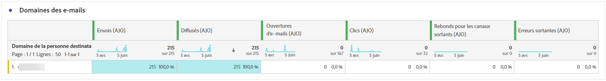
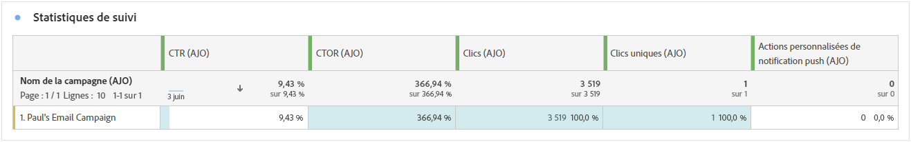
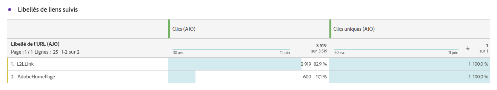
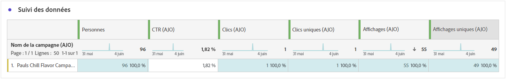

# Rapport de parcours {#journey-global-report}

La variable **Rapport parcours** fonctionne comme un tableau de bord global, fournissant une analyse des mesures essentielles associées à votre parcours. Cela inclut des détails tels que le nombre de profils entrés et les instances de parcours individuels ayant échoué, ce qui vous permet d’avoir un aperçu complet de l’efficacité et du niveau d’engagement de votre parcours.

**Rapport parcours** est accessible directement à partir de votre parcours à l’aide de la fonction **[!UICONTROL Afficher le rapport]** bouton .

La variable **[!UICONTROL Rapport parcours]** s’affiche avec les onglets suivants en fonction des activités de messages dans votre parcours :

* [Parcours](#journey-global)
* [E-mail](#email-global)
* [Notification push](#push-global)
* [SMS](#sms-global)
* [In-app](#in-app-global)
* [Web](#web-cja)
* [Courrier](#direct-mail-cja)

Pour en savoir plus sur Customer Journey Analytics Workspace et sur le filtrage et l’analyse des données, reportez-vous à la section [cette page](https://experienceleague.adobe.com/en/docs/analytics-platform/using/cja-workspace/home).

## Vue d’ensemble du parcours {#journey-global}

La variable **[!UICONTROL Parcours]** Ce rapport vous donne une vue claire des données de suivi les plus importantes concernant votre parcours.

### IPC de parcours {#journey-perfomance}

La variable **[!UICONTROL Parcours]** Les indicateurs de performance clés (IPC) fonctionnent comme un tableau de bord global, fournissant une analyse des mesures essentielles associées à votre parcours. Cela inclut des détails tels que le nombre de profils entrés et les instances de parcours individuels ayant échoué, ce qui vous offre des informations complètes sur l’efficacité et le niveau d’engagement de votre parcours.

+++ En savoir plus sur les mesures IPC de Parcours

* **[!UICONTROL Engagement parcours]**: nombre total d’individus ayant interagi avec les messages envoyés depuis le parcours

* **[!UICONTROL Entrées de parcours]**: nombre total d’individus ayant atteint l’événement d’entrée du parcours.

* **[!UICONTROL Sorties de parcours]**: nombre total d’individus ayant quitté le parcours.

* **[!UICONTROL Parcours en échec]**: nombre total de parcours individuels n’ayant pas été exécutés avec succès.

+++

### Statistiques du parcours {#journey-stats}

La variable **[!UICONTROL Statistiques parcours]** offre un résumé détaillé des données essentielles relatives à vos parcours. Il comprend des mesures clés telles que le nombre d’échecs et d’entrées réussies, fournissant des informations précieuses sur les performances et la portée de vos emails et parcours.

+++ En savoir plus sur la mesure Statistiques du parcours

* **[!UICONTROL Engagement parcours]**: nombre total d’individus ayant interagi avec les messages envoyés depuis le parcours.

* **[!UICONTROL Entrées de parcours]**: nombre total d’individus ayant atteint l’événement d’entrée du parcours.

* **[!UICONTROL Sorties de parcours]**: nombre total d’individus ayant quitté le parcours.

* **[!UICONTROL Parcours en échec]**: nombre total de parcours individuels n’ayant pas été exécutés avec succès.

* **[!UICONTROL Entrées de Parcours uniques]**: nombre total d’individus ayant atteint l’événement d’entrée du parcours, plusieurs interactions d’un profil ne sont pas prises en compte.

* **[!UICONTROL Sorties de Parcours uniques]**: nombre total d’individus ayant quitté le parcours, les interactions multiples d’un profil ne sont pas prises en compte.

* **[!UICONTROL Échecs de Parcours uniques]**: nombre total de parcours individuels n’ayant pas été exécutés avec succès, les interactions multiples d’un profil ne sont pas prises en compte.

+++

## Canevas de parcours {#journey-canvas}

La variable **[!UICONTROL Canevas de parcours]** vous permet de tracer visuellement la trajectoire de vos profils ciblés lorsqu’ils parcourent votre parcours.

Améliorez la personnalisation de la zone de travail à l’aide des options suivantes :

* Ajoutez ou supprimez le type d’activité souhaité, tel que des messages ou des conditions, du **[!UICONTROL Type de noeud]** menu déroulant.
* Réglez les **[!UICONTROL Valeur en pourcentage]** pour déterminer la distribution du flux entre différents chemins de parcours.
* Personnalisez votre **[!UICONTROL Paramètres de la flèche]** pour inclure des libellés, des conditions ou choisir un affichage propre.
* Activez la variable **[!UICONTROL Afficher les abandons]** pour visualiser les profils qui ont quitté votre parcours directement sur la zone de travail.

## Performances des actions {#action-performance}

### Performances dans le temps {#action-overtime}

La variable **[!UICONTROL Performances dans le temps]** le graphique vous permet d’identifier et d’analyser le nombre de profils répondant aux critères à considérer comme des profils cibles pour vos actions. Cette visualisation fournit des informations précieuses sur l’efficacité de vos stratégies et vous aide à prendre des décisions basées sur les données pour optimiser vos performances.

### Présentation des actions {#action-overview}

La variable **[!UICONTROL Présentation des actions]** Le tableau de bord constitue un tableau de bord complet qui propose une analyse des mesures clés liées aux actions de votre parcours. Cela inclut des détails essentiels tels que le nombre d’interactions et le taux de clics publicitaires.

+++ En savoir plus sur les mesures de présentation d’Action

* **[!UICONTROL Personnes]**: nombre de profils utilisateur qui remplissent les critères de ciblage pour vos actions.

* **[!UICONTROL Taux de clics]**: pourcentage d’utilisateurs ayant interagi avec l’action.

* **[!UICONTROL Clics]**: nombre de clics sur un contenu dans vos actions.

* **[!UICONTROL Délivrés]**: nombre d’actions envoyées avec succès, par rapport au nombre total d’actions envoyées.

+++

## Performances des événements {#events-performance}

### Performances dans le temps {#event-overtime}

La variable **[!UICONTROL Performances dans le temps]** le graphique vous permet d’identifier et d’analyser le nombre de profils qualifiés de profils cibles pour vos événements. Cet outil puissant vous permet de suivre les tendances et les modèles au fil du temps, fournissant des informations précieuses pour optimiser vos stratégies d’événement.

### Présentation des événements {#event-overview}

La variable **[!UICONTROL Présentation des événements]** Le tableau indique le nombre de profils qui répondent à vos critères d’événement au fil du temps. Cet outil vous permet d’identifier les schémas des taux de qualification pour affiner votre stratégie d’événement.

+++ En savoir plus sur la mesure Statistiques du parcours

* **[!UICONTROL Personnes]**: nombre de profils utilisateur qui remplissent les critères de ciblage pour vos événements.

+++

## Détails des emails {#email-global}

Dans votre rapport parcours, la variable **[!UICONTROL Email]** Cet onglet présente les informations principales relatives aux emails envoyés dans votre parcours.

### Tendance des envois et des clics {#delivered-click}

La variable **[!UICONTROL Tendance des envois et des clics]** Le graphique présente une analyse détaillée de l’engagement de vos profils avec vos emails, offrant des informations précieuses sur la manière dont différents domaines interagissent avec votre contenu.

+++ En savoir plus sur les mesures de tendance Diffusion / Clic

* **[!UICONTROL Diffusés]** : nombre d’e-mails envoyés avec succès, par rapport au nombre total d’e-mails envoyés.

* **[!UICONTROL Clics]** : nombre de clics sur un contenu dans vos e-mails.

+++

### Statut de la diffusion {#delivery-status}

La variable **[!UICONTROL Etat de la diffusion]** Le graphique vous permet de visualiser les performances de vos emails en un coup d’oeil. Effectuez le suivi des mesures clés telles que les diffusions et les bounces, ce qui vous permet de comprendre rapidement l’efficacité de votre parcours de messagerie.

+++ En savoir plus sur les mesures de statut des diffusions

* **[!UICONTROL Diffusés]** : nombre d’e-mails envoyés avec succès, par rapport au nombre total d’e-mails envoyés.

* **[!UICONTROL Rebonds pour les canaux sortants]**: Nombre total d&#39;erreurs cumulées lors du processus d&#39;envoi et du traitement automatique des retours par rapport au nombre total de messages envoyés.

* **[!UICONTROL Erreur sortante]**: nombre total d&#39;erreurs qui se sont produites au cours d&#39;un processus d&#39;envoi qui l&#39;a empêché d&#39;être envoyé aux profils.

* **[!UICONTROL Exclus]** : nombre de profils qui ont été exclus par Adobe Journey Optimizer.

+++

### Statistiques d’envoi {#email-sending-statistics}

La variable **[!UICONTROL Statistiques d’envoi]** vous donne une vue claire des performances de vos emails dans vos parcours. Il effectue le suivi de mesures clés telles que les taux de diffusion et les interactions, ce qui vous permet d’obtenir des informations précieuses pour optimiser votre stratégie de messagerie électronique pour une meilleure portée et un meilleur engagement.

+++ En savoir plus sur les mesures des statistiques d’envoi

* **[!UICONTROL Personnes]**: nombre de profils utilisateur qui remplissent les critères de ciblage pour vos messages.

* **[!UICONTROL Ciblés]** : nombre total d’e-mails traités lors de la procédure d’envoi.

* **[!UICONTROL Envois]**: nombre total d’envois pour votre email.

* **[!UICONTROL Diffusés]** : nombre d’e-mails envoyés avec succès, par rapport au nombre total de messages envoyés.

* **[!UICONTROL Rebonds]** : nombre total d’erreurs cumulées lors de la procédure d’envoi et du traitement automatique des retours par rapport au nombre total de messages envoyés.

* **[!UICONTROL Erreurs sortantes]**: nombre total d&#39;erreurs qui se sont produites pendant le processus d&#39;envoi et qui l&#39;ont empêché d&#39;être envoyé aux profils.

* **[!UICONTROL Exclusions sortantes]**: nombre de profils qui ont été exclus par Adobe Journey Optimizer.

+++

### E-mail – Statistiques de tracking {#email-tracking}

Le tableau **[!UICONTROL E-mail – Statistiques de tracking]** offre un compte rendu détaillé de l’activité de profil associée aux e-mails inclus dans votre parcours. Cela inclut des mesures sur les ouvertures, les clics et d’autres indicateurs d’engagement pertinents, offrant une vue d’ensemble complète de la manière dont les profils interagissent avec le contenu de vos e-mails.

+++ En savoir plus sur les mesures de statistiques de suivi

* **[!UICONTROL Taux de clics (CTR)]**: pourcentage d&#39;utilisateurs ayant interagi avec l&#39;email.

* **[!UICONTROL Taux d’ouverture des clics publicitaires (CTOR)]**: nombre d’ouvertures de l’email.

* **[!UICONTROL Clics]** : nombre de clics sur un contenu dans vos e-mails.

* **[!UICONTROL Clics uniques]** : nombre de profils qui ont cliqué sur un contenu dans un e-mail.

* **[!UICONTROL Ouvertures de courrier électronique]**: nombre d’ouvertures de vos emails dans un parcours.

* **[!UICONTROL Ouvertures de courriers électroniques uniques]**: pourcentage d&#39;emails ouverts.

* **[!UICONTROL Plaintes contre le spam]** : nombre de fois où un message a été déclaré comme spam ou courrier indésirable.

* **[!UICONTROL Désabonnements]** : nombre de clics sur le lien de désabonnement.

+++

### Domaines d’e-mails {#email-domains}

La variable **[!UICONTROL Domaines de courriel]** table propose une ventilation détaillée des emails classés par domaine, fournissant des informations détaillées sur les mesures de performances de vos parcours de messagerie. Cette analyse exhaustive vous permet de comprendre le comportement de différents domaines en réponse au contenu de vos emails.

+++ En savoir plus sur les mesures Domaines d’email

* **[!UICONTROL Envois]**: nombre total d’envois pour votre email.

* **[!UICONTROL Diffusés]** : nombre d’e-mails envoyés avec succès, par rapport au nombre total d’e-mails envoyés.

* **[!UICONTROL Ouvertures de courrier électronique]**: nombre d’ouvertures de vos emails dans un parcours.

* **[!UICONTROL Clics]** : nombre de clics sur un contenu dans vos e-mails.

* **[!UICONTROL Rebonds pour les canaux sortants]**: Nombre total d&#39;erreurs cumulées lors du processus d&#39;envoi et du traitement automatique des retours par rapport au nombre total d&#39;emails envoyés.

* **[!UICONTROL Erreurs sortantes]**: nombre total d&#39;erreurs qui se sont produites pendant le processus d&#39;envoi et qui l&#39;ont empêché d&#39;être envoyé aux profils.
+++

### Libellés des liens de suivi {#track-link-label}

La variable **[!UICONTROL Libellés des liens suivis]** offre un aperçu complet des libellés des liens dans vos emails, en mettant en évidence ceux qui génèrent le plus fort trafic de visiteurs. Cette fonctionnalité vous permet d’identifier et de prioriser les liens les plus populaires.

+++ En savoir plus sur les mesures des étiquettes de lien suivi

* **[!UICONTROL Clics uniques]** : nombre de profils qui ont cliqué sur un contenu dans un e-mail.

* **[!UICONTROL Clics]** : nombre de clics sur un contenu dans vos e-mails.

+++

### URL des liens de suivi {#track-link-url}

La variable **[!UICONTROL URL des liens trackés]** Ce tableau présente une vue d’ensemble complète des URL de votre email qui attirent le plus de visiteurs. Cela vous permet d’identifier et de hiérarchiser les liens les plus populaires, ce qui améliore votre compréhension de l’engagement des profils avec du contenu spécifique dans vos e-mails.

+++ En savoir plus sur les mesures des URL de lien trackées

* **[!UICONTROL Clics uniques]** : nombre de profils qui ont cliqué sur un contenu dans un e-mail.

* **[!UICONTROL Clics]** : nombre de clics sur un contenu dans vos e-mails.

* **[!UICONTROL Affichages]**: nombre d’ouvertures du message.

* **[!UICONTROL Affichages uniques]**: nombre d&#39;ouvertures du message, plusieurs interactions d&#39;un profil ne sont pas prises en compte.

+++

### Objets des e-mails {#email-subject}

La variable **[!UICONTROL Objets d&#39;email]**  Le tableau présente un aperçu complet des sujets des emails qui ont attiré le plus grand trafic de visiteurs. Cette ressource offre des informations précieuses sur la dynamique d’engagement des audiences.

+++ En savoir plus sur les mesures des sujets des emails

* **[!UICONTROL Personnes]**: nombre de profils utilisateur qui remplissent les critères de ciblage pour vos emails.

+++

### Raisons des rebonds {#email-bounce-reasons}

La variable **[!UICONTROL Motifs de rebond]** tableau compile les données disponibles relatives aux messages rebonds, fournissant des informations détaillées sur les raisons spécifiques des rebonds d’email.

Pour plus d’informations sur les rebonds, consultez la page [Liste de suppression](../reports/suppression-list.md).

### Causes d’exclusion {#email-excluded}

La variable **[!UICONTROL Exclure des motifs]** le tableau présente une vue d’ensemble complète des différents facteurs qui ont entraîné l’exclusion des profils utilisateur de l’audience ciblée, ce qui a pour conséquence que le message n’a pas été reçu.

Consultez [cette page](exclusion-list.md) pour la liste complète des causes d’exclusion.

### Causes d’erreur {#email-errors}

La variable **[!UICONTROL Raisons de l’erreur]** table offre une visibilité sur les erreurs spécifiques survenues pendant le processus d’envoi, fournissant des informations précieuses sur la nature et l’occurrence des erreurs.

## Onglet Notification push {#push-global}

Dans votre rapport parcours, la variable **[!UICONTROL Notification push]** Cet onglet présente les informations principales relatives aux notifications push envoyées dans votre parcours.

## Notification push {#push-notification}

### Statistiques d’envoi {#sending-statistics-push}

La variable **[!UICONTROL Statistiques d’envoi]** vous aide à comprendre les performances de vos notifications push. Il comprend des mesures clés telles que le taux de diffusion et la taille de l’audience, ce qui vous donne des informations précieuses sur l’efficacité et la portée de vos parcours.

+++ En savoir plus sur les mesures des statistiques d’envoi

* **[!UICONTROL Personnes]**: nombre de profils utilisateur qui remplissent les critères de ciblage pour vos SMS.

* **[!UICONTROL Ciblées]** : nombre total de notifications push traitées lors de l’analyse.

* **[!UICONTROL Envois]**: nombre total d&#39;envois pour la notification push.

* **[!UICONTROL Délivrées]** : nombre de notifications push envoyées avec succès, par rapport au nombre total de notifications push envoyées.

* **[!UICONTROL Rebonds pour les canaux sortants]**: Nombre total d&#39;erreurs cumulées lors du processus d&#39;envoi et du traitement automatique des retours par rapport au nombre total de notifications push.

* **[!UICONTROL Erreur sortante]**: nombre total d’erreurs qui se sont produites pour empêcher son envoi aux profils.

* **[!UICONTROL Exclusions sortantes]**: nombre de profils qui ont été exclus par Adobe Journey Optimizer.

+++

### Statistiques de suivi {#tracking-statistics-push}

La variable **[!UICONTROL Statistiques de tracking]** le tableau offre un instantané détaillé de l’activité de profil liée à vos notifications push, fournissant des informations essentielles sur l’engagement et l’efficacité des notifications push.

+++ En savoir plus sur les mesures de statistiques de suivi

* **[!UICONTROL Taux de clics (CTR)]**: pourcentage d&#39;utilisateurs ayant interagi avec la notification push.

* **[!UICONTROL Taux d’ouverture des clics publicitaires (CTOR)]**: nombre d’ouvertures de la notification push.

* **[!UICONTROL Clics]**: nombre de clics sur un contenu dans votre notification push.

* **[!UICONTROL Clics uniques]**: nombre de profils ayant cliqué sur un contenu dans votre notification push.

<!--
* **[!UICONTROL Push custom actions]**: 
-->
+++

### Libellés des liens de suivi {#track-link-label-push}

La variable **[!UICONTROL Libellés des liens suivis]** le tableau offre un aperçu complet des libellés des liens dans vos notifications push, en mettant en évidence ceux qui génèrent le plus fort trafic de visiteurs. Cette fonctionnalité vous permet d’identifier et de prioriser les liens les plus populaires.

+++ En savoir plus sur les mesures des étiquettes de lien suivi

* **[!UICONTROL Clics uniques]**: nombre de profils ayant cliqué sur un contenu dans vos notifications push.

* **[!UICONTROL Clics]** : nombre de clics sur un contenu dans vos notifications push.

+++

### URL des liens de suivi {#track-link-url-push}

La variable **[!UICONTROL URL des liens trackés]** Ce tableau présente une vue d’ensemble complète des URL de vos notifications push qui attirent le plus de visiteurs. Cela vous permet d’identifier et de classer par priorité les liens les plus populaires, ce qui vous permet de mieux comprendre l’engagement des profils avec du contenu spécifique dans vos notifications push.

+++ En savoir plus sur les mesures des URL de lien trackées

* **[!UICONTROL Clics uniques]**: nombre de profils ayant cliqué sur un contenu dans vos notifications push.

* **[!UICONTROL Clics]** : nombre de clics sur un contenu dans vos notifications push.

+++

### Raisons des rebonds {#bounce-reasons-push}

La variable **[!UICONTROL Raisons des rebonds]** Le tableau fournit un aperçu complet des données relatives aux notifications push rebondies, fournissant des informations précieuses sur les raisons spécifiques à l’origine des bounces des notifications push.

### Raisons des erreurs {#error-reasons-push}

La variable **[!UICONTROL Raisons de l’erreur]** vous permet d’identifier les erreurs spécifiques qui se sont produites pendant le processus d’envoi de vos notifications push, ce qui facilite l’analyse approfondie de tous les problèmes rencontrés.

### Causes d’exclusion {#exclude-reasons-push}

La variable **[!UICONTROL Exclure les raisons]** Le tableau illustre visuellement les différents facteurs qui ont conduit à l’exclusion des profils utilisateur de l’audience ciblée, ce qui les empêche de recevoir vos notifications push.

Consultez [cette page](exclusion-list.md) pour la liste complète des causes d’exclusion.

## SMS {#sms}

### Tendance des envois et des clics {#delivered-click-sms}

La variable **[!UICONTROL Tendance des envois et des clics]** Le graphique présente une analyse détaillée de l’engagement de vos profils avec vos SMS, en fournissant des informations précieuses sur la manière dont différents domaines interagissent avec votre contenu.

+++ En savoir plus sur les mesures de tendance Diffusion / Clic

* **[!UICONTROL Délivrés]**: nombre de SMS envoyés avec succès, par rapport au nombre total de SMS.

* **[!UICONTROL Clics]** : nombre de fois où un contenu a fait l’objet d’un clic dans vos SMS.

+++

### Statut de la diffusion {#delivery-status-sms}

La variable **[!UICONTROL Etat de la diffusion]** offre un compte détaillé de l&#39;activité de profil associée à vos SMS. Cela inclut des mesures sur les indicateurs d’engagement diffusés, les clics et autres, offrant une vue d’ensemble exhaustive de la manière dont les profils interagissent avec votre contenu SMS.

+++ En savoir plus sur les mesures de statut des diffusions

* **[!UICONTROL Délivrés]**: nombre de SMS envoyés avec succès, par rapport au nombre total de SMS.

* **[!UICONTROL Rebonds pour les canaux sortants]**: Nombre total d&#39;erreurs cumulées lors du processus d&#39;envoi et du traitement automatique des retours par rapport au nombre total de SMS envoyés.

* **[!UICONTROL Erreur sortante]**: nombre total d’erreurs qui se sont produites pour empêcher son envoi aux profils.

* **[!UICONTROL Exclusions sortantes]**: nombre de profils qui ont été exclus par Adobe Journey Optimizer.

+++

### Libellés des liens de suivi {#track-link-label-sms}

La variable **[!UICONTROL Libellés des liens suivis]** offre un aperçu complet des libellés des liens dans vos SMS, en mettant en évidence ceux qui génèrent le plus fort trafic de visiteurs. Cette fonctionnalité vous permet d’identifier et de prioriser les liens les plus populaires.

+++ En savoir plus sur les mesures des étiquettes de lien suivi

* **[!UICONTROL Clics uniques]**: nombre de profils ayant cliqué sur un contenu de votre SMS.

* **[!UICONTROL Clics]** : nombre de fois où un contenu a fait l’objet d’un clic dans vos SMS.

+++

### URL des liens de suivi {#track-link-url-sms}

La variable **[!UICONTROL URL des liens trackés]** Ce tableau présente une vue d’ensemble complète des URL de vos SMS qui attirent le plus de visiteurs. Cela vous permet d’identifier et de classer par priorité les liens les plus populaires, ce qui améliore votre compréhension de l’engagement des profils avec du contenu spécifique dans vos SMS.

+++ En savoir plus sur les mesures des URL de lien trackées

* **[!UICONTROL Clics uniques]**: nombre de profils ayant cliqué sur un contenu de votre SMS.

* **[!UICONTROL Clics]** : nombre de fois où un contenu a fait l’objet d’un clic dans vos SMS.

* **[!UICONTROL Affichages]**: nombre d’ouvertures du message.

* **[!UICONTROL Affichages uniques]**: nombre d&#39;ouvertures du message, plusieurs interactions d&#39;un profil ne sont pas prises en compte.

+++

### Message SMS entrant {#sms-inbound}

La variable **[!UICONTROL SMS entrant]** Le tableau présente un aperçu détaillé des SMS qui ont attiré le plus grand trafic de visiteurs. Cette ressource offre des informations précieuses sur la dynamique d’engagement des audiences.

+++ En savoir plus sur les mesures des messages entrants de SMS

* **[!UICONTROL Personnes]**: nombre de profils utilisateur qui remplissent les critères de ciblage pour vos SMS.

+++

### Type de message SMS {#sms-message-type}

La variable **[!UICONTROL Type de message SMS]** Le tableau présente une vue d’ensemble détaillée des types de messages SMS qui ont attiré le plus grand trafic de visiteurs. Cette ressource offre des informations précieuses sur la dynamique d’engagement des audiences.

+++ En savoir plus sur les mesures de type Message SMS

* **[!UICONTROL Personnes]**: nombre de profils utilisateur qui remplissent les critères de ciblage pour vos SMS.

+++

### Fournisseurs de SMS {#sms-providers}

La variable **[!UICONTROL Fournisseurs de SMS]** Le tableau présente un aperçu détaillé des fournisseurs de SMS qui ont attiré le plus grand trafic de visiteurs. Cette ressource offre des informations précieuses sur la dynamique d’engagement des audiences.

+++ En savoir plus sur les mesures des fournisseurs de SMS

* **[!UICONTROL Personnes]**: nombre de profils utilisateur qui remplissent les critères de ciblage pour vos SMS.

+++

### Raisons des rebonds {#bounce-reasons-sms}

La variable **[!UICONTROL Raisons des rebonds]** Le tableau fournit un aperçu complet des données relatives aux messages SMS rebonds, fournissant des informations précieuses sur les raisons spécifiques à l’origine des rebonds de messages SMS.

### Raisons des erreurs {#error-reasons-sms}

La variable **[!UICONTROL Raisons de l’erreur]** vous permet d&#39;identifier les erreurs spécifiques qui se sont produites pendant le processus d&#39;envoi de vos SMS, ce qui facilite une analyse approfondie de tous les problèmes rencontrés.

### Raisons des exclusions {#excluded-reasons-sms}

La variable **[!UICONTROL Exclure les raisons]** Le tableau illustre visuellement les différents facteurs qui ont conduit à l’exclusion des profils utilisateur de l’audience ciblée, ce qui les empêche de recevoir vos SMS.

Consultez [cette page](exclusion-list.md) pour la liste complète des causes d’exclusion.

## In-app

### Tendance des impressions et des clics {#impression-click-trend}

La variable **[!UICONTROL Tendance des impressions et des clics]** Le graphique présente une analyse détaillée de l’engagement de vos profils avec vos messages in-app, en fournissant des informations précieuses sur la manière dont les profils interagissent avec votre contenu.

+++ En savoir plus sur les mesures de tendance Impression et clic

* **[!UICONTROL Clics]**: nombre de clics sur un contenu dans vos messages In-App.

* **[!UICONTROL Affichages]**: nombre d’ouvertures du message.

+++

### Clics {#clicks-inapp}

La variable **[!UICONTROL Clics]** Le graphique affiche les mesures des clics In-App, qui illustrent à la fois le nombre total de clics sur le contenu et le nombre de profils uniques ayant cliqué sur le contenu.

+++ En savoir plus sur les mesures de clics

* **[!UICONTROL Clics uniques]**: nombre de profils ayant cliqué sur un contenu dans vos messages in-app

* **[!UICONTROL Clics]**: nombre de clics sur un contenu dans vos messages In-App.

+++

### Affichage {#display-inapp}

La variable **[!UICONTROL Affichages]** Le graphique vous permet de comprendre à la fois la portée globale du message et le nombre de profils uniques qui l’interagissent.

+++ En savoir plus sur les mesures d’affichage

* **[!UICONTROL Affichages]**: nombre d’ouvertures du message.

* **[!UICONTROL Affichages uniques]**: nombre d&#39;ouvertures du message, plusieurs interactions d&#39;un profil ne sont pas prises en compte.

+++

### Suivi des données {#tracking-data-inapp}

La variable **[!UICONTROL Tracking des données]** offre un instantané détaillé de l’activité de profil liée à vos messages in-app, fournissant des informations essentielles sur l’engagement et l’efficacité des messages in-app.

+++ En savoir plus sur les mesures de données de suivi

* **[!UICONTROL Personnes]**: nombre de profils utilisateur qui remplissent les critères requis pour cibler les messages in-app.

* **[!UICONTROL Taux de clics (CTR)]**: pourcentage d’utilisateurs ayant interagi avec les messages in-app.

* **[!UICONTROL Taux d’ouverture des clics (CTOR)]**: nombre d’ouvertures des messages In-App.

* **[!UICONTROL Clics]**: nombre de clics sur un contenu dans vos messages In-App.

* **[!UICONTROL Clics uniques]**: nombre de profils ayant cliqué sur un contenu dans vos messages in-app.

* **[!UICONTROL Affichages]**: nombre d’ouvertures du message.

* **[!UICONTROL Affichages uniques]**: nombre d&#39;ouvertures du message, plusieurs interactions d&#39;un profil ne sont pas prises en compte.

* **[!UICONTROL Envois]**: nombre total d’envois pour vos messages in-app.

<!--
* **[!UICONTROL Inbound triggered]**: 

* **[!UICONTROL Inbound dismisses]**: 
-->
+++

### Libellés des liens de suivi {#track-link-label-inapp}

La variable **[!UICONTROL Libellés des liens suivis]** offre un aperçu complet des libellés des liens dans vos messages in-app, en mettant en évidence ceux qui génèrent le plus fort trafic de visiteurs. Cette fonctionnalité vous permet d’identifier et de prioriser les liens les plus populaires.

+++ En savoir plus sur les mesures des étiquettes de lien suivi

* **[!UICONTROL Clics uniques]**: nombre de profils ayant cliqué sur un contenu dans vos messages in-app.

* **[!UICONTROL Clics]**: nombre de clics sur un contenu dans vos messages In-App.

* **[!UICONTROL Affichages]**: nombre d’ouvertures du message.

* **[!UICONTROL Affichages uniques]**: nombre d&#39;ouvertures du message, plusieurs interactions d&#39;un profil ne sont pas prises en compte.

+++

### URL des liens de suivi {#track-link-url-inapp}

La variable **[!UICONTROL URL des liens trackés]** Ce tableau présente une vue d’ensemble complète des URL de vos messages in-app qui attirent le plus de visiteurs. Cela vous permet d’identifier et de classer par priorité les liens les plus populaires, ce qui améliore votre compréhension de l’engagement des profils avec du contenu spécifique dans vos messages In-App.

+++ En savoir plus sur les mesures des URL de lien trackées

* **[!UICONTROL Clics uniques]**: nombre de profils ayant cliqué sur un contenu dans vos messages in-app

* **[!UICONTROL Clics]**: nombre de clics sur un contenu dans vos messages In-App.

+++

## Web {#web-cja}

### Tendance des impressions et des clics {#impressions-web}

La variable **[!UICONTROL Tendance des impressions et des clics]** Le graphique présente une analyse détaillée de l’engagement de vos profils avec vos pages web, offrant des informations précieuses sur la manière dont les profils interagissent avec votre contenu.

+++ En savoir plus sur les mesures de tendance Impression et clic

* **[!UICONTROL Clics]**: nombre de clics sur un contenu dans vos pages Web.

* **[!UICONTROL Affichages]**: nombre d’ouvertures du message.

+++

### Clics {#clicks-web}

La variable **[!UICONTROL Clics]** Le graphique affiche les mesures de clics sur les pages Web, illustrant à la fois le nombre total de clics sur le contenu et le nombre de profils uniques ayant cliqué sur le contenu.

+++ En savoir plus sur les mesures de clics

* **[!UICONTROL Clics uniques]**: nombre de profils ayant cliqué sur un contenu dans vos pages web.

* **[!UICONTROL Clics]**: nombre de clics sur un contenu dans vos pages Web.

+++

### Affichages {#displays-web}

La variable **[!UICONTROL Affichages]** Le graphique vous permet de comprendre à la fois la portée globale du message et le nombre de profils uniques qui l’interagissent.

+++ En savoir plus sur les mesures d’affichage

* **[!UICONTROL Affichages]**: nombre d’ouvertures du message.

* **[!UICONTROL Affichages uniques]**: nombre d&#39;ouvertures du message, plusieurs interactions d&#39;un profil ne sont pas prises en compte.

+++

### Suivi des données {#track-data-web}

La variable **[!UICONTROL Tracking des données]** offre un aperçu détaillé de l’activité de profil liée à vos pages web, ce qui vous permet d’obtenir des informations essentielles sur l’engagement et l’efficacité des pages web.

+++ En savoir plus sur les mesures de données de suivi

* **[!UICONTROL Personnes]**: nombre de profils d’utilisateur qualifiés comme profils cibles pour vos pages web.

* **[!UICONTROL Taux de clics (CTR)]**: pourcentage d&#39;utilisateurs ayant interagi avec les pages web.

* **[!UICONTROL Clics]**: nombre de clics sur un contenu dans vos pages Web.

* **[!UICONTROL Clics uniques]**: nombre de profils ayant cliqué sur un contenu dans vos pages web.

* **[!UICONTROL Affichages]**: nombre d’ouvertures de la page Web.

* **[!UICONTROL Affichages uniques]**: nombre de fois où la page Web a été ouverte, plusieurs interactions d&#39;un profil ne sont pas prises en compte.

+++

### Libellés des liens de suivi {#track-link-web}

La variable **[!UICONTROL Libellés des liens suivis]** offre un aperçu complet des libellés des liens dans vos pages Web, en mettant en évidence ceux qui génèrent le plus fort trafic de visiteurs. Cette fonctionnalité vous permet d’identifier et de prioriser les liens les plus populaires.

+++ En savoir plus sur les mesures des étiquettes de lien suivi

* **[!UICONTROL Clics uniques]**: nombre de profils ayant cliqué sur un contenu dans vos pages web.

* **[!UICONTROL Clics]**: nombre de clics sur un contenu dans vos pages Web.

* **[!UICONTROL Affichages]**: nombre d’ouvertures du message.

* **[!UICONTROL Affichages uniques]**: nombre d&#39;ouvertures du message, plusieurs interactions d&#39;un profil ne sont pas prises en compte.

+++

### URL des liens de suivi {#track-url-web}

La variable **[!UICONTROL URL des liens trackés]** ce tableau présente un aperçu complet des URL de vos pages Web qui attirent le plus de visiteurs. Cela vous permet d’identifier et de classer par priorité les liens les plus populaires, ce qui vous permet de mieux comprendre l’engagement des profils avec du contenu spécifique dans vos pages web.

+++ En savoir plus sur les mesures des URL de lien trackées

* **[!UICONTROL Clics uniques]**: nombre de profils ayant cliqué sur un contenu dans vos pages web.

* **[!UICONTROL Clics]**: nombre de clics sur un contenu dans vos pages Web.

* **[!UICONTROL Affichages]**: nombre d’ouvertures du message.

* **[!UICONTROL Affichages uniques]**: nombre d&#39;ouvertures du message, plusieurs interactions d&#39;un profil ne sont pas prises en compte.

+++

## Courrier {#direct-mail-cja}

### Statistiques d’envoi {#sending-statistics-directmail}

La variable **[!UICONTROL Statistiques d’envoi]** vous donne un aperçu des performances de vos parcours de courrier. Consultez les mesures clés telles que le nombre de destinataires ciblés et les pièces correctement distribuées, afin d’évaluer la portée et l’efficacité de vos envois.

+++ En savoir plus sur les mesures des statistiques d’envoi

* **[!UICONTROL Personnes]**: nombre de profils utilisateur qui remplissent les critères de ciblage pour vos messages.

* **[!UICONTROL Ciblés]**: Nombre total de messages postaux traités lors du processus d&#39;envoi.

* **[!UICONTROL Envois]**: Nombre total d’envois pour vos messages postaux.

* **[!UICONTROL Délivrés]**: Nombre de messages postaux envoyés avec succès, par rapport au nombre total de messages envoyés.

* **[!UICONTROL Erreurs sortantes]**: nombre total d&#39;erreurs qui se sont produites pendant le processus d&#39;envoi et qui l&#39;ont empêché d&#39;être envoyé aux profils.

* **[!UICONTROL Exclusions sortantes]**: nombre de profils qui ont été exclus par Adobe Journey Optimizer.

+++

### Statut de la diffusion {#delivery-status-directmail}

La variable **[!UICONTROL Etat de la diffusion]** Le graphique fournit une vue complète des données relatives aux messages de courrier envoyés dans votre parcours, ce qui vous permet d’obtenir des informations sur les mesures clés telles que les messages diffusés et les erreurs. Cela permet une analyse détaillée du processus d&#39;envoi des courriers, fournissant des informations précieuses sur l&#39;efficacité et les performances de vos parcours.

+++ En savoir plus sur les mesures de statut des diffusions

* **[!UICONTROL Délivrés]**: Nombre de messages postaux envoyés avec succès, par rapport au nombre total de messages postaux envoyés.

* **[!UICONTROL Erreur sortante]**: Nombre total d&#39;erreurs qui se sont produites au cours d&#39;un processus d&#39;envoi empêchant l&#39;envoi de vos messages par courrier aux profils.

* **[!UICONTROL Exclusions sortantes]**: nombre de profils qui ont été exclus par Adobe Journey Optimizer.

+++

### Raisons des erreurs {#error-reasons-directmail}

La variable **[!UICONTROL Raisons de l’erreur]** vous permet d’identifier les erreurs spécifiques qui se sont produites pendant le processus d’envoi de vos messages postaux, ce qui facilite l’analyse approfondie de tout problème rencontré.

### Causes d’exclusion {#exclude-reasons-directmail}

La variable **[!UICONTROL Exclure les raisons]** le tableau illustre visuellement les différents facteurs qui ont conduit à l’exclusion des profils utilisateur de l’audience ciblée, ce qui les empêche de recevoir vos courriers.

Consultez [cette page](exclusion-list.md) pour la liste complète des causes d’exclusion.
