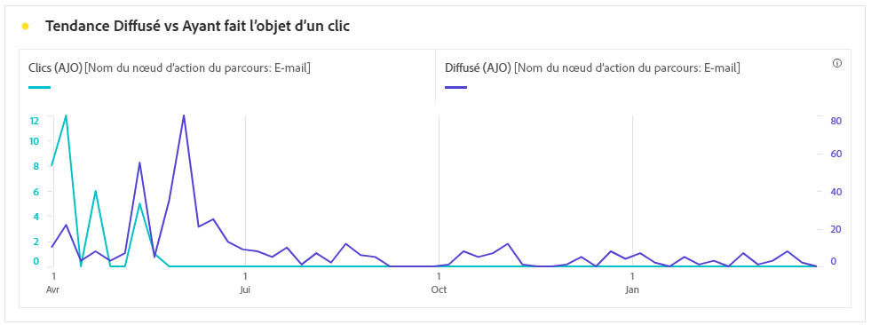
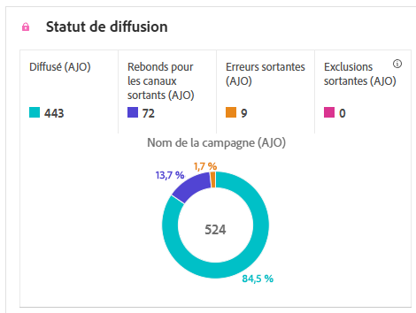
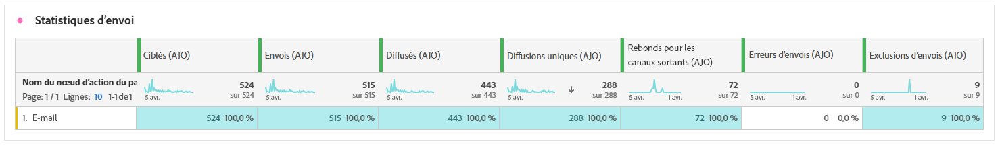
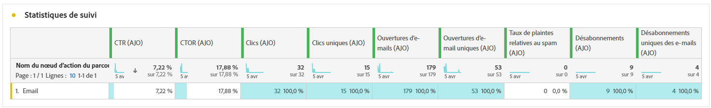
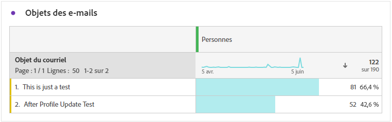
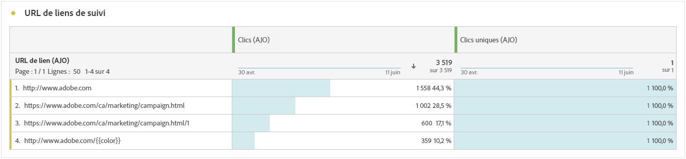

# Rapport de parcours {#journey-global-report}

Le **rapport de parcours** fonctionne comme un tableau de bord global, fournissant une analyse des mesures essentielles associées à votre parcours. Cela inclut des détails tels que le nombre de profils entrés et les instances de parcours individuels ayant échoué, ce qui vous permet d’avoir un aperçu complet de l’efficacité et du niveau d’engagement de votre parcours.

Vous pouvez accéder directement au **rapport de parcours** à partir de votre parcours à l’aide du bouton **[!UICONTROL Afficher le rapport]**.

La page **[!UICONTROL Rapport de parcours]** s’affiche avec les onglets suivants en fonction des activités de messages dans votre parcours :

* [Parcours](#journey-global)
* [E-mail](#email-global)
* [Notification push](#push-global)
* [SMS](#sms-global)
* [In-app](#in-app-global)
* [Web](#web-cja)
* [Courrier](#direct-mail-cja)

Pour en savoir plus sur l’espace de travail Customer Journey Analytics et sur le filtrage et l’analyse des données, consultez [cette page](https://experienceleague.adobe.com/fr/docs/analytics-platform/using/cja-workspace/home).

## Vue d’ensemble du parcours {#journey-global}

Le rapport **[!UICONTROL Parcours]** vous donne une vue claire des données de suivi les plus importantes concernant votre parcours.

### Indicateurs clés de performances du parcours {#journey-perfomance}

Les indicateurs clés de performances (KPI) du **[!UICONTROL parcours]** fonctionnent comme un tableau de bord global, fournissant une analyse des mesures essentielles associées à votre parcours. Cela inclut des détails tels que le nombre de profils entrés et les instances de parcours individuels ayant échoué, ce qui vous offre des informations complètes sur l’efficacité et le niveau d’engagement de votre parcours.

+++ En savoir plus sur les mesures des indicateurs clés de performances du parcours

* **[!UICONTROL Engagement du parcours]** : nombre total de personnes ayant interagi avec les messages envoyés depuis le parcours.

* **[!UICONTROL Entrées du parcours]** : nombre total de personnes ayant atteint l’événement d’entrée du parcours.

* **[!UICONTROL Sorties du parcours]** : nombre total de personnes ayant quitté le parcours.

* **[!UICONTROL Échecs de parcours]** : nombre total de parcours individuels qui n’ont pas été exécutés avec succès.

+++

### Statistiques du parcours {#journey-stats}

Le tableau **[!UICONTROL Statistiques du parcours]** offre un résumé détaillé des données essentielles relatives à vos parcours. Il comprend des mesures clés telles que le nombre d’échecs et d’entrées réussies, fournissant des informations précieuses sur les performances et la portée de vos e-mails et parcours.

+++ En savoir plus sur les mesures des statistiques du parcours

* **[!UICONTROL Engagement du parcours]** : nombre total de personnes ayant interagi avec les messages envoyés depuis le parcours.

* **[!UICONTROL Entrées du parcours]** : nombre total de personnes ayant atteint l’événement d’entrée du parcours.

* **[!UICONTROL Sorties du parcours]** : nombre total de personnes ayant quitté le parcours.

* **[!UICONTROL Échecs de parcours]** : nombre total de parcours individuels qui n’ont pas été exécutés avec succès.

* **[!UICONTROL Entrées de parcours uniques]** : nombre total de personnes ayant atteint l’événement d’entrée du parcours, les multiples interactions dʼun même profil ne sont pas prises en compte.

* **[!UICONTROL Sorties du parcours uniques]** : nombre total de personnes ayant quitté le parcours, les multiples interactions dʼun même profil ne sont pas prises en compte.

* **[!UICONTROL Échecs de parcours uniques]** : nombre total de parcours individuels n’ayant pas été exécutés avec succès, les multiples interactions dʼun même profil ne sont pas prises en compte.

+++

## Zone de travail du parcours {#journey-canvas}

Le widget **[!UICONTROL Zone de travail du parcours]** vous permet de retracer visuellement la trajectoire de vos profils ciblés tout au long de votre parcours.

Améliorez la personnalisation de votre zone de travail à l’aide des options suivantes :

* Ajoutez ou supprimez le type d’activité souhaité, tel que des messages ou des conditions, depuis le menu déroulant **[!UICONTROL Type de nœud]**.
* Ajustez la **[!UICONTROL Valeur de pourcentage]** pour déterminer la distribution du flux entre différents parcours.
* Personnalisez vos **[!UICONTROL Paramètres de flèche]** pour inclure des libellés, des conditions, ou optez pour un affichage clair.
* Activez l’option **[!UICONTROL Afficher les abandons]** pour visualiser les profils qui ont quitté votre parcours directement sur la zone de travail.

## Performances des actions {#action-performance}

### Performances dans le temps {#action-overtime}

Le graphe **[!UICONTROL Performances dans le temps]** vous permet d’identifier et d’analyser le nombre de profils répondant aux critères à considérer comme des profils cibles pour vos actions. Cette visualisation fournit des informations précieuses sur l’efficacité de vos stratégies et vous aide à prendre des décisions basées sur les données pour optimiser vos performances.

### Vue d’ensemble des actions {#action-overview}

Le tableau **[!UICONTROL Vue d’ensemble des actions]** sert de tableau de bord complet, offrant une analyse des mesures clés liées aux actions de votre parcours. Cela inclut des détails essentiels tels que le nombre d’interactions et le taux de clics.

+++ En savoir plus sur la vue d’ensemble des mesures d’action

* **[!UICONTROL Personnes]** : nombre de profils d’utilisateurs et d’utilisatrices qui sont qualifiés en tant que profils cibles pour vos actions.

* **[!UICONTROL Taux de clics]** : pourcentage d’utilisateurs et d’utilisatrices ayant interagi avec l’action.

* **[!UICONTROL Clics]** : nombre de clics sur un contenu dans vos actions.

* **[!UICONTROL Diffusés]** : nombre d’actions envoyées avec succès, par rapport au nombre total d’actions envoyées.

+++

## Performance des événements {#events-performance}

### Performances dans le temps {#event-overtime}

Le graphe **[!UICONTROL Performances dans le temps]** vous permet d’identifier et d’analyser le nombre de profils qualifiés de profils cibles pour vos événements. Cet outil puissant vous permet de suivre les tendances et les modèles dans le temps, fournissant des informations précieuses pour optimiser vos stratégies d’événement.

### Vue d’ensemble des événements {#event-overview}

Le tableau **[!UICONTROL Vue d’ensemble des événements]** indique le nombre de profils qui répondent à vos critères d’événement dans le temps. Cet outil vous permet d’identifier les schémas des taux de qualification pour affiner votre stratégie d’événement.

+++ En savoir plus sur les mesures des statistiques du parcours

* **[!UICONTROL Personnes]** : nombre de profils d’utilisateurs et d’utilisatrices qui sont qualifiés en tant que profils cibles pour vos événements.

+++

## Détails des emails {#email-global}

À partir de votre rapport de parcours, l’onglet **[!UICONTROL E-mail]** détaille les informations principales relatives aux e-mails envoyés dans votre parcours.

### Tendance diffusés et clics {#delivered-click}

Le graphe **[!UICONTROL Tendances diffusés et clics]** présente une analyse détaillée de l’engagement de vos profils vis-à-vis de vos e-mails, offrant des informations précieuses sur l’intéraction de différents domaines avec votre contenu.

+++ En savoir plus sur les mesures de tendance diffusés et clics

* **[!UICONTROL Diffusés]** : nombre d’e-mails envoyés avec succès, par rapport au nombre total d’e-mails envoyés.

* **[!UICONTROL Clics]** : nombre de clics sur un contenu dans vos e-mails.

+++

### Statut de la diffusion {#delivery-status}

Le graphe **[!UICONTROL Statut de diffusion]** vous permet de visualiser les performances de vos e-mails en un coup d’œil. Effectuez le suivi des mesures clés telles que les diffusions et les rebonds, afin de comprendre rapidement l’efficacité du parcours de vos e-mails.

+++ En savoir plus sur les mesures de statut de la diffusion.

* **[!UICONTROL Diffusés]** : nombre d’e-mails envoyés avec succès, par rapport au nombre total d’e-mails envoyés.

* **[!UICONTROL Rebonds pour les canaux sortants]** : nombre total d’erreurs cumulées lors de la procédure d’envoi et du traitement automatique des retours par rapport au nombre total de messages envoyés.

* **[!UICONTROL Erreurs sortantes]** : nombre total d’erreurs survenues au cours de la procédure d’envoi, empêchant l’envoi à des profils.

* **[!UICONTROL Exclus]** : nombre de profils qui ont été exclus par Adobe Journey Optimizer.

+++

### Statistiques d’envoi {#email-sending-statistics}

Le tableau **[!UICONTROL Statistiques d’envoi]** vous aide à comprendre les performances de vos e-mails dans vos parcours. Il suit des mesures clés telles que les taux de diffusion et les interactions, ce qui vous donne des informations précieuses pour optimiser votre stratégie d’envoi d’e-mails afin d’améliorer la portée et l’engagement.

+++ En savoir plus sur les mesures de statistiques d’envoi

* **[!UICONTROL Personnes]** : nombre de profils d’utilisateurs et d’utilisatrices qui sont qualifiés en tant que profils cibles pour vos messages.

* **[!UICONTROL Ciblés]** : nombre total d’e-mails traités lors de la procédure d’envoi.

* **[!UICONTROL Envois]** : nombre total d’e-mails envoyés.

* **[!UICONTROL Diffusés]** : nombre d’e-mails envoyés avec succès, par rapport au nombre total de messages envoyés.

* **[!UICONTROL Rebonds]** : nombre total d’erreurs cumulées lors de la procédure d’envoi et du traitement automatique des retours par rapport au nombre total de messages envoyés.

* **[!UICONTROL Erreurs sortantes]** : nombre total d’erreurs survenues au cours de la procédure d’envoi, empêchant l’envoi à des profils.

* **[!UICONTROL Exclusions sortantes]** : nombre de profils qui ont été exclus par Adobe Journey Optimizer.

+++

### E-mail - Statistiques de tracking {#email-tracking}

Le tableau **[!UICONTROL E-mail – Statistiques de tracking]** offre un compte rendu détaillé de l’activité de profil associée aux e-mails inclus dans votre parcours. Cela inclut des mesures sur les ouvertures, les clics et d’autres indicateurs d’engagement pertinents, offrant une vue d’ensemble complète de la manière dont les profils interagissent avec le contenu de vos e-mails.

+++ En savoir plus sur les mesures des statistiques de tracking

* **[!UICONTROL Taux de clics (CTR)]** : pourcentage d’utilisateurs et d’utilisatrices ayant interagi avec l’e-mail.

* **[!UICONTROL Taux d’ouverture par clic (CTOR)]** : nombre de fois où l’e-mail a été ouvert.

* **[!UICONTROL Clics]** : nombre de clics sur un contenu dans vos e-mails.

* **[!UICONTROL Clics uniques]** : nombre de profils qui ont cliqué sur un contenu dans un e-mail.

* **[!UICONTROL Ouvertures d’e-mails]** : nombre d’ouvertures de vos e-mails dans un parcours.

* **[!UICONTROL Ouvertures uniques d’e-mails]** : pourcentage d’e-mails ouverts.

* **[!UICONTROL Plaintes relatives aux spams]** : nombre de fois où un message a été déclaré comme spam ou courrier indésirable.

* **[!UICONTROL Désabonnements]** : nombre de clics sur le lien de désabonnement.

+++

### Domaines d’e-mails {#email-domains}

Le tableau **[!UICONTROL Domaines des e-mails]** offre une ventilation très détaillée des e-mails classés par domaine, ce qui permet d’obtenir des informations précises sur les mesures de performance des parcours de vos e-mails. Cette analyse exhaustive vous permet de comprendre le comportement de différents domaines en réponse au contenu de vos e-mails.

+++ En savoir plus sur les mesures des domaines d’e-mails

* **[!UICONTROL Envois]** : nombre total d’e-mails envoyés.

* **[!UICONTROL Diffusés]** : nombre d’e-mails envoyés avec succès, par rapport au nombre total d’e-mails envoyés.

* **[!UICONTROL Ouvertures d’e-mails]**: nombre d’ouvertures de vos e-mails dans un parcours.

* **[!UICONTROL Clics]** : nombre de clics sur un contenu dans vos e-mails.

* **[!UICONTROL Rebonds pour les canaux sortants]** : nombre total d’erreurs cumulées lors de la procédure d’envoi et du traitement automatique des retours par rapport au nombre total d’e-mails envoyés.

* **[!UICONTROL Erreurs sortantes]** : nombre total d’erreurs survenues au cours de la procédure d’envoi, empêchant l’envoi à des profils.
+++

### Libellés des liens de suivi {#track-link-label}

Le tableau **[!UICONTROL Libellés des liens de suivi]** fournit une vue d’ensemble complète des libellés des liens dans vos e-mails qui attirent le plus de visiteurs et de visiteuses. Cette fonctionnalité vous permet d’identifier et de hiérarchiser les liens les plus populaires.

+++ En savoir plus sur les mesures des libellés des liens de suivi

* **[!UICONTROL Clics uniques]** : nombre de profils qui ont cliqué sur un contenu dans un e-mail.

* **[!UICONTROL Clics]** : nombre de clics sur un contenu dans vos e-mails.

+++

### URL des liens de suivi {#track-link-url}

Le tableau **[!UICONTROL URL des liens de suivi]** fournit une vue d’ensemble complète des URL de votre e-mail qui attirent le plus de visiteurs et de visiteuses. Cela vous permet d’identifier et de hiérarchiser les liens les plus populaires, ce qui améliore votre compréhension de l’engagement des profils avec du contenu spécifique dans vos e-mails.

+++ En savoir plus sur les mesures des URL des liens de suivi

* **[!UICONTROL Clics uniques]** : nombre de profils qui ont cliqué sur un contenu dans un e-mail.

* **[!UICONTROL Clics]** : nombre de clics sur un contenu dans vos e-mails.

* **[!UICONTROL Affichages]** : nombre d’ouvertures du message.

* **[!UICONTROL Affichages uniques]** : nombre dʼouvertures du message, les multiples interactions dʼun même profil ne sont pas prises en compte.

+++

### Objets des e-mails {#email-subject}

Le tableau **[!UICONTROL Objets des e-mails]** fournit une vue d’ensemble complète des objets des e-mails qui attirent le plus de visiteurs et de visiteuses. Cette ressource offre des informations précieuses sur la dynamique d’engagement des audiences.

+++ En savoir plus sur les mesures des objets des e-mails

* **[!UICONTROL Personnes]** : nombre de profils d’utilisateurs et d’utilisatrices qui sont qualifiés en tant que profils cibles pour vos e-mails.

+++

### Raisons de rebond {#email-bounce-reasons}

Le tableau **[!UICONTROL Raisons de rebond]** compile les données disponibles relatives aux rebonds de messages, fournissant des informations détaillées sur les raisons spécifiques des rebonds d’e-mails.

Pour plus d’informations sur les rebonds, consultez la page [Liste de suppression](../reports/suppression-list.md).

### Causes d’exclusion {#email-excluded}

Le tableau **[!UICONTROL Causes d’exclusion]** présente une vue d’ensemble complète des différents facteurs qui ont abouti à l’exclusion des profils d’utilisateurs et d’utilisatrices de l’audience ciblée, entraînant la non-réception du message.

Consultez [cette page](exclusion-list.md) pour la liste complète des causes d’exclusion.

### Raisons des erreurs {#email-errors}

Le tableau **[!UICONTROL Causes d’erreur]** offre une visibilité des erreurs spécifiques survenues pendant le processus d’envoi, fournissant des informations précieuses sur la nature et l’occurrence des erreurs.

## Onglet Notification push {#push-global}

Dans le rapport de votre parcours, l’onglet **[!UICONTROL Notification push]** détaille les principales informations relatives aux notifications push envoyées dans votre parcours.

## Notification push {#push-notification}

### Statistiques d’envoi {#sending-statistics-push}

Le tableau **[!UICONTROL Statistiques d’envoi]** vous aide à comprendre les performances de vos notifications push. Il comprend des mesures clés telles que le taux de diffusion et la taille de l’audience, ce qui vous donne des informations précieuses sur l’efficacité et la portée de vos parcours.

+++ En savoir plus sur les mesures de statistiques d’envoi

* **[!UICONTROL Personnes]** : nombre de profils d’utilisateurs et d’utilisatrices qui sont qualifiés en tant que profils cibles pour vos SMS.

* **[!UICONTROL Ciblées]** : nombre total de notifications push traitées lors de l’analyse.

* **[!UICONTROL Envois]** : nombre total d’envois pour la notification push.

* **[!UICONTROL Diffusées]** : nombre de notifications push envoyées avec succès, par rapport au nombre total de notifications push envoyées.

* **[!UICONTROL Rebonds pour les canaux sortants]** : nombre total d’erreurs cumulées lors du processus d’envoi et du traitement automatique des retours par rapport au nombre total de notifications push envoyées.

* **[!UICONTROL Erreurs sortantes]** : nombre total d’erreurs survenues empêchant l’envoi à des profils.

* **[!UICONTROL Exclusions sortantes]** : nombre de profils qui ont été exclus par Adobe Journey Optimizer.

+++

### Statistiques de tracking {#tracking-statistics-push}

Le tableau **[!UICONTROL Statistiques de suivi]** offre un instantané détaillé de l’activité de profil liée à vos notifications push, fournissant des informations essentielles sur l’engagement et l’efficacité des notifications push.

+++ En savoir plus sur les mesures des statistiques de tracking

* **[!UICONTROL Taux de clics (CTR)]** : pourcentage d’utilisateurs et d’utilisatrices ayant interagi avec la notification push.

* **[!UICONTROL Taux d’ouvertures par clic (CTOR)]**: nombre de fois où votre notification push a été ouverte.

* **[!UICONTROL Clics]** : nombre de clics sur un contenu dans vos notifications push.

* **[!UICONTROL Clics uniques]** : nombre de profils qui ont cliqué sur un contenu dans vos notifications push.

<!--
* **[!UICONTROL Push custom actions]**: 
-->
+++

### Libellés des liens de suivi {#track-link-label-push}

Le tableau **[!UICONTROL Libellés des liens de suivi]** fournit une vue d’ensemble complète des libellés des liens dans vos notifications push, mettant en évidence celles qui attirent le plus de visiteurs et de visiteuses. Cette fonctionnalité vous permet d’identifier et de hiérarchiser les liens les plus populaires.

+++ En savoir plus sur les mesures des libellés des liens de suivi

* **[!UICONTROL Clics uniques]** : nombre de profils qui ont cliqué sur un contenu dans vos notifications push.

* **[!UICONTROL Clics]** : nombre de clics sur un contenu dans vos notifications push.

+++

### URL des liens de suivi {#track-link-url-push}

Le tableau **[!UICONTROL URL des liens de suivi]** fournit une vue d’ensemble complète des URL de vos notifications push qui attirent le plus de visiteurs et de visiteuses. Cela vous permet d’identifier et de hiérarchiser les liens les plus populaires, ce qui améliore votre compréhension de l’engagement des profils avec du contenu spécifique dans vos notifications push.

+++ En savoir plus sur les mesures des URL des liens de suivi

* **[!UICONTROL Clics uniques]** : nombre de profils qui ont cliqué sur un contenu dans vos notifications push.

* **[!UICONTROL Clics]** : nombre de clics sur un contenu dans vos notifications push.

+++

### Raisons de rebond {#bounce-reasons-push}

Le tableau **[!UICONTROL Causes de rebonds]** fournit une vue d’ensemble complète des données relatives aux rebonds de notifications push, fournissant des informations précieuses sur les raisons spécifiques à l’origine des rebonds des notifications push.

### Raisons des erreurs {#error-reasons-push}

Le tableau **[!UICONTROL Raisons des erreurs]** vous permet d’identifier les erreurs spécifiques qui se sont produites au cours du processus d’envoi de vos notifications push, fournissant une analyse minutieuse de tout problème rencontré.

### Causes d’exclusion {#exclude-reasons-push}

Le tableau **[!UICONTROL Causes d’exclusion]** décrit visuellement les différents facteurs qui ont conduit à l’exclusion des profils d’utilisateurs et d’utilisatrices de l’audience ciblée, ce qui les empêche de recevoir vos notifications push.

Consultez [cette page](exclusion-list.md) pour la liste complète des causes d’exclusion.

## SMS {#sms}

### Tendance diffusés et clics {#delivered-click-sms}

Le graphique **[!UICONTROL Tendance diffusés et clics]** présente une analyse détaillée de l’engagement de vos profils avec vos SMS, fournissant des informations précieuses sur la manière dont différents domaines interagissent avec votre contenu.

+++ En savoir plus sur les mesures de tendance diffusés et clics

* **[!UICONTROL Diffusés]** : nombre de messages SMS envoyés avec succès, par rapport au nombre total de SMS envoyés.

* **[!UICONTROL Clics]** : nombre de fois où un contenu a fait l’objet d’un clic dans vos SMS.

+++

### Statut de la diffusion {#delivery-status-sms}

Le tableau **[!UICONTROL Statut de diffusion]** offre un compte-rendu détaillé de l’activité du profil associée à vos SMS. Cela inclut des mesures sur les diffusions, les clics et d’autres indicateurs d’engagement pertinents, offrant une vue d’ensemble complète de la manière dont les profils interagissent avec le contenu de vos SMS.

+++ En savoir plus sur les mesures de statut de la diffusion.

* **[!UICONTROL Diffusés]** : nombre de messages SMS envoyés avec succès, par rapport au nombre total de SMS envoyés.

* **[!UICONTROL Rebonds pour les canaux sortants]** : nombre total d’erreurs cumulées lors de la procédure d’envoi et du traitement automatique des retours par rapport au nombre total de SMS envoyés.

* **[!UICONTROL Erreurs sortantes]** : nombre total d’erreurs survenues empêchant l’envoi à des profils.

* **[!UICONTROL Exclusions sortantes]** : nombre de profils qui ont été exclus par Adobe Journey Optimizer.

+++

### Libellés des liens de suivi {#track-link-label-sms}

Le tableau **[!UICONTROL Libellés des liens de suivi]** fournit une vue d’ensemble complète des libellés des liens dans vos SMS qui attirent le plus de visiteurs et de visiteuses. Cette fonctionnalité vous permet d’identifier et de hiérarchiser les liens les plus populaires.

+++ En savoir plus sur les mesures des libellés des liens de suivi

* **[!UICONTROL Clics uniques]** : nombre de profils qui ont cliqué sur un contenu dans vos SMS.

* **[!UICONTROL Clics]** : nombre de fois où un contenu a fait l’objet d’un clic dans vos SMS.

+++

### URL des liens de suivi {#track-link-url-sms}

Le tableau **[!UICONTROL URL des liens de suivi]** fournit une vue d’ensemble complète des URL de vos SMS qui attirent le plus de visiteurs et de visiteuses. Cela vous permet d’identifier et de hiérarchiser les liens les plus populaires, ce qui améliore votre compréhension de l’engagement des profils avec du contenu spécifique dans vos SMS.

+++ En savoir plus sur les mesures des URL des liens de suivi

* **[!UICONTROL Clics uniques]** : nombre de profils qui ont cliqué sur un contenu dans vos SMS.

* **[!UICONTROL Clics]** : nombre de fois où un contenu a fait l’objet d’un clic dans vos SMS.

* **[!UICONTROL Affichages]** : nombre d’ouvertures du message.

* **[!UICONTROL Affichages uniques]** : nombre dʼouvertures du message, les multiples interactions dʼun même profil ne sont pas prises en compte.

+++

### SMS entrant {#sms-inbound}

Le tableau **[!UICONTROL SMS entrants]** fournit une vue d’ensemble complète des SMS qui ont attiré le plus de visiteurs et de visiteuses. Cette ressource offre des informations précieuses sur la dynamique d’engagement des audiences.

+++ En savoir plus sur les mesures de SMS entrant

* **[!UICONTROL Personnes]** : nombre de profils d’utilisateurs et d’utilisatrices qui sont qualifiés en tant que profils cibles pour vos SMS.

+++

### Type de SMS {#sms-message-type}

Le tableau **[!UICONTROL Type de SMS]** fournit une vue d’ensemble complète des types de SMS qui ont attiré le plus de visiteurs et de visiteuses. Cette ressource offre des informations précieuses sur la dynamique d’engagement des audiences.

+++ En savoir plus sur les mesures de type de SMS

* **[!UICONTROL Personnes]** : nombre de profils d’utilisateurs et d’utilisatrices qui sont qualifiés en tant que profils cibles pour vos SMS.

+++

### Fournisseurs de SMS {#sms-providers}

Le tableau **[!UICONTROL Fournisseurs de SMS]** fournit une vue d’ensemble complète des fournisseurs de SMS qui ont attiré le plus de visiteurs et de visiteuses. Cette ressource offre des informations précieuses sur la dynamique d’engagement des audiences.

+++ En savoir plus sur les mesures des fournisseurs de SMS

* **[!UICONTROL Personnes]** : nombre de profils d’utilisateurs et d’utilisatrices qui sont qualifiés en tant que profils cibles pour vos SMS.

+++

### Raisons de rebond {#bounce-reasons-sms}

Le tableau **[!UICONTROL Causes de rebonds]** fournit une vue d’ensemble complète des données relatives aux rebonds de SMS, fournissant des informations précieuses sur les raisons spécifiques à l’origine des rebonds des SMS.

### Raisons des erreurs {#error-reasons-sms}

Le tableau **[!UICONTROL Raisons des erreurs]** offre une visibilité des erreurs spécifiques survenues pendant le processus d’envoi de vos SMS, fournissant une analyse minutieuse de tout problème rencontré.

### Causes d’exclusion {#excluded-reasons-sms}

Le tableau **[!UICONTROL Causes d’exclusion]** décrit visuellement les différents facteurs qui ont conduit à l’exclusion des profils d’utilisateurs et d’utilisatrices de l’audience ciblée, ce qui les empêche de recevoir vos SMS.

Consultez [cette page](exclusion-list.md) pour la liste complète des causes d’exclusion.

## In-app

### Tendance impressions et clics {#impression-click-trend}

Le graphique **[!UICONTROL Tendance impressions et clics]** présente une analyse détaillée de l’engagement de vos profils avec vos messages in-app, offrant des informations précieuses sur la manière dont les profils interagissent avec votre contenu.

+++ En savoir plus sur les mesures de tendance des impressions et des clics

* **[!UICONTROL Clics]** : nombre de fois où un contenu a fait l’objet d’un clic dans vos messages in-app.

* **[!UICONTROL Affichages]** : nombre d’ouvertures du message.

+++

### Clics {#clicks-inapp}

Le graphe **[!UICONTROL Clics]** affiche les mesures des clics in-app, qui illustrent à la fois le nombre total de clics sur le contenu et le nombre de profils uniques ayant cliqué sur le contenu.

+++ En savoir plus sur les mesures de clics

* **[!UICONTROL Clics uniques]** : nombre de profils qui ont cliqué sur un contenu dans vos messages in-app.

* **[!UICONTROL Clics]** : nombre de fois où un contenu a fait l’objet d’un clic dans vos messages in-app.

+++

### Affichage {#display-inapp}

Le graphique **[!UICONTROL Affichages]** vous permet de comprendre à la fois la portée globale du message et le nombre de profils uniques qui interagissent avec lui.

+++ En savoir plus sur les mesures d’affichage

* **[!UICONTROL Affichages]** : nombre d’ouvertures du message.

* **[!UICONTROL Affichages uniques]** : nombre dʼouvertures du message, les multiples interactions dʼun même profil ne sont pas prises en compte.

+++

### Données de suivi {#tracking-data-inapp}

Le tableau **[!UICONTROL Données de suivi]** offre un instantané détaillé de l’activité de profil liée à vos messages in-app, fournissant des informations essentielles sur l’engagement et l’efficacité des messages in-app.

+++ En savoir plus sur les mesures de données de suivi

* **[!UICONTROL Personnes]** : nombre de profils d’utilisateurs et d’utilisatrices qui sont qualifiés en tant que profils cibles pour vos messages in-app.

* **[!UICONTROL Taux de clics (CTR)]** : pourcentage d’utilisateurs et d’utilisatrices ayant interagi avec les messages in-app.

* **[!UICONTROL Taux d’ouverture des clics (CTOR)]** : nombre d’ouvertures des messages in-app.

* **[!UICONTROL Clics]** : nombre de fois où un contenu a fait l’objet d’un clic dans vos messages in-app.

* **[!UICONTROL Clics uniques]** : nombre de profils qui ont cliqué sur un contenu dans vos messages in-app.

* **[!UICONTROL Affichages]** : nombre d’ouvertures du message.

* **[!UICONTROL Affichages uniques]** : nombre dʼouvertures du message, les multiples interactions dʼun même profil ne sont pas prises en compte.

* **[!UICONTROL Envois]** : nombre total de messages in-app envoyés.

<!--
* **[!UICONTROL Inbound triggered]**: 

* **[!UICONTROL Inbound dismisses]**: 
-->
+++

### Libellés des liens de suivi {#track-link-label-inapp}

Le tableau **[!UICONTROL Libellés des liens de suivi]** fournit une vue d’ensemble complète des libellés des liens dans vos messages in-app qui attirent le plus de visiteurs et de visiteuses. Cette fonctionnalité vous permet d’identifier et de hiérarchiser les liens les plus populaires.

+++ En savoir plus sur les mesures des libellés des liens de suivi

* **[!UICONTROL Clics uniques]** : nombre de profils qui ont cliqué sur un contenu dans vos messages in-app.

* **[!UICONTROL Clics]** : nombre de fois qu’un contenu a fait l’objet d’un clic dans vos messages in-app.

* **[!UICONTROL Affichages]** : nombre dʼouvertures du message.

* **[!UICONTROL Affichages uniques]** : nombre dʼouvertures du message, les multiples interactions dʼun même profil ne sont pas prises en compte.

+++

### URL des liens de suivi {#track-link-url-inapp}

Le tableau **[!UICONTROL URL des liens de suivi]** fournit une vue d’ensemble complète des URL de vos messages in-app qui attirent le plus de visiteurs et de visiteuses. Cela vous aide à détecter les liens les plus populaires et à les hiérarchiser, améliorant ainsi votre compréhension de l’engagement des profils avec un contenu spécifique dans vos messages in-app.

+++ En savoir plus sur les mesures des URL des liens de suivi

* **[!UICONTROL Clics uniques]** : nombre de profils qui ont cliqué sur un contenu dans vos messages in-app.

* **[!UICONTROL Clics]** : nombre de fois où un contenu a fait l’objet d’un clic dans vos messages in-app.

+++

## Web {#web-cja}

### Tendance impressions et clics {#impressions-web}

Le graphique **[!UICONTROL Tendance impressions et clics]** présente une analyse détaillée de l’engagement de vos profils avec vos pages web, offrant des informations précieuses sur la manière dont les profils interagissent avec votre contenu.

+++ En savoir plus sur les mesures de tendance des impressions et des clics

* **[!UICONTROL Clics]** : nombre de fois où un contenu a fait l’objet d’un clic dans vos pages web.

* **[!UICONTROL Affichages]** : nombre d’ouvertures du message.

+++

### Clics {#clicks-web}

Le graphe **[!UICONTROL Clics]** affiche les mesures de clics sur les pages web, illustrant à la fois le nombre total de clics sur le contenu et le nombre de profils uniques ayant cliqué sur le contenu.

+++ En savoir plus sur les mesures de clics

* **[!UICONTROL Clics uniques]** : nombre de profils qui ont cliqué sur un contenu dans vos pages web.

* **[!UICONTROL Clics]** : nombre de fois où un contenu a fait l’objet d’un clic dans vos pages web.

+++

### Affichages {#displays-web}

Le graphe **[!UICONTROL Affichages]** vous permet de comprendre à la fois la portée globale du message et le nombre de profils uniques qui interagissent avec lui.

+++ En savoir plus sur les mesures d’affichage

* **[!UICONTROL Affichages]** : nombre d’ouvertures du message.

* **[!UICONTROL Affichages uniques]** : nombre dʼouvertures du message, les multiples interactions dʼun même profil ne sont pas prises en compte.

+++

### Données de suivi {#track-data-web}

Le tableau **[!UICONTROL Données de suivi]** offre un instantané détaillé de l’activité des profils liés à vos pages web, fournissant des informations essentielles sur l’engagement et l’efficacité des pages web.

+++ En savoir plus sur les mesures de données de suivi

* **[!UICONTROL Personnes]** : nombre de profils d’utilisateurs et d’utilisatrices qui se qualifient en tant que profils cibles pour vos pages web.

* **[!UICONTROL Taux de clics (CTR)]** : pourcentage d’utilisateurs et d’utilisatrices ayant interagi avec les pages web.

* **[!UICONTROL Clics]** : nombre de fois où un contenu a fait l’objet d’un clic dans vos pages web.

* **[!UICONTROL Clics uniques]** : nombre de profils qui ont cliqué sur un contenu dans vos pages web.

* **[!UICONTROL Affichages]** : nombre d’ouvertures de la page web.

* **[!UICONTROL Affichages uniques]** : nombre dʼouvertures de la page web, les multiples interactions dʼun même profil ne sont pas prises en compte.

+++

### Libellés des liens de suivi {#track-link-web}

Le tableau **[!UICONTROL Libellés des liens de suivi]** fournit une vue d’ensemble complète des libellés des liens dans vos pages web qui attirent le plus de visiteurs et de visiteuses. Cette fonctionnalité vous permet d’identifier et de hiérarchiser les liens les plus populaires.

+++ En savoir plus sur les mesures des libellés des liens de suivi

* **[!UICONTROL Clics uniques]** : nombre de profils qui ont cliqué sur un contenu dans vos pages web.

* **[!UICONTROL Clics]** : nombre de fois où un contenu a fait l’objet d’un clic dans vos pages web.

* **[!UICONTROL Affichages]** : nombre d’ouvertures du message.

* **[!UICONTROL Affichages uniques]** : nombre dʼouvertures du message, les multiples interactions dʼun même profil ne sont pas prises en compte.

+++

### URL des liens de suivi {#track-url-web}

Le tableau **[!UICONTROL URL des liens suivis]** fournit une vue d’ensemble complète des URL de vos pages web qui attirent le plus de visiteurs et de visiteuses. Cela vous permet d’identifier et de hiérarchiser les liens les plus populaires, ce qui améliore votre compréhension de l’engagement des profils avec du contenu spécifique dans vos pages web.

+++ En savoir plus sur les mesures des URL des liens de suivi

* **[!UICONTROL Clics uniques]** : nombre de profils qui ont cliqué sur un contenu dans vos pages web.

* **[!UICONTROL Clics]** : nombre de fois où un contenu a fait l’objet d’un clic dans vos pages web.

* **[!UICONTROL Affichages]** : nombre d’ouvertures du message.

* **[!UICONTROL Affichages uniques]** : nombre dʼouvertures du message, les multiples interactions dʼun même profil ne sont pas prises en compte.

+++

## Courrier {#direct-mail-cja}

### Statistiques d’envoi {#sending-statistics-directmail}

Le tableau **[!UICONTROL Statistiques d’envoi]** vous aide à comprendre les performances de vos parcours de publipostage direct. Consultez les mesures clés telles que le nombre de personnes ciblées et de pièces diffusées avec succès afin d’évaluer la portée et l’efficacité de vos envois.

+++ En savoir plus sur les mesures de statistiques d’envoi

* **[!UICONTROL Personnes]** : nombre de profils d’utilisateurs et d’utilisatrices qui sont qualifiés en tant que profils cibles pour vos messages.

* **[!UICONTROL Ciblés]** : nombre total de messages de publipostage direct traités lors de la procédure d’envoi.

* **[!UICONTROL Envois]** : nombre total de messages de publipostage direct envoyés.

* **[!UICONTROL Diffusés]** : nombre de messages de publipostage direct envoyés avec succès, par rapport au nombre total de messages envoyés.

* **[!UICONTROL Erreurs sortantes]** : nombre total d’erreurs survenues au cours de la procédure d’envoi, empêchant l’envoi à des profils.

* **[!UICONTROL Exclusions sortantes]** : nombre de profils qui ont été exclus par Adobe Journey Optimizer.

+++

### Statut de la diffusion {#delivery-status-directmail}

Le graphique **[!UICONTROL Statut de diffusion]** fournit une vue complète des données relatives aux messages de publipostage direct envoyés dans le cadre de votre parcours, offrant des informations sur les mesures clés telles que les diffusions et les erreurs. Cela permet une analyse détaillée du processus d’envoi des messages de publipostage direct, fournissant des informations précieuses sur l’efficacité et les performances de vos parcours.

+++ En savoir plus sur les mesures de statut de la diffusion.

* **[!UICONTROL Diffusés]** : nombre de messages de publipostage direct envoyés avec succès, par rapport au nombre total de messages de publipostage direct envoyés.

* **[!UICONTROL Erreurs sortantes]** : nombre total d’erreurs survenues au cours du processus d’envoi, empêchant l’envoi de vos messages de publipostage direct à des profils.

* **[!UICONTROL Exclusions sortantes]** : nombre de profils qui ont été exclus par Adobe Journey Optimizer.

+++

### Raisons des erreurs {#error-reasons-directmail}

Le tableau **[!UICONTROL Raisons des erreurs]** offre une visibilité des erreurs spécifiques survenues pendant le processus d’envoi de vos message de publipostage direct, fournissant une analyse minutieuse de tout problème rencontré.

### Causes d’exclusion {#exclude-reasons-directmail}

Le tableau **[!UICONTROL Causes d’exclusion]** décrit visuellement les différents facteurs qui ont conduit à l’exclusion des profils d’utilisateurs et d’utilisatrices de l’audience ciblée, ce qui les empêche de recevoir vos messages de publipostage direct.

Consultez [cette page](exclusion-list.md) pour la liste complète des causes d’exclusion.
