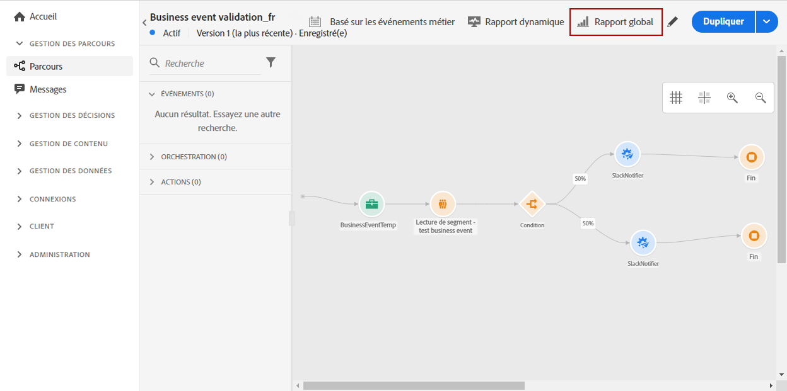
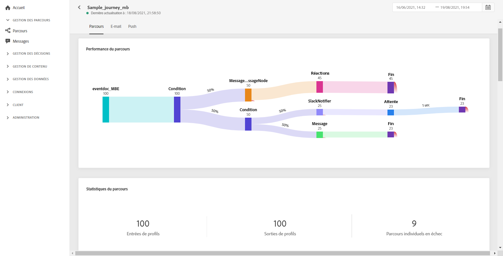

# Rapport global de parcours {#journey-global-report}

Vous pouvez accéder directement au rapport global de parcours à partir de votre parcours à l&#39;aide du bouton **[!UICONTROL Rapport global]**.

La page **[!UICONTROL Rapport global]** du parcours s’affiche avec les onglets suivants :

* [Parcours](#journey-global)
* [Email](#email-global)
* [Push](#push-global)

Le rapport **[!UICONTROL global]** de parcours est divisé en différents widgets détaillant la réussite et les erreurs de votre parcours. Chaque widget peut être redimensionné et supprimé si nécessaire. Pour plus d’informations à ce propos, consultez cette [section](global-report.md#modify-dashboard).

## Onglet Parcours {#journey-global}

À partir de votre **[!UICONTROL rapport global]** de parcours, l&#39;onglet **[!UICONTROL Parcours]** vous donne une vue claire des données de suivi les plus importantes concernant votre parcours.

Le widget **[!UICONTROL Performances du parcours]** vous permet de voir le cheminement de vos profils ciblés pas à pas tout au long du parcours.

Le widget **[!UICONTROL Statistiques du parcours]** affiche les KPI suivants :

* **[!UICONTROL Profils entrés]** : nombre total de personnes ayant atteint l’événement d’entrée du parcours.

* **[!UICONTROL Profils sortis]** : nombre total de personnes ayant quitté le parcours.

* **[!UICONTROL Parcours individuel en échec]** : nombre total de parcours individuels qui n’ont pas été exécutés avec succès.

Les widgets **[!UICONTROL Performances de l&#39;événement]** et **[!UICONTROL Principaux événements]** vous permettent de savoir lequel de vos **[!UICONTROL Événements]** a été exécuté avec succès par le biais de graphiques et de tableaux.

Les widgets **[!UICONTROL Performance de l&#39;action]** et **[!UICONTROL Principales actions]** représentent l’action et les erreurs les plus réussies survenues lorsque vos **[!UICONTROL Actions]** ont été déclenchées. Le tableau **[!UICONTROL Principales actions]** contient les données disponibles pour **[!UICONTROL Actions]**, telles que :

* **[!UICONTROL Actions exécutées avec succès]** : nombre total d’**[!UICONTROL actions]** exécutées avec succès pour un parcours.

* **[!UICONTROL Erreur lors de l&#39;action]** : nombre total d&#39;erreurs survenues pour les **[!UICONTROL actions]**.

Le graphique **[!UICONTROL Raisons de l&#39;erreur]** détaille le type d&#39;erreurs survenues pour les **[!UICONTROL actions]**.

<!--Events by origin-->

## Onglet E-mail {#email-global}

À partir de votre **[!UICONTROL Rapport global]** de parcours, l&#39;onglet **[!UICONTROL E-mail]** détaille les principales informations relatives aux diffusions par e-mail envoyées dans votre parcours.

Pour obtenir un rapport détaillé sur une diffusion par e-mail spécifique, consultez la section [Rapport global d&#39;e-mail](#email-global-report).

Le graphique **[!UICONTROL Statistiques d&#39;envoi d&#39;e-mail]** détaille la réussite de votre diffusion :

* **[!UICONTROL Envoyés]** : nombre total d’envois pour la diffusion.

* **[!UICONTROL Délivrés]** : nombre de messages envoyés avec succès, par rapport au nombre total de messages envoyés.

* **[!UICONTROL Taux de diffusion]** : pourcentage de messages envoyés avec succès.

* **[!UICONTROL Bounces]** : nombre total d’erreurs cumulées lors des diffusions et du traitement automatique des retours par rapport au nombre total de messages envoyés.

* **[!UICONTROL Taux de rebond]** : pourcentage d&#39;e-mails ayant rebondi par rapport aux e-mails envoyés.

* **[!UICONTROL Erreurs]** : nombre total d’erreurs survenues au cours d’une diffusion, l&#39;empêchant d&#39;être envoyée à des profils.

* **[!UICONTROL Taux d’erreurs]** : pourcentage d’erreurs survenues au cours d’une diffusion, l&#39;empêchant d’être envoyée, par rapport aux e-mails envoyés.

**[!UICONTROL E-mail - Statistiques de suivi]** contient les données disponibles pour l&#39;activité destinataire de votre diffusion :

* **[!UICONTROL Ouvertures]** :nombre de fois où la diffusion a été ouverte dans une diffusion.

* **[!UICONTROL Ouvertures uniques]** : pourcentage de diffusions ouvertes.

* **[!UICONTROL Taux d’ouvertures]** : nombre total de messages ouverts par rapport au nombre de messages diffusés.

* **[!UICONTROL Clics]** : nombre de fois où un contenu a fait l&#39;objet d&#39;un clic dans un e-mail.

* **[!UICONTROL Clics uniques]** : nombre de destinataires qui ont cliqué sur un contenu dans un e-mail.

* **[!UICONTROL Taux de clics]** : pourcentage d&#39;utilisateurs ayant interagi avec le parcours.

Le graphique **[!UICONTROL Statistiques d&#39;envoi]** contient les données disponibles pour les e-mails envoyés, telles que :

* **[!UICONTROL Délivrés]** : nombre de messages envoyés avec succès, par rapport au nombre total de messages envoyés.

* **[!UICONTROL Bounces]** : nombre total d’erreurs cumulées lors des diffusions et du traitement automatique des retours par rapport au nombre total de messages envoyés.

* **[!UICONTROL Erreurs]** : nombre total d’erreurs survenues au cours d’une diffusion, l&#39;empêchant d&#39;être envoyée à des profils.

Les widgets **[!UICONTROL Raisons de rebond]** et **[!UICONTROL Catégories de rebond]** contiennent les données disponibles relatives aux messages de rebond, telles que :

* **[!UICONTROL Hard bounce]** : nombre total d’erreurs permanentes, telles qu’une adresse email incorrecte. Un message d’erreur indique explicitement que l’adresse n’est pas valide, comme Utilisateur inconnu.

* **[!UICONTROL Soft bounces]** : nombre total d’erreurs temporaires, telles qu’une boîte de réception pleine.

* **[!UICONTROL Ignorées]** : nombre total d’erreurs temporaires (par exemple, Absent(e) du bureau) ou techniques (par exemple, si le type d’expéditeur est administrateur).

Pour plus d&#39;informations sur les rebonds, consultez la page [Liste de suppression](../suppression-list.md) .

Le graphique et le tableau **[!UICONTROL E-mail - URL supérieure]** indiquent les URL de votre diffusion les plus visitées.

Le graphique et le tableau **[!UICONTROL E-mail - Meilleur domaine destinataire]** indiquent les domaines les plus utilisés par les destinataires pour ouvrir l&#39;e-mail.

## Onglet Push {#push-global}

Dans le **[!UICONTROL rapport global]** de votre parcours, l&#39;onglet **[!UICONTROL Push]** détaille les informations principales par rapport aux diffusions push envoyées dans votre parcours.

Pour obtenir un rapport détaillé sur une diffusion push spécifique, reportez-vous à ce [rapport global push](#push-global-report).

Le tableau **[!UICONTROL Notification push - Statistiques d&#39;envoi]** présente les principales informations relatives à vos notifications push avec un graphique et des KPI :

* **[!UICONTROL Envoyés]** : nombre total d’envois pour la diffusion.

* **[!UICONTROL Délivrés]** : nombre de messages envoyés avec succès, par rapport au nombre total de messages envoyés.

* **[!UICONTROL Taux de diffusion]** : pourcentage de messages envoyés avec succès.

* **[!UICONTROL Bounces]** : nombre total d’erreurs cumulées lors des diffusions et du traitement automatique des retours par rapport au nombre total de messages envoyés.

* **[!UICONTROL Taux de rebond]** : pourcentage de notifications push ayant rebondi par rapport aux notifications push envoyées.

* **[!UICONTROL Erreurs]** : nombre total d’erreurs survenues au cours d’une diffusion, l&#39;empêchant d&#39;être envoyée à des profils.

* **[!UICONTROL Taux d’erreurs]** : pourcentage d’erreurs survenues pendant une diffusion qui l’empêchent d’être envoyée par rapport aux notifications push envoyées.

Les **[!UICONTROL Statistiques de suivi - push]** contiennent les données disponibles pour l&#39;activité destinataire de votre diffusion :

* **[!UICONTROL Ouvertures]** : nombre de fois qu&#39;un message a été ouvert dans une diffusion.

* **[!UICONTROL Taux d&#39;ouverture]** : pourcentage de notifications push ouvertes.

* **[!UICONTROL Actions]** : nombre total d’actions sur la notification push diffusée, par exemple clic sur un bouton ou rejet.

* **[!UICONTROL Engagements]** : nombre total d’ouvertures et d’actions pour cette notification push, c’est-à-dire si le profil a ouvert la notification ou si un utilisateur a cliqué sur un bouton.

* **[!UICONTROL Taux d’engagement]** : pourcentage d’ouvertures et d’actions pour cette notification push, c’est-à-dire si le profil a ouvert la notification push ou si un utilisateur a cliqué sur un bouton.

Le graphique **[!UICONTROL Résumé des notifications push]** contient les données disponibles pour les notifications push envoyées, telles que :

* **[!UICONTROL Ouvertures]** : nombre de fois qu&#39;un message a été ouvert dans une diffusion.

* **[!UICONTROL Actions]** : nombre total d’actions sur la notification push diffusée, par exemple clic sur un bouton ou rejet.

* **[!UICONTROL Bounces]** : nombre total d’erreurs cumulées lors des diffusions et du traitement automatique des retours par rapport au nombre total de messages envoyés.

* **[!UICONTROL Délivrés]** : nombre de messages envoyés avec succès, par rapport au nombre total de messages envoyés.

* **[!UICONTROL Erreurs]** : nombre total d’erreurs survenues au cours d’une diffusion, l&#39;empêchant d&#39;être envoyée à des profils.

Le graphique et le tableau **[!UICONTROL Raisons de l&#39;erreur]** vous permettent de voir quelle erreur s&#39;est produite au cours de votre diffusion.

Les graphiques et tableaux **[!UICONTROL Suivi par plate-forme]**, **[!UICONTROL Envoi par plate-forme]** et **[!UICONTROL Ventilation par plate-forme]** décrivent le succès de votre notification push en fonction du système opérationnel de votre destinataire.
