# Rapport global sur les parcours {#journey-global-report}

Vous pouvez accéder directement au rapport global de parcours à partir de votre parcours à l&#39;aide du bouton **[!UICONTROL Rapport global]**.

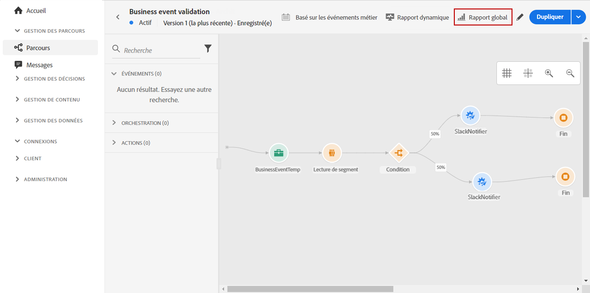

La page **[!UICONTROL Rapport global]** du parcours s&#39;affiche avec les onglets suivants :

* [Parcours](#journey-global)
* [Email](#email-global)
* [Push](#push-global)

Le rapport **[!UICONTROL global]** de parcours est divisé en différents widgets détaillant la réussite et les erreurs de votre parcours. Chaque widget peut être redimensionné et supprimé si nécessaire. Pour plus d&#39;informations à ce propos, consultez cette [section](global-report.md#modify-dashboard).

## Onglet Parcours {#journey-global}

À partir de votre **[!UICONTROL rapport global]** de parcours, l&#39;onglet **[!UICONTROL Parcours]** vous donne une vue claire des données de suivi les plus importantes concernant votre parcours.

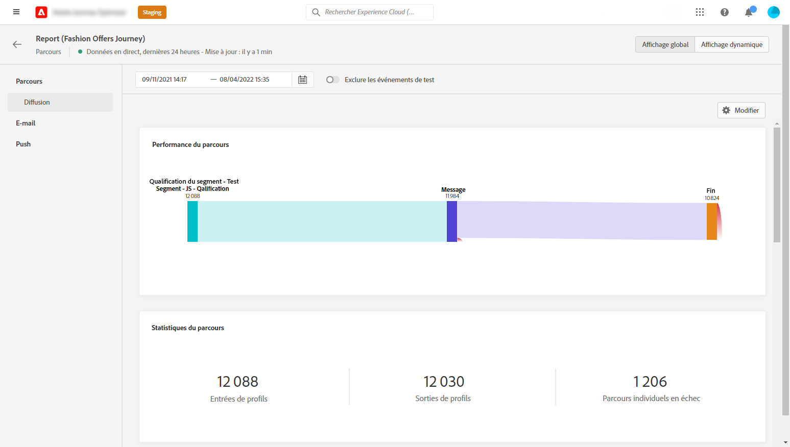

Le widget **[!UICONTROL Performances du parcours]** vous permet de voir le cheminement de vos profils ciblés pas à pas tout au long du parcours.

Le widget **[!UICONTROL Statistiques du parcours]** affiche les KPI suivants :

* **[!UICONTROL Profils entrés]** : nombre total de personnes ayant atteint l&#39;événement d&#39;entrée du parcours.

* **[!UICONTROL Profils sortis]** : nombre total de personnes ayant quitté le parcours.

* **[!UICONTROL Parcours individuel en échec]** : nombre total de parcours individuels qui n&#39;ont pas été exécutés avec succès.

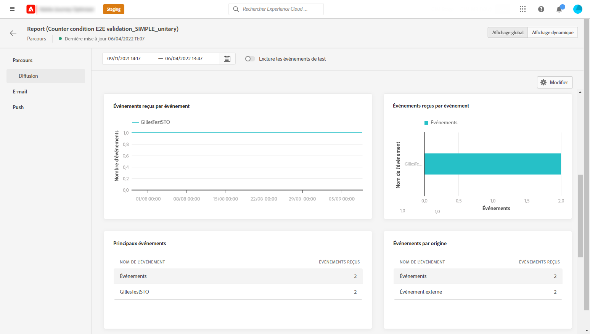

Les widgets **[!UICONTROL Événements reçus par événement]****** et **[!UICONTROL Événements par origine]** vous permettent de savoir lequel de vos **[!UICONTROL Événements]** a été exécuté avec succès par le biais de graphiques et de tableaux.

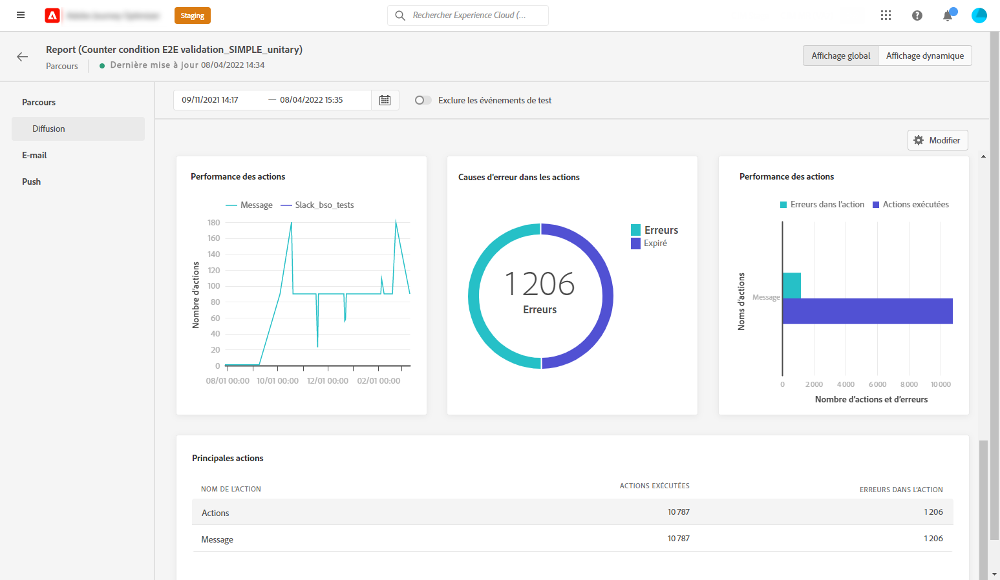

Les widgets **[!UICONTROL Performance de l&#39;action]**, **[!UICONTROL Raisons de l&#39;erreur de l&#39;action]** et **[!UICONTROL Principales actions]** représentent l&#39;action la plus réussie et les erreurs survenues lorsque vos **[!UICONTROL Actions]** ont été déclenchées.

Le tableau **[!UICONTROL Principales actions]** contient les données disponibles pour **[!UICONTROL Actions]**, telles que :

* **[!UICONTROL Actions exécutées avec succès]** : nombre total d&#39;**[!UICONTROL actions]** exécutées avec succès pour un parcours.

* **[!UICONTROL Erreur lors de l&#39;action]** : nombre total d&#39;erreurs survenues pour les **[!UICONTROL actions]**.

## Onglet E-mail {#email-global}

À partir de votre **[!UICONTROL Rapport global]** de parcours, l&#39;onglet **[!UICONTROL E-mail]** détaille les principales informations relatives aux diffusions par e-mail envoyées dans votre parcours.

Pour obtenir un rapport détaillé sur une diffusion par e-mail spécifique, consultez la section [Rapport global d&#39;e-mail](#email-global-report).

Le graphique **[!UICONTROL Statistiques d&#39;envoi d&#39;e-mail]** détaille la réussite de votre diffusion :

* **[!UICONTROL Envoyés]** : nombre total d&#39;envois pour la diffusion.

* **[!UICONTROL Délivrés]** : nombre de messages envoyés avec succès, par rapport au nombre total de messages envoyés.

* **[!UICONTROL Taux de diffusion]** : pourcentage de messages envoyés avec succès.

* **[!UICONTROL Bounces]** : nombre total d&#39;erreurs cumulées lors des diffusions et du traitement automatique des retours par rapport au nombre total de messages envoyés.

* **[!UICONTROL Taux de rebond]** : pourcentage d&#39;e-mails ayant rebondi par rapport aux e-mails envoyés.

* **[!UICONTROL Erreurs]** : nombre total d&#39;erreurs survenues au cours d&#39;une diffusion, l&#39;empêchant d&#39;être envoyée à des profils.

* **[!UICONTROL Taux d&#39;erreurs]** : pourcentage d&#39;erreurs survenues au cours d&#39;une diffusion, l&#39;empêchant d&#39;être envoyée, par rapport aux e-mails envoyés.

**[!UICONTROL E-mail - Statistiques de suivi]** contient les données disponibles pour l&#39;activité destinataire de votre diffusion :

* **[!UICONTROL Ouvertures]** :nombre de fois où la diffusion a été ouverte dans une diffusion.

* **[!UICONTROL Ouvertures uniques]** : pourcentage de diffusions ouvertes.

* **[!UICONTROL Taux d&#39;ouvertures]** : nombre total de messages ouverts par rapport au nombre de messages diffusés.

* **[!UICONTROL Clics]** : nombre de fois où un contenu a fait l&#39;objet d&#39;un clic dans un e-mail.

* **[!UICONTROL Clics uniques]** : nombre de destinataires qui ont cliqué sur un contenu dans un e-mail.

* **[!UICONTROL Taux de clics]** : pourcentage d&#39;utilisateurs ayant interagi avec le parcours.

* **[!UICONTROL Désabonnements]** : nombre de clics sur le lien de désabonnement.

* **[!UICONTROL Plaintes contre le spal]** : nombre de fois où un message a été déclaré comme spam ou courrier indésirable.

Le graphique **[!UICONTROL Statistiques d&#39;envoi]** contient les données disponibles pour les e-mails envoyés, telles que :

* **[!UICONTROL Délivrés]** : nombre de messages envoyés avec succès, par rapport au nombre total de messages envoyés.

* **[!UICONTROL Bounces]** : nombre total d&#39;erreurs cumulées lors des diffusions et du traitement automatique des retours par rapport au nombre total de messages envoyés.

* **[!UICONTROL Erreurs]** : nombre total d&#39;erreurs survenues au cours d&#39;une diffusion, l&#39;empêchant d&#39;être envoyée à des profils.

Les widgets **[!UICONTROL Raisons de rebond]** et **[!UICONTROL Catégories de rebond]** contiennent les données disponibles relatives aux messages de rebond, telles que :

* **[!UICONTROL Hard bounce]** : nombre total d&#39;erreurs permanentes, telles qu&#39;une adresse email incorrecte. Un message d&#39;erreur indique explicitement que l&#39;adresse n&#39;est pas valide, comme Utilisateur inconnu.

* **[!UICONTROL Soft bounces]** : nombre total d&#39;erreurs temporaires, telles qu&#39;une boîte de réception pleine.

* **[!UICONTROL Ignorées]** : nombre total d&#39;erreurs temporaires (par exemple, Absent(e) du bureau) ou techniques (par exemple, si le type d&#39;expéditeur est administrateur).

Pour plus d&#39;informations sur les bounces, consultez la page [Liste de suppression](../reports/suppression-list.md).

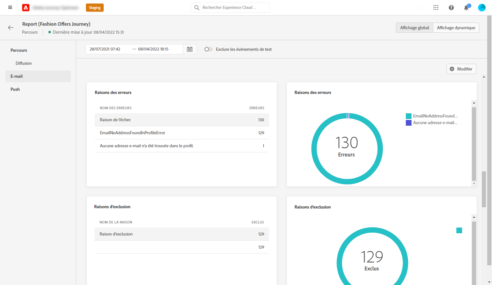

Le graphique et le tableau **[!UICONTROL Causes des erreurs]** vous permettent de voir quelle erreur s’est produite au cours de votre diffusion.

Le graphique et le tableau **[!UICONTROL Exclure des raisons]** affichent les différentes raisons qui ont empêché les profils utilisateur, à part les profils ciblés, de recevoir le message.

Le graphique et le tableau **[!UICONTROL E-mail - Principales URL]** indiquent les URL de votre diffusion les plus visitées.

Le graphique et le tableau **[!UICONTROL E-mail - Meilleur domaine destinataire]** indiquent les domaines les plus utilisés par les destinataires pour ouvrir l&#39;e-mail.

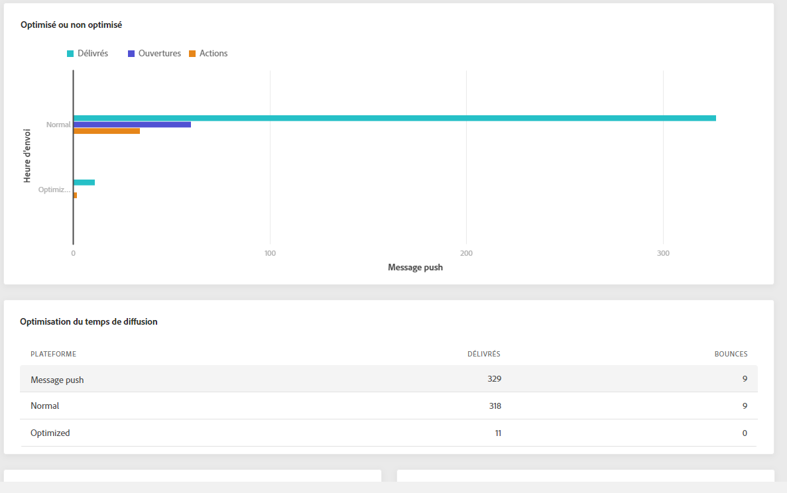

>[!NOTE]
>
>Les widgets **[!UICONTROL Optimisé ou non optimisé]** et **[!UICONTROL Optimisation de l’heure d’envoi]** ne sont disponibles que si l’option Optimisation de l’heure d’envoi est activée pour votre diffusion. Pour plus d’informations sur l’optimisation de l’heure d’envoi, consultez cette [page](../building-journeys/journeys-message.md#send-time-optimization).

Le graphique **[!UICONTROL Optimisé ou non optimisé]** détaille les informations principales relatives à votre message, qu’elles soient optimisées ou non :

* **[!UICONTROL Envoyés]** : nombre total d’envois pour la diffusion.
* **[!UICONTROL Ouvertures]** : nombre de fois où la diffusion a été ouverte dans une diffusion.
* **[!UICONTROL Clics]** : nombre de fois où un contenu a fait l’objet d’un clic dans un e-mail.

L’**[!UICONTROL Optimisation de l’heure d’envoi]** détaille le succès de votre diffusion selon la méthode d’envoi : optimisé ou normal.

* **[!UICONTROL Délivrés]** : nombre de messages envoyés avec succès, par rapport au nombre total de messages envoyés.
* **[!UICONTROL Bounces]** : nombre total d&#39;erreurs cumulées lors des diffusions et du traitement automatique des retours par rapport au nombre total de messages envoyés.

<!--
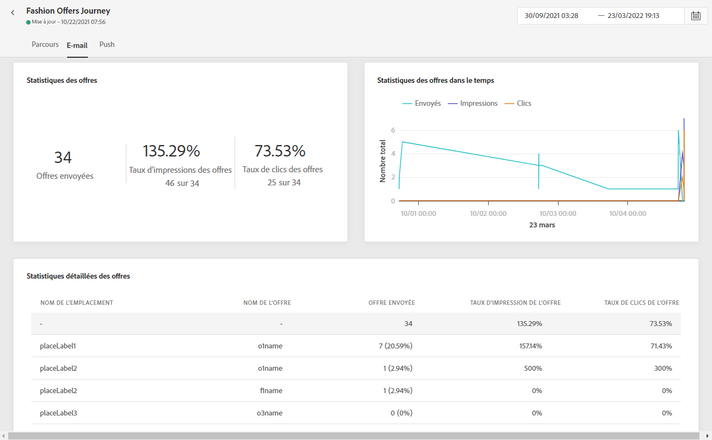

>[!NOTE]
>
>The Offers widgets and metrics are only available if a decision was inserted in an email. For more information on Decision Management, refer to this [page](../offers/get-started/starting-offer-decisioning.md).

The **[!UICONTROL Offers statistic]** and **[!UICONTROL Offers statistics]** over time widgets measure your offer's success and impact on your targeted audience. It detail the main information relative to your message with KPIs:

* **[!UICONTROL Offer sent]**: Total number of sends for the offer.

* **[!UICONTROL Offer impression]**: Number of times the offer was opened in a delivery.

* **[!UICONTROL Offer clicks]**: Number of times an offer was clicked on in a delivery.

The **[!UICONTROL Offers detailed statistic]** table contains the available data for recipient activity with your offer:

* **[!UICONTROL Placement name]**: Name of your placement used to display your offer. For more information on placement, refer to this [page](../offers/offer-library/creating-placements.md).

* **[!UICONTROL Offer name]**: Name of the offer added in the delivery. For more information on placement, refer to this [page](../offers/offer-library/creating-personalized-offers.md).

* **[!UICONTROL Offer sent]**: Total number of sends for the offer.

* **[!UICONTROL Offer impression rate]**: Percentage of opened offers compared to the number of sent offers.

* **[!UICONTROL Offer click rate]**: Percentage of users who interacted with the offer.
-->

## Onglet Push {#push-global}

Dans le **[!UICONTROL rapport global]** de votre parcours, l&#39;onglet **[!UICONTROL Push]** détaille les informations principales par rapport aux diffusions push envoyées dans votre parcours.

Pour obtenir un rapport détaillé sur une diffusion push spécifique, reportez-vous à ce [rapport global push](#push-global-report).

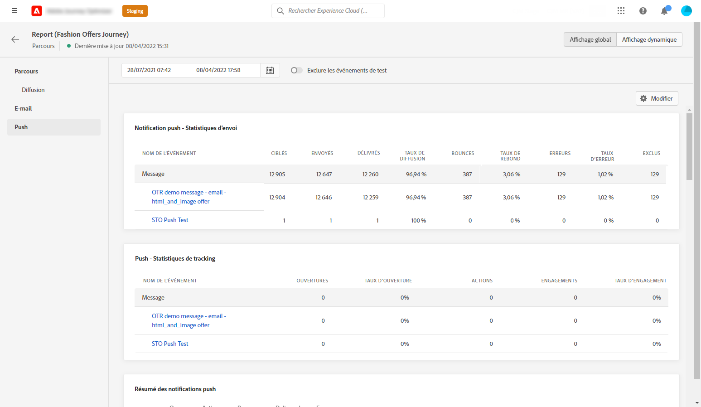

Le tableau **[!UICONTROL Notification push - Statistiques d&#39;envoi]** présente les principales informations relatives à vos notifications push avec un graphique et des KPI :

* **[!UICONTROL Envoyés]** : nombre total d&#39;envois pour la diffusion.

* **[!UICONTROL Délivrés]** : nombre de messages envoyés avec succès, par rapport au nombre total de messages envoyés.

* **[!UICONTROL Taux de diffusion]** : pourcentage de messages envoyés avec succès.

* **[!UICONTROL Bounces]** : nombre total d&#39;erreurs cumulées lors des diffusions et du traitement automatique des retours par rapport au nombre total de messages envoyés.

* **[!UICONTROL Taux de rebond]** : pourcentage de notifications push ayant rebondi par rapport aux notifications push envoyées.

* **[!UICONTROL Erreurs]** : nombre total d&#39;erreurs survenues au cours d&#39;une diffusion, l&#39;empêchant d&#39;être envoyée à des profils.

* **[!UICONTROL Taux d&#39;erreurs]** : pourcentage d&#39;erreurs survenues pendant une diffusion qui l&#39;empêchent d&#39;être envoyée par rapport aux notifications push envoyées.

Les **[!UICONTROL Statistiques de suivi - push]** contiennent les données disponibles pour l&#39;activité destinataire de votre diffusion :

* **[!UICONTROL Ouvertures]** : nombre de fois qu&#39;un message a été ouvert dans une diffusion.

* **[!UICONTROL Taux d&#39;ouverture]** : pourcentage de notifications push ouvertes.

* **[!UICONTROL Actions]** : nombre total d&#39;actions sur la notification push diffusée, par exemple clic sur un bouton ou rejet.

* **[!UICONTROL Engagements]** : nombre total d&#39;ouvertures et d&#39;actions pour cette notification push, c&#39;est-à-dire si le profil a ouvert la notification ou si un utilisateur a cliqué sur un bouton.

* **[!UICONTROL Taux d&#39;engagement]** : pourcentage d&#39;ouvertures et d&#39;actions pour cette notification push, c&#39;est-à-dire si le profil a ouvert la notification push ou si un utilisateur a cliqué sur un bouton.

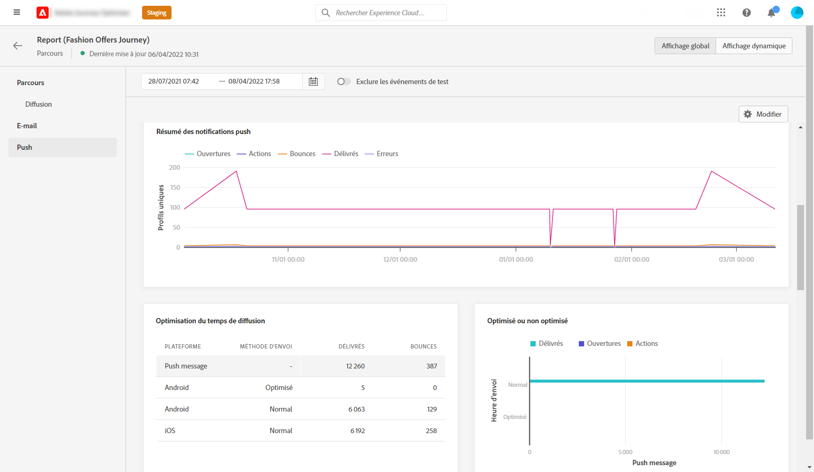

Le graphique **[!UICONTROL Résumé des notifications push]** contient les données disponibles pour les notifications push envoyées, telles que :

* **[!UICONTROL Ouvertures]** : nombre de fois qu&#39;un message a été ouvert dans une diffusion.

* **[!UICONTROL Actions]** : nombre total d&#39;actions sur la notification push diffusée, par exemple clic sur un bouton ou rejet.

* **[!UICONTROL Bounces]** : nombre total d&#39;erreurs cumulées lors des diffusions et du traitement automatique des retours par rapport au nombre total de messages envoyés.

* **[!UICONTROL Délivrés]** : nombre de messages envoyés avec succès, par rapport au nombre total de messages envoyés.

* **[!UICONTROL Erreurs]** : nombre total d&#39;erreurs survenues au cours d&#39;une diffusion, l&#39;empêchant d&#39;être envoyée à des profils.

>[!NOTE]
>
>Les widgets **[!UICONTROL Optimisé ou non optimisé]** et **[!UICONTROL Optimisation de l’heure d’envoi]** ne sont disponibles que si l’option Optimisation de l’heure d’envoi est activée pour votre diffusion. Pour plus d’informations sur l’optimisation de l’heure d’envoi, consultez cette [page](../building-journeys/journeys-message.md#send-time-optimization).

Le graphique **[!UICONTROL Optimisé ou non optimisé]** détaille les informations principales relatives à votre message, qu’elles soient optimisées ou non :

* **[!UICONTROL Délivrés]** : nombre de messages envoyés avec succès, par rapport au nombre total de messages envoyés.
* **[!UICONTROL Ouvertures]** : nombre de fois où la diffusion a été ouverte dans une diffusion.
* **[!UICONTROL Actions]** : nombre total d’actions sur la notification push diffusée, par exemple clic sur un bouton ou rejet.

L’**[!UICONTROL Optimisation de l’heure d’envoi]** détaille le succès de votre diffusion selon la méthode d’envoi : optimisé ou normal.

* **[!UICONTROL Délivrés]** : nombre de messages envoyés avec succès, par rapport au nombre total de messages envoyés.
* **[!UICONTROL Bounces]** : nombre total d&#39;erreurs cumulées lors des diffusions et du traitement automatique des retours par rapport au nombre total de messages envoyés.

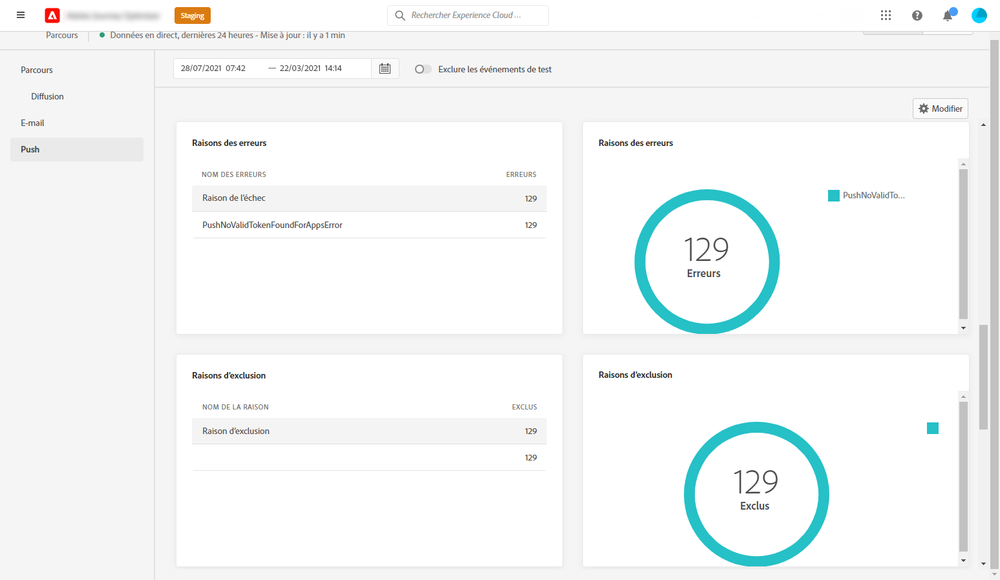

Le graphique et le tableau **[!UICONTROL Causes des erreurs]** vous permettent de voir quelle erreur s’est produite au cours de votre diffusion.

Le graphique et le tableau **[!UICONTROL Exclure des raisons]** affichent les différentes raisons qui ont empêché les profils utilisateur, à part les profils ciblés, de recevoir le message.

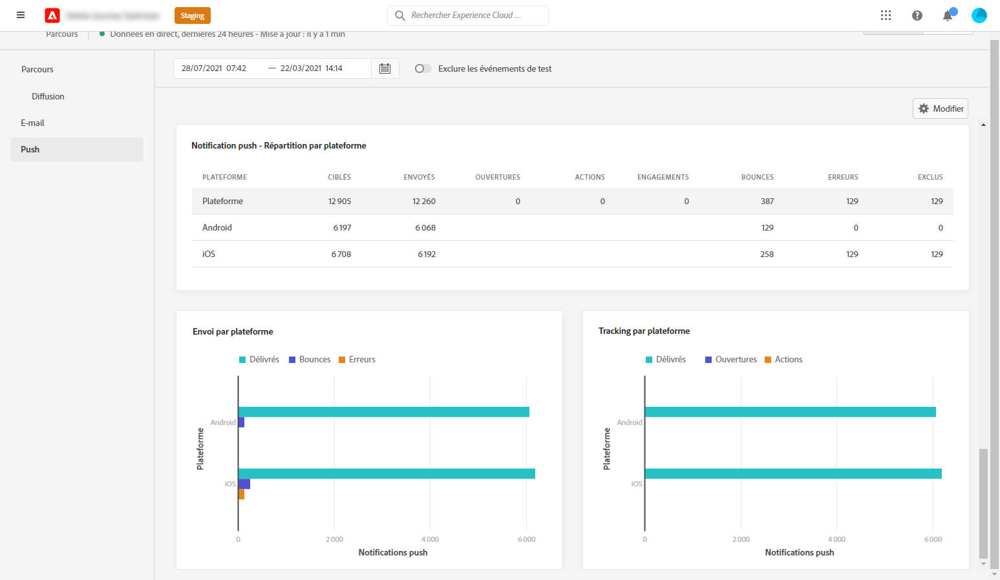

Les graphiques et tableaux **[!UICONTROL Suivi par plateforme]**, **[!UICONTROL Envoi par plateforme]** et **[!UICONTROL Ventilation par plateforme]** décrivent le succès de votre notification push en fonction du système opérationnel de votre destinataire.
