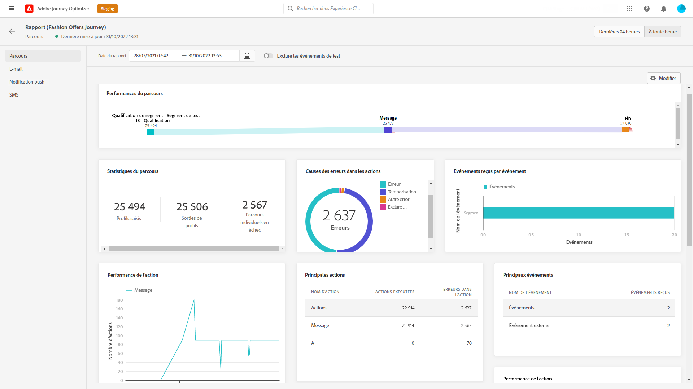
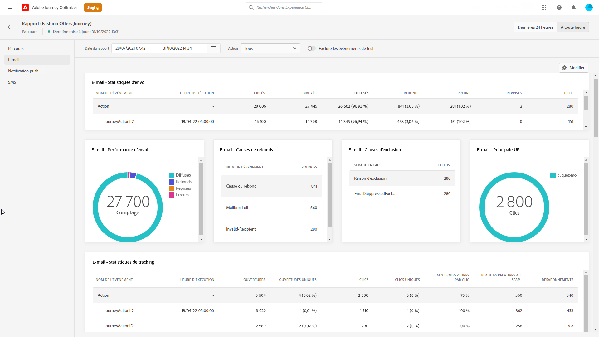
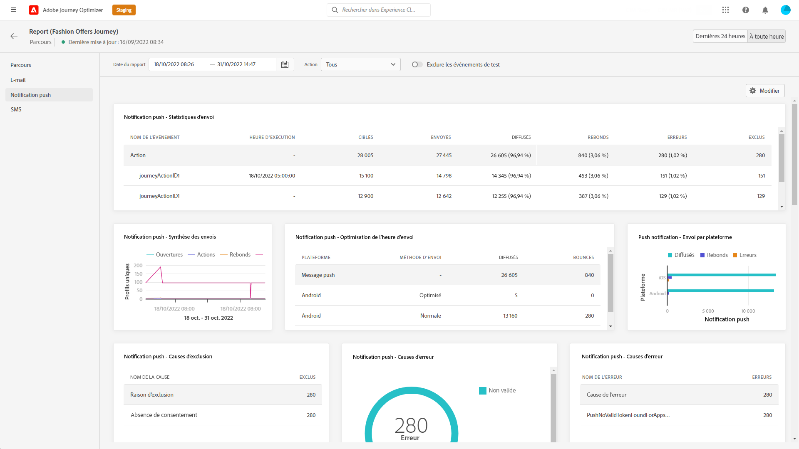

# Rapport global de parcours {#journey-global-report}

Vous pouvez accéder directement au rapport global par parcours à partir de votre parcours à l’aide de l’option **[!UICONTROL Afficher le rapport]** bouton .

La page **[!UICONTROL Rapport global]** du parcours s&#39;affiche avec les onglets suivants :

* [Parcours](#journey-global)
* [E-mail](#email-global)
* [Push](#push-global)
* [SMS](#sms-global)

Le rapport **[!UICONTROL global]** de parcours est divisé en différents widgets détaillant la réussite et les erreurs de votre parcours. Chaque widget peut être redimensionné et supprimé si nécessaire. Pour plus d&#39;informations à ce propos, consultez cette [section](global-report.md#modify-dashboard).

Pour obtenir la liste détaillée de chaque mesure disponible dans Adobe Journey Optimizer, reportez-vous à la section [cette page](global-report.md#list-of-components-global).

## Onglet Parcours {#journey-global}

À partir de votre **[!UICONTROL rapport global]** de parcours, l&#39;onglet **[!UICONTROL Parcours]** vous donne une vue claire des données de suivi les plus importantes concernant votre parcours.

+++En savoir plus sur les différents widgets et mesures disponibles pour le rapport de Parcours.

Le widget **[!UICONTROL Performances du parcours]** vous permet de voir le cheminement de vos profils ciblés pas à pas tout au long du parcours.

Le widget **[!UICONTROL Statistiques du parcours]** affiche les KPI suivants :

* **[!UICONTROL Profils entrés]** : nombre total de personnes ayant atteint l&#39;événement d&#39;entrée du parcours.

* **[!UICONTROL Profils sortis]** : nombre total de personnes ayant quitté le parcours.

* **[!UICONTROL Parcours individuel en échec]** : nombre total de parcours individuels qui n&#39;ont pas été exécutés avec succès.

Les widgets **[!UICONTROL Événements reçus par événement]**, **[!UICONTROL Événements par origine]** et **[!UICONTROL Principaux événements]** vous permettent de savoir lequel de vos **[!UICONTROL Événements]** a été exécuté avec succès par le biais de graphiques et de tableaux.

Les widgets **[!UICONTROL Performance de l&#39;action]**, **[!UICONTROL Raisons de l&#39;erreur de l&#39;action]** et **[!UICONTROL Principales actions]** représentent l&#39;action la plus réussie et les erreurs survenues lorsque vos **[!UICONTROL Actions]** ont été déclenchées.

Le tableau **[!UICONTROL Principales actions]** contient les données disponibles pour **[!UICONTROL Actions]**, telles que :

* **[!UICONTROL Actions exécutées avec succès]** : nombre total d&#39;**[!UICONTROL actions]** exécutées avec succès pour un parcours.

* **[!UICONTROL Erreur lors de l&#39;action]** : nombre total d&#39;erreurs survenues pour les **[!UICONTROL actions]**.

Le **[!UICONTROL Stratégies de consentement]** le tableau et le graphique affichent le nombre de profils exclus de chaque stratégie dans vos actions personnalisées.
Pour plus d’informations sur les actions personnalisées, reportez-vous à la section [la documentation détaillée ;](../action/about-custom-action-configuration.md).

Notez que pour que ces widgets s’affichent dans vos rapports Parcours, vous devez réinitialiser vos tableaux de bord. Pour ce faire, cliquez sur **[!UICONTROL Modifier]** then **[!UICONTROL Réinitialiser]** en haut de votre rapport.
+++

## Onglet E-mail {#email-global}

Dans le **[!UICONTROL Rapport global]** de parcours, l&#39;onglet **[!UICONTROL E-mail]** détaille les principales informations relatives aux diffusions par e-mail envoyées dans votre parcours.

+++En savoir plus sur les différents widgets et mesures disponibles pour le rapport Email.

Le graphique **[!UICONTROL Statistiques d&#39;envoi d’e-mail]** détaille la réussite de votre diffusion :

* **[!UICONTROL Ciblés]** : nombre de profils ciblés par Adobe Journey Orchestration pour toute action telle que l’envoi d’e-mails ou de SMS.

* **[!UICONTROL Envoyés]** : nombre total d&#39;envois pour la diffusion.

* **[!UICONTROL Délivrés]** : nombre de messages envoyés avec succès, par rapport au nombre total de messages envoyés.

* **[!UICONTROL Taux de diffusion]** : pourcentage de messages envoyés avec succès.

* **[!UICONTROL Bounces]** : nombre total d&#39;erreurs cumulées lors des diffusions et du traitement automatique des retours par rapport au nombre total de messages envoyés.

* **[!UICONTROL Taux de rebond]** : pourcentage d&#39;e-mails ayant rebondi par rapport aux e-mails envoyés.

* **[!UICONTROL Erreurs]** : nombre total d&#39;erreurs survenues au cours d&#39;une diffusion, l&#39;empêchant d&#39;être envoyée à des profils.

* **[!UICONTROL Taux d&#39;erreurs]** : pourcentage d&#39;erreurs survenues au cours d&#39;une diffusion, l&#39;empêchant d&#39;être envoyée, par rapport aux e-mails envoyés.

**[!UICONTROL E-mail - Statistiques de suivi]** contient les données disponibles pour l&#39;activité destinataire de votre diffusion :

* **[!UICONTROL Ouvertures]** :nombre de fois où la diffusion a été ouverte dans une diffusion.

* **[!UICONTROL Ouvertures uniques]** : pourcentage de diffusions ouvertes.

* **[!UICONTROL Taux d’ouvertures uniques]** : nombre total de messages ouverts par rapport au nombre de messages diffusés.

* **[!UICONTROL Clics]** : nombre de fois où un contenu a fait l&#39;objet d&#39;un clic dans un email.

* **[!UICONTROL Clics uniques]** : nombre de destinataires qui ont cliqué sur un contenu dans un e-mail.

* **[!UICONTROL Taux de clics]** : pourcentage d&#39;utilisateurs ayant interagi avec le parcours.

* **[!UICONTROL Désabonnements]** : nombre de clics sur le lien de désabonnement.

* **[!UICONTROL Plaintes contre le spal]** : nombre de fois où un message a été déclaré comme spam ou courrier indésirable.

Le graphique **[!UICONTROL Statistiques d&#39;envoi]** contient les données disponibles pour les e-mails envoyés, telles que :

* **[!UICONTROL Délivrés]** : nombre de messages envoyés avec succès, par rapport au nombre total de messages envoyés.

* **[!UICONTROL Bounces]** : nombre total d&#39;erreurs cumulées lors des diffusions et du traitement automatique des retours par rapport au nombre total de messages envoyés.

* **[!UICONTROL Erreurs]** : nombre total d’erreurs survenues au cours d&#39;une diffusion, l’empêchant d&#39;être envoyée à des profils.

Les widgets **[!UICONTROL Raisons de rebond]** et **[!UICONTROL Catégories de rebond]** contiennent les données disponibles relatives aux messages de rebond, telles que :

* **[!UICONTROL Hard bounce]** : nombre total d&#39;erreurs permanentes, telles qu&#39;une adresse email incorrecte. Un message d&#39;erreur indique explicitement que l&#39;adresse n&#39;est pas valide, comme Utilisateur inconnu.

* **[!UICONTROL Soft bounces]** : nombre total d&#39;erreurs temporaires, telles qu&#39;une boîte de réception pleine.

* **[!UICONTROL Ignorées]** : nombre total d&#39;erreurs temporaires (par exemple, Absent(e) du bureau) ou techniques (par exemple, si le type d&#39;expéditeur est administrateur).

Pour plus d&#39;informations sur les bounces, consultez la page [Liste de suppression](../reports/suppression-list.md).

Le graphique et le tableau **[!UICONTROL Causes des erreurs]** vous permettent de voir quelle erreur s&#39;est produite au cours de votre diffusion.

Le graphique et le tableau **[!UICONTROL Exclure des raisons]** affichent les différentes raisons qui ont empêché les profils utilisateur, à part les profils ciblés, de recevoir le message.

Le graphique et le tableau **[!UICONTROL E-mail - Principales URL]** indiquent les URL de votre diffusion les plus visitées.

Le graphique et le tableau **[!UICONTROL E-mail - Meilleur domaine destinataire]** indiquent les domaines les plus utilisés par les destinataires pour ouvrir l&#39;e-mail.

>[!NOTE]
>
>Les widgets **[!UICONTROL Optimisé ou non optimisé]** et **[!UICONTROL Optimisation de l’heure d’envoi]** ne sont disponibles que si l’option Optimisation de l’heure d’envoi est activée pour votre diffusion. Pour plus d’informations sur l’optimisation de l’heure d’envoi, consultez [cette page](../messages/send-time-optimization.md).

Le graphique **[!UICONTROL Optimisé ou non optimisé]** détaille les informations principales relatives à votre message, qu’elles soient optimisées ou non :

* **[!UICONTROL Envoyés]** : nombre total d’envois pour la diffusion.
* **[!UICONTROL Ouvertures]** : nombre de fois où la diffusion a été ouverte dans une diffusion.
* **[!UICONTROL Clics]** : nombre de fois où un contenu a fait l’objet d’un clic dans un e-mail.

L’**[!UICONTROL Optimisation de l’heure d’envoi]** détaille le succès de votre diffusion selon la méthode d’envoi : optimisé ou normal.

* **[!UICONTROL Délivrés]** : nombre de messages envoyés avec succès, par rapport au nombre total de messages envoyés.
* **[!UICONTROL Bounces]** : nombre total d&#39;erreurs cumulées lors des diffusions et du traitement automatique des retours par rapport au nombre total de messages envoyés.

>[!NOTE]
>
>Les widgets et mesures Offres ne sont disponibles que si une décision a été insérée dans un e-mail. Pour plus d’informations sur la gestion des décisions, consultez cette [page](../offers/get-started/starting-offer-decisioning.md).

Les widgets sur le long terme **[!UICONTROL Statistique des offres]** et **[!UICONTROL Statistiques des offres]** mesurent le succès et l’impact de votre offre sur votre audience ciblée. Il détaille les informations principales relatives à votre message avec les KPI :

* **[!UICONTROL Offre envoyée]** : nombre total d’envois pour l’offre.

* **[!UICONTROL Impression de l’offre]** : nombre d’ouvertures de l’offre dans une diffusion.

* **[!UICONTROL Clics sur les offres]** : nombre de clics sur une offre dans une diffusion.

Le tableau **[!UICONTROL Statistiques détaillées des offres]** contient les données disponibles pour l’activité des destinataires avec votre offre :

* **[!UICONTROL Nom de l’emplacement]** : nom de l’emplacement utilisé pour afficher votre offre. Pour plus d’informations sur les emplacements, consultez cette [page](../offers/offer-library/creating-placements.md).

* **[!UICONTROL Nom de l’offre]** : nom de l’offre ajoutée dans la diffusion. Pour plus d’informations sur les emplacements, consultez cette [page](../offers/offer-library/creating-personalized-offers.md).

* **[!UICONTROL Offre envoyée]** : nombre total d’envois pour l’offre.

* **[!UICONTROL Taux d’impression de l’offre]** : pourcentage d’offres ouvertes par rapport au nombre d’offres envoyées.

* **[!UICONTROL Taux de clics de l’offre]** : pourcentage d’utilisateurs ayant interagi avec l’offre.
+++

## Onglet Notification push {#push-global}

De votre parcours **[!UICONTROL Rapport global]**, la variable **[!UICONTROL Notification push]** Cet onglet présente les informations principales relatives aux diffusions push envoyées dans votre parcours.

+++En savoir plus sur les différents widgets et mesures disponibles pour le rapport push.

Le tableau **[!UICONTROL Notification push - Statistiques d’envoi]** présente les principales informations relatives à vos notifications push avec un graphique et des KPI :

* **[!UICONTROL Ciblés]** : nombre de profils ciblés par Adobe Journey Orchestration pour toute action telle que l’envoi d’e-mails ou de SMS.

* **[!UICONTROL Envoyés]** : nombre total d&#39;envois pour la diffusion.

* **[!UICONTROL Délivrés]** : nombre de messages envoyés avec succès, par rapport au nombre total de messages envoyés.

* **[!UICONTROL Taux de diffusion]** : pourcentage de messages envoyés avec succès.

* **[!UICONTROL Bounces]** : nombre total d&#39;erreurs cumulées lors des diffusions et du traitement automatique des retours par rapport au nombre total de messages envoyés.

* **[!UICONTROL Taux de rebond]** : pourcentage de notifications push ayant rebondi par rapport aux notifications push envoyées.

* **[!UICONTROL Erreurs]** : nombre total d’erreurs survenues au cours d’une diffusion, l’empêchant d’être envoyée à des profils.

* **[!UICONTROL Taux d&#39;erreurs]** : pourcentage d&#39;erreurs survenues pendant une diffusion qui l&#39;empêchent d&#39;être envoyée par rapport aux notifications push envoyées.

Les **[!UICONTROL Statistiques de suivi - push]** contiennent les données disponibles pour l&#39;activité destinataire de votre diffusion :

* **[!UICONTROL Ouvertures]** : nombre de fois qu&#39;un message a été ouvert dans une diffusion.

* **[!UICONTROL Taux d&#39;ouverture]** : pourcentage de notifications push ouvertes.

* **[!UICONTROL Actions]** : nombre total d&#39;actions sur la notification push diffusée, par exemple clic sur un bouton ou rejet.

* **[!UICONTROL Engagements]** : nombre total d&#39;ouvertures et d&#39;actions pour cette notification push, c&#39;est-à-dire si le profil a ouvert la notification ou si un utilisateur a cliqué sur un bouton.

* **[!UICONTROL Taux d&#39;engagement]** : pourcentage d&#39;ouvertures et d&#39;actions pour cette notification push, c&#39;est-à-dire si le profil a ouvert la notification push ou si un utilisateur a cliqué sur un bouton.

Le graphique **[!UICONTROL Résumé des notifications push]** contient les données disponibles pour les notifications push envoyées, telles que :

* **[!UICONTROL Ouvertures]** : nombre d’ouvertures d’un message dans une diffusion.

* **[!UICONTROL Actions]** : nombre total d’actions sur la notification push diffusée (par exemple, clic sur un bouton ou rejet).

* **[!UICONTROL Bounces]** : nombre total d&#39;erreurs cumulées lors des diffusions et du traitement automatique des retours par rapport au nombre total de messages envoyés.

* **[!UICONTROL Délivrés]** : nombre de messages envoyés avec succès, par rapport au nombre total de messages envoyés.

* **[!UICONTROL Erreurs]** : nombre total d’erreurs survenues au cours d’une diffusion, l’empêchant d’être envoyée à des profils.

>[!NOTE]
>
>Les widgets **[!UICONTROL Optimisé ou non optimisé]** et **[!UICONTROL Optimisation de l’heure d’envoi]** ne sont disponibles que si l’option Optimisation de l’heure d’envoi est activée pour votre diffusion. Pour plus d’informations sur l’optimisation de l’heure d’envoi, consultez [cette page](../messages/send-time-optimization.md).

Le graphique **[!UICONTROL Optimisé ou non optimisé]** détaille les informations principales relatives à votre message, qu’elles soient optimisées ou non :

* **[!UICONTROL Délivrés]** : nombre de messages envoyés avec succès, par rapport au nombre total de messages envoyés.
* **[!UICONTROL Ouvertures]** :nombre de fois où la diffusion a été ouverte dans une diffusion.
* **[!UICONTROL Actions]** : nombre total d’actions sur la notification push diffusée, par exemple clic sur un bouton ou rejet.

L’**[!UICONTROL Optimisation de l’heure d’envoi]** détaille le succès de votre diffusion selon la méthode d’envoi : optimisé ou normal.

* **[!UICONTROL Délivrés]** : nombre de messages envoyés avec succès, par rapport au nombre total de messages envoyés.
* **[!UICONTROL Bounces]** : nombre total d&#39;erreurs cumulées lors des diffusions et du traitement automatique des retours par rapport au nombre total de messages envoyés.

Le graphique et le tableau **[!UICONTROL Causes des erreurs]** vous permettent de voir quelle erreur s&#39;est produite au cours de votre diffusion.

Le graphique et le tableau **[!UICONTROL Exclure des raisons]** affichent les différentes raisons qui ont empêché les profils utilisateur, à part les profils ciblés, de recevoir le message.

Les graphiques et tableaux **[!UICONTROL Suivi par plateforme]**, **[!UICONTROL Envoi par plateforme]** et **[!UICONTROL Répartition par plateforme]** décrivent le succès de votre notification push en fonction du système d&#39;exploitation de votre destinataire.

Le **[!UICONTROL Rapport global]** SMS est divisé en différents widgets présentant la réussite et les erreurs de votre diffusion. Chaque widget peut être redimensionné et supprimé si nécessaire. Pour plus d&#39;informations à ce propos consultez cette [section](global-report.md#modify-dashboard).
+++

## Onglet SMS {#sms-global}

+++En savoir plus sur les différentes mesures et widgets disponibles pour le rapport SMS.

Le tableau **[!UICONTROL SMS - Statistiques d’envoi]** détaille la réussite de votre diffusion :

* **[!UICONTROL Ciblés]** : nombre de profils utilisateur qui sont qualifiés en tant que profils cibles pour cette diffusion.

* **[!UICONTROL Exclus]** : nombre de profils utilisateur, exclus des profils ciblés, qui n’ont pas reçu le message.

* **[!UICONTROL Envoyés]** : nombre total d&#39;envois pour la diffusion.

* **[!UICONTROL Délivrés]** : nombre de messages envoyés avec succès, par rapport au nombre total de messages envoyés.

* **[!UICONTROL Bounces]** : nombre total d&#39;erreurs cumulées lors des diffusions et du traitement automatique des retours par rapport au nombre total de messages envoyés.

* **[!UICONTROL Erreurs]** : nombre total d’erreurs survenues au cours d&#39;une diffusion, l’empêchant d&#39;être envoyée à des profils.

Le widget **[!UICONTROL Synthèse des SMS]** détaille les informations principales relatives à votre message sous forme de graphique :

* **[!UICONTROL Envoyés]** : nombre total d&#39;envois pour la diffusion.

* **[!UICONTROL Délivrés]** : nombre de messages envoyés avec succès, par rapport au nombre total de messages envoyés.

* **[!UICONTROL Bounces]** : nombre total d&#39;erreurs cumulées lors des diffusions et du traitement automatique des retours par rapport au nombre total de messages envoyés.

* **[!UICONTROL Erreurs]** : nombre total d’erreurs survenues au cours d&#39;une diffusion, l’empêchant d&#39;être envoyée à des profils.

Les graphiques et tableaux **[!UICONTROL Motifs d’exclusion]** vous permettent de voir quelles erreurs et exclusions ont eu lieu au cours de votre diffusion.
+++
