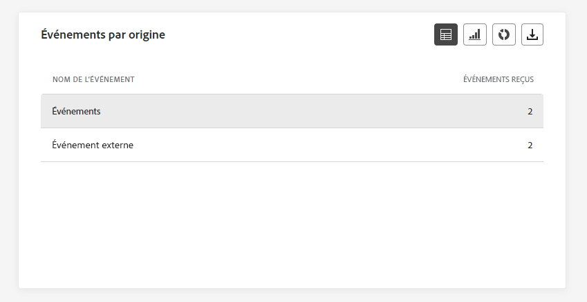

# Rapport global de parcours {#journey-global-report}

>[!CONTEXTUALHELP]
>id="ajo_journey_global_report"
>title="Rapport global de parcours"
>abstract="Le rapport global de parcours vous permet de mesurer l’efficacité de vos parcours au cours d’une période donnée. Celui-ci est composé de plusieurs widgets présentant le succès et les erreurs de votre parcours. Vous pouvez modifier chaque tableau de bord de reporting en redimensionnant ou en supprimant des widgets."

Les rapports globaux, accessibles à partir de l’onglet À toute heure, affichent les événements qui se sont produits il y a au moins deux heures et couvrent les événements sur une période sélectionnée. En comparaison, les rapports dynamiques portent sur les événements qui se sont produits au cours des dernières 24 heures, avec un intervalle de temps minimal de deux minutes à compter de l’occurrence de l’événement.

Vous pouvez accéder directement au rapport global de parcours à partir de votre parcours à l’aide du bouton **[!UICONTROL Afficher le rapport]**.

La page **[!UICONTROL Rapport global]** du parcours s&#39;affiche avec les onglets suivants :

* [Parcours](#journey-global)
* [E-mail](#email-global)
* [Notification push](#push-global)
* [SMS](#sms-global)
* [In-app](#in-app-global)

Le rapport **[!UICONTROL global]** de parcours est divisé en différents widgets détaillant la réussite et les erreurs de votre parcours. Chaque widget peut être redimensionné et supprimé si nécessaire. Pour plus d&#39;informations à ce propos, consultez cette [section](global-report.md#modify-dashboard).

Pour obtenir la liste détaillée de chaque mesure disponible dans Adobe Journey Optimizer, reportez-vous à [cette page](global-report.md#list-of-components-global).

## Onglet Parcours {#journey-global}

À partir de votre **[!UICONTROL rapport global]** de parcours, l&#39;onglet **[!UICONTROL Parcours]** vous donne une vue claire des données de suivi les plus importantes concernant votre parcours.

### Performances des parcours {#journey-perfomance}

>[!CONTEXTUALHELP]
>id="ajo_journey_performance"
>title="Performances des parcours"
>abstract="XX"

La variable **[!UICONTROL Performances des parcours]** vous permet de tracer visuellement la trajectoire de vos profils ciblés lorsqu’ils parcourent votre parcours.

### Statistiques parcours {#journey-statistics}

>[!CONTEXTUALHELP]
>id="ajo_journey_statistics"
>title="Statistiques parcours"
>abstract="XX"

La variable **[!UICONTROL Statistiques parcours]** Les indicateurs de performance clés (IPC) fonctionnent comme un tableau de bord global, fournissant une analyse des mesures essentielles associées à votre parcours. Cela inclut des détails tels que le nombre de profils entrés et les instances de parcours individuels ayant échoué, ce qui vous permet d’avoir un aperçu complet de l’efficacité et du niveau d’engagement de votre parcours.

+++ En savoir plus sur les mesures de statistiques de Parcours

* **[!UICONTROL Profils entrés]** : nombre total de personnes ayant atteint l&#39;événement d&#39;entrée du parcours.

* **[!UICONTROL Profils sortis]** : nombre total de personnes ayant quitté le parcours.

* **[!UICONTROL Parcours individuel en échec]** : nombre total de parcours individuels qui n&#39;ont pas été exécutés avec succès.

+++

### Performances de l’action {#action-performance}

>[!CONTEXTUALHELP]
>id="ajo_journey_action_performance"
>title="Performances de l’action"
>abstract="XX"

La variable **[!UICONTROL Performances des actions]** représente les actions les plus réussies survenues lors de la **[!UICONTROL Actions]** ont été déclenchées.

### Actions principales {#top-actions}

>[!CONTEXTUALHELP]
>id="ajo_journey_top_actions"
>title="Actions principales"
>abstract="XX"

La variable **[!UICONTROL Actions principales]** Le tableau compile les données essentielles de votre **[!UICONTROL Actions]**. Il donne un aperçu succinct de la fréquence et du rendement de chaque action.

+++ En savoir plus sur les mesures des actions principales

* **[!UICONTROL Actions exécutées avec succès]** : nombre total d&#39;**[!UICONTROL actions]** exécutées avec succès pour un parcours.

* **[!UICONTROL Erreur lors de l&#39;action]** : nombre total d&#39;erreurs survenues pour les **[!UICONTROL actions]**.

+++

### Raisons de l’erreur des actions {#action-error}

>[!CONTEXTUALHELP]
>id="ajo_journey_actions_error_reasons"
>title="Raisons de l’erreur des actions"
>abstract="XX"

La variable **[!UICONTROL Motifs d’erreur d’action]**  tableau et graphique offre un aperçu complet des erreurs qui se sont produites pendant l’exécution de votre **[!UICONTROL Actions]**.

### Événements par origine {#events-origin}

>[!CONTEXTUALHELP]
>id="ajo_journey_events_origin"
>title="Événements par origine"
>abstract="XX"

La variable **[!UICONTROL Événements par origine]** tableau et graphiques fournissent une perspective détaillée de la réception réussie de votre **[!UICONTROL Événements]**. Grâce à ces représentations visuelles, vous pouvez distinguer précisément laquelle de vos **[!UICONTROL Événements]** ont été bien reçus, ce qui vous permet d’obtenir des informations précieuses sur les performances et l’impact de chaque événement dans votre parcours.

### Événements reçus par l’événement {#events-received}

>[!CONTEXTUALHELP]
>id="ajo_journey_events_received"
>title="Événements reçus par l’événement"
>abstract="XX"

La variable **[!UICONTROL Événements reçus par l’événement]** Le graphique vous permet d’identifier et d’analyser quel **[!UICONTROL Événement]** dans votre parcours a été exécuté de manière efficace, fournissant des informations précieuses sur les performances et les taux de succès des événements individuels.

### Principaux événements {#top-events}

>[!CONTEXTUALHELP]
>id="ajo_journey_top_events"
>title="Principaux événements"
>abstract="XX"

La variable **[!UICONTROL Principaux événements]** Le tableau compile les données essentielles de votre **[!UICONTROL Événements]**. Il fournit des informations succinctes sur la fréquence et les performances de chaque **[!UICONTROL Événement]**.

### Stratégies de consentement {#consent-policies}

>[!CONTEXTUALHELP]
>id="ajo_journey_consent_policies"
>title="Stratégies de consentement"
>abstract="XX"

La variable **[!UICONTROL Stratégies de consentement]** tableau et graphique présentent le nombre de profils exclus de chaque stratégie dans vos actions personnalisées. Cela permet d’avoir un aperçu clair de l’impact de chaque stratégie de consentement sur les exclusions de profil.

Pour plus d’informations sur les actions personnalisées, consultez la [documentation détaillée](../action/about-custom-action-configuration.md).

Notez que pour que ces widgets s’affichent dans vos rapports Parcours, vous devez réinitialiser vos tableaux de bord. Pour ce faire, cliquez sur **[!UICONTROL Modifier]** puis sur **[!UICONTROL Réinitialiser]** en haut de votre rapport.

## Onglet E-mail {#email-global}

De votre parcours **[!UICONTROL Rapport global]**, la variable **[!UICONTROL Email]** Cet onglet présente les informations principales relatives aux emails envoyés dans votre parcours.

### Email - Statistiques d’envoi {#email-sending-statistics}

>[!CONTEXTUALHELP]
>id="ajo_journey_email_sending_statistics"
>title="Email - Statistiques d’envoi"
>abstract="XX"

La variable **[!UICONTROL Statistiques d’envoi d’emails]** Le tableau fournit un résumé complet des données essentielles concernant les emails dans vos parcours. Il détaille les mesures clés, telles que la taille de l’audience ciblée et le nombre d’emails envoyés avec succès, ce qui vous permet d’obtenir des informations précieuses sur l’efficacité et la portée de vos emails et parcours.

+++ En savoir plus sur les mesures Statistiques d’envoi d’emails

* **[!UICONTROL Heure d’exécution]** : heure de début de chaque exécution de parcours en cas de parcours récurrents. Pour ne cibler qu’une ou plusieurs récurrences, sélectionnez-les dans le menu déroulant **[!UICONTROL Heure d’exécution]**.

* **[!UICONTROL Ciblés]** : nombre de profils ciblés pour toute action telle que l’envoi d’e-mails ou de SMS.

* **[!UICONTROL Envoyé]**: nombre total d&#39;emails envoyés pour le parcours.

* **[!UICONTROL Diffusés]** : nombre d’e-mails envoyés avec succès, par rapport au nombre total d’e-mails envoyés.

* **[!UICONTROL Taux de diffusion]** : pourcentage d’e-mails envoyés avec succès.

* **[!UICONTROL Rebonds]**: Nombre total d&#39;erreurs cumulées lors du processus d&#39;envoi et du traitement automatique des retours par rapport au nombre total d&#39;emails envoyés.

* **[!UICONTROL Taux de rebond]** : pourcentage d’e-mails ayant rebondi par rapport aux e-mails envoyés.

* **[!UICONTROL Erreurs]** : nombre total d’erreurs survenues au cours de la procédure d’envoi, empêchant le message d’être envoyé à des profils.

* **[!UICONTROL Taux d’erreurs]** : pourcentage d’erreurs survenues au cours de la procédure d’envoi, empêchant le message d’être envoyé, par rapport aux e-mails envoyés.

* **[!UICONTROL Reprises]** : nombre d’e-mails dans la file d’attente pour les reprises.

* **[!UICONTROL Exclus]** : nombre de profils qui ont été exclus par Adobe Journey Optimizer.

+++

### E-mail - Statistiques de tracking {#email-tracking}

>[!CONTEXTUALHELP]
>id="ajo_journey_email_tracking_statistics"
>title="E-mail - Statistiques de tracking"
>abstract="XX"

La variable **[!UICONTROL Email - Statistiques de tracking]** offre un compte détaillé de l’activité de profil associée aux emails inclus dans votre parcours. Cela inclut des mesures sur les ouvertures, les clics et d’autres indicateurs d’engagement pertinents, offrant une vue d’ensemble complète de la manière dont les profils interagissent avec votre contenu d’email.

+++ En savoir plus sur les mesures Email - Statistiques de suivi

* **[!UICONTROL Heure d’exécution]** : heure de début de chaque exécution de votre e-mail récurrent dans votre parcours. Pour ne cibler qu’un ou plusieurs e-mails récurrents, sélectionnez-les dans le menu déroulant **[!UICONTROL Heure d’exécution]**.

* **[!UICONTROL Ouvertures]**: nombre d’ouvertures de vos emails dans un parcours.

* **[!UICONTROL Ouvertures uniques]** : pourcentage d’e-mails ouverts.

* **[!UICONTROL Taux d’ouvertures uniques]** : nombre total de messages ouverts par rapport au nombre de messages diffusés.

* **[!UICONTROL Clics]**: nombre de clics sur un contenu dans vos emails.

* **[!UICONTROL Clics uniques]**: nombre de destinataires ayant cliqué sur un contenu de vos emails.

* **[!UICONTROL Taux de clics]** : pourcentage d&#39;utilisateurs ayant interagi avec le parcours.

* **[!UICONTROL Désabonnements]** : nombre de clics sur le lien de désabonnement.

* **[!UICONTROL Demandes de spam]**: nombre de fois où vos emails ont été déclarés comme spam ou courrier indésirable.

+++

### E-mail - Performance d’envoi {#email-performance}

>[!CONTEXTUALHELP]
>id="ajo_journey_email_sending_performance"
>title="E-mail - Performance d’envoi"
>abstract="XX"

La variable **[!UICONTROL Email - Envoi des performances]** Le graphique fournit une vue complète des données liées aux emails envoyés dans votre parcours, offrant des informations sur les mesures clés telles que les envois et les bounces. Cela permet une analyse détaillée du processus d’envoi des emails, fournissant des informations précieuses sur l’efficacité et les performances de vos parcours.

+++ En savoir plus sur les e-mails - Envoi de mesures de performances

* **[!UICONTROL Diffusés]** : nombre d’e-mails envoyés avec succès, par rapport au nombre total d’e-mails envoyés.

* **[!UICONTROL Rebonds]** : nombre total d’erreurs cumulées lors de la procédure d’envoi et du traitement automatique des retours par rapport au nombre total de messages envoyés.

* **[!UICONTROL Reprises]** : nombre d’e-mails dans la file d’attente pour les reprises.

* **[!UICONTROL Erreurs]**: nombre total d&#39;erreurs qui se sont produites au cours d&#39;un processus d&#39;envoi qui l&#39;a empêché d&#39;être envoyé aux profils.

+++

### Email - Catégories et motifs de rebond {#email-bounce-categories}

>[!CONTEXTUALHELP]
>id="ajo_journey_email_bounces"
>title="Email - Catégories et motifs de rebond"
>abstract="XX"

La variable **[!UICONTROL Motifs de rebond]** et **[!UICONTROL Catégories rebonds]** Les widgets compilent les données disponibles relatives aux messages rebonds, en fournissant des informations détaillées sur les raisons et catégories spécifiques des rebonds aux emails.

Pour plus d’informations sur les rebonds, consultez la page [Liste de suppression](../reports/suppression-list.md).

+++ En savoir plus sur les mesures Email - Catégories de rebond

* **[!UICONTROL Rebond définitif]** : nombre total d’erreurs permanentes, telles qu’une adresse e-mail incorrecte. Un message d&#39;erreur indique explicitement que l&#39;adresse n&#39;est pas valide, comme Utilisateur inconnu.

* **[!UICONTROL Rebond temporaire]** : nombre total d’erreurs temporaires, telles qu’une boîte de réception pleine.

* **[!UICONTROL Ignorées]** : nombre total d&#39;erreurs temporaires (par exemple, Absent(e) du bureau) ou techniques (par exemple, si le type d&#39;expéditeur est administrateur).

+++

### E-mail - Causes d’erreur {#email-errors}

>[!CONTEXTUALHELP]
>id="ajo_journey_email_error_reasons"
>title="E-mail - Causes d’erreur"
>abstract="XX"

La variable **[!UICONTROL Raisons de l’erreur]** les graphiques et les tableaux offrent une visibilité des erreurs spécifiques survenues pendant le processus d’envoi, fournissant des informations précieuses sur la nature et l’occurrence des erreurs.

### E-mail - Causes d’exclusion {#email-excluded}

>[!CONTEXTUALHELP]
>id="ajo_journey_email_excluded_reasons"
>title="E-mail - Causes d’exclusion"
>abstract="XX"

La variable **[!UICONTROL Exclure des motifs]** les graphiques et les tableaux présentent une vue d’ensemble complète des différents facteurs qui ont abouti à l’exclusion des profils utilisateur de l’audience ciblée, ce qui a pour effet que le message n’a pas été reçu.

Voir [cette page](exclusion-list.md) pour la liste complète des motifs d&#39;exclusion.

### Envoyés et diffusés par domaines {#sent-domains}

>[!CONTEXTUALHELP]
>id="ajo_journey_email_sent_delivered_domains"
>title="Envoyés et diffusés par domaines"
>abstract="XX"

La variable  **[!UICONTROL Envoyé et diffusé par domaines]** les tableaux et les graphiques fournissent une ventilation détaillée des emails au niveau du domaine, ce qui vous permet d’obtenir des informations complètes sur les performances de vos emails.

+++ En savoir plus sur les mesures Envoyés et distribués par domaines

* **[!UICONTROL Envoyé]**: nombre total d’envois pour vos emails.

* **[!UICONTROL Diffusés]** : nombre d’e-mails envoyés avec succès, par rapport au nombre total d’e-mails envoyés.

+++

### Ouvertures et clics par domaines {#open-domains}

>[!CONTEXTUALHELP]
>id="ajo_journey_email_open_clicks_domains"
>title="Ouvertures et clics par domaines"
>abstract="XX"

La variable  **[!UICONTROL Ouverture et clics par domaine]** Le graphique et le tableau présentent une ventilation au niveau du domaine de l’engagement de vos profils avec votre email, fournissant des informations précieuses sur la manière dont différents domaines interagissent avec votre contenu.

+++ En savoir plus sur les mesures Ouverture et clics par domaine

* **[!UICONTROL Ouvertures]** : nombre de fois que l’e-mail a été ouvert.

* **[!UICONTROL Clics]** : nombre de fois où un contenu a fait l&#39;objet d&#39;un clic dans un e-mail.

+++

### Rebonds et erreurs par domaine {#bounces-domains}

>[!CONTEXTUALHELP]
>id="ajo_journey_email_bounces_errors_domains"
>title="Rebonds et erreurs par domaine"
>abstract="XX"

La variable  **[!UICONTROL Rebonds et erreurs par domaine]** Le graphique et le tableau offrent une ventilation au niveau du domaine des erreurs spécifiques rencontrées lors du processus d’envoi, fournissant une analyse détaillée des problèmes qui se sont produits.

+++ En savoir plus sur les mesures Rebonds et erreurs par domaine

* **[!UICONTROL Rebonds]**: Nombre total d&#39;erreurs cumulées lors du processus d&#39;envoi et du traitement automatique des retours par rapport au nombre total d&#39;emails envoyés.

* **[!UICONTROL Erreurs]** : nombre total d’erreurs survenues au cours de la procédure d’envoi, empêchant le message d’être envoyé à des profils.

+++

### Raisons de rebond par domaine {#bounce-reasons-domains}

>[!CONTEXTUALHELP]
>id="ajo_journey_email_bounces_reasons_domains"
>title="Raisons des bounces par domaine"
>abstract="XX"

La variable  **[!UICONTROL Raisons des bounces par domaine]** le graphique et le tableau offrent une ventilation au niveau du domaine des données concernant les erreurs temporaires et permanentes, fournissant des informations détaillées sur les raisons des messages rebonds.

### E-mail - Principale URL {#email-top}

>[!CONTEXTUALHELP]
>id="ajo_journey_email_top_url"
>title="E-mail - Principale URL"
>abstract="XX"

La variable **[!UICONTROL Email - Top Url]** Les graphiques et les tableaux fournissent un aperçu complet des URL de votre email qui attirent le plus de visiteurs. Cela vous permet d’identifier et de classer par priorité les liens les plus populaires, ce qui améliore votre compréhension de l’engagement des profils avec du contenu spécifique dans vos emails.

### Email - Optimisation {#email-sto}

>[!CONTEXTUALHELP]
>id="ajo_journey_email_optimization"
>title="Email - Optimisation"
>abstract="XX"

>[!NOTE]
>
>La variable **[!UICONTROL Optimisation de l’heure d’envoi]** et **[!UICONTROL Optimisé ou non optimisé]** Les widgets ne sont disponibles que si l’option Optimisation de l’heure d’envoi est activée pour votre diffusion. Pour plus d’informations sur l’optimisation de l’heure d’envoi, consultez [cette page](../building-journeys/journeys-message.md#send-time-optimization).

La variable **[!UICONTROL Optimisation de l’heure d’envoi]** et **[!UICONTROL Optimisé ou non optimisé]** Les widgets détaillent le succès de vos emails en fonction de la méthode d’envoi : optimisée ou normale.

+++ En savoir plus sur l’optimisation de l’heure d’envoi et les mesures optimisées ou non optimisées

* **[!UICONTROL Délivrés]** : nombre de messages envoyés avec succès, par rapport au nombre total de messages envoyés.
* **[!UICONTROL Rebonds]** : nombre total d’erreurs cumulées lors de la procédure d’envoi et du traitement automatique des retours par rapport au nombre total de messages envoyés.

* **[!UICONTROL Envoyé]**: nombre total d&#39;emails envoyés pour le parcours.

* **[!UICONTROL Ouvertures]**: nombre d’ouvertures de vos emails dans le parcours.

* **[!UICONTROL Clics]**: nombre de clics sur un contenu dans vos emails.

+++

### Email - Offres {#email-offers}

>[!CONTEXTUALHELP]
>id="ajo_journey_email_offers"
>title="Email - Offres"
>abstract="XX"

>[!NOTE]
>
>Les widgets et mesures Offres ne sont disponibles que si une décision a été insérée dans un e-mail. Pour plus d’informations sur la gestion des décisions, consultez cette [page](../offers/get-started/starting-offer-decisioning.md).

La variable **[!UICONTROL Statistiques des offres]** et **[!UICONTROL Statistiques détaillées des offres]** au fil du temps, les widgets mesurent le succès et l’impact de votre offre sur votre audience ciblée. Il détaille les informations principales relatives à votre message avec les KPI.

+++ En savoir plus sur les mesures Email - Offres

* **[!UICONTROL Offre envoyée]** : nombre total d’envois pour l’offre.

* **[!UICONTROL Impression de l&#39;offre]**: nombre de fois où l’offre a été ouverte dans vos courriers électroniques.

* **[!UICONTROL Clics sur les offres]**: nombre de clics sur une offre dans vos emails.

* **[!UICONTROL Nom de l’emplacement]** : nom de l’emplacement utilisé pour afficher votre offre. Pour plus d’informations sur les emplacements, consultez cette [page](../offers/offer-library/creating-placements.md).

* **[!UICONTROL Nom de l’offre]**: nom de l’offre ajoutée dans vos emails. Pour plus d’informations sur les emplacements, consultez cette [page](../offers/offer-library/creating-personalized-offers.md).

* **[!UICONTROL Offre envoyée]** : nombre total d’envois pour l’offre.

* **[!UICONTROL Taux d’impression de l’offre]** : pourcentage d’offres ouvertes par rapport au nombre d’offres envoyées.

* **[!UICONTROL Taux de clics de l’offre]** : pourcentage d’utilisateurs ayant interagi avec l’offre.

+++

## Onglet Notification push {#push-global}

De votre parcours **[!UICONTROL Rapport global]**, la variable **[!UICONTROL Notification push]** Cet onglet présente les informations principales relatives aux notifications push envoyées dans votre parcours.

### Notification push - Statistiques d’envoi {#push-sending-stat}

>[!CONTEXTUALHELP]
>id="ajo_journey_push_sending_statistics"
>title="Notification push - Statistiques d’envoi"
>abstract="XX"

La variable **[!UICONTROL Notification push - Statistiques d&#39;envoi]** Le tableau fournit un résumé concis des données essentielles liées à vos notifications push, y compris les mesures clés telles que le nombre de messages ciblés et le nombre de messages délivrés avec succès.

+++ En savoir plus sur les notifications push - Mesures de statistiques d&#39;envoi

* **[!UICONTROL Heure d’exécution]** : heure de début de chaque exécution de parcours en cas de parcours récurrents. Pour ne cibler qu’une ou plusieurs récurrences, sélectionnez-les dans le menu déroulant **[!UICONTROL Heure d’exécution]**.

* **[!UICONTROL Ciblés]** : nombre de profils ciblés pour toute action telle que l’envoi d’e-mails ou de SMS.

* **[!UICONTROL Envoyé]**: nombre total de notifications push envoyées.

* **[!UICONTROL Délivrées]** : nombre de notifications push envoyées avec succès, par rapport au nombre total de notifications push envoyées.

* **[!UICONTROL Taux de diffusion]** : pourcentage de notifications push envoyées avec succès.

* **[!UICONTROL Rebonds]**: Nombre total d&#39;erreurs cumulées lors du processus d&#39;envoi et du traitement automatique des retours par rapport au nombre total de notifications push envoyées.

* **[!UICONTROL Taux de rebond]** : pourcentage de notifications push ayant rebondi par rapport aux notifications push envoyées.

* **[!UICONTROL Erreurs]** : nombre total d’erreurs survenues au cours de la procédure d’envoi, empêchant le message d’être envoyé à des profils.

* **[!UICONTROL Taux d’erreur]**: pourcentage d&#39;erreurs qui se sont produites pendant le processus d&#39;envoi et qui l&#39;ont empêché d&#39;être envoyé par rapport au nombre de notifications push envoyées.

* **[!UICONTROL Exclus]** : nombre de profils qui ont été exclus par Adobe Journey Optimizer.

+++

### Notification push - Statistiques de tracking {#push-tracking-stat}

>[!CONTEXTUALHELP]
>id="ajo_journey_push_tracking_statistics"
>title="Notification push - Statistiques de tracking"
>abstract="XX"

La variable **[!UICONTROL Push - Statistiques de suivi]** widget offre un instantané détaillé de l’activité de profil liée à vos notifications push, fournissant des informations essentielles sur l’engagement et l’efficacité des notifications push.

+++ En savoir plus sur les notifications push - Mesures de statistiques de suivi

* **[!UICONTROL Heure d’exécution]** : heure de début de chaque exécution de parcours en cas de parcours récurrents. Pour ne cibler qu’une ou plusieurs récurrences, sélectionnez-les dans le menu déroulant **[!UICONTROL Heure d’exécution]**.

* **[!UICONTROL Ouvertures]**: nombre d’ouvertures de vos notifications push dans le parcours.

* **[!UICONTROL Actions]** : nombre total d’actions sur la notification push diffusée, par exemple clic sur un bouton ou rejet.

+++

### Notification push - Synthèse des envois {#push-summary}

>[!CONTEXTUALHELP]
>id="ajo_journey_push_sending_summary"
>title="Notification push - Synthèse des envois"
>abstract="XX"

La variable **[!UICONTROL Notification push - Synthèse des envois]** le graphique offre une représentation dynamique, affichant une analyse de votre activité de notifications push. Cette représentation graphique fournit une ventilation complète des notifications push envoyées.

+++ En savoir plus sur les notifications push - Envoi de mesures récapitulatives

* **[!UICONTROL Ouvertures]**: nombre d’ouvertures de vos notifications push dans le parcours.

* **[!UICONTROL Actions]** : nombre total d’actions sur la notification push diffusée, par exemple clic sur un bouton ou rejet.

* **[!UICONTROL Rebonds]**: Nombre total d&#39;erreurs cumulées lors du processus d&#39;envoi et du traitement automatique des retours par rapport au nombre total de notifications push envoyées.

* **[!UICONTROL Délivrées]** : nombre de notifications push envoyées avec succès, par rapport au nombre total de notifications push envoyées.

* **[!UICONTROL Erreurs]** : nombre total d’erreurs survenues au cours de la procédure d’envoi, empêchant le message d’être envoyé à des profils.

+++

### Notification push - Causes d’erreur {#push-error-reasons}

>[!CONTEXTUALHELP]
>id="ajo_journey_push_error_reasons"
>title="Notification push - Causes d’erreur"
>abstract="XX"

La variable **[!UICONTROL Raisons de l’erreur]** Les tableaux et les graphiques vous permettent d’identifier les erreurs spécifiques qui se sont produites au cours du processus d’envoi de vos notifications push, en fournissant des informations détaillées sur les problèmes rencontrés en cours de route.

### Notification push - Causes d’exclusion {#push-excluded}

>[!CONTEXTUALHELP]
>id="ajo_journey_push_excluded_reasons"
>title="Notification push - Causes d’exclusion"
>abstract="XX"

La variable **[!UICONTROL Exclure des motifs]** les graphiques et les tableaux affichent les différentes raisons qui ont empêché les profils utilisateur, exclus des profils ciblés, de recevoir vos notifications push.

Voir [cette page](exclusion-list.md) pour la liste complète des motifs d&#39;exclusion.

### Notification push - Répartition par plateforme {#push-breakdown}

>[!CONTEXTUALHELP]
>id="ajo_journey_push_breakdown_platform"
>title="Notification push - Ventilation par plateforme"
>abstract="XX"

La variable **[!UICONTROL Ventilation par plateforme]** Le graphique et le tableau fournissent une analyse détaillée du succès de vos notifications push, offrant des informations basées sur le système d’exploitation de votre profil. Cette ventilation vous permet de mieux comprendre les performances de vos notifications push sur différentes plateformes.

### Notification push - Optimisation {#push-sto}

>[!NOTE]
>
>Les widgets **[!UICONTROL Optimisé ou non optimisé]** et **[!UICONTROL Optimisation de l’heure d’envoi]** ne sont disponibles que si l’option Optimisation de l’heure d’envoi est activée pour votre diffusion. Pour plus d’informations sur l’optimisation de l’heure d’envoi, consultez [cette page](../building-journeys/journeys-message.md#send-time-optimization).

La variable **[!UICONTROL Optimisé ou non optimisé]** et **[!UICONTROL Optimisation de l’heure d’envoi]**  Les widgets détaillent les informations principales relatives à votre message, qu’elles soient optimisées ou non.

+++ En savoir plus sur les notifications push - Mesures d’optimisation

* **[!UICONTROL Délivrés]** : nombre de messages envoyés avec succès, par rapport au nombre total de messages envoyés.

* **[!UICONTROL Ouvertures]**: nombre d’ouvertures de vos notifications push dans le parcours.

* **[!UICONTROL Actions]** : nombre total d’actions sur la notification push diffusée, par exemple clic sur un bouton ou rejet.

* **[!UICONTROL Délivrés]** : nombre de messages envoyés avec succès, par rapport au nombre total de messages envoyés.

* **[!UICONTROL Rebonds]** : nombre total d’erreurs cumulées lors de la procédure d’envoi et du traitement automatique des retours par rapport au nombre total de messages envoyés.

+++

## Onglet SMS {#sms-global}

### SMS - Statistiques dʼenvoi {#sms-sending-stat}

>[!CONTEXTUALHELP]
>id="ajo_journey_sms_sending_statistics"
>title="SMS - Statistiques dʼenvoi"
>abstract="XX"

La variable **[!UICONTROL SMS - Statistiques d&#39;envoi]** Le tableau fournit un résumé concis des données essentielles liées à vos messages SMS, y compris les mesures clés telles que le nombre de messages ciblés et le nombre de messages délivrés avec succès.

+++ En savoir plus sur les SMS - Mesures de statistiques d’envoi

* **[!UICONTROL Heure d’exécution]** : heure de début de chaque exécution de parcours en cas de parcours récurrents. Pour ne cibler qu’une ou plusieurs récurrences, sélectionnez-les dans le menu déroulant **[!UICONTROL Heure d’exécution]**.

* **[!UICONTROL Ciblés]**: nombre de profils utilisateur qui remplissent les critères de ciblage pour vos SMS.

* **[!UICONTROL Exclu]**: nombre de profils utilisateur, exclus des profils ciblés, qui n’ont pas reçu vos SMS.

* **[!UICONTROL Envoyé]**: nombre total de SMS envoyés pour le parcours.

* **[!UICONTROL Rebonds]**: Nombre total d&#39;erreurs cumulées lors du processus d&#39;envoi et du traitement automatique des retours par rapport au nombre total de SMS envoyés.

* **[!UICONTROL Erreurs]** : nombre total d’erreurs survenues au cours de la procédure d’envoi, empêchant le message d’être envoyé à des profils.

+++

### SMS - Statistiques de tracking {#sms-tracking-stat}

>[!CONTEXTUALHELP]
>id="ajo_journey_sms_tracking_statistics"
>title="SMS - Statistiques de tracking"
>abstract="XX"

La variable **[!UICONTROL SMS - Statistiques de tracking]** Ce widget fournit une vue d’ensemble détaillée des informations clés relatives à l’engagement de vos visiteurs avec vos URL, et offre des informations sur l’efficacité de vos SMS.

* **[!UICONTROL Heure d’exécution]**: heure de début de chaque exécution de votre SMS récurrent. Pour ne cibler qu’un ou plusieurs SMS récurrents, sélectionnez-les dans la **[!UICONTROL Heure d’exécution]** menu déroulant.

* **[!UICONTROL Clics]**: nombre de clics sur un contenu dans vos SMS.

### SMS - Performances par date {#sms-performance-date}

>[!CONTEXTUALHELP]
>id="ajo_journey_sms_perfomance_date"
>title="SMS - Performances par date"
>abstract="XX"

La variable **[!UICONTROL SMS : performance par date]** widget offre un aperçu détaillé des informations clés relatives à vos messages, présenté sous la forme d’un graphique, fournissant des informations sur les tendances de performances au cours de périodes spécifiques.

+++ En savoir plus sur les SMS - Performances par date

* **[!UICONTROL Envoyé]**: nombre total de SMS envoyés pour le parcours

* **[!UICONTROL Rebonds]**: Nombre total d&#39;erreurs cumulées lors du processus d&#39;envoi et du traitement automatique des retours par rapport au nombre total de SMS envoyés.

* **[!UICONTROL Erreurs]** : nombre total d’erreurs survenues au cours de la procédure d’envoi, empêchant le message d’être envoyé à des profils.

+++

### SMS - Causes de rebonds {#sms-bounce}

>[!CONTEXTUALHELP]
>id="ajo_journey_sms_bounces_reasons"
>title="SMS - Causes de rebonds"
>abstract="XX"

La variable **[!UICONTROL Raisons des rebonds]** Les graphiques et les tableaux fournissent un aperçu complet des données relatives aux messages SMS rebonds, fournissant des informations précieuses sur les raisons spécifiques à l’origine des bounces de messages SMS.

### SMS - Causes d’erreur {#sms-error}

>[!CONTEXTUALHELP]
>id="ajo_journey_sms_error_reasons"
>title="SMS - Causes d’erreur"
>abstract="XX"

La variable **[!UICONTROL Raisons de l’erreur]** les graphiques et les tableaux permettent d&#39;identifier les erreurs spécifiques qui se sont produites pendant le processus d&#39;envoi de vos SMS, ce qui facilite l&#39;analyse approfondie de tous les problèmes rencontrés.

### SMS - Causes d’exclusion {#sms-excluded}

>[!CONTEXTUALHELP]
>id="ajo_journey_sms_excluded_reasons"
>title="SMS - Causes d’exclusion"
>abstract="XX"

La variable **[!UICONTROL Motifs exclus]** les graphiques et les tableaux décrivent visuellement les différents facteurs qui ont conduit à l’exclusion des profils d’utilisateur de l’audience ciblée, ce qui les empêche de recevoir vos SMS.

Voir [cette page](exclusion-list.md) pour la liste complète des motifs d&#39;exclusion.

### SMS - Clics par liens {#sms-clicks}

>[!CONTEXTUALHELP]
>id="ajo_journey_sms_clicks"
>title="SMS - Clics par liens"
>abstract="XX"

La variable **[!UICONTROL SMS : clics par liens]** widget offre des informations essentielles sur l’engagement de vos visiteurs avec les URL incluses dans vos messages, en fournissant des informations précieuses sur les liens qui attirent le plus d’interactions.

## Onglet In-app {#in-app-global}

De votre Parcours **[!UICONTROL Rapport global]**, la variable **[!UICONTROL In-app]** Cet onglet présente les informations principales relatives aux messages In-App envoyés dans vos parcours.

### Performances in-app {#inapp-performance}

>[!CONTEXTUALHELP]
>id="ajo_journey_inapp_performance"
>title="Performances in-app"
>abstract="XX"

La variable **[!UICONTROL Performances in-app]**  Les indicateurs de performance clés fournissent des informations essentielles sur l’engagement de vos profils avec les messages in-app, ce qui fournit des mesures essentielles pour évaluer l’efficacité et l’impact des messages in-app inclus dans votre parcours.

+++ En savoir plus sur les mesures in-app - Performances par date

* **[!UICONTROL Impressions uniques]** : nombre de personnes uniques auxquelles le message in-app a été délivré.

* **[!UICONTROL Impressions]** : nombre total de messages in-app diffusés à toutes les personnes.

  >[!NOTE]
  >
  >Pour s’assurer qu’une impression est comptabilisée, la personne doit répondre à deux critères :
  >* Qualification au sein de l’expérience in-app, obtenue en atteignant l’activité in-app spécifique dans son parcours.
  >* Respect des conditions spécifiées dans les règles de déclenchement.
  > 
  >En raison du deuxième critère, il peut y avoir des variations notables entre le nombre de profils ciblés et le nombre d’impressions uniques.

* **[!UICONTROL Interactions]** : nombre d’engagements en lien avec votre message in-app. Cela inclut toutes les actions entreprises par les personnes, telles que les clics, les rejets ou toute autre interaction.
+++

### Résumé in-app {#inapp-summary}

>[!CONTEXTUALHELP]
>id="ajo_journey_inapp_summary"
>title="Résumé in-app"
>abstract="XX"

La variable **[!UICONTROL Résumé in-app]** Le graphique illustre la progression de vos impressions et interactions In-App au cours de la période spécifiée, fournissant un aperçu complet des performances de vos messages In-App.

### Interactions par type {#interactions-type}

>[!CONTEXTUALHELP]
>id="ajo_journey_inapp_interactions"
>title="Interactions par type"
>abstract="XX"

La variable **[!UICONTROL Interactions par type]** Les graphiques et les tableaux fournissent un compte détaillé de la manière dont les profils ont interagi avec votre message in-app, avec les actions de suivi telles que les clics, les rejets ou toute autre forme d’engagement.
