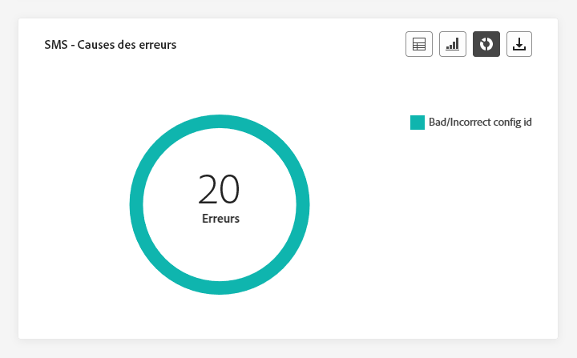

# Rapport global de parcours {#journey-global-report}

>[!CONTEXTUALHELP]
>id="ajo_journey_global_report"
>title="Rapport global de parcours"
>abstract="Le rapport global de parcours vous permet de mesurer l’efficacité de vos parcours au cours d’une période donnée. Celui-ci est composé de plusieurs widgets présentant le succès et les erreurs de votre parcours. Vous pouvez modifier chaque tableau de bord de reporting en redimensionnant ou en supprimant des widgets."

Les rapports globaux, accessibles à partir de l’onglet À toute heure, affichent les événements qui se sont produits il y a au moins deux heures et couvrent les événements sur une période sélectionnée. En comparaison, les rapports dynamiques portent sur les événements qui se sont produits au cours des dernières 24 heures, avec un intervalle de temps minimal de deux minutes à compter de l’occurrence de l’événement.

Vous pouvez accéder directement au rapport global de parcours à partir de votre parcours à l’aide du bouton **[!UICONTROL Afficher le rapport]**.

La page **[!UICONTROL Rapport global]** du parcours s&#39;affiche avec les onglets suivants :

* [Parcours](#journey-global)
* [E-mail](#email-global)
* [Notification push](#push-global)
* [SMS](#sms-global)
* [In-app](#in-app-global)

Le rapport **[!UICONTROL global]** de parcours est divisé en différents widgets détaillant la réussite et les erreurs de votre parcours. Chaque widget peut être redimensionné et supprimé si nécessaire. Pour plus d&#39;informations à ce propos, consultez cette [section](global-report.md#modify-dashboard).

Pour obtenir la liste détaillée de chaque mesure disponible dans Adobe Journey Optimizer, reportez-vous à [cette page](global-report.md#list-of-components-global).

## Onglet Parcours {#journey-global}

À partir de votre **[!UICONTROL rapport global]** de parcours, l&#39;onglet **[!UICONTROL Parcours]** vous donne une vue claire des données de suivi les plus importantes concernant votre parcours.

### Performances du parcours {#journey-perfomance}

>[!CONTEXTUALHELP]
>id="ajo_journey_performance"
>title="Performances du parcours"
>abstract="Le widget Performances du parcours vous permet de suivre visuellement le chemin de vos profils ciblés tout au long de votre parcours."

Le widget **[!UICONTROL Performances du parcours]** vous permet de retracer visuellement la trajectoire de vos profils ciblés tout au long de votre parcours.

### Statistiques du parcours {#journey-statistics}

>[!CONTEXTUALHELP]
>id="ajo_journey_statistics"
>title="Statistiques du parcours"
>abstract="Les indicateurs clés de performances (KPI) Statistiques du parcours servent de tableau de bord complet, fournissant une analyse détaillée des mesures essentielles associées à votre parcours."

Les indicateurs clés de performances (KPI) **[!UICONTROL Statistiques du parcours]** fonctionnent comme un tableau de bord global, fournissant une analyse des mesures essentielles associées à votre parcours. Cela inclut des détails tels que le nombre de profils entrés et les instances de parcours individuels ayant échoué, ce qui vous offre des informations complètes sur l’efficacité et le niveau d’engagement de votre parcours.

+++ En savoir plus sur la mesure Statistiques du parcours

* **[!UICONTROL Profils entrés]** : nombre total de personnes ayant atteint l&#39;événement d&#39;entrée du parcours.

* **[!UICONTROL Profils sortis]** : nombre total de personnes ayant quitté le parcours.

* **[!UICONTROL Parcours individuel en échec]** : nombre total de parcours individuels qui n&#39;ont pas été exécutés avec succès.

+++

### Performances des actions {#action-performance}

>[!CONTEXTUALHELP]
>id="ajo_journey_action_performance"
>title="Performances des actions"
>abstract="Le widget Performances des actions illustre les actions les plus réussies survenues lorsque vos actions ont été initiées."

Le widget **[!UICONTROL Performances des actions]** représente les actions les plus réussies survenues lorsque vos **[!UICONTROL actions]** ont été déclenchées.

### Principales actions {#top-actions}

>[!CONTEXTUALHELP]
>id="ajo_journey_top_actions"
>title="Principales actions"
>abstract="Le tableau Principales actions regroupe des informations essentielles sur vos actions et offre des observations concises sur la fréquence et l’efficacité de chaque action."

Le tableau **[!UICONTROL Principales actions]** compile les données essentielles sur vos **[!UICONTROL Actions]**. Il propose un aperçu succinct de la fréquence et des performances de chaque action.

+++ En savoir plus sur la mesure Principales actions

* **[!UICONTROL Actions exécutées avec succès]** : nombre total d&#39;**[!UICONTROL actions]** exécutées avec succès pour un parcours.

* **[!UICONTROL Erreur lors de l&#39;action]** : nombre total d&#39;erreurs survenues pour les **[!UICONTROL actions]**.

+++

### Causes des erreurs dans les actions {#action-error}

>[!CONTEXTUALHELP]
>id="ajo_journey_actions_error_reasons"
>title="Causes des erreurs dans les actions"
>abstract="Le tableau et le graphe Causes des erreurs dans les actions fournissent un résumé complet des erreurs survenues pendant l’exécution de vos actions, offrant une vue d’ensemble complète des problèmes qui peuvent s’être produits."

Le tableau et le graphe **[!UICONTROL Causes des erreurs dans les actions]** offrent une vue d’ensemble complète des erreurs qui se sont produites pendant l’exécution de vos **[!UICONTROL Actions]**.

### Événements par origine {#events-origin}

>[!CONTEXTUALHELP]
>id="ajo_journey_events_origin"
>title="Événements par origine"
>abstract="Le tableau et les graphes Événements par origine fournissent une vue de la réception réussie de vos événements. Ces représentations visuelles vous permettent de déterminer précisément lesquels de vos événements ont été reçus, ce qui vous permet d’obtenir de précieuses informations sur les performances et l’impact de chaque événement dans votre parcours."

Le tableau et les graphes **[!UICONTROL Événements par origine]** fournissent une perspective détaillée de la réception réussie de vos **[!UICONTROL événements]**. Grâce à ces représentations visuelles, vous pouvez distinguer précisément lesquels de vos **[!UICONTROL événements]** ont été reçus, ce qui vous permet d’obtenir des informations précieuses sur les performances et l’impact de chaque événement dans votre parcours.

### Événements reçus par événement {#events-received}

>[!CONTEXTUALHELP]
>id="ajo_journey_events_received"
>title="Événements reçus par événement"
>abstract="Le graphe Événements reçus par événement vous permet d’identifier et d’analyser quel événement dans votre parcours a été exécuté avec succès, fournissant des informations précieuses sur les performances et les taux de succès de chaque événement."

Le graphe **[!UICONTROL Événements reçus par événement]** vous permet d’identifier et d’analyser quel **[!UICONTROL événement]** dans votre parcours a été exécuté avec succès, fournissant des informations précieuses sur les performances et les taux de succès de chaque événement.

### Principaux événements {#top-events}

>[!CONTEXTUALHELP]
>id="ajo_journey_top_events"
>title="Principaux événements"
>abstract="Le tableau Principaux événements regroupe les données essentielles sur vos événements, fournissant des observations concises sur la fréquence et les performances de chaque événement."

Le tableau **[!UICONTROL Principaux événements]** compile les données essentielles de vos **[!UICONTROL événements]**. Il fournit des informations succinctes sur la fréquence et les performances de chaque **[!UICONTROL événement]**.

### Politiques de consentement {#consent-policies}

>[!CONTEXTUALHELP]
>id="ajo_journey_consent_policies"
>title="Politiques de consentement"
>abstract="Le tableau et le graphe Politiques de consentement affichent le nombre de profils exclus de chaque politique dans vos actions personnalisées. Cette représentation permet d’avoir un aperçu clair de l’impact de chaque politique de consentement sur les exclusions de profil."

Le tableau et le graphe **[!UICONTROL Politiques de consentement]** affichent le nombre de profils exclus de chaque politique dans vos actions personnalisées. Cela permet d’avoir un aperçu clair de l’impact de chaque politique de consentement sur les exclusions de profil.

Pour plus d’informations sur les actions personnalisées, consultez la [documentation détaillée](../action/about-custom-action-configuration.md).

Notez que pour que ces widgets s’affichent dans vos rapports Parcours, vous devez réinitialiser vos tableaux de bord. Pour ce faire, cliquez sur **[!UICONTROL Modifier]** puis sur **[!UICONTROL Réinitialiser]** en haut de votre rapport.

## Onglet E-mail {#email-global}

Dans le **[!UICONTROL rapport global]** de votre parcours, l’onglet **[!UICONTROL E-mail]** détaille les principales informations relatives aux e-mails envoyés dans votre parcours.

### E-mail – Statistiques d’envoi {#email-sending-statistics}

>[!CONTEXTUALHELP]
>id="ajo_journey_email_sending_statistics"
>title="E-mail – Statistiques d’envoi"
>abstract="Le tableau E-mail - Statistiques d’envoi résume les données essentielles relatives à vos e-mails, tels que ceux Ciblés ou Diffusés."

Le tableau **[!UICONTROL Statistiques d’envoi des e-mails]** fournit un résumé complet des données essentielles concernant les e-mails dans vos parcours. Il détaille les mesures clés, telles que la taille de l’audience ciblée et le nombre d’e-mails envoyés avec succès, ce qui vous permet d’obtenir des informations précieuses sur l’efficacité et la portée de vos e-mails et parcours.

+++ En savoir plus sur les mesures Statistiques d’envoi d’e-mails

* **[!UICONTROL Heure d’exécution]** : heure de début de chaque exécution de parcours en cas de parcours récurrents. Pour ne cibler qu’une ou plusieurs récurrences, sélectionnez-les dans le menu déroulant **[!UICONTROL Heure d’exécution]**.

* **[!UICONTROL Ciblés]** : nombre de profils ciblés pour toute action telle que l’envoi d’e-mails ou de SMS.

* **[!UICONTROL Envoyés]** : nombre total d’e-mails envoyés pour le parcours.

* **[!UICONTROL Diffusés]** : nombre d’e-mails envoyés avec succès, par rapport au nombre total d’e-mails envoyés.

* **[!UICONTROL Taux de diffusion]** : pourcentage d’e-mails envoyés avec succès.

* **[!UICONTROL Rebonds]** : nombre total d’erreurs cumulées lors de la procédure d’envoi et du traitement automatique des retours par rapport au nombre total d’e-mails envoyés.

* **[!UICONTROL Taux de rebond]** : pourcentage d’e-mails ayant rebondi par rapport aux e-mails envoyés.

* **[!UICONTROL Erreurs]** : nombre total d’erreurs survenues au cours de la procédure d’envoi, empêchant le message d’être envoyé à des profils.

* **[!UICONTROL Taux d’erreurs]** : pourcentage d’erreurs survenues au cours de la procédure d’envoi, empêchant le message d’être envoyé, par rapport aux e-mails envoyés.

* **[!UICONTROL Reprises]** : nombre d’e-mails dans la file d’attente pour les reprises.

* **[!UICONTROL Exclus]** : nombre de profils qui ont été exclus par Adobe Journey Optimizer.

+++

### E-mail – Statistiques de tracking {#email-tracking}

>[!CONTEXTUALHELP]
>id="ajo_journey_email_tracking_statistics"
>title="E-mail – Statistiques de tracking"
>abstract="Le tableau E-mail - Statistiques de tracking fournit les données sur l’activité de profil pour votre e-mail :"

Le tableau **[!UICONTROL E-mail – Statistiques de tracking]** offre un compte rendu détaillé de l’activité de profil associée aux e-mails inclus dans votre parcours. Cela inclut des mesures sur les ouvertures, les clics et d’autres indicateurs d’engagement pertinents, offrant une vue d’ensemble complète de la manière dont les profils interagissent avec le contenu de vos e-mails.

+++ En savoir plus sur les mesures E-mail – Statistiques de tracking

* **[!UICONTROL Heure d’exécution]** : heure de début de chaque exécution de votre e-mail récurrent dans votre parcours. Pour ne cibler qu’un ou plusieurs e-mails récurrents, sélectionnez-les dans le menu déroulant **[!UICONTROL Heure d’exécution]**.

* **[!UICONTROL Ouvertures]** : nombre d’ouvertures de vos e-mails dans un parcours.

* **[!UICONTROL Ouvertures uniques]** : pourcentage d’e-mails ouverts.

* **[!UICONTROL Taux d’ouvertures uniques]** : nombre total de messages ouverts par rapport au nombre de messages diffusés.

* **[!UICONTROL Clics]** : nombre de clics sur un contenu dans vos e-mails.

* **[!UICONTROL Clics uniques]** : nombre de personnes destinataires qui ont cliqué sur un contenu dans vos e-mails.

* **[!UICONTROL Taux de clics]** : pourcentage de personnes ayant interagi avec le parcours.

* **[!UICONTROL Désabonnements]** : nombre de clics sur le lien de désabonnement.

* **[!UICONTROL Plaintes contre le spam]** : nombre de fois où vos e-mails ont été déclarés comme spam ou courrier indésirable.

+++

### E-mail – Performances d’envoi {#email-performance}

>[!CONTEXTUALHELP]
>id="ajo_journey_email_sending_performance"
>title="E-mail – Performances d’envoi"
>abstract="Le graphe E-mail – Performances d’envoi présente des données complètes sur les e-mails envoyés, en fournissant des informations sur les mesures clés telles que les diffusions et les rebonds, ce qui permet d’effectuer une analyse détaillée du processus de diffusion des e-mails."

Le graphe **[!UICONTROL E-mail – Performances d’envoi]** fournit une vue complète des données liées aux e-mails envoyés dans votre parcours, offrant des informations sur les mesures clés telles que les diffusions et les rebonds. Cela permet une analyse détaillée du processus d’envoi des e-mails, fournissant des informations précieuses sur l’efficacité et les performances de vos parcours.

+++ En savoir plus sur les mesures E-mail – Performances d’envoi

* **[!UICONTROL Diffusés]** : nombre d’e-mails envoyés avec succès, par rapport au nombre total d’e-mails envoyés.

* **[!UICONTROL Rebonds]** : nombre total d’erreurs cumulées lors de la procédure d’envoi et du traitement automatique des retours par rapport au nombre total de messages envoyés.

* **[!UICONTROL Reprises]** : nombre d’e-mails dans la file d’attente pour les reprises.

* **[!UICONTROL Erreurs]** : nombre total d’erreurs survenues au cours de la procédure d’envoi, empêchant l’envoi du message à des profils.

+++

### E-mail – Catégories et raisons de rebond {#email-bounce-categories}

>[!CONTEXTUALHELP]
>id="ajo_journey_email_bounces"
>title="E-mail – Catégories et raisons de rebond"
>abstract="Les widgets E-mail - Catégories et raisons de rebond combinent les données relatives aux messages ayant fait l’objet d’un rebond en fournissant des informations détaillées sur les raisons et catégories spécifiques ayant contribué aux rebonds des e-mails."

Les widgets **[!UICONTROL Motifs de rebond]** et **[!UICONTROL Catégories de rebonds]** compilent les données disponibles relatives aux rebonds de messages, en fournissant des informations détaillées sur les raisons et catégories spécifiques des rebonds d’e-mails.

Pour plus d’informations sur les rebonds, consultez la page [Liste de suppression](../reports/suppression-list.md).

+++ En savoir plus sur les mesures E-mail – Catégories de rebonds

* **[!UICONTROL Rebond définitif]** : nombre total d’erreurs permanentes, telles qu’une adresse e-mail incorrecte. Un message d&#39;erreur indique explicitement que l&#39;adresse n&#39;est pas valide, comme Utilisateur inconnu.

* **[!UICONTROL Rebond temporaire]** : nombre total d’erreurs temporaires, telles qu’une boîte de réception pleine.

* **[!UICONTROL Ignorées]** : nombre total d&#39;erreurs temporaires (par exemple, Absent(e) du bureau) ou techniques (par exemple, si le type d&#39;expéditeur est administrateur).

+++

### E-mail – Causes d’erreur {#email-errors}

>[!CONTEXTUALHELP]
>id="ajo_journey_email_error_reasons"
>title="E-mail – Causes d’erreur"
>abstract="Les graphiques et le tableau E-mail - Causes d’erreur vous permettent d’identifier les erreurs spécifiques qui se sont produites au cours du processus d’envoi."

Les graphes et le tableau **[!UICONTROL Causes d’erreur]** offrent une visibilité des erreurs spécifiques survenues pendant le processus d’envoi, en fournissant des informations précieuses sur la nature et l’occurrence des erreurs.

### E-mail – Causes d’exclusion {#email-excluded}

>[!CONTEXTUALHELP]
>id="ajo_journey_email_excluded_reasons"
>title="E-mail – Causes d’exclusion"
>abstract="Les graphiques et le tableau Causes d’exclusion illustrent les différents facteurs qui ont conduit à ce que des profils de personnes, exclus de l’audience ciblée, ne reçoivent pas le message."

Les graphes et le tableau **[!UICONTROL Causes d’exclusion]** présentent une vue d’ensemble complète des différents facteurs qui ont abouti à l’exclusion des profils de personnes de l’audience ciblée, ayant pour effet que le message n’a pas été reçu.

Consultez [cette page](exclusion-list.md) pour la liste complète des causes d’exclusion.

### Envoyés et diffusés par domaines {#sent-domains}

>[!CONTEXTUALHELP]
>id="ajo_journey_email_sent_delivered_domains"
>title="Envoyés et diffusés par domaines"
>abstract="Le tableau et le graphe Envoyés et diffusés par domaines fournissent une ventilation des e-mails classés par domaines, ce qui présente des informations détaillées sur les performances globales de vos communications par e-mail."

Le tableau et le graphe **[!UICONTROL Envoyés et diffusés par domaines]** fournissent une répartition détaillée des e-mails au niveau du domaine, ce qui vous permet d’obtenir des informations complètes sur les performances de vos e-mails.

+++ En savoir plus sur les mesures Envoyés et diffusés par domaines

* **[!UICONTROL Envoyés]** : nombre total d’e-mails envoyés.

* **[!UICONTROL Diffusés]** : nombre d’e-mails envoyés avec succès, par rapport au nombre total d’e-mails envoyés.

+++

### Ouvertures et clics par domaines {#open-domains}

>[!CONTEXTUALHELP]
>id="ajo_journey_email_open_clicks_domains"
>title="Ouvertures et clics par domaines"
>abstract="Le graphe et le tableau Ouvertures et clics par domaines offre une ventilation détaillée au niveau du domaine, présentant une vue complète de l’interaction de votre audience avec vos e-mails."

Le graphe et le tableau **[!UICONTROL Ouvertures et clics par domaines]** présentent une répartition au niveau du domaine de l’engagement de vos profils avec votre e-mail, fournissant des informations précieuses sur la manière dont les différents domaines interagissent avec votre contenu.

+++ En savoir plus sur la mesure Ouverture et clics par domaines

* **[!UICONTROL Ouvertures]** : nombre de fois où l’e-mail a été ouvert.

* **[!UICONTROL Clics]** : nombre de fois où un contenu a fait l’objet d’un clic dans un e-mail.

+++

### Rebonds et erreurs par domaine {#bounces-domains}

>[!CONTEXTUALHELP]
>id="ajo_journey_email_bounces_errors_domains"
>title="Rebonds et erreurs par domaine"
>abstract="Le tableau et le graphe Rebonds et erreurs par domaines fournissent une répartition détaillée au niveau du domaine, offrant ainsi des informations sur les erreurs spécifiques rencontrées lors du processus d’envoi des e-mails."

Le graphe et le tableau **[!UICONTROL Rebonds et erreurs par domaine]** fournissent une répartition au niveau du domaine des erreurs spécifiques rencontrées lors du processus d’envoi, fournissant ainsi une analyse détaillée des problèmes qui se sont produits.

+++ En savoir plus sur les mesures Rebonds et erreurs par domaine

* **[!UICONTROL Rebonds]** : nombre total d’erreurs cumulées lors du processus d’envoi et du traitement automatique des retours par rapport au nombre total d’e-mails envoyés.

* **[!UICONTROL Erreurs]** : nombre total d’erreurs survenues au cours du processus d’envoi, empêchant l’envoi du message à des profils.

+++

### Raisons de rebond par domaine {#bounce-reasons-domains}

>[!CONTEXTUALHELP]
>id="ajo_journey_email_bounces_reasons_domains"
>title="Causes des bounces par domaine"
>abstract="Le tableau et graphe Raisons des rebonds par domaine fournissent une répartition au niveau du domaine, offrant ainsi des informations exhaustives sur les erreurs temporaires et permanentes. Cette analyse détaillée vous fournit des informations précieuses sur les raisons spécifiques des rebonds."

Le graphe et le tableau **[!UICONTROL Raisons de rebond par domaine]** fournissent une répartition au niveau du domaine des données concernant les erreurs temporaires et permanentes, offrant ainsi des informations détaillées sur les raisons des messages ayant fait l’objet d’un rebond.

### E-mail – Principale URL {#email-top}

>[!CONTEXTUALHELP]
>id="ajo_journey_email_top_url"
>title="E-mail – Principale URL"
>abstract="Le tableau et le graphique E-mail - Principale URL offrent une vue d’ensemble complète des URL de votre e-mail qui reçoivent le plus de trafic, ce qui vous permet d’identifier les liens les plus populaires."

Le graphe et le tableau **[!UICONTROL E-mail – Principale URL]** fournissent un aperçu complet des URL de votre e-mail qui attirent le plus de visiteurs et visiteuses. Cela vous permet d’identifier et de hiérarchiser les liens les plus populaires, ce qui améliore votre compréhension de l’engagement des profils avec du contenu spécifique dans vos e-mails.

### E-mail – Optimisation {#email-sto}

>[!CONTEXTUALHELP]
>id="ajo_journey_email_optimization"
>title="E-mail – Optimisation"
>abstract="Les widgets Optimisation de l’heure d’envoi et Optimisé ou non optimisé fournissent des informations détaillées sur vos messages, indiquant s’ils ont été optimisés ou non."

>[!NOTE]
>
>Les widgets **[!UICONTROL Optimisation de l’heure d’envoi]** et **[!UICONTROL Optimisé ou non optimisé]** ne sont disponibles que si l’option Optimisation de l’heure d’envoi est activée pour votre diffusion. Pour plus d’informations sur l’optimisation de l’heure d’envoi, consultez [cette page](../building-journeys/journeys-message.md#send-time-optimization).

Les widgets **[!UICONTROL Optimisation de l’heure d’envoi]** et **[!UICONTROL Optimisé ou non optimisé]** détaillent le succès de vos e-mails selon la méthode d’envoi : optimisée ou normale.

+++ En savoir plus sur les mesures Optimisation de l’heure d’envoi et Optimisé ou non optimisé

* **[!UICONTROL Délivrés]** : nombre de messages envoyés avec succès, par rapport au nombre total de messages envoyés.
* **[!UICONTROL Rebonds]** : nombre total d’erreurs cumulées lors de la procédure d’envoi et du traitement automatique des retours par rapport au nombre total de messages envoyés.

* **[!UICONTROL Envoyés]** : nombre total d’e-mails envoyés pour le parcours.

* **[!UICONTROL Ouvertures]** : nombre d’ouvertures de vos e-mails dans le parcours.

* **[!UICONTROL Clics]** : nombre de clics sur un contenu dans vos e-mails.

+++

### E-mail – Offres {#email-offers}

>[!CONTEXTUALHELP]
>id="ajo_journey_email_offers"
>title="E-mail – Offres"
>abstract="Les widgets Statistiques détaillées des offres et Statistiques des offres fournissent des informations exhaustives sur les performances de vos offres, fournissant ainsi une analyse détaillée de leur impact au fil du temps et présentant des statistiques détaillées pour permettre une compréhension plus approfondie."

>[!NOTE]
>
>Les widgets et mesures Offres ne sont disponibles que si une décision a été insérée dans un e-mail. Pour plus d’informations sur la gestion des décisions, consultez cette [page](../offers/get-started/starting-offer-decisioning.md).

Les widgets **[!UICONTROL Statistiques des offres]** et **[!UICONTROL Statistiques détaillées sur les offres]** dans le temps mesurent le succès de votre offre et son impact sur l’audience ciblée. Ils détaillent les informations principales relatives à votre message avec les KPI.

+++ En savoir plus sur les mesures E-mail – Offres

* **[!UICONTROL Offre envoyée]** : nombre total d’envois pour l’offre.

* **[!UICONTROL Impression de l’offre]** : nombre d’ouvertures de l’offre dans vos e-mails.

* **[!UICONTROL Clics sur l’offre]** : nombre de clics sur une offre dans vos e-mails.

* **[!UICONTROL Nom de l’emplacement]** : nom de l’emplacement utilisé pour afficher votre offre. Pour plus d’informations sur les emplacements, consultez cette [page](../offers/offer-library/creating-placements.md).

* **[!UICONTROL Nom de l’offre]** : nom de l’offre ajoutée à vos e-mails. Pour plus d’informations sur les emplacements, consultez cette [page](../offers/offer-library/creating-personalized-offers.md).

* **[!UICONTROL Offre envoyée]** : nombre total d’envois pour l’offre.

* **[!UICONTROL Taux d’impression de l’offre]** : pourcentage d’offres ouvertes par rapport au nombre d’offres envoyées.

* **[!UICONTROL Taux de clics de l’offre]** : pourcentage d’utilisateurs ayant interagi avec l’offre.

+++

## Onglet Notification push {#push-global}

Dans le **[!UICONTROL Rapport global]** de votre parcours, l’onglet **[!UICONTROL Notification push]** détaille les principales informations relatives aux notifications push envoyées dans votre parcours.

### Notification push – Statistiques d’envoi {#push-sending-stat}

>[!CONTEXTUALHELP]
>id="ajo_journey_push_sending_statistics"
>title="Notification push – Statistiques d’envoi"
>abstract="Le tableau Notification push - Statistiques d’envoi résume les données essentielles sur vos notifications push, telles que les messages ciblés ou diffusés."

Le tableau **[!UICONTROL Notification push – Statistiques d’envoi]** fournit un résumé concis des données essentielles liées à vos notifications push, y compris les mesures clés telles que le nombre de messages ciblés et le nombre de messages diffusés avec succès.

+++ En savoir plus sur les mesures Notification push – Statistiques d’envoi

* **[!UICONTROL Heure d’exécution]** : heure de début de chaque exécution de parcours en cas de parcours récurrents. Pour ne cibler qu’une ou plusieurs récurrences, sélectionnez-les dans le menu déroulant **[!UICONTROL Heure d’exécution]**.

* **[!UICONTROL Ciblés]** : nombre de profils ciblés pour toute action telle que l’envoi d’e-mails ou de SMS.

* **[!UICONTROL Envoyées]** : nombre total de notifications push envoyées.

* **[!UICONTROL Délivrées]** : nombre de notifications push envoyées avec succès, par rapport au nombre total de notifications push envoyées.

* **[!UICONTROL Taux de diffusion]** : pourcentage de notifications push envoyées avec succès.

* **[!UICONTROL Rebonds]** : nombre total d’erreurs cumulées lors de la procédure d’envoi et du traitement automatique des retours par rapport au nombre total de notifications push envoyées.

* **[!UICONTROL Taux de rebond]** : pourcentage de notifications push ayant rebondi par rapport aux notifications push envoyées.

* **[!UICONTROL Erreurs]** : nombre total d’erreurs survenues au cours de la procédure d’envoi, empêchant le message d’être envoyé à des profils.

* **[!UICONTROL Taux d’erreurs]** : pourcentage d’erreurs survenues pendant la procédure d’envoi qui l’empêchent d’être envoyée par rapport aux notifications push envoyées.

* **[!UICONTROL Exclus]** : nombre de profils qui ont été exclus par Adobe Journey Optimizer.

+++

### Notification push – Statistiques de tracking {#push-tracking-stat}

>[!CONTEXTUALHELP]
>id="ajo_journey_push_tracking_statistics"
>title="Notification push – Statistiques de tracking"
>abstract="Les statistiques de tracking des notifications push fournissent des données sur l’activité de profil pour votre notification push."

Le widget **[!UICONTROL Notification push – Statistiques de tracking]** offre un instantané détaillé de l’activité de profil liée à vos notifications push, fournissant des informations essentielles sur l’engagement et l’efficacité des notifications push.

+++ En savoir plus sur les mesures Notification push – Statistiques de tracking

* **[!UICONTROL Heure d’exécution]** : heure de début de chaque exécution de parcours en cas de parcours récurrents. Pour ne cibler qu’une ou plusieurs récurrences, sélectionnez-les dans le menu déroulant **[!UICONTROL Heure d’exécution]**.

* **[!UICONTROL Ouvertures]** : nombre de fois où vos notifications push ont été ouvertes dans le parcours.

* **[!UICONTROL Actions]** : nombre total d’actions sur la notification push diffusée, par exemple clic sur un bouton ou rejet.

+++

### Notification push – Synthèse des envois {#push-summary}

>[!CONTEXTUALHELP]
>id="ajo_journey_push_sending_summary"
>title="Notification push – Synthèse des envois"
>abstract="Le graphique Notification push - Synthèse des envois affiche les données disponibles pour les notifications push envoyées."

Le graphe **[!UICONTROL Notification push – Synthèse des envois]** offre une représentation dynamique, en affichant une analyse de votre activité de notifications push. Cette représentation graphique montre une répartition complète des notifications push envoyées.

+++ En savoir plus sur les mesures Notification push – Synthèse des envois

* **[!UICONTROL Ouvertures]** : nombre de fois où vos notifications push ont été ouvertes dans un parcours.

* **[!UICONTROL Actions]** : nombre total d’actions sur la notification push diffusée, par exemple clic sur un bouton ou rejet.

* **[!UICONTROL Rebonds]** : nombre total d’erreurs cumulées lors de la procédure d’envoi et du traitement automatique des retours par rapport au nombre total de notifications push envoyées.

* **[!UICONTROL Diffusées]** : nombre de notifications push envoyées avec succès, par rapport au nombre total de notifications push envoyées.

* **[!UICONTROL Erreurs]** : nombre total d’erreurs survenues au cours de la procédure d’envoi, empêchant le message d’être envoyé à des profils.

+++

### Notification push – Causes d’erreur {#push-error-reasons}

>[!CONTEXTUALHELP]
>id="ajo_journey_push_error_reasons"
>title="Notification push – Causes d’erreur"
>abstract="Les graphes et le tableau Causes d’erreur vous permettent d’identifier les erreurs spécifiques qui se sont produites au cours du processus d’envoi."

Le tableau et les graphes **[!UICONTROL Causes d’erreur]** vous permettent d’identifier les erreurs spécifiques qui se sont produites au cours du processus d’envoi de vos notifications push, en fournissant des informations détaillées sur les problèmes rencontrés en cours de route.

### Notification push – Causes d’exclusion {#push-excluded}

>[!CONTEXTUALHELP]
>id="ajo_journey_push_excluded_reasons"
>title="Notification push – Causes d’exclusion"
>abstract="Les graphes et le tableau Causes d’exclusion illustrent les différents facteurs qui ont conduit à ce que des profils d’utilisateur ou d’utilisatrice, exclus de l’audience ciblée, ne reçoivent pas le message."

Les graphes et le tableau **[!UICONTROL Causes d’exclusion]** affichent les différentes causes qui ont empêché les profils de personnes, exclus des profils ciblés, de recevoir vos notifications push.

Consultez [cette page](exclusion-list.md) pour la liste complète des causes d’exclusion.

### Notification push – Répartition par plateforme {#push-breakdown}

>[!CONTEXTUALHELP]
>id="ajo_journey_push_breakdown_platform"
>title="Notification push – Répartition par plateforme"
>abstract="Le tableau et les graphes Notifications Push - Répartition par plateforme fournissent une répartition de la réussite de vos notifications push en fonction du système d’exploitation du profil."

Le graphe et le tableau **[!UICONTROL Répartition par plateforme]** fournit une analyse détaillée du succès de vos notifications push, offrant des informations en fonction du système d’exploitation de votre profil. Cette répartition vous permet de mieux comprendre les performances de vos notifications push sur différentes plateformes.

### Notification push – Optimisation {#push-sto}

>[!NOTE]
>
>Les widgets **[!UICONTROL Optimisé ou non optimisé]** et **[!UICONTROL Optimisation de l’heure d’envoi]** ne sont disponibles que si l’option Optimisation de l’heure d’envoi est activée pour votre diffusion. Pour plus d’informations sur l’optimisation de l’heure d’envoi, consultez [cette page](../building-journeys/journeys-message.md#send-time-optimization).

Les widgets **[!UICONTROL Optimisé ou non optimisé]** et **[!UICONTROL Optimisation de l’heure d’envoi]** détaillent les principales informations relatives à votre message, qu’elles soient optimisées ou non.

+++ En savoir plus sur les mesures Notification push – Optimisation

* **[!UICONTROL Diffusés]** : nombre de messages envoyés avec succès, par rapport au nombre total de messages envoyés.

* **[!UICONTROL Ouvertures]** : nombre de fois où vos notifications push ont été ouvertes dans le parcours.

* **[!UICONTROL Actions]** : nombre total d’actions sur la notification push diffusée, par exemple clic sur un bouton ou rejet.

* **[!UICONTROL Délivrés]** : nombre de messages envoyés avec succès, par rapport au nombre total de messages envoyés.

* **[!UICONTROL Rebonds]** : nombre total d’erreurs cumulées lors de la procédure d’envoi et du traitement automatique des retours par rapport au nombre total de messages envoyés.

+++

## Onglet SMS {#sms-global}

### SMS – Statistiques dʼenvoi {#sms-sending-stat}

>[!CONTEXTUALHELP]
>id="ajo_journey_sms_sending_statistics"
>title="SMS – Statistiques dʼenvoi"
>abstract="Le tableau SMS - Statistiques d’envoi résume les données essentielles relatives à vos SMS, telles que les messages ciblés ou distribués."

Le tableau **[!UICONTROL SMS – Statistiques d’envoi]** fournit un résumé concis des données essentielles liées à vos SMS, y compris les mesures clés telles que le nombre de messages ciblés et le nombre de messages livrés avec succès.

+++ En savoir plus sur les mesures SMS – Statistiques d’envoi

* **[!UICONTROL Heure d’exécution]** : heure de début de chaque exécution de parcours en cas de parcours récurrents. Pour ne cibler qu’une ou plusieurs récurrences, sélectionnez-les dans le menu déroulant **[!UICONTROL Heure d’exécution]**.

* **[!UICONTROL Ciblés]** : nombre de profils de personnes qui sont qualifiés en tant que profils cibles pour les SMS.

* **[!UICONTROL Exclus]** : nombre de profils de personnes, exclus des profils ciblés, qui n’ont pas reçu vos SMS.

* **[!UICONTROL Envoyés]** : nombre total de SMS envoyés pour le parcours.

* **[!UICONTROL Rebonds]** : nombre total d’erreurs cumulées lors de la procédure d’envoi et du traitement automatique des retours par rapport au nombre total de SMS envoyés.

* **[!UICONTROL Erreurs]** : nombre total d’erreurs survenues au cours de la procédure d’envoi, empêchant le message d’être envoyé à des profils.

+++

### SMS – Statistiques de tracking {#sms-tracking-stat}

>[!CONTEXTUALHELP]
>id="ajo_journey_sms_tracking_statistics"
>title="SMS – Statistiques de tracking"
>abstract="Le widget SMS - Statistiques de suivi offre un aperçu exhaustif des informations essentielles relatives à l’interaction des visiteurs et visiteuses avec votre URL."

Le widget **[!UICONTROL SMS – Statistiques de tracking]** fournit une vue d’ensemble détaillée des informations clés relatives à l’engagement de vos visiteurs et vos visiteuses avec vos URL, et offre des informations sur l’efficacité de vos SMS.

* **[!UICONTROL Heure d’exécution]** : heure de début de chaque exécution de votre SMS récurrent. Pour ne cibler qu’un ou plusieurs SMS récurrents, sélectionnez-les dans le menu déroulant **[!UICONTROL Heure d’exécution]**.

* **[!UICONTROL Clics]** : nombre de clics sur le contenu de vos SMS.

### SMS – Performances par date {#sms-performance-date}

>[!CONTEXTUALHELP]
>id="ajo_journey_sms_perfomance_date"
>title="SMS – Performances par date"
>abstract="Le widget SMS - Performances par date fournit des informations essentielles sur vos messages via une représentation graphique."

Le widget **[!UICONTROL SMS – Performances par date]** offre une vue d’ensemble détaillée des informations clés relatives à vos messages, présenté sous la forme d’un graphe, fournissant des informations sur les tendances de performances au cours de périodes spécifiques.

+++ En savoir plus sur les mesures SMS – Performances par date

* **[!UICONTROL Envoyés]** : nombre total de SMS envoyés pour le parcours.

* **[!UICONTROL Rebonds]** : nombre total d’erreurs cumulées lors de la procédure d’envoi et du traitement automatique des retours par rapport au nombre total de SMS envoyés.

* **[!UICONTROL Erreurs]** : nombre total d’erreurs survenues au cours de la procédure d’envoi, empêchant le message d’être envoyé à des profils.

+++

### SMS – Causes de rebonds {#sms-bounce}

>[!CONTEXTUALHELP]
>id="ajo_journey_sms_bounces_reasons"
>title="SMS – Causes de rebonds"
>abstract="Les graphiques et le tableau Causes de rebonds contiennent les données disponibles sur les messages ayant fait l’objet d’un rebond."

Les graphes et le tableau **[!UICONTROL Raisons de rebond]** fournissent une vue d’ensemble complète des données relatives aux SMS rebonds, fournissant des informations précieuses sur les raisons spécifiques à l’origine des rebonds des SMS.

### SMS – Causes d’erreur {#sms-error}

>[!CONTEXTUALHELP]
>id="ajo_journey_sms_error_reasons"
>title="SMS – Causes d’erreur"
>abstract="Les graphiques et le tableau SMS - Causes d’erreur vous permettent d’identifier les erreurs spécifiques qui se sont produites au cours du processus d’envoi."

Les graphes et le tableau **[!UICONTROL Causes d’erreur]** vous permettent d’identifier les erreurs spécifiques qui se sont produites au cours du processus d’envoi de vos messages SMS, en fournissant une analyse minutieuse de tout problème rencontré.

### SMS – Causes d’exclusion {#sms-excluded}

>[!CONTEXTUALHELP]
>id="ajo_journey_sms_excluded_reasons"
>title="SMS – Causes d’exclusion"
>abstract="Les graphiques et le tableau Causes d’exclusion illustrent les différents facteurs qui ont conduit à ce que des profils de personnes, exclus de l’audience ciblée, ne reçoivent pas le message."

Les graphes et le tableau **[!UICONTROL Causes d’exclusion]** décrivent visuellement les différents facteurs qui ont conduit à l’exclusion des profils de personnes de l’audience ciblée, ce qui les empêche de recevoir vos SMS.

Consultez [cette page](exclusion-list.md) pour la liste complète des causes d’exclusion.

### SMS – Clics par liens {#sms-clicks}

>[!CONTEXTUALHELP]
>id="ajo_journey_sms_clicks"
>title="SMS – Clics par liens"
>abstract="Le widget SMS - Clics par liens fournit des informations essentielles sur l’engagement de vos visiteurs et visiteuses avec les URL dans vos messages."

Le widget **[!UICONTROL SMS – Clics par liens]** offre des informations essentielles sur l’engagement de vos visiteurs et visiteuses avec les URL incluses dans vos messages, fournissant des informations précieuses sur les liens qui attirent le plus d’interactions.

## Onglet In-app {#in-app-global}

Dans le **[!UICONTROL rapport global]** de votre parcours, l’onglet **[!UICONTROL In-app]** détaille les principales informations relatives aux messages in-app envoyés dans vos parcours.

### Performances in-app {#inapp-performance}

>[!CONTEXTUALHELP]
>id="ajo_journey_inapp_performance"
>title="Performances in-app"
>abstract="Les KPI de performances in-app fournissent des informations essentielles sur l’engagement de vos visiteurs et visiteuses avec les messages in-app."

Les KPI **[!UICONTROL Performances in-app]** fournissent des informations essentielles sur l’engagement de vos profils avec les messages in-app, ce qui fournit des mesures essentielles pour évaluer l’efficacité et l’impact des messages in-app inclus dans votre parcours.

+++ En savoir plus sur les mesures In-app – Performances par date

* **[!UICONTROL Impressions uniques]** : nombre de personnes uniques auxquelles le message in-app a été délivré.

* **[!UICONTROL Impressions]** : nombre total de messages in-app diffusés à toutes les personnes.

  >[!NOTE]
  >
  >Pour s’assurer qu’une impression est comptabilisée, la personne doit répondre à deux critères :
  >* Qualification au sein de l’expérience in-app, obtenue en atteignant l’activité in-app spécifique dans son parcours.
  >* Respect des conditions spécifiées dans les règles de déclenchement.
  > 
  >En raison du deuxième critère, il peut y avoir des variations notables entre le nombre de profils ciblés et le nombre d’impressions uniques.

* **[!UICONTROL Interactions]** : nombre d’engagements en lien avec votre message in-app. Cela inclut toutes les actions entreprises par les personnes, telles que les clics, les abandons ou toute autre interaction.
+++

### Synthèse in-app {#inapp-summary}

>[!CONTEXTUALHELP]
>id="ajo_journey_inapp_summary"
>title="Synthèse in-app"
>abstract="Le graphique Résumé in-app présente l’évolution de vos impressions et interactions in-app pour la période concernée."

Le graphe **[!UICONTROL Résumé in-app]** illustre la progression de vos impressions et interactions in-app au cours de la période spécifiée, en fournissant une vue d’ensemble complète des performances de vos messages in-app.

### Interactions par type {#interactions-type}

>[!CONTEXTUALHELP]
>id="ajo_journey_inapp_interactions"
>title="Interactions par type"
>abstract="Les graphiques et le tableau Interactions par type détaillent la manière dont les personnes ont interagi avec votre message in-app en suivant les clics, les rejets ou les interactions."

Les graphes et le tableau **[!UICONTROL Interactions par type]** fournissent un compte-rendu détaillé de la manière dont les profils ont interagi avec votre message in-app, en suivant des actions telles que les clics, les rejets ou toute autre forme d’engagement.
