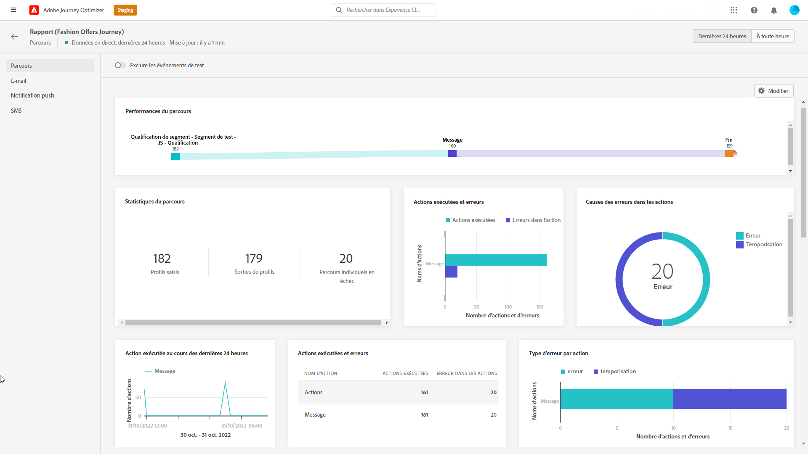
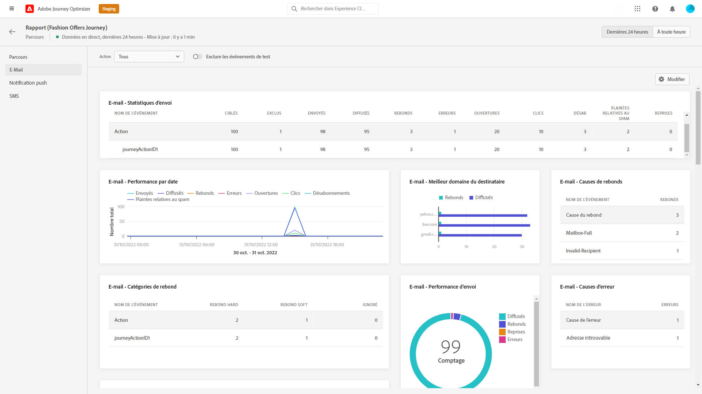
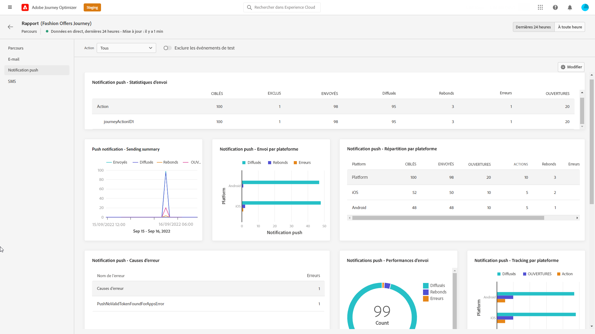
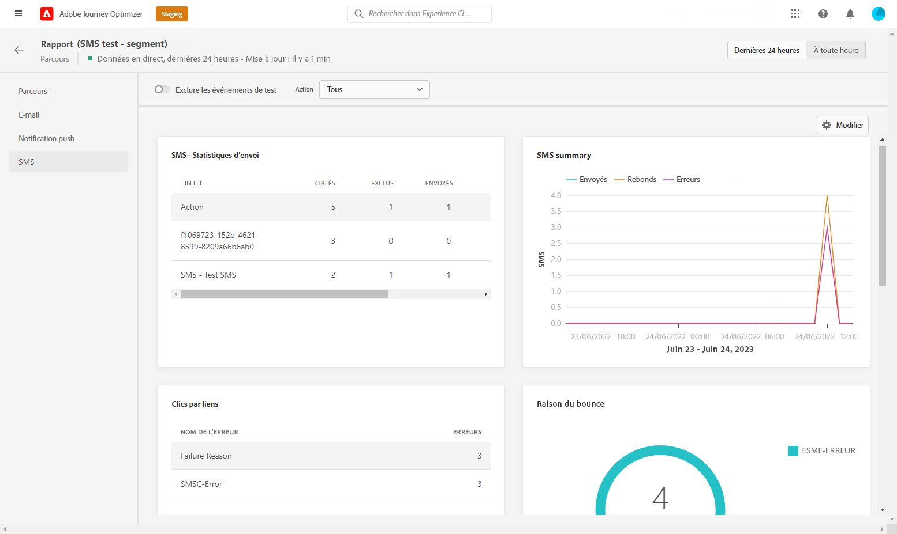

# Rapport d’activation du parcours {#journey-live-report}

Le rapport d’activation du parcours est accessible directement à partir de votre parcours, à l’aide de la variable **[!UICONTROL View report]** bouton .

Le parcours **[!UICONTROL Live report]** s’affiche avec les onglets suivants :

* [Parcours](#journey-live)
* [Email](#email-live)
* [Push](#push-live)
* [SMS](#sms-live)

Le parcours **[!UICONTROL Live report]** est divisé en différents widgets détaillant le succès et les erreurs de votre parcours. Chaque widget peut être redimensionné et supprimé si nécessaire. Voir à ce sujet la section [section](live-report.md#modify-dashboard).

Pour obtenir la liste détaillée de chaque mesure disponible dans Adobe Journey Optimizer, reportez-vous à la section [cette page](live-report.md#list-of-components-live).

## Onglet Parcours {#journey-live}

À partir du parcours **[!UICONTROL Live report]**, la variable **[!UICONTROL Journey]** vous donne une vue claire des données de suivi les plus importantes pour votre parcours.

+++En savoir plus sur les différents widgets et mesures disponibles pour le rapport Parcours.

**[!UICONTROL Journey Performance]** vous permet de voir le chemin de vos profils ciblés pas à pas tout au long de votre parcours.

Le **[!UICONTROL Journey Statistics]** Le widget affiche les IPC suivants :

* **[!UICONTROL Entered profiles]**: Nombre total d’individus ayant atteint l’événement d’entrée du parcours.

* **[!UICONTROL Exited profiles]**: Nombre total d’individus ayant quitté le parcours.

* **[!UICONTROL Failed individual journeys]**: Nombre total de parcours individuels qui n’ont pas été exécutés avec succès.

Le **[!UICONTROL Event executed over the last 24 hours]** et **[!UICONTROL Events]** Les widgets vous permettent de voir quel de vos événements a été exécuté avec succès par l’intermédiaire d’un nombre résumé, d’un graphique et d’un tableau.

Le **[!UICONTROL Action executed over the last 24 hours]** et **[!UICONTROL Actions executed and errors]** Les widgets représentent l’action et les erreurs qui ont réussi le mieux lors du déclenchement de vos actions. Le graphique d’actions, le tableau et les nombres de synthèse contiennent les données disponibles pour les actions, telles que :

* **[!UICONTROL Actions executed]**: Nombre total d’actions exécutées avec succès pour un parcours.

* **[!UICONTROL Error in actions]**: Nombre total d’erreurs qui se sont produites pour les actions.
+++

## Onglet Email {#email-live}

À partir du parcours **[!UICONTROL Live report]**, la variable **[!UICONTROL Email]** Cet onglet présente les informations principales relatives aux diffusions email envoyées dans votre parcours.

+++En savoir plus sur les différents widgets et mesures disponibles pour le rapport Email.

Le **[!UICONTROL Email Sending Statistics]** widget détaille les informations principales relatives à votre message :

* **[!UICONTROL Delivered]**: Nombre de messages envoyés avec succès.

* **[!UICONTROL Bounces]**: Nombre total d&#39;erreurs cumulées lors des diffusions et du traitement automatique des retours.

* **[!UICONTROL Errors]**: Nombre total d&#39;erreurs qui se sont produites au cours d&#39;une diffusion et qui l&#39;ont empêché d&#39;être envoyée aux profils.

Le **[!UICONTROL Sending metrics by Email]** table et **[!UICONTROL Email Summary]** graph détaille le succès de votre diffusion :

* **[!UICONTROL Sent]**: Nombre total d&#39;envois pour la diffusion.

* **[!UICONTROL Delivered]**: Nombre de messages envoyés avec succès.

* **[!UICONTROL Bounces]**: Nombre total d&#39;erreurs cumulées lors des diffusions et du traitement automatique des retours.

* **[!UICONTROL Errors]**: Nombre total d&#39;erreurs qui se sont produites au cours d&#39;une diffusion et qui l&#39;ont empêché d&#39;être envoyée aux profils.

* **[!UICONTROL Opens]**: Nombre d’ouvertures d’un message dans une diffusion.

* **[!UICONTROL Clicks]**: Nombre de clics sur un contenu dans une diffusion.

* **[!UICONTROL Unsubscribe]**: Nombre de clics sur le lien de désinscription.

* **[!UICONTROL Spam complaints]**: Nombre de fois où un message a été déclaré comme spam ou courrier indésirable.

Le **[!UICONTROL Bounce Reasons]**, **[!UICONTROL Bounce categories]** et **[!UICONTROL Hard and bounce - by Email]** Les widgets contiennent les données disponibles relatives aux messages rebonds, telles que :

* **[!UICONTROL Hard bounce]**: Nombre total d’erreurs permanentes, telles qu’une adresse email incorrecte. Il s’agit d’un message d’erreur indiquant explicitement que l’adresse n’est pas valide, tel qu’Utilisateur inconnu.

* **[!UICONTROL Soft bounce]**: Nombre total d’erreurs temporaires, telles qu’une boîte de réception pleine.

* **[!UICONTROL Ignored]**: Nombre total de messages temporaires, tels que Absence du bureau, ou une erreur technique, par exemple si le type d’expéditeur est Postmaster.

Le **[!UICONTROL Error Reasons]** et **[!UICONTROL Exclude Reasons]** les graphiques et les tableaux vous permettent de voir quelles erreurs et exclusions ont eu lieu au cours de votre diffusion.

Le **[!UICONTROL Email - Top recipient domain]** le graphique et le tableau détaillent les domaines les plus utilisés par les destinataires pour ouvrir l’email.

>[!NOTE]
>
>Les widgets et mesures Offres ne sont disponibles que si une décision a été insérée dans un courrier électronique. Pour plus d’informations sur la gestion des décisions, reportez-vous à cette section [page](../offers/get-started/starting-offer-decisioning.md).

Le **[!UICONTROL Offers statistic]** et **[!UICONTROL Offers statistics]** au fil du temps, les widgets mesurent le succès et l’impact de votre offre sur votre audience ciblée. Il détaille les informations principales relatives à votre message avec les KPI :

* **[!UICONTROL Offer sent]**: Nombre total d&#39;envois pour l&#39;offre.

* **[!UICONTROL Offer impression]**: Nombre d’ouvertures de l’offre dans une diffusion.

* **[!UICONTROL Offer clicks]**: Nombre de clics sur une offre dans une diffusion.
+++

## Onglet Notification push {#push-live}

À partir du parcours **[!UICONTROL Live report]**, la variable **[!UICONTROL Push notification]** Cet onglet présente les informations principales relatives aux diffusions push envoyées dans votre parcours.

+++En savoir plus sur les différents widgets et mesures disponibles pour le rapport push.

**[!UICONTROL Push notification sending performance]**, **[!UICONTROL Push notification summary]** et **[!UICONTROL Sending metrics - by Push]** Les widgets détaillent les informations principales relatives à votre message :

* **[!UICONTROL Sent]**: Nombre total d&#39;envois pour la diffusion.

* **[!UICONTROL Delivered]**: Nombre de messages envoyés avec succès.

* **[!UICONTROL Bounces]**: Nombre total d&#39;erreurs cumulées lors des diffusions et du traitement automatique des retours.

* **[!UICONTROL Errors]**: Nombre total d&#39;erreurs qui se sont produites au cours d&#39;une diffusion et qui l&#39;ont empêché d&#39;être envoyée aux profils.

* **[!UICONTROL Opens]**: Nombre d’ouvertures d’un message dans une diffusion.

* **[!UICONTROL Actions]**: Nombre total d&#39;actions sur la notification push diffusée, par exemple clic sur un bouton ou rejet.

* **[!UICONTROL Engagements]**: Nombre total d&#39;ouvertures et d&#39;actions pour cette notification push, c&#39;est-à-dire si le profil a ouvert la notification push ou si un utilisateur a cliqué sur un bouton.

Le **[!UICONTROL Error Reasons]** et **[!UICONTROL Exclude Reasons]** les graphiques et les tableaux vous permettent de voir quelles erreurs et exclusions ont eu lieu au cours de votre diffusion.

Le **[!UICONTROL Sending statistics - Failed]** widget vous permet de voir le nombre d’erreurs et de rebonds qui se sont produits.

Le **[!UICONTROL Tracking by platform]**, **[!UICONTROL Sending by platform]** et **[!UICONTROL Breakdown by platform]** les graphiques et les tableaux décrivent le succès de votre notification push en fonction du système opérationnel.
+++

## Onglet SMS {#sms-live}

+++En savoir plus sur les différentes mesures et widgets disponibles pour le rapport SMS.

Le **[!UICONTROL SMS - Sending statistics]** le tableau détaille le succès de votre diffusion :

* **[!UICONTROL Targeted]**: Nombre de profils utilisateur qui remplissent les critères de ciblage pour cette diffusion.

* **[!UICONTROL Excluded]**: Nombre de profils utilisateur, exclus des profils ciblés, qui n’ont pas reçu le message.

* **[!UICONTROL Sent]**: Nombre total d&#39;envois pour la diffusion.

* **[!UICONTROL Delivered]**: Nombre de messages envoyés avec succès.

* **[!UICONTROL Opens]**: Nombre d’ouvertures d’un message dans une diffusion.

* **[!UICONTROL Clicks]**: Nombre de clics sur un contenu dans une diffusion.

* **[!UICONTROL Bounces]**: Nombre total d&#39;erreurs cumulées lors des diffusions et du traitement automatique des retours.

* **[!UICONTROL Errors]**: Nombre total d&#39;erreurs qui se sont produites au cours d&#39;une diffusion et qui l&#39;ont empêché d&#39;être envoyée aux profils.

Le **[!UICONTROL SMS Summary]** graph détaille le succès de votre diffusion :

* **[!UICONTROL Delivered]**: Nombre de messages envoyés avec succès.

* **[!UICONTROL Bounces]**: Nombre total d&#39;erreurs cumulées lors des diffusions et du traitement automatique des retours.

* **[!UICONTROL Errors]**: Nombre total d&#39;erreurs qui se sont produites au cours d&#39;une diffusion et qui l&#39;ont empêché d&#39;être envoyée aux profils.

Le **[!UICONTROL Exclude Reasons]** les graphiques et les tableaux vous permettent de voir quelles erreurs et exclusions ont eu lieu au cours de votre diffusion.
+++
