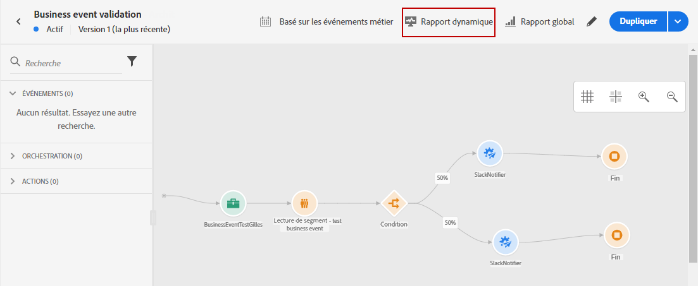
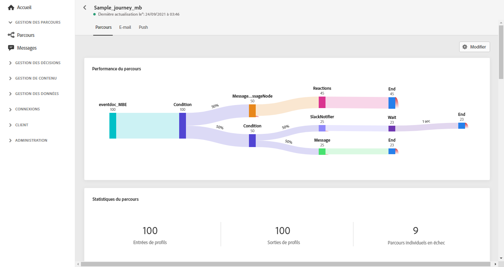
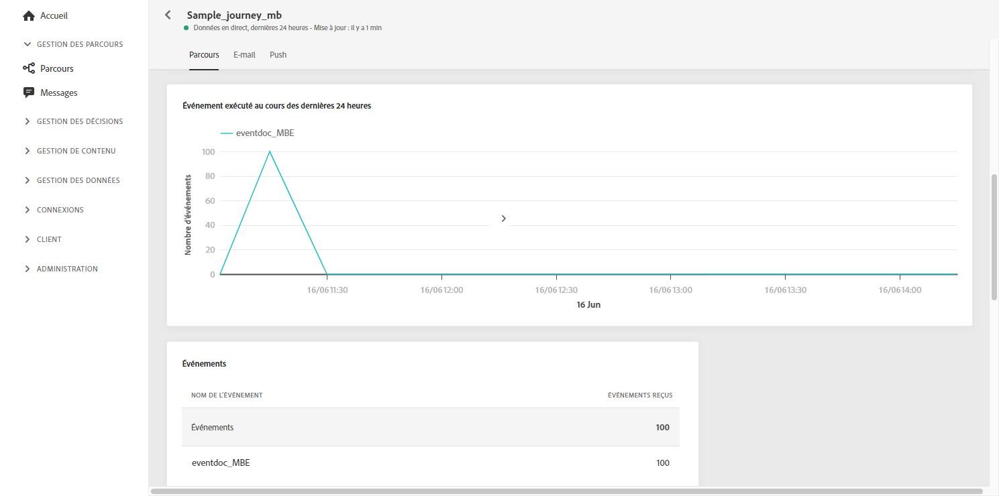
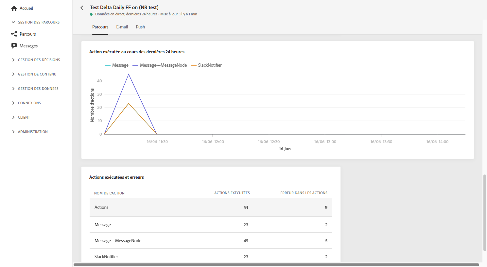
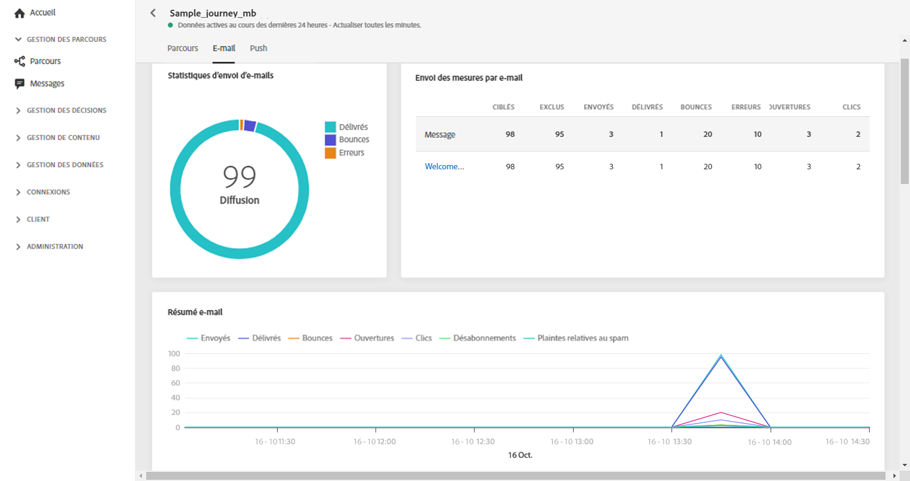
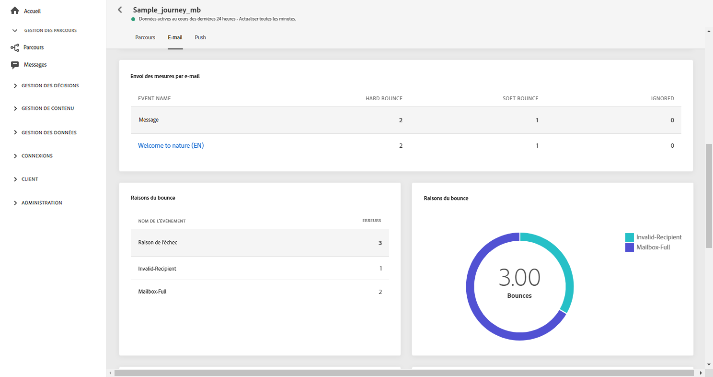
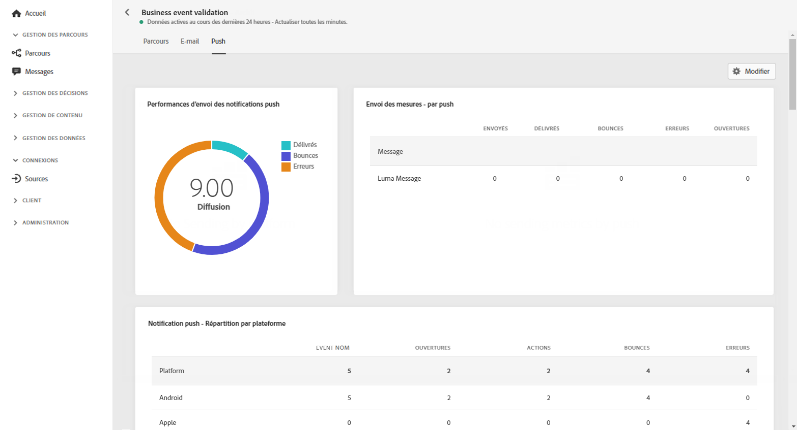
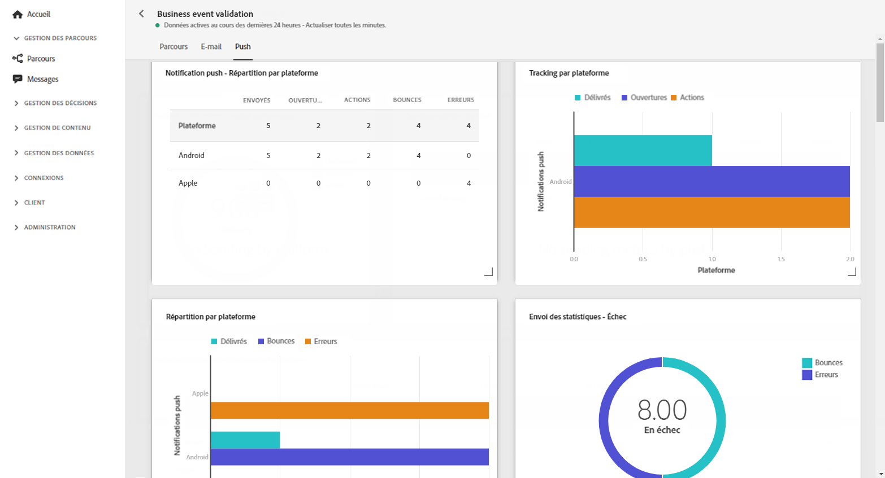

# Rapport dynamique sur les parcours {#journey-live-report}

Vous pouvez accéder directement au rapport dynamique sur les parcours depuis votre parcours en cliquant sur le bouton **[!UICONTROL Rapport dynamique]**.

La page **[!UICONTROL Rapport dynamique]** sur les parcours s’affiche avec les onglets suivants :

* [Parcours](#journey-live)
* [Email](#email-live)
* [Push](#push-live)

Le **[!UICONTROL Rapport dynamique]** sur les parcours est divisé en différents widgets présentant le succès et les erreurs de votre parcours. Chaque widget peut être redimensionné et supprimé en cas de besoin. Pour plus d’informations à ce sujet, consultez cette [section](live-report.md#modify-dashboard).

## Onglet Parcours {#journey-live}

Dans le **[!UICONTROL Rapport dynamique]** de votre parcours, l’onglet **[!UICONTROL Parcours]** vous donne une vue claire des données de suivi les plus importantes concernant votre parcours.

Les **[!UICONTROL Performances du parcours]** vous permettent de voir le cheminement détaillé de vos profils ciblés tout au long du parcours.

Le widget **[!UICONTROL Statistiques du parcours]** affiche les KPI suivants :

* **[!UICONTROL Profils entrés]** : nombre total de personnes ayant atteint l’événement d’entrée du parcours.

* **[!UICONTROL Profils sortis]** : nombre total de personnes ayant quitté le parcours.

* **[!UICONTROL Parcours individuels en échec]** : nombre total de parcours individuels n’ayant pas été exécutés avec succès.

Les widgets **[!UICONTROL Événement exécuté au cours des 24 dernières heures]**, **[!UICONTROL Événements exécutés]** et **[!UICONTROL Événements]** vous permettent de voir quel événement a été exécuté avec succès au moyen d’un chiffre récapitulatif, d’un graphique et d’un tableau.

Les widgets **[!UICONTROL Action exécutée au cours des 24 dernières heures]** et **[!UICONTROL Actions exécutées et erreurs]** représentent les actions avec le plus de succès et les erreurs qui se produites au moment où les actions ont été déclenchées. Le graphique Action, le tableau et les chiffres récapitulatifs contiennent les données disponibles pour les actions, notamment :

* **[!UICONTROL Actions exécutées avec succès]** : nombre total d’actions exécutées avec succès pour un parcours.

* **[!UICONTROL Erreurs lors de l’action]** : nombre total d’erreurs qui se sont produites pour les actions.

## Onglet Email {#email-live}

Dans le **[!UICONTROL Rapport dynamique]** de votre parcours, l’onglet **[!UICONTROL Email]** présente les principales informations relatives aux diffusions email envoyées dans votre parcours.

Pour obtenir un rapport détaillé sur une diffusion email spécifique, consultez la section [Rapport dynamique sur les emails](email-live-report.md).

Les widgets **[!UICONTROL Statistiques d’envoi]** et **[!UICONTROL Mesures d’envoi par email]** indiquent le succès de votre diffusion :

* **[!UICONTROL Délivrés]** : nombre de messages envoyés avec succès, par rapport au nombre total de messages envoyés.

* **[!UICONTROL Bounces]** : nombre total d’erreurs cumulées lors des diffusions et du traitement automatique des retours par rapport au nombre total de messages envoyés.

* **[!UICONTROL Erreurs]** : nombre total d’erreurs qui se sont produites au cours d’une diffusion, l’empêchant d’être envoyée aux profils.

<!--Hard and bounce - by Email-->

Le graphique **[!UICONTROL Résumé des emails]** présente les principales informations relatives à votre message :

* **[!UICONTROL Envoyés]** : nombre total d’envois pour la diffusion.

* **[!UICONTROL Délivrés]** : nombre de messages envoyés avec succès, par rapport au nombre total de messages envoyés.

* **[!UICONTROL Bounces]** : nombre total d’erreurs cumulées lors des diffusions et du traitement automatique des retours par rapport au nombre total de messages envoyés.

* **[!UICONTROL Erreurs]** : nombre total d’erreurs qui se sont produites au cours d’une diffusion, l’empêchant d’être envoyée aux profils.

* **[!UICONTROL Ouvertures]** : nombre d’ouvertures d’un message dans une diffusion.

* **[!UICONTROL Clics]** : nombre de clics sur un contenu dans une diffusion.

Les widgets **[!UICONTROL Causes des bounces]** et **[!UICONTROL Catégories de bounces]** contiennent les données disponibles relatives aux messages ayant fait l’objet d’un rebond, notamment :

* **[!UICONTROL Hard bounces]** : nombre total d’erreurs permanentes, telles qu’une adresse email incorrecte. Un message d’erreur indique explicitement que l’adresse n’est pas valide, comme Utilisateur inconnu.

* **[!UICONTROL Soft bounces]** : nombre total d’erreurs temporaires, telles qu’une boîte de réception pleine.

* **[!UICONTROL Ignorées]** : nombre total d’erreurs temporaires (par exemple, Absent(e) du bureau) ou techniques (par exemple, si le type d’expéditeur est administrateur).

Le graphique et le tableau **[!UICONTROL Causes des erreurs]** vous permettent de voir quelle erreur s’est produite au cours de votre diffusion.

## Onglet Push {#push-live}

Dans le **[!UICONTROL Rapport dynamique]** de votre parcours, l’onglet **[!UICONTROL Push]** présente les principales informations relatives aux diffusions push envoyées dans votre parcours.

Pour obtenir un rapport détaillé sur une diffusion push spécifique, consultez la section [Rapport dynamique sur les notifications push](push-live-report.md).

Les widgets **[!UICONTROL Performances d’envoi des notifications push]**, **[!UICONTROL Résumé des notifications push]** et **[!UICONTROL Mesures d’envoi par notification push]** présentent les informations principales relatives à votre message :

* **[!UICONTROL Envoyés]** : nombre total d’envois pour la diffusion.

* **[!UICONTROL Délivrés]** : nombre de messages envoyés avec succès, par rapport au nombre total de messages envoyés.

* **[!UICONTROL Bounces]** : nombre total d’erreurs cumulées lors des diffusions et du traitement automatique des retours par rapport au nombre total de messages envoyés.

* **[!UICONTROL Erreurs]** : nombre total d’erreurs qui se sont produites au cours d’une diffusion, l’empêchant d’être envoyée aux profils.

* **[!UICONTROL Ouvertures]** : nombre d’ouvertures d’un message dans une diffusion.

* **[!UICONTROL Actions]** : nombre total d’actions sur la notification push diffusée (par exemple, clic sur un bouton ou rejet).

* **[!UICONTROL Engagements]** : nombre total d’ouvertures et d’actions pour cette notification push, c’est-à-dire si le profil a ouvert la notification push ou s’il a cliqué sur un bouton.

Le graphique et le tableau **[!UICONTROL Causes des erreurs]** vous permettent de voir quelle erreur s’est produite au cours de votre diffusion.

Les graphiques et les tableaux **[!UICONTROL Suivi par plateforme]**, **[!UICONTROL Envoi par plateforme]** et **[!UICONTROL Répartition par plateforme]** indiquent le succès de votre notification push selon votre système opérationnel.

Le widget **[!UICONTROL Statistiques d’envoi- Échec]** vous permet de voir combien d’erreurs et de bounces se sont produits.
