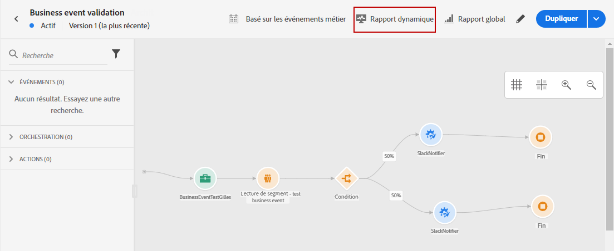
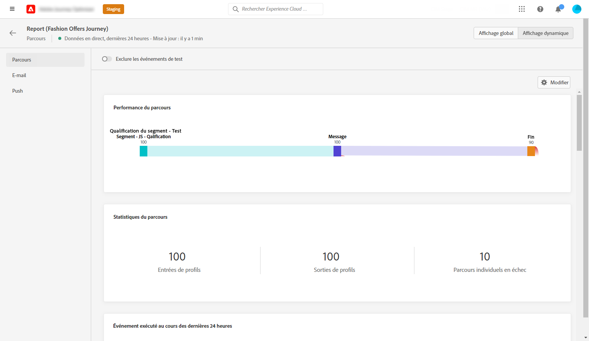
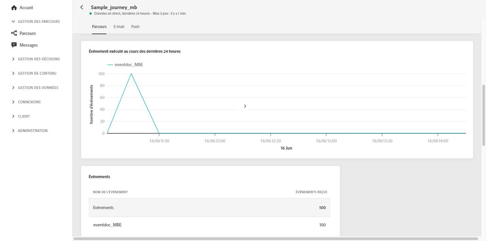
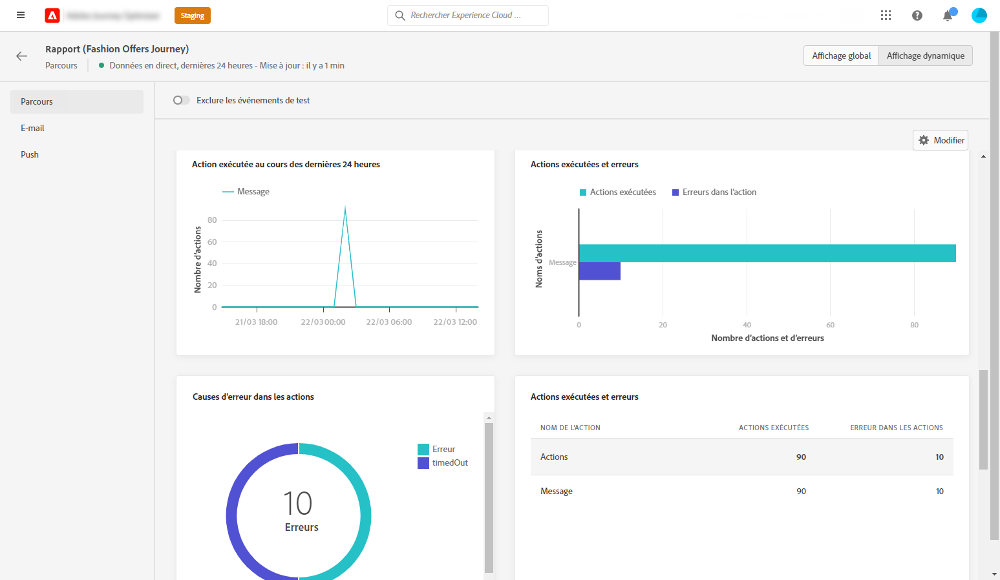
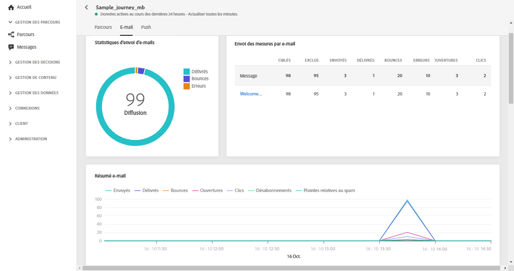
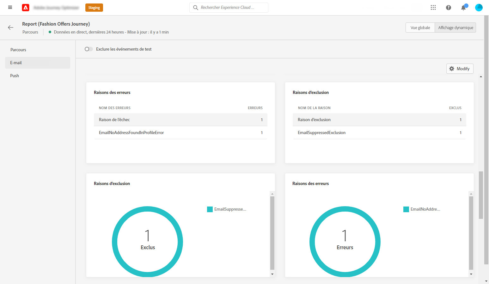
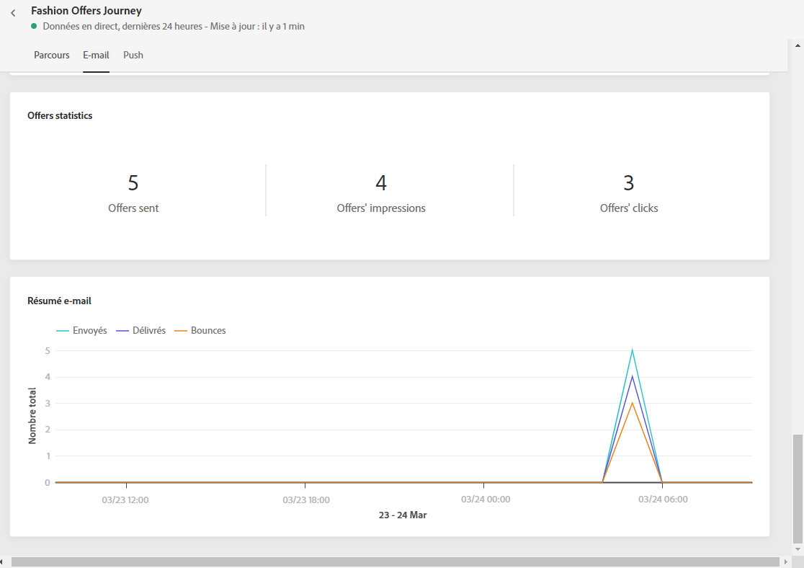
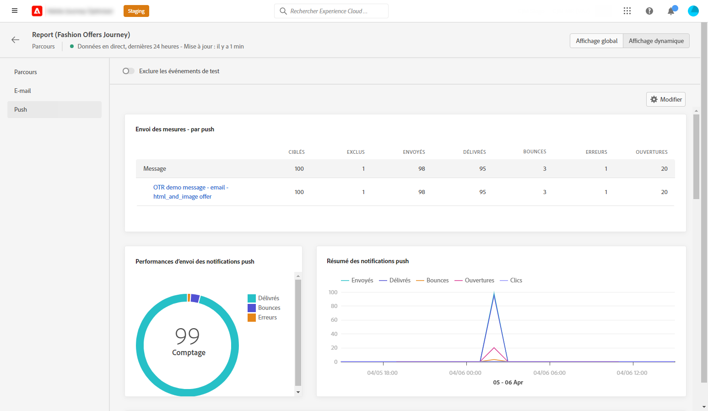
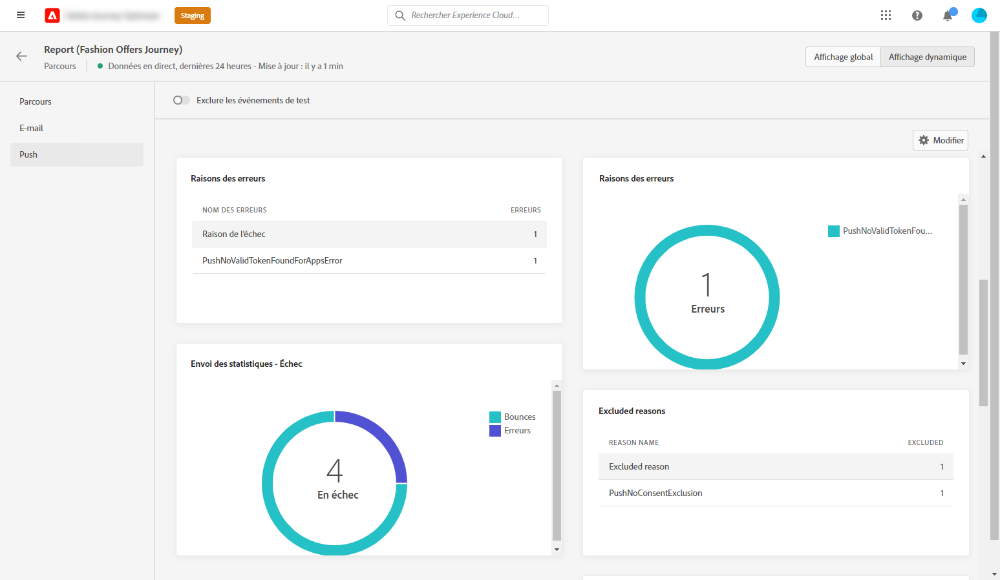
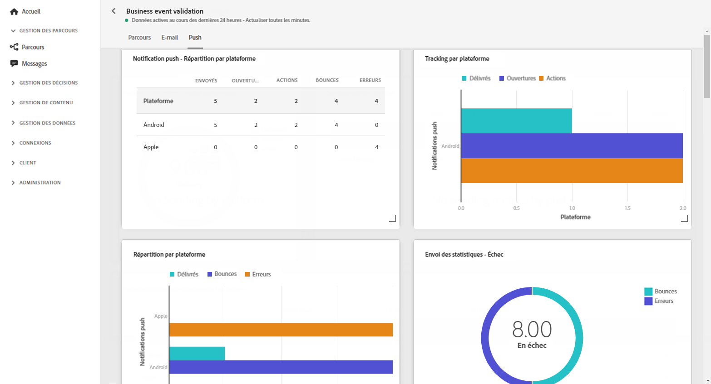

# Rapport dynamique sur les parcours {#journey-live-report}

Vous pouvez accéder directement au rapport dynamique sur les parcours depuis votre parcours en cliquant sur le bouton **[!UICONTROL Rapport dynamique]**.

La page **[!UICONTROL Rapport dynamique]** sur les parcours s’affiche avec les onglets suivants :

* [Parcours](#journey-live)
* [Email](#email-live)
* [Push](#push-live)
* [SMS](#sms-live)

Le **[!UICONTROL Rapport dynamique]** sur les parcours est divisé en différents widgets présentant le succès et les erreurs de votre parcours. Chaque widget peut être redimensionné et supprimé en cas de besoin. Pour plus d&#39;informations à ce propos, consultez cette [section](live-report.md#modify-dashboard).

## Onglet Parcours {#journey-live}

Dans le **[!UICONTROL Rapport dynamique]** de votre parcours, l&#39;onglet **[!UICONTROL Parcours]** vous donne une vue claire des données de suivi les plus importantes concernant votre parcours.

**[!UICONTROL Performances du parcours]** vous permet de voir le cheminement détaillé de vos profils ciblés tout au long du parcours.

Le widget **[!UICONTROL Statistiques du parcours]** affiche les KPI suivants :

* **[!UICONTROL Profils entrés]** : nombre total de personnes ayant atteint l&#39;événement d&#39;entrée du parcours.

* **[!UICONTROL Profils sortis]** : nombre total de personnes ayant quitté le parcours.

* **[!UICONTROL Parcours individuels en échec]** : nombre total de parcours individuels qui n’ont pas été exécutés avec succès. 

Les widgets **[!UICONTROL Événement exécuté au cours des 24 dernières heures]** et **[!UICONTROL Événements]** vous permettent de voir quel événement a été exécuté avec succès au moyen d’un chiffre récapitulatif, d’un graphique et d’un tableau. 

Les widgets **[!UICONTROL Action exécutée au cours des 24 dernières heures]** et **[!UICONTROL Actions exécutées et erreurs]** représentent l’action avec le plus de succès et les erreurs qui sont produites au moment où les actions ont été déclenchées. Le graphique Action, le tableau et les chiffres récapitulatifs contiennent les données disponibles pour les actions, notamment :

* **[!UICONTROL Actions exécutées]** : nombre total d’actions exécutées avec succès pour un parcours. 

* **[!UICONTROL Erreurs lors des actions]** : nombre total d’erreurs qui se sont produites pour les actions. 

## Onglet E-mail {#email-live}

Dans le **[!UICONTROL Rapport dynamique]** de votre parcours, l’onglet **[!UICONTROL Email]** présente les principales informations relatives aux diffusions email envoyées dans votre parcours.

Pour obtenir un rapport détaillé sur une diffusion email spécifique, consultez la section [Rapport dynamique sur les emails](email-live-report.md).

Le widget **[!UICONTROL Statistiques d&#39;envoi des e-mails]** présente les principales informations relatives à votre message :

* **[!UICONTROL Délivrés]**: Nombre de messages envoyés avec succès.

* **[!UICONTROL Rebonds]**: Nombre total d&#39;erreurs cumulées lors des diffusions et du traitement automatique des retours.

* **[!UICONTROL Erreurs]** : nombre total d&#39;erreurs survenues au cours d&#39;une diffusion, l&#39;empêchant d&#39;être envoyée à des profils.

Le tableau **[!UICONTROL Envoi de mesures par e-mail]** et le graphique **[!UICONTROL Résumé des e-mails]** détaillent le succès de votre diffusion :

* **[!UICONTROL Envoyés]** : nombre total d’envois pour la diffusion.

* **[!UICONTROL Délivrés]**: Nombre de messages envoyés avec succès.

* **[!UICONTROL Rebonds]**: Nombre total d&#39;erreurs cumulées lors des diffusions et du traitement automatique des retours.

* **[!UICONTROL Erreurs]** : nombre total d’erreurs qui se sont produites au cours d’une diffusion, l’empêchant d’être envoyée aux profils.

* **[!UICONTROL Ouvertures]** : nombre d’ouvertures d’un message dans une diffusion.

* **[!UICONTROL Clics]** : nombre de clics sur un contenu dans une diffusion.

* **[!UICONTROL Désabonnements]** : nombre de clics sur le lien de désabonnement.

* **[!UICONTROL Plaintes contre le spam]** : nombre de fois où un message a été déclaré comme spam ou courrier indésirable.

Les widgets **[!UICONTROL Causes des bounces]**, **[!UICONTROL Catégories des bounces]** et **[!UICONTROL Hard bounce et bounce - par e-mail]** contiennent les données disponibles relatives aux messages ayant fait l&#39;objet d&#39;un rebond, notamment :

* **[!UICONTROL Hard bounce]** : nombre total d&#39;erreurs permanentes, telles qu&#39;une adresse email incorrecte. Un message d&#39;erreur indique explicitement que l&#39;adresse n&#39;est pas valide, comme Utilisateur inconnu.

* **[!UICONTROL Soft bounces]** : nombre total d&#39;erreurs temporaires, telles qu&#39;une boîte de réception pleine.

* **[!UICONTROL Ignorées]** : nombre total d&#39;erreurs temporaires (par exemple, Absent(e) du bureau) ou techniques (par exemple, si le type d&#39;expéditeur est administrateur).

Les graphiques et tableaux **[!UICONTROL Raisons de l&#39;erreur]** et **[!UICONTROL Exclure des raisons]** vous permettent de voir quelles erreurs et exclusions ont eu lieu au cours de votre diffusion.

Le graphique et le tableau **[!UICONTROL E-mail - Meilleur domaine destinataire]** indiquent les domaines les plus utilisés par les destinataires pour ouvrir l&#39;e-mail.

>[!NOTE]
>
>Les widgets et mesures Offres ne sont disponibles que si une décision a été insérée dans un e-mail. Pour plus d’informations sur la gestion des décisions, consultez cette [page](../offers/get-started/starting-offer-decisioning.md).

Les widgets sur le long terme **[!UICONTROL Statistique des offres]** et **[!UICONTROL Statistiques des offres]** mesurent le succès et l’impact de votre offre sur votre audience ciblée. Il détaille les informations principales relatives à votre message avec les KPI :

* **[!UICONTROL Offre envoyée]** : nombre total d’envois pour l’offre.

* **[!UICONTROL Impression de l’offre]** : nombre d’ouvertures de l’offre dans une diffusion.

* **[!UICONTROL Clics sur les offres]** : nombre de clics sur une offre dans une diffusion.

## Onglet Push {#push-live}

Dans le **[!UICONTROL Rapport dynamique]** de votre parcours, l’onglet **[!UICONTROL Push]** présente les principales informations relatives aux diffusions push envoyées dans votre parcours.

Pour obtenir un rapport détaillé sur une diffusion push spécifique, consultez la section [Rapport dynamique sur les notifications push](push-live-report.md).

Les widgets **[!UICONTROL Performances d’envoi des notifications push]**, **[!UICONTROL Résumé des notifications push]** et **[!UICONTROL Mesures d’envoi par notification push]** présentent les informations principales relatives à votre message :

* **[!UICONTROL Envoyés]** : nombre total d’envois pour la diffusion.

* **[!UICONTROL Délivrés]**: Nombre de messages envoyés avec succès.

* **[!UICONTROL Rebonds]**: Nombre total d&#39;erreurs cumulées lors des diffusions et du traitement automatique des retours.

* **[!UICONTROL Erreurs]** : nombre total d’erreurs qui se sont produites au cours d’une diffusion, l’empêchant d’être envoyée aux profils.

* **[!UICONTROL Ouvertures]** : nombre d’ouvertures d’un message dans une diffusion.

* **[!UICONTROL Actions]** : nombre total d’actions sur la notification push diffusée (par exemple, clic sur un bouton ou rejet).

* **[!UICONTROL Engagements]** : nombre total d&#39;ouvertures et d&#39;actions pour cette notification push, c&#39;est-à-dire si le profil a ouvert la notification ou si un utilisateur a cliqué sur un bouton.

Les graphiques et tableaux **[!UICONTROL Raisons de l&#39;erreur]** et **[!UICONTROL Exclure des raisons]** vous permettent de voir quelles erreurs et exclusions ont eu lieu au cours de votre diffusion.

Le widget **[!UICONTROL Statistiques d’envoi - Échec]** vous permet de voir combien d’erreurs et de bounces se sont produits.

Les graphiques et tableaux **[!UICONTROL Suivi par plateforme]**, **[!UICONTROL Envoi par plateforme]** et **[!UICONTROL Ventilation par plateforme]** décrivent le succès de votre notification push en fonction du système opérationnel.

## Onglet SMS {#sms-live}

Le **[!UICONTROL SMS - Statistiques d&#39;envoi]** le tableau détaille le succès de votre diffusion :

* **[!UICONTROL Ciblés]** : nombre de profils utilisateur qui sont qualifiés en tant que profils cibles pour cette diffusion.

* **[!UICONTROL Exclus]** : nombre de profils utilisateur, exclus des profils ciblés, qui n’ont pas reçu le message.

* **[!UICONTROL Envoyés]** : nombre total d’envois pour la diffusion.

* **[!UICONTROL Délivrés]**: Nombre de messages envoyés avec succès.

* **[!UICONTROL Ouvertures]** : nombre d’ouvertures d’un message dans une diffusion.

* **[!UICONTROL Clics]** : nombre de clics sur un contenu dans une diffusion.

* **[!UICONTROL Rebonds]**: Nombre total d&#39;erreurs cumulées lors des diffusions et du traitement automatique des retours.

* **[!UICONTROL Erreurs]** : nombre total d&#39;erreurs survenues au cours d&#39;une diffusion, l&#39;empêchant d&#39;être envoyée à des profils.

Le **[!UICONTROL Résumé des SMS]** graph détaille le succès de votre diffusion :

* **[!UICONTROL Délivrés]**: Nombre de messages envoyés avec succès.

* **[!UICONTROL Rebonds]**: Nombre total d&#39;erreurs cumulées lors des diffusions et du traitement automatique des retours.

* **[!UICONTROL Erreurs]** : nombre total d&#39;erreurs survenues au cours d&#39;une diffusion, l&#39;empêchant d&#39;être envoyée à des profils.

Le **[!UICONTROL Exclure les raisons]** les graphiques et les tableaux vous permettent de voir quelles erreurs et exclusions ont eu lieu au cours de votre diffusion.
