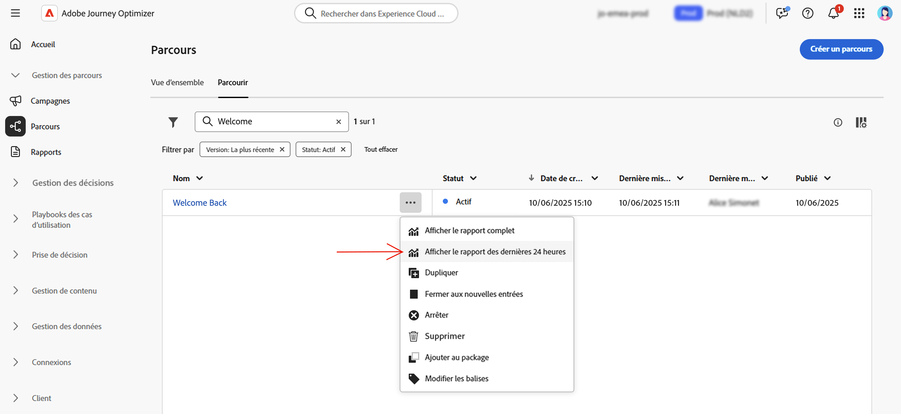

# Rapport dynamique sur les parcours {#journey-live-report}

>[!CONTEXTUALHELP]
>id="ajo_journey_live_report"
>title="Rapport dynamique sur les parcours"
>abstract="Le rapport dynamique sur les parcours vous permet de mesurer et de visualiser en temps réel l’efficacité et les performances de vos parcours (limité aux dernières 24 heures). Celui-ci est composé de plusieurs widgets présentant le succès et les erreurs de votre parcours. Vous pouvez modifier chaque tableau de bord de reporting en redimensionnant ou en supprimant des widgets."

Les rapports dynamiques, accessibles à partir de l’onglet Dernières 24 heures, affichent les événements qui se sont produits au cours des dernières 24 heures, avec un intervalle de temps minimal de deux minutes à compter de l’occurrence de l’événement. En comparaison, les rapports globaux portent sur les événements qui se sont produits il y a au moins deux heures et couvrent les événements sur une période sélectionnée.

Vous pouvez accéder directement au rapport dynamique sur les parcours depuis votre parcours en cliquant sur le bouton **[!UICONTROL Afficher le rapport]**.

La page **[!UICONTROL Rapport dynamique]** sur les parcours s’affiche avec les onglets suivants :

* [Parcours](#journey-live)
* [E-mail](#email-live)
* [Notification push](#push-live)
* [SMS](#sms-live)
* [In-app](#in-app-live)

Le **[!UICONTROL Rapport dynamique]** sur les parcours est divisé en différents widgets présentant le succès et les erreurs de votre parcours. Chaque widget peut être redimensionné et supprimé si nécessaire. Pour plus d&#39;informations à ce propos, consultez cette [section](live-report.md#modify-dashboard).

Pour obtenir la liste détaillée de chaque mesure disponible dans Adobe Journey Optimizer, reportez-vous à [cette page](live-report.md#list-of-components-live).

## Onglet Parcours {#journey-live}

Dans le **[!UICONTROL Rapport dynamique]** de votre parcours, l&#39;onglet **[!UICONTROL Parcours]** vous donne une vue claire des données de suivi les plus importantes concernant votre parcours.

### performance du parcours {#journey-performance}

**[!UICONTROL Performances du parcours]** vous permet de voir le cheminement détaillé de vos profils ciblés tout au long du parcours.

### Statistiques du parcours {#journey-statistics}

La variable **[!UICONTROL Statistiques parcours]** Les indicateurs de performance clés (IPC) fonctionnent comme un tableau de bord global qui fournit une analyse des mesures essentielles associées à votre parcours au cours des dernières 24 heures. Cela inclut des détails tels que le nombre de profils entrés et les instances de parcours individuels ayant échoué, ce qui vous permet d’avoir un aperçu complet de l’efficacité et du niveau d’engagement de votre parcours.

+++ En savoir plus sur les mesures de statistiques de Parcours

* **[!UICONTROL Profils entrés]** : nombre total de personnes ayant atteint l&#39;événement d&#39;entrée du parcours.

* **[!UICONTROL Profils sortis]** : nombre total de personnes ayant quitté le parcours.

* **[!UICONTROL Parcours individuels en échec]** : nombre total de parcours individuels qui n’ont pas été exécutés avec succès.
+++

### Action exécutée au cours des dernières 24 heures {#action-executed}

La variable **[!UICONTROL Action exécutée au cours des dernières 24 heures]** représente l’action la plus réussie qui s’est produite lorsque vos actions ont été déclenchées.

+++ En savoir plus sur les actions exécutées au cours des dernières 24 heures

* **[!UICONTROL Actions exécutées]** : nombre total d’actions exécutées avec succès pour un parcours.

* **[!UICONTROL Erreurs lors des actions]** : nombre total d’erreurs qui se sont produites pour les actions.

+++

### Actions exécutées et erreurs {#actions-errors}

La variable **[!UICONTROL Actions exécutées et erreurs]** widget représente l’action et les erreurs les plus réussies qui se sont produites lorsque vos actions ont été déclenchées.

+++ En savoir plus sur les actions exécutées et les mesures d’erreurs

* **[!UICONTROL Actions exécutées]** : nombre total d’actions exécutées avec succès pour un parcours.

* **[!UICONTROL Erreurs lors des actions]** : nombre total d’erreurs qui se sont produites pour les actions.

+++

### Raisons de l’erreur des actions {#actions-error-reasons}

La variable **[!UICONTROL Raisons des erreurs d’action]** tableau et graphique offrent un aperçu complet des erreurs qui se sont produites pendant l’exécution de vos actions au cours des dernières 24 heures.

### Type d’erreur par actions {#error-type-actions}

La variable **[!UICONTROL Type d’erreur par actions]** tableau et graphique offrent un aperçu complet des erreurs qui se sont produites pour chaque exécution de vos actions au cours des dernières 24 heures.

### Événement exécuté au cours des dernières 24 heures {#event-executed-24hours}

La variable **[!UICONTROL Événement exécuté au cours des dernières 24 heures]** vous permet d’identifier les événements qui ont été exécutés avec succès au cours des dernières 24 heures.

### Événements {#events}

La variable **[!UICONTROL Événements]** widget vous permet de voir quel de vos événements a été exécuté avec succès par le biais d’un numéro de résumé, d’un graphique et d’un tableau.

### Événements par origine {#events-origin}

La variable **[!UICONTROL Événements par origine]** les tableaux et les graphiques fournissent une perspective détaillée de la réception réussie de vos événements au cours des dernières 24 heures. Grâce à ces représentations visuelles, vous pouvez déterminer précisément lequel de vos événements a été reçu efficacement, ce qui vous permet de mieux comprendre les performances et l’impact de vos événements individuels dans votre parcours.

## Onglet E-mail {#email-live}

De votre parcours **[!UICONTROL Rapport en direct]**, la variable **[!UICONTROL Email]** Cet onglet présente les informations principales relatives aux emails envoyés dans votre parcours.

### Performances d’envoi de courriers électroniques {#email-sending-performance}

La variable **[!UICONTROL Email - Envoi des performances]** Le graphique fournit une vue complète des données liées aux emails envoyés dans votre parcours, offrant des informations sur les mesures clés, telles que les envois et les bounces, qui se sont produits au cours des dernières 24 heures. Cela permet une analyse détaillée du processus d’envoi des emails, fournissant des informations précieuses sur l’efficacité et les performances de vos parcours.

+++ En savoir plus sur les e-mails - Envoi de mesures de performances

* **[!UICONTROL Délivrés]**: nombre d’emails envoyés avec succès.

* **[!UICONTROL Rebonds]** : nombre total des erreurs comptabilisées lors de la procédure d’envoi et du traitement automatique des retours.

* **[!UICONTROL Erreurs]** : nombre total d’erreurs survenues au cours de la procédure d’envoi, empêchant le message d’être envoyé à des profils.

* **[!UICONTROL Reprises]** : nombre d’e-mails dans la file d’attente pour les reprises.

+++

### E-mail - Statistiques {#email-stat}

La variable **[!UICONTROL Email - Statistics]** le tableau fournit un résumé complet des données essentielles relatives aux emails de vos parcours au cours des dernières 24 heures. Il détaille les mesures clés, telles que la taille de l’audience ciblée et le nombre d’emails envoyés avec succès, ce qui vous permet d’obtenir des informations précieuses sur l’efficacité et la portée de vos emails et parcours.

+++ En savoir plus sur les mesures Statistiques d’envoi d’emails

* **[!UICONTROL Ciblés]** : nombre total de messages traités lors de la procédure d’envoi.

* **[!UICONTROL Exclus]** : nombre de profils qui ont été exclus par Adobe Journey Optimizer.

* **[!UICONTROL Envoyé]**: nombre total d&#39;emails envoyés.

* **[!UICONTROL Diffusés]** : nombre d’e-mails envoyés avec succès, par rapport au nombre total de messages envoyés.

* **[!UICONTROL Rebonds]** : nombre total d’erreurs cumulées lors de la procédure d’envoi et du traitement automatique des retours par rapport au nombre total de messages envoyés.

* **[!UICONTROL Erreurs]** : nombre total d’erreurs survenues au cours de la procédure d’envoi, empêchant le message d’être envoyé à des profils.

* **[!UICONTROL Ouvertures]**: nombre d’ouvertures de vos emails.

* **[!UICONTROL Clics]**: nombre de clics sur un contenu dans vos emails.

* **[!UICONTROL Désabonnements]** : nombre de clics sur le lien de désabonnement.

* **[!UICONTROL Plaintes contre le spal]** : nombre de fois où un message a été déclaré comme spam ou courrier indésirable.

* **[!UICONTROL Reprises]** : nombre d’e-mails dans la file d’attente pour les reprises.

+++

### E-mail - Performances par date {#email-perf-date}

La variable **[!UICONTROL Email - Performance par date]** widget offre un aperçu détaillé des informations clés relatives à vos emails, présenté sous la forme d’un graphique, fournissant des informations sur les tendances de performances au cours des dernières 24 heures.

+++ En savoir plus sur les e-mails - Performances par date

* **[!UICONTROL Envoyé]**: nombre total d&#39;emails envoyés.

* **[!UICONTROL Délivrés]**: nombre d’emails envoyés avec succès.

* **[!UICONTROL Rebonds]** : nombre total des erreurs comptabilisées lors de la procédure d’envoi et du traitement automatique des retours.

* **[!UICONTROL Erreurs]**: nombre total d&#39;erreurs qui se sont produites pendant le processus d&#39;envoi et qui l&#39;ont empêché d&#39;être envoyé aux profils.

* **[!UICONTROL Ouvertures]**: nombre d’ouvertures de vos emails.

* **[!UICONTROL Clics]**: nombre de clics sur un contenu dans vos emails.

* **[!UICONTROL Désabonnements]** : nombre de clics sur le lien de désabonnement.

* **[!UICONTROL Plaintes contre le spal]** : nombre de fois où un message a été déclaré comme spam ou courrier indésirable.

+++

### Email - Catégories et motifs de rebond {#email-bounce-categories}

La variable **[!UICONTROL Motifs de rebond]** et **[!UICONTROL Catégories rebonds]** Les widgets compilent les données disponibles relatives aux messages rebonds, en fournissant des informations détaillées sur les raisons et les catégories spécifiques derrière les rebonds aux emails au cours des dernières 24 heures.

Pour plus d’informations sur les rebonds, consultez la page [Liste de suppression](../reports/suppression-list.md).

+++ En savoir plus sur les mesures Email - Catégories de rebond et Raisons

* **[!UICONTROL Rebond définitif]** : nombre total d’erreurs permanentes, telles qu’une adresse e-mail incorrecte. Un message d&#39;erreur indique explicitement que l&#39;adresse n&#39;est pas valide, comme Utilisateur inconnu.

* **[!UICONTROL Rebond temporaire]** : nombre total d’erreurs temporaires, telles qu’une boîte de réception pleine.

* **[!UICONTROL Ignorées]** : nombre total d&#39;erreurs temporaires (par exemple, Absent(e) du bureau) ou techniques (par exemple, si le type d&#39;expéditeur est administrateur).

+++

### E-mail - Causes d’erreur {#email-error-reasons}

La variable **[!UICONTROL Raisons de l’erreur]** les graphiques et les tableaux offrent une visibilité sur les erreurs spécifiques survenues pendant le processus d’envoi des dernières 24 heures, fournissant des informations précieuses sur la nature et l’occurrence des erreurs.

### E-mail - Causes d’exclusion {#email-excluded}

La variable **[!UICONTROL Motifs exclus]** les graphiques et les tableaux présentent une vue d’ensemble complète des différents facteurs qui ont abouti à l’exclusion des profils utilisateur de l’audience ciblée, ce qui a pour effet que le message n’a pas été reçu au cours des dernières 24 heures.

Voir [cette page](exclusion-list.md) pour la liste complète des motifs d&#39;exclusion.

### E-mail - Meilleur domaine de destinataire {#email-best-recipient}

La variable **[!UICONTROL Email - Meilleur domaine de destinataire]** le graphique et le tableau présentent une ventilation détaillée des domaines que les profils utilisent le plus souvent pour ouvrir vos emails au cours des dernières 24 heures. Vous obtenez ainsi des informations précieuses sur le comportement des profils, ce qui vous permet de comprendre les plateformes préférées.

### Email- Offres {#email-offers}

>[!NOTE]
>
>Les widgets et mesures Offres ne sont disponibles que si une décision a été insérée dans un e-mail. Pour plus d’informations sur la gestion des décisions, consultez cette [page](../offers/get-started/starting-offer-decisioning.md).

La variable **[!UICONTROL Statistiques des offres]** et **[!UICONTROL Statistiques des offres au fil du temps]** Les widgets mesurent le succès et l’impact de votre offre sur votre audience ciblée. Il détaille les informations principales relatives à votre message avec les KPI.

+++ En savoir plus sur les mesures Email - Offres

* **[!UICONTROL Offre envoyée]** : nombre total d’envois pour l’offre.

* **[!UICONTROL Impression de l&#39;offre]**: nombre de fois où l’offre a été ouverte dans vos courriers électroniques.

* **[!UICONTROL Clics sur les offres]**: nombre de clics sur une offre dans vos emails.

+++

## Onglet Notification push {#push-live}

De votre parcours **[!UICONTROL Rapport en direct]**, la variable **[!UICONTROL Notification push]** Cet onglet présente les informations principales relatives à la notification push envoyée dans votre parcours.

### Notification push - Statistiques {#push-statistics}

**[!UICONTROL Notification push - Statistiques]** Le tableau fournit un résumé concis des données essentielles liées à vos notifications push, y compris des mesures clés telles que le nombre de messages ciblés et le nombre de messages délivrés avec succès au cours des dernières 24 heures.

+++ En savoir plus sur les notifications push - Mesures de statistiques

* **[!UICONTROL Ciblés]** : nombre de profils ciblés pour toute action telle que l’envoi d’e-mails ou de SMS.

* **[!UICONTROL Exclus]** : nombre de profils qui ont été exclus par Adobe Journey Optimizer.

* **[!UICONTROL Envoyé]**: nombre total de notifications push envoyées.

* **[!UICONTROL Délivrés]**: nombre de notifications push envoyées avec succès.

* **[!UICONTROL Rebonds]** : nombre total des erreurs comptabilisées lors de la procédure d’envoi et du traitement automatique des retours.

* **[!UICONTROL Erreurs]** : nombre total d’erreurs survenues au cours de la procédure d’envoi, empêchant le message d’être envoyé à des profils.

* **[!UICONTROL Ouvertures]** : nombre de fois que votre notification push a été ouverte.
+++

### Notification push - Répartition par plateforme {#push-breakdown}

La variable **[!UICONTROL Notification push - Répartition par plateforme]** Le graphique et le tableau fournissent une analyse détaillée du succès de vos notifications push, offrant des informations basées sur le système d’exploitation de votre profil. Cette ventilation vous permet de mieux comprendre les performances de vos notifications push sur différentes plateformes.

### Notification push - Synthèse des envois {#push-sending-summary}

La variable **[!UICONTROL Synthèse des notifications push]** le graphique offre une représentation dynamique, affichant une analyse de votre activité de notifications push au cours des dernières 24 heures. Cette représentation graphique fournit une ventilation complète des notifications push envoyées.

+++ En savoir plus sur les notifications push - Envoi de mesures récapitulatives

* **[!UICONTROL Envoyé]**: nombre total de notifications push envoyées.

* **[!UICONTROL Délivrés]**: nombre de notifications push envoyées avec succès.

* **[!UICONTROL Rebonds]** : nombre total des erreurs comptabilisées lors de la procédure d’envoi et du traitement automatique des retours.

* **[!UICONTROL Erreurs]** : nombre total d’erreurs survenues au cours de la procédure d’envoi, empêchant le message d’être envoyé à des profils.

* **[!UICONTROL Ouvertures]**: nombre d’ouvertures de vos notifications push.

* **[!UICONTROL Clics]**: nombre de clics sur un contenu dans vos notifications push.

+++

### Notification push - Causes d’erreur {#push-error}

La variable **[!UICONTROL Raisons de l’erreur]** Les tableaux et les graphiques vous permettent d’identifier les erreurs spécifiques qui se sont produites au cours du processus d’envoi de vos notifications push, en fournissant des informations détaillées sur les problèmes rencontrés au cours des dernières 24 heures.

### Notification push - Causes d’exclusion {#push-excluded}

La variable **[!UICONTROL Motifs exclus]** les graphiques et les tableaux affichent les différentes raisons qui ont empêché les profils utilisateur, exclus des profils ciblés, de recevoir vos notifications push au cours des dernières 24 heures.

Voir [cette page](exclusion-list.md) pour la liste complète des motifs d&#39;exclusion.

## Onglet SMS {#sms-live}

### SMS - Statistiques {#sms-statistics}

La variable **[!UICONTROL SMS - Statistiques]** Le tableau fournit un résumé concis des données essentielles liées à vos messages SMS, y compris les mesures clés telles que le nombre de messages ciblés et le nombre de messages délivrés avec succès depuis les dernières 24 heures.

+++ En savoir plus sur les SMS - Mesures de statistiques

* **[!UICONTROL Ciblés]** : nombre de profils de personnes qui sont qualifiés en tant que profils cibles.

* **[!UICONTROL Exclus]** : nombre de profils utilisateurs, exclus des profils ciblés, qui n’ont pas reçu le message.

* **[!UICONTROL Envoyé]**: nombre total de SMS envoyés.

* **[!UICONTROL Ouvertures]**: nombre d’ouvertures de vos SMS.

* **[!UICONTROL Clics]**: nombre de clics sur un contenu dans vos SMS.

* **[!UICONTROL Rebonds]**: Nombre total d&#39;erreurs cumulées lors du processus d&#39;envoi, du processus d&#39;envoi et du traitement automatique des retours.

* **[!UICONTROL Erreurs]** : nombre total d’erreurs survenues au cours de la procédure d’envoi, empêchant le message d’être envoyé à des profils.

+++

### SMS - Performances par date {#sms-performance}

La variable **[!UICONTROL SMS : performance par date]** widget offre un aperçu détaillé des informations clés relatives à vos messages, présenté sous la forme d’un graphique, fournissant des informations sur les tendances de performances au cours des dernières 24 heures.

+++ En savoir plus sur les SMS - Performances par date

* **[!UICONTROL Envoyé]**: nombre total de SMS envoyés.

* **[!UICONTROL Rebonds]** : nombre total des erreurs comptabilisées lors de la procédure d’envoi et du traitement automatique des retours.

* **[!UICONTROL Erreurs]** : nombre total d’erreurs survenues au cours de la procédure d’envoi, empêchant le message d’être envoyé à des profils.

+++

### SMS - Causes de rebonds {#sms-bounces}

La variable **[!UICONTROL SMS - Raisons des rebonds]** Les graphiques et les tableaux fournissent un aperçu complet des données relatives aux messages SMS rebonds, fournissant des informations précieuses sur les raisons spécifiques aux instances de rebonds de messages SMS au cours des dernières 24 heures.

### SMS - Causes d’erreur {#sms-error}

La variable **[!UICONTROL SMS - Raisons de l’erreur]** les graphiques et les tableaux permettent d&#39;identifier les erreurs spécifiques qui se sont produites pendant le processus d&#39;envoi de vos SMS, ce qui facilite l&#39;analyse approfondie de tout problème rencontré au cours des dernières 24 heures.

### SMS - Causes d’exclusion {#sms-excluded}

La variable **[!UICONTROL SMS - Motifs exclus]** les graphiques et les tableaux décrivent visuellement les différents facteurs qui ont conduit à l’exclusion des profils d’utilisateur de l’audience ciblée, ce qui les empêche de recevoir vos SMS.

Voir [cette page](exclusion-list.md) pour la liste complète des motifs d&#39;exclusion.

### SMS - Clics par liens {#sms-clicks}

La variable **[!UICONTROL SMS : clics par liens]** widget offre des informations essentielles sur l’engagement de vos visiteurs avec les URL incluses dans vos messages, en fournissant des informations précieuses sur les liens qui attirent le plus d’interactions au cours des dernières 24 heures.

## Onglet In-app {#in-app-live}

### Performances in-app {#inapp-performance}

La variable **[!UICONTROL Performances in-app]** Les indicateurs de performance clés fournissent des informations essentielles sur l’engagement de vos profils avec les messages In-App au cours des dernières 24 heures, fournissant des mesures essentielles pour évaluer l’efficacité et l’impact des messages In-App inclus dans votre parcours.

+++ En savoir plus sur les mesures de performances dans l’application

* **[!UICONTROL Impressions]** : nombre total de messages in-app diffusés à tous les utilisateurs et utilisatrices.

  >[!NOTE]
  >
  >Pour s’assurer qu’une impression est comptabilisée, la personne doit répondre à deux critères :
  >* Qualification au sein de l’expérience in-app, obtenue en atteignant l’activité in-app spécifique dans son parcours.
  >* Respect des conditions spécifiées dans les règles de déclenchement.
  > 
  >En raison du deuxième critère, il peut y avoir des variations notables entre le nombre de profils ciblés et le nombre d’impressions uniques.

* **[!UICONTROL Interactions]** : nombre total d’engagements en lien avec votre message in-app. Cela inclut toutes les actions entreprises par les personnes, telles que les clics, les rejets ou toute autre interaction.

+++

### Résumé in-app {#inapp-summary}

La variable **[!UICONTROL Résumé in-app]** Le graphique illustre la progression de vos impressions et interactions in-app au cours des dernières 24 heures, fournissant un aperçu complet des performances de vos messages in-app.

+++ En savoir plus sur les mesures de résumé in-app

* **[!UICONTROL Impressions]** : nombre total de messages in-app diffusés à tous les utilisateurs et utilisatrices.

  >[!NOTE]
  >
  >Pour s’assurer qu’une impression est comptabilisée, la personne doit répondre à deux critères :
  >* Qualification au sein de l’expérience in-app, obtenue en atteignant l’activité in-app spécifique dans son parcours.
  >* Respect des conditions spécifiées dans les règles de déclenchement.
  > 
  >En raison du deuxième critère, il peut y avoir des variations notables entre le nombre de profils ciblés et le nombre d’impressions uniques.

* **[!UICONTROL Interactions]** : nombre total d’engagements en lien avec votre message in-app. Cela inclut toutes les actions entreprises par les personnes, telles que les clics, les rejets ou toute autre interaction.

+++

### Interactions par type {#interactions-type}

La variable **[!UICONTROL Interactions par type]** les graphiques et les tableaux détaillent la manière dont les utilisateurs ont interagi avec votre message in-app en suivant les clics, les rejets ou les interactions.
