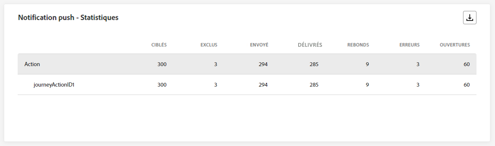

# Rapport dynamique sur les parcours {#journey-live-report}

>[!CONTEXTUALHELP]
>id="ajo_journey_live_report"
>title="Rapport dynamique sur les parcours"
>abstract="Le rapport dynamique sur les parcours vous permet de mesurer et de visualiser en temps réel l’efficacité et les performances de vos parcours (limité aux dernières 24 heures). Celui-ci est composé de plusieurs widgets présentant le succès et les erreurs de votre parcours. Vous pouvez modifier chaque tableau de bord de reporting en redimensionnant ou en supprimant des widgets."

Les rapports dynamiques, accessibles à partir de l’onglet Dernières 24 heures, affichent les événements qui se sont produits au cours des dernières 24 heures, avec un intervalle de temps minimal de deux minutes à compter de l’occurrence de l’événement. En comparaison, les rapports Customer Journey Analytics portent sur les événements qui se sont produits il y a au moins deux heures et couvrent les événements sur une période sélectionnée.

Accédez au rapport de parcours actif à partir du menu [!UICONTROL Parcours] en ouvrant le menu [!UICONTROL Autres actions] de votre parcours et en sélectionnant [!UICONTROL Afficher le rapport des dernières 24 heures].

La page **[!UICONTROL Rapport dynamique]** sur les parcours s’affiche avec les onglets suivants :

* [Parcours](#journey-live)
* [E-mail](#email-live)
* [Notification push](#push-live)
* [SMS](#sms-live)
* [In-app](#in-app-live)

Le **[!UICONTROL Rapport dynamique]** sur les parcours est divisé en différents widgets présentant le succès et les erreurs de votre parcours. Chaque widget peut être redimensionné et supprimé si nécessaire. Pour plus d&#39;informations à ce propos, consultez cette [section](live-report.md#modify-dashboard).

Pour obtenir la liste détaillée de chaque mesure disponible dans Adobe Journey Optimizer, reportez-vous à [cette page](live-report.md#live-report).

## Onglet Parcours {#journey-live}

Dans le **[!UICONTROL Rapport dynamique]** de votre parcours, l&#39;onglet **[!UICONTROL Parcours]** vous donne une vue claire des données de suivi les plus importantes concernant votre parcours.

### Performances du parcours {#journey-performance}

>[!CONTEXTUALHELP]
>id="ajo_journey_performance_live"
>title="Performances du parcours"
>abstract="Le widget Performances du parcours vous permet de retracer visuellement la trajectoire de vos profils ciblés progressant dans votre parcours au cours des dernières 24 heures."

Les **[!UICONTROL Performances du parcours]** vous permettent de voir le cheminement détaillé de vos profils ciblés tout au long du parcours.

Notez que le nombre de profils d’un nœud n’est mis à jour qu’une fois que le profil termine le nœud, et non lorsqu’il y entre. Par exemple, un profil dans un nœud **Attente** n’est comptabilisé qu’une fois que la date spécifiée est atteinte et que le profil a quitté le nœud.

### Statistiques du parcours {#journey-statistics}

>[!CONTEXTUALHELP]
>id="ajo_journey_statistics_live"
>title="Statistiques du parcours"
>abstract="Les Indicateurs de performances clés (KPI) des statistiques sur les parcours constituent un tableau de bord complet qui fournit une analyse approfondie des mesures essentielles relatives à votre parcours au cours des dernières 24 heures."

Les indicateurs clés de performance (KPI) **[!UICONTROL Statistiques du parcours]** fonctionnent à la manière d’un tableau de bord global qui fournit une analyse des mesures essentielles associées à votre parcours au cours des dernières 24 heures. Cela inclut des détails tels que le nombre de profils entrés et les instances de parcours individuels ayant échoué, ce qui vous permet d’avoir un aperçu complet de l’efficacité et du niveau d’engagement de votre parcours.

+++ En savoir plus sur les mesures des statistiques du parcours

* **[!UICONTROL Profils entrés]** : nombre total de personnes ayant atteint l&#39;événement d&#39;entrée du parcours.

* **[!UICONTROL Profils sortis]** : nombre total de personnes ayant quitté le parcours.

* **[!UICONTROL Parcours individuels en échec]** : nombre total de parcours individuels qui n’ont pas été exécutés avec succès.
+++

### Action exécutée au cours des dernières 24 heures {#action-executed}

>[!CONTEXTUALHELP]
>id="ajo_journey_actions_executed_live"
>title="Action exécutée au cours des dernières 24 heures"
>abstract="Le widget Action exécutée au cours des dernières 24 heures fournit un instantané des performances récentes et affiche l’efficacité de vos actions exécutées au cours des dernières 24 heures."

Le widget **[!UICONTROL Action exécutée au cours des dernières 24 heures]** représente l’action ayant rencontré le plus de succès au moment où vos actions ont été déclenchées.

+++ En savoir plus sur la mesure Action exécutée au cours des dernières 24 heures

* **[!UICONTROL Actions exécutées]** : nombre total d’actions exécutées avec succès pour un parcours.

* **[!UICONTROL Erreurs lors des actions]** : nombre total d’erreurs qui se sont produites pour les actions.

+++

### Actions exécutées et erreurs {#actions-errors}

>[!CONTEXTUALHELP]
>id="ajo_journey_actions_executed__errors_live"
>title="Actions exécutées et erreurs"
>abstract="Le widget Actions exécutées et erreurs affiche les actions dont le taux de réussite est le plus élevé et les erreurs qui se sont produites pendant le déclenchement des actions au cours des dernières 24 heures. Ce widget offre un aperçu complet des exécutions réussies et des erreurs rencontrées, fournissant des informations précieuses sur les performances récentes de vos actions."

Le widget **[!UICONTROL Actions exécutées et erreurs]** affiche l’action au taux de réussite le plus élevé et les erreurs qui se sont produites lorsque vos actions ont été déclenchées au cours des dernières 24 heures.

+++ En savoir plus sur la mesure Actions exécutées et erreurs

* **[!UICONTROL Actions exécutées]** : nombre total d’actions exécutées avec succès pour un parcours.

* **[!UICONTROL Erreurs lors des actions]** : nombre total d’erreurs qui se sont produites pour les actions.

+++

### Causes des erreurs dans les actions {#actions-error-reasons}

>[!CONTEXTUALHELP]
>id="ajo_journey_actions_errors_live"
>title="Causes des erreurs dans les actions"
>abstract="Le tableau et le graphe Causes des erreurs dans les actions fournissent un résumé exhaustif des erreurs survenues pendant l’exécution de vos actions, offrant un aperçu complet des problèmes qui peuvent s’être produits au cours des dernières 24 heures."

Le tableau et le graphe **[!UICONTROL Causes des erreurs danns les actions]** offrent une vue d’ensemble complète des erreurs qui se sont produites pendant l’exécution de vos actions au cours des dernières 24 heures.

### Type d’erreur par action {#error-type-actions}

>[!CONTEXTUALHELP]
>id="ajo_journey_actions_error_type_live"
>title="Type d’erreur par action"
>abstract="Le tableau et le graphe Type d’erreur par action offrent une vue d’ensemble complète des erreurs qui se sont produites durant chaque exécution de vos actions au cours des dernières 24 heures."

Le tableau et le graphe **[!UICONTROL Type d’erreur par action]** offrent une vue d’ensemble complète des erreurs qui se sont produites pour chaque exécution de vos actions au cours des dernières 24 heures.

### Événement exécuté au cours des dernières 24 heures {#event-executed-24hours}

>[!CONTEXTUALHELP]
>id="ajo_journey_event_24hours_live"
>title="Événement exécuté au cours des dernières 24 heures"
>abstract="Le widget Événement exécuté au cours des dernières 24 heures vous permet d’identifier les événements qui ont été exécutés au cours des dernières 24 heures. "

Le widget **[!UICONTROL Événement exécuté au cours des dernières 24 heures]** vous permet d’identifier les événements qui ont été exécutés au cours des dernières 24 heures.

### Événements {#events}

>[!CONTEXTUALHELP]
>id="ajo_journey_events_live"
>title="Événements"
>abstract="Le widget Événements fournit une vue complète des événements ayant été exécutés avec succès, en fournissant une synthèse des chiffres, un graphe et un tableau contenant des informations détaillées sur les dernières 24 heures."

Le widget **[!UICONTROL Événements]** vous permet de voir lequel de vos événements a été exécuté par le biais d’un numéro de résumé, d’un graphe et d’un tableau.

### Événements par origine {#events-origin}

>[!CONTEXTUALHELP]
>id="ajo_journey_events_origin_live"
>title="Événements par origine"
>abstract="Le tableau et les graphes Événements par origine fournissent une vue de la réussite de la réception de vos événements au cours des dernières 24 heures. Ces représentations visuelles vous permettent de déterminer précisément lesquels de vos événements ont été reçus, ce qui vous permet d’obtenir de précieuses informations sur les performances et l’impact de chaque événement dans votre parcours."

Le tableau et les graphes **[!UICONTROL Événements par origine]** fournissent une perspective détaillée de la réception de vos événements au cours des dernières 24 heures. Grâce à ces représentations visuelles, vous pouvez déterminer précisément lequel de vos événements a été reçu, ce qui vous permet de mieux comprendre les performances et l’impact de vos événements individuels dans votre parcours.

## Onglet E-mail {#email-live}

Dans le **[!UICONTROL Rapport dynamique]** de votre parcours, l’onglet **[!UICONTROL E-mail]** présente les principales informations relatives aux e-mails envoyés dans votre parcours.

### E-mail – Performances d’envoi {#email-sending-performance}

>[!CONTEXTUALHELP]
>id="ajo_journey_email_sending_performance_live"
>title="E-mail – Performances d’envoi"
>abstract="Le graphe E-mail - Statistiques d’envoi résume les données essentielles relatives à votre e-mail, telles que Ciblés ou Diffusés, au cours des dernières 24 heures."

Le graphe **[!UICONTROL E-mail – Performances d’envoi]** fournit une vue complète des données liées aux e-mails envoyés dans votre parcours, offrant des informations sur les mesures clés, telles que les envois et les rebonds qui se sont produits au cours des dernières 24 heures. Cela permet une analyse détaillée du processus d’envoi des e-mails, fournissant des informations précieuses sur l’efficacité et les performances de vos parcours.

+++ En savoir plus sur les mesures E-mail – Performances d’envoi

* **[!UICONTROL Diffusés]** : nombre d’e-mails envoyés avec succès.

* **[!UICONTROL Rebonds]** : nombre total des erreurs comptabilisées lors de la procédure d’envoi et du traitement automatique des retours.

* **[!UICONTROL Erreurs]** : nombre total d’erreurs survenues au cours de la procédure d’envoi, empêchant le message d’être envoyé à des profils.

* **[!UICONTROL Reprises]** : nombre d’e-mails dans la file d’attente pour les reprises.

+++

### E-mail – Statistiques {#email-stat}

>[!CONTEXTUALHELP]
>id="ajo_journey_email_statistics_live"
>title="E-mail – Statistiques"
>abstract="Le tableau E-mail - Statistiques fournit les données sur l’activité de profil pour votre e-mail, depuis les dernières 24 heures."

Le tableau **[!UICONTROL E-mail – Statistiques]** fournit un résumé complet des données essentielles relatives aux e-mails de vos parcours au cours des dernières 24 heures. Il détaille les mesures clés, telles que la taille de l’audience ciblée et le nombre d’e-mails envoyés avec succès, ce qui vous permet d’obtenir des informations précieuses sur l’efficacité et la portée de vos e-mails et parcours.

+++ En savoir plus sur les mesures Statistiques d’envoi d’e-mails

* **[!UICONTROL Ciblés]** : nombre total de messages traités lors de la procédure d’envoi.

* **[!UICONTROL Exclus]** : nombre de profils qui ont été exclus par Adobe Journey Optimizer.

* **[!UICONTROL Envoyés]** : nombre total de messages envoyés.

* **[!UICONTROL Diffusés]** : nombre d’e-mails envoyés avec succès, par rapport au nombre total de messages envoyés.

* **[!UICONTROL Rebonds]** : nombre total d’erreurs cumulées lors de la procédure d’envoi et du traitement automatique des retours par rapport au nombre total de messages envoyés.

* **[!UICONTROL Erreurs]** : nombre total d’erreurs survenues au cours de la procédure d’envoi, empêchant le message d’être envoyé à des profils.

* **[!UICONTROL Ouvertures]** : nombre de fois où vos e-mails ont été ouverts.

* **[!UICONTROL Clics]** : nombre de fois où un contenu a fait l’objet d’un clic dans vos e-mails.

* **[!UICONTROL Désabonnements]** : nombre de clics sur le lien de désabonnement.

* **[!UICONTROL Plaintes contre le spal]** : nombre de fois où un message a été déclaré comme spam ou courrier indésirable.

* **[!UICONTROL Reprises]** : nombre d’e-mails dans la file d’attente pour les reprises.

+++

### E-mail – Performances par date {#email-perf-date}

>[!CONTEXTUALHELP]
>id="ajo_journey_email_performance_bydate_live"
>title="E-mail – Performances par date"
>abstract="Le graphe E-mail – Performances par date présente des données complètes des dernières 24 heures sur les e-mails envoyés, en fournissant des informations sur les mesures clés telles que les diffusions et les rebonds, ce qui permet d’effectuer une analyse détaillée du processus d’envoi des e-mails."

Le widget **[!UICONTROL E-mail – Performances par date]** offre une vue d’ensemble détaillée des informations clés relatives à vos e-mails, présentée sous la forme d’un graphique, fournissant des informations sur les tendances de performances au cours des dernières 24 heures.

+++ En savoir plus sur les mesures E-mail – Performances par date

* **[!UICONTROL Envoyés]** : nombre total d’e-mails envoyés.

* **[!UICONTROL Diffusés]** : nombre d’e-mails envoyés avec succès.

* **[!UICONTROL Rebonds]** : nombre total des erreurs comptabilisées lors de la procédure d’envoi et du traitement automatique des retours.

* **[!UICONTROL Erreurs]** : nombre total d’erreurs survenues au cours de la procédure d’envoi, empêchant le message d’être envoyé à des profils.

* **[!UICONTROL Ouvertures]** : nombre de fois où vos e-mails ont été ouverts.

* **[!UICONTROL Clics]** : nombre de clics sur un contenu de vos e-mails.

* **[!UICONTROL Désabonnements]** : nombre de clics sur le lien de désabonnement.

* **[!UICONTROL Plaintes contre le spal]** : nombre de fois où un message a été déclaré comme spam ou courrier indésirable.

+++

### E-mail – Catégories et raisons de rebond {#email-bounce-categories}

>[!CONTEXTUALHELP]
>id="ajo_journey_email_bounces_live"
>title="E-mail – Catégories et raisons de rebond"
>abstract="XX"

Les widgets **[!UICONTROL Raisons de rebond]** et **[!UICONTROL Catégories de rebond]** compilent les données disponibles relatives aux messages de rebonds, en fournissant des informations détaillées sur les raisons et les catégories spécifiques derrière les rebonds d’e-mails au cours des dernières 24 heures.

Pour plus d’informations sur les rebonds, consultez la page [Liste de suppression](../reports/suppression-list.md).

+++ En savoir plus sur les mesures E-mail – Catégories et raisons de rebonds

* **[!UICONTROL Rebond définitif]** : nombre total d’erreurs permanentes, telles qu’une adresse e-mail incorrecte. Un message d&#39;erreur indique explicitement que l&#39;adresse n&#39;est pas valide, comme Utilisateur inconnu.

* **[!UICONTROL Rebond temporaire]** : nombre total d’erreurs temporaires, telles qu’une boîte de réception pleine.

* **[!UICONTROL Ignorées]** : nombre total d&#39;erreurs temporaires (par exemple, Absent(e) du bureau) ou techniques (par exemple, si le type d&#39;expéditeur est administrateur).

+++

### E-mail – Causes d’erreur {#email-error-reasons}

>[!CONTEXTUALHELP]
>id="ajo_journey_email_errors_live"
>title="E-mail – Causes d’erreur"
>abstract="Le tableau et les graphiques E-mail - Causes d’erreur vous permet d’identifier les erreurs spécifiques qui se sont produites pendant le processus d’envoi au cours des dernières 24 heures."

Les graphes et les tableaux **[!UICONTROL Causes d’erreur]** offrent une visibilité sur les erreurs spécifiques survenues pendant le processus d’envoi des dernières 24 heures, fournissant des informations précieuses sur la nature et l’occurrence des erreurs.

### E-mail – Causes d’exclusion {#email-excluded}

>[!CONTEXTUALHELP]
>id="ajo_journey_email_excluded_live"
>title="E-mail – Causes d’exclusion"
>abstract="Les graphiques et le tableau Causes d’exclusion illustrent les différents facteurs qui ont conduit à ce que des profils de personnes, exclus de l’audience ciblée, ne reçoivent pas le message, depuis les dernières 24 heures."

Les graphes et le tableau **[!UICONTROL Causes d’exclusion]** présentent une vue complète des différents facteurs qui ont abouti à l’exclusion des profils d’utilisateurs ou d’utilisatrices de l’audience ciblée, empêchant la réception du message au cours des dernières 24 heures.

Consultez [cette page](exclusion-list.md) pour obtenir la liste complète des causes d’exclusion.

### E-mail – Meilleur domaine de la personne destinataire {#email-best-recipient}

>[!CONTEXTUALHELP]
>id="ajo_journey_email_best_recipient_live"
>title="E-mail – Meilleur domaine de la personne destinataire"
>abstract="Le tableau et le graphique E-mail - Meilleur domaine de destinataire fournissent une répartition détaillée des domaines que les personnes destinataires utilisent le plus souvent pour ouvrir l’e-mail, offrant des informations précieuses sur le comportement des personnes destinataires, depuis les dernières 24 heures."

Le graphique et le tableau **[!UICONTROL E-mail – Meilleur domaine de la personne destinataire]** présentent une répartition détaillée des domaines que les profils ont utilisé le plus souvent pour ouvrir vos e-mails au cours des dernières 24 heures. Vous obtenez ainsi des informations précieuses sur le comportement des profils, ce qui vous permet de connaître les plateformes préférées.

### E-mail – Offres {#email-offers}

>[!CONTEXTUALHELP]
>id="ajo_journey_email_offers_live"
>title="E-mail – Offres"
>abstract="Les widgets Statistiques des offres et Statistiques détaillées des offres fournissent des informations complètes sur les performances de vos offres au cours des dernières 24 heures. Ils offrent une analyse détaillée de leur impact au fil du temps et des statistiques détaillées pour une compréhension plus approfondie."

>[!NOTE]
>
>Les widgets et mesures Offres ne sont disponibles que si une décision a été insérée dans un e-mail. Pour plus d’informations sur la gestion des décisions, consultez cette [page](../offers/get-started/starting-offer-decisioning.md).

Les widgets **[!UICONTROL Statistiques des offres]** et **[!UICONTROL Statistiques des offres dans le temps]** mesurent le succès et l’impact de votre offre sur votre audience ciblée. Ils détaillent les informations principales relatives à votre message avec les KPI.

+++ En savoir plus sur les mesures E-mail – Offres

* **[!UICONTROL Offre envoyée]** : nombre total d’envois pour l’offre.

* **[!UICONTROL Impression de l’offre]** : nombre d’ouvertures de l’offre dans vos e-mails.

* **[!UICONTROL Clics sur l’offre]** : nombre de clics sur une offre dans vos e-mails.

+++

### E-mail – Optimisation {#email-sto}

>[!CONTEXTUALHELP]
>id="ajo_journey_email_optimization_live"
>title="E-mail – Optimisation"
>abstract="Les widgets Optimisation de l’heure d’envoi et Optimisé ou non optimisé fournissent des informations détaillées sur vos messages au cours des dernières 24 heures, indiquant s’ils ont été optimisés ou non."

>[!NOTE]
>
>Les widgets **[!UICONTROL Optimisation de l’heure d’envoi]** et **[!UICONTROL Optimisé ou non optimisé]** ne sont disponibles que si l’option Optimisation de l’heure d’envoi est activée pour votre diffusion. Pour plus d’informations sur l’optimisation de l’heure d’envoi, consultez [cette page](../building-journeys/send-time-optimization.md).

Les widgets **[!UICONTROL Optimisation de l’heure d’envoi]** et **[!UICONTROL Optimisé ou non optimisé]** détaillent le succès de vos e-mails selon la méthode d’envoi : optimisée ou normale.

+++ En savoir plus sur les mesures Optimisation de l’heure d’envoi et Optimisé ou non optimisé

* **[!UICONTROL Délivrés]** : nombre de messages envoyés avec succès, par rapport au nombre total de messages envoyés.
* **[!UICONTROL Rebonds]** : nombre total d’erreurs cumulées lors de la procédure d’envoi et du traitement automatique des retours par rapport au nombre total de messages envoyés.

* **[!UICONTROL Envoyés]** : nombre total d’e-mails envoyés pour le parcours.

* **[!UICONTROL Ouvertures]** : nombre d’ouvertures de vos e-mails dans le parcours.

* **[!UICONTROL Clics]** : nombre de clics sur un contenu dans vos e-mails.

+++

## Onglet Notification push {#push-live}

Dans le **[!UICONTROL Rapport dynamique]** du parcours, l’onglet **[!UICONTROL Notification push]** détaille les principales informations relatives à la notification push envoyée dans votre parcours.

### Notification push – Performances d’envoi {#push-sending-performance}

>[!CONTEXTUALHELP]
>id="ajo_journey_push_sending_performance_live"
>title="Notification push – Performances d’envoi"
>abstract="Le graphique Notifications push - Performances d’envoi résume les données essentielles sur votre notification push, telles que les erreurs ou les messages ciblés ou diffusés des dernières 24 heures."

Le graphe **[!UICONTROL Performances d’envoi des notifications push]** offre une vue d’ensemble complète des données relatives aux notifications push envoyées au cours des dernières 24 heures. Il fournit des informations sur les mesures essentielles, telles que les diffusions et les rebonds, ce qui permet un examen détaillé du processus d’envoi des notifications push.

+++ En savoir plus sur les mesures Notification push – Performances d’envoi

* **[!UICONTROL Diffusés]** : nombre de messages envoyés avec succès.

* **[!UICONTROL Rebonds]** : nombre total des erreurs comptabilisées lors de la procédure d’envoi et du traitement automatique des retours.

* **[!UICONTROL Erreurs]** : nombre total d’erreurs survenues au cours du processus d’envoi, empêchant l’envoi du message à des profils.

+++

### Notification push – Statistiques {#push-statistics}

>[!CONTEXTUALHELP]
>id="ajo_journey_push_statistics_live"
>title="Notification push – Statistiques"
>abstract="Le tableau Notification push - Statistiques fournit des données sur l’activité des personnes destinataires pour votre notification push, depuis les dernières 24 heures."

Le tableau **[!UICONTROL Notification push – Statistiques]** fournit un résumé concis des données essentielles relatives à vos notifications push, y compris des mesures clés telles que le nombre de messages ciblés et le nombre de messages diffusés au cours des dernières 24 heures.

+++ En savoir plus sur les mesures Notification push – Statistiques

* **[!UICONTROL Ciblés]** : nombre de profils ciblés pour toute action telle que l’envoi d’e-mails ou de SMS.

* **[!UICONTROL Exclus]** : nombre de profils qui ont été exclus par Adobe Journey Optimizer.

* **[!UICONTROL Envoyées]** : nombre total de notifications push envoyées.

* **[!UICONTROL Diffusées]** : nombre de notifications push envoyées avec succès.

* **[!UICONTROL Rebonds]** : nombre total des erreurs comptabilisées lors de la procédure d’envoi et du traitement automatique des retours.

* **[!UICONTROL Erreurs]** : nombre total d’erreurs survenues au cours de la procédure d’envoi, empêchant le message d’être envoyé à des profils.

* **[!UICONTROL Ouvertures]** : nombre de fois où votre notification push a été ouverte.
+++

### Notification push – Répartition par plateforme {#push-breakdown}

>[!CONTEXTUALHELP]
>id="ajo_journey_push_breakdown_live"
>title="Notification push – Répartition par plateforme"
>abstract="Le tableau et les graphiques Répartition par plateforme fournissent une répartition du succès de vos notifications push au cours des dernières 24 heures en fonction du système d’exploitation des personnes destinataires."

Le graphe et le tableau **[!UICONTROL Notification push – Répartition par plateforme]** fournissent une analyse détaillée du succès de vos notifications push, en vous présentant des informations en fonction du système d’exploitation de votre profil. Cette répartition vous permet de mieux comprendre les performances de vos notifications push sur différentes plateformes.

### Notification push – Synthèse des envois {#push-sending-summary}

>[!CONTEXTUALHELP]
>id="ajo_journey_push_sending_summary_live"
>title="Notification push – Synthèse des envois"
>abstract="Le graphique Notifications push - Synthèse des envois affiche les données disponibles pour les notifications push envoyées, depuis les dernières 24 heures."

Le graphe **[!UICONTROL Synthèse des notifications push]** offre une représentation dynamique, affichant une analyse de votre activité de notifications push au cours des dernières 24 heures. Cette représentation graphique montre une répartition complète des notifications push envoyées.

+++ En savoir plus sur les mesures Notification push – Synthèse des envois

* **[!UICONTROL Envoyées]** : nombre total de notifications push envoyées.

* **[!UICONTROL Diffusées]** : nombre de notifications push envoyées avec succès.

* **[!UICONTROL Rebonds]** : nombre total des erreurs comptabilisées lors de la procédure d’envoi et du traitement automatique des retours.

* **[!UICONTROL Erreurs]** : nombre total d’erreurs survenues au cours de la procédure d’envoi, empêchant le message d’être envoyé à des profils.

* **[!UICONTROL Ouvertures]** : nombre de fois où vos notifications push ont été ouvertes.

* **[!UICONTROL Clics]** : nombre de clics sur un contenu dans vos notifications push.

+++

### Notification push - Causes d’erreur {#push-error}

>[!CONTEXTUALHELP]
>id="ajo_journey_push_error_reasons_live"
>title="Notification push – Causes d’erreur"
>abstract="Les graphiques et le tableau Raisons d’erreur vous permettent d’identifier les erreurs spécifiques qui se sont produites au cours des dernières 24 heures pendant le processus d’envoi."

Le tableau et les graphes **[!UICONTROL Causes d’erreur]** vous permettent d’identifier les erreurs spécifiques qui se sont produites au cours du processus d’envoi de vos notifications push, en fournissant des informations détaillées sur les problèmes rencontrés au cours des dernières 24 heures.

### Notification push – Causes d’exclusion {#push-excluded}

>[!CONTEXTUALHELP]
>id="ajo_journey_push_excluded_reasons_live"
>title="Notification push – Causes d’exclusion"
>abstract="Les graphiques et le tableau Causes d’exclusion illustrent les différents facteurs qui ont conduit à ce que des profils de personnes, exclus de l’audience ciblée, ne reçoivent pas le message, depuis les dernières 24 heures."

Les graphes et le tableau **[!UICONTROL Causes d’exclusion]** affichent les différentes raisons qui ont empêché les profils de personnes, exclus des profils ciblés, de recevoir vos notifications push au cours des dernières 24 heures.

Consultez [cette page](exclusion-list.md) pour la liste complète des causes d’exclusion.

## Onglet SMS {#sms-live}

### SMS – Statistiques {#sms-statistics}

>[!CONTEXTUALHELP]
>id="ajo_journey_sms_statistics_live"
>title="SMS – Statistiques"
>abstract="Le tableau SMS - Statistiques d’envoi récapitule les données essentielles relatives à vos SMS, telles que les messages ciblés ou délivrés, depuis les dernières 24 heures."

Le tableau **[!UICONTROL SMS – Statistiques]** fournit un résumé concis des données essentielles liées à vos SMS, y compris les mesures clés telles que le nombre de messages ciblés et le nombre de messages diffusés avec succès depuis les dernières 24 heures.

+++ En savoir plus sur les mesures SMS – Statistiques

* **[!UICONTROL Ciblés]** : nombre de profils de personnes qui sont qualifiés en tant que profils cibles.

* **[!UICONTROL Exclus]** : nombre de profils utilisateurs, exclus des profils ciblés, qui n’ont pas reçu le message.

* **[!UICONTROL Envoyés]** : nombre total de SMS envoyés.

* **[!UICONTROL Clics]** : nombre de fois où un contenu a fait l’objet d’un clic dans vos SMS.

* **[!UICONTROL Rebonds]** : nombre total des erreurs comptabilisées lors de la procédure d’envoi et du traitement automatique des retours.

* **[!UICONTROL Erreurs]** : nombre total d’erreurs survenues au cours de la procédure d’envoi, empêchant le message d’être envoyé à des profils.

+++

### SMS – Performances par date {#sms-performance}

>[!CONTEXTUALHELP]
>id="ajo_journey_sms_performance_live"
>title="SMS – Performances par date"
>abstract="Le widget SMS - Performances par date fournit des informations clés des dernières 24 heures sur vos messages par le biais d’une représentation graphique."

Le widget **[!UICONTROL SMS – Performances par date]** offre une vue d’ensemble détaillée des informations clés relatives à vos messages, présentée sous la forme d’un graphique, fournissant des informations sur les tendances de performances au cours des dernières 24 heures.

+++ En savoir plus sur les mesures SMS – Performances par date

* **[!UICONTROL Envoyés]** : nombre total de SMS envoyés.

* **[!UICONTROL Rebonds]** : nombre total des erreurs comptabilisées lors de la procédure d’envoi et du traitement automatique des retours.

* **[!UICONTROL Erreurs]** : nombre total d’erreurs survenues au cours de la procédure d’envoi, empêchant le message d’être envoyé à des profils.

+++

### SMS – Causes de rebonds {#sms-bounces}

>[!CONTEXTUALHELP]
>id="ajo_journey_sms_bounces_live"
>title="SMS – Causes de rebonds"
>abstract="Les graphiques et le tableau Causes de rebond contiennent les données disponibles sur les messages ayant fait l’objet d’un rebond, depuis les dernières 24 heures."

Les graphes et le tableau **[!UICONTROL SMS – Causes de rebonds]** fournissent une vue d’ensemble complète des données relatives aux SMS ayant fait l’objet d’un rebond, fournissant des informations précieuses sur les causes précises des rebonds de SMS au cours des dernières 24 heures.

### SMS – Causes d’erreur {#sms-error}

>[!CONTEXTUALHELP]
>id="ajo_journey_sms_error_live"
>title="SMS – Causes d’erreur"
>abstract="Les graphiques et le tableau SMS - Raisons d’erreur vous permettent d’identifier les erreurs spécifiques qui se sont produites au cours des dernières 24 heures pendant le processus d’envoi."

Les graphes et le tableau **[!UICONTROL SMS – Causes d’erreur]** permettent d’identifier les erreurs spécifiques qui se sont produites pendant le processus d’envoi de vos SMS, ce qui facilite l’analyse approfondie de tout problème rencontré au cours des dernières 24 heures.

### SMS – Causes d’exclusion {#sms-excluded}

>[!CONTEXTUALHELP]
>id="ajo_journey_sms_excluded_live"
>title="SMS – Causes d’exclusion"
>abstract="Les graphiques et le tableau Causes d’exclusion illustrent les différents facteurs qui ont conduit à ce que des profils de personnes, exclus de l’audience ciblée, ne reçoivent pas le message, depuis les dernières 24 heures."

Les graphes et le tableau **[!UICONTROL SMS – Causes d’exclusion]** décrivent visuellement les différents facteurs qui ont conduit à l’exclusion des profils de personnes de l’audience ciblée, ce qui les empêche de recevoir vos SMS.

Consultez [cette page](exclusion-list.md) pour la liste complète des causes d’exclusion.

<!--
### SMS - Clicks by links {#sms-clicks}

The **[!UICONTROL SMS - Clicks by links]** widget offers essential insights into your visitors' engagement with the URLs included in your messages, providing valuable information about which links attract the most interaction within the last 24 hours.
-->

## Onglet In-app {#in-app-live}

### Performances in-app {#inapp-performance}

>[!CONTEXTUALHELP]
>id="ajo_journey_inapp_performance_live"
>title="Performances in-app"
>abstract="Les KPI de performances in-app fournissent des informations essentielles sur l’engagement de vos visiteurs et visiteuses avec les messages in-app, au cours des dernières 24 heures."

Les KPI **[!UICONTROL Performances in-app]** donnent des informations essentielles sur l’engagement de vos profils avec les messages in-app au cours des dernières 24 heures, fournissant des mesures essentielles pour évaluer l’efficacité et l’impact des messages in-app inclus dans votre parcours.

+++ En savoir plus sur les mesures Performances in-app

* **[!UICONTROL Impressions]** : nombre total de messages in-app diffusés à tous les utilisateurs et utilisatrices.

  >[!NOTE]
  >
  >Pour s’assurer qu’une impression est comptabilisée, la personne doit répondre à deux critères :
  >* Qualification au sein de l’expérience in-app, obtenue en atteignant l’activité in-app spécifique dans son parcours.
  >* Respect des conditions spécifiées dans les règles de déclenchement.
  > 
  >En raison du deuxième critère, il peut y avoir des variations notables entre le nombre de profils ciblés et le nombre d’impressions uniques.

* **[!UICONTROL Interactions]** : nombre total d’engagements en lien avec votre message in-app. Cela inclut toutes les actions entreprises par les personnes, telles que les clics, les abandons ou toute autre interaction.

+++

### Synthèse in-app {#inapp-summary}

>[!CONTEXTUALHELP]
>id="ajo_journey_inapp_summary_live"
>title="Synthèse in-app"
>abstract="Le graphique Synthèse in-app illustre la progression de vos impressions et interactions in-app au cours des dernières 24 heures."

Le graphique **[!UICONTROL Synthèse in-app]** illustre la progression de vos impressions et interactions in-app au cours des dernières 24 heures, fournissant une vue d’ensemble complète des performances de vos messages in-app.

+++ En savoir plus sur les mesures Synthèse in-app

* **[!UICONTROL Impressions]** : nombre total de messages in-app diffusés à tous les utilisateurs et utilisatrices.

  >[!NOTE]
  >
  >Pour s’assurer qu’une impression est comptabilisée, la personne doit répondre à deux critères :
  >* Qualification au sein de l’expérience in-app, obtenue en atteignant l’activité in-app spécifique dans son parcours.
  >* Respect des conditions spécifiées dans les règles de déclenchement.
  > 
  >En raison du deuxième critère, il peut y avoir des variations notables entre le nombre de profils ciblés et le nombre d’impressions uniques.

* **[!UICONTROL Interactions]** : nombre total d’engagements en lien avec votre message in-app. Cela inclut toutes les actions entreprises par les personnes, telles que les clics, les abandons ou toute autre interaction.

+++

### Interactions par type {#interactions-type}

>[!CONTEXTUALHELP]
>id="ajo_journey_inapp_interactions_live"
>title="Interactions par type"
>abstract="Les graphiques et le tableau Interactions par type détaillent la manière dont les personnes ont interagi avec votre message in-app en suivant les clics, les rejets ou les interactions, depuis les dernières 24 heures."

Les graphes et le tableau **[!UICONTROL Interactions par type]** détaillent la manière dont les personnes ont interagi avec votre message in-app en suivant les clics, les rejets ou les interactions.
