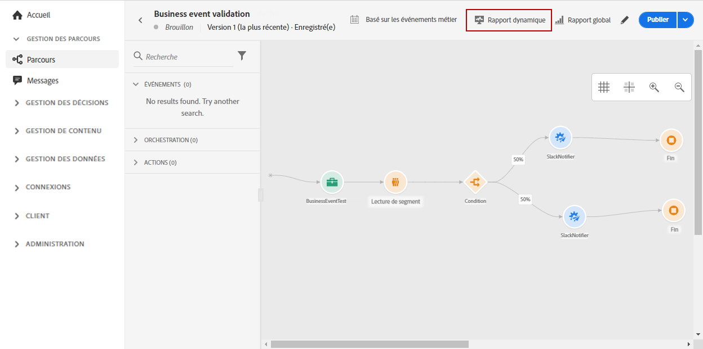
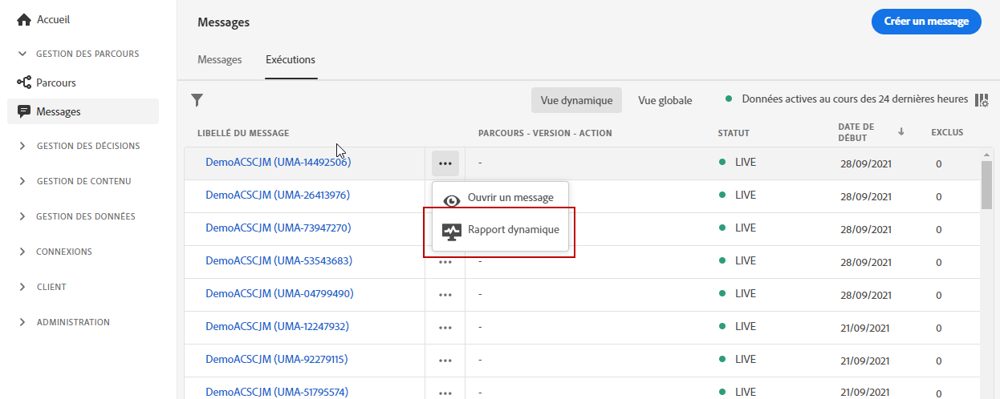
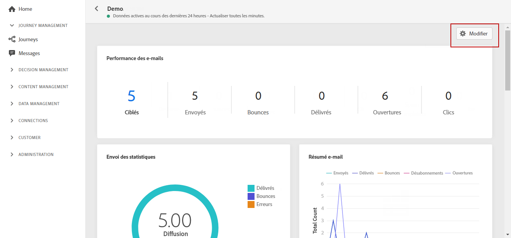
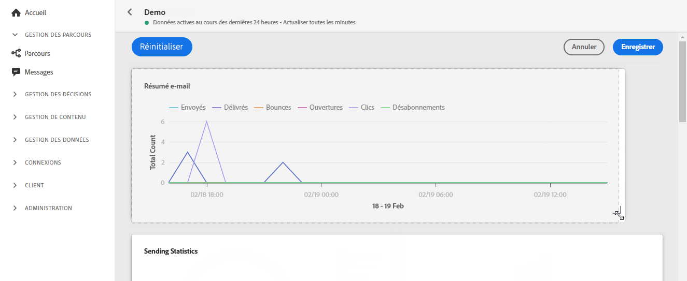
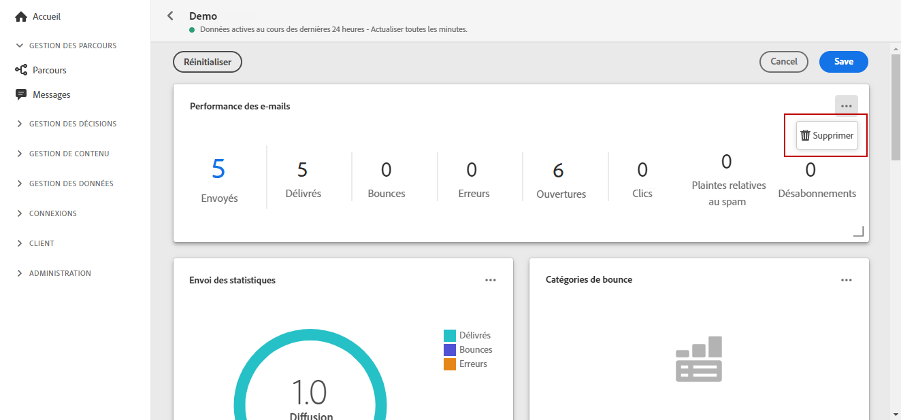

# Rapport en direct {#live-report}

Le **[!UICONTROL rapport en direct]** vous permet de mesurer et de visualiser en temps réel l&#39;efficacité de vos parcours et de vos performances de messages avec un tableau de bord intégré.
Les données de vos diffusions seront disponibles dans le rapport **[!UICONTROL En direct]** dès que votre diffusion ou parcours sera exécuté.

* Si vous souhaitez cible un ou plusieurs parcours dans un parcours, dans le menu **[!UICONTROL Parcours]**, accédez à votre parcours et cliquez sur l&#39;icône **[!UICONTROL Rapport dynamique]**. Vous trouverez ensuite les rapports en direct Parcours, Courrier électronique et Push.

   

* Si vous souhaitez cible une diffusion spécifique, dans l&#39;onglet **[!UICONTROL vue en direct]** **[!UICONTROL Exécutions]** de vos messages, sélectionnez **[!UICONTROL Rapport en direct]** dans le menu avancé de votre diffusion sélectionnée.

   

## Modifier le tableau de bord {#modify-dashboard}

Chaque tableau de bord de rapports peut être modifié en redimensionnant ou en supprimant des widgets. La modification des widgets n’affecte que le tableau de bord de l’utilisateur actuel. Les autres utilisateurs verront leurs propres tableaux de bord ou ceux définis par défaut.

1. Dans le rapport en direct, cliquez sur **[!UICONTROL Modifier le tableau de bord]**.

   

1. Ajustez la taille des widgets en faisant glisser son coin inférieur droit.

   

1. Cliquez sur **[!UICONTROL Supprimer]** pour supprimer d&#39;autres widgets dont vous n&#39;avez pas besoin de suivre les rebonds.

   

1. Une fois satisfait de l’ordre d’affichage et de la taille de vos widgets, cliquez sur **[!UICONTROL Enregistrer]**.

Votre tableau de bord est maintenant enregistré. Vos différentes modifications seront réappliquées pour une utilisation ultérieure de vos rapports en direct. Si nécessaire, utilisez l&#39;option **[!UICONTROL Réinitialiser]** pour restaurer l&#39;ordre des widgets et widgets par défaut.
