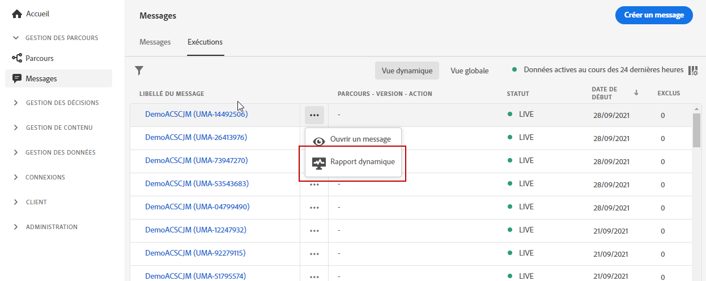

# Prise en main du rapport dynamique {#live-report}

Utilisez le **[!UICONTROL rapport dynamique]** pour mesurer et visualiser en temps réel l’impact et les performances de vos parcours et de vos messages dans un tableau de bord natif.
Les données sont disponibles dans le **[!UICONTROL rapport dynamique]** dès que votre diffusion est envoyée ou que votre parcours est exécuté.

* Si vous souhaitez cibler un parcours ou des diffusions dans le contexte d&#39;un parcours, dans le menu **[!UICONTROL Parcours]**, accédez à votre parcours et cliquez sur l&#39;icône **[!UICONTROL Rapport dynamique]**. Vous trouverez alors les rapports dynamiques Parcours, Email et Push.

   

* Si vous souhaitez cibler une diffusion spécifique, dans l’**[!UICONTROL Affichage dynamique]** de l’onglet **[!UICONTROL Exécutions]** de vos messages, sélectionnez **[!UICONTROL Rapport dynamique]** dans le menu avancé de la diffusion sélectionnée.

   

* Si vous souhaitez basculer du **[!UICONTROL Rapport dynamique]** au **[!UICONTROL Rapport global]** pour votre diffusion, cliquez sur **[!UICONTROL Vue globale]** dans le sélecteur d&#39;onglets.

   

## Personnalisation du tableau de bord {#modify-dashboard}

Vous pouvez modifier chaque tableau de bord de reporting en redimensionnant ou en supprimant des widgets. La modification des widgets n’a un impact que sur le tableau de bord de l’utilisateur actuel. Les autres utilisateurs voient leurs propres tableaux de bord ou ceux définis par défaut.

1. Choisissez si vous souhaitez exclure les événements de test de vos rapports avec la barre de bascule. Pour plus d’informations sur les événements de test, consultez [cette page](../building-journeys/testing-the-journey.md).

   Notez que l&#39;option **[!UICONTROL Exclure les événements de test]** n&#39;est disponible que pour les rapports de parcours.

   

1. Pour redimensionner ou supprimer des widgets, cliquez sur **[!UICONTROL Modifier]**.

   

1. Ajustez la taille des widgets en faisant glisser leur coin inférieur droit.

   

1. Cliquez sur **[!UICONTROL Supprimer]** pour supprimer tout widget dont vous n’avez pas besoin.

   

1. Une fois satisfait de l&#39;ordre d&#39;affichage et de la taille de vos widgets, cliquez sur **[!UICONTROL Enregistrer]**.

Votre tableau de bord est maintenant enregistré. Vos différentes modifications seront réappliquées pour une utilisation ultérieure de vos rapports dynamiques. Si nécessaire, utilisez l’option **[!UICONTROL Réinitialiser]** pour restaurer les widgets par défaut et leur ordre.
