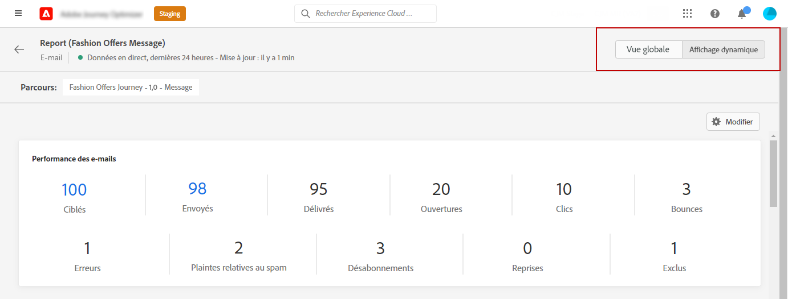

# Prise en main du rapport dynamique {#live-report}

Utilisez le **[!UICONTROL rapport dynamique]** pour mesurer et visualiser en temps réel l’impact et les performances de vos parcours et de vos messages dans un tableau de bord natif.
Les données sont disponibles dans le **[!UICONTROL rapport dynamique]** aussitôt que votre diffusion est envoyée ou que votre parcours est exécuté dans l’onglet **[!UICONTROL Dernières 24 heures]**.

* Si vous souhaitez cibler un parcours dans le contexte d’un parcours, dans le menu **[!UICONTROL Parcours]**, accédez à votre parcours et cliquez sur le bouton **[!UICONTROL Afficher le rapport]**.

   

* Si vous souhaitez cibler une campagne, dans le menu **[!UICONTROL Campagnes]**, accédez à votre campagne et cliquez sur le bouton **[!UICONTROL Rapports]**.

   

* Si vous souhaitez passer du **[!UICONTROL rapport global]** au **[!UICONTROL rapport dynamique]** pour votre diffusion, cliquez sur **[!UICONTROL Dernières 24 heures]** dans le sélecteur d’onglets.

   

Pour obtenir la liste détaillée de chaque mesure disponible dans Adobe Journey Optimizer, reportez-vous à [cette page](#list-of-components-live).

## Personnalisation du tableau de bord {#modify-dashboard}

Vous pouvez modifier chaque tableau de bord de reporting en redimensionnant ou en supprimant des widgets. La modification des widgets n’a un impact que sur le tableau de bord de l’utilisateur actuel. Les autres utilisateurs voient leurs propres tableaux de bord ou ceux définis par défaut.

1. Choisissez si vous souhaitez exclure les événements de test de vos rapports avec la barre de bascule. Pour plus d’informations sur les événements de test, consultez [cette page](../building-journeys/testing-the-journey.md).

   Notez que l&#39;option **[!UICONTROL Exclure les événements de test]** n&#39;est disponible que pour les rapports de parcours.

   

1. Pour redimensionner ou supprimer des widgets, cliquez sur **[!UICONTROL Modifier]**.

   

1. Ajustez la taille des widgets en faisant glisser leur coin inférieur droit.

   

1. Cliquez sur **[!UICONTROL Supprimer]** pour supprimer tout widget dont vous n’avez pas besoin.

   

1. Une fois satisfait de l&#39;ordre d&#39;affichage et de la taille de vos widgets, cliquez sur **[!UICONTROL Enregistrer]**.

Votre tableau de bord est maintenant enregistré. Vos différentes modifications seront réappliquées pour une utilisation ultérieure de vos rapports dynamiques. Si nécessaire, utilisez l’option **[!UICONTROL Réinitialiser]** pour restaurer les widgets par défaut et leur ordre.

## Liste des composants {#list-of-components-live}

Les tableaux ci-dessous contiennent la liste des mesures utilisées dans les différents rapports et leur définition en fonction du type de diffusion.

### Mesures de parcours {#journey-metrics}

<table> 
 <thead> 
  <tr> 
   <th> Mesure  </th> 
   <th> Définition  </th> 
</tr>
 </thead> 
 <tbody> 
  <tr> 
   <td>Actions exécutées avec succès  </td> 
   <td> Nombre total d’actions exécutées avec succès pour un parcours.  </td> 
</tr> 
  <tr> 
   <td> Profils ayant accédé à l’entrée  </td> 
   <td> Nombre total de personnes ayant atteint l’événement d’entrée du parcours.  </td> 
</tr>
  <tr> 
   <td> Erreur lors de l’action  </td> 
   <td>Nombre total d’erreurs qui se sont produites lors des actions.  </td> 
</tr> 
  <tr> 
   <td> Profils ayant quitté le parcours  </td> 
   <td> Nombre total de personnes qui ont quitté le parcours.  </td> 
</tr> 
  <tr> 
   <td> Parcours individuel ayant échoué  </td> 
   <td> Nombre total de parcours individuels qui n’ont pas été exécutés avec succès.  </td> 
</tr> 
 </tbody> 
</table>

### Mesures des e-mails et SMS   {#email-and-sms-metrics}

<table> 
 <thead> 
  <tr> 
   <th> Mesure  </th> 
   <th> Définition  </th> 
</tr>
 </thead> 
 <tbody>
  <tr> 
   <td> Bounces  </td> 
   <td> Nombre total d’erreurs comptabilisées lors de la diffusion et du traitement automatique des retours.  </td> 
</tr> 
  <tr> 
   <td> Taux de rebond  </td> 
   <td> Pourcentage d’e-mails ayant fait l’objet d’un rebond par rapport aux e-mails envoyés.  </td> 
</tr>
  <tr> 
   <td> Clics  </td> 
   <td> Nombre de fois où un contenu a fait l’objet d’un clic dans un e-mail.  </td> 
</tr> 
  <tr> 
   <td> Diffusés   </td> 
   <td> Nombre de messages envoyés avec succès. </td> 
</tr> 
  <tr> 
   <td> Taux de diffusion  </td> 
   <td> Pourcentage de messages envoyés avec succès.  </td> 
</tr>
  <tr> 
   <td> Erreurs  </td> 
   <td> Nombre total d’erreurs survenues au cours d’une diffusion, l’empêchant d’être envoyée à des profils.  </td> 
</tr> 
  <tr> 
   <td> Taux d’erreur  </td> 
   <td> Pourcentage d’erreurs survenues au cours d’une diffusion, l’empêchant d’être envoyée, par rapport aux e-mails envoyés.  </td> 
</tr>
  <tr> 
   <td> Exclus  </td> 
   <td> Nombre de profils qui ont été exclus par Adobe Journey Optimizer.  </td> 
</tr>
  <tr> 
   <td> Hard bounce  </td> 
   <td> Le nombre total d’erreurs permanentes, telles qu’une adresse e-mail incorrecte. Un message d'erreur indique explicitement que l'adresse n'est pas valide, comme Utilisateur inconnu.  </td>
</tr>
  <tr> 
   <td> Ignorés  </td> 
   <td> Nombre total d’erreurs temporaires, telles que l’absence du bureau, ou une erreur technique, par exemple si le type d’expéditeur est Postmaster.  </td> 
</tr>
   <tr> 
   <td>Taux de clics sur les offres  </td> 
   <td>Pourcentage d’utilisateurs ayant interagi avec l’offre.  </td> 
</tr>
   <tr> 
   <td>Taux d’impression des offres  </td> 
   <td>Pourcentage d’offres ouvertes par rapport au nombre d’offres envoyées.  </td> 
</tr>
   <tr> 
   <td>Nom de l’offre  </td> 
   <td> Nom de l’offre ajoutée dans la diffusion. Pour plus d’informations sur les emplacements, consultez cette <a href="../offers/offer-library/creating-personalized-offers.md">page</a>.  </td> 
</tr>
   <tr> 
   <td>Offre envoyée  </td> 
   <td>Nombre total d’envois pour l’offre.  </td> 
</tr> 
  <tr>
   <td>Ouvertures  </td> 
   <td> Nombre d’ouvertures du message.  </td> 
</tr> 
  <tr> 
   <td> Taux d’ouverture  </td> 
   <td> Nombre total de messages ouverts par rapport au nombre de messages diffusés.  </td> 
</tr>
  <tr> 
   <td>Nom de l’emplacement  </td> 
   <td> Nom de l’emplacement utilisé pour afficher votre offre. Pour plus d’informations sur les emplacements, consultez cette <a href="../offers/offer-library/creating-placements.md">page</a>. </td> 
</tr> 
  <tr> 
   <td> Reprises  </td> 
   <td> Nombre d’e-mails dans la file d’attente pour les reprises.  </td> 
</tr> 
  <tr> 
   <td> Envoyés  </td> 
   <td> Nombre total d’envois pour la diffusion.  </td> 
</tr>
  <tr> 
   <td> Soft bounce  </td> 
   <td> Nombre total d’erreurs temporaires, telles qu’une boîte de réception pleine.  </td> 
</tr>
  <tr> 
   <td> Plaintes contre le spam  </td> 
   <td> Nombre de fois où un message a été déclaré comme spam ou courrier indésirable.  </td> 
</tr>
  <tr> 
   <td> Ciblés  </td> 
   <td> Nombre total de messages traités lors de l’analyse de la diffusion.  </td> 
</tr> 
  <tr> 
   <td> Clics uniques  </td> 
   <td> Nombre de destinataires qui ont cliqué sur un contenu dans un e-mail.  </td> 
</tr> 
  <tr> 
   <td>Taux de clics uniques  </td> 
   <td> Pourcentage d’utilisateurs ayant interagi avec la diffusion.  </td> 
</tr>
  <tr> 
   <td> Ouvertures uniques  </td> 
   <td>Nombre de destinataires ayant ouvert la diffusion.  </td> 
</tr> 
  <tr> 
   <td> Désabonnements  </td> 
   <td> Nombre de clics sur le lien de désabonnement.  </td> 
</tr> 
 </tbody> 
</table>

### Mesures de page de destination {#landing-page-metrics}

<table> 
 <thead> 
  <tr> 
   <th> Mesure  </th> 
   <th> Définition  </th> 
</tr>
 </thead> 
 <tbody>
 <tr> 
  <td>Rebonds  </td> 
   <td>Nombre de personnes qui n’ont pas interagi avec la page de destination et n’ont pas effectué l’action d’inscription.  </td> 
</tr>
 <tr>
  <tr> 
   <td>Clics  </td> 
   <td>Nombre de clics sur un contenu de la page de destination.  </td> 
</tr>
<tr>
<td>Conversion  </td> 
   <td>Nombre de personnes ayant interagi avec la page de destination, par exemple celles qui se sont inscrites à un formulaire.  </td> 
</tr>
 <tr> 
   <td>Parcours  </td> 
   <td>Nombre de visites sur votre page de destination provenant dʼun parcours.  </td> 
</tr>
 <tr> 
   <td>Autres sources  </td> 
   <td>Nombre de visites de votre page de destination provenant d’une source externe au lieu d’un parcours.  </td> 
</tr>
 <tr> 
   <td>Nombre total de visites  </td> 
   <td> Nombre total de visites sur votre page de destination provenant de parcours et de sources externes, y compris les visites multiples dʼun seul destinataire.  </td> 
</tr>
 <tr> 
   <td>Visiteurs uniques  </td> 
   <td>Nombre de personnes ayant visité votre page de destination, les visites multiples dʼun même destinataire ne sont pas prises en compte.  </td> 
</tr>
 <tr> 
   <td>Visites  </td> 
   <td>Nombre de visites sur votre page de destination, y compris les visites multiples d’un seul destinataire.  </td> 
</tr>
 </tbody> 
</table>

### Mesures des notifications push {#push-notification-metrics}

<table> 
 <thead> 
  <tr> 
   <th> Mesure  </th> 
   <th> Définition  </th> 
</tr>
 </thead> 
 <tbody>
 <tr> 
   <td>Actions  </td> 
   <td> Nombre total d’actions sur la notification push diffusée, par exemple clic sur un bouton ou rejet.  </td> 
</tr>
  <tr> 
   <td>Rebonds  </td> 
   <td> Nombre total d’erreurs comptabilisées lors de la diffusion et du traitement automatique des retours.  </td> 
</tr> 
  <tr> 
   <td> Diffusés  </td> 
   <td> Nombre de messages envoyés avec succès.  </td> 
</tr> 
  <tr> 
   <td>Engagements  </td> 
   <td> Nombre total d’ouvertures et d’actions pour cette notification push, c’est-à-dire si le profil a ouvert la notification push ou si un utilisateur a cliqué sur un bouton.  </td> 
</tr> 
  <tr> 
   <td> Erreurs  </td> 
   <td> Nombre total d’erreurs survenues au cours d’une diffusion, l’empêchant d’être envoyée à des profils.  </td> 
</tr>
  <tr> 
   <td> Exclus  </td> 
   <td> Nombre de profils qui ont été exclus par Adobe Journey Optimizer.  </td> 
</tr>
  <tr> 
   <td> Ouvertures  </td> 
   <td> Nombre total de notifications push diffusées sur l'appareil et ayant fait l'objet d'un clic par les utilisateurs ouvrant l'application. Cette mesure est similaire au Clic push, sauf qu'une Ouverture push ne sera pas déclenchée si la notification a été ignorée.  </td> 
</tr> 
  <tr> 
   <td> Envoyés  </td> 
   <td> Nombre total d’envois pour la diffusion.  </td> 
</tr> 
  <tr> 
   <td> Ciblés  </td> 
   <td> Nombre total de messages push traités lors de l’analyse de la diffusion.  </td> 
</tr>  
 </tbody> 
</table>

<!--
### In-app metrics {#inapp-metrics}
<table> 
 <thead> 
  <tr> 
   <th> Metric  </th> 
   <th> Definition  </th> 
</tr>
 </thead> 
 <tbody>
 <tr> 
   <td>Clicks  </td> 
   <td>Total number of recipients who interacted with the buttons included in the In-app message.  </td> 
</tr>
  <tr> 
   <td>Impressions  </td> 
   <td> Total number of In-app messages delivered to all users.  </td>
</tr>
  <tr> 
   <td>Unique impressions  </td> 
   <td>Number of unique users to whom the In-app message was delivered.  </td>
</tr>
 </tbody> 
</table>
-->