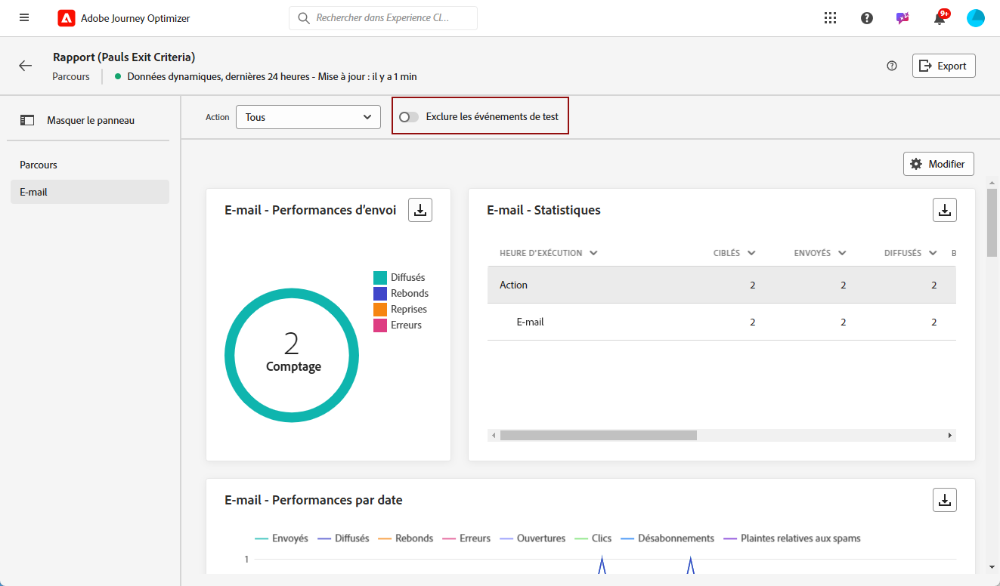
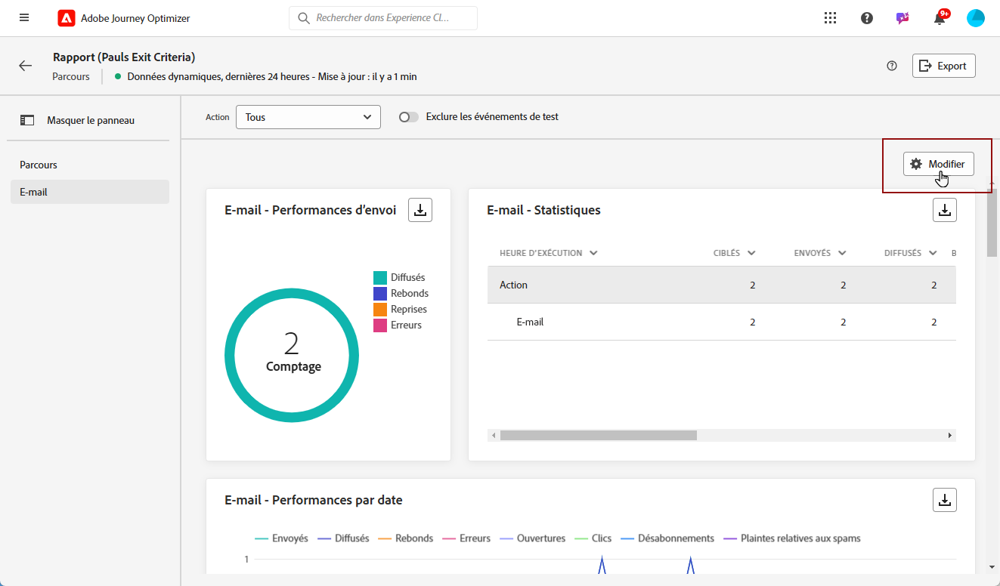
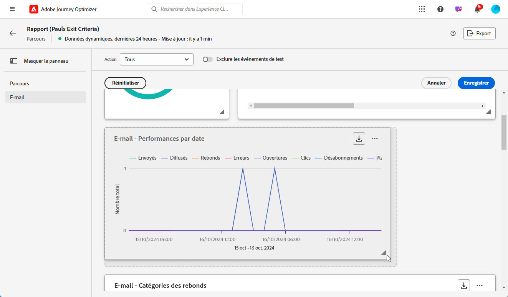
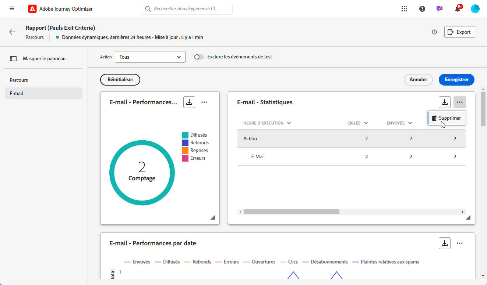
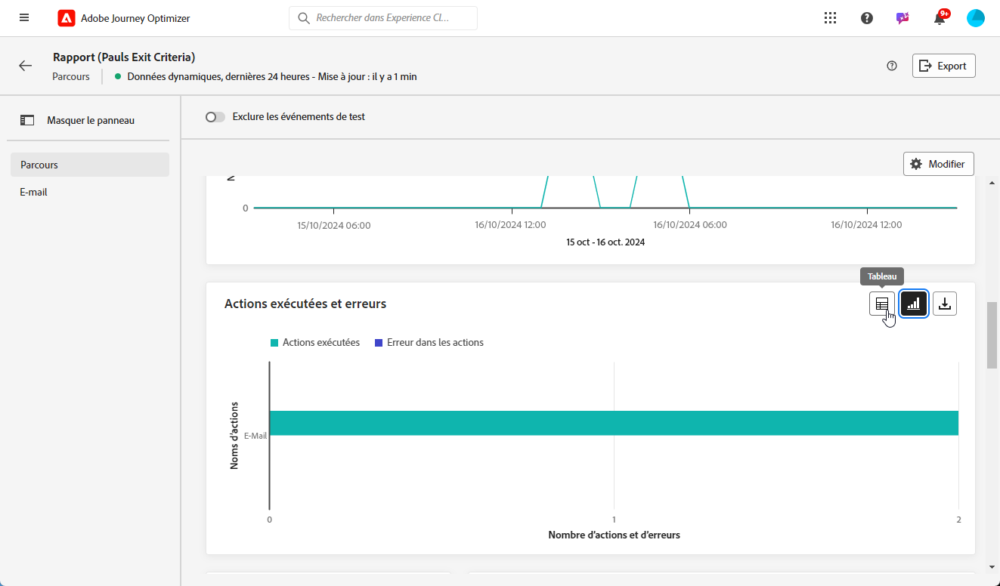
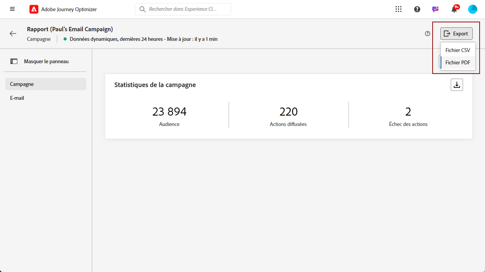
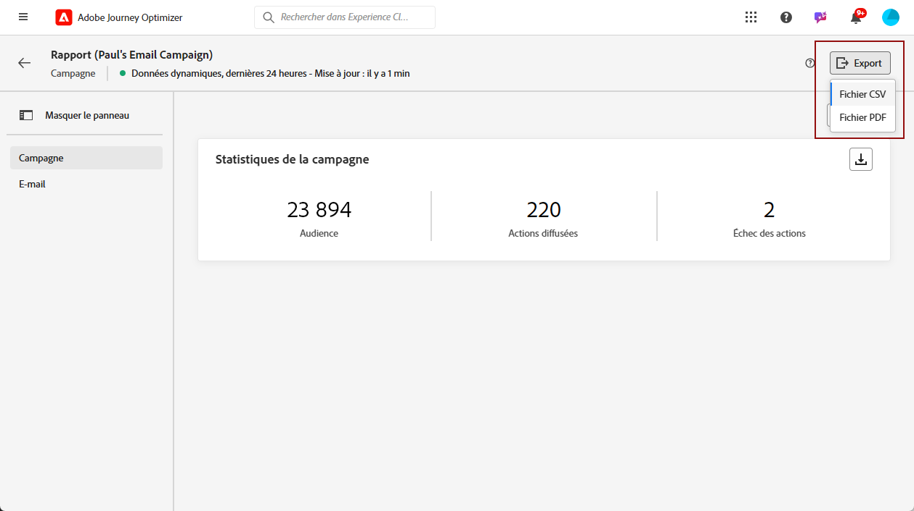
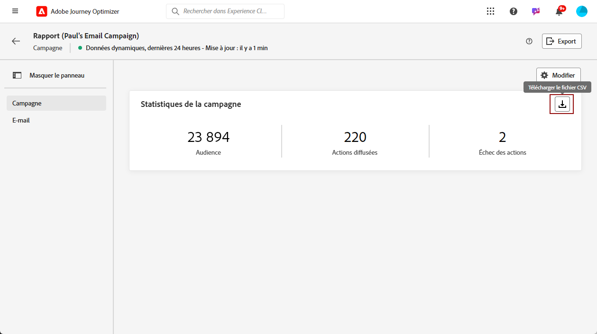

# Prise en main du rapport dynamique {#live-report}

Utilisez le **[!UICONTROL rapport dynamique]** pour mesurer et visualiser en temps réel l’impact et les performances de vos parcours et de vos messages dans un tableau de bord intégré. Les données sont disponibles dans le **[!UICONTROL rapport dynamique]** aussitôt que votre diffusion est envoyée ou que votre parcours est exécuté dans l’onglet **[!UICONTROL Dernières 24 heures]**.

* Si vous souhaitez cibler un parcours dans le contexte d’un parcours, dans le menu **[!UICONTROL Parcours]**, accédez au menu **[!UICONTROL Autres actions]** de votre parcours et cliquez sur le bouton **[!UICONTROL Afficher le rapport des dernières 24 heures]**.

  

* Si vous souhaitez cibler une campagne, dans le menu **[!UICONTROL Campagnes]**, accédez à votre campagne et cliquez sur le bouton **[!UICONTROL Rapports]**, puis sur **[!UICONTROL Afficher le rapport des dernières 24 heures]**.

  

Pour obtenir la liste détaillée de chaque mesure disponible dans Adobe Journey Optimizer, reportez-vous à [cette page](#list-of-components-live).

## Personnalisation du tableau de bord {#modify-dashboard}

Vous pouvez modifier chaque tableau de bord de reporting en redimensionnant ou en supprimant des widgets. La modification des widgets n’a un impact que sur le tableau de bord de l’utilisateur actuel. Les autres utilisateurs voient leurs propres tableaux de bord ou ceux définis par défaut.

1. Dans le menu déroulant **[!UICONTROL Actions]**, choisissez l’action spécifique des parcours sur laquelle établir des rapports.

1. Choisissez si vous souhaitez exclure les événements de test de vos rapports avec la barre de bascule. Pour plus d’informations sur les événements de test, consultez [cette page](../building-journeys/testing-the-journey.md).

   Notez que l&#39;option **[!UICONTROL Exclure les événements de test]** n&#39;est disponible que pour les rapports de parcours.

   

1. Pour redimensionner ou supprimer des widgets, cliquez sur **[!UICONTROL Modifier]**.

   

1. Ajustez la taille des widgets en faisant glisser leur coin inférieur droit.

   

1. Cliquez sur **[!UICONTROL Supprimer]** pour supprimer tout widget dont vous n’avez pas besoin.

   

1. Une fois satisfait de l&#39;ordre d&#39;affichage et de la taille de vos widgets, cliquez sur **[!UICONTROL Enregistrer]**.

1. Pour personnaliser l’affichage de vos données, basculez entre les différentes options de visualisation disponibles, telles que les graphiques, les tableaux et les graphiques en anneau.

   

Votre tableau de bord est maintenant enregistré. Vos différentes modifications seront réappliquées pour une utilisation ultérieure de vos rapports dynamiques. Si nécessaire, utilisez l’option **[!UICONTROL Réinitialiser]** pour restaurer les widgets par défaut et leur ordre.

## Exporter vos rapports {#export-reports}

Vous pouvez facilement exporter vos différents rapports au format PDF ou CSV, ce qui vous permet de les partager ou de les imprimer.

>[!BEGINTABS]

>[!TAB Exporter votre rapport sous la forme d’un fichier PDF]

1. Dans votre rapport, cliquez sur **[!UICONTROL Exporter]** et sélectionnez **[!UICONTROL Fichier PDF]**.

   

1. Dans la fenêtre Imprimer, configurez votre document selon vos besoins. Notez que les options peuvent varier en fonction de votre navigateur.

1. Choisissez d’imprimer ou d’enregistrer votre rapport en tant que PDF.

1. Localisez le dossier dans lequel vous souhaitez enregistrer votre fichier, renommez-le si nécessaire, puis cliquez sur Enregistrer.

Votre rapport peut maintenant être affiché ou partagé dans un fichier PDF.

>[!TAB Exporter votre rapport sous la forme d’un fichier CSV]

1. Dans votre rapport, cliquez sur **[!UICONTROL Exporter]** et sélectionnez **[!UICONTROL Fichier CSV]** pour générer un fichier CSV au niveau du rapport global.

   

1. Vous pouvez également choisir d’exporter des données à partir d’un widget spécifique. Cliquez sur **[!UICONTROL Charger le fichier CSV]** en regard du widget sélectionné.

   

1. Votre fichier est automatiquement téléchargé et peut se trouver dans vos fichiers locaux.

   Si vous avez généré le fichier au niveau du rapport, il contient des informations détaillées pour chaque widget, notamment son titre et ses données.

   Si vous avez généré le fichier au niveau du widget, il fournit spécifiquement des données pour le widget sélectionné.

>[!ENDTABS]
