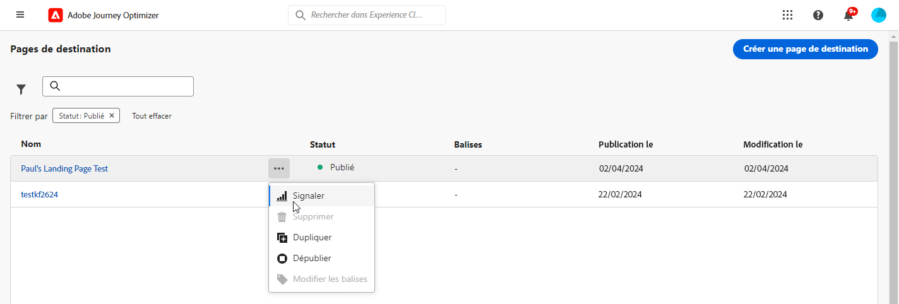
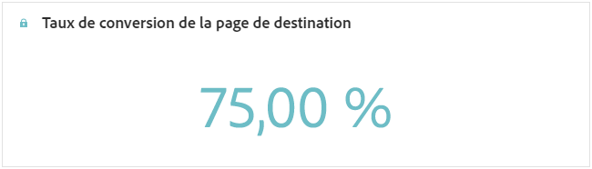
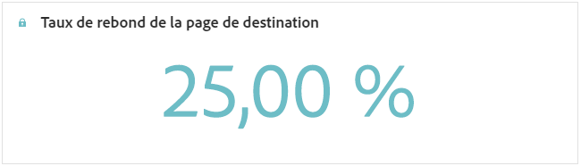
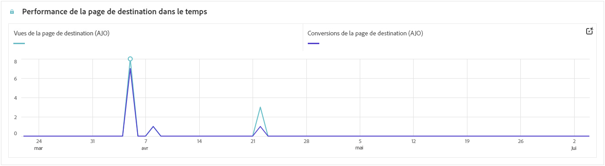
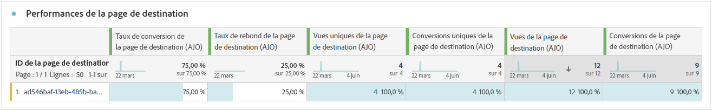

# Rapport sur les pages de destination {#lp-report-global-cja}

Le rapport **Page de destination** offre des informations précieuses sur le comportement des utilisateurs et des utilisatrices, les modèles d’engagement, les taux de conversion et d’autres mesures essentielles, vous aidant à prendre des décisions éclairées et à optimiser les performances de votre page de destination.

Pour accéder à vos rapports, sélectionnez **[!UICONTROL Rapport]** dans le menu avancé de la page de destination sélectionnée.

Pour en savoir plus sur Customer Journey Analytics Workspace, sur le filtrage et l’analyse des données, consultez [cette page](https://experienceleague.adobe.com/fr/docs/analytics-platform/using/cja-workspace/home).

## Taux de conversion de la page de destination {#lp-conversion}

Le KPI **[!UICONTROL Taux de conversion de la page de destination]** vous permet d’évaluer l’efficacité de votre page de destination en fonction du nombre de visites et d’interactions.

* **[!UICONTROL Taux de conversion de la page de destination]** : nombre de personnes ayant interagi avec la page de destination, par exemple le nombre de personnes inscrites à un formulaire par rapport au nombre total de visites.

## Taux de rebond de la page de destination {#lp-bounce-rate}

Le KPI **[!UICONTROL Taux de rebond de la page de destination]** fournit des informations sur les profils qui ont consulté votre page de destination sans interagir ni cliquer sur aucun élément.

* **[!UICONTROL Taux de rebond de la page de destination]** : nombre de personnes nʼayant pas interagi avec votre page de destination et nʼayant pas choisi de sʼinscrire, par rapport au nombre total de visites.

## Vues de la page de destination {#lp-views}

Le KPI **[!UICONTROL Vues de la page de destination]** vous permet de voir l’impact de votre page de destination.

* **[!UICONTROL Vues de la page de destination]** : nombre total de visites sur votre page de destination provenant de parcours et de sources externes, y compris les visites multiples dʼun seul profil.

## Vues uniques de la page de destination {#lp-unique-views}

Le KPI **[!UICONTROL Vues uniques de la page de destination]** vous permet de mesurer l’impact de votre page de destination en excluant les multiples vues d’un même profil.

* **[!UICONTROL Vues uniques de la page de destination]** : nombre de personnes ayant visité votre page de destination, les visites multiples dʼun même profil ne sont pas prises en compte.

## Performances des pages de destination dans le temps {#lp-performance-overtime}

Le graphe **[!UICONTROL Performances des pages de destination dans le temps]** mesure le succès de votre page de destination et son impact sur votre audience cible.

* **[!UICONTROL Vues de la page de destination]** : nombre total de visites sur votre page de destination provenant de parcours et de sources externes, y compris les visites multiples dʼun seul profil.

* **[!UICONTROL Conversion de la page de destination]** : nombre de personnes ayant interagi avec la page de destination, par exemple le nombre de personnes inscrites à un formulaire par rapport au nombre total de visites.

## Performances des pages de destination {#lp-performance}

Le tableau **[!UICONTROL Performances des pages de destination]** constitue un tableau de bord complet, offrant une ventilation détaillée des mesures clés concernant votre page de destination.

* **[!UICONTROL Taux de conversion de la page de destination]** : nombre de personnes ayant interagi avec la page de destination, par exemple le nombre de personnes inscrites à un formulaire par rapport au nombre total de visites.

* **[!UICONTROL Taux de rebond de la page de destination]** : nombre de personnes nʼayant pas interagi avec votre page de destination et nʼayant pas choisi de sʼinscrire, par rapport au nombre total de visites.

* **[!UICONTROL Vues uniques de la page de destination]** : nombre de personnes ayant visité votre page de destination, les visites multiples dʼun même profil ne sont pas prises en compte.

* **[!UICONTROL Conversion unique de la page de destination]** : nombre de personnes ayant interagi avec la page de destination, sans prendre en compte les interactions multiples dʼun même profil.

* **[!UICONTROL Vues de la page de destination]** : nombre total de visites sur votre page de destination provenant de parcours et de sources externes, y compris les visites multiples dʼun seul profil.

* **[!UICONTROL Conversions de la page de destination]** : nombre de personnes ayant interagi avec la page de destination, par exemple celles qui se sont inscrites à un formulaire.

## Parcours {#lp-journeys}

Le tableau **[!UICONTROL Parcours]** fournit une vue d’ensemble complète, détaillant la fréquence des visites sur votre page de destination dans le contexte du parcours d’un utilisateur ou d’une utilisatrice. Cette analyse approfondie offre des informations précieuses sur les interactions des utilisateurs et des utilisatrices, vous aidant à comprendre la manière dont ces personnes parcourent votre site et interagissent avec votre contenu.

* **[!UICONTROL Vues de la page de destination]** : nombre total de visites sur votre page de destination provenant de parcours et de sources externes, y compris les visites multiples dʼun seul profil.

* **[!UICONTROL Conversions de la page de destination]** : nombre de personnes ayant interagi avec la page de destination, par exemple celles qui se sont inscrites à un formulaire.

## Campagnes {#lp-campaigns}

Le tableau **[!UICONTROL Campagnes]** fournit des informations sur le nombre de visites dirigées vers votre page de destination à la suite de campagnes spécifiques, offrant ainsi une vue complète de l’efficacité de la campagne et de l’engagement avec le contenu de votre page de destination.

* **[!UICONTROL Vues de la page de destination]** : nombre total de visites sur votre page de destination provenant de parcours et de sources externes, y compris les visites multiples dʼun seul profil.

* **[!UICONTROL Conversions de la page de destination]** : nombre de personnes ayant interagi avec la page de destination, par exemple celles qui se sont inscrites à un formulaire.

## Canal {#lp-channels}

Le tableau **[!UICONTROL Canal]** affiche le nombre de visites sur votre page de destination classées par canal.

* **[!UICONTROL Vues de la page de destination]** : nombre total de visites sur votre page de destination provenant de parcours et de sources externes, y compris les visites multiples dʼun seul profil.

* **[!UICONTROL Conversions de la page de destination]** : nombre de personnes ayant interagi avec la page de destination, par exemple celles qui se sont inscrites à un formulaire.

## Principaux liens ayant fait l’objet d’un clic {#lp-top-clicked}

Le tableau **[!UICONTROL Principaux liens ayant fait l’objet d’un clic]** fournit des informations sur la manière dont les visiteurs et visiteuses interagissent avec la diffusion, en mettant en évidence les liens qui suscitent le plus d’intérêt et d’attention de la part de votre audience.

* **[!UICONTROL Clics de la page de destination]** : nombre de clics sur un contenu de la page de destination.
