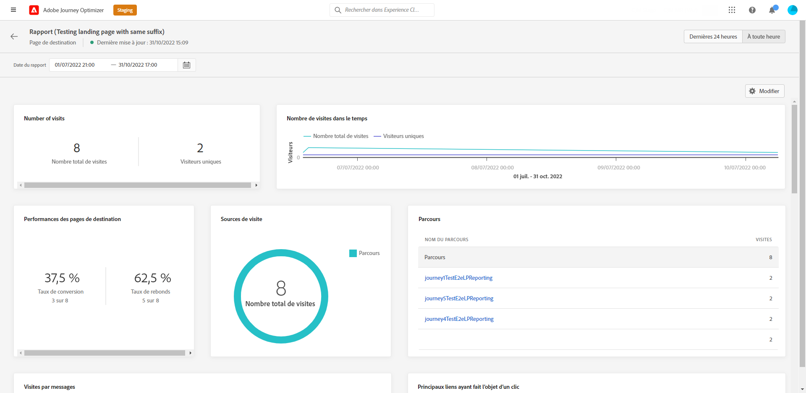

# Rapport global sur les pages de destination {#lp-report-global}

>[!CONTEXTUALHELP]
>id="ajo_landing_page_global_report"
>title="Rapport global sur les pages de destination"
>abstract="Le rapport global sur les pages de destination vous permet de mesurer l’efficacité de vos pages de destination au cours d’une période donnée. Le rapport se compose de plusieurs widgets présentant le succès et les erreurs de vos pages de destination. Vous pouvez modifier chaque tableau de bord de reporting en redimensionnant ou en supprimant des widgets."

>[!AVAILABILITY]
>
>L’expérience actuelle de création de rapports sera abandonnée à compter de janvier 2025. À partir de cette date, la nouvelle expérience de création de rapports deviendra la norme. Nous vous recommandons de vous familiariser avec les nouvelles fonctionnalités pour garantir une transition fluide. [Commencez avec la nouvelle interface de création de rapports de Journey Optimizer.](report-gs-cja.md)

Les rapports globaux, accessibles à partir de l’onglet À toute heure, affichent les événements qui se sont produits il y a au moins deux heures et couvrent les événements sur une période sélectionnée. En comparaison, les rapports dynamiques portent sur les événements qui se sont produits au cours des dernières 24 heures, avec un intervalle de temps minimal de deux minutes à compter de l’occurrence de l’événement.

Pour accéder à vos rapports, sélectionnez **[!UICONTROL Rapport]** dans le menu avancé de la page de destination sélectionnée.

Le **[!UICONTROL rapport global]** sur les pages de destination est divisé en différents widgets indiquant le succès et les erreurs de votre diffusion. Chaque widget peut être redimensionné et supprimé si nécessaire. Pour plus d&#39;informations à ce propos consultez cette [section](global-report.md).

+++En savoir plus sur les différents widgets et mesures disponibles pour le rapport global de la page de destination.

Les widgets **[!UICONTROL Nombre de visites]** et **[!UICONTROL Nombre de visites dans le temps]** vous permettent de mesurer l’impact de votre page de destination sur la période sélectionnée à lʼaide d’un graphique et de KPI comprenant les mesures suivantes :

* **[!UICONTROL Nombre total de visites]** : nombre total de visites sur votre page de destination provenant de parcours et de sources externes, y compris les visites multiples dʼun seul destinataire.

* **[!UICONTROL Visiteurs uniques]** : nombre de personnes ayant visité votre page de destination, les visites multiples dʼun même destinataire ne sont pas prises en compte.

Le widget **[!UICONTROL Performances de la page de destination]** présente les informations principales relatives à votre message au moyen des indicateurs clé de performance :

* **[!UICONTROL Taux de conversion]** : nombre de personnes ayant interagi avec la page de destination, par exemple le nombre dʼinscrits à un formulaire par rapport au nombre total de visites.

* **[!UICONTROL Taux de rebond]** : nombre de personnes nʼayant pas interagi avec la page de destination ni effectué lʼaction dʼinscription, par rapport au nombre total de visites.

Le widget **[!UICONTROL Sources des visites]** représente la façon dont les visiteurs accèdent à votre page de destination :

* **[!UICONTROL Parcours]** : nombre de visites sur votre page de destination provenant dʼun parcours.

* **[!UICONTROL Autres sources]** : nombre de visites de votre page de destination provenant d’une source externe au lieu d’un parcours.

Le widget **[!UICONTROL Principaux liens ayant fait l’objet d’un clic]** identifie lʼinteraction des visiteurs avec la diffusion :

* **[!UICONTROL Clics]** : nombre de clics sur un contenu de la page de destination.

* **[!UICONTROL Taux de clics]** : pourcentage de clics sur la page de destination.

Le widget **[!UICONTROL Parcours]** représente le nombre de visites sur votre page de destination à partir dʼun parcours :

* **[!UICONTROL Visites]** : nombre de visites sur votre page de destination, y compris les visites multiples d’un seul destinataire.

Le widget **[!UICONTROL Autres sources]** représente le nombre de visites sur votre page de destination à partir d’une source externe au lieu d’un parcours.

Les graphiques **[!UICONTROL Visites par messages]** / **[!UICONTROL Conversions par messages]** représentent le nombre total de visites et de personnes ayant interagi avec votre page de destination pendant la période concernée en fonction des messages envoyés.

Les graphiques **[!UICONTROL Visites par canaux]**/ **[!UICONTROL Conversions par canaux]** représentent le nombre total de visites et de personnes ayant interagi avec votre page de destination pendant la période concernée en fonction des canaux.
+++

Pour obtenir la liste détaillée de chaque mesure disponible dans Adobe Journey Optimizer, reportez-vous à [cette page](global-report.md#list-of-components-global).
