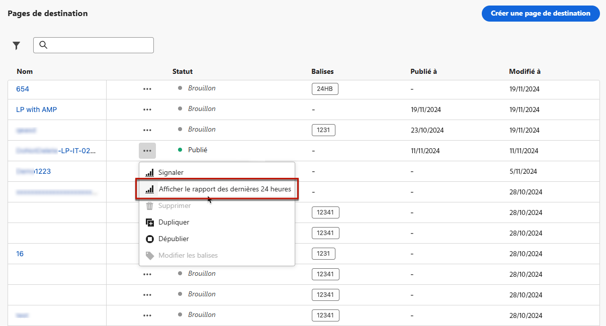

# Rapport dynamique sur les pages de destination {#lp-report-live}

>[!CONTEXTUALHELP]
>id="ajo_landing_page_live_report"
>title="Rapport dynamique sur les pages de destination"
>abstract="Le rapport dynamique sur les pages de destination vous permet de mesurer et de visualiser en temps réel l’efficacité et les performances de vos pages de destination (limité aux dernières 24 heures). Le rapport se compose de plusieurs widgets présentant le succès et les erreurs de vos pages de destination. Vous pouvez modifier chaque tableau de bord de reporting en redimensionnant ou en supprimant des widgets."

Les rapports dynamiques, accessibles à partir de l’onglet Dernières 24 heures, affichent les événements qui se sont produits au cours des dernières 24 heures, avec un intervalle de temps minimal de deux minutes à compter de l’occurrence de l’événement. En comparaison, les rapports Customer Journey Analytics portent sur les événements qui se sont produits il y a au moins deux heures et couvrent les événements sur une période sélectionnée.

Pour accéder à vos rapports, sélectionnez **[!UICONTROL Afficher le rapport des dernières 24 heures]** dans le menu avancé de la page de destination sélectionnée.

Le **[!UICONTROL Rapport dynamique]** sur les pages de destination est divisé en différents widgets indiquant le succès et les erreurs de votre diffusion. Chaque widget peut être redimensionné et supprimé si nécessaire. Pour plus d&#39;informations à ce propos consultez cette [section](live-report.md).

+++En savoir plus sur les différents widgets et mesures disponibles pour le rapport dynamique de page de destination.

Le widget **[!UICONTROL Performances de la page de destination]** présente les informations principales relatives à votre message au cours des dernières 24 heures à l’aide de KPI :

* **[!UICONTROL Nombre total de visites]** : nombre total de visites sur votre page de destination à partir dʼun parcours ou dʼautres sources, y compris les visites multiples dʼun seul destinataire.

* **[!UICONTROL Conversions]** : nombre de personnes ayant interagi avec la page de destination, par exemple celles qui se sont inscrites à un formulaire.

* **[!UICONTROL Rebonds]** : nombre de personnes qui n’ont pas interagi avec la page de destination et n’ont pas effectué l’action d’inscription.

Le widget **[!UICONTROL Sources des visites]** représente la manière dont les visiteurs accèdent à votre page de destination :

* **[!UICONTROL Parcours]** : nombre de visites sur votre page de destination provenant dʼun parcours.

* **[!UICONTROL Autres sources]** : nombre de visites sur votre page de destination provenant d’une source externe au lieu d’un parcours.

Le widget **[!UICONTROL Principaux liens ayant fait l’objet d’un clic]** identifie lʼinteraction des visiteurs avec la page de destination :

* **[!UICONTROL Clics]** : nombre de clics sur un contenu de la page de destination.

Le widget **[!UICONTROL Parcours]** représente le nombre de visites sur votre page de destination à partir dʼun parcours.

Le widget **[!UICONTROL Autres sources]** représente le nombre de visites sur votre page de destination à partir d’une source externe au lieu d’un parcours.

Les graphiques **[!UICONTROL Visites par messages]** / **[!UICONTROL Conversions par messages]** représentent le nombre total de visites et de personnes ayant interagi avec votre page de destination au cours des dernières 24 heures, en fonction des messages envoyés.

Les graphiques **[!UICONTROL Visites par canaux]** / **[!UICONTROL Conversions par canaux]** représentent le nombre total de visites et de personnes ayant interagi avec votre page de destination au cours des dernières 24 heures, en fonction des canaux.
+++

Pour obtenir la liste détaillée de chaque mesure disponible dans Adobe Journey Optimizer, reportez-vous à [cette page](live-report.md#live-report).
